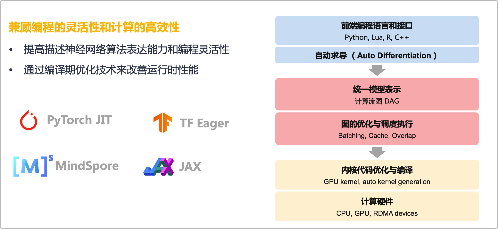
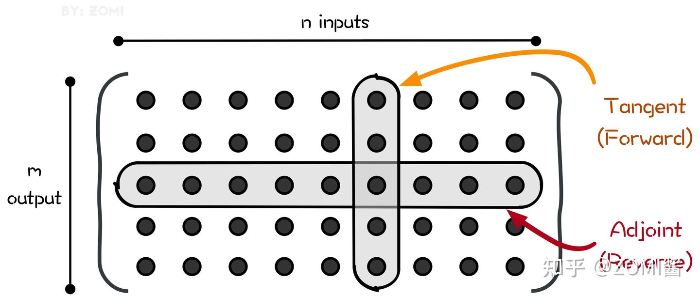
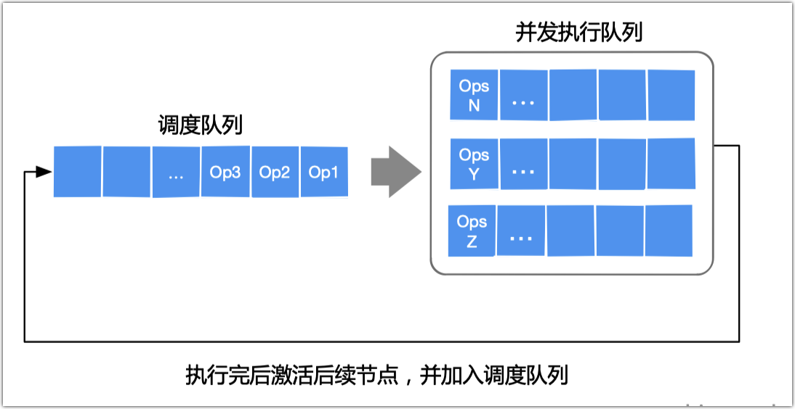
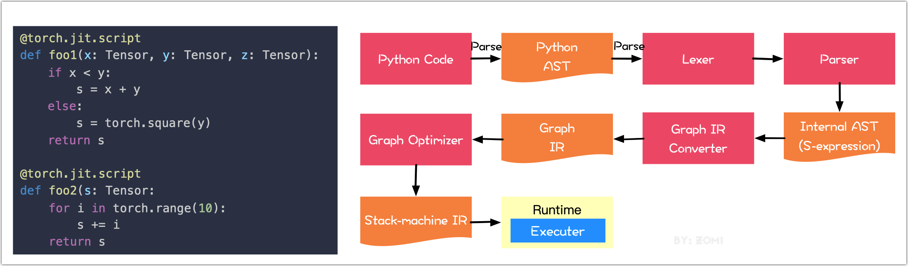
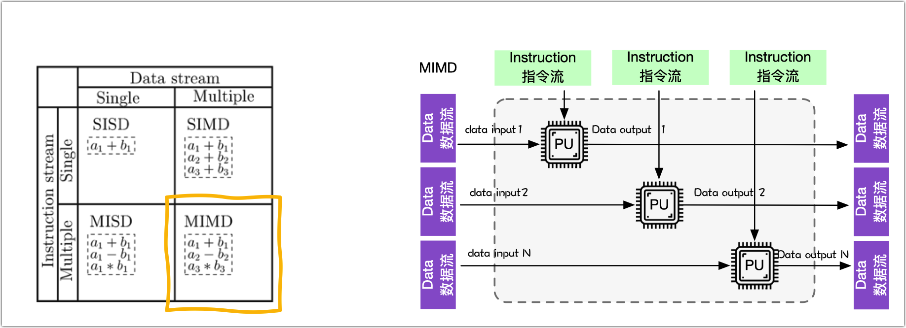
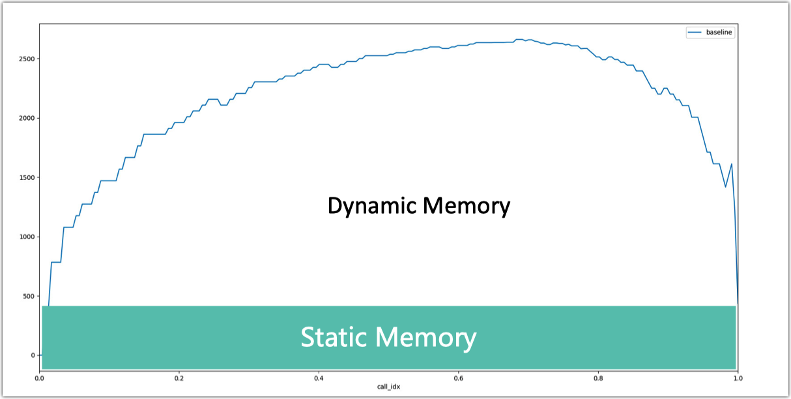

本笔记为ZOMI酱【AI框架】系列课程的笔记

课程视频：https://space.bilibili.com/517221395/channel/series

github：https://github.com/chenzomi12/DeepLearningSystem


✿✿ヽ(°▽°)ノ✿✿✿ヽ(°▽°)ノ✿✿✿ヽ(°▽°)ノ✿✿✿ヽ(°▽°)ノ✿✿✿ヽ(°▽°)ノ✿✿✿ヽ(°▽°)ノ✿✿✿ヽ(°▽°)ノ✿

---


AI系统里面，其实大部分开发者并不关心AI框架或者AI框架的前端，因为AI框架作为一个工具，最大的目标就是帮助更多的算法工程师快速实现他们的算法想法；另外一方面是帮助系统工程师，快速对算法进行落地部署和性能优化。

## 课程简介

- 《AI框架基础》主要是对AI框架的作用、发展、编程范式等散点进行汇总分享，让开发者能够知道AI框架与AI框架之间的差异和共同点，目前的AI框架主要的开发和编程方式。

- 其次，AI框架会默认提供自动微分功能，避免用户手动地去对神经网络模型求导，这些复杂的工作交给AI框架就好了，于是有了《自动微分》系列的内容。

- 有了AI框架，但实际上AI框架主要的职责是把深度学习的表达转换称为计算机能够识别的计算图，计算图作为AI框架中核心的数据结构，贯穿AI框架的整个生命周期，于是《计算图》这一章对于AI框架的前端核心模块就显得尤为重要。

- 最后是《分布式并行训练》，其实这一章可以单独成节，不过随着AI的发展，分布式训练、并行策略、AI集群、集群通信已经成为了AI框架的必配武器，所以也把分布式并行相关的内容作为AI框架前端的核心模块。

希望这个系列能够给大家、朋友们带来一些些帮助，也希望自己能够继续坚持完成所有内容哈！

## 课程目标

AI是最新的电力，大约在一百年前，我们社会的电气化改变了每个主要行业，从交通运输行业到制造业、医疗保健、通讯等方面，我认为如今我们见到了AI明显的令人惊讶的能量，带来了同样巨大的转变。显然，AI的各个分支中，发展的最为迅速的就是深度学习。因此现在，深度学习是在科技世界中广受欢迎的一种技巧。

通过《AI框架的核心模块》这个课程，以及这门课程后面的几门课程，你将获取并且掌握的技能：

| 编号 | 名称                          | 具体内容                                                     |
| :--: | :----------------------------: | :----------------------------------------------------------- |
|  1   | [AI框架基础](#一、AI框架基础) | 对AI框架的作用、发展、编程范式等散点进行汇总分享，让开发者能够知道AI框架与AI框架之间的差异和共同点，目前的AI框架主要的开发和编程方式。 |
|  2   | [自动微分](#二、自动微分) | AI框架会默认提供自动微分功能，避免用户手动地去对神经网络模型求导，这些复杂的工作交给AI框架就好了，于是自动微自然成为分作为AI框架的核心功能。 |
|  3   | [计算图](#三、计算图)       | 实际上，AI框架主要的职责是把深度学习的表达转换称为计算机能够识别的计算图，计算图作为AI框架中核心的数据结构，贯穿AI框架的大部分整个生命周期，于是计算图对于AI框架的前端核心技术就显得尤为重要。 |
|  4   | [分布式集群](#四、分布式集群)  | 随着AI集群的出现，越来越多的网络模型运行在集群上面，但是AI集群如何管理？如何通信？如何协同工作？AI框架如何支持分布式功能都需要我们去了解，才能更好地利用AI集群算力。 |
|  5   | [大模型算法](#五、大模型算法)     | 随着大模型的出现，越来越多的大模型算法涌现，特别是Transformer和MOE结构，引爆了千亿乃至万亿规模的大模型，新的AI算法奇点来了，AI工程师也需要了解最新的动态。 |
|  6   | [分布式并行](#六、分布式并行)   | 可是在AI集群，想要训练起千亿乃至万亿规模的大模型，谈何容易，于是出现了不同类型的分布式并行策略，目的是解决性能墙、内存墙、调优墙等并行问题，使的开发者能够真正让AI算法快速在AI集群上执行。 |

# 一、AI框架基础

1. 内容背景

AI框架的基础介绍

2. 具体内容

◦ AI框架作用：深度学习基础 – AI框架的作用 - AI框架的目的

◦ AI框架之争：第一代框架 – 第二代框架 – 第三代框架

◦ 编程范式：声明式编程 - 命令式编程


参考内容

- 漫谈什么是AI框架？ - ZOMI酱的文章 - 知乎 https://zhuanlan.zhihu.com/p/360885540


## 1.1 AI框架作用

**Review: Deep Learning Fundamentals**


**Few questions AI framework wants to answer**

• 前端（面向用户）：如何灵活的表达一个深度学习模型？

• 算子（执行计算）：如何保证每个算子的执行性能和泛化性？

• 求导（更新参数）：如何自动、高效地提供求导运算？

• 后端（系统相关）：如何将同一个算子跑在不同的加速设备上？

• 运行时：如何自动地优化和调度网络模型进行计算？


**The role of AI frameworks**


**AI Framework Propose**

提供灵活的编程模型和编程接口

<u>• 自动推导计算图</u>

<u>• 较好的支持与现有生态环境融合</u>

<u>• 提供直观的模型构建方式，简洁的神经网络计算编程语言</u>

提供高效和可扩展的计算能力

<u>• 自动编译优化算法（子表达式消除、内核融合、内存优化等!</u>

<u>• 根据不同体系结构和硬件设备自动并行化（自动分布式化、扩展多计算节点等!</u>


## 1.2 框架之争

### **Gen 1 pre-2010 **


### 过渡期：Caffe


局限性：

<u>灵活性的限制难以满足深度学习的快速发展</u>

- 层出不穷的新型网络结构 
- 新层需要重新实现前向和后向计算 
- 非高级语言实现，修改和定制化成本高 
- 新优化器要求对梯度和参数进行更通用复杂的运算

<u>基于简单的“前向+后向” 的训练模式难以满足新的训练模式</u>

- 循环神经网络需要引入控制流 
- 对抗神经网络需要两个网络交替训练 
- 强化学习模型需要和外部环境进行交互

### Gen 2 Present：Base DAG

基于数据流图（DAG）的计算框架


### Gen 3 Present：toward DSL

设计特定领域语言(Domain-Specific Language，DSL）



### Advances in AI frameworks


## 1.3 编程范式

编程范型、编程范式或程序设计法，是指软件工程中的一类典型的编程风格。常见的编程范型有：函数式编程、指令式编程、过程式编程、面向对象编程等等。 编程范型提供并决定了程序员对程序执行的看法。

### Imperative programming


### Declarative programming


### Fusion


# 二、自动微分

**1.** **课程背景**

AI框架中自动微分的重要性

**2.** **课程内容**

- 微分基本概念:数值微分 - 符号微分 - 自动微分 
- 自动微分模式:前向微分 – 后向微分 – 雅克比原理 
- 具体实现方式:表达式或图 – 操作符重载OO – 源码转换 AST 
- 手把手实现:基于表达式的前向自动微分 
- 手把手实现:基于OO的反向自动微分
- 自动微分的未来挑战


## 2.1 自动微分原理

自动微分（Automatic Differentiation，AD）是一种对计算机程序进行高效准确求导的技术，一直被广泛应用于计算流体力学、大气科学、工业设计仿真优化等领域。而近年来，机器学习技术的兴起也驱动着对自动微分技术的研究进入一个新的阶段。随着自动微分和其他微分技术研究的深入，其与编程语言、计算框架、编译器等领域的联系愈发紧密，从而衍生扩展出更通用的可微编程概念。

本章将从常见的微分方法开始介绍，然后深入自动微分基本概念。

### 常见计算机求导方法

对计算机程序求导的方法可以归纳为以下四种：

- 手动求解法(Manual Differentiation) ：完全手动完成，手工求导并编写对应的结果程序，依据链式法则解出梯度公式，带入数值，得到梯度。
- 数值微分法(Numerical Differentiation)：利用导数的原始定义，通过有限差分近似方法完成求导，直接求解微分值。
- 符号微分法(Symbolic Differentiation)：基于数学规则和程序表达式变换完成求导。利用求导规则对表达式进行自动计算，其计算结果是导函数的表达式而非具体的数值。即，先求解析解，然后转换为程序，再通过程序计算出函数的梯度。
- 自动微分法(Automatic Differentiation)：介于数值微分和符号微分之间的方法，采用类似有向图的计算来求解微分值，介于数值微分和符号微分之间的一种求导方法，也是本文介绍的重点。


#### 手动微分

手动微分就是对每一个目标函数都需要利用求导公式手动写出求导公式，然后依照公式编写代码，带入数值，求出最终梯度。

这种方法准确有效，但是不适合工程实现，因为通用性和灵活性很差，每一次我们修改算法模型，都要修改对应的梯度求解算法。如果模型复杂或者项目频繁反复迭代，那么工作量将会是巨大的。

#### 数值微分

数值微分方式应该是最直接而且简单的一种自动求导方式，使用差分近似方法完成，其本质是根据导数的定义推导而来。


当 $h$ 取很小的数值，比如 0.000001 时，导数是可以利用差分来近似计算出来的。只需要给出函数值以及自变量的差值，数值微分算法就可计算出导数值。单侧差分公式根据导数的定义直接近似计算某一点处的导数值。

观察导数的定义容易想到，当 $h$ 充分小时，可以用差商 $\frac{f(x+h)-f(x)}{h}$ 近似导数结果。而近似的一部分误差（<u>*截断误差*，Truncation Error</u>）可以由泰勒公式中的二阶及二阶后的所有余项给出：

.svg)

因此数值微分中常用的三种计算方式及其对应的截断误差可以归纳为三种。

- 向前差商（Forward Difference）：

.svg)

其中Forward Difference的阶段误差为$O(h)$。

- 向后差商（Reverse Difference）：

.svg)

其中Reverse Difference的阶段误差为$O(h)$。

- 中心差商（Center Difference）

.svg)

其中Center Difference的阶段误差为 $O(h^2)$。

可以看出来，数值微分中的截断误差与步长 $h$ 有关，$h$ 越小则截断误差越小，近似程序越高。

但实际情况数值微分的精确度并不会随着 $h$ 的减小而无限减小，因为计算机系统中对于浮点数的运算由于其表达方式存在另外一种误差（<u>*舍入误差*，Round-off Error</u>），而舍入误差则会随着 $h$ 变小而逐渐增大。因此在截断误差和舍入误差的共同作用下，数值微分的精度将会形成一个变化的函数并在某一个 $h$值处达到最小值。

为了缓解截断错误，提出了中心微分近似（Center Difference Approximation），这方法仍然无法解决舍入误差，只是减少误差，但是它比单侧差分公式有更小的误差和更好的稳定性：

.svg)


数值微分的优点是：

- 具有计算适用性，对大部分表达式适用
- 对用于显示地隐藏了求导过程
- 简单容易实现

数值微分的缺点是：

- 计算量大，求解速度最慢，因为每计算一个参数的导数，都需要重新计算。
- 引入误差，因为是数值逼近，所有会不可靠，不稳定的情况，无法获得一个相对准确的导数值。如果 h 选取不当，可能会得到与符号相反的结果，导致误差增大。尤其是两个严重问题：
- 截断错误（Truncation error）：在数值计算中 h 无法真正取零导致的近似误差。
- 舍入误差（Round-off Error）：在计算过程中出现的对小数位数的不断舍入会导致求导过程中的误差不断累积。

#### 符号微分

符号微分（Symbolic Differentiation）属符号计算的范畴，利用求导规则对表达式进行自动计算，其计算结果是导函数的表达式。符号计算用于求解数学中的公式解，得到的是解的表达式而非具体的数值。

符号微分适合符号表达式的自动求导，符号微分的原理是用下面的简单求导规则，对计算机程序中的表达式进行递归变换来完成求导替代手动微分：

.svg)

另外有：

.svg)

由于变换过程中并不涉及计算且是严格等价，因此其可以大大减小微分结果的误差（仅存在变换完成后计算过程中的舍入误差）。除此之外，符号微分的计算方式使其还能用于类似极值 $\frac{\delta}{\delta x}f(x)=0$ 的数学问题求解。

从某种角度看，这种递归思想和严格的程序变换让符号微分看上去是一种“完美”的计算过程。

符号微分利用代数软件，实现微分的一些公式，然后根据基本函数的求导公式以及四则运算、复合函数的求导法则，将公式的计算过程转化成微分过程，这样就可以对用户提供的具有closed form的数学表达式进行"自动微分"求解。就是先求解析解，然后转换为程序，再通过程序计算出函数的梯度。

符号微分计算出的表达式需要用字符串或其他数据结构存储，如表达式树。因为符号微分的这些优点，其也在包括 Mathematica、Maple、matlab、Maxima 等现代代数系统工具软件中使用。

但符号微分的最大弊病在于其对表达式的严格展开和变换也导致了所谓的表达式膨胀（expression swell）问题。以递归表达式为例：

.svg)


可以看到在不同的迭代中其符号微分的结果相比人工简化后的结果复杂很多，且随着迭代次数而增大。

符号微分的优点是：

- 精度高，可适用于更复杂的数学问题求解等场景
- 简单容易实现

符号微分的缺点是：

- 表达式必须是闭包（closed form），也就是必须能写成完整数学表达式的，不能有编程语言中的循环结构，条件结构等，这样才能将整个问题转换为一个纯数学符号问题
- 表达式复杂时候，求导结果存在表达式膨胀问题


### 自动微分

其实，<u>对于机器学习中的应用，不需要得到导数的表达式，而只需计算函数在某一点处的导数值。</u>

#### 基本原理

自动微分是介于数值微分和符号微分之间的方法，采用类似有向图的计算来求解微分值。

- 数值微分：一开始就直接代入数值近似求解
- 符号微分：直接对代数表达式求解析解，最后才代入数值进行计算
- 自动微分：<u>首先对基本算子（函数）应用符号微分方法，其次带入数值进行计算，保留中间结果，最后通过链式求导法将中间结果应用于整个函数，这样可以做到完全向用户隐藏微分求解过程，也可以灵活于编程语言的循环结构、条件结构等结合起来</u>

关于解析解我们还要做一些说明。几乎所有机器学习算法在训练或预测时都可以归结为求解最优化问题，如果目标函数可导，则问题就变为求训练函数的驻点。但是通常情况下我们无法得到驻点的解析解，因此只能采用数值优化算法，如梯度下降法，牛顿法，拟牛顿法等等。<u>这些数值优化算法都依赖于函数的一阶导数值或二阶导数值（包括梯度与Hessian矩阵）。因此需要解决如何求一个复杂函数的导数问题，自动微分技术是解决此问题的一种通用方法。</u>

由于自动微分法只对基本函数或常数运用符号微分法则，所以它可以灵活结合编程语言的循环结构，条件结构等。使用自动微分和不使用自动微分对代码总体改动非常小，<u>由于它实际是一种图计算，可以对其做很多优化，所以该方法在现代深度学习系统中得到广泛应用。</u>

#### 数学基础

在计算链式法则之前，我们先回顾一下复合函数。复合函数在本质上就是有关函数的函数（function of functions）。它将一个函数的返回值作为参数传递给另一个函数，并且将另一个函数的返回值作为参数再传递给下一个函数，也就是 函数套函数，把几个简单的函数复合为一个较为复杂的函数。

链式法则是微积分中的求导法则，用于求一个复合函数的导数，是在微积分的求导运算中一种常用的方法。复合函数的导数将是构成复合这有限个函数在相应点的 导数的乘积，就像锁链一样一环套一环，故称链式法则。

自动微分的思想则是将计算机程序中的运算操作分解为一个有限的基本操作集合，且集合中基本操作的求导规则均为已知在完成每一个基本操作的求导后，使用链式法则将结果组合得到整体程序的求导结果。

.svg)

比如求导：

.svg)

链式求导，令：

.svg)

有：

.svg)

#### 自动微分

自动微分的精髓在于它发现了微分计算的本质：微分计算就是一系列有限的可微算子的组合。

自动微分法被认为是对计算机程序进行非标准的解释。自动微分基于一个事实，即每一个计算机程序，不论它有多么复杂，都是在执行加减乘除这一系列基本算数运算，以及指数、对数、三角函数这类初等函数运算。于是自动微分先将符号微分法应用于最基本的算子，比如常数，幂函数，指数函数，对数函数，三角函数等，然后代入数值，保留中间结果，最后再通过链式求导法则应用于整个函数。

通过将链式求导法则应用到这些运算上，我们能以任意精度自动地计算导数，而且最多只比原始程序多一个常数级的运算。

我们以如下为例，这是原始公式：

.svg)

自动微分以链式法则为基础，把公式中一些部分整理出来成为一些新变量，然后用这些新变量整体替换这个公式，于是得到：

.svg)

然后把这些新变量作为节点，依据运算逻辑把公式整理出一张有向无环图（DAG）。即，原始函数建立计算图，数据正向传播，计算出中间节点 xi，并记录计算图中的节点依赖关系。

因此，自动微分可以被认为是将一个复杂的数学运算过程分解为一系列简单的基本运算， 其中每一项基本运算都可以通过查表得出来。

因此自动微分的优缺点可以简单总结如下：

- 优点：精度高，无表达式膨胀问题
- 缺点：需要存储一些中间求导结果，内存占用会增加

### 参考

[1] Automatic Differentiation in Machine Learning: a Survey: [https://arxiv.org/abs/1502.05767](https://link.zhihu.com/?target=https%3A//arxiv.org/abs/1502.05767)

[2] Rirchard L. Burden and J. Douglas Faires. Numerical Analysis. Brooks/Cole, 2001.

[3] Max E. Jerrell. Automatic differentiation and interval arithmetic for estimation of disequilibrium models. Computational Economics, 10(3):295–316, 1997.

[4] Johannes Grabmeier and Erich Kaltofen. Computer Algebra Handbook: Foundations, Applications, Systems. Springer, 2003.

[5] G. W. Leibniz. Machina arithmetica in qua non additio tantum et subtractio sed et multiplicatio nullo, diviso vero paene nullo animi labore peragantur. Hannover, 1685.

[6] George F. Corliss. Application of differentiation arithmetic, volume 19 of Perspectives in Computing, pages 127–48. Academic Press, Boston, 1988.

[7] Arun Verma. An introduction to automatic differentiation. Current Science, 78(7):804–7, 2000.

[8] Andreas Griewank and Andrea Walther. Evaluating Derivatives: Principles and Techniques of Algorithmic Differentiation. Society for Industrial and Applied Mathematics, Philadelphia, 2008. doi: 10.1137/1.9780898717761.

[9] John F. Nolan. Analytical differentiation on a digital computer. Master’s thesis, Massachusetts Institute of Technology, 1953.

[10] L. M. Beda, L. N. Korolev, N. V. Sukkikh, and T. S. Frolova. Programs for automatic differentiation for the machine BESM (in Russian). Technical report, Institute for Precise Mechanics and Computation Techniques, Academy of Science, Moscow, USSR, 1959.

[11] Robert E. Wengert. A simple automatic derivative evaluation program. Communications of the ACM, 7:463–4, 1964.

[12] Andreas Griewank. On automatic differentiation. pages 83–108, 1989.

[13] Hascoet, Laurent, and Valérie Pascual. "The Tapenade automatic differentiation tool: principles, model, and specification." ACM Transactions on Mathematical Software (TOMS) 39.3 (2013): 1-43.

[14] 知乎专栏：自动微分（Automatic Differentiation）: https://zhuanlan.zhihu.com/p/61103504

[15] 知乎专栏：数值计算方法 第六章 数值积分和数值微分: https://zhuanlan.zhihu.com/p/14

[16] 知乎专栏：技术分享 | 从自动微分到可微编程语言设计 https://zhuanlan.zhihu.com/p/393160344

[17] 博客园：深度学习利器之自动微分 [https://www.cnblogs.com/rossiXYZ/p/](https://link.zhihu.com/?target=https%3A//www.cnblogs.com/rossiXYZ/p/15395742.html)


## 2.2 自动微分的两种模式

上一篇文章我们简单了解了计算机中常用的几种微分方式。

本章将深入介绍AI框架离不开的核心功能自动微分，而自动微分则是分为前向微分和后向微分两种实现模式，不同的实现模式有不同的机制和计算逻辑，而无论哪种模式都离不开雅克比矩阵，所以我们也会深入了解一下雅克比矩阵的原理。

### 雅克比矩阵

在向量微积分中，Jacobian矩阵是一阶偏导数以一定方式排列成的矩阵，其行列式称为Jacobian行列式。Jacobian矩阵的重要性在于它体现了一个可微方程与给出点的最优线性逼近。

Jacobian矩阵表示两个向量所有可能的偏导数。它是一个向量相对于另一个向量的梯度，其实现的是 n维向量 到 m 维向量的映射。

在矢量运算中，Jacobian矩阵是基于函数对所有变量一阶偏导数的数值矩阵，当输入个数等于输出个数时又称为Jacobian行列式。

假设输入向量 ∈ ，而输出向量 ∈ ，则Jacobian矩阵定义为：


### **微分计算模式**

根据对分解后的基本操作求导和链式规则组合顺序的不同，自动微分可以分为两种模式：

- *前向模式*（Forward Automatic Differentiation，也叫做 tangent mode AD）或者前向累积梯度（前向模式）
- *反向模式*（Reverse Automatic Differentiation，也叫做 adjoint mode AD）或者说反向累计梯度（反向模式）。

#### 计算模式区别

两种自动微分模式都通过递归方式来求 dy/dx，只不过根据链式法则展开的形式不太一样。

前向梯度累积会指定从内到外的链式法则遍历路径，即先计算 dw_1/dx，再计算 dw_2/dw_1，最后计算 dy/dw_2，即，<u>前向模式是在计算图前向传播的同时计算微分。因此前向模式的一次正向传播就可以计算出输出值和导数值。</u>

.svg)

反向梯度累积正好相反，它会先计算dy/dw_2，然后计算 dw_2/dw_1，最后计算dw_1/dx。这是最为熟悉的反向传播模式，它非常符合**沿模型误差反向传播**这一直观思路。

即，反向模式需要对计算图进行一次正向计算， 得出输出值，再进行反向传播。反向模式需要保存正向传播的中间变量值（比如 ），这些中间变量数值在反向传播时候被用来计算导数，所以反向模式的内存开销要大。

-5756521.svg)

即如图所示，<u>前向自动微分（tangent mode AD）和后向自动微分（adjoint mode AD）分别计算了Jacobian矩阵的一列和一行。</u>



前向自动微分（tangent mode AD）可以在一次程序计算中通过链式法则，得到：

-5756537.svg)

递推得到Jacobian矩阵中与单个输入有关的参数，即Jacobian矩阵的一列。

后向自动微分（adjoint mode AD）利用链式法则，得到：

-5756557.svg)

可以仅通过一次对计算过程的遍历得到Jacobian矩阵的一行。但它的导数链式法则传递方向和程序执行方向相反，所以需要在程序计算过程中记录一些额外的信息来辅助求导，这些辅助信息包括计算图和计算过程的中间变量。

#### 样例

我们以公式为例，首先把它转换成一个计算图：

-5756575.svg)

- 输入变量 ：自变量维度为 n，这里 n = 2，输入变量就是 x1, x2
- 中间变量 ：中间变量这里是 v-1到 v5，在计算过程中，只需要针对这些中间变量做处理即可。将符号微分法应用于最基本的算子，然后代入数值，保留中间结果，最后再应用于整个函数
- 输出变量 ：假设输出变量维度为 m，这里 m = 1，输出变量就是 y1，也就是f(x1,x2)


转化成如上DAG（有向无环图）结构之后，我们可以很容易分步计算函数的值，并求取它每一步的导数值，然后，我们把 df/dx_1 求导过程利用链式法则表示成如下的形式：

-5756606.svg)

> 整个求导可以被拆成一系列微分算子的组合。

### 前向模式 Foward Mode

前向模式从计算图的起点开始，沿着计算图边的方向依次向前计算，最终到达计算图的终点。它根据自变量的值计算出计算图中每个节点的值 以及其导数值，并保留中间结果。一直得到整个函数的值和其导数值。整个过程对应于一元复合函数求导时从最内层逐步向外层求导。

同样，以公式为例子：

-5756613.svg)

面是前向模式的计算过程，下表中，左半部分是从左往右每个图节点的求值结果和计算过程，右半部分是每个节点对 x1的求导结果和计算过程。这里 ˙ 表示 对 1的偏导数。即：

-5756619.svg)

在该示例中，我们希望计算函数在x_1=2, x_2=5处的导数dy/dx1，即：

-5756625.svg)

可以看出，左侧是源程序分解后得到的基本操作集合，而右侧则是每一个基本操作根据已知的求导规则和链式法则由上至下计算的求导结果。


#### 计算过程

根据上图左边的Forward Primal Trace直接计算公式，对于节点数值的计算如下：

1. 我们给输入节点赋值，$v_{−1}=x_1=2，v_0=x_2=5$
2. 计算 $v_1$ 节点，$v_1=lnv_{−1}=lnx_1=ln2$
3. 计算 $v_2$ 节点，节点 $v_2$ 依赖于 $v_{-1}$ 和 $v_0$，$v_2=10$
4. 计算 $v_3$ 节点，$v_3=sinv_0=sin5$
5. 计算 $v_4$ 节点，$v_4=v_1+v_2=0.693+10$
6. 计算 $v_5$ 节点，$v_5=v_1+v_2=10.693+0.959$
7. 最终 $y=v_5=11.652$

此时，已经得到了图中所有节点的数值。自动微分正向模式中（上图右边Forward Tangent Trace），在计算节点数值的同时，也一起计算导数，假设求 $\delta y/ \delta x_1$，则是从输入开始计算。

1. 计算 $v_{-1}$ 节点对于 $x_1$ 的梯度：$v_{-1}=x_1$，所以 $\delta v_{-1}/ \delta x_1=1$
2. 计算 $v_0$ 节点对于 $x_1$ 的梯度：$v_0=x_2$，所以 $\delta v_0/ \delta x_1=0$
3. 计算 $v_{1}$ 节点对于 $x_1$ 的梯度：$\delta v_1/ \delta x_1=0.5$
4. 计算 $v_{2}$ 节点对于 $x_1$ 的梯度：$\delta v_{2}/ \delta x_1=(\delta v_{-1}/ \delta x_1)v_0+(\delta v_{0}/ \delta x_1)v_{-1}=5$
5. 计算 $v_{3}$ 节点对于 $x_1$ 的梯度：$\delta v_{3}/ \delta x_1=(\delta v_{0}/ \delta x_1)cosv_0=0$
6. 计算 $v_{4}$ 节点对于 $x_1$ 的梯度：$\delta v_{4}/ \delta x_1=\delta v_{1}/ \delta x_1+\delta v_{2}/ \delta x_1=0.5+5$
7. 计算 $v_{5}$ 节点对于 $x_1$ 的梯度：$\delta v_{5}/ \delta x_1=5.5=0$
8. 因此，得到 $\delta y/ \delta x_1=\delta v_{5}/ \delta x_1=5.5$

<u>从计算过程来看，自动微分的前向模式实际上与我们在微积分里所学的求导过程一致。</u>

#### 雅克比-向量矩阵

把上述过程当做雅克比矩阵求解问题，假设一个函数有 n 个输入变量 $x_i$，m个输入变量 $y_j$，即输入向量 $x \in R^n, y \in R^m$，则这个的映射是：

-5756634.svg)

在这种情况下，每个自动微分的前向传播计算时候，初始输入被设置为 $\dot{x_i}=1$，其余被设置为 0。对应Jacobian矩阵定义为：

-5756651.svg)

一次前向计算，可以求出Jacobian矩阵的一列数据，如 $\dot{x_3}=1$ 对应就可以求出来第3列。tangent mode AD可以在一次程序计算中，通过链式法则递推得到Jacobian矩阵中与单个输入有关的部分，即Jacobian矩阵的一列。

如下图所示，如果想用正向模式求对所有输入的导数，需要计算 n 次才能求出所有列。


进一步，设置 $\dot{x}=r$，可以在一次前向传播中直接计算 Jacobian–vector 乘积：

-5756665.svg)

最终我们可以递归的得到本次迭代的计算目标：雅克比矩阵中的第 i 行。

#### 优缺点

前向模式的优点：

- 实现起来很简单
- 也不需要很多额外的内存空间

向前模式的缺点：

- <u>每次前向计算只能计算对一个自变量的偏导数</u>，对于一元函数求导是高效的，但是机器学习模型的自参数（入参）数量级大。
- 如果有一个函数，其输入有 n 个，输出有 m个，对于每个输入来说，前向模式都需要遍历计算过程以得到当前输入的导数，求解整个函数梯度需要 n 遍如上计算过程。

### 反向模式 Reverse Mode

反向自动微分同样是基于链式法则。仅需要一个前向过程和反向过程，就可以计算所有参数的导数或者梯度。

因为需要结合前向和后向两个过程，因此反向自动微分会使用一个特殊的数据结构，来存储计算过程。

而这个特殊的数据结构例如Tensorflow或者MindSpore，则是把所有的操作以一张图的方式存储下来，这张图可以是一个有向无环（DAG）的计算图；而Pytroch则是使用Tape来记录每一个操作，他们都表达了函数和变量的关系。

反向模式根据从后向前计算，依次得到对每个中间变量节点的偏导数，直到到达自变量节点处，这样就得到了每个输入的偏导数。在每个节点处，根据该节点的后续节点（前向传播中的后续节点）计算其导数值。

整个过程对应于多元复合函数求导时从最外层逐步向内侧求导。这样可以有效地把各个节点的梯度计算解耦开，每次只需要关注计算图中当前节点的梯度计算。

从下图可以看出来，reverse mode和forward mode是一对相反过程，reverse mode从最终结果开始求导，利用最终输出对每一个节点进行求导。下图虚线就是反向模式。


#### 计算过程

前向和后向两种模式的过程表达如下，表的左列浅色为前向计算函数值的过程，与前向计算时相同，右面列深色为反向计算导数值的过程。

反向模式的计算过程如图所示，其中：

-5756673.svg)

根据链式求导法则展开有：

-5756679.svg)

可以看出，左侧是源程序分解后得到的基本操作集合，而右侧则是每一个基本操作根据已知的求导规则和链式法则**由下至上**计算的求导结果。


1. 计算 $y$ 对 $v_5$ 的导数值，即 $\overline{v}_5=\overline{y}=1$
2. 计算 y 对 $v_4$ 的导数值，$\overline{v}_4=\overline{v}_5\frac{\delta{v_5}}{\delta{v_4}}=1$
3. 计算 y 对 $v_3$ 的导数值，$\overline{v}_3=\overline{v}_5\frac{\delta{v_5}}{\delta{v_3}}=-1$
4. 计算 y 对 $v_1$ 的导数值，$\overline{v}_1=\overline{v}_4\frac{\delta{v_4}}{\delta{v_1}}=1$
5. 计算 y 对 $v_2$ 的导数值，$\overline{v}_2=\overline{v}_4\frac{\delta{v_4}}{\delta{v_1}}=1$
6. 接下来要计算 y 对 $v_0$ 的导数值和 y 对 $v_{-1}$ 的导数值，因为 $v_0$ 和 $v_{-1}$ 都是后续有两个节点，因此需要分开计算。
7. 计算 $\frac{\delta{v_3}}{\delta{v_0}}=cosv_0=0.284$
8. 计算 $\frac{\delta{v_2}}{\delta{v_0}}=v_{-1}=2$
9. 计算 $\frac{\delta{v_2}}{\delta{v_{-1}}}=v_0=5$
10. 计算 $\frac{\delta{v_1}}{\delta{v_{-1}}}=\frac{1}{x_1}=0.5$

到目前为止，我们已经计算出来了所有步骤的偏导数的数值。现在需要计算 $\overline{v}_1$ 和 $\overline{v}_2$ 。计算 $\overline{v}_1$ 从最后的位置往前到自变量 x_1，有多条路径，需要将这个路径上的数值连乘起来得到一个乘积数值，然后将这多条路径的乘积数值相加起来得到最后的结果。

从 y 到 x_1 的路径有两条，分别是：

1. $v_5 \to v_4 \to v_1 \to v_{-1}$，其数值乘积是 1∗1∗0.5=0.5
2. $v_5 \to v_4 \to v_2 \to v_{-1}$，其数值乘积是 1∗1∗ 5= 5

因此，$\overline{v}_1=0.5+5=5.5$，同理有 $\overline{v}_2=2.0-0.284=1.716$

#### 向量-雅克比矩阵

对于函数 $\overline{y}=f(\overline{x})$，其中 $f: \mathbb{R}^{n} \rightarrow \mathbb{R}^{m}$，那么 $\overline{y}$ 中关于 $\overline{x}$ 的梯度可以表示为 Jacobian 矩阵：

-5756689.svg)

设置 $\overline{v}$ 是关于函数 $l=g(\overline{y})$ 的梯度：

.svg)

Jacobian-vector 积就是函数 l 中关于 x_1 的梯度：

.svg)

即通过雅克比矩阵转置与后续节点梯度值的乘积，可以得到当前节点的梯度值。

#### 优缺点

前向模式在计算之中，计算图各个节点的数值和该节点的导数可同步求出，但是代价就是对于多个输入需要多次计算才行。

反向模式的优点：

- 通过一次反向传输，就计算出所有偏导数，中间的偏导数计算只需计算一次
- 减少了重复计算的工作量，在多参数的时候后向自动微分的时间复杂度更低

反向模式的缺点：

- 需要额外的数据结构记录正向过程的计算操作，用于反向使用
- 带来了大量内存占用，为了减少内存操作，需要深度学习框架进行各种优化，也带来了额外限制和副作用

### 正反向模式的比较

前向自动微分（tangent mode AD和后向自动微分（adjoint mode AD）分别计算了Jacobian矩阵的一列和一行。


前向模式和反向模式的不同之处在于矩阵相乘的起始之处不同。

<u>当输出维度小于输入维度，反向模式的乘法次数要小于前向模式。因此，当输出的维度大于输入的时候，适宜使用前向模式微分；当输出维度远远小于输入的时候，适宜使用反向模式微分。</u>

即，后向自动微分更加适合多参数的情况，多参数的时候后向自动微分的时间复杂度更低，只需要一遍reverse mode的计算过程，便可以求出输出对于各个输入的导数，从而轻松求取梯度用于后续优化更新。

因此，目前大部分AI框架都会优先采用反向模式，但是也有例如MindSpore等AI框架同时支持正反向的实现模式。

### 参考

[1] Automatic Differentiation in Machine Learning: a Survey: [https://arxiv.org/abs/1502.05767](https://link.zhihu.com/?target=https%3A//arxiv.org/abs/1502.05767)

[2] Rirchard L. Burden and J. Douglas Faires. Numerical Analysis. Brooks/Cole, 2001.

[3] Max E. Jerrell. Automatic differentiation and interval arithmetic for estimation of disequilibrium models. Computational Economics, 10(3):295–316, 1997.

[4] Johannes Grabmeier and Erich Kaltofen. Computer Algebra Handbook: Foundations, Applications, Systems. Springer, 2003.

[5] G. W. Leibniz. Machina arithmetica in qua non additio tantum et subtractio sed et multiplicatio nullo, diviso vero paene nullo animi labore peragantur. Hannover, 1685.

[6] George F. Corliss. Application of differentiation arithmetic, volume 19 of Perspectives in Computing, pages 127–48. Academic Press, Boston, 1988.

[7] Arun Verma. An introduction to automatic differentiation. Current Science, 78(7):804–7, 2000.

[8] Andreas Griewank and Andrea Walther. Evaluating Derivatives: Principles and Techniques of Algorithmic Differentiation. Society for Industrial and Applied Mathematics, Philadelphia, 2008. doi: 10.1137/1.9780898717761.

[9] John F. Nolan. Analytical differentiation on a digital computer. Master’s thesis, Massachusetts Institute of Technology, 1953.

[10] L. M. Beda, L. N. Korolev, N. V. Sukkikh, and T. S. Frolova. Programs for automatic differentiation for the machine BESM (in Russian). Technical report, Institute for Precise Mechanics and Computation Techniques, Academy of Science, Moscow, USSR, 1959.

[11] Robert E. Wengert. A simple automatic derivative evaluation program. Communications of the ACM, 7:463–4, 1964.

[12] Andreas Griewank. On automatic differentiation. pages 83–108, 1989.

[13] Hascoet, Laurent, and Valérie Pascual. "The Tapenade automatic differentiation tool: principles, model, and specification." ACM Transactions on Mathematical Software (TOMS) 39.3 (2013): 1-43.

[14] 知乎专栏：自动微分（Automatic Differentiation）: https://zhuanlan.zhihu.com/p/61103504

[15] 知乎专栏：数值计算方法 第六章 数值积分和数值微分: https://zhuanlan.zhihu.com/p/14

[16] 知乎专栏：技术分享 | 从自动微分到可微编程语言设计 https://zhuanlan.zhihu.com/p/393160344

[17] 博客园：深度学习利器之自动微分 [https://www.cnblogs.com/rossiXYZ/p/](https://link.zhihu.com/?target=https%3A//www.cnblogs.com/rossiXYZ/p/15395742.html)


## 2.3 自动微分的具体实现

第一篇[自动微分原理](https://zhuanlan.zhihu.com/p/518198564)文章中我们大概初步谈了谈从手动微分到自动微分的过程，第二篇[自动微分正反模式](https://zhuanlan.zhihu.com/p/518296942)中深入了自动微分的正反向模式具体公式和推导。

实际上第二章了解到正反向模式只是自动微分的原理模式，在实际代码实现的过程，正方向模式只是提供一个原理性的指导，在真正编码过程会有很多细节需要打开，例如如何解析表达式，如何记录反向求导表达式的操作等等。这一篇文章中，ZOMI希望通过介绍目前比较热门的方法给大家普及一下自动微分的具体实现。

### 自动微分实现

了解自动微分的不同实现方式非常有用。在这里呢，我们将介绍主要的自动微分实现方法。在上一篇的文章中，我们介绍了自动微分的基本数学原理。可以总结自动微分的关键步骤为：

- 分解程序为一系列已知微分规则的基础表达式的组合
- 根据已知微分规则给出各基础表达式的微分结果
- 根据基础表达式间的数据依赖关系，使用链式法则将微分结果组合完成程序的微分结果

虽然自动微分的数学原理已经明确，包括正向和反向的数学逻辑和模式。但具体的实现方法则可以有很大的差异，2018 年，Siskind 等学者在其综述论文Automatic Differentiation in Machine Learning: a Survey [1] 中对自动微分实现方案划分为三类：

**基本表达式**：基本表达式或者称元素库（Elemental Libraries），基于元素库中封装一系列基本的表达式（如：加减乘除等）及其对应的微分结果表达式，作为库函数。用户通过调用库函数构建需要被微分的程序。而封装后的库函数在运行时会记录所有的基本表达式和相应的组合关系，最后使用链式法则对上述基本表达式的微分结果进行组合完成自动微分。

**操作符重载**：操作符重载或者称运算重载（Operator Overloading，OO），利用现代语言的多态特性（例如C++/JAVA/Python等高级语言），使用操作符重载对语言中基本运算表达式的微分规则进行封装。同样，重载后的操作符在运行时会记录所有的操作符和相应的组合关系，最后使用链式法则对上述基本表达式的微分结果进行组合完成自动微分。

**源代码变换**：源代码变换或者叫做源码转换（Source Code Transformation，SCT）则是通过对语言预处理器、编译器或解释器的扩展，将其中程序表达（如：源码、AST抽象语法树 或 编译过程中的中间表达 IR）的基本表达式微分规则进行预定义，再对程序表达进行分析得到基本表达式的组合关系，最后使用链式法则对上述基本表达式的微分结果进行组合生成对应微分结果的新程序表达，完成自动微分。

任何 AD 实现中的一个主要考虑因素是 AD 运算时候引入的性能开销。就计算复杂性而言，AD 需要保证算术量增加不超过一个小的常数因子。另一方面，如果不小心管理 AD 算法，可能会带来很大的开销。例如，简单的分配数据结构来保存对偶数（正向运算和反向求导），将涉及每个算术运算的内存访问和分配，这通常比现代计算机上的算术运算更昂贵。同样，使用运算符重载可能会引入伴随成本的方法分派，与原始函数的原始数值计算相比，这很容易导致一个数量级的减速。

下面这个图是论文作者回顾了一些比较通用的 AD 实现。


### 基本表达式

基本表达式法也叫做元素库（Elemental Libraries），程序中实现构成自动微分中计算的最基本的类别或者表达式，并通过调用自动微分中的库，来代替数学逻辑运算来工作。然后在函数定义中使用库公开的方法，这意味着在编写代码时，手动将任何函数分解为基本操作。

<u>这个方法呢从自动微分刚出现的时候就已经被广泛地使用，典型的例子是 Lawson (1971) 的 WCOMP 和 UCOMP 库，Neidinger (1989) 的 APL 库，以及 Hinkins (1994) 的工作。同样，Rich 和 Hill (1992) 使用基本表达式法在 MATLAB 中制定了他们的自动微分实现。</u>

以公式为例子：


用户首先需要手动将公式1中的各个操作，或者叫做子函数，分解为库函数中基本表达式组合：

```text
t1 = log(x)
t3 = sin(x)
t2 = x1 * x2
t4 = x1 + x2
t5 = x1 - x2
```

使用给定的库函数，完成上述函数的程序设计：

```text
// 参数为变量 x,y,t 和对应的导数变量 dx,dy,dt
def ADAdd(x, y, dx, dy, t, dt)

// 同理对上面的公式实现对应的函数
def ADSub(x, y, dx, dy, t, dt)
def ADMul(x, y, dx, dy, t, dt)
def ADLog(x, dx, t, dt)
def ADSin(x, dx, t, dt)
```

而库函数中则定义了对应表达式的数学微分规则，和对应的链式法则:

```text
// 参数为变量 x,y,t 和对应的导数变量 dx,dy,dt
def ADAdd(x, y, dx, dy, t, dt):
    t = x + y
    dt = dy + dx

// 参数为变量 x,y,t 和对应的导数变量 dx,dy,dt
def ADSub(x, y, dx, dy, t, dt):
    t = x - y
    dt = dy - dx

// ... 以此类推
```

针对公式1中基本表达式法，可以按照下面示例代码来实现正向的推理功能，反向其实也是一样，不过调用代码更复杂一点：

```text
x1 = xxx
x2 = xxx
t1 = ADlog(x1)
t2 = ADSin(x2)
t3 = ADMul(x1, x2)
t4 = ADAdd(t1, t3)
t5 = ADSub(t4, t2)
```

基本表达式法的优点可以总结如下：

- <u>实现简单，基本可在任意语言中快速地实现为库</u>

基本表达式法的缺点可以总结如下：

- <u>用户必须使用库函数进行编程，而无法使用语言原生的运算表达式；</u>
- 另外实现逻辑和代码也会冗余较长，依赖于开发人员较强的数学背景

基本表达式法在没有操作符重载AD的80到90年代初期，仍然是计算机中实现自动微分功能最简单和快捷的策略啦。

### 操作符重载

在具有多态特性的现代编程语言中，运算符重载提供了实现自动微分的最直接方式，利用了编程语言的第一特性（first class feature），重新定义了微分基本操作语义的能力。

<u>在 C++ 中使用运算符重载实现的流行工具是 ADOL-C（Walther 和 Griewank，2012）。 ADOL-C 要求对变量使用启用 AD 的类型，并在 Tape 数据结构中记录变量的算术运算，随后可以在反向模式 AD 计算期间“回放”。 Mxyzptlk 库 (Michelotti, 1990) 是 C++ 能够通过前向传播计算任意阶偏导数的另一个例子。 FADBAD++ 库（Bendtsen 和 Stauning，1996 年）使用模板和运算符重载为 C++ 实现自动微分。对于 Python 语言来说，autograd 提供正向和反向模式自动微分，支持高阶导数。</u>

在机器学习 ML 或者深度学习 DL 领域，目前AI框架中使用操作符重载的一个典型代表是 Pytorch，其中使用数据结构 Tape 来记录计算流程，在反向模式求解梯度的过程中进行replay Operator。

1. 操作符重载来实现自动微分的功能里面，很重要的是利用高级语言的特性。下面简单看看伪代码，这里面我们定义一个特殊的数据结构 Variable，然后基于 Variable 重载一系列的操作如 __mul__ 代替 * 操作。
	```text
   class Variable:
    def __init__(self, value):
        self.value = value
   
    def __mul__(self, other):
        return ops_mul(self, other)
   
   # 同样重载各种不同的基础操作
   def __add__(self, other)
   def __sub__(self, other)
   def __div__(self, other)
	```

1. 实现操作符重载后的计算。

	```text
def ops_mul(self, other):
    x = Variable(self.value * other.value)
	```

1. 接着通过一个 Tape 的数据结构，来记录每次 Variable
   执行计算的顺序，Tape 这里面主要是记录正向的计算，把输入、输出和执行运算的操作符记录下来。

	```text
   class Tape(NamedTuple):
    inputs : []
    outputs : []
    propagate : (inputs, outpus)
	```

1. 因为大部分 ML 系统或者 AI 框架采用的是反向模式，因此最后会逆向遍历 Tape 里面的数据（相当于反向传播或者反向模式的过程），然后累积反向计算的梯度。

	```text
	# 反向求导的过程，类似于 Pytroch 的 backward 接口
	def grad(l, results):
   
   # 通过 reversed 操作把带有梯度信息的 tape 逆向遍历
   for entry in reversed(gradient_tape):
      # 进行梯度累积，反向传播给上一次的操作计算
      dl_d[input] += dl_dinput
   ```

当然啦，我们会在下一节当中带着大家亲自通过操作符重载实现一个前向的自动微分和后向的自动微分。下面总结一下操作符重载的一个基本流程：

- 预定义了特定的数据结构，并对该数据结构重载了相应的基本运算操作符
- 程序在实际执行时会将相应表达式的操作类型和输入输出信息记录至特殊数据结构
- 得到特殊数据结构后，将对数据结构进行遍历并对其中记录的基本运算操作进行微分
- 把结果通过链式法则进行组合，完成自动微分

操作符重载法的优点可以总结如下：

- 实现简单，只要求语言提供多态的特性能力
- 易用性高，重载操作符后跟使用原生语言的编程方式类似

操作符重载法的缺点可以总结如下：

- <u>需要显式的构造特殊数据结构和对特殊数据结构进行大量读写、遍历操作，这些额外数据结构和操作的引入不利于高阶微分的实现</u>
- <u>对于一些类似 if，while 等控制流表达式，难以通过操作符重载进行微分规则定义。对于这些操作的处理会退化成基本表达式方法中特定函数封装的方式，难以使用语言原生的控制流表达式</u>

### 源代码转换

源码转换（Source Code Transformation，SCT）是最复杂的，实现起来也是非常具有挑战性。

源码转换的实现提供了对编程语言的扩展，可自动将算法分解为支持自动微分的基本操作。通常作为预处理器执行，以将扩展语言的输入转换为原始语言。简单来说就是利用源语言来实现领域扩展语言 DSL 的操作方式。

源代码转换的经典实例包括 Fortran 预处理器 GRESS（Horwedel 等人，1988 年）和 PADRE2（Kubo 和 Iri，1990 年），在编译之前将启用 AD 的 Fortran 变体转换为标准 Fortran。类似地，ADIFOR 工具 (Bischof et al., 1996) 给定一个 Fortran 源代码，生成一个增强代码，其中除了原始结果之外还计算所有指定的偏导数。对于以 ANSI C 编码的过程，ADIC 工具（Bischof 等人，1997）在指定因变量和自变量之后将 AD 实现为源代码转换。 Tapenade（Pascual 和 Hasco¨et，2008 年；Hasco¨et 和 Pascual，2013 年）是过去10年终 SCT 的流行工具，它为 Fortran 和 C 程序实现正向和反向模式 AD。

除了通过源代码转换进行语言扩展外，还有一些实现通过专用编译器或解释器引入了具有紧密集成的 AD 功能的新语言。一些最早的 AD 工具，例如 SLANG (Adamson and Winant, 1969) 和 PROSE (Pfeiffer, 1987) 属于这一类。 NAGWare Fortran 编译器 (Naumann and Riehme, 2005) 是一个较新的示例，其中使用与 AD 相关的扩展会在编译时触发衍生代码的自动生成。

作为基于解释器的实现的一个例子，代数建模语言 AMPL (Fourer et al., 2002) 可以用数学符号表示目标和约束，系统从中推导出活动变量并安排必要的 AD 计算。此类别中的其他示例包括基于类似 Algol 的 DIFALG 语言的 FM/FAD 包 (Mazourik, 1991)，以及类似于 Pascal 的面向对象的 COZY 语言 (Berz et al., 1996)。

而华为全场景AI框架 MindSpore 则是基于 Python 语言使用源代码转换实现 AD 的正反向模式，并采用了函数式编程的风格，该机制可以用控制流表示复杂的组合。函数被转换成函数中间表达（Intermediate Representation，IR），中间表达构造出一个能够在不同设备上解析和执行的计算图。在执行前，计算图上应用了多种软硬件协同优化技术，以提升端、边、云等不同场景下的性能和效率。

其主要流程是：<u>分析获得源程序的 AST 表达形式；然后基于 AST 完成基本表达式的分解和微分操作；再通过遍历 AST 得到基本表达式间的依赖关系，从而应用链式法则完成自动微分。</u>

因为源码转换涉及到底层的抽象语法树、编译执行等细节，因此这里就不给出伪代码了（实在太难了给不出来），我们通过下面这张图来简单了解下 SCT 的一般性过程。


从图中可以看到源码转换的整体流程分为编译时间和执行时间，以 MindSpore 为例，其在运行之前的第一个 epoch 会等待一段时间，是因为需要对源码进行编译转换解析等一系列的操作。然后再 run time 运行时则会比较顺畅，直接对数据和代码不断地按照计算机指令来高速执行。

编译阶段呢，在 Initialization 过程中会对源码进行 Parse 转换成为抽象语法树 AST，接着转换为基于图表示的中间表达 IR，这个基于图的IR从概念上理解可以理解为计算图，神经网络层数的表示通过图表示会比较直观。

接着对 Graph base IR进行一些初级的类型推导，特别是针对 Tensor/List/Str 等不同的基础数据表示，然后进行宏展开，还有语言单态化，最后再对变量或者自变量进行类型推导。可以从图中看到，很多地方出现了不同形式的 IR，IR 其实是编译器中常用的一个中间表达概念，在编译的 Pass 中会有很多处理流程，每一步处理流程产生一个 IR，交给下一个Pass进行处理。

最后通过 LLVM 或者其他等不同的底层编译器，最后把 IR 编译成机器码，然后就可以真正地在runtime执行起来。

源码转换法的优点可以总结如下：

- 支持更多的数据类型（原生和用户自定义的数据类型） + 原生语言操作（基本数学运算操作和控制流操作）
- 高阶微分中实现容易，不用每次使用 Tape 来记录高阶的微分中产生的大量变量，而是统一通过编译器进行额外变量优化和重计算等优化
- 进一步提升性能，没有产生额外的 tape 数据结构和 tape 读写操作，除了利于实现高阶微分以外，还能够对计算表达式进行统一的编译优化

源码转换法的缺点可以总结如下：

- 实现复杂，需要扩展语言的预处理器、编译器或解释器，深入计算机体系和底层编译
- 支持更多数据类型和操作，用户自由度虽然更高，但同时更容易写出不支持的代码导致错误
- <u>微分结果是以代码的形式存在，在执行计算的过程当中，特别是深度学习中大量使用for循环过程中间错误了，或者是数据处理流程中出现错误，并不利于深度调试</u>

### 参考

[1] Automatic Differentiation in Machine Learning: a Survey: [https://arxiv.org/abs/1502.05767](https://link.zhihu.com/?target=https%3A//arxiv.org/abs/1502.05767)

[2] Rirchard L. Burden and J. Douglas Faires. Numerical Analysis. Brooks/Cole, 2001.

[3] Max E. Jerrell. Automatic differentiation and interval arithmetic for estimation of disequilibrium models. Computational Economics, 10(3):295–316, 1997.

[4] Johannes Grabmeier and Erich Kaltofen. Computer Algebra Handbook: Foundations, Applications, Systems. Springer, 2003.

[5] G. W. Leibniz. Machina arithmetica in qua non additio tantum et subtractio sed et multiplicatio nullo, diviso vero paene nullo animi labore peragantur. Hannover, 1685.

[6] George F. Corliss. Application of differentiation arithmetic, volume 19 of Perspectives in Computing, pages 127–48. Academic Press, Boston, 1988.

[7] Arun Verma. An introduction to automatic differentiation. Current Science, 78(7):804–7, 2000.

[8] Andreas Griewank and Andrea Walther. Evaluating Derivatives: Principles and Techniques of Algorithmic Differentiation. Society for Industrial and Applied Mathematics, Philadelphia, 2008. doi: 10.1137/1.9780898717761.

[9] John F. Nolan. Analytical differentiation on a digital computer. Master’s thesis, Massachusetts Institute of Technology, 1953.

[10] L. M. Beda, L. N. Korolev, N. V. Sukkikh, and T. S. Frolova. Programs for automatic differentiation for the machine BESM (in Russian). Technical report, Institute for Precise Mechanics and Computation Techniques, Academy of Science, Moscow, USSR, 1959.

[11] Robert E. Wengert. A simple automatic derivative evaluation program. Communications of the ACM, 7:463–4, 1964.

[12] Andreas Griewank. On automatic differentiation. pages 83–108, 1989.

[13] Hascoet, Laurent, and Valérie Pascual. "The Tapenade automatic differentiation tool: principles, model, and specification." ACM Transactions on Mathematical Software (TOMS) 39.3 (2013): 1-43.

[14] 知乎专栏：自动微分（Automatic Differentiation）: https://zhuanlan.zhihu.com/p/61103504

[15] 知乎专栏：数值计算方法 第六章 数值积分和数值微分: https://zhuanlan.zhihu.com/p/14

[16] 知乎专栏：技术分享 | 从自动微分到可微编程语言设计 [https://zhuanlan.zhihu.com/p/39](https://zhuanlan.zhihu.com/p/395725922)


## 2.4 反向OO实现自动微分（Pytroch核心机制）

这里记录一下使用操作符重载（OO）编程方式的自动微分，其中数学实现模式则是使用反向模式（Reverse Mode），综合起来就叫做反向OO实现AD啦。

操作符重载的一个基本流程：

- 操作符重载：预定义了特定的数据结构，并对该数据结构重载了相应的基本运算操作符
- Tape记录：程序在实际执行时会将相应表达式的操作类型和输入输出信息记录至特殊数据结构
- 遍历微分：得到特殊数据结构后，将对数据结构进行遍历并对其中记录的基本运算操作进行微分
- 链式组合：把结果通过链式法则进行组合，完成自动微分

下面的代码主要介绍反向模式自动微分的实现。目的是通过了解PyTorch的auto diff实现，来了解到上面复杂的反向操作符重载实现自动微分的原理，值的主要的是千万不要在乎这是 MindSpore 的实现还是 Tensorflow 版的实现（实际上都不是哈）。

首先，需要通过 typing 库导入一些辅助函数。

```python
from typing import List, NamedTuple, Callable, Dict, Optional

_name = 1
def fresh_name():
    global _name
    name = f'v{_name}'
    _name += 1
    return name
```

`fresh_name` 用于打印跟 `tape` 相关的变量，并用 `_name` 来记录是第几个变量。

为了能够更好滴理解反向模式自动微分的实现，实现代码过程中不依赖PyTorch的autograd。代码中添加了变量类 `Variable` 来跟踪计算梯度，并添加了梯度函数 `grad()` 来计算梯度。

对于标量损失l来说，程序中计算的每个张量 x 的值，都会计算值dl/dX。反向模式从 dl/dl=1 开始，使用偏导数和链式规则向后传播导数，例如：

dl/dx∗dx/dy=dl/dy

下面就是具体的实现过程，首先我们所有的操作都是通过Python进行操作符重载的，而操作符重载，通过 `Variable` 来封装跟踪计算的 Tensor。每个变量都有一个全局唯一的名称 `fresh_name`，因此可以在字典中跟踪该变量的梯度。为了便于理解，`__init__` 有时会提供此名称作为参数。否则，每次都会生成一个新的临时值。

为了适配上面图中的简单计算，这里面只提供了 乘、加、减、sin、log 五种计算方式。

```python
class Variable:
    def __init__(self, value, name=None):
        self.value = value
        self.name = name or fresh_name()

    def __repr__(self):
        return repr(self.value)

    # We need to start with some tensors whose values were not computed
    # inside the autograd. This function constructs leaf nodes. 
    @staticmethod
    def constant(value, name=None):
        var = Variable(value, name)
        print(f'{var.name} = {value}')
        return var

    # Multiplication of a Variable, tracking gradients
    def __mul__(self, other):
        return ops_mul(self, other)

    def __add__(self, other):
        return ops_add(self, other)

    def __sub__(self, other):
        return ops_sub(self, other)

    def sin(self):
        return ops_sin(self)

    def log(self):
        return ops_log(self)
```

接下来需要跟踪 `Variable` 所有计算，以便向后应用链式规则。那么数据结构 `Tape` 有助于实现这一点。

```python
class Tape(NamedTuple):
    inputs : List[str]
    outputs : List[str]
    # apply chain rule
    propagate : 'Callable[List[Variable], List[Variable]]'
```

输入 `inputs` 和输出 `outputs` 是原始计算的输入和输出变量的唯一名称。反向传播使用链式规则，将函数的输出梯度传播给输入。其输入为 dL/dOutputs，输出为 dL/dinput。Tape只是一个记录所有计算的累积 List 列表。

下面提供了一种重置 Tape 的方法 `reset_tape`，方便运行多次自动微分，每次自动微分过程都会产生 Tape List。

```csharp
gradient_tape : List[Tape] = []

# reset tape
def reset_tape():
    global _name
    _name = 1
    gradient_tape.clear()
```

现在来看看具体运算操作符是如何定义的，以乘法为例子啦，首先需要计算正向结果并创建一个新变量来表示，也就是 `x = Variable(self.value * other.value)`。然后定义了反向传播闭包 `propagate`，使用链规则来反向支撑梯度。

```python
def ops_mul(self, other):
    # forward
    x = Variable(self.value * other.value)
    print(f'{x.name} = {self.name} * {other.name}')

    # backward
    def propagate(dl_doutputs):
        dl_dx, = dl_doutputs
        dx_dself = other # partial derivate of r = self*other
        dx_dother = self # partial derivate of r = self*other
        dl_dself = dl_dx * dx_dself
        dl_dother = dl_dx * dx_dother
        dl_dinputs = [dl_dself, dl_dother]
        return dl_dinputs

    # record the input and output of the op
    tape = Tape(inputs=[self.name, other.name], outputs=[x.name], propagate=propagate)
    gradient_tape.append(tape)
    return x
def ops_add(self, other):
    x = Variable(self.value + other.value)
    print(f'{x.name} = {self.name} + {other.name}')

    def propagate(dl_doutputs):
        dl_dx, = dl_doutputs
        dx_dself = Variable(1.)
        dx_dother = Variable(1.)
        dl_dself = dl_dx * dx_dself
        dl_dother = dl_dx * dx_dother
        return [dl_dself, dl_dother]

    # record the input and output of the op
    tape = Tape(inputs=[self.name, other.name], outputs=[x.name], propagate=propagate)
    gradient_tape.append(tape)
    return x

def ops_sub(self, other):
    x = Variable(self.value - other.value)
    print(f'{x.name} = {self.name} - {other.name}')

    def propagate(dl_doutputs):
        dl_dx, = dl_doutputs
        dx_dself = Variable(1.)
        dx_dother = Variable(-1.)
        dl_dself = dl_dx * dx_dself
        dl_dother = dl_dx * dx_dother
        return [dl_dself, dl_dother]

    # record the input and output of the op
    tape = Tape(inputs=[self.name, other.name], outputs=[x.name], propagate=propagate)
    gradient_tape.append(tape)
    return x

def ops_sin(self):
    x = Variable(np.sin(self.value))
    print(f'{x.name} = sin({self.name})')

    def propagate(dl_doutputs):
        dl_dx, = dl_doutputs
        dx_dself = Variable(np.cos(self.value))
        dl_dself = dl_dx * dx_dself
        return [dl_dself]

    # record the input and output of the op
    tape = Tape(inputs=[self.name], outputs=[x.name], propagate=propagate)
    gradient_tape.append(tape)
    return x

def ops_log(self):
    x = Variable(np.log(self.value))
    print(f'{x.name} = log({self.name})')

    def propagate(dl_doutputs):
        dl_dx, = dl_doutputs
        dx_dself = Variable(1 / self.value)
        dl_dself = dl_dx * dx_dself
        return [dl_dself]

    # record the input and output of the op
    tape = Tape(inputs=[self.name], outputs=[x.name], propagate=propagate)
    gradient_tape.append(tape)
    return x
```

`grad` 呢是将变量运算放在一起的梯度函数，函数的输入是 l 和对应的梯度结果 results。

```python
def grad(l, results):
    dl_d = {} # map dL/dX for all values X
    dl_d[l.name] = Variable(1.)
    print("dl_d", dl_d)

    def gather_grad(entries):
        return [dl_d[entry] if entry in dl_d else None for entry in entries]

    for entry in reversed(gradient_tape):
        print(entry)
        dl_doutputs = gather_grad(entry.outputs)
        dl_dinputs = entry.propagate(dl_doutputs)

        for input, dl_dinput in zip(entry.inputs, dl_dinputs):
            if input not in dl_d:
                dl_d[input] = dl_dinput
            else:
                dl_d[input] += dl_dinput

    for name, value in dl_d.items():
        print(f'd{l.name}_d{name} = {value.name}')

    return gather_grad(result.name for result in results)
```

以公式5为例：

-5756613.svg)

因为是基于操作符重载OO的方式进行计算，因此在初始化自变量 x 和 y 的值需要使用变量 `Variable` 来初始化，然后通过代码 `f = Variable.log(x) + x * y - Variable.sin(y)` 来实现。

```makefile
reset_tape()

x = Variable.constant(2., name='v-1')
y = Variable.constant(5., name='v0')

f = Variable.log(x) + x * y - Variable.sin(y)
print(f)


v-1 = 2.0
v0 = 5.0
v1 = log(v-1)
v2 = v-1 * v0
v3 = v1 + v2
v4 = sin(v0)
v5 = v3 - v4
11.652071455223084
```

从 `print(f)` 可以看到是下面图中的左边正向运算，计算出前向的结果。下面的代码 `grad(f, [x, y])` 就是利用前向最终的结果，通过 Tape 一个个反向的求解。得到最后的结果啦。


```java
dx, dy = grad(f, [x, y])
print("dx", dx)
print("dy", dy)


dl_d {'v5': 1.0}
Tape(inputs=['v3', 'v4'], outputs=['v5'], propagate=<function ops_sub.<locals>.propagate at 0x7fd7a2c8c0d0>)
v9 = v6 * v7
v10 = v6 * v8
Tape(inputs=['v0'], outputs=['v4'], propagate=<function ops_sin.<locals>.propagate at 0x7fd7a2c8c378>)
v12 = v10 * v11
Tape(inputs=['v1', 'v2'], outputs=['v3'], propagate=<function ops_add.<locals>.propagate at 0x7fd7a234e7b8>)
v15 = v9 * v13
v16 = v9 * v14
Tape(inputs=['v-1', 'v0'], outputs=['v2'], propagate=<function ops_mul.<locals>.propagate at 0x7fd7a3982ae8>)
v17 = v16 * v0
v18 = v16 * v-1
v19 = v12 + v18
Tape(inputs=['v-1'], outputs=['v1'], propagate=<function ops_log.<locals>.propagate at 0x7fd7a3982c80>)
v21 = v15 * v20
v22 = v17 + v21
dv5_dv5 = v6
dv5_dv3 = v9
dv5_dv4 = v10
dv5_dv0 = v19
dv5_dv1 = v15
dv5_dv2 = v16
dv5_dv-1 = v22
dx 5.5
dy 1.7163378145367738
```

 

## 2.5 挑战与未来

自动微分挑战主要集中在易用性和性能两方面

1. 易用性受限于控制流、数据类型等语言特性以外，还受限于领域需求 
2. 性能主要以程序表达与微分表达结合，编译，甚至高阶微分等引起

### 易用性

• 理想中的自动微分是对数学表达的分 解、微分和组合过程

• 实际中的自动微分是对程序表达的分 解、微分和组合过程


**控制流表达问题**

识别程序表达中用于计算控制流的运算部分，并将其排除在微分过程外


**复杂数据类型**


**语言特性**

• 多态、异常处理、调试、IO处理、继承等 

**需求重写**

• 物理模拟、游戏引擎、气候模拟有DSL属性

### 性能

**程序与微分表达**


**额外中间变量**


**重计算与编译优化**


### **Future**

**可微编程**：将自动微分技术与语言设计、编译器 / 解释器甚 至 IDE 等工具链等深度融合，将微分作为语言中 first-class feature


Conclusion

1. 自动微分挑战主要集中在易用性和性能两方面

2. 易用性受限于控制流、数据类型等语言特性以外，还受限于领域需求

3. 性能主要以程序表达与微分表达结合，编译，甚至高阶微分等引起


# 三、计算图

为了高效地训练一个复杂神经网络，框架需要解决诸多问题， 例如：如何实现自动求导，如何利用编译期分析对神经网络计算进行化简、合并、变换，如何规划基本计算单元在加速器上的执行，如何将基本处理单元派发（dispatch）到特定的高效后端实现，如何进行内存预分配和管理等。==用统一的方式解决这些问题都
驱使着框架设计者思考如何为各类神经网络计算提供统一的描述，从而使得在运行神经网络计算之前，能够对整个计算过程尽可能进行推断，在编译期自动为用户程序补全反向计算，规划执行，最大程度地降低运行时开销==。<u>目前主流的深度学习框架都选择使用计算图来抽象神经网络计算，【计算图】系列展示了基于深度学习框架/AI框架计算图的核心内容。</u>

**内容背景**

- 计算图基础介绍

**具体内容**

- 计算图（数据流图）：AI系统化问题 – 计算图的提出
- 计算图和自动微分：回顾自动微分 – 计算图表达自动微分
- 图的调度和执行：图切分与调度 – 图与控制流
- 计算图的挑战与未来


## 3.1 什么是计算图

### AI系统化问题

AI应用或者深度学习需要工程化、系统化会遇到哪些问题


Q：如何在系统中统一表示神经网络？

Q：如何实现自动求导？

Q：如何对神经网络进行化简、合并、变换？

Q：如何规划基本计算单元在加速器上高速执行？

Q：如何进行内存预分配和管理？

Q：基本处理单元派发到特定后端执行？


计算图的提出，解决了AI系统向下硬件执行计算统一表示，向上承接AI相关程序表示


### 计算图：基本组成

**基本数据结构：Tensor 张量**

- 高维数组，对标量，向量，矩阵的推广

- Tensor形状（Shape）： [3, 2, 5]

- 元素基本数据类型（Data Type）：int, float, string, etc.


图像、自然语言、稀疏张量


**基本运算单元：Operator 算子**

- 由最基本的代数算子组成 

- 根据深度学习结构组成复杂算子 
- N个输入Tensor，M个输出Tensor


**基于数据流图（DAG）的计算框架**

• 结点：是一个后端支持的无状态的原子操作

• 边：结点之间的边上流动的是张量

• 关系：显示地表示了结点之间的Tensor 数据依赖关系


## 3.2 计算图跟自动微分关系

深度学习训练流程：主要计算阶段


自动微分：原子操作构成的复杂前向计算程序，关注自动生成高效的反向计算程序


比如这样的一个网络模型（我们只写了正向传播）,那右边的反向程序怎么办？不能手写，希望框架能够自动帮我们构建（构建DAG的有向无环图，即计算图表达我们的正向和反向）


### 回顾符号微分与数值微分

**符号微分**：通过求导法则和导数变换公式，精确计算函数的导数

优势 

• 精确数值结果

缺点 

• 表达式膨胀

深度学习中的应用问题 

• 深度学习网络非常大 -> 待求导函数复杂 -> 难以高效的求解

• 部分算子无法求导：如 Relu, Switch 等


**数值微分**：使用有限差分进行近似导数

优势 

• 容易实现

缺点

• 计算结果不精确

• 计算复杂度高

• 对 ℎ 的要求高

深度学习中的应用问题

• 数值计算中的截断和近似问题导致无法得到精确导数 

• 部分算子无法求导：如 Relu, Switch 等

### 自动微分

自动微分：

- 所有数值计算都由有限的基本运算组成
- 基本运算的导数表达式是已知的 
- 通过链式法则将数值计算各部分组合成整体

表达式追踪（Evaluation Trace）：追踪数值计算过程的中间变量


<u>引入中间变量将一个复杂的函数，分解成一系列基本函数。将这些基本函数构成一个计算流图。</u>


>  前向计算中的中间结果与反向传播中的偏导数就是中间变量。

为了更好的在数学上表示Y对X的导数我们引入了雅可比矩阵。


**自动微分过程**

- 注册前向计算结点和反向计算结点 
- 前向结点接受输入计算输出 
- 反向结点接受损失函数对当前张量操作输出的梯度 v 
- 计算当前张量操作每个输入的vector-Jacobian乘积


计算图是一个有向无环图，反向计算节点还会用到前向计算的节点的中间变量，所以需要把这些变量都储存起来。


### AI框架实现自动微分的两种方式

**第一种方式**

- 前向计算并保留中间计算结果 
- 根据反向模式的原理依次计算出中间导数 
- <u>表达式追踪（Evaluation Trace）：追踪数值计算过程的中间变量</u>

主要问题：

- <u>需要保存大量中间计算结果</u>
- <u>方便跟踪计算过程</u>

典型代表：Pytorch


**第二种方式**

- 将导数的计算也表示成计算
图 
- <u>通过 Graph IR 来对计算图进行统一表示</u>

主要特点：

- <u>不便于调试跟踪计算和数学表达过程</u>
- <u>方便全局图优化</u>
- <u>节省内存</u>

典型代表：MindSpore、TensorFlow


**AI编译器实现自动微分过程中的优化Pass**

- 给定前向数据流图
- 以损失函数为根节点广度优先遍历前向数据流图
- 按照对偶结构自动生成出求导数据流图


## 3.3 优化与执行

- 计算图的出现允许 AI 框架在执行前看到深度学习模型定义全局信息

- 计算图作为 AI 框架中的高层中间表示，可以通过图优化 Pass 去化简计算图或提高执行效率


### 图优化

编译器为计算图做的优化如下：


> 具体内容见《AI编译器》系列。

### 计算图的调度与执行

**单设备算子间调度**

根据依赖关系，依次调度运行代码


- 计算图准确的描述了算子之间的依赖关系
- 根据计算图找到相互独立的算子进行并发调度，提高计算的并行性




**计算图的切分与多设备执行**

- 计算图切分：给定一个计算图，将计算图切分后（单算子/子图）放置到多设备上，每个设备拥 有计算图的一部分。


- 插入跨设备通信：经过切分计算图会被分成若干子图，每个子图被放置在一个设备上，进行跨 设备跨子图数据传输。

<u>数据传输的效率可能成为制约计算性能的因素，引发多种调度策略。</u>


>  具体内容见《分布式并行》章节。

跨设备的边将被自动替换成 Send/Recv 算子或者是通过 通讯原语(如NCLL) 进行数据传输


计算图的切分与多设备执行是一个复杂的组合优化问题，如何实现切分与执行使得代价模型最小化。


## 3.4 计算图与控制流

随着深度学习网络的发展，如RNN、LSTM结构之后，又产生了Transformer、GAN、Diffusion网络模型。这些模型对AI框架提出了更大的挑战。

例如huggingface[对Transformer的实现](https://github.com/huggingface/transformers/blob/main/src/transformers/models/decision_tr ansformer/modeling_decision_transformer.py)，其中就有很多控制流语句。


**控制流解决方案：3种方案**

- 后端对控制流语言结构进行原生支持，计算图中允许数据流和控制流的混合；——TensorFlow

- 复用前端语言的控制流语言结构，用前端语言中的控制逻辑驱动后端数据流图的执行；——Pytorch

- 后端对控制流语言结构解析成子图，对计算图进行延伸；——MindSpore


### 静态图：控制流原语

- 声明式编程计算前获得计算图的统一描述，使得编译期器能够全局优化

- 执行流无需在前端语言与运行时反复切换，可以有更高的执行效率


举例：


tf的cond语句由switch和merge原语不断组合实现，而while_loop则更复杂


缺点

• 控制流原语语义设计首要服务于运行时系统的并发执行模型，与深度学习概念差异大；

• 对控制流原语进行再次封装，以控制流API的方式供前端用户使用，导致计算图复杂；

优点

• <u>向计算图中引入控制流原语利于编译期得到全计算过程描述，发掘运行时效率提升点；</u>

<u>• 解耦宿主语言与执行过程，加速运行时执行效率；</u>


### 动态图：宿主语言

控制流直接在宿主语言中执行。


优点

• 用户能够自由地使用前端宿主的控制流语言，即时输出张量计算的求值结果

• 定义神经网络计算就像是编写真正的程序

缺点

<u>• 用户易于滥用前端语言特性，带来复杂的性能问题</u>

<u>• 执行流会在语言边界来回跳转，带来严重运行时开销</u>

<u>• 控制流和数据流被严格地隔离在前端语言和后端语言，跨语言优化困难</u>

### 动静统一：源码转换

- 计算图能够表达的控制直接展开，<u>如for(xxx)展开成带顺序的计算图；</u>

- <u>通过创建子图进行表示，运行时时候动态选择子图执行，如 if else；</u>

优点

• 用户能够一定程度自由地使用前端宿主的控制流语言；

• 解耦宿主语言与执行过程，加速运行时执行效率；

• 计算图在编译期得到全计算过程描述，发掘运行时效率提升点；

缺点

• 硬件不支持控制方式下，执行流会仍然会在语言边界跳转，带来运行时开销；

• 部分宿主的控制流语言不能表示，带有一定约束性；

### 动静统一具体实现

许多AI框架采用动静统一的计算图方式，如MindSpore、（TensorFlow）Auto-graph、Pytorch JIT等。动静统一有基于追踪Trace和基于源代码解析两种方式。

**基于追踪Trace**：直接执行用户代码，记录下算子调用序列，将算子调用序列保存为静态图， 执行中脱离前端语言环境，由运行时按照静态图逻辑执行；

优点

• 能够更广泛地支持宿主语言中的各种动态控制流语句；

缺点

<u>• 执行场景受限，只能保留程序有限执行轨迹并线性化，静态图失去源程序完整控制结构；</u>


**基于源代码解析**：以宿主语言的抽象语法树（AST）为输入，转化为内部语法树，经过别名分 析，SSA（static single value assignment），类型推断等Pass，转换为计算图表示；



优点

• 能
够更广泛地支持宿主语言中的各种动态控制流语句

缺点

<u>• 后端实现和硬件实现会对静态图表示进行限制和约束，多硬件需要切分多后端执行逻辑；</u>

<u>• 宿主语言的控制流语句并不总是能成功映射到后端运行时系统的静态图表示；</u>

<u>• 遇到过度灵活的动态控制流语句，运行时会退回到由前端语言跨语言调用驱动后端执行；</u>

### Summary

1. 控制流采用不同设计，AI框架为声明式编程的静态图，以及命令式编程的动态图；

2. 静态图统一DL表示利于编译优化和执行加速，但是灵活性和易用性受限；

3. 动态图灵活复用宿主语言中的控制流原语，但是缺乏性能优化阶段；

4. 基于追踪Trace或基于源代码解析可将动态图转换为静态图，兼顾易用性和性能；


## 3.5 Future

**Benefit（I）：方便底层编译优化**

- 统一表示来描述神经网络训练的全过程
- 编译期可对计算过程的数据依赖进行分析：
  - 简化数据流图
  - 动态和静态内存优化
  - 预计算算子间的调度策略
  - 改善运行时Runtime性能

**Benefit（II）：分层优化，便于扩展**

- 切分出三个解耦的优化层：
  - 计算图优化
  - 运行时调度优化
  - 算子/内核执行优化

- 新网络模型结构/新训练算法，扩展步骤：
  - 计算图层添加新算子
  - 针对不同硬件内核，实现计算优化
  - 注册算子和内核函数，运行时派发硬件执行


**思考：**

• 一定需要明确的分层解耦？

• PyTorch没有这么多层，为什么这么成功？

• 面向新的Diffusion、Transformer底层优化将如何演变？

• 计算图不能解决哪些AI业务的问题？

**Future Deep Dive**


# 四、分布式集群

什么是大模型？大模型模型参数量实在太大，需要分布式并行训练能力一起来加速训练过程。分布式并行是在大规模AI集群上工作的，想要加速就需要软硬件协同，不仅仅要解决通信拓扑的问题、集群组网的问题，还要了解上层MOE、Transform等新兴算法。通过对算法的剖析，提出模型并行、数据并行、优化器并行等新的并行模式和通信同步模式，来加速分布式训练的过程。最小的单机执行单元里面，还要针对大模型进行混合精度、梯度累积等算法，进一步压榨集群的算力！

1. 内容背景

AI集群+大模型+分布式训练系统

2. 具体内容

- **分布式+AI集群**：服务器架构 – 集群软硬件通信 - 通信原语 - AI框架分布式功能

- **大模型算法**：挑战 – 算法结构 – SOTA大模型

- **分布式并行**：数据并行 – 张量并行 – 自动并行 – 多维混合并行


AI集群服务器架构：参数服务器模式 – 同步与异步并行 - 环同步算法

AI集群软硬件通信：通信软硬件实现 - 通信实现方式

分布式通信原语：通信原语

框架分布式功能：并行处理硬件架构 – AI框架中的分布式训练


**深度学习迎来大模型（Foundation Models）**


- Transformer 取代RNN、CNN进入大模型时代

- MoE 稀疏混合专家结构模型参数量进一步突破

  稀疏门控专家混合模型（Sparsely-Gated MoE）：旨在实现条件计算，即神经网络的某些部分以每个样本为基础进 行激活，作为一种显著增加模型容量和能力而不必成比例增加计算量的方法。

**分布式深度学习的意义**


参考内容：

- 全网最全-超大模型+分布式训练架构和经典论文 - ZOMI酱的文章 - 知乎 https://zhuanlan.zhihu.com/p/450854172


## 4.1 AI集群架构


### 参数服务器架构

（1）计算损失和梯度（2）梯度聚合（3）参数更新并参数重新广播


### 同步&异步并行

同步并行：必须等全部工作节点完成了本次通信之后才能继续下一轮本地计算

• 优点：本地计算和通信同步严格顺序化，能够容易地保证并行的执行逻辑于串行相同

• 缺点：本地计算更早的工作节点需要等待其它工作节点处理，造成了计算硬件的浪费。


异步并行：当前batch迭代完后与其他服务器进行通信传输网络模型参数

• 优点：执行效率高，中间除了单机通信时间以外没有任何通信和执行之间的阻塞等待

• 缺点：网络模型训练不收敛，训练时间长，模型参数反复使用导致无法工业化


半同步并行：

- 通过动态限制进度推进范围，有限定的宽松同步障的通信协调并行
- 跟踪各节点进度并维护最慢节点，保证计算最快和最慢节点差距在一个预定的范围内


### 环同步

> 参考内容：https://zh.d2l.ai/chapter_computational-performance/parameterserver.html

每个GPU通过PCIe链路连接到主机CPU，该链路最多只能以16GB/s的速度运行。此外，每个GPU还具有6个NVLink连接，每个NVLink连接都能够以300Gbit/s进行双向传输。这相当于每个链路每个方向约300÷8÷2≈18GB/s。简言之，聚合的NVLink带宽明显高于PCIe带宽，问题是如何有效地使用它。


([Wang *et al.*, 2018](https://zh.d2l.ai/chapter_references/zreferences.html#id176))的研究结果表明<u>最优的同步策略是将网络分解成两个环，并基于两个环直接同步数据</u>。 [图12.7.5](https://zh.d2l.ai/chapter_computational-performance/parameterserver.html#fig-nvlink-twoloop)描述了网络可以分解为一个具有双NVLink带宽的环（1-2-3-4-5-6-7-8-1）和一个具有常规带宽的环（1-4-6-3-5-8-2-7-1）。在这种情况下，设计一个高效的同步协议是非常重要的。


### 环同步 Ring All Reduce算法

> 参考内容：https://zhuanlan.zhihu.com/p/69797852

定义 GPU 集群的拓扑结构，每个 GPU 只从左邻居接受数据、并发送数据给右邻居：


算法主要分两步：

1. scatter-reduce：会逐步交换彼此的梯度并融合，最后每个 GPU 都会包含完整融合梯度的一部分。
2. allgather：GPU 会逐步交换彼此不完整的融合梯度，最后所有 GPU 都会得到完整的融合梯度

**第一步：Scatter-reduce**

以数组求和为例。首先我们有n块gpu，那么我们把每个gpu上的数据（均等的）划分成n块，然后执行n-1次scatter-reduce操作，每一轮中，每个 GPU 将自己的一个 chunk 发给右邻居，并接收左邻居发来的 chunk，并累加。示意图如下：


**第二步：Allgather**

和 scatter-reduce 操作类似，只不过将每个 chunk 里面的操作由累加值变为替换。


通信代价分析：每个 GPU 在 Scatter R
educe 阶段，接收 N-1 次数据，N 是 GPU 数量；每个 GPU 在 allgather 阶段，接收 N-1 次 数据；每个 GPU 每次发送 K/N 大小数据块，K 是总数据大小；所以，Data Transferred=2(N−1)*K/N ，随着 GPU 数量 N 增加，总传输量恒定。也就是理论上，随着 gpu 数量的增加，ring all-reduce 有线性加速能力。


### Summary

1. 大规模分布式训练中主要使用参数服务器架构模式（PS），参数服务器分布在多个 GPU 是 PS 模式的一种特殊形态； 
2. PS架构下通过集合通信来实现环同步，从而同步分布在多个 GPU 中的参数， Ring All Reduce 是环同步的经典同步方式；


## 4.2 集群通信软硬件

> 参考内容：分布式训练硬核技术——通信原语 - ZOMI酱的文章 - 知乎 https://zhuanlan.zhihu.com/p/465967735

分布式训练通常在计算集群上进行，集群的每个节点分别执行一部分计算。不同节点的计算之间有数据依赖和共享，需要将数据在不同节点间传输，这就是通信。分布式的通信一般有两大类：

1. 集合通信（Collective communication，CC）：在一组节点内进行通信
2. 点对点通信（Point to point communication，P2P）：在两个节点之间进行通信

深度学习训练过程中因为需要传输大量的网络模型权重参数和训练过程中产生的大量临时变量等，因此主要使用集合通信的方式。可以理解为，机器学习/深度学习的分布式训练，主要是采用在PS架构下的集合通讯模式；而在大模型的分布式训练中，因为减少跟单点参数服务器统一更新，更多直接采用纯集合通讯模式。


- 计算机网络通信中最重要两个衡量指标主要是 带宽 和 延迟。

- 分布式训练中需要传输大量的网络模型参数。

### 通信实现方式

• 机器内通信

- 共享内存
- PCIe
- NVLink（直连模式）

• 机器间通信

- TCP/IP网络
- RDMA网络（直连模式）


### 通信硬件实现


**NVLink**

NVLink 的基本构建块是高速、8 通道、差分、双单工双向链路


启用 NVLink 的系统中，CPU 发起的事务（如控制和配置）仍然通过 PCIe 连接。 保留 PCIe 编程模型，同时在连接带宽方面提供巨大的优势。


**RDMA (Remote Direct Memory Access)**

• CPU Offload：无需CPU干预，远程主机CPU缓存(cache)不会被访问的内存内容所填充

• Kernel Bypass：专有 Verbs interface ,应用程序可以直接在用户态执行数据传输

• Zero Copy：每个应用程序都能直接访问集群中的设备的虚拟内存


**互联拓扑**


### 通信软件实现

MPI

• 通用接口，可调用 Open-MPI, MVAPICH2, Intel MPI, etc.

NCCL / HCCL

• GPU通信优化，仅支持集中式通信

Gloo

• Facebook 集体通信库,提供集合通信算法如：barrier, broadcast, allreduce


<u>其中MPI和NCCL是最常用的通讯库，MPI专注于CPU的并行通讯，NCCL则专注于GPU的通讯。</u>

**MPI**（Message Passing Interface）：定义了多个原语的消息传递接口，这一接口主要被用于多进 程间的通信。MPI 系统通信方式是建立在点对点通信之上。而集合通讯是建立在端到端通信的基础上， 在一组进程内的通讯原语。


MPI是一个开放接口，有多种实现的库，一种广泛使用的开源实现是 Open MPI。一些硬件厂商也提供针对硬件优化的实现。


**NCCL** 英伟达集合通信库，是一个专用于多个 GPU 乃至多个节点间通信的实现。它专为英伟达的计算卡和网络优化，能带来更低的延迟和更高的带宽。

NCCL 也提供了较丰富的通信功能，接口形式上与 MPI 相似，可满足大多数深度学习任务的通信需求。

NCCL 架构和工作流程： NVIDIA AI 库依赖 NCCL 提供编程抽象，<u>通过高级拓扑检测、通用路径搜索 和针对 NVIDIA 架构优化的算法，针对每个平台和拓扑进行高度调整</u>。 NCCL API 从 CPU 启动，GPU 执行，在 GPU 内存之间移动或交换数据。最后利用 NVLink 聚合多个高速 NIC 的带宽。


**MPI和NCCL的关系**

既然openMPI已经实现了这么多All Reduce算法，为什么英伟达还要开发NCCL？

从openMPI的源码里能看到，其完全没有考虑过深度学习的场景，基本没有考虑过GPU系统架构。很明显的一点，MPI中各个工作节点基本视为等同，并没有考虑节点间latency和带宽的不同，所以并不能充分发挥异构场景下的硬件性能。

Nvidia的策略还是比较聪明，不和MPI竞争，只结合硬件做MPI没做好的通信性能优化。在多机多卡分布式训练中，MPI还是广泛用来做节点管理，NCCL只做GPU的实际规约通信。NCCL可以轻松与MPI结合使用，将MPI用于CPU到CPU的通信，将NCCL用于GPU到GPU的通信。

而NCCL的优势就在于完全贴合英伟达自己的硬件，能充分发挥性能。但是基本的算法原理其实相比openMPI里实现的算法是没有太大变化。

NCCL1.x只能在单机内部进行通信，NCCL2.0开始支持多节点（2017年Q2）。所以在NCCL2之前大家还会依赖MPI来进行集合通信。

### 点对点与集合式通信

**通信实现方式**

• 点对点通信 Send/Recv

- TCP/IP

- RDMA

• 集合式通信 All-Reduce

- TCP/IP

- NCCL


**点对点通信**


PyTorch 点对点通信：同步（下图左）与异步（下图右），可以实现用户指定的同步/异步send/recv。例如：rank 0 send -> rank 1 recv


**集合通信**


PyTorch 集合通信


### Summary

1. 讨论机器内通信、机器间通信的实现方式； 
2. 讨论通信协调中硬件通过PCIe、NVLink、RDMA来针对不同场景实现硬件通信能力； 
3. 讨论通信协调中软件通过MPI、GLOO、NCCL实现具体通信方式； 
4. 讨论点对点通信和集合通信的差异；


## 4.3 集合通信原语

由于网络越来越大了，一个服务器可能放不下，我们可能对网络进行切分到非常多个服务器（比如五个）。每个服务器之间又需要相互通信。所以我们要跨节点通讯对数据进行同步。

**计算图跨节点切分**


**计算图跨节点同步数据（权重weights）信息**


**集合式通信方式**

• 一对多：Scatter / Broadcast

• 多对一：Gather / Reduce

• 多对多：All-Reduce / All-Gather

### 一对多

一对多 Broadcast：某个节点想把自身的数据发送到集 群中的其他节点，那么就可以使用 广播Broadcast的操作。

分布式机器学习中常用于网络参数 的初始化。


一对多 Scatter：将主节点的数据进行划分并散布至 其他指定的节点。


### 多对一

多对一 Reduce：Reduce 称为规约运算，是一系 列简单运算操作的统称。细分可以包括：SUM、MIN、M AX、PROD、LOR等类型的规约 操作。


多对一 Gather：将多个 Sender 上的数据收集到单 个节点上，Gather 可以理解为反向 的 Scatter。

对很多并行算法很有用，比如并行 的排序和搜索。


### 多对多

多对多 All Reduce：All Reduce则是在所有的节点上都 应用同样的Reduce操作。

All Reduce操作可通过Reduce + B roadcast 或者 Reduce-Scatter + All-Gather 操作完成。


多对多 All-Gather：All Gather会收集所有数据到所有 节点上。 All Gather = Gather + Broadcast。

发送多个元素到多个节点很有用， 即在多对多通信模式的场景。


多对多 Reduce Scatter：Reduce Scatter操作会将个节点的 输入先进行求和，然后在第0维度按 卡数切分，将数据分发到对应的卡 上。


多对多 All to All：将节点i的发送缓冲区中的第j块数据 发送给节点j，节点j将接收到的来自 节点i的数据块放在自身接收缓冲区 的第i块位置。


### Summary

1. 了解集合式通信的3种不同方式 
2. 了解一对多Scatter/Broadcast，多对一Gather/Reduce，多对多的具体方式 
3. 了解多对多可以由一对多和多对一的方式组合，all-Reduce = Reduce Scatter + All gather


## 4.4 AI框架中的分布式

### 并行处理硬件架构

• 单指令流单数流（SISD）系统。

• 单指令流多数据流（SIMD）系统。

• 多指令流单数据流（MISD）系统。

• 多指令流多数据流（MIMD）系统。

**SISD 系统**

• 每个指令部件每次仅译码一条指令，而且在执行时仅为操作部件提供一份数据

• 串行计算，硬件不支持并行计算；在时钟周期内，CPU只能处理一个数据流。


**SIMD 系统**

• 一个控制器控制多个处理器，同时对一组数据中每一个分别执行相同操作

• SIMD主要执行向量、矩阵等数组运算，处理单元数目固定，适用于科学计算

• 特点是处理单元数量很多， 但处理单元速度受计算机通讯带宽传递速率的限制


**MISD 系统**

• 多指令流单数据流机器，采用多个指令流来处理单个数据流

• 作为理论模型出现，没有投入到实际应用之中


**MIMD 系统**

• 在多个数据集上执行多个指令的多处理器机器



• 共享内存 MIMD 和分布式内存


**SIMT 系统**

SIMT是SIMD的特殊的扩展，代表硬件是GPU。

• 单指令多线程，有效地管理和执行多个单线程，允许一条指令的多数据分开寻址

• 无需开发者把数据凑成合适的矢量长度，并且SIMT允许每个线程有不同的分支

• 条件跳转会根据输入数据不同在不同的线程中有不同表现


### 分布式训练系统

定义：能够分布式地执行深度学习的训练的系统

分布式用户接口

- 用户通过接口，实现模型的分布化

执行单节点训练

- 产生本地执行的逻辑

通信协调

- 实现多节点之间的通信协调

意义：提供易于使用，高效率的分布式训练


#### 分布式训练系统分类

按照实现方式的不同，分为：

• 框架内嵌分布式训练系统

• 跨框架通用分布式训练系统


#### **TensorFlow**

• TensorFlow 在版本（ v0.8 ）中加入基于参数服务器“Parameter Server”的分布式训练

• 思路：多worker独立进行本地计算，分布式共享参数

TensorFlow参数服务器用户接口


• 底层实现：基于计算图的分布式切分

> 参见《计算图》章节

**计算图跨节点切分**


**TensorFlow 数据 / 模型并行**


#### Pytorch

PyTorch 点对点通信：同步（下图左）与异步（下图右），可以实现用户指定的同步/异步send/recv。例如：rank 0 send -> rank 1 recv


PyTorch 集合通信


#### 自动并行原理（MindSpore）


#### 其它

数据读取与预处理

• 本地读取：预先推送数据片到worker

• 分布式文件系统：框架内嵌并行读取功能，多worker分片读取自己的部分

容错处理和故障恢复

• 机器学习的内禀特性：训练数据丢弃不敏感（部分worker更新）

• 模型checkpoint：save/load

### Summary

1. 单服务器执行从串行处理到并行处理，硬件架构从SISD到MIMD发展，实际上目前应用最 广的是支持SIMT编程的GPU硬件架构。 
2. 基于内嵌分布式策略的训练系统：针对TensorFlow/MindSpore为代表的基于计算图的AI 框架，根据内置规则，自动完成分布式并行训练 
3. 基于提供通信原语分布式训练系统：针对以解释执行 AI 框架 PyTorch ，能支持用户自定 义的灵活分布式策略


# 五、大模型算法

什么是大模型？大模型模型参数量实在太大，需要分布式并行训练能力一起来加速训练过程。分布式并行是在大规模AI集群上工作的，想要加速就需
要软硬件协同，不仅仅要解决通信拓扑的问题、集群组网的问题，还要了解上层MOE、Transform等新兴算法。通过对算法的剖析，提出模型并行、数据并行、优化器并行等新的并行模式和通信同步模式，来加速分布式训练的过程。最小的单机执行单元里面，还要针对大模型进行混合精度、梯度累积等算法，进一步压榨集群的算力！

1. 内容背景

AI集群+大模型+分布式训练系统

2. 具体内容

- **分布式+AI集群**：服务器架构 – 集群软硬件通信 - 通信原语 - AI框架分布式功能

- **大模型算法**：挑战 – 算法结构 – SOTA大模型

- **分布式并行**：数据并行 – 张量并行 – 自动并行 – 多维混合并行


大模型算法：挑战 – 算法结构 – SOTA大模型


## 5.1 大模型的发展与解决的问题

目前Foundation Model或者是大模型，特别地火，接下来介绍什么是大模型，大模型的基本概念；接着看看大模型的实际作用，然后基于这些实际作用，我们简单展开几个应用场景。最后就是介绍支持大模型训练的AI框架。

思考

1. 为什么预训练网络模型变得越来越重要？

2. 预训练大模型的未来的发展趋势是什么？

3. 如何预训练一个百亿规模的大模型？

**Foundation Model**

2021年8月份，李飞飞和100多位学者联名发表一份200多页的研究报告《On the Opportunities and Risk of Foundation Models》，深度地综述了当前大规模预训练模型面临的机遇和挑战。

在文章中，AI专家将大模型统一命名为Foundation Models，可以翻译为基础模型或者是基石模型，论文肯定了Foundation Models对智能体基本认知能力的推动作用，同时也指出大模型呈现出「涌现」与「同质化」的特性。

所谓「涌现」代表一个系统的行为是隐性推动的，而不是显式构建的；「同质化」是指基础模型的能力是智能的中心与核心，大模型的任何一点改进会迅速覆盖整个社区，但其缺陷也会被所有下游模型所继承。


以GPT系列为例：

1）GPT-1是上亿规模的参数量，数据集使用了1万本书的BookCorpus，25亿单词量；

2）GPT-2参数量达到了15亿规模，其中数据来自于互联网，使用了800万在Reddit被链接过的网页数据，清洗后越40GB（WebText)；

3）GPT-3参数规模首次突破百亿，数据集上将语料规模扩大到570GB的CC数据集(4千亿词)+WebText2(190亿词)+BookCorpus(670亿词)+维基百科(30亿词)。


可以看到，数据上面，每一代均相比前一代有了数量级的飞跃，无论是语料的覆盖范围、丰富度上都是绝对规模的增长。可以预测到，下一代万亿模型，使用的数据如果相比GPT-3在质量、来源和规模上没有量级的变化，很难有质的提升。

### 大模型的作用

**1) 模型碎片化，大模型提供预训练方案**

目前AI面对行业、业务场景很多，人工智能需求正呈现出碎片化、多样化的特点。从开发、调参、优化、迭代到应用，AI模型研发成本极高，且难以满足市场定制化需求，所以网上有的人会说现阶段的AI模型研发处于手工作坊式。基本上一个公司想要用AI赋能自身的业务，多多少少也得招聘懂AI的研发人员。

为了解决手工作坊式走向工场模式，大模型提供了一种可行方案，也就是“预训练大模型+下游任务微调”的方式。大规模预训练可以有效地从大量标记和未标记的数据中捕获知识，通过将知识存储到大量的参数中并对特定任务进行微调，极大地扩展了模型的泛化能力。例如，在NLP领域，预训练大模型共享了预训任务和部分下游任务的参数，在一定程度上解决了通用性的难题，可以被应用于翻译，问答，文本生成等自然语言任务。


**2）大模型具备自监督学习功能，降低训练研发成本**

大模型的自监督学习方法，可以减少数据标注，在一定程度上解决了人工标注成本高、周期长、准确度不高的问题。由于减少了数据标准的成本，使得小样本的学习也能达到比以前更好的能力，并且模型参数规模越大，优势越明显，避免开发人员再进行大规模的训练，使用小样本就可以训练自己所需模型，极大降低开发使用成本。

2018年Bert首次提出，便一举击败 11 个 NLP 任务的 State-of-the-art 结果，成为了 NLP 界新的里程碑，同时为模型训练和NLP领域打开了新的思路：在未标注的数据上深入挖掘，可以极大地改善各种任务的效果。要知道，数据标注依赖于昂贵的人工成本，而在互联网和移动互联网时代，大量的未标注数据却很容易获得。


**3）大模型有望进一步突破现有模型结构的精度局限**

第三点，从深度学习发展前10年的历程来看，模型精度提升，主要依赖网络在结构上的变革。 例如，从AlexNet到ResNet50，再到NAS搜索出来的EfficientNet，ImageNet Top-1 精度从58提升到了84。但是，随着神经网络结构设计技术，逐渐成熟并趋于收敛，想要通过优化神经网络结构从而打破精度局限非常困难。近年来，随着数据规模和模型规模的不断增大，模型精度也得到了进一步提升，研究实验表明，模型和数据规模的增大确实能突破现有精度的一个局限。

### 大模型应用场景

华为盘古CV大模型。主要是针对无人机电力智能巡检这个场景，以国网重庆永川供电公司为例，无人机智能巡检开发主要面临两个挑战：一是如何对海量数据进行高效标注；二是缺陷种类多达上百种，需要数十个AI识别模型。盘古CV大模型在数据标注方面，利用海量无标注电力数据进行预训练，结合少量标注样本进行微调，使得样本筛选效率提升约30倍，以永川供电每天采集5万张高清图片为例，可节省人工标注时间170人天。在模型通用性方面，可以做到一个模型适配上百种缺陷，替代原有20多个小模型，减少了模型维护成本，平均精度提升18.4%，开发成本降低90%。

### 大模型训练框架

目前部分深度学习框架，例如Pytorch和Tensorflow，没有办法满足超大规模模型训练的需求，于是微软基于Pytroch开发了DeepSpeed，腾讯基于Pytroch开发了派大星PatricStar，达摩院同基于Tensoflow开发的分布式框架Whale。像是华为昇腾的MindSpore、百度的PaddlePaddle，还有国内的一流科技OneFlow等厂商，对超大模型训练进行了深度的跟进与探索，基于原生的AI框架支持超大模型训练。


下面展开**DeepSpeed**和**MindSpore**来简单了解下。

2021年2月份微软发布了DeepSpeed，最核心的是显存优化技术ZeRO(零冗余优化器)，通过扩大规模、内存优化、提升速度、控制成本，四个方面推进了大模型训练能力。基于DeepSpeed微软开发了拥有170亿参数的图灵自然语言生成模型(Turing-NLG)。(2021年5月份发布的ZeRO-2，更是支持2000亿参数的模型训练)，另外微软联手英伟达，使用4480块A100组成的集群，发布了5300亿参数的NLP模型威震天-图灵(Megatron Turing-NLG)。

当然，作为国内首个支持千亿参数大模型训练的框架MindSpore这里面也提一下。在静态图模式下，MindSpore融合了流水线并行、模型并行和数据并行三种并行技术，开发者只需编写单机算法代码，添加少量并行标签，即可实现训练过程的自动切分，使得并行算法性能调优时间从月级降为小时级，同时训练性能相比业界标杆提升40%。

动态图模式下，MindSpore独特的函数式微分设计，能从一阶微分轻易地扩展到高阶微分，并进行整图性能优化，大幅提升动态图性能；结合创新的通讯算子融合和多流并行机制，较其它AI框架，MindSpore动态图性能提升60%。

最后就是针对大模型的训练，整体来说，<u>这是一个系统工程，从并行训练到大规模并行训
练，其中就包括对AI集群调度和管理，对集群通讯带宽的研究，对算法在模型的并行、数据的并行等策略上与通讯极限融合在一起考虑，求解在有限带宽前提下，数据通讯和计算之间的最优值。</u>

目前在大模型这个系统工程里面，最主要的竞争对手有基于英伟达的GPU+微软的DeepSpeed，Google的TPU+Tensorflow，当然还有华为昇腾Atlas800+MindSpore三大厂商能够实现全面的优化。至于其他厂商，大部分都是基于英伟达的GPU基础上进行一些创新和优化。最后就是，核心技术在市场上并不是最重要的，谁能够为客户创造更大的价值，才是最后的赢家。


## 5.2 大规模训练的挑战

理论上，AI芯片数量越多，模型训练越快。但是，随着训练数据集规模的进一步增长，数据并行就会出现局限性：当训练资源扩大到一定规模时，由于通信瓶颈的存在，增加计算资源的边际效应，就会越来越明显，甚至增加资源也没办法进行加速，这个比例称为加速比。假设单设备的吞吐量为T，有n个设备系统的吞吐量应为nT，设这个系统实际达到的吞吐量为T_n。最终的加速比(scale factor)为：


另外，随着网络模型的不断增大，会出现模型需要的内存急剧膨胀，算子的增加也会使得单卡就算进行模型切分和流水线切分，也难以在合理的时间内完成一个step的训练，最终导致分布式训练不再适用于这类型的任务。这也是大模型的出现，对系统的挑战。

这个时候，面对大模型，我们需要引入大规模训练技术，在解决内存的同时，也不会被计算资源给限制住，让算法开发人员可以方便进行高效的分布式调试调优和编写代码。愉快地训练大模型。


相比普通的分布式训练，大规模训练在技术上，需要考虑的问题更加复杂。

首先，面对单卡无法装载的大模型，如何利用多卡来突破内存限制的瓶颈是个问题；其次，大规模训练会用到大量的计算资源，大量计算资源间如何通信、协作是另一个难题；最后，如何平衡各类层出不穷的大规模训练技术，使得众多技术形成一个完整高效的训练方案，更是一大学问。

下面，将大规模训练技术面临的挑战分为四个部分：内存、通讯、计算和调优。


### 内存墙

以2000亿参数的鹏程盘古大模型为例，2000亿的参数内存占用就消耗了754GB，训练过程因为会有权重、激活、优化器状态、再加上自动微分所产生临时变量，需要3500GB的内存，一个大模型训练就需要100多块具有32G内存的AI芯片。

要理解内存墙出现的本质，就需要了解内存增长的本质。在ResNet50的1轮迭代，打开看看内存占用变化：

1）网络模型开始计算的时候，内存占用不断增加，直到达到峰值1.2GB。

2）峰值过后内存开始逐渐释放，内存占用慢慢降到320M。

3）1个step计算结束后，仍有一部分内存驻留，内存保持在320M。



模型训练对内存的占用可以分为两部分：

• 静态内存：模型自身的权重参数、优化器状态信息，由于是比较固定的所以称为静态参数。

• 动态内存：训练过程产生前向/梯度输出、算子计算临时变量，会在反向传播时逐渐释放的内存。

**静态内存**

以ResNet50为例，静态内存占用大约1.2G：

ResNet50 = 250M(权重参数) + 900M(优化器参数和动量) ~ 1.2G

在计算过程中，神经网络模型每一层的卷积或者全连接计算，都会把权重W_m长期保存下来，用作网络的权重参数更新。另外针对诸如ADAM的优化器，会存储优化器的动量等信息，用于优化器计算。


**动态内存**

神经网络层数非常多，在计算过程中，神经网络模型每一层的前向输出Forward Output都需要保存下来给反向传播时候使用；而在神经网络的反向传播计算过程中，需要记录下权重梯度Weight Gradient(W_g)，给优化器使用，在后续的step中更新梯度的信息；另外还有梯度输出Output Gradient同样在反向传播的过程中，继续在反向传播的过程中，作为上一层网络模型的输入。

当然，这里面还会有一些正向和反向的算子中间变量需要消耗内存的，由此，上述的O_f、O_g、W_g、OP累积下来,会造成巨大的内存开销。


<u>为了能够将大模型运行起来，需要使用模型并行、流水并行等技术，但是这些技术又会降低AI芯片的计算吞吐量。</u>

### 通信墙

大模型通过模型并行、流水线并行切分到AI集群后，通信便成了主要的性能瓶颈。

从模型切分的角度来考虑，大模型再怎么切分其仍然是一个模型，因而模型切分到不同的机器后，仍然需要通信来对分布在不同机器的参数进行总体聚合。

在通信方式的角度来看，参数聚合(All Reduce)就会对通信提出很多需求，例如使用同步的更新策略，还是使用异步的更新策略，如何对模型局部变量进行更新等。

另外，在网络通信的角度，由于专用的AI加速芯片中内存与计算单元ALU非常进，使得片内带宽很大，计算速度很快，但是在集群中的网络传输速度远远不能匹配专用的AI加速芯片运算速率。

直接用更大的带宽不能解决这些问题吗？

我们可以看到，随着网络带宽从1Gbps到100Gbps，利用率从接近100%下降到40%左右。随着网络带宽的增加，带宽的利用率将会越来越低，高带宽所带来的收益会遇到瓶颈。

随着机器规模的扩大，<u>基于同步的All Reduce通信聚合方式，会因为大量的AI芯片和服务器之间频繁进行同步，出现水桶效应，也就是最慢的一路通信，将会决定整个AI集群的通信的高度。</u>

如果采用目前比较流行的Ring-AllReduce的通信聚合方式，当通信的环越大，通信的延长将会不断地被扩大。另外网络协议的多次握手的方式，诸如此类的开销会导致训练无法有效利用带宽。

<u>总体而言，通信过程中，需要综合考虑数据参数量、计算量、计算类型、数据样本量、集群带宽拓扑和通信策略等不同的因素，才能设计出性能较优的切分策略，最大化利用通信效率，提高通信比。</u>

### 性能墙

性能墙主要是指计算资源利用率的问题。随着大模型的提出，对算力需求更加迫切，理论上在4K的集群上每块卡快1分钟，总体就快了68个小时。大模型会增加对算力的需求，但是随着大模型引入各项分布式并行技术的同时，会降低计算资源的利用率。

[OpenMMlab的贴](https://zhuanlan.zhihu.com/p/350707888)总结得非常好，我们同样从底至上分为算子层(Operator Level)、图层(Graph Level)和任务层(Task Level)三个方面。

**算子层(Operator Level)**

<u>在Operator Level的问题大模型和普通模型遇到的问题都是类似，主要是指对算子级别的优化。</u>

1）其中比较突出的问题是模型小算子过多，可以通过算子融合进行优化，例如对Conv+Bn+Act三个算子进行融合成一个大算子。但是还有很多算子融合策略无法穷举，如何通过计算编译技术，对小算子进行融合。

2）第二点就是算子实现不够高效，类似于卷积CONV算子针对2x2和3x3 Kernel大小的使用Winograd算法代替。可是这种算法是人为提出了，更多的高效Kernel算子，如何利用编译技术，去寻找最好的多线程并行计算。

3）最后一点就是内存局部性差，对算子和内存的开销进行分析，可以对计算时算子输出有相同的shape进行复用。

**图层(Graph Level)**

<u>Graph Level指如何对计算图进行优化，进而加速大规模训练。</u>

一般而言，如果没有遇到控制流和大模型，一个模型只有一个图。但是当遇到大模型的时候，由于一块AI芯片的内存没办法满足大模型的内存需求，因此需要对算子和模型进行切分。这时候涉及两方面的问题。

1）如何搜索和切分处计算效率更高的子图，分配到不同的机器上进行计算。

2）数据在通讯和内存之间如何增加overlay重叠部分，提高单卡整体的计算率。

**任务层Task Level**

大集群大模型的分布式混合了各种并行训练策略，<u>在任务层级，性能的瓶颈从计算转移到了通信</u>，如何降低通信量，缩减通信域规模，尽可能把通信时延隐藏在计算中，是大规模训练的核心关注点。

大规模训练技术中，不仅要求AI芯
片的计算性能足够强悍，同时也依赖于AI框架的大规模分布式训练的运行和调度效率，以及在分布式并行等各种优化手段的权衡。

### 调优墙

在数千节点的集群上进行模型开发，听到就头皮发麻。我平时把EffectNet网络模型魔改，还不一定能够收敛，调一次参数再训练一次，单机多卡一个星期就过去了。那要是大模型训练了1个月遇到Loss跑飞了怎么办？

所以在数千节点的集群上，需要考虑到提升算法工程师分布式调试调优的效率，另外还要考虑降低工程师对大模型进行并行切分的难度。除了对人的考虑，还要对硬件集群的管理，需要保证计算的正确性、性能、可用性。要是有一台机器坏了，如何快速恢复训练中的参数。

<u>大模型的分布式训练 考验的是算法、数据、框架、资源调度等全栈和全流程的综合能力。</u>


## 5.3 大模型算法结构

1. Transformer 取代RNN、CNN进入大模型时代

2. MoE 稀疏混合专家结构模型参数量进一步突破

3. Bert 突破十亿规模NLP大模型

4. GPT3 全新语言模型 1750 亿参数大模型

5. Switch Transformer 首个突破万亿大模型

6. GLaM 1.2万亿参数通用稀疏语言模型


**Transformer** 解决 Seq2Seq 问题的 Transformer 模型，用全 attention 的结构代替了 LSTM。

• 每层计算复杂度更优；

• 可直接计算点乘结果；

• 模型更具有可解释性；

• 一步计算解决长时依赖问题；

• 模型参数量急剧膨胀；


**稀疏门控专家混合模型（Sparsely-Gated MoE）**：旨在实现条件计算，即神经网络的某些部分以每个样本为基础进 行激活，作为一种显著增加模型容量和能力而不必成比例增加计算量的方法。

将大模型拆分成多个小模型，对于一个样本来说，无需经过所有的小模型去计算，而只是激活一部分小模型进行计算， 这样就节省了计算资源。稀疏门控 MoE，实现了模型容量超过1000倍的改进，并且在现代 GPU 集群的计算效率损 失很小。


**BERT**-base 模型包含 12 个 Encoder block，BERT-large 包含 24 个 Encoder block，通过超大数据、巨大模型、和 极大的计算开销训练而成，在11个自然语言处理的任务中取得了最优（state-of-the-art, SOTA）。

训练主要分为两个阶段：预训练阶段和 Fine-tuning 阶段。 Fine-tuning 阶段是后续用于一些下游任务的时候进行微 调，例如文本分类，词性标注，问答系统等，BERT 无需调整结构就可以在不同的任务上进行微调。


**GPT-3**毫无疑问是NLP领域乃至AI领域取得重大突破的一项工作，1750亿参数的超大规模，使得语言模型具备了生 成难辨真假的新闻文章的能力。


**Switch Transformer**

• 基于Transformer MoE网络结构，简化了MoE的routing机制，降低了计算量；

• 进一步通过数据并行、模型并行、Expert并行的方式降低了训练通信量，提升训练性能；


# 六、分布式并行

什么是大模型？大模型模型参数量实在太大，需要分布式并行训练能力一起来加速训练过程。分布式并行是在大规模AI集群上工作的，想要加速就需要软硬件协同，不仅仅要解决通信拓扑的问题、集群组网的问题，还要了解上层MOE、Transform等新兴算法。通过对算法的剖析，提出模型并行、数据并行、优化器并行等新的并行模式和通信同步模式，来加速分布式训练的过程。最小的单机执行单元里面，还
要针对大模型进行混合精度、梯度累积等算法，进一步压榨集群的算力！

1. 内容背景

AI集群+大模型+分布式训练系统

2. 具体内容

- **分布式+AI集群**：服务器架构 – 集群软硬件通信 - 通信原语 - AI框架分布式功能

- **大模型算法**：挑战 – 算法结构 – SOTA大模型

- **分布式并行**：数据并行 – 张量并行 – 自动并行 – 多维混合并行


◦ 数据并行 ：数据并行DP – 分布式数据并行 DDP – 分片共享数据并行 FSDP

◦ 模型并行：模型并行MP - 张量并行 TP – 流水线并行 PP

◦ 自动并行： MindSpore 张量自动并行

◦ 多维混合并行：Embedding并行 – 数据并行&模型并行 MPDP


## 6.1 数据并行

1. Data parallelism, DP

2. Distribution Data Parallel, DDP

3. Fully Sharded Data Parallel, FSDP

>  参考内容：数据并行Deep-dive: 从DP 到 Fully Sharded Data Parallel （FSDP）完全分片数据并行 - YuxiangJohn的文章 - 知乎 https://zhuanlan.zhihu.com/p/485208899

### **Data parallelism**

Data Parallel automatically splits training data and sends model jobs to multiple GPUs. After each model completed, Data Parallel will Accumulate Gradients. 

Data Parallel 将训练数据进行切分，而每个设备上的模型是完整的、一致的。因为数据被分发到了多个设备上，因此反向传播过程，各自设备上得到的梯度会不一样，如果直接使用各个设备上的梯度更新各自的模型，会造成每个设备上的模型不一致，训练就失去了意义。因此，需要对各个设备上的梯度进行 AllReduce。


DP有以下几点，目前由于性能问题基本不用了：

1. 单进程多线程模式，由于锁的机制导致线程间同步存在瓶颈。
2. 使用普通的All-Reduce机制，所有的卡需要将梯度同步给0号节点，并由0号节点平均梯度后反向传播，再分发给所有其他节点，意味着0号节点负载很重。
3. 由于2的原因，导致0号gpu通讯成本是随着gpu数量的上升而线性上升的。
4. 不支持多机多卡。

### 梯度累积

Each machine maintain self gradient, accumulate gradients using Collective communication.

1. When Gradient Accumulation?

2. How Gradient Accumulation efficient?


**梯度累积：同步** 

• Next round of local computing cannot continue until all working nodes have completed this communication.


**梯度累积：异步**

• After the current batch iteration, communicate with other servers to transmit network model parameters 


**两种梯度累积通信方式**

传统参数服务器（PS）、环同步PS


### Distribution Data Parallel

DDP是一种多进程的基于Ring-All-Reduce通讯算法的数据并行策略：

1. 负载分散在每个gpu节点上，所以每个节点的通讯时间基本是一致的。并且不需要通过0号gpu分发全模型的参数到每个gpu上。
2. 使用ring-all-reduce的方式进行通讯，随着 GPU 数量 N 增加，总传输量恒定。也就是理论上，随着gpu数量的增加，ring all-reduce有线性加速能力。
3. 多进程的方式，突破锁的束缚，相比多线程在容灾以及拓展上更有优势。


从一个基于不同通讯的backend中，训练各个部分耗时的比重图，可以看出，backward(BWD)反向传播部分，通常占比比较大，相比之下，参数更新的部分（OPT）则通常是耗时比重小的部分。所以为了能够overlap通讯的耗时，Pytorch DDP选择在backward的时候进行梯度更新，并且为此引入bucket的概念。一个bucket里通常有不超过一定大小的几个layer的参数组成（默认是25MB），当一个bucket内部的梯度准备好了之后，则这个bucket就可以开始进行ring-all-reduce取平均操作，而不需要等到计算完整个模型的反向传播过后才进行一次统一的ring-all-reduce操作，<u>相当于把多卡通讯的时间隐藏在了backward计算的耗时中，大大提升了资源利用效率。</u>

### Fully Sharded Data Parallel

FSDP是pytorch1.11的新特性。其新特性目的主要是训练大模型。我们都知道pytorch DDP用起来简单方便，但是要求整个模型能加载一个GPU上，这使得大模型的训练需要使用额外复杂的设置进行模型拆分。pytorch的FSDP从DeepSpeed ZeRO以及FairScale的FSDP中获取灵感，打破模型分片的障碍（包括模型参数，梯度，优化器状态）
，同时仍然保持了数据并行的简单性。

Pytorch 的FSDP是一种数据并行的训练方法，它实际上就是ZeRO-3，传统的数据并行会在每个GPU上维护一份模型参数，梯度，优化器状态的副本，但是FSDP将这些状态分片到所有的数据并行worker中，并且可以选择将分片的模型参数卸载到CPU上。


> 详细内容参考：数据并行Deep-dive: 从DP 到 Fully Sharded Data Parallel （FSDP）完全分片数据并行 - YuxiangJohn的文章 - 知乎 https://zhuanlan.zhihu.com/p/485208899


## 6.2 张量并行

当神经网络非常巨大，数据并行同步梯度的代价就会很大，甚至网络可能巨大到无法存放到单一计算设备中，这时候，可以采用模型并行策略解决问题。模型并行，就是每个设备上的数据是完整的、一致的，而模型被切分到了各个设备上，每个设备只拥有模型的一部分，所有计算设备上的模型拼在一起，才是完整的模型。

模型并行的好处是，省去了多个设备之间的梯度 AllReduce；但是，由于每个设备都需要完整的（中间层）数据输入，因此，数据会在多个设备之间进行广播，产生通信代价。

通常有两种类型的模型并行：张量并行和流水线并行。张量并行是在一个操作中进行并行计算，如矩阵-矩阵乘法。流水线并行是在各层之间进行并行计算。因此，<u>从另一个角度来看，张量并行可以被看作是层内并行，流水线并行可以被看作是层间并行。</u>


- 如何切分？
- 如何保证正确性？


Tensor Parallelism 张量并行

◦ Principles 并行原理

◦ Matmul 算子并行

◦ Loss 损失并行

◦ Transformer 算子并行

◦ Tensor Redistribution 张量重排（MindSpore）

◦ Stochastic Control 随机控制


### 数学原理

张量切分方式


利用分块矩阵计算法则，将 A 分别做矩阵按列切分和按行切分（X作为激活输入， A作为算子权重）


### Transformer 算子并行

<u>在集群中，通信的成本比计算的成本高很多。在张量并行的时候，要考虑怎么切分能够让整个网络的通信时间更少。</u>

**MLP**：在GelU列切分，在Dropout行切分。


**Self-Attention**：和MLP类似


**Embedding**

ie. GPT-2 used a vocabulary size of 50,257. 按照词的维度切分，即每张卡只存储部分词向量表， 然后通过 All Gather 汇总各个设备上的部分词向量结果，从而得到完整的词向量结果


在推荐模型的Embedding，又有两种切分方式：Table-wise（按特征切分）和Column-wise（特征融合再列切分）。


### Cross Entropy Loss

并行场景：

• 在大词表的语言模型中，logits 规模达到 [bs ∗ seq_len, vocab_size] 在单个设备上计算较为困难， 那么就需要考虑将大词表拆分到多个设备上进行计算；

• 分类网络最后一层一般会选用 softmax 和 cross entropy 来计算损失。如果类别数量非常大，会导致单卡显 存无法存储和计算 logit 矩阵，此时可以按照类别数维度切分；

切分过程略，见视频[【分布式并行】系列第03篇：什么是张量并行？张量并行的数学原理是什么？ ](https://www.bilibili.com/video/BV1vt4y1K7wT?t=588.4&p=3)。

### 随机控制

**参数初始化随机性**

- <u>参数初始化后两个设备的参数将会初始 化为相同的数值，和单设备上参数 E 数 学不等价，失去了真正随机性</u>
- 将参数切分到多个卡上后，再修改相应 卡的随机性，保证各个卡的随机种子不 同。多卡参数初始化随机性与单卡相同


**算子计算的随机性**

• 网络模型中的计算算子随机性，并行过程中的随机性不同

• i.e.: Dropout, TruncatedNormal, StandardNormal, Multinomial, StandardLaplace, Gamm. et. al.


### 张量重排

张量切分方式，四设备


切分到四个节点的 Tensor 重排：不同的切分方式可以相互转换


在下面的例子中，通过张量重排，将行切分得到的[Y1,Y2,Y3,Y4] All Gather得到[Y,Y,Y,Y]


<u>张量重排为系统找到一种最优的执行效率</u>，以MindSpore为例：


## 6.3 流水线并行

流水线并行的核心思想是，模型按层分割成若干块，每块都交给一个设备。在前向传递过程中，每个设备将中间的激活传递给下一个阶段。在后向传递过程中，每个设备将输入张量的梯度传回给前一个流水线阶段。这允许设备同时进行计算，并增加了训练的吞吐量。

Pipeline Parallelism 流水线并行

◦ Naive PP

◦ Gpipe

◦ PipeDream

### 朴素流水线并行

同一时刻只有一个设备进行计算，其余设备处于空闲状态，计算设备利用率通常较低


### 小批次流水线并行

将朴素流水线并行的 batch 再进行切分，减小设备间空闲状态的时间，可以显著提升流水线并行设 备利用率。


该方法出自Google提出的《Gpipe: Efficient training of giant neural networks using pipeline parallelism》。

1. Partition Stage

2. Micro-Batch & Pipeline

3. Re-Materialization

### PipeDream

以上两种并行模式都是F-then-B，即先全部forward再全部backward。

还有一种并行模式是1F1B，即一个batch forward之后就可以马上backward，不用等其他batch都forward完。这种方式又极大地减少了Bubble。


但这种方式到后面Steady state的时候，流水线是很乱的（见上图）。PipeDream提出了两个概念weight stashing和vertical sync来解决这个问题。

### Summary

1. 模型并行分为张量并行和流水线并行，张量并行主要层内并行、流水线主要层间并行，一般 来说机内使用张量并行，机间使用数据并行； 
2. <u>流水线并行作为模型并行中的一部分，一般不会单独使用，而是通过混合张量并行、数据并行等方式共同进行的；</u> 
3. <u>流水线并行从初始化的 F-then-B 模式逐渐发展到 1F1B，从 mini-batch 到 micro-batch 每次 batc h 粒度更细；</u>


## 6.4 混合并行

混合并行策略的思想，集三种策略的优势于一身，实现取长补短。具体来说，先在单机内使用模型并行和分组参数切片组合的策略，这么选择的原因是这两个策略通信量较大，适合使用机器内的卡间通信。接着，为了承载千亿规模大模型，叠加流水线并行策略，使用多台机器共同分担计算。最后，为了计算和通讯高效，在外层又叠加了数据并行来增加并发数量，提升整体训练速度。这就是我们目前在AI框架中添加的并行策略，业界基本上都是使用这种方式。

### DLRM 推荐大模型

CTR，Click-Through-Rate，点击率预估模型

Continuous features:

1. 用户本身特征：用户的年龄、性别等；

2. 用户行为特征：点击/购买过的物品等；

3. 上下文特征：用户登录设备、当前时间等；

Categorical features 待排序物品特征：

1. 物品 ID；

2. 物品商品信息；

3. 物品被点击次数；

4. 物品点击率等；

DLRM两种切分方式：Table-wise（按用户特征切分，不推荐）和Column-wise（特征融合为大表再列切分）。


DLRM（以及之后的Megatron-LM 语言大模型）切分过程略，见视频 [【分布式并行】系列第06篇：混合并行？多维并行？有多维度混合在一起并行吗？](https://www.bilibili.com/video/BV1gD4y1t7Ut?t=238.6&p=6)


混合并行（数据并行+张量并行+流水线并行）的效果：


