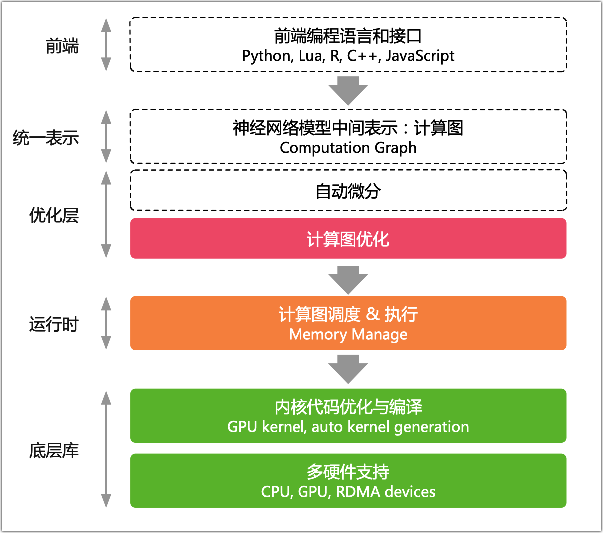
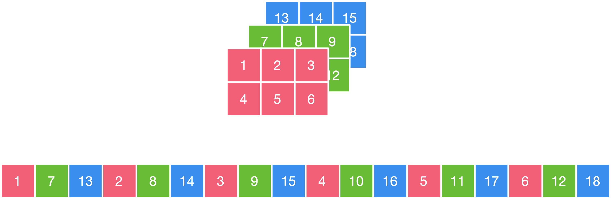
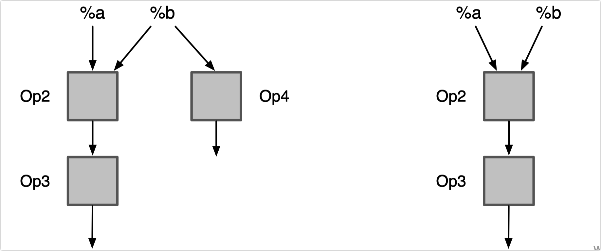
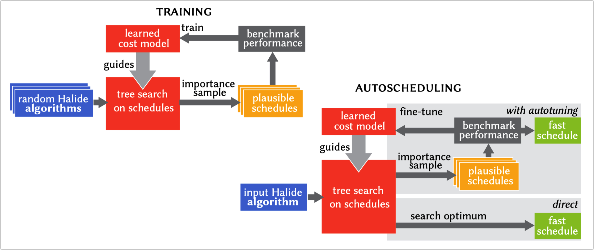

本笔记为ZOMI酱【AI编译器】系列课程的笔记

课程视频：https://space.bilibili.com/517221395/channel/series

github：https://github.com/chenzomi12/DeepLearningSystem


✿✿ヽ(°▽°)ノ✿✿✿ヽ(°▽°)ノ✿✿✿ヽ(°▽°)ノ✿✿✿ヽ(°▽°)ノ✿✿✿ヽ(°▽°)ノ✿✿✿ヽ(°▽°)ノ✿✿✿ヽ(°▽°)ノ✿

---


随着深度学习的应用场景的不断泛化，深度学习计算任务也需要部署在不同的计算设备和硬件架构上；同时，实际部署或训练场景对性能往往也有着更为激进的要求，例如针对硬件特点定制计算代码。

这些需求在通用的AI框架中已经难已得到满足。<u>由于深度学习计算任务在现有的AI框架中往往以DSL（Domain Specific Language）的方式进行编程和表达，这本身使得深度学习计算任务的优化和执行天然符合传统计算机语言的编译和优化过程。</u>因此，<u>深度学习的编译与优化就是将当前的深度学习计算任务通过一层或多层中间表达进行翻译和优化，最终转化成目标硬件上的可执行代码的过程</u>。本章将围绕现有AI编译器中的编译和优化工作的内容展开介绍。

## 课程简介

- 《传统编译器》会粗略地回顾传统编译器中的前端、后端、IR中间表达等主要的概念，并对目前主流的两大编译器GCC和LLVM进行简单的展开，去了解GCC的编译流程和编译方式，并回顾LLVM的整体架构。

- 《AI 编译器》是本节的概览重点，去了解本章的主要内容 AI 编译器的整体架构，包括他的发展阶段，目前主要的组成模块，整体的技术演进方向等概念性的内容，因为近年来AI编译器发展迅猛，可以横向去了解AI编译器整体技术。

- 《前端优化》前端优化作为 AI编译器 的整体架构主要模块，主要优化的对象是计算图，而计算图是通过AI框架产生的，值得注意的是并不是所有的AI框架都会生成计算图，有了计算图就可以结合深度学习的原理知识进行图的优化。

- 《后端优化》后端优化作为AI编译器跟硬件之间的相连接的模块，更多的是算子或者Kernel进行优化，而优化之前需要把计算图转换称为调度树等IR格式，然后针对每一个算子/Kernel进行循环优化、指令优化和内存优化等技术。

- 《多面体技术》多面体不属于新的技术，反而是传统编译器的一种优化手段，得益于深度学习中的主要特征（循环、张量），因此多面体技术可以发挥更大的作用，对循环展开、内存映射等优化工作。

- 《PyTorch图模式》会以实际的AI框架 PyTorch 2.0为主线，去把其主打特性 Dynamo 和 AOTAutograd 进行展开，并回顾 PyTorch 对图模式的尝试，了解现今最热门的AI框架如何进行编译器优化的。

希望这个系列能够给大家、朋友们带来一些些帮助，也希望自己能够继续坚持完成所有内容哈！

## 课程目标

通过《AI编译器原理介绍》这个课程，以及这门课程后面的几门课程，你将获取并且掌握的技能：

| 编号 | 名称                           | 具体内容                                                     |
| :--: | :----------------------------- | :----------------------------------------------------------- |
|  1   | [传统编译器](#第一节 传统编译器)  | 目前最常用的GCC和LLVM的发展历史，GCC的使用方式和LLVM的架构前后端优化划分，去了解传统编译器的整体架构和脉络。 |
|  2   | [AI编译器](#第二节 AI编译器)  | AI 编译器发展时间并不长，从TF第一代开始到目前进入第二代，AI编译器整体架构基本上已经清晰，可是也会越到很多挑战和技术难点。 |
|  3   | [前端优化](#第三节 前端优化)     | AI 编译器的前端优化包括图算融合、数据排布、内存优化等跟深度学习相结合的优化手段，同时把传统编译器关于代数优化的技术引入到计算图中。 |
|  4   | [后端优化](#第四节 后端优化)      | AI 编译器为了更好地跟硬件打交道，充分赋能硬件，需要后端优化来支持，于是后端针对调度树或者底层IR回进行循环优化、指令优化和内存优化等优化手段。 |
|  5   | 多面体技术  | 多面体表示技术作为统一化的程序变换表示技术, 可以通过迭代域、仿射调度、访存函数等操作对算子或者Kernel进行循环优化和内存映射优化，作为AI编译器的前言研究方向。 |
|  6   | [PyTorch 2.0 图模式](#第五节 PyTorch 2.0 图模式) | 在充分了解AI编译器后，来深度剖析PyTorch2.0关于图模式的Dynamo是如何实现的，如何对PyTorch的后端执行进行加速。 |

# 第一节 传统编译器

与传统编译器相比,AI编译器是一个领域特定的编译器。了解AI系统和AI框架，不得不啃一啃硬骨头，一个古老而又神秘、一个时尚既又奇怪的大型程序：编译器。在正式给深入AI编译器之前，需要了解几个基本的概念，编译器和解析器啥区别？AOT和JIT啥区别？Pass和IR又是什么？了解完之后，其实编译器没有那么神秘，拿着潘多拉的钥匙来玩编译器吧！


1. 基本介绍

◦ Compiler and interpreter - 编译器与解释器

◦ Just in time and Ahead of time - JIT和AOT编译方式

◦ Pass and IR - Pass和中间表达IR

2. 传统编译器

◦ History of Compiler - 编译器的发展

◦ GCC process and principle – GCC 编译过程和原理

◦ LLVM/Clang process and principle – LLVM 编译过程和原理

## 1.1. 基本介绍

• Why need Compiler？为什么需要编译器？

• Relationship between AI frameworks and AI compilers?AI框架和AI编译器之间什么关系？

### 1.1.1. 编译器与解释器


### 1.1.2. JIT 和 AOT 编译方式

程序主要有两种运行方式：

• 静态编译：程序在执行前全部被编译为机器码，称为 AOT（Ahead of time），即“提前编译”；

• 动态解释：程序边编译边运行，通常将这种类型称为 JIT（Just in time），即“即时编译”；

|      | Just in time                                                 | Ahead of time                                                |
| ---- | ------------------------------------------------------------ | ------------------------------------------------------------ |
| 优点 | 1. <u>可以根据当前硬件情况实时编译生成最优机器指令</u> 2. <u>可以根据当前程序的运行情况生成最优的机器指令序列</u> 3. 当程序需要支持动态链接时，只能使用JIT 4. <u>可以根据进程中内存的实际情况调整代码，使内存能够更充分的利用</u> | 1. <u>在程序运行前编译，可以避免在运行时的编译性能消耗和内存消耗</u> 2. 可以在程序运行初期就达到最高性能 3. 可以显著的加快程序的启动 |
| 缺点 | 1. <u>编译需要占用运行时资源，会导致进程卡顿</u> 2. 编译占用运行时间，对某些代码编译优化不能完全支持，需在流畅和时间权衡 3. 在编译准备和识别频繁使用的方法需要占用时间，初始编译不能达到最高性能 | 1. 在程序运行前编译会使程序安装的时间增加 2. 牺牲高级语言的一致性问题 3. 将提前编译的内容保存会占用更多的外 |

### 1.1.3. Pass

对源程序的一次完整扫描或处理


### 1.1.4. IR

IR: An intermediate representation (IR) is the data structure or code used internally by a compiler or virtual machine to represent source code.


## 1.2. 编译器的发展


### 1.2.1. 编译器基本构成

- Front-End：主要负责词法和语法分析，将源代码转化为抽象语法树；

- Optimizer：优化器则是在前端的基础上，对得到的中间代码进行优化，使代码更加高效；
- Back-end：后端则是将已经优化的中间代码转化为针对各自平台的机器代码；


### 1.2.2. GCC

GNU Compiler Collection


### 1.2.3. LLVM


苹果使用了GCC编译器之后，不是基于开源之上的，而是要进行一些定制的，有自己的一些独特的需求。到了后来，发现GCC的包袱实在太重了，与其使用GCC，我还不如自己造一个。2011年的时候，GCC占比其实还比LLVM要高，但是到了后来，LLVM逐渐的成熟，GCC的占比越来越低。前端也不再使用GCC，而是使用Clang。


## 1.3. GCC编译过程和原理

**GCC Main Feature**

• <u>GCC是一个可移植的编译器</u>，支持多种硬件平台；

• GCC不仅仅是本地编译器，<u>它还能跨平台交叉编译；</u>

• GCC有多种语言前段，<u>用于解析不同的语言；</u>

• GCC模块化设计，<u>可加入新语言和新CPU架构支持；</u>

• GCC<u>是开源自由软件</u>，可免费使用。

**GCC Compile Process**


- 预处理（Pre-Processing）：包括宏定义，文件包含，条件编译三部分。预处理过程读入源 代码，检查包含预处理指令的语句和宏定义，并对其进行响应和替换。预处理过程还会删除程 序中的注释和多余空白字符。最后会生成 .i 文件。

- 编译器（Compiling）：编译器会将预处理完的 .i 文件进行一系列的语法分析，并优化后生成

  对应的汇编代码。会生成 .s 文件。

- 汇编器（Assembling）：汇编器会将编译器生成的 .s 汇编程序汇编为机器语言或指令，也就

  是可以机器可以执行的二进制程序。会生成 .o 文件。

- 链接器（Linking）：链接器会来链接程序运行的所需要的目标文件，以及依赖的库文件，最后 生成可执行文件，以二进制形式存储在磁盘中。

**Advantage**

1. 支持 JAVA/ADA/FORTRAN

2. GCC 支持更多平台

3. GCC 更流行，广泛使用，支持完备

4. GCC <u>基于 C，不需要 C++ 编译器即可编译</u>

**Shortcoming**

1. <u>GCC 代码耦合度高</u>，很难独立，如集成到专用 IDE 上，模块化方式来调用 GCC 难；

2. GCC 被构建成单一静态编译器，使得<u>难以被作为 API 并集成到其他工具中；</u>

3. 从1987年发展到2022年35年，<u>越是后期的版本，代码质量越差；</u>

4. gcc大约有1500万行代码，<u>是现存最大的自由程序之一；</u>

## 1.4. LLVM架构和原理

**Computer Language stacks**


**Traditional Compiler vs Modern Compiler**


**Lib base LLVM**

LLVM 项目发展为一个巨大的编译器相关的工具集合


**LLVM vs GCC**

<u>• 把编译器移植给新的语言只需要实现一个新的编译前端，已有的优化和后端都能实现复用；</u>

• *如果前后端和解析器没有相互解耦，新语言编译器需要支持 N 个目标机和 M 种语言(N\*M)；*

<u>• LLVM 组件之间交互发生在高层次抽象，不同组件隔离为单独程序库，易于在整个编译流水线 中集成转换和优化 Pass。现在被作为实现各种静态和运行时编译语言的通用基础结构；</u>

• *GCC 饱受分层和抽象漏洞困扰：编译前端生成编译后端数据的结构，编译后端遍历前端抽象 语法树（AST）来生成调试信息，整个编译器依赖命令行设置的全局数据结构；*

### 1.4.1. LLVM Architecture


**Pro's of GCC vs Clang**

• GCC supports languages that Clang does not aim to, such as Java, Fortran, AN, Go, etc.

• GCC supports more targets than LLVM.

• GCC supports many language extensions.

**Pro's of Clang vs GCC**

• The Clang ASTs and design(Modular design) are intended to be easily understandable by anyone.

• Clang is designed as an API from its inception, allowing it to be reused by source analysis tools, refactoring, IDEs as well as for code generation. GCC is built as a monolithic static compiler.

• Various GCC design decisions make it very difficult to reuse , Clang has none of these problems.

• Fast compilation speed. In Debug mode, OC compilation speed is three times faster than GCC. Small memory consumption.

**How to Use LLVM**


```shell
• clang -E -c hello.c -o hello.i

• clang -emit-llvm hello.i -c -o hello.bc

• clang -emit-llvm hello.i -S -o hello.ll

• llvm-dis hello.bc -o hello.ll

• llvm-as hello.ll -o hello.bc

• clang -O2 -S hello.c -emit-llvm -o hello.ll

• llc hello.ll -o hello.s

• clang hello.s -o hello

• clang -ccc-print-phases hello.c

• clang -Xclang -ast-dump -c hello.c
```

### 1.4.2. LLVM 中间表示

这并不意味着LLVM使用单一 IR 表示方式， 在编译不同阶段会采用不同的数据结构：


LLVM IR 作为一种编译器 IR，它的两个基本原则指导着核心库的开发：

<u>• SSA 表示，代码组织为三地址指令序列和无限寄存器让优化能够快速执行。</u>

<u>• 整个程序的 IR 存储到磁盘让链接时优化易于实现。</u>

LLVM IR 采用静态单赋值形式（Static single assignment，SSA），具有两个重要特征：

• 代码组织为三地址指令序列

• 寄存器数量无限制

**What is SSA(Static Single Assignment) 静态单赋值**

当程序中的每个变量都有且只有一个赋值语句时，称一个程序是 SSA 形式的。LLVM IR 中，每个变量都在使 用前都必须先定义，且每个变量只能被赋值一次。

每个值只有单一赋值定义了它。每次使用一个值，可以立刻向后追溯到给出其定义的唯一的指令。极大简化优 化，因为SSA形式建立了平凡的use-def链，也就是一个值到达使用之处的定义的列表。 

**LLVM IR基本语法**

• <u>LLVM IR 是类似于精简指令集（RISC）的底层虚拟指令集；</u>

• 和真实精简指令集一样，<u>支持简单指令的线性序列，例如添加、相减、比较和分支；</u>

• <u>指令都是三地址形式</u>，它们接受一定数量的输入然后在不同的寄存器中存储计算结果；

• <u>与大多数精简指令集不同，LLVM 使用强类型的简单类型系统，并剥离了机器差异；</u>

• LLVM IR 不使用固定的命名寄存器，它使用以 ％ 字符命名的临时寄存器；

**LLVM IR 表示形式**

LLVM IR 具有三种表示形式，这三种中间格式是完全等价的：

• 在内存中的编译中间语言（无法通过文件的形式得到的指令类等）

• 在硬盘上存储的二进制中间语言（格式为 .bc）

• 人类可读的代码语言（格式为 .ll）

**LLVM IR 内存模型**

• LLVM IR 文件的基本单位称为 module

• 一个 module 中可以拥有多个顶层实体，比如 function 和 global variavle

• 一个 function define 中至少有一个 basicblock

• 每个 basicblock 中有若干 instruction，并且都以 terminator instruction 结尾


**LLVM IR 内存模型最重要概念： Value, Use, User**

让我们能够轻松操作 use-def 和 def-use 链

### 1.4.3. LLVM 前端

编译器前端将源代码变换为编译器的中间表示 LLVM IR，它处于代码生成之前


**Lexical analysis 词法分析**

前端的第一个步骤处理源代码的文本输入，将语言结构分解为一组单词和标记，去除注释、空白、制表符 等。每个单词或者标记必须属于语言子集，语言的保留字被变换为编译器内部表示。

**Syntactic analysis 语法分析**

分组标记以形成表达式、语句、函数体等。检查一组标记是否有意义，考虑代码物理布局，未分析代码的 意思，就像英语中的语法分析，不关心你说了什么，只考虑句子是否正确，并输出语法树（AST）。

**Semantic analysis 语义分析**

借助符号表检验代码没有违背语言类型系统。符号表存储标识符和其各自的类型之间的映射，以及其它内 容。类型检查的一种直觉的方法是，在解析之后，遍历AST的同时从符号表收集关于类型的信息。

### 1.4.4. LLVM 优化层

目标无关优化，理解优化操作，实际上就是理解 IR 如何在 pass 流水线中被修改，这需要知道每个 pass 执 行的修改，还有各个 pass 是以什么顺序被执行。


**Finding Pass**

优化通常由分析 Pass 和转换 Pass 组成。

• 分析 Pass：负责发掘性质和优化机会；

• 转换 Pass：生成必需的数据结构，后续为后者所用；

example：https://llvm.org/docs/Passes.html

• -adce: Aggressive Dead Code Elimination 积极的死代码消除。此pass类似于DCE，但它假定值是死的，除非得到其他证明。这类似于SCCP，除了用于值的活动性。

• -constmerge: Merge Duplicate Global Constants 将重复的全局常量合并到一个共享的常量中。这是有用的，一些passes在程序中插入许多字符串常量，不管现有字符串是否可用。

**Understand Pass Relation**

在转换Pass和分析Pass之间，有两种主要的依赖类型：

• 显式依赖：转换Pass需要一种分析，则Pass管理器自动地安排它所依赖的分析Pass在它之前运行；

• 隐式依赖：转换或者分析Pass要求IR代码运用特定表达式。需要手动地以正确的顺序把这个Pass加 到Pass队列中，通过命令行工具（clang或者opt）或者Pass管理器。

**Pass API**

Pass类是实现优化的主要资源。然而，我们从不直接使用它，而是通过清楚的子类使用它。当实现一个 Pass时，你应该选择适合你的Pass的最佳粒度，适合此粒度的最佳子类，例如基于函数、模块、循环、强 联通区域，等等。常见的这些子类如下：

• ModulePass

• FunctionPass

• BasicBlockPass

### 1.4.5. LLVM 后端

后端由一套分析和转换 Pass 组成，它们的任务是代码生成，即将LLVM IR变换为目标代码（或者汇编）。


整个后端流水线用到了四种不同层次的指令表示：

• 内存中的LLVM IR，SelectionDAG 节点，MachineInstr，和 MCInst。


**Instruction Selection 指令选择**

• <u>内存中 LLVM IR 变换为目标特定 SelectionDAG 节点；</u>

• 每个DAG能够表示单一基本块的计算；

• <u>节点表示指令，而边编码了指令间的数据流依赖；</u>

• <u>让LLVM代码生成程序库能够运用基于树的模式匹配指令选择算法。</u>

**Instruction Scheduling 指令调度**

• 第1次指令调度（Instruction Scheduling），也称为前寄存器分配（RA）调度；

• 对指令排序，同时尝试发现尽可能多的指令层次的并行；

• 然后指令被变换为MachineInstr三地址表示。

**Register Allocation 寄存器分配**

• LLVMIR 两个重要特性之一：LLVM IR 寄存器集是无限；

• 这个性质一直保持着，直到寄存器分配（Register Allocation）；

• 寄存器分配将无限的虚拟寄存器引用转换为有限的目标特定的寄存器集；

• 寄存器不够时挤出（spill）到内存。

**Instruction Scheduling 指令调度**

• 第2次指令调度，也称为后寄存器分配（RA）调度；

• 此时可获得真实的寄存器信息，某些类型寄存器存在延迟，它们可被用以改进指令顺序。

**Code Emission 代码输出**

• 代码输出阶段将指令从 MachineInstr 表示变换为 MCInst 实例；

• 新的表示更适合汇编器和链接器，可以输出汇编代码或者输出二进制块特定目标代码格式。


### 1.4.6. 基于LLVM的项目

LLVM之父Chris Lattner的Modular项目：目标是重建全球ML基础设施，包括编译器、运行时，异构计算、边缘到数据中心并重， 并专注于可用性，提升开发人员的效率。

**XLA：优化机器学习编译器**

• XLA（加速线性代数）是一种针对特定领域的线性代数编译器，能够加快 TensorFlow 模型的运行速度， 而且可能完全不需要更改源代码。

**JAX：高性能的数值计算库**

• JAX 是Autograd和XLA的结合,JAX 本身不是一个深度学习的框架,他是一个高性能的数值计算库,更是结 合了可组合的函数转换库,用于高性能机器学习研究。

**TensorFlow：机器学习平台**

• TensorFlow是一个端到端开源机器学习平台。它拥有一个全面而灵活的生态系统，其中包含各种工具、 库和社区资源，可助力研究人员推动先进机器学习技术。

**TVM 端到端深度学习编译器**

• 为了使得各种硬件后端的计算图层级和算子层级优化成为可能，TVM 从现有框架中取得 DL 程序的高层级

表示，并产生多硬件平台后端上低层级的优化代码，其目标是展示与人工调优的竞争力。


**Julia：面向科学计算的高性能动态编程语言**

• 计算中，Julia使用 LLVM JIT编译。LLVM JIT 编译器通常不断地分析正在执行的代码，并且识别代码的 一部分，使得从编译中获得的性能加速超过编译该代码的性能开销。

# 第二节 AI 编译器

传统的AI框架采用人工优化算子，然后建立运行时图解释器来解决内存分配调度等问题。AI编译器技术路线一般指在优化过程中采用了自动或者半自动的代码生成用以替代人工优化。AI编译器无疑是最近非常热门的话题。AI编译器出现的比较晚，所以在设计的时候，往往会借鉴传统编译器的思路。


AI编译器

◦ Why need AI Compiler – 为什么需要AI编译器

◦ Base Common architecture – AI编译器的出现和架构

◦ Different and challenge of the future – 未来的挑战与思考


推荐两个视频：[A New Golden Age for computer Architecture](https://36kr.com/p/1723189182465)、[The Golden Age of Compiler Design in an Era of HW/SW Co-design by Dr. Chris Lattner](https://zhuanlan.zhihu.com/p/367035973)

## 2.1. AI 编译器的发展

Deep Learning is widely used


The Gap Between SW and HW is huge!


C Compilers leading into the early 90s


Challenge

1. <u>越来越多新算子被提出，算子库的开发、维护、优化和测试工作量指数上升；</u>

   ◦ 增加新算子，硬件不仅需要实现，还需要结合硬件进行特性优化和测试，尽量充分发挥硬件性能。以 Convolution 运算为例，需要将 Convolution 操作转换为 GEMM 矩阵乘法；算法新提出新的 Swish 算子 ，硬件需要新增 Swish 对应实现。

   ◦ 硬件供应商还会有针对性发布优化库（如 MKL-DNN 和 CuDNN）。但是对于专用硬件，需要提供开发 类似的优化库，不仅会增加大量算子优化、封装的工作，还会过于依赖库无法有效利用专用硬件芯片能 力。

2. <u>专用加速芯片爆发导致性能可移植性成为一种刚需；</u>

   ◦ 大多数 NPU 使用 ASIC，在神经网络场景对计算、存储和数据搬运 做了特殊的指令优化，使得对 AI 相 关的计算会提升性能，如 NVIDIA 虽然作为 GPGPU，但是 DGX 系列提供专用的 Tensor Code。

   ◦ 不同厂商提供 XPU 的 ISA（Instruction Set Architecture）千奇百怪，一般缺乏如 GCC、LLVM 等编译工 具链，使得针对 CPU 和 GPU已有的优化算子库和针对语言的优化 Pass 很难短期移植到 NPU 上。

## 2.2. 传统与AI编译器的区别

**Likewise**

• 目标相同：<u>通过自动化方式进行程序优化和代码生成，从而降低对不同硬件的手工优化；</u>

• 优化方式类似：<u>在编译优化层通过统一 IR 执行不同的Pass进行优化，从而提高执行性能；</u>

• 软件结构栈类似：分成前端、优化、后端三段式，IR 解耦前端和后端使得模块化表示；

• AI编译器依赖传统编译器：<u>AI编译器对 Graph IR 进行优化后，将优化后的 IR 转换成传统编译 器 IR，最后依赖传统编译器针进行机器码生成。</u>

**Difference**

输入高级语言输出低级语言 VS 输入计算图/算子，输出低级语言

主要问题是降低编程难度 其次是优化程序性能 VS 主要优化程序性能 其次是降低编程难度


**IR 差异**：AI 编译器的 IR 与传统编译器的IR所抽象出来的概念和意义并不相同。

◦ <u>AI编译器一般会有 high-level IR，用来抽象描述深度学习模型中的运算</u>，如：Convolution、Matmul 等， 甚至部分会有 Transformer 带有图的结构。

◦ <u>传统编译器相对而言 low-level IR，用于描述基本指令运算</u>，如 load、store 等。有了high-level IR，AI编 译器在描述深度学习模型类 DSL 更加方便。

**优化策略**：AI 编译器面向AI领域，优化时引入更多领域特定知识，从而进行更 high-level，更加 aggressive 优化手段。如：

◦ <u>AI编译器在 high-level IR 执行算子融合，传统编译器执行类似 loop fusion 时候，往往更加保守</u>。缺点是可能会导致调试执行信息跟踪难；

 ◦ <u>AI编译器可以降低计算精度，比如int8、fp16、bf16等，因为深度学习对计算精度不那么敏感</u>。但传统编译器一般不执行改变变量类型和精度等优化。

## 2.3. AI 编译器架构发展

• 推理场景：输入 AI 框架训练出来的模型文件，输出能够在不同硬件高效执行的程序；

• 训练场景：输入高级语言表示的神经网络代码，输出能够在不同硬件高效执行的程序；

What is AI Compiler?

1. Python 为主的动态解释器语言前端

2. 多层 IR 设计，包括图编译、算子编译、代码生成

3. 面向神经网络、深度学习的特定优化

4. DSA 芯片架构的支持

**development history**


### 2.3.1. Stage I 朴素的AI编译器

TensorFlow 早期版本，基于神经网络的编程模型，主要进行了graph 图和ops 算子两层抽象。

◦ 图层：通过声明式的编程方式，以静态图方式执行，执行前进行硬件无关和硬件相关的编译优化。硬件 无关的优化，如表达式化简、常量折叠、自动微分等；硬件相关的优化包括算子融合、内存分配等。

◦ 算子层：通常采用手写 kernel 的方式，如在 NVIDIA GPU 上基于 CUDA kernel 实现大量的 .cu 算子或 者依赖于 CuDNN 算子优化库。


**表达上：**

◦ 静态图的表达式<u>非 Python 原生</u>，开发者主要通过框架提供Python API 显示构图，易用性上不好；

**性能上：**

◦ DSA 专用加速芯片出现加剧了性能上的挑战；

◦ 算子层提供的<u>算子粒度和边界提前确定</u>后，无法充分发挥硬件的性能；

◦ 硬件厂商的提供的算子优化库也未必最优

- 1）<u>模型和 shape 确定情况下，可能还有更优算子实现；</u>

- 2）<u>在 SIMT 和 SIMD 架构中，Scheduling、Tilling 都有有很大的空间。</u>

### 2.3.2. Stage II 专用的AI编译器

**表达上：**

• <u>PyTorch 灵活表达 API 方式成为 AI 框架参考标杆</u>，图层的神经网络编译器主要就是考虑如何把 类 PyTorch 的表达转换到图层的IR进行优化。

• 类PyTorch的Python原生表达，静态化转换；

• AI专用编译器架构，<u>打开图算边界进行融合优化；</u>

如Pytorch、MindSpore、JAX


**性能上：**

• 打开计算图和算子的边界，进行重新组合优化，发挥芯片的算力。<u>计算图层下发子图中的算子 打开成小算子，基于小算子组成的子图，进行编译优化，包括buffer fusion、水平融合等</u>，关 键是大算子怎样打开、小算子如何重新融合等。

如TVM、XLA、（Facebook）Tensor Comprehensions


**存在的问题**

• <u>表达分离</u>：计算图层和算子层仍然分开，算法工程师主要关注图层的表达，算子表达和实现主 要是框架开发者和芯片厂商提供。

• <u>功能泛化</u>：对灵活表达上的动静态图转换、动态 Shape、稀疏计算、分布式并行优化等复杂的 需求难以满足。

• <u>平衡效率和性能</u>：算子实现上在 Schedule、Tiling、Codegen 上缺乏自动化手段，门槛高，开发 者既要了解算子计算逻辑，又要熟悉硬件体系架构。

### 2.3.3. Stage III 通用AI编译器

<u>• 图算统一表达，实现融合优化</u>

<u>• 算子实现上自动 Schedule、Tiling、Codegen，降低开发门槛</u>

<u>• 更泛化优化能力，实现动静统一、动态 Shape、稀疏性、高阶微分、自动并行等</u>

<u>• 包括编译器、运行时，异构计算、边缘到数据中心都模块化表示和组合，并专注于可用性</u>


Question?

1. AI 编译器跟传统编译器有什么区别吗？

2. AI 框架跟AI编译器什么关系？是AI框架包含AI编译器 or AI框架就是一个AI编译器？

3. AI 领域真的需要编译器吗？那为什么 PyTorch 动态图模式没有编译器的概念？

4. 技术投入比来看，神经网络编译器和人工算子实现，哪个性价比更高？

### 2.3.4. 现有 AI 编译器 架构

The Deep Learning Compiler: A Comprehensive Survey


#### 2.3.4.1. IR 中间表达

编译器主要分为前后端，分别针对于硬件无关和硬件相关的处理。每一个部分都有自己的 IR (Intermediate Representation，中间表达)，每个部分也会对进行优化：

• High-level IR：用于表示计算图，其出现主要是为了解决传统编译器中难以表达深度学习模型中 的复杂运算这一问题，为了实现更高效的优化所以新设计了一套 IR。

• Low-level IR：能够在更细粒度的层面上表示模型，从而能够针对于硬件进行优化，文中将其分 为了三类。

#### 2.3.4.2. Frontend 前端优化

构造计算图后，前端将应用图级优化。因为图提供了计算全局概述，所以更容易在图级发现和执 行许多优化。前端优化与硬件无关，这意味着可以将计算图优化应用于各种后端目标。前端优化 分为三类：

1. <u>节点级优化</u>，如 Zero-dim-tensor elimination、Nop Elimination

2. <u>块级优化</u>，如代数简化、常量折叠、算子融合

3. <u>数据流级优化</u>，如Common sub-expression elimination、DCE

#### 2.3.4.3. Backend 后端优化

**特定硬件的优化**

• 目标针对特定硬件体系结构获取高性能代码。

1）低级IR转换为LLVM IR，利用LLVM基础结构生 成优化的CPU/GPU代码。

2）使用领域知识定制优化，这可以更有效地利用目标硬件。 

**自动调整**

• 由于在特定硬件优化中用于参数调整的搜索空间巨大，因此有必要利用自动调整来确定最佳参 数设置。

1）Halide/TVM允许调度和计算表达分开，使用自动调节来得出较佳配置。

2）应用多 面体模型 Polyhedral model 进行参数调整。 

**优化内核库**

• 厂商特定优化内核库，广泛用于各种硬件上的加速DL训练和推理。特定优化原语可以满足计算 要求时，使用优化的内核库可显著提高性能，否则可能会受到进一步优化的约束。


## 2.4. 挑战与未来

### 2.4.1. AI 编译器对比


XLA：优化机器学习编译器

• XLA（加速线性代数）是一种针对特定领域的线性代数编译器，能够加快 TensorFlow 模型的运行速度， 而且可能完全不需要更改源代码。

• XLA：图层下发子图中的算子打开成小算子，基于小算子组成的子图进行编译优化，包括 buffer fusion、水平融合等，关键是大算子怎样打开、小算子如何重新融合、新的大算子如何 生成，整体设计主要通过HLO/LLO/LLVM IR 实现，所有 Pass 规则都是手工提前指定。

**TVM：端到端深度学习编译器**

• 为了使得各种硬件后端的计算图层级和算子层级优化成为可能，TVM 从现有框架中取得 DL 程序的高层级 表示，并产生多硬件平台后端上低层级的优化代码，其目标是展示与人工调优的竞争力。

• TVM：分为Relay和TVM两层，<u>Relay关注图层，TVM关注算子层</u>，拿到前端子图进行优化， Relay关注算子间融合、TVM关注新算子和kernel生成，区别在于TVM 开放架构，Relay目标 是可以接入各种前端，TVM也是一个可以独立使用的算子开发和编译的工具，<u>算子实现方面采 用 Compute（设计计算逻辑）和 Schedule（指定调度优化逻辑）分离方案。</u>

**TENSOR COMPREHENSIONS：神经网络语言编译器**

> 没有持续更新

• TensorComprehensions 是一种可以构建 just in time(JIT)系统的语言,程序员可通过该语言用 高级编程语言去高效的实现 GPU 等底层代码。

• TC：算子计算逻辑的较容易实现，但 Schedule 开发难，既要了解算法逻辑又要熟悉硬件体系 架构，此外图算边界打开后，小算子融合后，会生成新算子和 kernel，新算子 Schedule 很难 生成，传统方法定义 Schedule 模板；TC 希望<u>通过 Polyhedral model 实现 auto schedule。</u>

**nGraph ：兼容所有框架的深度学习系统编译器**

• nGraph 的运作应作为深度学习框架当中更为复杂的 DNN 运算的基石，并确保在推理计算与 训练及推理计算之间取得理想的效率平衡点。

### 2.4.2. AI 编译器的挑战

Challenge

1. 动态 Shape问题

2. Python 编译静态化

3. 发挥硬件性能，特别是DSA类芯片

4. 处理神经网络特性：自动微分、自动并行等

5. 易用性与性能兼顾

**动态 shape 和动态计算图：**

• 现阶段主流的AI编译器主要针对特定静态 shape 输入完成编译优化，<u>对包含 Control Flow 语义的动态计算图只能提供有限的支持或者完全不能够支持。</u>

• AI 的应用场景却恰恰存在大量这一类的任务需求。AI编译器前端将计算图改写为静态计算图， 或者将适合编译器部分子图展开交给编译器进行优化。

• <u>部分 AI 任务并不能通过人工改写来静态化</u>（如金字塔结构的检测模型），导致这些情况下编译 器完全难以有效优化。


#### 2.4.2.1. **Python Static 静态化**

通过 JIT，Python 程序执行静态编译优化，从而提升性能、方便部署。业界 JIT 通用做法：

1. <u>Python JIT 虚拟机</u>：期望在 Python 解释执行的基础上增加 JIT 编译加速的能力，典型的如 PyPy 或者 CPython，但由于前期设计问题 Python JIT 虚拟机兼容难。

2. <u>修饰符方式</u>：Python JIT 通过修饰符，进行部分 Python 语句加速。但无论是 torch.jit.script、torch.jit.tra ce、torch.fx、LazyTensor、TorchDynamo，几乎把能用的手段都用上，还是缺乏一个完备的方案。

Python 执行时，首先会将.py文件中的源代码编译成Python的byte code(字节码)，然后再由Python Virtual Ma chine 来执行这些编译好的 byte code。实际上，Python Virtual Machine 是一种抽象层次更高 Virtual Machine。 基于C的 Python 编译出的字节码文件，通常是.pyc格式。


1. CPython： CPython 混合了编译和解释功能，将Python源代码首先被编译成一系列中间字节码，然后 由CPython虚拟机内部 while 循环不断匹配字节码并执行对应字节码指令 case 分支内部的多条C函数。
   
2. PyPy：基于RPython语言构建， 利用 JIT 即时编译来执行 Python 代码。不同于解释器，并不会逐行 运行代码，而是在执行程序前先将部分代码编译成机器码。
   

<u>AI框架静态化的方案普遍采用修饰符这套方案</u>，这套方案细分下来也有两种不同的方法：

• Tracing Based，如 PyTorch.fx

• AST Transform， 如 PyTorch.jit.trace

**AI编译器在 Python 静态化方面的挑战：**

• 类型推导：从 Python 动态类型到编译器 IR 静态类型

• 控制流的表达：if、else、while、for等控制表达

• 灵活的语和数据类型转换：针对 Slice、Dict、Index等操作

• JIT的编译性能：Tracing Based 还是 AST Transform 都需要增加额外的编译开销


#### 2.4.2.2. Toward DSA

**DSA 专用硬件架构：**

• AI 训练和推理都是对性能敏感，所以在AI的场景中大量用到加速器，包括CPU SIMD单元、GP U SIMT架构、华为昇腾Ascend Cube核等专用架构， NV GPU H100架构DSA特征也逐步明显。

• <u>因此 AI 编译器逐步成为发挥多样性算力的关键</u>，特别是近期 Dataflow + SIMD 类 DSA芯片占比 逐步提升的情况下。

**Dataflow：**

• Dataflow 的执行调度更加能发挥芯片的性能，即芯片进行整图或者子图的调度，而不是像GPU 那样，主流是 kernel by kernel的调度。

**编译器在性能优化的难度和复杂度挑战变大：**

• 性能优化依赖图算融合优化，图层和算子层独立优化无法充分发挥芯片性能，<u>需要图算融合优 化</u>，例如子图切分、子图内垂直融合优化和水平并行优化；

• <u>优化复杂度提升，标量+向量+张量+加速指令、多级的存储结构，导致 Kernel 实现 Schedule、 Tilling、Vectorization、Tensorization复杂</u>；

<u>**当前 AI 编译器没有形成统一完善的方案：**</u>

• 打开图和算子的边界，进行重新组合优化，充分发挥芯片性能；

• 多种优化手段融合：垂直融合优化（Buffer Fusion等）和水平并行（Data Parallel等）优化；

• 重新组合优化后的子图的Kernel代码自动生成，如scheduling、tilling、vectorizing；


#### 2.4.2.3. Specific Optimizations

**自动并行**，当前大模型训练遇到内存墙、性能墙等依赖复杂的并行策略来解决：

• Scale out：多维混合并行能力，数据并行、张量并行、流水线并行等

• Scale up：重计算、混合精度、异构并行等

**Scale Out/Up** 最大挑战就是效率墙：

• 依赖手工配置切分策略，对开发者来说，门槛高，效率低；

• 半自动并行解决一部分效率，真正要解放依赖编译+凸优化问题，自动找到最优并行策略。

<u>**面向 HPC 场景自动微分的要求更高：**</u>

• 控制流：动态图通过Python侧执行控制流，一旦循环次数多的话，性能劣化；静态图的自动微分通过逻辑 拼接或者计算图展开方式来解决，能解决一定性能问题但是方案有待完善。

• 高阶微分：高阶的前向微分和后向微分如何通过 Jacobian matrix 有效展开，高阶微分通过 Hessian matrix 如何模拟快速计算，开发者如何灵活对高阶微分的图进行控制？


#### 2.4.2.4. 易用性与性能兼顾

**与AI框架的边界和对接：**

• 不同AI框架对深度学习任务的抽象描述和 API 接口不同，语义和机制上有各自的特点。需要考 虑如何在不保证所有算子被完整支持的情况下透明化的支持用户的计算图描述。

**对用户透明性问题：**

• 部分 AI 编译器并非完全自动的编译工具，性能表现依赖于用户提供的高层抽象的实现模版，如TVM。主 要是为算子开发工程师提供效率工具，降低用户人工调优各种算子实现的人力成本。

• 现有抽象却常常无法足够描述创新的硬件体系结构上所需要的算子实现。需要对编译器架构足够熟悉的情 况下对其进行二次开发甚至架构上的重构，门槛及开发负担仍然很高。

**编译开销：**

• AI 编译器作为性能优化工具，只有在编译开销对比带来的性能收益有足够优势才有实用价值。部分应用 场景下对于编译开销的要求较高。对于开发者而言，使用AI编译器阻碍其快速的完成模型的调试和验证工 作，极大增加开发和部署的难度和负担。

**性能问题：**

• 编译器的优化本质上是将人工的优化方法，或者人力不易探究到的优化方法通过泛化性的沉淀和抽象，以 有限的编译开销来替代手工优化的人力成本。深度学习编译器只有在性能上真正能够代替或者超过人工优 化才能真正发挥价值。

**鲁棒性：**

• AI 编译器大多数处于研究型，产品成熟度距离工业级应用有较大差距。是否能够顺利对计算图编译，计 算结果的正确性，对错误进行跟踪调试都需要考虑。


Question?

**• 图算能否统一表达，统一编译优化，形成通用的 AI 编译器？**

当前的AI框架下，图层和算子层是分开表达和优化，算法工程师主要是接触图层表达，AI框架、 芯片、kernel开发工程师主要是负责算子的表达，未来能否会有IR打破图算之间的GAP，未来在 AI+科学计算、AI+大数据等新场景驱动下，使得计算图层和算子层不再清晰，能否统一AI的编 译优化？

**• 完全的自动并行是否可行？**

自动并行能根据用户输入的串行网络模型和提供的集群资源信息自动进行分布式训练，通过采用 统一分布式计算图和统一资源图设计可支持任意并行策略和各类硬件集群资源上分布式训练，并 且还能利用基于全局代价模型的规划器来自适应为训练任务选择硬件感知的并行策略。实际上自 动并行是一个策略搜索问题，策略搜索能够在有限的搜索空间找到一个次有的答案，但是真正意 义上的自动并行能否做到需要进一步思考和验证。

**• AI芯片需要编译器吗？AI芯片需要AI编译器吗？**

AI芯片对于编译器的依赖取决于芯片本身的设计。越灵活的芯片对于编译器的依赖会越大。在AI 芯片设计之初，有CISC风格把优化在芯片内部解决。但是随着专用领域的演化，为了支持更加灵 活的需求，AI芯片本身会在保留张量指令集和特殊内存结构的前提下越来越灵活。未来的架构师 需要芯片和系统协同设计，自动化也会越来越多地被应用到专用芯片中去。

### 2.4.3. AI 编译器的未来

Future

1. 编译器形态：分开推理和训练， AOT 和 JIT 两种编译方式并存

2. IR 形态：需要有类似于 MLIR 对 AI 统一的 IR 表达

3. 自动并行：提供跨机器、跨节点自动并行的编译优化能力

4. 自动微分：提供高阶微分的计算方式，并方便对图进行操作

5. kernel自动生成：降低开发门槛，快速实现高效和高泛化的算子


# 第三节 前端优化

AI编译器主要是分为前端优化、后端优化，部分还会有中间优化层，而这里面主要介绍AI编译器的前端优化涉及到的算法和优化Pass。


**神经网络相关的优化**

◦ 图层 - Graph IR

◦ 算子融合 - OP Fusion

◦ 算子替换 - OP Replace（推理场景）

◦ 布局转换 - Layout Transform

◦ 内存分配 - Memory Allocation

**代码/计算层面的优化**

◦ 常量折叠 – Constant Fold

◦ 公共子表达式消除 - CSE

◦ 死代码消除 - DCE

◦ 代数简化 - ARM


AI编译器一般按照以上顺序进行依次优化。


## 3.1. 图层 IR

AI框架如何对接到图层IR，图层IR作为AI编译器前端的统一IR，具体有什么好处呢？


1. 计算图的表示

◦ 计算图的基本构成

◦ 静态计算图和动态计算图

◦ AI 框架如何生成计算图

◦ 对 AI 编译器的作用

### 3.1.1. 计算图基本构成

1. 用来表示深度学习网络模型在训练与推理过程中计算逻辑与状态 
2. AI框架在后端会将Python构建网络模型前向与反向梯度计算以计算图的形式来表示

3. <u>由基本数据结构张量 (Tensor) 和基本运算 单元算子 (Operator) 构成</u>

4. 计算图中常用节点来表示算子，节点间的 有向线段来表示张量状态，同时也描述了 计算间的依赖关系


### 3.1.2. AI框架如何生成计算图？

**AI 框架生成静态计算图**

静态图模式下：使用前端语言定义模型形成完整的程序表达后，不使用前端语言解释器进行执 行，将前端描述的完整模型交给AI框架。AI框架先对API代码分析，获取网络层之间的连接拓扑 关系以及参数变量设置、损失函数等，接着用静态数据结构来描述拓扑结构及其他神经网络模 型组件。


**AI框架生成动态计算图**

动态图采用前端语言自身的解释器对代码进行解析，利用AI框架本身的算子分发功能，算子会 即刻执行并输出结果。动态图模式采用用户友好的命令式编程范式，使用前端语言构建神经网 络模型更加简洁。

• 优点：动态图模式灵活的执行计算特性，动态生成可以使用前端语言的原生控制流，充分发挥 前端语言的编程友好性特性。

• 缺点：不过动态生成中完整的网络结构在执行前是未知的，不能使用静态图中的图优化技术来 提高计算执行性能。

### 3.1.3. 动态图和静态图

**动态图和静态图比较**

| 特性             | 静态图               | 动态图               |
| ---------------- | -------------------- | -------------------- |
| 即时获取中间结果 | 否                   | 是                   |
| 代码调试难易     | 难                   | 简单                 |
| 控制流实现方式   | 特定的语法           | 前端语言语法         |
| 性能             | 优化策略多，性能更佳 | 图优化受限，性能较差 |
| 内存占用         | 内存占用少           | 内存占用相对较多     |
| 部署能力         | 可直接部署           | 不可直接部署         |

**动态图转换为静态图**

• 基于追踪转换 ：以动态图模式执行并记录调度的算子，构建和保存为静态图模型。

• 基于源码转换 ：分析前端代码将动态图代码自动转为静态图代码，底层使用静态图执行运行。


### 3.1.4. Benefit（I）：方便底层编译优化

• 统一表示来描述神经网络训练的全过程

• 可以序列化保存，不需要再次编译前端源代码

• 将神经网络模型中间表示转换为不同硬件代码

• 直接部署在硬件上，提供高效的推理服务

**图优化**

• 计算图的出现允许 AI 框架在执行前看到深度学 习模型定义全局信息

• 计算图作为 AI 框架中的高层中间表示，可以通 过图优化 Pass 去化简计算图或提高执行效率

利用反向微分计算梯度通常实现为数据流图上的一个优化 Pass


编译期可对计算过程的数据依赖进行分析：

◦ 简化数据流图

◦ 动态和静态内存优化

◦ 预计算算子间的调度策略

◦ 改善运行时Runtime性能


### 3.1.5. Benefit（II）：分层优化，便于扩展

<u>切分出三个解耦的优化层：</u>

◦ 计算图优化

◦ 运行时调度优化

◦ 算子/内核执行优化

<u>新网络模型结构/新训练算法，扩展步骤：</u>

◦ 计算图层添加新算子

◦ 针对不同硬件内核，实现计算优化

◦ 注册算子和内核函数，运行时派发硬件执行




静态图+AI编译器流程：

• 生成采用先编译后执行的方式，编译阶段和执行阶段分离，前端语言构建的神经网络模型经过编译后，计 算图结构便固定执行阶段不再改变

Cons：

1. 使用前端语言编写神经网络模型以及定义模型训练过程代码较为繁琐，掌握图控制流方法有一定学习成 本，因此熟练掌握并使用静态图模式对于初学者并不友好

2. 经过优化用于执行的计算图结构与原始代码有较大的差距，导致代码中的错误难以定位到准确位置，增 加了代码调试难度。在神经网络模型开发迭代环节，不能即时打印中间结果。

3. 在源码中添加输出中间结果的代码，需要将源码重新编译，再调用执行器才能获取相关信息，降低了代 码调试效率。

What about The Future ？

1. TorchDynamo能够解决99%的场景问题吗？

2. MindSpore的优化主要针对静态图+AI编译器，动态图转静态图+AI编译器是否有更好的方案？

## 3.2. 算子融合

AI编译器的前端主要是基于Graph IR（图层IR/计算图IR）进行操作，但是前端优化有很多种，其中最重要的要数算子融合，图层的算子融合是非常有效的方法，使用“计算换访存”的思想，加速整网的计算。算子融合Pass主要发生在图层，但是Kernel层也会借鉴算子融合的策略，提供大算子给AI框架。


Operator Fusion - 算子融合

◦ 算子融合方式

◦ 算子融合栗子

◦ 融合的规则和算法

### 3.2.1. 算子融合方式

融合C、D


• 左侧：B/C并发执行，A一个来回，B/C一个来回

• 右侧：A+B/A+C并发一个来回


• 左侧：B/C并发，要两次kernel调用开销

• 右侧：B/C融合，减少一次kernel调用，两者计算都依赖A的结果放入内存，缓存效率会更高


• 左侧：三次kernel开销

• 右侧：同时A/B间合并，提升内存使用效率


融合算子出现主要解决模型训练过程中的读入数据量，同时，减少中间结果的写回操作，降低 访存操作。


**Pros and Cons**

• 消除不必要的中间结果实例化

• 减少不必要的输入扫描

• 发现其他优化机会


• **内存墙**：主要是访存瓶颈引起。<u>算子融合主要通过对计算图上存在数据依赖的“生产者-消费者 ”算子进行融合，从而提升中间Tensor数据的访存局部性，以此来解决内存墙问题</u>。这种融合 技术也统称为“<u>Buffer融合</u>”。在很长一段时间，Buffer融合一直是算子融合的主流技术。早期 的AI框架，主要通过手工方式实现固定Pattern的Buffer融合。

• **并行墙**：<u>主要是由于芯片多核增加与单算子多核并行度不匹配引起。可以将计算图中的算子节 点进行并行编排，从而提升整体计算并行度。特别是对于网络中存在可并行的分支节点，这种 方式可以获得较好的并行加速效果。</u>

### 3.2.2. Conv-BN-ReLU 算子融合

**BN 计算流程**

• 在 BN 前向计算过程中，首先求输入数据的均值与方差，然后使用均值、方差对每个输入数据进行归一化 及缩放操作。其中均值及方差依赖于输入数据；归一化及缩放计算的输入则依赖于输入数据、均值、方差 以及两个超参数。下图为前向计算过程中 BN 的数据依赖关系：


• BN反向计算过程中，首先求参数误差；然后使用参数误差Δγ、Δβ 计算输入误差ΔX 。参数误差导数依赖 于输出结果误差ΔY 以及输入X；输入误差ΔX 依赖于参数误差导数及输入X、输出误差ΔY。反向过程包括 求参数误差以及输入误差两部分，<u>BN反向计算的关键访存特征是两次使用输入特征X 及输出误差ΔY</u>，分别用于计算参数误差Δγ、Δβ及输入数据误差ΔX。


**计算访存分析**

• 网络模型训练时，需要保存每层前向计算时输出结果，用于反向计算过程参数误差、输入误差 的计算。但是随着深度学习模型的加深，需要保存的中间参数逐渐增加，需要消耗较大的内存 资源。由于加速器片上缓存容量十分有限，无法保存大量数据。因此需将中间结果及参数写出 到加速器的主存中，并在反向计算时依次从主存读入使用。

• 前向计算过程中，每层的计算结果需写出主存，用于反向计算过程中计算输入误差；反向计算过程中，每 层的结果误差也需写出到主存，原因是反向计算时BN层及卷积层都需要进行两次计算，分别求参数误差 及输入数据误差，图X、 ΔY 加载两次来计算参数误差Δγ、Δβ 及输入误差ΔX。ReLU输入Y 不需要保存 ，直接依据结果 Z 即可计算出其输入数据误差。


**模型重构及融合算子**

• <u>前向过程中，BN重构为两个子层：BN_A和BN_B。其中BN_A计算均值与方差，BN_B完成归一化与缩放 ，分别融合于相邻卷积层及激活层。</u>首先从主存读取输入X、均值μ、方差 δ2 、参数γ、 β，计算BN_B， 完成归一化及缩放计算，将结果Y 用于激活计算，输出Z 用于卷积计算，卷积结果X′ 写出到主存之前，计 算BN_A，即求均值 μ′ 与方差 δ2 ‘。完成“归一化缩放->激活层->卷积层->计算卷积结果均值与方差”结构<u>模块的前向计算过程只需要读取一次</u>，并写回卷积计算结果X′ 及相关参数。


融合简化卷积和BN之间的计算：


### 3.2.3. 融合规则与算法

**TVM 支配树**

• TVM整体的算子融合是基于支配树实现的。那么什么是支配树呢？

• 支配树就是由各个点的支配点构成的树，那么什么又是支配点呢？

• 支配点：**所有能够到达当前节点的路径的公共祖先点（Least Common Ancestors，LCA）**


**支配树作用：**

<u>◦ 检查每个Node到其支配点的Node是否符合融合条件</u>（比如融合了4,7,8后，能不能再融合5,6？）

<u>◦ 融合的基本规则是融合掉的Node节点不会对剩下的节点产生影响</u>

**支配树生成：**

<u>◦ 根据DAG生成DFS树</u>

<u>◦ 根据DFS树及对应的边生成DOM树</u>

<u>◦ 使用Group来描述多个Node是否能被融合</u>


**TVM 算子融合流程**

1. 通过AST转换为Relay IR，遍历Relay IR；

2. 建立DAG用于后支配树分析；

3. 应用算子融合算法；

融合流程：

1. 首先根据DAG进行深度优先遍历，生成DFS树，需要注意的是，DFS树是倒序，也就是最后 一个节点是节点0，然后依次深度递增；除了单纯的记录每个Node的深度之外，我们还需要 为每个节点保存与他相连的边，注意这个边是与的父节点（也就是真正网络中他的输出节点 ，倒序就变成了他的父节点了）组成的。之所以这里需要保存这个边和其对应的index，就是 为了后面找LCA用。
2. 根据DFS树及对应的边（link）生成DOM树，TVM是使用group这个概念来描述几个Node 能否融合，如果一个算子不能和任何其他算子融合，那么这个group就只有他自己，同样如 果几个算子能够融合，产生一个新group。
3. 遍历每个Node到它的支配带你的所有路径是否符合融合规则，完成融合后，遍历节点创新 的DAG图


**融合规则 Rules for operator fusion**

- Injective(one-to-one map)：映射 函数，如Add，Pointwise 
- Reduction：约简函数，输入到输 出具有降维性质，如sum/max/mi n 
- Complex-out-fusable：an fuse ele ment-wise map to output，计算 复杂类型，如conv2d 
- Opaque(cannot be fused) ：无法 被融合的算子，比如sort


Experience Results


### 3.2.4. Summary

- 算子的融合方式有横向融合和纵向融合，但根据AI模型结构和算子的排列，可以衍生出更多不同的融合方式； 
- 通过 Conv-BN-ReLU 算子融合栗子，了解到如何对算子进行融合和融合后的计算，可以减少对访存的压力； 
- 在编译器中，一般融合规则都是通过Pass来承载，不同的Pass处理不同的融合规则，而复杂融合规则主要是人工定义好；


Reference

1. DNNFusion: Accelerating Deep Neural Networks Execution with Advanced Operator Fusion https://arxiv.org/abs/2108.13342 
2. Using fused operators to improve performance. https://learn.microsoft.com/en-us/windows/ai/directml/dml-fused-activations 
3. TensorFlow operation fusion. https://www.tensorflow.org/lite/models/convert/operation_fusion 
4. 计算图替代——一种DNN框架计算图优化方法. https://zhuanlan.zhihu.com/p/393365764 
5. 融合算子整理. https://zhuanlan.zhihu.com/p/374851010 
6. Fusing batch normalization and convolution in runtime. https://nenadmarkus.com/p/fusing-batchnorm-and-conv/ 
7. Jeff Dean – TensorFlow w/XLA: TensorFlow, Compiled! Expressiveness with performance. https://www.youtube.com/watch?v=CJdR-0zGTgs 
8. Op Fusion（一）： 什么是算子融合. https://zhuanlan.zhihu.com/p/581755093


## 3.3. 布局转换

Data layout transformations 将内部数据布局转换为后端设备友好的形式，是AI编译器的前端一个很重要的Pass。对于计算图中的一个tensor有多种方法存储，比如行主序和列主序。


Layout Transformation – 布局转换

◦ 数据内存排布

◦ 张量数据布局

◦ NCHW与NHWC

◦ 华为昇腾数据排布

◦ 编译布局转换优化


### 3.3.1. 数据内存排布

**什么是内存对齐？**

• 内存对齐和数据在内存中的位置有关。内存对齐以字节为单位进行，一个变量的内存地址如果正好等于它 的长度的整数倍，则称为自然对齐。

• 在32位CPU下，一个u32的内存地址为0x00000004 ，则属于自然对齐。内存空间按照字节进行划分，理 论上可以从任意地址开始读取，实际上会要求读取数据的首地址时某一个值的整数倍。


**为什么要内存对齐？**

• 尽管内存以字节为单位，现代处理器的内存子系统仅限于以字的大小的力度和对齐方式访问， 处理器按照字节块的方式读取内存。<u>一般按照2, 4,8, 16 字节为粒度进行内存读取。合理的内存对齐可以高效的利用硬件性能。</u>

• 以4字节存取粒度的处理器为例，读取一个int变量（32bit 系统）, 处理器只能从4的倍数的地 址开始。假如没有内存对齐机制，将一个int放在地址为1的位置。现在读取该int时，需要两次 内存访问。第一次从0地址读取，剔除首个字节，第二次从4地址读取，只取首个字节；最后两下的两块数据合并入寄存器，需要大量工作。 


• 有了严格的内存对齐，int必须按照对其规则进行存储，起始位置必须是4的整数倍，只需要进 行一次读取：


**以 bit 大小粒度进行内存访存？**

**访问速度**

• 当代处理器具有多个级别的高速缓存，数据必须通过这些高速缓存；支持单字节读取将使内存子系统的吞 吐量与执行单元的吞吐量紧密的绑定（也就是CPU吞吐量），消耗大量 CPU 资源的的同时，称为系统性 能的瓶颈。可以类比在硬盘读写中 DMA(Direct Memory Access) 性能是如何超越 PIO（Programmed Input/Output）的。

• CPU 总是以其字的大小进行内存读取，<u>进行未对齐的内存访问时，处理器将读取多个字，需要读取变量 所跨越内存的所有字，同时进行处理。将导致访问请求数据所需要的内存事务增加2倍</u>。

**原子性**

• CPU 可以在一个对齐的内存字上操作，意味着没有指令可以中断该操作。<u>这对于许多无锁数据结构和其 他并发范式的正确性至关重要。</u>

### 3.3.2. 张量数据布局

**张量与内存排布**

• Tensor 是一个多维数组，它是标量、向量、矩阵的高维拓展。标量是一个零维张量，没有方 向，是一个数。一维张量只有一个维度，是一行或者一列。二维张量是一个矩阵，有两个维度 ，灰度图片就是一个二维张量。当图像是彩色图像（RGB）的时候，就得使用三维张量了。


**行优先和列优先排布方式**

• 形状 (3,2,2) 三维张量，行优先数据布局


• 形状 (3,2,2) 三维张量，列优先数据布局


• 形状 (2,2,2) 三维张量，数据布局方式有：


### 3.3.3. NCHW与NHWC

Why

• 尽管存储的数据实际上是一样的，<u>但是不同的顺序会导致数据的访问特性不一致，因此即使进 行同样的运算，相应的计算性能也会不一样。</u>

• 在深度学习领域，多维数据通过多维数组存储，比如卷积神经网络的特征图（Feature Map） 通常用四维数组保存，即4D，4D格式解释如下：

1. N：Batch数量，例如图像的数目。

2. H：Height，特征图高度，即垂直高度方向的像素个数。

3. W：Width，特征图宽度，即水平宽度方向的像素个数。

4. C：Channels，特征图通道，例如彩色RGB图像的Channels为3。

**NCHW**

• NCHW 同一个通道的数据值连续排布，<u>更适合需要对每个通道单独运算的操作，如 MaxPooling</u>

• <u>NCHW 计算时需要的存储更多，适合GPU运算，</u>利用 GPU 内存带宽较大并且并行性强的特点 ，其访存与计算的控制逻辑相对简单：


• R 通道所有数据值乘以 0.299，G 通道所有数据值乘以 0.587，B 通道所有数据值乘以 0.114 ，最后将三个通道结果相加得到灰度值：


**NHWC**

• NHWC 其不同通道中的同一位置元素顺序存储，因此<u>更适合那些需要对不同通道的同一数据 做某种运算的操作，比如“Conv1x1”</u>

• <u>NHWC 更适合多核CPU运算，</u>CPU 内存带宽相对较小，每个数据计算的时延较低，临时空间 也很小，有时计算机采取异步的方式边读边算来减小访存时间，因此计算控制灵活且复杂



• 输入数据分成多个 (R, G, B) 像素组，每个像素组中 R 通道像素值乘以 0.299，G 通道像素值 乘以 0.587，B 通道像素值乘以 0.114 后相加得到一个灰度输出像素。将多组结果拼接起来得 到所有灰度输出像素：


**框架的默认选择**

由于数据只能线性存储，因此这四个维度有对应的顺序。不同深度学习框架会按照不同的顺序 存储特征图数据：

- 以 NPU/GPU 为基础的 PyTorch 和 MindSpore 框架默认使用 NCHW 格式，排列顺序为[Batch, Channels, Height, Width]
- Tensorflow 采用了 NHWC，排列顺序为[Batch, Height, Width, Channels]，何面向移动端部署 TFLite 只采用 NHWC 格式


**连续与非连续问题**


对不连续存储的张量执行连续变换，也就是重新开辟内存，按逻辑结构填入对应的物理结构。


### 3.3.4. 华为昇腾数据排布

**NC1HWC0 (5HD)**

• 昇腾AI处理器中，<u>为了提高通用矩阵乘法（GEMM）运算数据块的访问效率，所有张量数据统 一采用NC1HWC0的五维数据格式：</u>

> 把C切成C1+C0两个维度

• <u>C0与达芬奇微架构强相关，等于AI Core中矩阵计算单元的大小，对于FP16类型为16，对于 INT8类型则为32，这部分数据需要连续存储</u>。其中C1=C/C0，如果结果不整除，向上取整。


**NHWC -> NC1HWC0**

1. 将NHWC数据在C维度进行分割，变成C1份NHWC0。

2. 将C1份NHWC0在内存中连续排列，由此变成NC1HWC0。


**NCHW -> NC1HWC0**


**FRACTAL Z and FRACTAL NZ**

在cube单元计算时，输出矩阵的数据格式为NW1H1H0W0，<u>不同硬件会采用不同的格式</u>：

• 小z大Z：块内按照行排序，块间按照行排序，如Feature Map数据存储

• 小n大Z：块内按照列排序，块间按照行排序，如Weight数据存储

• 小z大N：块内按照行排序，块间按照列排序，如Conv结果输出


### 3.3.5. 编译布局转换优化

**AI 编译器布局优化**

• 目的：<u>将内部数据布局转化为后端设备友好的形式</u>

• 方式：试图找到在计算图中存储张量的最佳数据布局，然后<u>将布局转换节点插入到图中</u>

• 注意：<u>张量数据布局对最终性能有很大的影响，而且转换操作也有很大的开销</u>

NCHW 格式操作在 GPU 上通常运行得更快，所以在 GPU 上转换为 NCHW 格式是非常有效。 <u>一些 AI 编译器依赖于特定于硬件的库来实现更高的性能，而这些库可能需要特定的布局</u>。此外 ，一些 AI 加速器更倾向于复杂的布局。<u>边缘设备通常配备异构计算单元，不同的单元可能需要 不同的数据布局以更好地利用数据，</u>因此布局转换需要仔细考虑。<u>AI 编译器需要提供一种跨各 种硬件执行布局转换的方法。</u>

**数据转换节点**

> 把数据转换操作作为一种算子插入计算图中。


**常见数据转换节点**


**训练场景**

• 不改变原计算图

• 插入转换算子

• 取消转换算子


**推理场景**

• 不改变原计算图

• 插入转换算子

• 取消转换算子

• 权重布局转换

• 算子替换


### 3.3.6. Reference

1. CANN V100R020C20 TBE自定义算子开发指南 https://support.huawei.com/enterprise/zh/doc/EDOC1100180762/f96da97d 
2. CANN V100R020C20 TBE自定义算子开发指南 (推理) https://support.huawei.com/enterprise/zh/doc/EDOC1100180762/8e6a99eb 
3. 深度学习NCHW和NHWC数据格式 https://blog.csdn.net/Dontla/article/details/123141775 
4. [DLComplier] The Deep Learning Compiler: A Comprehensive Survey – 3 https://zhuanlan.zhihu.com/p/543187086 
5. Pytorch NCHW/NHWC 理解 https://zhuanlan.zhihu.com/p/556222920 
6. https://docs.nvidia.com/deeplearning/cudnn/developer-guide/index.html 
7. 深度学习框架zf_谈谈深度学习框架的数据排布 https://blog.csdn.net/weixin_26854555/article/details/112360638 
8. 华为Ascend昇腾CANN详细教程（一） https://blog.csdn.net/m0_37605642/article/details/125691134 
9. Tensor中数据摆放顺序NC4HW4是什么意思，只知道NCHW格式，能解释以下NC4HW4格式吗？ https://www.zhihu.com/question/337513515/answer/768632471

10. 谈谈深度学习框架的数据排布 https://zhuanlan.zhihu.com/p/149464086

11. 数据排布格式 https://support.huaweicloud.com/TIKopdevgd_beta/tik1.5_10_0005.html

12. 数据布局与内存对齐 https://books.innohub.top/rustinfo/info/alignment

13. https://hughiehao.github.io/2021/10/28/%E5%BC%A0%E9%87%8F%E6%95%B0%E6%8D%AE%E5%AD%98%E5%82%A8%E6%96%B9%E5%BC%8F.html

## 3.4. 内存分配

AI编译器的前端内存优化主要是指针对计算图进行拓扑感知，明确内存分配策略，在真正后端backend执行的时候按照内存分配策略执行。在AI训练过程中主要分为动态内存和静态内存，针对不同内存有不同的优化方式，


memory allocation – 内存分配

◦ 模型和硬件的内存演进

◦ 内存的划分与复⽤好处

◦ 节省内存的算法

### 3.4.1. 模型对内存需求和硬件发展

**模型需求**

<u>模型训练时需要⼤量的显存空间：</u>

• InceptionV4设置batch size为32训练 ImageNet需要 40GB显存空间 ；

• BERT拥有768个隐藏层，在Batch size设 置为64时需要73GB的显存空间 ；

• 使⽤ImageNet训练Wide ResNet-152，并 设置Batch size为64需要显存180GB ；

**硬件能⼒**

训练硬件能够提供的内存和带宽：


Question?

• 构建⼀个n层神经⽹络会消耗多⼤的内存空间？

• 假设我们要建设具有n层的神经⽹络。神经⽹络的⼀个典型实现是需要给每⼀层的输出分配节点 的空间，以及反向传播梯度值。这意味着我们需要⼤致2n个内存单元。这在显式反向图中也⼀ 样，在反向传播节点与前向传播节点⼤致相同。

### 3.4.2. 内存划分与内存复⽤好处

**静态内存**

• Parameter - ⽹络中的权重

• Value Node - ⽹络中的常量

• Output - ⽹络的输出

⽐如⼀些固定的算⼦在整个计算图中都会使⽤，此时需要再<u>模型初始化时⼀次性申请完内存空 间，在实际推理时不需要频繁申请操作，提⾼性能</u>

**动态内存**

• Output Tensor - ⽹络中的算⼦的输出Tensor

• Workspace Tensor - ⽹络中的部分算⼦在计算过程中的临时buffer

动态内存分配：对于中间临时的内存需求，可以进⾏临时申请和释放，节省内存使⽤，提⾼模 型并发能⼒

**内存情况**

• ZeRO: Memory Optimizations Toward Training Trillion Parameter Models


MobileNet v2（优化后内存对比）


### 3.4.3. 节省内存的算法

**节省内存算法**

• 空间换内存：如卸载到CPU (CPU Offload )

• 计算换内存： 重计算 (Gradient Checkpointing)

• 模型压缩：如量化训练 Quantification， 剪枝等压缩算法

• <u>内存复⽤：利⽤AI编译器对计算图中的数据流进⾏分析，以允许重⽤内存</u>

Question?

• 如何在每⼀个计算图的输出节点上分配内存?

**替代操作**

• <u>Inplace operation</u>：如果⼀块内存不再需要，且下⼀个操作是element-wise，可以原地覆盖内存


**内存共享**

• <u>Memory sharing</u>：两个数据使⽤内存⼤⼩相同，且有⼀个数据参与计算后不再需要，后⼀个数据可以覆盖 前⼀个数据


**内存优化⽅法**

• Inplace operation：如果⼀块内存不再需要，且下⼀个操作是element-wise，可以原地覆盖内存

• Memory sharing：两个数据使⽤内存⼤⼩相同，且有⼀个数据参与计算后不再需要，后⼀个数据可以覆盖 前⼀个数据


Question?

• 怎样才能正确地分配内存？

• 它与传统编译器寄存器分配⾮常相似，我们可以借鉴很多思想

**内存优化⽅法**

• 对计算图进⾏分析，找到 Inplace operation 和 Memory sharing：


Question?

• 刚才的分配逻辑主要是串⾏的，遇到并⾏会怎么样呢？

**并⾏操作上分配**

• 以串⾏⽅式运⾏从A[1]到A[8]，那这两种分配⽅案是都有效的。然⽽，左侧的分配⽅案引⼊更多的依赖，意 味着我们不能以并⾏⽅式运⾏A[2]和A[5]的计算，⽽右边可以运⾏。


**尽量允许更多的并⾏**

• 尽量⿎励在⽆法并⾏节点之间做内存共享，如在分配时通过创建和查询⼀个⽗辈关系图，每次尝试找到⼀ 个图中最⻓路径，再进⾏Inplace和co-share操作。


**实验结果对⽐**

• <u>Inplace和co-share两者都可以极⼤的降低内存使⽤。将两者合起来可以在训练时减少2倍内存使⽤，在预 测时则可以减⼩4倍内存使⽤</u>。特别的，即使是最复杂的vggnet，对单张图⽚进⾏预测时，只需要16MB额 外内存。


### 3.4.4. Summary

● 使⽤AI编译器利⽤ Graph IR 可以巧妙和正确地分配内存。

● 运⾏深度学习推理的消耗⽐深度学习训练的内存消耗要少得多。


Reference

1. Chen, Yanbei, Xiatian Zhu, and Shaogang Gong. “Semi-supervised deep learning with memory." Proceedings of the European conference on computer vision (ECCV). 2018.

2. Chen, Tianqi, et al. "Training deep nets with sublinear memory cost." arXiv preprint arXiv:1604.06174 (2016).

3. Optimizing Memory Consumption in Deep Learning. https://mxnet.apache.org/versions/1.9.1/api/architecture/note_memory

4. 机型与性能. https://docs.ucloud.cn/gpu/type.pdf

## 3.5. 常量折叠

常量折叠就是将常量表达式计算求值,并用求得的值来替换表达式,放入常量表。可以算作一种编译优化。在AI编译器中，常量折叠的核心思想式对计算图进行后序遍历，可以常量折叠的节点，它的子节点也一定可以常量折叠，将可以常量折叠的子图，替换成一个Constant Node。


Constant Fold – 常量折叠

◦ 传统编译器中的概念

◦ AI编译器中的常量折叠

### 3.5.1. 常量折叠与常量传播

Constant folding，常量折叠，编译器优化技术之一，通过对编译时常量或常量表达式进行计算来 简化代码：


constant propagation，常量传播，编译器优化技术之一，可以在一段代码中，将表达式中的常量 替换为相关表达式或字面量，再使用常量折叠技术来简化代码。


### 3.5.2. AI编译器与常量折叠

• 常量折叠是将计算图中可以预先可以确定输出值的节点替换成常量，并对计算图进行一些结构 简化的操作。


**AddN**

• 对于两个形状大小为 (N,C,H,W) 四维常量Tensor，Add 结果是一定，可以将其合成一个常量 放在编译器生成

• 不需要给 Add 节点分配额外的存储资源，在计算图执行的过程中，也不需要反复计算 add 这 个操作，可直接进行访问结果


**BN 折叠**

Batch Normalization 是将各层的输入进行归一化，使训练过程更快、更稳定的一种技术。在实践中，它是 一个额外的层，通常添加在Conv、MatMul、Transformer 计算层之后，在非线性之前。它包括两个步骤：

1. 首先减去其平均值，然后除以其标准差

2. 通过 Gama 缩放，通过 Beta 偏移，当网络不需要数据的时候，均值为 0、标准差为 1


• 一旦训练结束，每个 BN 层都拥有一组特定的γ和β，还有μ和σ，后者在训练过程中使用指数加 权平均值进行计算。这意味着在推理过程中，BN 就像是对上一层的结果进行简单的线性转换 。

• 由于卷积也是一个线性变换，这也意味着<u>这两个操作可以合并成一个单一的线性变换，这将删 除一些不必要的参数，但也会减少推理时要执行的操作数量。</u>


• 合并 BN 层后的卷积层的权重和偏置可以表示为：


• 一般 Conv 后面接 BN 的时候很多情况下是不带 Bias 的，这个时候上面的公式就会少第二项。


### 3.5.3. AI编译器实现常量折叠

**分类**

1. 传统编译器中的常量折叠，找到输入节点均为常量的节点，提前计算出该节点的值来完整替 换该节点。

2. 常量折叠与数据形状 shape 有关系，通过计算图已有信息推断出形状结果后，用来代替原来 的节点。

3. 常量折叠与已知常量的代数化简有关。

**<u>TensorFlow 常量折叠 PASS</u>**

1. 先处理“Shape”, “Size”, “Rank”三类运算节点，其输出都取决与输入Tensor的形状， 而与具体的输入取值没关系，所以输出可能是可以提前计算出来的。

2. 把“Shape”, “Size”, “Rank”上述三类运算节点，提前计算出输出值替换成 Const 节 点，目的是方便后续的常量折叠和替换。

3. 折叠计算图操作：如果一个节点的输入都是常量，那么它的输出也是可以提前计算的，基于 这个原理不断地用常量节点替换计算图中的此类节点，直到没有任何可以替换的节点为止。

4. 处理 Sum, Prod, Min, Max, Mean, Any, All 这几类运算节点，这几类节点的共同点是都沿 着输入Tensor的一定维度做一定的运算，或是求和或是求平均等等，将符合一定条件的这几 类节点替换为 Identity 节点。


Reference

1. 编译器优化 -- 常量折叠 https://blog.caoxudong.info/blog/2013/10/23/compiler_optimizations_constant_folding 
2. 神经网络编译器-常量折叠 https://blog.csdn.net/free1993/article/details/111480268 
3. https://en.wikipedia.org/wiki/Constant_folding


## 3.6. 公共子表达式消除

公共子表达式消除是一个普遍应用于各种编译器的经典优化技术，具有相同值的子表达式在两个以上地方出现时,称它为公共子表达式，可以将之删除至一次,将多次计算变为一次。


Common Subexpression Elimination – 公共子表达式消除

◦ CSE的概念定义

◦ AI编译器中的CSE

### 3.6.1. CSE概念定义

CSE（Common subexpression elimination），是一个编译器优化技术。在执行这项优化的过程中 ，编译器会视情况将多个相同的表达式替换成一个变量，这个变量存储着计算该表达式后所得 到的值。


由编译器计算的成本效益分析可以判断出，重复计算该表达式的开销是否大于存储该表达式的 计算结果，并且这个分析也要将寄存器等因素考虑在内。


编译器开发者将公共子表达式消除分成两种：

• 本地公共子表达式消除：这项优化技术工作于基本块之内。

• 全局公共子表达式消除：这项优化技术工作于整个过程之中。

**Algorithm**


### 3.6.2. AI编译器的CSE

What is ?

• 对于公共子表达式，只需要计算其中一个表达式的值，其他表达式的值可以通过赋值得到。

• 这个过程就称作公共子表达式消除，它是一种传统编译器中常用的优化手段，经过迁移也可以 应用到深度学习编译器中。

AI 编译器中公共子表达式消除采取相同的思路，区别在于AI编译器中子表达式是基于计算图或者 图层 IR。通过在计算图中搜索相同结构的子图，简化计算图的结构，从而减少计算开销。


**Principle**

• 通过建立候选哈希表 MAP, 记录已处理过的同一种类型的 OP。对于当前正在处理的 OP，先查 找该 MAP 表，如果能找到其他和正在处理的 OP 类型相同的 OP，则对其进行遍历，如果其中 某个 OP 的输入和参数与当前正在处理的 OP 相同，则它们为公共子表达式，结果可以互相替 代；如果所有 OP 都不能与当前正在处理的 OP 匹配，则将当前 OP 复制一份回。

**Algorithm**

输入：计算图 Graph IR，找到公共子表达式并优化计算图：

1. <u>获取逆后续节点集 Set(Reverse)</u>：对计算图 Graph IR 进行深度优先遍历 DFS，将结果逆转得到逆后续节 点集。逆后续得到的结果就是拓扑排序，即访问到某一个节点时，该节点的依赖节点都已经被访问。 
2. <u>创建 Map(MSE)</u>：存储公共子表达式候选集，遍历 Set(Reverse) 时，可以从候选集 Map(MSE) 中查找是否 有可以使用的表达式。 
3. 遍历计算图的所有节点，判断是否有公共子表达式：获取节点 hash 值，hash的 key 由输出个数 + 输出 类型s + 输入节点 id，key 可以保证输入相同及输出个数和类型相同时，得到的hash值相同，达到检索公 共表达式的目的。 
4. <u>记录入候选集</u>：根据 hash 值 h 从 Map(MSE) 中得到候选集，当候选集为空，第一次遇到这样的表达式， 将节点 Node 存入 Map(MSE) 中。
5. <u>可复用公共子表达式判断</u>：Candidate 非空，则说明之前遍历到了相似的表达式，进一步判断是否可复 用已保存节点表达式的结果。即节点的输入都是来自相同的Const节点，可以保证输入数据完全相同； 输出个数和类型相同，可以保证输出的结果相同；满足条件下，可复用之前保存节点的结果，不用再次 进行计算。
6. <u>删除重复节点</u>：判断表达式可以复用后，最后一步就是删除重复的节点，将 Candidate 的输出连接到当 前节点的输出节点对应的输入，最后删除当前节点。

Reference

1. Common Subexpression Elimination – Code optimization Technique in Compiler Design https://www.geeksforgeeks.org/common-subexpression-elimination-codeoptimization-technique-in-compiler-design/

2. Steven Muchnick; Muchnick and Associates. . Morgan Kaufmann. 15 August 1997. ISBN 978-1-55860-320-2. Common subexpression elimination.

3. https://www.tensorflow.org/jvm/api_docs/java/org/tensorflow/proto/framework/OptimizerOptions.Builder

4. https://en.wikipedia.org/wiki/Common_subexpression_elimination


## 3.7. 死代码消除

死代码消除可以优化计算图的计算和存储效率，避免为死节点（无用节点）分配存储和进行计 算，同时简化了计算图的结构，方便进行后续的其他图优化Pass。死代码消除一般不是在定义神经网络模型结构时候引起的，而是其他图优化 Pass 造成的结果， 因此死代码消除 Pass 常常在其他图优化 Pass 后被应用。如无用的控制流、推理时删除仅训练相关的子图。


Dead Code Elimination – 死代码消除

◦ DCE的概念定义

◦ AI编译器中的DCE


### 3.7.1. DCE概念定义

• 编译器原理中，死码消除（Dead code elimination）是一种编译优化技术，它的用途是移除对程 序执行结果没有任何影响的代码。移除这类的代码有两种优点，不但可以减少程序的大小，还 可以避免程序在执行中进行不相关的运算行为，减少它执行的时间。


• 死码删除最普遍的做法，是透过预处理器来判断代码是否需要被编译，即可以透过一个数值来 决定程序段是否该被编译。


**Pros and Cons**

• 避免执行不必要的操作，提高了运行的效率,减少了运行时间。

• 节省不必要的资源分配,优化空间。

• 减少代码的长度，增加可读性。

### 3.7.2. AI编译器的DCE

**Principle**

• 死代码消除可以优化计算图的计算和存储效率，避免为死节点（无用节点）分配存储和进行计 算，同时简化了计算图的结构，方便进行后续的其他图优化Pass。

• <u>死代码消除一般不是在定义神经网络模型结构时候引起的，而是其他图优化 Pass 造成的结果， 因此死代码消除 Pass 常常在其他图优化 Pass 后被应用。</u>

**Example**

• 死代码消除一般不是在定义神经网络模型结构时候引起的，而是其他图优化 Pass 造成的结果， 因此死代码消除 Pass 常常在其他图优化 Pass 后被应用。<u>如无用的控制流、推理时删除仅训练 相关的子图。</u>



**Algorithm**

输入：计算图 Graph IR，找到死节点（无用节点）并优化计算图。

1. 获取逆后续节点集 Set(Reverse)：对计算图 Graph IR 进行深度优先遍历 DFS，将结果逆转得到逆后续节 点集。逆后续得到的结果就是拓扑排序，即访问到某一个节点时，该节点的依赖节点都已经被访问。 
2. 遍历后续节点集 ，判断是否为死节点：获取节点的输出值，判断是否为计算图的输出节点；如果不是 输出节点且无对应输出节点，则为死节点。 
3. 删除死节点，从新遍历计算图：删除死节点，值得注意的是死节点删除后需要删除对应输入的边。然后 重复步骤1。

**Algorithm**

<u>• 迭代式深度优先遍历 DFS 找到死节点进行消除；</u>

<u>• 建立节点使用拓扑序列，对序列进行更新然后统一消除；</u>


Reference

1. https://cran.r-project.org/web/packages/rco/vignettes/opt-dead-code.html#:~:text=Dead%20Code%20Elimination%20is%20an,at%20the%20source%20code%20level.

2. https://en.wikipedia.org/wiki/Dead-code_elimination


## 3.8. 代数化简

代数化简的目的是利用交换率、结合律等规律调整图中算子的执行顺序，或者删除不必要的算子，以提高图整体的计算效率。引入代数化简主要是在网络模型生成计算图的时候会把一些算符或者算子操作进行转化，第二种是AI编译器在图优化过程中插入了新的算子，而插入的新的算子和已有的算则之间存在冗余。


algebraic reduced – 代数化简

◦ 算术化简

◦ 运行化简

◦ 广播化简


**Principle**

• 代数化简的目的是利用交换率、结合律等规律调整图中算子的执行顺序，或者删除不必要的算 子，以提高图整体的计算效率。

**Algorithm**

代数化简可以通过<u>子图替换</u>的方式完成，具体实现：

• 可以先抽象出一套通用的子图替换框架，再对各规则实例化。

• 可以针对每一个具体的规则实现专门的优化逻辑。


### 3.8.1. 算术化简

通过利用代数之间算术运算法则，在计算图中可以确定优化的运算符执行顺序，从而用新的运算符替换原有复杂的运算符组合。

• **结合律化简：**


• **提取公因式、分配律化简：**


**交换律化简：**


推荐文章：DNNFusion: accelerating deep neural networks execution with advanced operator fusion.


### 3.8.2. 运行化简

减少运算或者执行时候，冗余的算子或者算子对


对合算子化简&幂等算子化简：


### 3.8.3. 广播化简

多个张量形状 Shape 不同，需要进行广播将张量的形状拓展为相同 shape 再进行运算，化简为最小计算所需的广播运算数量。


Reference

1. Niu, Wei, et al. "DNNFusion: accelerating deep neural networks execution with advanced operator fusion." Proceedings of the 42nd ACM SIGPLAN International Conference on Programming Language Design and Implementation. 2021

# 第四节 后端优化

后端优化作为AI编译器跟硬件之间的相连接的模块，更多的是算子或者Kernel进行优化，而优化之前需要把计算图转换称为**调度树**等IR格式，然后针对每一个算子/Kernel进行循环优化、指令优化和内存优化等技术。

AI 编译器为算子提供一种最优的**调度**（执行策略），使得算子在硬件上运行时间最优。


◦ 后端优化概念

◦ 算子执行与调度

◦ 算子循环/指令/存储优化

◦ Auto-Tuning

◦ Polyhedral


**Reference**

• Li, Mingzhen, et al. "The deep learning compiler: A comprehensive survey." IEEE Transactions on Parallel and Distributed Systems 32.3 (2020): 708-727.

• Ning, Chao, and Fengqi You. "Optimization under uncertainty in the era of big data and deep learning: When machine learning meets mathematical programming." Co mputers & Chemical Engineering 125 (2019): 434-448.

• Xu, Zhiying, et al. "ALT: Breaking the Wall between Graph and Operator Level Optimizations for Deep Learning Compilation." arXiv preprint arXiv:2210.12415 (2022).

• Baghdadi, Riyadh, et al. "A deep learning based cost model for automatic code optimization." Proceedings of Machine Learning and Systems 3 (2021): 181-193.

• Chen, Tianqi, et al. "TVM: end-to-end optimization stack for deep learning." arXiv preprint arXiv:1802.04799 11.2018 (2018): 20.

• Loop Optimizations: how does the compiler do it? https://johnysswlab.com/loop-optimizations-how-does-the-compiler-do-it/

• Loop Optimizations: taking matters into your hands https://johnysswlab.com/loop-optimizations-taking-matters-into-your-hands/

• 编译优化之 - 通用循环优化 https://blog.csdn.net/qq_36287943/article/details/108542455

• 陈清扬编译优化，并行计算 https://www.zhihu.com/people/chenqingyang

• Loop optimization https://en.wikipedia.org/wiki/Loop_optimization


## 4.1. 后端优化概念

**后端优化与前端优化的区别**

• 前端优化：输入计算图，关注计算图整体拓扑结构，而不关心算子的具体实现。在 AI 编译器的 前端优化，对算子节点进行融合、消除、化简等操作，使计算图的计算和存储开销最小。

• 后端优化：关注算子节点的内部具体实现，针对具体实现使得性能达到最优。重点关心节点的 输入，输出，内存循环方式和计算的逻辑。


**AI 编译器后端部分**

1）生成低级IR；2）后端优化；3）代码生成


1）**生成低级IR**：不同 AI 编译器内部低级 IR 形式和定义不同，但是对于同一算子，算法的原理 实质相同。对于每个具体的算子，需要用AI编译器底层的接口来定义算法，再由编译器来生成 内部的低级IR。


2）**后端优化**：针对不同的硬件架构/微架构，不同的算法实现的方式有不同的性能，目的是找 到算子的最优实现方式，达到最优性能。<u>同一算子不同形态如Conv1x1、 Conv3x3、 Conv7x7 都会有不同的循环优化方法。</u>

3）**代码生成**：对优化后的低级 IR 转化为机器指令执行，<u>现阶段最广泛的借助成熟的编译工具来实现，非AI 编译器的核心内容</u>。如把低级IR 转化成为 LLVM、NVCC 等成功编译工具的输入 形式，然后调用其生成机器指令。

Question?

• 为什么后端优化不直接用传统的通用编译器，如 GCC、LLVM 呢？

1. 深度学习中主要数据为张量（Tensor），传统编译器不擅长对张量计算优化。

2. 通用编译器主要针对通用编程语言，缺少领域特定语言 DSL 支持，以及相关的特殊优化。


**算子分类：访存密集型**

• 访存密集型：如 RNN 训练任务，由于 RNN 网络模型结构的计算密度更低，瓶颈转移到host端 的 Op Launch 上，因此kernel之间甚至出现了大量空白。对于访存密集型算子部分的工作来说 ，新硬件带来了更大的性能优化空间。


**算子分类：计算密集型**

• 计算密集型：<u>计算密度是指一个程序在单位访存量下所需的计算量，单位是 FLOPs/Byte</u>，计算 密度较大，程序性能受硬件最大计算峰值（下文简称为算力）限制，称为计算密集型程序。


**算子优化的挑战**

• 优化手段多样：要在不同情况下权衡优化及其对应参数，对于优化专家来说也是相当耗费精力

• 通用性与移植性：不同类型的硬件架构差异，使得优化方法要考虑的因素也有很大不同

• 优化间相互影响：各种优化之间可能会相互制约，相互影响。这意味着找到最优的优化方法组 合与序列就是一个困难的组合优化问题，甚至是 NP 问题。

**算子库**

• 目的：针对访存密集型和计算密集型的算子进行优化。对于一个算子，要实现正确的逻辑计算 或许不难，但要结合硬件能力达到高性能就比较难了，要达到极致的性能更是难上加难。

•业界一个最为常见的方式是将预置的算子实现封装成计算库。<u>如 CuDNN、CuBLAS、OpenBLA S、Eigen</u> 这样优秀的计算库。

Question?

1. 如何应对AI领域算子迭代更新快？如BN-> Layer BN->Group BN

2. 如何解决同一算子在多平台移植后一致性问题？

3. 如何面对算子组合爆炸问题？如参数多样，融合大算子等


Solution：<u>自动 kernel 生成的方式，它的目标是对于给定算法自动生成目标平台上的高性能的实现。</u>

1）AI 编译器中正在尝试融合机器学习方法 **Auto Tuning**

2）算子计算加速正在用编译技术来解决 **Polyhedral**

Ref：

1. A Survey on Compiler Autotuning using Machine Learning

2. Machine Learning in Compiler Optimization

3. Machine Learning in Compilers: Past, Present and Future

## 4.2. 算子计算与调度

AI编译器的后端主要是对Tensor IR或者Ops IR进行优化，而这里面的tensor还是ops都主要是指算子进行优化。优化的其实是算子的具体执行方式，对应算子的调度。而算子的计算是不变的哦！让我们了解下算子为什么分开计算和调度两部分吧！


What is Operator?

**算子：**

• 深度学习算法由一个个计算单元组成，我们称这些计算单元为算子（Operator，简称Op）。算 子是一个函数空间到函数空间上的映射O：X→Y；从广义上讲，对任何函数进行某一项操作都 可以认为是一个算子。于AI 框架而言，所开发的算子是网络模型中涉及到的计算函数。

**算法：**

• 算法（Algorithm）是指解题方案的准确而完整的描述，是一系列解决问题的清晰指令，算法代 表着用系统的方法描述解决问题的策略机制。


• **计算**是算子的定义，回答算子是什么，如何通过具体的算法得到正确的定义结果。

• **调度**是算子的执行策略和具体实现，回答系统具体如何执行算子的计算定义。


• <u>同一算子会有不同的实现方式（即不同的调度方式），但是只会有一种计算形态（具体定义）。</u>

• 计算定义（Function / Expression）和计算在硬件单元上的调度（Schedule）是分离的。


**算子的计算**

• 高斯滤波算子的调度

• 对图像进行模糊的操作函数：首先在x轴上对每个像素点以及周围的两个点进行求和平均，然 后再到y轴上进行同样的操作，这样相当于一个3×3平均卷积核对整个图像进行操作。


• 简单改变一下执行次序，将上述循环嵌套中的x和y的顺序改变一下：


Why Difference?

<u>• 上述两种操作执行的算法功能是一样的，但是速度为什么会有差别。究其原因，这差别和算法 本身没什么关系，而与硬件的设计是有巨大关系，例如并行性和局部性。</u>


<u>• 在硬件层面上极致优化结果，比之前的算法快了10倍，其中用到了SIMD(单指令多数据流)、以 及平铺（Tiling）、展开（Unrolling）和向量化（Vectorization）等常用技术。充分利用了硬 件的性能，从而不改变算法本身设计的前提下最大化提升程序执行的速度。</u>


算子调度具体执行的所有可能的调度方式称为调度空间，<u>AI 编译器优化的目的就是为算子提供 一种最优的调度，使得算子在硬件上运行时间最优。</u>

### 4.2.1. 调度树

schedule trees

**调度策略 Schedule Primitives**

Halide：

• Reorder(交换)、Split(拆分)、Fuse(融合)、Tile(平铺)、Vector(向量化)、展开(Unrolling)、并行(Paralle lizing)

TVM：

• Reorder(交换)、Split(拆分)、Fuse(融合)、Tile(平铺)、Vector(向量化)、展开(Unrolling)、绑定(bindin g)


**计算特征**

• 1）多重循环为特点；2）没有复杂控制流；3）以多维张量计算为主要数据；


算子调度程序主要由三种代码结构组成：内存分配、循环、计算。


**调度树Schedule trees**

• **Root nodes** represent the top of the schedule tree.

• **Loop nodes** represent the traversal of how the function is computed along a given dimension. Loop nodes are associated with a function and a variable (dimension). Since functions are assumed two-dim ensional, by default functions have two variables: x and y. Loop nodes also contain information such as whether the loop is run sequentially, run in parallel, or vectorized.

• **Storage nodes** represent storage for intermediate results to be used later.

• **Compute nodes** are the leaves of the schedule tree, and they represent computation being perform ed. Compute nodes can have other compute nodes as children to represent functions that are inlined instead of loaded from intermediate storage.


根据函数调用关系生成的默认调度树：


节点分析：


Question?

• 如何理解调度树的语义？

• 对调度树进行优先遍历 DFS，然后转换成对应程序代码。

AI编译器的目标就是对调度树进行优化，不改变算法的定义。

### 4.2.2. 调度转换

Schedule Transformers

• **Reorder** - switch loop nodes for the same function.<u>为相同的功能切换循环节点</u>


• **Hoist / lower compute** - change the granularity in which intermediate results are compute d. <u>更改计算中间结果的粒度</u>


• **Inline / deinline** - inline functions into callers. 将函数内联到调用者中（不要将它们的结果存储在中间存储中）或从调用者中 取消函数。直观上，<u>内联函数 以较小的内存使用量换取冗余 计算，而去内联函数以较高的 内存使用量换取较少的冗余计 算</u>


**调度评估 Schedule Evaluation**

• Search Algorithm for Schedules: Once loop sizes have been inferred, we have enough informatio n to determine important execution features of the schedule, such as how much memory it will alloca te and how many operations it will perform. The cost of the schedule is then a weighted sum of these data points. 寻找最优调度策略，使得每个节点的加权loss函数最小。 


实际的调度策略可能是比上面复杂得多的多的。



Reference

1. Adams, Andrew, et al. "Learning to optimize halide with tree search and random programs." ACM Transactions on Graphics (TOG) 38.4 (2019): 1-12. 
2. https://www.cs.cornell.edu/courses/cs6120/2019fa/blog/halide-autoscheduler/ https://halide-lang.org/papers/autoscheduler2019.html 
3. Halide代码优化思想简述 https://www.modb.pro/db/326253 
4. 图像、神经网络优化利器:了解Halide https://oldpan.me/archives/learn-a-little-halide

## 4.3. 算子调度优化

AI编译器的后端主要是对Tensor IR或者Ops IR进行优化，而这里面的tensor还是ops都主要是指算子进行优化。针对算子拆分为计算和调度两种类型，编译器的后端优化主要是集中在对算子的调度进行优化，而这一节主要给大家简单汇报手工调度的方式方法。

### 4.3.1. 基于源码的修改

**循环交换**

• 在多重循环中，采用迭代次数较小的循环驱动内层迭代次数较大的循环能减少内存的消耗，可以加快处理矩阵和图像的代码的速度。


**循环变量实例化**

• 循环体中的实例化变量放在训练外，避免每次都进行对象实例化。


**表达式外放**

• 循环体内重复计算的表达式放在训练体外面，避免每次都进行计算，以空间换时间。


**循环终止调用**

• 消除循环终止时的方法调用


可以参考CUDA的源码是如何做优化的。


AI编译器的算子调度优化方法


### 4.3.2. 循环优化

**计算特征**

• 1）多重循环为特点；2）没有复杂控制流；3）以多维张量计算为主要数据；


**循环展开 Loop Unrolling**

• <u>对循环进行展开，以便每次迭代多次使用加载的值，使得一个时钟周期的流水线上尽可能满负 荷计算</u>。在流水线中，会因为指令顺序安排不合理而导致NPU等待空转，影响流水线效率。循 环展开为编译器进行指令调度带来了更大的空间。


**循环分块 Loop tiling**

• <u>由于内存空间有限，代码访问的数据量过大时，无法一次性将所需要的数据加载到设备内存， 循环分块能有效提高NPU cache 上的访存效率，改善数据局部性。</u>

• 如果分块应用于外部循环，会增加计算的空间和时间局部性；分块应与缓存块一起作用，可以 提高流水线的效率。

<u> Loop Tiling 的目的是确保一个 Cache 在被用过以后，后面再用的时候其仍然在 cache 中。</u>

• 实现思路：当一个数组总的数据量无法放在 cache 时，把总数据分成一个个 tile 去访问，令每 个 tile 都可以满足 Cache

• 具体做法：<u>把一层内层循环分成 outer loop * inner loop。然后把 outer loop 移到更外层去， 从而确保 inner loop 一定能满足 Cache</u>


Question ?

• 一般处理 CPU/GPU/NPU 都有多级缓存，Tiling如何对应到多级缓存？

• AI编译器主要是处理张量，张量的数据排布本来就复杂，人工优化到多级缓存难度高不高？

**循环重排 Loop Reorder**

• 内外层循环重排，改善空间局部性，并最大限度地利用引入缓存的数据。对循环进行重新排序， 以最大程度地减少跨步并将访问模式与内存中的数据存储模式对齐。


**循环融合 Loop Fusion**

• 循环融合将相邻或紧密间隔的循环融合在一起，减少的循环开销和增加的计算密度可改善软件 流水线，数据结构的缓存局部性增加。


**循环拆分 Loop Split**

• 拆分主要 是将循环分成多个循环，可以在有条件的循环中使用，分为无条件循环和含条件循环。


### 4.3.3. 指令优化

#### 4.3.3.1. 向量化

• Vector reduction. The SIMD register holds the current value of vec_sum. In the reduction step, vec_s um is converted to a single sum value.

一次处理多条数据


#### 4.3.3.2. 张量化

• GPU Volta 架构中，一个SM由8个FP64 Cuda Cores，16个INT32 Cuda Core，16个FP32 Cuda Core， 和128个Tensor Core组成，一共有4个SM。

Tensor Core张量化的计算方式非常适合卷积、GEMM。


• 主流CPU/GPU硬件厂商都提供了<u>专门用于张量化计算的张量指令</u>，如英伟达的张量核指令、 英特尔的VN。利用张量指令的一种方法是调用硬件厂商提供的算子库，如英伟达的cuBLAS和 cuDNN，以及英特尔的oneDNN等。

• 然而，当模型中出现新的算子或需要进一步提高性能时，这种方法的局限性便显露无遗。


1. 新的硬件体系带来了超越向量运算的新指令集，调度必须使用这些指令才能从加速中获益

2. 张量计算基元的输入是多维的，具有固定的或可变的长度，并指示不同的数据布局

3. 新的 AI 加速器正以它们自己的张量指令出现

TVM：将硬件指令的接口与调度分开，生成硬件接口

• 利用 Tensor 表达式表示高层运算，还能表示硬件底层特性

• Tensorization 提供调度表与特定的硬件原语，便于AI编译器扩展支持新硬件架构

• AI 编译器后端将Tensor操作映射为硬件实现或高度优化的手工微内核，从而显著提高性能


### 4.3.4. 存储优化

#### 4.3.4.1. 访存延迟

• 延迟隐藏（Latency Hiding）是指<u>将内存操作与计算重叠，最大限度地提高内存和计算资源利用率</u>的过程。


CPU：

• 延迟隐藏可以通过多线程，或者硬件隐式数据预取实现

GPU：

• 依赖于 Wrap Schedule 对多线程的管理调度和上下文切换实现

NPU/TPU：

• 采用解耦访问/执行（Decoupled Access/Execute，DAE）架构


**访存延迟 Latency Hiding on GPUs**


过程略，详见视频：[【AI编译器】后端优化05：算子优化的指令和存储优化！向量化、张量化、存储优化等方法 ](https://www.bilibili.com/video/BV11d4y1a7J6?t=434.4&p=5)

**Decoupled Access/Execute Architecture Processor**

解耦访问/执行架构：

• 将内存访问单元（MAU）与管道分离。执行处理器 (EP) 由直接寄存器访问 (DRA) 和直接缓存访问 (DCA) 组成，可用于管理寄存器、缓存和内存之间的数据传输。

**访存延迟 Latency Hiding on XPU**

• TVM 将虚拟线程并行程序转换为单个指令流；这个流包含显式的低级同步，硬件可以解释这些同步，以 恢复管道并行性，需要隐藏内存访问延迟。


• 在硬件中执行解耦访 问，允许内存和计算 重叠。执行正确性通 过低级别的同步来实 现，同步的形式是依 赖Token入队/出列操 作。

#### 4.3.4.2. 内存分配

• 局部变量：开发者定义普通变量时编译器在内存中的栈空间为其分配一段内存

```int i, j zomi[10];
int i, j, zomi[10];
```

• 全局变量（静态变量和全局变量）：编译器在内存中的静态存储区分配空间

```
int x, y; // G1obal 全局变量
int main(){
	static int n, m; // static 静态变量
}
```

• 堆变量：开发者用malloc或new在堆上申请一段内存空间

```
int *x = new int [10];
int* ptr = (int*) malloc(sizeof(int));
```

**内存分配 Memory Allocation on CPU**

• 传统编译器通过将内存逻辑划分为不同区段来提供程序员访问内存的权限，而每段空间都有各 自的大小，一旦开发者在使用过程中将该大小耗尽，就会出现内存不足错误。


**内存分配 Memory Allocation on GPU**

• Shared Memory

• Local Memory


存储分配对于工程师是非常复杂的，需要交给AI编译器完成。

## 4.4. Auto-Tuning

确定算子或者kernel的调度策略的参数值的特定组合形成一种配置，确定这个参数组合使性能最优的过程就是tuning，将之自动化就是auto-tuning。很多的现有用于图像处理或深度学习的编译器都会使用auto-tuning技术来寻找张量计算的最优实现，如Halide或者TVM，这里一起去了解下Auto Tuning原理和步骤。


• 对于给定的程序和目标架构，找到最优的编译优化方法。

使用哪些优化方法？选择什么参数集？ 用什么顺序应用优化方法以达到最佳性能？


下图来自BLISlab: A Sandbox for Optimizing GEMM，传统编译器如何利用多级缓存等来优化GEMM。


**Auto Tuning**

• 优化选择 Optimize Selection

• 优化顺序 Optimize Sequence

**Auto Tuning in AI**

• 更低实验开销：1）聚焦算子或者 kernel 级别的优化，而非整个程序。2）Cost Model 在CPU上模拟NPU执行，训练和推理推理的模拟速度要求足够快。 

• 特定领域结构：针对神经网络算子或者 kernel 级别的优化，1）主要是高度循环化、张量化、 并行化特点进行优化；2）大量相类似的算子计算模式。

Question?

• 如何可以让机器匹配手写优化性能？

1. 建立一个足够大的搜索空间，保证可能的人工手写优化全部包含在这个搜索空间里面

2. 快速地搜索这个这个空间，获取优化的实现

**步骤**

1. 参数化 Parameterization

2. 成本模型 Cost Model

3. 搜索算法 Search Algorithm

• 参数化 Parameterization：对调度优化问题进行建模，参数化优化空间一般由可参数化变换（Loop）的可能参数取值组合构成，因此需要<u>调度原语进行参数化表示。Halide 将算法和调度解耦， TVM 提供调度模板。</u>

• 成本模型 Cost Model：用来评价某一参数化下的调度性能，根据对调度额评价来指导最搜索到 最优的调度策略。<u>可以从运行时间、内存占用、编译后指令数来评价。</u>实现方式主要有1）基 于NPU硬件的黑盒模型；2）基于模拟的预定义模型；3）ML-Base 模型，通过机器学习模型来 对调度性能进行预测。

• 搜索算法 Search Algorithm：确定初始化和搜索空间后，在搜索空间找找到达到性能最优的参数 配置。常用的搜索算法有<u>1）遗传算法、2）模拟退火算法、3）强化学习等。</u>


TVM的过程如下：


tvm ansor：


来自 Ansor : Generating High-Performance Tensor Programs for Deep Learning

# 第五节 PyTorch 2.0 图模式

PyTorch 2.0 是PyTorch捐献给Linux基金会的第一个版本。从PyTorch 1.0到1.13，PyTorch进行了很多创新和迭代。而2.0引入了torch.compile 编译模式，是PyTorch真正从学术界迈向工业界的很重要一步，未来将会如何发展？PyTorch又将会如何引领AI编译器领域呢？


PyTroch 2.0 新特性

1. 2.0 新特性回顾
2. PyTorch 2.0 安装与新特性使用
3. PyTorch 2.0 对厂商的启发和思考

TorchDynamo 解读

1. TorchDynamo 效果

2. TorchDynamo 实现方案

AOTAutograd 解读

1. AOTAutograd 效果

2. AOTAutograd 实现方案

TorchInductor 新特性

1. Triton 使用解读

2. Triton 深度剖析


## 5.1. PyTroch 2.0 新特性

PyTorch 2.0 中发布了大量足以改变 PyTorch 使用方式的新功能，提供相同 eager mode 和用户体验，同时通过 torch.compile 增加了一个编译模式，在训练和推理过程中可以对模型进行加速，从而提供更佳的性能和对 Dynamic Shapes 及分布式运行的支持！让我们一起撸一下PyTorch提供的新特性，了解下PyTorch 2.0 的图模式吧！


PyTorch 编译过程


**TorchDynamo: Acquiring Graphs reliably and fast**

Earlier this year, we started working on TorchDynamo, an approach that uses a CPython feature introduced in PEP-0523 called the Frame Evaluation API. We took a data-driven approach to validate its effectiveness on Graph Capture. We used 7,000+ Github projects written in PyTorch as our validation set. While TorchScript and others struggled to even acquire the graph 50% of the time, often with a big overhead, TorchDynamo acquired the graph 99% of the time, correctly, safely and with negligible overhead – without needing any changes to the original code. This is when we knew that we finally broke through the barrier that we were struggling with for many years in terms of flexibility and speed.

**AOTAutograd: reusing Autograd for ahead-of-time graphs**

For PyTorch 2.0, we knew that we wanted to accelerate training. Thus, it was critical that we not only captured user-level code, but also that we captured backpropagation. Moreover, we knew that we wanted to reuse the existing battle-tested PyTorch autograd system. AOTAutograd leverages PyTorch’s torch_dispatch extensibility mechanism to trace through our Autograd engine, allowing us to capture the backwards pass “ahead-of-time”. This allows us to accelerate both our forwards and backwards pass using TorchInductor.

**TorchInductor: fast codegen using a define-by-run IR**

For a new compiler backend for PyTorch 2.0, we took inspiration from how our users were writing high performance custom kernels: increasingly using the Triton language. We also wanted a compiler backend that used similar abstractions to PyTorch eager, and was general purpose enough to support the wide breadth of features in PyTorch. TorchInductor uses a pythonic define-by-run loop level IR to automatically map PyTorch models into generated Triton code on GPUs and C++/OpenMP on CPUs. TorchInductor’s core loop level IR contains only ~50 operators, and it is implemented in Python, making it easily hackable and extensible.

**PrimTorch: Stable Primitive operators**

Writing a backend for PyTorch is challenging. PyTorch has 1200+ operators, and 2000+ if you consider various overloads for each operator.

• Prim ops with about ~250 operators, which are fairly low-level. These are suited for compilers because they are low-level enough that you need to fuse them back together to get good performance.

• ATen ops with about ~750 canonical operators and suited for exporting as-is. These are suited for backends that already integrate at the ATen level or backends that won’t have compilation to recover performance from a lower-level operator set like Prim ops.


启发和思考

1. PyTorch 2.0 最大的改进引入 torch.compile() 图编译模式，PyTorch走别人正在走的路，会不会让别人无路可走？

2. TorchInductor 引入 OpenAI Triton 支持用 Python 取代 CUDA 编程来写底层硬件的代码，用 户习惯是否埋单得让开发者去验证；

3. PrimTorch 把2000个算子用 250 个基础算子实现，更加生态环保，让新的厂商对接更加方便 ，聚焦250基础算子，如果要提升性能可以针对Aten的 750+算子进行融合优化

4. PyTorch 2.0 的官方反复强调了，引入了图编译模式后肯定完全向后兼容，TensorFlow 2.0首先我没有惹任何人，后向兼容性对框架 API 设计之初提出很大的挑战。

5. 9月份 PyTorch 加入 Linux 基金会后更加拥抱开源社区，从引入 Triton、后向兼容API、新特性 充分考虑模型泛化性、收编算子等；

6. 既然 PyTorch 献身了，还有必要开发自己的 AI 框架吗？


## 5.2. TorchDynamo解读

PyTorch2.0出来之后，最重要的特性就是加入了AI编译器，通过TorchDynamo特性把Torch的动态图转为静态图。但是PyTorch的静态图方案不不是一帆风顺，前后经历了TorchScript、Torch FX、Lazy Tensor等不同的过度方案。现在来让我们一起学习TorchScript 特性！了解PyTorch在图模式的第一次尝试，用静态图+JIT编译器！


◦ PyTorch 获取计算图的方式

◦ PyTorch JIT Script 原理

◦ PyTorch FX 原理

◦ PyTorch Lazy Tensor 原理

◦ TorchDynamo 原理

### 5.2.1. PyTorch获取计算图

PyTorch Eager Mode：动态图


**为什么需要计算图？**


**获取计算图的主要方式**

• **基于追踪Trace**：直接执行用户代码，记录下算子调用序列，将算子调用序列保存为静态图， 执行中脱离前端语言环境，由运行时按照静态图逻辑执行；


优点

• 能够更广泛地支持宿主语言中的各种动态控制流语句；

缺点

• 执行场景受限，只能保留程序有限执行轨迹并线性化，静态图失去源程序完整控制结构；


• **基于源代码解析**：以宿主语言的抽象语法树（AST）为输入，转化为内部语法树，经过别名分 析，SSA（static single value assignment），类型推断等Pass，转换为计算图表示；


优点

• 能够更广泛地支持宿主语言中的各种动态控制流语句

缺点

• 后端实现和硬件实现会对静态图表示进行限制和约束，多硬件需要切分多后端执行逻辑；

• 宿主语言的控制流语句并不总是能成功映射到后端运行时系统的静态图表示；

• 遇到过度灵活的动态控制流语句，运行时会退回到由前端语言跨语言调用驱动后端执行；

> 参考笔记：《AI框架核心技术：3.4 计算图与控制流》


PyTorch 编译的尝试

• Torch FX

• TorchScript 

• Lazy Tensor

• **TorchDynamo**


### 5.2.2. TorchScript原理

• TorchScript 是 Python 的静态类型子集，可以通过 @torch.jit.script 装饰器进行<u>Python源码解析</u> 或者通过<u>基于跟踪（tracing base）</u>从python代码自动生成。

• TorchScript 从 PyTorch 代码创建可序列化和可优化模型的方法。任何 TorchScript 程序都可以从 Python 进程中保存，并加载到没有 Python 依赖的进程中。


通过script生成静态图：


然后通过JIT编译：


**TorchScript Pros and Cons**

Pros

• 能够把动态图转为静态图，对静态图进行编译优化和执行；

• 作为PyTorch关于静态图的第一次尝试；

Cons：

<u>• 静态图只能表达正向图，不能够处理反向图和动态Shape，使用场景有限；</u>

<u>• 静态图IR复杂，难学，对于想修改或者增加优化Pass的开发者来说成本高；</u>


### 5.2.3. TorchFX 原理

**Design Principles**

• Prefer making program capture and transformation easy for typical models at the cost of working for all possible programs. Avoid complexity to support longtail, esoteric use cases.

• Work with tools and concepts that ML practitioners are already familiar with such as Python data structures and the publicly documented operators in PyTorch.

• Make the process of program capture highly configurable so users can implement their own solutions for long-tail uses. Allowing users to make one-off configurations is simpler than handling the general case.

**TORCH.FX NODE SEMANTICS 计算图节点表达**

• torch.fx represents programs in a DAG-based IR, which contains a linear series of Node objects representing operations. Nodes have a string opcode, describing what type of operation the Node represents. Nodes have an associated target, which is the call target for call nodes (call_module, call_function, and call_method).


**TORCH.FX IR 计算图IR表达**

1. placeholder represents a function input. The name attribute specifies the name this value will take on. target is similarly the name of the argument. args holds either: 1) nothing, or 2) a single argument denoting the default parameter of the function input. kwargs is don’t-care. Placeholders correspond to the function parameters (e.g. x) in the graph printout. 
2. get_attr retrieves a parameter from the module hierarchy. name is similarly the name the result of the fetch is assigned to. target is the fully-qualified name of the parameter’s position in the module hierarchy. args and kwargs are don’t-care 
3. call_function applies a free function to some values. name is similarly the name of the value to assign to. target is the function to be applied. args and kwargs represent the arguments to the function, following the Python calling convention 
4. call_module applies a module in the module hierarchy’s forward() method to given arguments. name is as previous. target is the fully-qualified name of the module in the module hierarchy to call. args and kwargs represent the arguments to invoke the module on, including the self argument.
5. call_method calls a method on a value. name is as similar. target is the string name of the method to apply to the self argument. args and kwargs represent the arguments to invoke the module on, including the self argument 
6. output contains the output of the traced function in its args[0] attribute. This corresponds to the “return” statement in the Graph printout.

**TORCH.FX Example**


**TORCH.FX Pros and Cons**

Pros

• 能够对正向计算图进行操作，如批量增加、修改某个操作，增加统计操作，如量化；

• 是一个Python-to-Python的符号Trace方式，方便学习和进行源码操作；

• IR 表示缩减到 6 个操作，操作简单和 IR 易学；

Cons：

<u>• 静态图只能表达正向图，不能够处理反向图和表示带有控制流的图，使用场景有限；</u>

<u>• Python-to-Python的Trace操作，继承了Trace Base转静态图的缺点；</u>

<u>• 需要用户感知替换，只能处理量化、融合算子等有限情况；</u>

### 5.2.4. Lazy Tensor原理

**LazyTensor Principle**

• Any operation performed on a PyTorch tensor is by default dispatched as a kernel or a composition of kernels to the underlying hardware. These kernels are executed asynchronously on the underlying hardware. The program execution is not blocked until the value of a tensor is fetched. This approach scales extremely well with massively parallel programmed hardware such as GPUs.


• The starting point of a LazyTensor system is a custom tensor type. In PyTorch/XLA, this type is called XLA tensor. In contrast to PyTorch’s native tensor type, operations performed on XLA tensors are recorded into an IR graph. This barrier can either be a mark step() api call or any other event which forces the execution of the graph recorded so far.

**Graph Compilation and Execution and LazyTensor Barrier**

1. The first scenarios is the explicit call of mark_step() api as shown in the preceding example. mark_s tep() is also called implicitly at every step when you wrap your dataloader with MpDeviceLoader.

2. The second scenario where a barrier is introduced is when PyTorch/XLA finds an op with no mappi ng (lowering) to equivalent XLA HLO ops. PyTorch has 2000+ operations， some of these operati ons do not have corresponding lowering in XLA.

3. The third and final scenario which results in a LazyTensor barrier is when there is a control structu re/statement or another method which requires the value of a tensor. This statement would at the minimum cause the execution of the computation graph leading to the tensor or cause compilation and execution of both.


**LazyTensor Pros and Cons**

Pros：

• LazyTensor在一定程度上能够带来优化收益

• 语法限制少，理论上只要找到合适的tensor操作序列都可以进行编译成子图

Cons：

<u>• JIT 编译开销大，遇到特殊网络模型会来回重复异步调度（host-devices）。</u>

<u>• 动态情况下，如动态 shape 和控制流，每次变化都会触发新的编译，导致性能退化严重。</u>

<u>• 因为 fusion kernel 执行的原子特性，破坏了操作之间并行执行的可能性</u>

<u>• 影响 PyTorch eager mode 下 kernel 下发和执行可以重叠的异步计算，部分情况会增加执行开销</u>


Comparation

| 特性        | 内容                                                         |     适用场景      | 技术方式        |
| ----------- | ----------------- |   ---------------------------   |   ---------------   |
| TorchScript | TorchScript 的主要用途是进行<u>模型部署</u>，需要记录生成一个便于推理优 化的 IR，对计算图的编辑通常都是面向性能提升等等，不会给模型本身添加新的功能。 | 推理和部署静态图优化 | AST + Trace     |
| Torch FX    | FX 的主要用途是进行python->python的翻译，它的 IR 中节点类型更简单， 比如函数调用、属性提取等等，这样的 IR 学习成本更低更容易编辑。 使用 FX 来编辑图通常是为了实现某种特定功能，比如给模型插入量化 节点等，避免手动编辑网络造成的重复劳动。 | 修改正向图           | Trace           |
| LazyTensor  | 采用 tensor 不被用户观察那么就可以缓存计算指令的方式，隐式构图+ 优化，用户不用标记构图的代码范围，对用户的代码限制小，是一种能 优化就优化、不能优化也能执行的思路，偏向于易用性 | 针对NPU<u>子图</u>编译优化 | Trace           |
| TorchDynamo | TorchDynamo 是 PyTorch 新实验的 JIT 编译接口，支持使用 Python 在运 行时修改动态执行逻辑，修改的时机是 <u>CPython 的 ByteCode 执行前</u>。 思想类似 DynamoRIO 项目，DynamoRIO 可以动态的修改 x86 机器码。 | 动静统一 + 编译优化  | Python 解析修改 |


### 5.2.5. TorchDynamo 原理


**Python 执行机制**

1. CPython： CPython 混合了编译和解释功能，将Python源代码首先被编译成一系列中间字节码，然后 由CPython虚拟机内部 while 循环不断匹配字节码并执行对应字节码指令 case 分支内部的多条C函数。


**Python 执行机制： PyFrameObject 和 PyCodeObject**

1. 每一个PyFrameObject对象都维护着一个PyCodeObject对象，每一个PyFrameObject对象和Python源码中的一段code都是对应的。

2. PyCodeObject对象包含了程序中的静态信息，然而有一点PyCodeObject对象没有包含，那就是关于程序 运行时的动态信息——执行环境。

3. 在Python真正执行的时候，它的虚拟机实际上面对的并不是一个PyCodeObject对象，而是另外一个对象——PyFrameObject。

4. 在Python实际执行的过程中，会产生很多PyFrameObject对象，而这些对象会被链接起来，形成一条执行 环境链表。

5. PyFrameObject对象是对x86机器上单个栈帧活动的模拟，既然在x86的单个栈帧中，包含了计算所需的内存空间、寄存器地址指针、运行栈顺序、执行环境等信息。

• 在 CPython 解释器 Interpreter 中运行Python程序。虽然Python代码被转换为字节码 byteCode，但是这个字节码并不在CPU上运行，而是由程序本身执行。这个解释器程序的核 心是 _PyEval_EvalFrameDefault。


• 在 Python 解释器自动把动态 ByteCode 进行捕抓，转换成为为 TorchFX IR。


original Python bytecode VS TorchDynamo dynamically rewrites that bytecode：


**Dynamo Pros and Cons**

This approach has many advantages:

• <u>It supports all Python because it can easily fall back to running the original bytecode.</u> It depends on a fast eager mode in order to work properly, because the goal is to enhance eager mode rather than replace it.

• It is <u>extremely low overhead</u>, where it is possible to remove Python overheads from the original program by intercepting things at the very top of the stack.

• It does not introduce any added latency by deferring execution.


Reference

1. TorchDynamo: An Experiment in Dynamic Python Bytecode Transformation. https://ev-discuss.pytorch.org/t/torchdynamo-an-experiment-in-dynamic-pythonbytecode-transformation/361 

2. The nuances of PyTorch Graph Capture. https://dev-discuss.pytorch.org/t/the-nuances-of-pytorch-graph-capture/501 

3. TORCHDYNAMO AND TORCHINDUCTOR TUTORIAL. https://pytorch.org/tutorials/intermediate/dynamo_tutorial.html


## 5.3. AOTAutograd 解读

PyTorch2.0出来之后，最重要就是加入了AI编译器，通过TorchDynamo特性把Torch的动态图转为静态图。不过TorchDynamo只能通过Python层面获取正向图，反向图如何获取？让我们一起去挖掘AOTAutograd原理吧！


◦ AOTAutograd 实现方案

◦ AOTAutograd 效果

◦ Torch dispatch 机制和原理

### 5.3.1. AOTAutograd 实现方案

**Adding Training in TorchDynamo**

<u>Training adds challenges because the PyTorch Automatic Differentiation engine sits below the PyTorch dispatcher in C++. Therefore, the operators running in the backward pass are not directly visible to TorchDynamo at the Python level.</u> 自动微分是C++做的，对于TorchDynamo（Python level）不可见。

To support training with TorchDynamo, we need to run/optimize operations that happen in the .backward() pass. Supporting backwards can be done in a few different ways: 三种解决方式

• Eagerly: backends could use the dynamic autograd tape on every call, the same as eager mode.

• TorchScript: Difficult to maintain and does not support all operations.

• **AOTAutograd**: Records the behavior of the eager dispatcher-based autograd once at compile time. This allows it to capture everything with a simpler and more robust implementation that reuses much more of eager mode autograd. In addition, it allows us to easily make optimization decisions with visibility of both the forwards and backwards graphs.


AOTAutograd Pros

1. <u>Use whatever compiler you want for training.</u>

2. <u>Use the resulting function however you want in you PyTorch training code.</u>

3. <u>All in Python.</u>

• AOTAutograd relies on the recently introduced **torch_dispatch** based tracing mechanism to capture the backward graph ahead of time. Therefore, it reuses the PyTorch core Autograd engine to generate the backward graph.

1. Jointly trace the forwards and backwards using torch_dispatch

2. Partition this joint fw + bw graph into 2 graphs: the forward graph and the backwards graph.

3. Wrap up the new fw + bw graphs into an autograd. Function that can be used in eager mode.

__torch_dispatch__


**How does atuograd work?**


fw + bw graph

• The tape base object-oriented realization in Automatic differentiation:


> 关于tape，参考《AI框架核心技术：2.3 自动微分的具体实现》


>这段没看懂

TorchDynamo+AOTAutograd与其他方式的对比：


 ### 5.3.2. dispatch 机制和原理

PyTorch2.0出来之后，AOTAutograd能够获取反向图，而其主要是通过Pytorch Dispatcher机制来获取Autograd的结果转换成FX IR。Pytorch Dispatcher可以理解为分发器，可以根据关于 tensor 输入的一些信息来决定要调用哪一块的程序，下面来展开Dispatcher原理，PyTorch算子注册方式！


◦ 什么是 Dispatch

◦ 为什么需要 Dispatch

◦ 注册和分发机制

◦ Dispatch key 的表示和计算

◦ Dispatch table 注册


**为什么需要 Dispatch**


• device：针对一个算子，有 CPU、GPU、NPU、TPU、FPGA 等不同设备

• layout：张量有普通张量、稀疏张量，不同张量有不同布局

• dtype：张量数据类型有float64、float32、float16、int8，甚至有 bf16、hf32 等不同数据类型

<u>需要一个 Dispatcher，让它来统一管理分派工作</u>


**注册和分发**

• （常见架构）注册 + 分发 -> （设计模式）注册器模式 + 工厂模式


• 采用注册 + 分发的机制，实际上会存在一张支持 register 和 get 操作的虚拟表格 Vtable

| Key         | Value             |
| ----------- | ----------------- |
| rectangular | rectangular_add() |
| polar       | polar_add()       |
| …           | …                 |

• 每次有新的方法时，通过 register 注册到表里，然后我们的接口通过 get 取到对应的实现函数， 此时接口就不再是 manager 了，它只需要从表中取出对应的函数并执行，而向表中注册的事情 ，交由编写具体的新方法的人来负责：


与Virtual tables in C++对比

| c++ vatable         | PyTorch vtable                        | 解释                                                     |
| ------------------- | ------------------------------------- | -------------------------------------------------------- |
| 每个类有一个 vtable | 每个 op 有一个 vtable                 | pytorch 中，扩展一个已有的 op，只需要提供一个新的 vtable |
| 只有 *this 指针重要 | 不仅考虑 tensor，还有其他的 meta 信息 |                                                          |
|                     | 支持 boxing 和 unboxing               |                                                          |

**Dispatch Key**

• 当一个执行一个如 torch::add 的 operator 时，dispatcher 首先会找到这个 operator 对应的 dispatch key，然后再根据这个 dispatch key 去找到对应的 kernel 函数。

• how exactly do we compute the dispatch key which we use to index into the dispatch table?


图片来源：http://blog.ezyang.com/ 


• Dispatcher 并不是只针对backends环境来做调遣，换句话说，dispatch key 并不总是对应一种实 打实的backends硬件环境(cpu, gpu)，它对应的是一种更抽象的概念。

• diapatch key 的计算是通过一个 dispatch key set 的结构来实现的， dispatch key set 可以理解为一 个 64bit 的数组，每一个 bit 都代表了一个 dispatch key，然后从左到右有优先级关系，同样一个 算子，可能有针对不同 dispatch key 的实现，针对这些散落在 Pytorch各处的注册实现，然后也 可能会将某些 key 排除的情况，这个数组通过最终将关于同一个算子的所有可用实现都结合到 一起，调用其中优先级最高的 dispatch key 对应的 kernel 实现。


函数指针是如何进入virtual table的?

• 通过registeration api实现的： https://pytorch.org/tutorials/advanced/dispatcher.html

• 与registeration api交互方式：

1. 定义schema(m.def)

2. 实现register(m.impl)

3. fallback(m.fallback)

**算子注册**

根据以上方式实现的三种算子注册方法：

m.impl


m.def


m.fallback


优先级：1 > 2> 3


dispatch机制除了选择Backend和kernel，还有其他功能吗？

- [Compute efficient per-sample gradients 16](https://github.com/pytorch/functorch/blob/main/benchmarks/per_sample_grads.py)
- [Train 10 copies of Resnet18 efficiently at the same time 18](https://github.com/pytorch/functorch/blob/main/examples/ensembling/parallel_train.py)
- [Compute the FLOPS 54](https://fb.workplace.com/notes/617816566116221)
- [Parallelize it across arbitrary number of devices using arbitrary horizontal/vertical parallelism 96](https://dev-discuss.pytorch.org/t/the-ideal-pytorch-flop-counter-with-torch-dispatch/505)
- Represent the weights in some arbitrary more efficient representation
  - Low rank approximation
  - [Butterfly sparsity 12](https://arxiv.org/abs/2112.000298)
  - [Factorized compression 3](https://fb.workplace.com/groups/526615715335344/posts/534392941224288)
  - [Taichi sparsity data structure 8](https://arxiv.org/abs/2008.05437)
  - 8-bit quantized format
  - Diagonal Tensors
  - Linear Operator Tensors
  - Arbitrary Einsum Tensors
- Pass MaskedTensors in as inputs
- [Keep the tensors on SSD until they’re needed, and then load them SSD when they’re used 19](https://github.com/facebookresearch/fairscale/blob/6f18e779a794badba1fc19bb161ed4382fd337f7/fairscale/experimental/nn/ssd_offload.py)
- Execute in some arbitrary lazy execution manner (like LazyTensor)
- Trace out the operations occurring in the graph (i.e. AOTAutograd)
- A billion more things we haven’t thought of yet.

比如昇腾作为后端对接Pytorch的时候，就是利用dispatch机制。Pytorch也是这样对接不同硬件厂商的。
