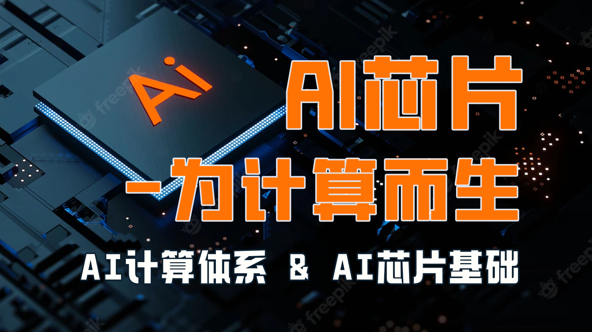
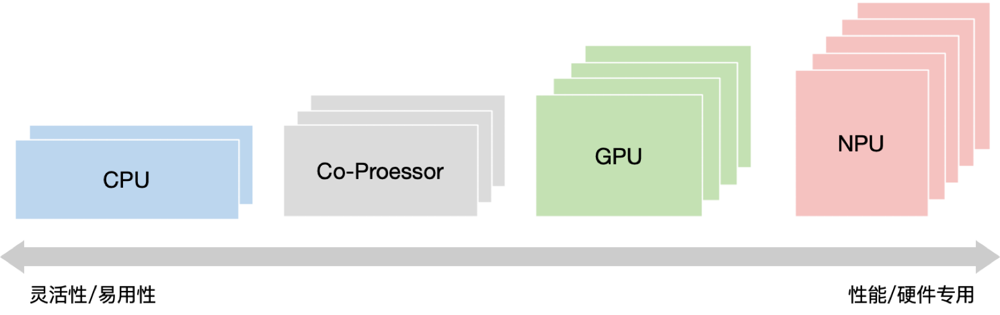
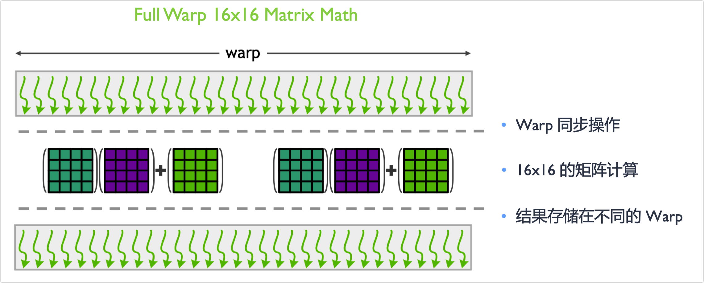

本笔记为ZOMI酱【AI芯片】系列课程的笔记

课程视频：https://space.bilibili.com/517221395/channel/series

github：https://github.com/chenzomi12/DeepLearningSystem


✿✿ヽ(°▽°)ノ✿✿✿ヽ(°▽°)ノ✿✿✿ヽ(°▽°)ノ✿✿✿ヽ(°▽°)ノ✿✿✿ヽ(°▽°)ノ✿✿✿ヽ(°▽°)ノ✿✿✿ヽ(°▽°)ノ✿

---


AI芯片这里就很硬核了，希望可以坚持到最后啦，从芯片的基础到AI芯片的范围都会涉及，芯片设计需要考虑上面AI框架的前端、后端编译，而不是停留在天天喊着吊打英伟达，被现实打趴。

## 课程简介

- 《AI 计算体系》深入深度学习计算模式，从而理解“计算”需要什么。通过AI芯片关键指标，了解AI芯片要更好的支持“计算”，需要关注那些重点工作。最后通过深度学习的计算核心“矩阵乘”来看对“计算”的实际需求和情况，为了提升计算性能、降低功耗和满足训练推理不同场景应用，对“计算”引入 TF32/BF16 等复杂多样的比特位宽。

- 《AI 芯片基础》简单从CPU开始看通用逻辑架构（冯诺依曼架构）开始，通过打开计算的本质（数据与时延）从而引出对于并行计算GPU作用和解决的业务场景，到目前最火的AI芯片NPU。最后迈入超异构并行CPU、GPU、NPU并存的计算系统架构黄金十年。

- 《GPU 原理详解》主要是深入地讲解GPU的工作原理，其最重要的指标是计算吞吐和存储和传输带宽，并对英伟达的GPU的十年5代架构进行梳理。

- 《Tensor Core 与 NVlink》英伟达架构里面专门为AI而生的 Tensor Core 和 NVLink 对AI加速尤为重要，因此重点对 Tensor Core 和 NVLink 进行深入剖析其发展、演进和架构。

希望这个系列能够给大家、朋友们带来一些些帮助，也希望自己能够继续坚持完成所有内容哈！

## 课程目标

通过《AI芯片：核心原理》这个课程，以及这门课程后面的几门课程，你将获取并且掌握的技能：

|          |                                                         |                                                 |
| :------: | :------------------------------------------------------ | :---------------------------------------------- |
| **编号** | **名称**                                                | **具体内容**                                    |
|    1     | [AI 计算体系](#第一节：AI 计算体系)                     | 神经网络等AI技术的计算模式和计算体系架构        |
|    2     | [AI 芯片基础](#第二节：AI 芯片基础)                     | CPU、GPU、NPU等芯片基础原理，与体系架构黄金10年 |
|    3     | [通用图形处理器 GPU](#第三节：GPU原理)                  | GPU的基本原理，英伟达GPU的架构发展              |
|    4     | [Tensor Core 与 NVlink](#第四节：Tensor Core 与 NVlink) | 英伟达GPU的TensorCore、NVLink深度剖析           |
|    5     | [AI专用处理器 NPU]()                                    | 华为、谷歌、特斯拉等专用AI处理器核心原理        |


# 第一节：AI 计算体系

《AI 计算体系》深入深度学习计算模式，从而理解“计算”需要什么。通过AI芯片关键指标，了解AI芯片要更好的支持“计算”，需要关注那些重点工作。最后通过深度学习的计算核心“矩阵乘”来看对“计算”的实际需求和情况，为了提升计算性能、降低功耗和满足训练推理不同场景应用，对“计算”引入 TF32/BF16 等复杂多样的比特位宽。

• 深度学习计算模式

• 计算体系与矩阵运算

## 1.1. 深度学习计算模式

在正式了解AI芯片之前，需要知道什么是深度学习的计算模式，计算模式决定了芯片的计算方式和芯片的架构等细节，因此从深度学习的经典算法、压缩算法、端侧推理模型、大模型和并行模式等重要的里程碑SOTA模型和算法为切入点，深入地了解什么是深度学习计算模式。

◦ The History – AI 的发展和范式

◦ Models Architecture – 经典模型结构

◦ Quantization and Pruning – 模型量化与剪枝

◦ Efficient Models – 轻量化网络模型

◦ Models Parallel – 大模型分布式并行

**AI的发展和范式**

AI 三大范式：监督学习、无监督学习、强化学习


### 1.1.1. 主流的网络模型结构

- 全连接 Fully Connected Layer
- 卷积层 Convolutional Layer
- 循环网络 Recurrent Layer
- 注意力机制 Attention Layer


**AI 计算模式思考 (I)**

需要支持神经网络模型的计算逻辑

◦ 权重数据共享，便于对神经元的权重值进行求和

◦ 除了卷积/全连接计算，需要支持激活等Vector计算

能够支持高维的张量存储与计算

◦ 内存 Mem 地址随机/自动索引

◦ 大 Channel 和 大 Feature Map 高效加载

支持常用神经网络模型结构

◦ Conv、MatMul、Transformer等高效矩阵乘

◦ 快速应对新的 AI 算法与结构


### 1.1.2. 量化压缩 vs 网络剪枝

• 模型量化是指通过减少权 重表示或激活所需的比特 数来压缩模型。

- 感知量化训练 Quantization Training
  - 8-bit with stochastic rounding 混合bit量化
- 减少计算比特位 Reduce number of bits
  - Binary Nets 二值化网络模型
- 非线性量化 Non-Linear Quantization
  - Log-Net
- 减少权重计算 Reduce number of unique weights and activations
  - ADD Nets 加法网络
  - XNOR-Net 异或网络模型

• 网络剪枝研究模型权重中 的冗余， 并尝试删除/修剪 冗余和非关键的权重。

- Unstructured Pruning（非结构化剪枝）
- Structured Pruning（结构化剪枝）


**AI 计算模式思考 (II)**

提供不同的 bit 位数

◦ 对于低比特量化相关的研究落地提供 int8/int4 甚至更低的精度

◦ 在 M-bits and E-bits 之间权衡 Tradeoff （如 TF32/BF16）

<u>利用硬件提供稀疏计算</u>

◦ 硬件上减少 0 值的重复计算

◦ 减少网络模型对内存的需求，稀疏化网络模型结构


### 1.1.3. 轻量化网络

设计轻量化网络模型主要2个方法：

◦ 通过改变网络模型不同层的layer shape或者卷积方式

◦ 通过 Neural Architecture Search(NAS) 来搜索更轻量化的网络模型


**AI 计算模式思考 (III)**

卷积核方面 Convolution：

1. 大卷积核用多个小卷积核代替

2. 单一尺寸卷积核用多尺寸卷积核代替

3. 固定形状卷积核趋于使用可变形卷积核

4. 使用1×1卷积核 - bottleneck结构

卷积层通道方面 Channel：

1. 标准卷积用depthwise卷积代替
2. 使用分组卷积
3. 分组卷积前使用 channel shuffle
4. 通道加权计算

卷积层连接方面 Connection：

1. 使用skip connection，让模型更深

2. densely connection，融合其它层特征输出

### 1.1.4. 大模型分布式并行

**芯片间互连技术，提供 X00GB/s 带宽**

1. 支持CPU+GPU 双架构，为大规模 AI 和HPC异构平台提供高速带宽

2. 使能 NPU 同构芯片内超快片间互连技术

**专用高速 Transformer 引擎**

◦ 大模型以Transformer为基础结构进行堆叠，高速的Transformer计算

◦ 更低比特Transformer模块，并支持MoE构建万亿大模型


### 1.1.5. Summary

1. 网络模型结构支持 Architecture

◦ 支持高维的张量存储与计算

◦ 神经网络模型的计算逻辑

2. 模型压缩(剪枝&量化) Model Compress

◦ 提供不同的 bit 位数

◦ 利用硬件提供稀疏计算

3. 轻量化网络模型 Model Slim

◦ 复杂卷积计算（小型卷积核，e.g. 1x1 Conv）

◦ 复用卷积核内存信息（Reuse Convolution）

4. 大模型分布式并行 Foundation Model

◦ 大内存容量、高速互联带宽

◦ 专用大模型DSA IP模块，提供低比特快速计算

## 1.2. AI 计算体系与矩阵运算

AI芯片的计算体系更多的是跟硬件相关的内容，而在这里，需要关注AI芯片设计过程中，我们需要关注的一些重点指标，特别是时延和吞吐量，他们跟峰值算力之间的关系。如何让AI芯片的峰值算力最高呢？最高之后我们又如何提升算力利用率呢？计算核心的利用率呢？

◦ Key Metrics – AI芯片关键指标

◦ Bit Width – 比特位数

◦ Matrix Multiplication – 矩阵运算

◦ Specialized Hardware – 专用硬件


算力单位

**OPS**

• OPS(Operations Per Second)，1T OPS 代表处理器每秒进行一万亿次 $10^{12}$ 计算

• OPS/W 每瓦特运算性能，TOPS/W 评价处理器在1W 功耗下运算能力的性能指标

**MACs**

• Multiply–Accumulate Operations，乘加累积操作。1MACs包含一个乘法操作与一个加法操作， ~2FLOPs，通常MACs与FLOPs存在一个2倍的关系。

**FLOPs**

• Floating Point Operations，浮点运算次数，用来衡量模型计算复杂度，常用作神经网络模型速度 的间接衡量标准。对于卷积层而言，FLOPs的计算公式如下：

$$
FLOPs = 2 \cdot 𝐻 \cdot 𝑊 \cdot 𝐶_{in} \cdot 𝐾 \cdot 𝐾 \cdot 𝐶_{out}
$$

**MAC**

• Memory Access Cost，内存占用量，用来评价模型在运行时的内存占用情况。 1𝑥1 卷积FLOPs 为$ 2 \cdot 𝐻 \cdot 𝑊 \cdot 𝐶_{in} \cdot 𝐶_{out}$ , 其对应MAC为：

$$
H \cdot 𝑊 \cdot (𝐶_{in}  + 𝐶_{out} +  𝐶_{in} \ast 𝐶_{out} )
$$


### 1.2.1. AI 芯片关键指标Key Metrics

1. 精度 Accuracy

◦ 计算精度 (FP32/FP16 etc.)

◦ 模型结果精度 (ImageNet 78%)

2. 吞吐量 Throughput

◦ 高维张量处理 (high dimension tensor)

◦ 实时性能 (30 fps or 20 tokens)

3. 时延 Latency

◦ 交互应用程序 (TTA)

4. 能耗 Energy

◦ IOT 设备有限的电池容量

◦ 数据中心液冷等大能耗

5. 系统价格 System Cost

◦ 硬件自身的价格

◦ 系统集成上下游全栈等成本

6. 易用性 Flexibility

◦ 衡量开发效率和开发难度

#### 1.2.1.1. AI 加速器的关键设计点

• 提升吞吐量 Increase Throughput 和降低延时 Reduce Latency

• 低延时 Low Latency 和 Batch Size 之间 Tradeoff


**AI 加速器的关键设计点： MACs**

<u>去掉没有意义的 MACs</u>

◦ 增加对稀疏数据的硬件结构 sparse data

◦ 控制流控制和执行 control flow

◦ 节省时钟周期 save cycles

<u>降低每次 MAC 的计算时间</u>

◦ 增加时钟频率 clock frequency

◦ 减少指令开销 instruction overhead


**AI 加速器的关键设计点： PE, Processing Elements**

<u>增加 PE 的核心数量</u>

◦ 更多的 MACs 并发 (parallel)

◦ 使用更高纳米制程，增加 PE 的面积密度 (area density)

<u>增加 PE 的利用率 utilization</u>

◦ 将计算负载尽可能分配到不同 PE (distribute workload)

◦ 均衡 PE 之间计算负载 (balance workloads)

◦ 合适的内存带宽有效降低空闲时钟周期 (reduce idle cycles)


Question ?

• AI芯片的关键指标里面有吞吐量 Throughput 和时延 Latency，这个主要是由什么产生的吗？

• AI芯片的关键设计点是 MACs 和 PE，感觉这个主要是针对提升单个核心的计算能力吗？


**计算性能仿真**

https://arxiv.org/abs/1807.07928


| **Step** | **Constraint**                   | **Type**           | **New Performance Bound**        | **Reason for Performance Loss**                              |
| -------- | -------------------------------- | ------------------ | -------------------------------- | ------------------------------------------------------------ |
| 1        | Layer Size and Shape             | Workload           | Max workload parallelism         | Finite workload size                                         |
| 2        | Dataflow loop nest                | Architectural      | Max dataflow parallelism          | Restricted dataflow mapping space by defined by loop nest      |
| 3        | Number of PEs                    | Architectural      | Max PE parallelism               | Additional restriction to mapping space due to shape fragmentation |
| 4        | Physical dimensions of PEs array | Architectural      | Number of active PEs             | Additional restriction to mapping space due to shape fragmentation for each dimension |
| 5        | Fixed Storage Capacity           | Architectural      | Number of active PEs             | Additional restriction to mapping space due to storage of intermediate data (de- pends on dataflow) |
| 6        | Fixed Data Bandwidth             | Microarchitectural | Max data bandwidth to active PEs | Insufficient average bandwidth to active PEs                  |
| 7        | Varying Data Access Patterns     | Microarchitectural | Actual measured performance      | Insufficient instant bandwidth to active PEs                  |

**AI 芯片的设计目标 I:降低功耗**

◦ 减少 each MAC 功耗

◦ 避免无效 MACs 计算

◦ 减少耗能的数据格式搬运 >> 数据重用

<u>芯片功耗的降低受到散热的影响</u>

<u>MACs 并行计算的吞吐提升会增加功耗</u>


#### 1.2.1.2. ==Key Metrics 与计算体系思考==

1. 精度 Accuracy

◦ 能够处理各类型的无规则数据 >> 异构平台

◦ 能够应对复杂网络模型结构 >> 计算冗余性

2. 吞吐量 Throughout

◦ 除了峰值算力，看 PE 的平均利用率 >> 负载均衡

◦ SOTA网络模型的运行时间 >> MLPerf

3. 时延 Latency

◦ 通信时延对 MACs 的影响 >> <u>优化带宽</u>

◦ Batch Size 大小与内存大小 >> <u>多级缓存设计</u>

4. 能耗 Energy

◦ 执行SOTA网络模型时候 Ops/W >> 部署场景

◦ 内存读写功耗 (e.g., DRAM) >> 降低能耗

5. 系统价格 System Cost

◦ 片内多级缓存 Cache 大小 >> 内存设计

◦ PE 数量、芯片大小、纳米制程 >> 电路设计

6. 易用性 Flexibility

◦ 对主流AI框架支持度 (PyTorch) >> 软件栈


<u>AI 芯片不仅仅作为一款硬件，更是对客户、应用提供全栈的解决方案，包括 SDK、集群管理、AI框架、AI编译器、AI驱动和通信、硬件IC产品化，最后才是 AI芯片。</u>而 AI 芯片中最重要的指标有：

1. 精度 Accuracy：决定是否能够解决具体的 AI 业务和深度学习模型；

2. 功耗 Energy：决定 AI 芯片对应产品形态具体部署在端侧、边侧还是云测；

3. 时延和吞吐 Latency & throughput：决定 AI 芯片主要性能，是否计算得足够快；


### 1.2.2. 矩阵运算

#### 1.2.2.1. CPU/GPU 支持矩阵乘的库

• **实现逻辑：**

◦ Lib 感知相乘矩阵的 Shape

◦ 选择最优的 Kernel 实现来执行

**• 实现方法：**

◦ Loop 循环优化 (Loop tiling)

◦ 多级缓存 (memory hierarchy)

**• 现有库：Matrix Multiplication (GEMM)**

◦ CPU: OpenBLAS, Intel MKL, etc.

◦ GPU: cuBLAS, cuDNN, etc.


#### 1.2.2.2. 卷积代替算法

**• Fast Fourier Transform [mathieu, ICLR 2014]**

◦ Pro：计算量从 $O ( 𝑁_0^2 𝑁_f^2 )$ to $O ( 𝑁_0^2 long_2N_0 ) $

◦ Con：增加内存存储空间

**• Strassen [Cong, ICANN 2014]**

◦ Pro：计算量从 $O(N^3)$ to $O(N^{2.807})$

◦ Con：数值稳定性问题

**• Winograd [Lavin, CVPR 2016]**

◦ Pro：3x3等小矩阵由2.X倍加速

◦ Con：额外辅助矩阵，辅助矩阵依赖于卷积核大小


#### 1.2.2.3. 减少指令开销

<u>**每个指令执行更多的 MACs 计算**</u>

◦ CPU：SIMD / Vector 指令

◦ GPU：SIMT / Tensor 指令

◦ NPU：SIMD / Tensor 、 Vector 指令

**在不增加内存带宽的前提下，<u>单时钟周期内执行更多的 MACs 计算</u>**

◦ 支持低比特计算 (e.g., 512bits per cycle, perform 64 8-bit MACs vs 16 32-bit MACs)


#### 1.2.2.4. ==矩阵运算计算体系思考==

**软件 Software**

◦ 减少没有必要的 MACs：使用其他代替算法

◦ 增加 PE 利用率：对kernel实现进行Loop优化和Memory优化

**硬件 Hardware**

◦ 减少每次 MAC 计算的时间

- 增加 PE 单元计算能力

◦ 增加 MACs 并行计算能力

- 增加片内 PE 数量

- 支持低bits数PE计算

◦ 增加 PE 利用率

- 增加片内 Cache

- 额外的内存带宽


### 1.2.3. 比特位数Bits Width

> 参考《推理引擎：核心原理：3.1. 模型量化》

**什么决定比特位宽 Bit Width ?**

在AI流程里，不同数据会使用不同类型格式， 才能保证精度达标。

• 训练 Training: weights, activation, partial sums, gradients and weight update.

• 推理 Inference: weights, activations, partial sums


• Floating Point(FP) allows range to change for each value(E-bits) 

• Fixed Point(Int) has fixed range

CPU 或者 GPU 默认采用 FP32

#### 1.2.3.1. 降低精度（降低 bit width ）

• 对于 MAC 的输入和输出，能够有效减少数据的搬运和存储开销

• 减少 MAC 计算的开销和代价


降低位宽对功耗和芯片面积的影响


市面上已经推出 8-bit 推理 & 16-bit float 训练的产品

- 华为昇腾 910
- NVIDIA A100

#### 1.2.3.2. AI 芯片设计的思考

**Reduce number of unique values – Precision(M-bits)**

◦ Default: Uniform <u>quantization</u> (values are equally spaced out)

◦ None-uniform quantization (spacing can be computed)

◦ Fewer unique values can make transforms and compression more effective

**Reduce dynamic range(E-bits)**

◦ If Possible, <u>fix range</u> (used fixed point)

◦ <u>Share range across group of values</u> (weights for a layer or channel)

**Tradeoff between number of bits allocated to M-bits and E-bits**


**对精度的影响 Impact on Accuracy**

◦ 需要考虑不同数据集（NLP/CV）、不同任务

◦ 不同网络模型之间的差异进行测评 （e.g., classification > detection）

**训练和推理的数据位宽**

◦ 32bit float 可以作为弱基线；

◦ <u>对于训练使用 FP16、BF16、TF32；</u>

<u>◦ 推理 CV 任务以 int8 为主，NLP 以 FP16为主，大模型 int8/FP16 混合；</u>

**权衡硬件的成本开销**

◦ 支持额外的数据位宽需要引入更多的电路

◦ 新增多少额外的数据位宽合适？


#### 1.2.3.3. 数据稀疏

**减少 MACs 计算**

◦ 0 × 0 都为零，此类计算可以减少 MACs

◦ 减少不必要计算，从而降低功耗

**减少数据搬运**

◦ 如果发现一个数据为 0，可以避免对另外数据的搬运

◦ 只传输/搬运非 0 数据

<u> CPU/GPU/NPU 对随机稀疏计算并不友好，因此对稀疏矩阵计算需要专用硬件</u>


### 1.2.4. **Summary**

1. 整体看看 AI or 深度学习计算模式：经典模型结构和轻量化模型结构、模型量化和剪枝到大模型分布式并行，从而理解“计算”需要什么。
2. 通过AI芯片关键指标，了解一块AI芯片要更好的支持“计算”，需要关注那些重点工作；从而引出峰值算力和带宽之间的关系。
3. 最后通过深度学习的计算核心“矩阵乘”来看对“计算”的实际需求和情况，为了提升计算性能、降低功耗和满足训练推理不同场景应用，对“计算”引入 TF32/BF16 等复杂多样的比特位宽。


# 第二节：AI 芯片基础

《AI芯片基础》简单从CPU开始看通用逻辑架构（冯诺依曼架构）开始，通过打开计算的本质（数据与时延）从而引出对于并行计算GPU作用和解决的业务场景，到目前最火的AI芯片NPU。最后迈入超异构并行CPU、GPU、NPU并存的计算系统架构黄金十年。

• 通用处理器 CPU

• 从数据看 CPU 计算

• 通用图形处理器 GPU

• AI专用处理器 NPU/TPU

• 计算体系架构的黄金10年


## 2.1. 通用处理器 CPU

◦ The History – CPU 发展历史和组成

◦ Parallel Architecture – CPU 并行处理架构

◦ RoadMap of AI Chip – ISA指令集架构

◦ Application – CPU的应用场景


### 2.1.1. CPU发展历史和组成

• ENIAC：(Electronic Numerical Integrator And Calculator，电子数字积分计算机）世界上 第一台真正意义上的计算机，于1946年在美国宾夕法尼亚大学投入运行，采用十进制进行数据 存储。ENIAC的发明，奠定了电子计算机的发展基础，开辟了信息时代的新纪元，是人类第三 次产业革命开始的标志，具有重要的历史意义。

• EDVAC：（Electronic Discrete Variable Automatic Computer，电子离散变量自动计算机 ）。世界上首次提出的第一台采用二进制的冯·诺依曼计算机，由运算器、控制器、存储器、输 入和输出设备5部分组成。1945年3月由冯·诺伊曼本人与莫奇利、埃克特等提出，1951年最终 完成。


从彼时至今，无论CPU的具体实现怎么变、晶体管数量翻多少番，它的构成始终由<u>运算器、控制器和寄存器</u>这三大部分组成。


**运算器**：也叫算术逻辑单元（ALU），负责算术运算和逻辑运算。


**寄存器：**分为指令寄存器和数据寄存器，负责暂存指令、ALU所需操作数、ALU算出结果等。


**控制器：**负责调度工作，包括对要执行的指令进行译码、从内存中调取数据给寄存器、向运算 器和寄存器发出具体操作指令等。


**CPU 工作流程**

主要分为4步：1）从内存提取指令；2）解码；3）执行；4）写回。

**冯 · 诺依曼架构**

CPU三大组成的各自分工，控制器和寄存器负责的工作最多、要存的数据最多的两部分。


**CPU架构**

CPU主要擅长是逻辑控制，而非计算。

**约束与限制**

• 实质上ALU模块(逻辑运算单元)是用来完成数据计算，其他各个模块的存在都是为了保证指令 能够一条接一条的有序执行。这种通用性结构对于传统的编程计算模式非常适合，同时可以通过<u>提升CPU主频(提升单位时间内执行指令的条数)来提升计算速度。</u>

• 但是，依照冯·诺依曼架构针对指令的“顺序执行”的原则，CPU 只能执行完一条指令再来下 一条，计算能力进一步受限。

### 2.1.2. 并行处理架构

> 参考《AI框架核心技术：4.4.1. 并行处理硬件架构》

• 单指令流单数流（SISD）系统。

• 单指令流多数据流（SIMD）系统。

- 单指令多线程SIMT 系统（GPU）

• 多指令流单数据流（MISD）系统。

• 多指令流多数据流（MIMD）系统。


### 2.1.3. ISA指令集架构

**ISA - Instruction Set Architecture**

• CPU 的全称叫中央处理器单元，通常用来区分 CPU 的标准是指令集架构（Instruction Set Architecture，简称 ISA）。 

• <u>开发人员基于指令集架构（ISA），使用不同的处理器硬件实现方案，来设计不同性能的处理器 ，因此 ISA 又被视作 CPU 的灵魂。</u>


**ISA -基本分类**

• 运算指令：在 ALU 中执行的计算操作

• 数据移动指令：读写存储操作（包括寄存器读写）

• 控制指令：更改指令执行顺序，进行程序跳转，实现 if/else，循环等

**ISA -生命周期**

• FETCH：将Memory中的指令放入Instruction Register ，PC指定指令位置

• DECODE：通过指令解码过程，识别指令内容，开启控制信号通路

• EVALUATE ADDRESS：比如加载内存之前，通过寄存器内容和偏移量获得真正的内存位置

• FETCH OPERANDS：加载寄存器中的操作数，不同指令实际执行的内容不同

• EXECUTE：在ALU中执行计算逻辑

• STORE RESULT：存储计算结果


<u>可以将指令集架构理解为一个抽象层，它是处理器底层硬件与运行在硬件上的软件之间桥梁和接口。</u>


**ISA 的作用**

• 这个计算机架构里有多少个寄存器（Register）？

• 我能进行哪些运算操作？（有哪些指令？ADD，SUB，MUL等等）

• 如果遇到异常或者中断该怎么办？

• 数据可以有哪些类型？最多有几个字节？


**CISC 架构与 RISC 架构**

• CISC 架构：除常用指令还包含许多不常用特殊指令。随着越来越多的特殊指令被添加到 CISC 架构中，常用程序运算指令仅占指令集 20%，80% 指令则很少用到，而这些很少用到的指令让 CPU 的设计变得极其复杂，大大增加了硬件设计的时间成本和面积开销。

• RISC 架构：只包含处理器常用指令，对于不常用操作，执行多条常用指令的方式来达到同样 的效果。因而在 RISC 架构诞生后，移动端设备设计的 CPU 都倾向于选择使用 RISC 架构。

|                  | **CISC**                             | **RISC**                             |
| ---------------- | ------------------------------------ | ------------------------------------ |
| **指令系统**     | 复杂，庞大                           | 简单，精简                           |
| **指令数据**     | >200                                 | <100                                 |
| **指令长度**     | 不固定                               | 定长                                 |
| **可访存指令**   | 不加限制                             | 只有Load/Store指令                   |
| **指令执行时间** | 相差较大                             | 大部分在一个周期内完成               |
| **指令使用频率** | 相差较大                             | 都比较常用                           |
| **通用寄存器数** | 较少                                 | 多                                   |
| **目标代码**     | 难以用优化编译生成高效的目标代码程序 | 采用优化的编译程序，生成代码较为高效 |
| **控制方式**     | 微程序控制                           | 组合逻辑控制                         |
| **指令流水**     | 可以通过一定方式实现                 | 必须实现                             |

CPU 于上世纪 60 年代问世，已发展几十年，有几十种不同的指令集架构相继诞生或消亡。

| 指令集架构 | 指令集架构                                                   | 公司          |
| ---------- | ------------------------------------------------------------ | ------------- |
| X86        | CISC 架构个人计算机的标准处理器架构                          | Intel/AMD     |
| ARM        | 32 位和 64 位 RISC 系列声名显赫，无处不在                    | ARM           |
| RISC-V     | 完全开放的指令集，源自名校，兴于开源                         | RISC-V 基金会 |
| SPARC      | 高性能 RISC 架构的代表针对服务器领域设计                     | Sun           |
| Power      | RISC 架构高性能领域优势明显应用于高端服务器                  | IBM           |
| ARC        | 32 位 RISC 架构以极高的能效比见长                            | Synopsys      |
| MIPS       | 简洁优化 RISC 架构，广泛用于嵌入式设备及消费领域仅次于 ARM   | /             |
| Alpha      | 64 位 RISC 架构处理器多应用于企业级服务器但价格高昂、部署困难，淡出市场 | /             |

### 2.1.4. CPU应用场景

CPU 典型应用领域及主流架构


### 2.1.5. Summary

- CPU 具备图灵完备，可自运行的处理器。其主动从指 令内存读取指令流，然后译码后执行；指令执行会涉 及到数据的载入(Load)、计算和存储(Store)。

- ISA 是计算机体系结构与编程相关的部分，定义了： 指令集、数据类型、寄存器、寻址模式、内存管理、 I/O模型等。

- 可以把 CPU 简单地分为控制平面和计算平面两部分 ，CPU 作为指令流驱动计算的处理引擎。


Ref

1. Processor Architecture Design Practices: survey & Issues

## 2.2. 从数据看 CPU 计算

服务器的性能趋势


GPU 性能趋势


训练 AI 大模型的时间


逻辑电路技术趋势预测


谁会在乎算力呢？


**你真的在乎算力？**

物理定律和硬件本身很大程度决定了我们对机器的编程方式。

当我们对计算本身有更深入的了解时候， 才会慢慢看到本质的问题：我的数据在哪里？

How many operations must I do on some data to make it worth the cost of loading it?


So for every number load from memory, Need to do **80 Operations** on it to break even.


|                      | AMD Rome 7742 | Intel Xeon 8280 | NVIDIA A100 |
| -------------------- | ------------- | --------------- | ----------- |
| Peak FP64 Giga Flops | 2,190         | 2,300           | 19,500      |
| Memory B/W (GB/sec)  | 131           | 204             | 1,555       |
| Compute Intensity    | 134           | 90              | 100         |


ZOMI并不是很在乎算力，更应该关注内存、带宽 >> 时延。


### 2.2.1. 计算时延

DAXPY 计算 DEMO


光与电的传播速度

Speed of Light = 300,000,000 M/S 

Computer Clock = 3,000,000,000 Hz 

Speed of Electricity = 60,000,000 M/S

所以在一个时钟周期电流的传播速度为 20mm (~0.8 inches)

CPU到DRAM之间需要5~6个时钟周期（时延），而CPU一个时钟周期可以进行非常多FLOPS计算。


AXY demo move 16 byes per 89 ns latency, Memory efficiency = 0.14%.


## 2.3. 通用图形处理器 GPU

◦ The History – GPU 发展历史和组成

◦ Difference GPU/CPU – GPU 和 CPU 的区别

◦ Why AI Need GPU – AI发展需要GPU

◦ Application – CPU的应用场景


### 2.3.1. GPU发展历史

• 第一代GPU（ Before 1999 ）：部分功能从CPU分离， 实现针对图形图形处理的硬件加速。以 几何处理引擎 GEOMETRY ENGINE 为代表，只能起到 3D 图像处理的加速作用，不具有软件编 程特性。

• 第二代 GPU（1999-2005）， 实现进一步的硬件加速和有限的编程性。

- 1999年，英伟达发布了专为执行复杂的数学和几何计算的 GeForce256 图像处理芯片，将更多 的晶体管用作执行单元， 而不是像 CPU 那样用作复杂的控制单元和缓存，将(TRANSFORM AND LIGHTING) 等功能从 CPU 分离出来，实现了图形快速变换，这成为 GPU 真正出现的标 志。

- 2000-2005年， GPU 技术快速发展，运算速度迅速超过 CPU。2001年英伟达和ATI 分别推出 GEFORCE3 和 RADEON 8500，图形硬件的流水线被定义为流处理器，出现了顶点级可编程性 ，同时像素级也具有有限的编程性。但 GPU 的整体编程性仍然比较有限。

• 第三代 GPU（2006~），实现方便的编程环境创建， 可以直接编写程序。

- 2006 年，英伟达与 ATI 分别推出了CUDA（ Compute United Device Architecture ）和CTM（ CLOSE TO THE METAL ）编程环境， 使得 GPU 打破图形语言的局限成为真正的并行数据处理 超级加速器。

- 2008 年，苹果公司提出一个通用的并行计算编程平台 OPENCL（开放运算语言），与 CUDA 绑定在英伟达的显卡上不同，OPENCL 和具体的计算设备无关，并迅速成为移动端GPU的编程 环境业界标准。


### 2.3.2. GPU vs CPU

• 正如其全称“图形计算单元”，GPU的初衷主要是为了接替CPU进行图形渲染的工作。因为图 像上的每一个像素点都需要处理，这项任务计算量相当大。尤其遇上一个复杂的三维场景，就 需要在一秒内处理几千万个三角形顶点和光栅化几十亿的像素。不过，由于每个像素点处理的 过程和方式相差无几，这项艰巨的任务可以靠并行计算来化解。

• GPU几乎主要由计算单元ALU组成，仅有少量的控制单元和存储单元。<u>GPU采用了数量众多的 计算单元和超长的流水线，但只有非常简单的控制逻辑并省去了Cache。</u>

• CPU不仅被Cache占据了大量空间，而且还有有复杂的控制逻辑和诸多优化电路，相比之下计 算能力只是CPU很小的一部分。


**GPU Architecture**

• GPU Cache：GPU 特点是有很多 ALU 很少 Cache，<u>缓存目的不是保存后面需要访问的数据， 与CPU不同，而是为 Threads 提供服务。</u>

• Reason：<u>如果有很多 Threads 线程需要访问同一段数据，缓存会合并这些访问，然后再去访问 DRAM，获取数据后 Cache 会统一转发该数据到对应 Threads 线程。</u>


**GPU 适合处理的程序**

1. 计算密集型程序：所谓计算密集型 (Compute-intensive) 程序，大部分运行时间消耗在寄存器 运算上，寄存器的速度和处理器的速度相当，从寄存器读写数据几乎没有延时。

2. 易于并行程序：GPU 虽然叫 SIMT，其实为特殊的 SIMD(Single Instruction Multiple Data) 架构 ， 拥有成百上千个核 CUDA Core，每一个核在同一时间能执行同样指令。


### 2.3.3. AI 遇到 GPU

• 2012年，Hinton 和 Alex Krizhevsky 设计了 AlexNet，使用了两块英伟达 GTX 580 训练了两周 AlexNet，将计算机图像识别的正确率提升了一个数量级，并获得了 2012 年 ImageNet 竞赛冠 军，充分展示了GPU在AI计算中的巨大潜力。

• 谷歌使用 1000 台 CPU 服务器，基于Google YouTube 视频同的数据完成了猫狗识别的任务，而 2012 年吴恩达等采用 3 台 GTX680-GPU 服务器完成了同样的任务。

• 毋庸置疑，AlexNet 和吴恩达等工作在业界和学界都产生了良好的示范效应。或许从这段时间 开始，学术界关于AI相关的研究逐渐更多的采用了GPU，互联网头部厂商也陆续开始引入GPU 到各自的生产研发环境。

• 从2005/2006年开始有人尝试用GPU进行AI计算，到2012/2013年GPU被更大范围的接受，以及到 2016/2017年GPU称为AI计算的标配，具有一定的偶然性，发现深度学习网络层次越深、网络规 模越大，GPU的加速效果越显著。

Why GPU ？

• 深度学习每个计算任务都独立于其他计算，任何计算都不依赖于其他计算结果，可以采用高度 并行的方式进行计算。

• GPU 相比 CPU 拥有更多独立大吞吐量计算通道，较少控制单元使其不会受到计算以外更多任 务干扰，拥有比CPU更纯粹计算环境。


## 2.4. AI专用处理器

◦ What is AI Chip - 什么是AI芯片

◦ Task and Development - AI 芯片任务和部署

◦ RoadMap of AI Chip - AI 芯片技术路线

◦ Application scenario - AI芯片应用场景

### 2.4.1. 什么是 AI 芯片

DSA：特定领域的体系结构，通常被称 为加速器，因为与在通用 CPU 上执行整 个应用程序相比，它们可以加速某些应 用程序。

• 好处：DSA 可以实现更好的性能，因为 它们更贴近应用的实际需求；DSA 例子， 包括图形加速单元（即GPU），用于深 度学习的神经网络处理器（NPU/TPU）， 以及软件定义处理器（SDN）。

• AI 芯片：AI 加速器或计算卡，专门用于加速 AI 应用中的大量计算任务的模块。AI 芯片是用于运行 AI 算法的专用处理器，<u>与传统芯片（如CPU）的区别在于专用性 或通用性的侧重上。</u>


**AI Chip vs CPU and GPU**


### 2.4.2. AI芯片任务和部署

AI 芯片任务：训练 与 推理

AI 芯片部署方式：云、边、端


### 2.4.3. AI芯片技术路线

作为加速应用的AI芯片，主要的技术路线有三种：GPU、FPGA、ASIC。

|                | **GPU**                  | **FPGA**                               | **ASIC**                               |
| -------------- | ------------------------ | -------------------------------------- | -------------------------------------- |
| **定制化程度** | 通用                     | 半定制化                               | 定制化                                 |
| **灵活性**     | 好                       | 好                                     | 不好                                   |
| **成本**       | 高                       | 较高                                   | 低                                     |
| **编程语言**   | CUDA/OpenCL              | Verilog/VHDL，OpenCL/HLS               | /                                      |
| **功耗**       | 高                       | 较高                                   | 较高                                   |
| **优点**       | 峰值计算能力强，产品成熟 | 平均性能较高，功耗较低，灵活性强       | 专用性能强，功耗较低                   |
| **缺点**       | 整体算力利用率低，功耗高 | 量产单价高，峰值算力低，上层软件构筑难 | 上层软件构筑难，针对具体应用，泛化性差 |
| **应用场景**   | 云端训练、云端推理       | 云端推理、终端推理                     | 云端训练与推理、终端推理               |

**GPU**

图形处理器 GPU（Graphics Processing Unit）：由大量计算核心组成的大规模并行计算架构，专为同时处理多重任务而设计。

**FPGA**

FPGA（Field-Programmable Gate Array），现场可编程门阵列。作为专用集成电路领域中的一种半定制电路出现。FPGA利用门电路直接运算，速度快，而用户可以自由定义这些门电路 和存储器之间的布线，改变执行方案，以期得到最佳效果。

• <u>FPGA可以采用OpenCL等更高效的编程语言，降低了硬件编程的难度</u>，还可以集成重要的控制 功能，整合系统模块，提高了应用的灵活性，与GPU相比，FPGA具备更强的平均计算能力和更 低的功耗。

• <u>FPGA适用于多指令，单数据流的分析，与GPU相反，因此常用于推理阶段。FPGA是用硬件实 现软件算法，因此在实现复杂算法方面有一定的难度，缺点是价格比较高。</u>


**ASIC**

ASIC（Application Specific Integrated Circuits），即专用集成电路，是一种为专用目的设计，面向特定用户需求的定制芯片，在大规模量产的情况下具备性能更强、体积更小、功耗更 低、成本更低、可靠性更髙等优点。

• ASIC与GPU和FPGA不同，GPU和FPGA除了是一种技术路线之外，还是实实在在的确定产品， 而<u>ASIC就是一种技术路线或者方案，其呈现出的最终形态与功能也是多种多样。</u>

Google TPU：


### 2.4.4. AI 芯片应用场景

AI 计算中心、自动驾驶、安防应用、IOT AI应用...


1. Int8 是嵌入式、自主和数据中心推理应用的默认数值精度。对于大多数AI/ML应用程序，int8 精度够用了。但是部分加速器仍然使用 fp16/bf16进行训练或者推理。

2. 在数据中心领域，密度变得非常拥挤。在过去的几年里，NVIDIA、Huawei、Google等头部厂 商都相续发布了对应AI计算中心的AI训练加速器。在计算中心中，为了突破互联带宽 PCIe v4 300W的功率限制，PCIe v5备受期待。

3. 各大厂商针对训练芯片发布了令人印象深刻的性能数据，而且这些公司还宣布了高度可扩展 的互联技术，可以将数千张卡片连接在一起。这对于像 Cerebras、GraphCore、Groq、Tesla Dojo的数据流加速器尤其重要，这些加速器是显式/静态编程，或者是路由到计算硬件上的。 互联技术使这些加速器能够适应像 ChatGPT 这样的千亿参数大的模型。

从2017年开始，苹果、华为海思、高通、联发科等主要芯片厂商相继发布支持AI加速功能的新 一代芯片，AI芯片逐渐向中端产品渗透。AI 应用和 AI 部署也将会呈现更多的结合生态。

## 2.5. 计算体系架构的黄金10年

AI 芯片发展

1. 第一阶段：芯片算力不足，神经网络没有被受到重视；

2. 第二阶段：CPU 算力大幅提升，但仍然无法满足神经网络增长需求；

3. 第三阶段：GPU 和AI芯片新架构推动人工智能快速落地；

### 2.5.1. 异构与超异构场景

**异构计算的出现**

• 目前主流计算机微处理器普遍采用冯•诺依曼结构，受半导体物理技术和功耗（CPU主频达到制 造工艺的极限，随着主频提高，功耗上升）、计算效率的限制，微处理器运算速度的提高已经 趋于缓慢，<u>基于多核处理器或者集群计算机的并行计算技术逐渐成为提高计算机运算性能的主要手段。</u>

• 并行计算中的微处理器同样受冯•诺依曼瓶颈制约，在处理数据密集型计算时，计算速度和性价 比不理想（深度学习计算领域，虽然NPU性能优于CPU，但NPU上层软件依然滞后），各大科 研机构和芯片厂商都在探索基于异构计算 AI 芯片，希望 NPU 未来像 GPU 一样成为计算机体 系的标配。

• <u>由于系统功耗限制、欠缺和芯片结构匹配的上层基础软件，想要在HPC中发挥AI芯片计算效率 优势，只有在异构计算模式下采用新的计算原理、开发高性能算法和大规模并行基础软件。</u>

**CPU 与 GPU 的异构工作流程 Workflow**

• CPU把数据准备好，并保存在CPU内存中；

• 将待处理的数据从CPU内存复制到GPU内存（处理①）；

• CPU指示GPU工作，配置并启动GPU内核（处理②）；

• 多个GPU内核并行执行，处理准备好的数据（图中的③处理）；

• 处理完成后，将处理结果复制回CPU内存（处理④）；

• CPU把GPU的结果进行后续处理。


**AISC**

通过驱动程序和CSR和可配置表项交互，以此来控制硬件运行。和GPU类似，ASIC的运行依然需 要CPU的参与：

• 数据输入：数据在内存准备好，CPU控制ASIC输入逻辑，把数据从内存搬到处理器；

• 数据输出：CPU控制ASIC输出逻辑，把数据从处理器搬到内存，等待后续处理。

• 运行控制：控制CSR、可配置表项、中断等；


**从 CPU 到 ASIC ，架构越来越碎片化**

• 宽度表示场景覆盖度；

• 高度代表专用性能；



• 指令是软件和硬件的媒介，指令的复杂度（单位计算密度）决定了系统的软硬件解耦程度，典 型的处理器平台大致分为CPU、协处理器、GPU、FPGA、DSA、ASIC。<u>指令复杂度越高，单个 处理器器覆盖的场景就会越小，处理器器的形态就会越多。</u>

• 从CPU到ASIC，处理器越来越碎片化，构建生态越来越困难。

**异构计算的问题**

CPU + XPU 异构计算中的 XPU ，决定了整个系统的性能/灵活性特征：

1. GPU 灵活性较好，但性能效率不够极致；

2. DSA 性能好，但灵活性差，难以适应复杂计算场景对灵活性的要求。

3. FPGA 功耗和成本高，需要一些定制开发，落地案例不多。

4. ASIC 功能完全固定，难以适应灵活多变复杂计算场景。

本质矛盾：单一处理器无法兼顾性能和灵活性。

### 2.5.2. 从异构到超异构

why now ?

1. 需求驱动：软件新应用层出不穷，两年一个新热点；并且， 已有的热点技术仍在快速演进。元宇宙是继互联网和移动互 联网之后的下一个互联网形态，要想实现元宇宙级别的体验 ，需将算力提升1000倍。

2. 工艺和封装支撑：工艺封装持续进步，10nm以下芯片从2D-3D->4D。Chiplet使得在单芯片层次，可以构建规模数量级 提升的超大系统。系统规模越大，超异构的优势越明显。

3. 系统架构持续创新：通过架构创新，在单芯片层次，实现多 个数量级的性能提升。挑战：异构编程很难，超异构编程更 是难上加难；如何更好地驾驭超异构，是成败的关键。


**计算架构演进**

计算从单核的串行走向多核的并行；又进一步从同构并行走向异构并行。


计算需要进一步从异构并行走向超异构并行。异构计算是 CPU + XPU 的两个层次的处理器类型，而超异构计算则是 CPU + GPU + DSA 三个层次的处理器类型。


### 2.5.3. 超异构计算

超异构计算，非简单的集成，而是把更多的异构计算整合重构，各类型处理器间充分、灵活的数据交互，形成统一的超异构计算体系。

1. <u>超大规模的计算集群；</u>
2. <u>复杂计算系统，由分层分块组件组成；</u>


### 2.5.4. 超异构挑战与思考

**超异构的软件层**

软件需要跨平台复用：跨架构、跨不同处理器类型、跨厂家平台、跨不同位置、跨不同设备类型。因此软件架构的复杂性增长，会成为一个最大的挑战。

Question?

• 如此复杂的超异构该如何驾驭？

**开放生态、接入社区**

- 开放接口/架构及生态：形成标准的开放接口/架构；开发者遵循接口/架构开发产品和服务，从而形成开放生态。
- 软件兼容：尽可能减少针对已有应用的定制化开发，兼容已有软件生态，通过基础软件（如编译层）对接加速应用软件；
- 编程体系：提供门槛更低的编译体系，通过编程体系构建上层加速库从而对接领域应用，即提供门槛较低的标准领域编程语言（如CUDA）；
- 开放架构：进一步开放软硬件架构，防止架构过多导致的市场碎片化，如90年代编译器风起云涌到目前聚焦2/3个编译器。

Question?

• 硬件定义软件，还是软件定义硬件？


**硬件定义软件：**

◦ 系统业务逻辑以硬件实现为主，软件实现为辅；软件 依赖于硬件提供的接口构建（e.g. 早期的操作系统） 。

**软件定义硬件：**

1. 系统业务逻辑以软件实现为主，硬件实现为辅（e.g.，AI4SIC模拟仿真软件）；

2. 硬件对于软件可编程，硬件按照软件编程逻辑执行操 作（e.g.，带有渲染管道Pipeline的GPU）；

3. 硬件依赖于软件提供的接口构建（e.g. AI 算法）


<u>硬件定义软件，还是软件定义硬件，跟系统复杂度是休戚相关</u>：系统复杂度过高，实现难以一次到位，系统实现，变成了持续优化和迭代的 过程。

**计算体系 vs 编译体系**

• 超异构架构的处理器越来越多，需要<u>构建高效、标准、开放接口和架构体系（e.g.，OpenCL）</u>， 才能构建一致性的宏架构（多种架构组合）平台，才能避免场景覆盖的碎片化。

• 现在正处于计算体系变革和编译体系变革10年，避免为了某个应用加速而去进行非必要大量上 层应用迁移对接到硬件API，<u>应交由一致性的宏架构（多种架构组合）平台（编译/操作系统）。</u>

**计算资源中心化，提升算力利用率**

1. 跨同类处理器架构：应用软件可跨x86、ARM和RISC-V等CPU运行。

2. 跨不同类处理器架构：软件跨CPU、GPU、FPGA和DSA等处理器运行。

3. 跨芯片平台：软件在 Intel、Huawei、NVIDIA 等不同公司芯片运行。

4. 跨云边端：计算根据应用场景的部署情况，自适应选择运行在云边端中。

• 跨平台统一计算架构，把孤岛计算资源连接起来，实现计算资源池化，提升算力利用率。

==• 超异构时代，形成开放生态，让计算资源形成资源池，满足更复杂的应用场景对算力无限的需求。==


### 2.5.5. Summary 

**软件应用算法支持硬件加速：**

• 软件架构调整，控制面和计算/数据面分开，并接口标准化；

• 加速硬件的资源触发，底层基础软件（编译器）自适应选择计算/数据；

• 数据输入/输出来源于软件，也可以来源于硬件，更多可以下沉到硬件独立传输计算；

**极致性能优化的分层可编程体系架构：**

• 在超异构系统中，绝大部分计算交由给DSA进行极致计算，因此系统整体性能效率接近DSA；

• 用户角度应用运行在CPU，开发者感知的是CPU可编程，通过操作系统和编译器区分异构；

• Chiplet + 超异构，系统规模数量级提升，使得整体超异构系统性能数量级提升；


1. <u>超异构计算架构</u>：CPU+GPU+FPGA+DSA 多架构处理器组成的超异构计算。目标是接近CPU的灵活性， 接近ASIC的性能效率，实现不影响开发效率下的数量级整体性能提升。

2. <u>平台化 & 可编程</u>：目标软件定义一切，硬件加速一切。完全可软件编程的硬件加速平台，完全由软件 编程决定业务逻辑。足够通用性，满足多场景、多用户需求，满足业务演进。

3. <u>建立标准 & 开放生态</u>：架构/接口标准的开放，持续演进，拥抱开源开放的生态，支持云原生、云网边端融合，实现用户无（硬件/框架等）等平台依赖。


# 第三节：GPU原理

**硬件基础**

• GPU 工作原理

• GPU AI编程本质

**英伟达 GPU 架构**

• GPU基础概念

• 从 Fermi 到 Volta 架构

• Turing 到 Hopper 架构

• Tensor Core 和 NVLink 详解


## 3.1. GPU 工作原理

GPU 图形处理器（graphics processing unit），又称显示核心/视觉处理器/显示芯片。那么GPU的工作原理是什么？为什么GPU能够处理并行的数据和指令？GPU的多级缓存Cache和GPU的线程Thread是什么关系？

◦ AX+Y DEMO – AX+Y 例子

◦ What is inference system – 并发与并行

◦ Optimization objectives and constraints – GPU 缓存机制

◦ Difference bet inference system and engine – GPU线程原理


What is GPU：

• GPU (Graphics Processing Units, GPUs) 原是设计用于处理图像视频等数据。

What Make GPU Diff CPU：

• 真正让GPU与CPU不同的是，GPU设计目标是最大化吞吐量 (Throughout)，比单任务执行快慢，更关心并行度 (parallelism)，即同 时可以执行多少任务；CPU则更关心延迟 (latency) 和并发 (concu rrency)。


### 3.1.1. AX+Y DEMO

上接[2.2.1. 计算时延](#2.2.1. 计算时延)

Z=AX+Y 通过**并发**进行循环展开


Z=AX+Y 通过**并行**进行循环展开


AX+Y 硬件架构线程区别

|                        | AMD Rome 7742 | Intel Xeon 8280 | NVIDIA A100 |
| ---------------------- | ------------- | --------------- | ----------- |
| Memory B/W(GB/sec)     | 204           | 143             | 1555        |
| DRAM Latency(ns)       | 122           | 89              | 404         |
| Peak bytes per latency | 24,888        | 12,727          | 628,220     |
| Memory Efficiency      | 0.064%        | 0.13%           | 0.0025%     |
| Threads required       | 1,556         | 729             | 39,264      |
| Threads available      | 2048          | 896             | 221,184     |
| <u>Thread Ration</u>   | 1.3X          | 1.2X            | 5.6X        |

### 3.1.2. GPU 缓存机制


由于从CPU传输数据（PCIe）时延太高，所以需要GPU显存（HBM）存储数据。


不同缓存之间的计算强度：

| Data Location | Bandwidth (GB/sec) | Compute Intensity |Latency (ns) | Threads Required |
| ------------- | ------------------ | ----------------- |------------ | ---------------- |
| L1 Cache      | 19,400             | 8                 |27           | 32,738           |
| L2 Cache      | 4,000              | 39                |150          | 37,500           |
| HBM           | 1,555              | 100               |404          | 39,264           |
| NVLink        | 300                | 520               |700          | 13,125           |
| PCIe          | 25                 | 6240              |1470         | 2297             |

### 3.1.3. GPU 线程原理

> 参见[3.2.2. GPU 线程分级](#3.2.2. GPU 线程分级)、[3.3.1.3. CUDA线程层次结构](#3.3.1.3. CUDA线程层次结构)、 [4.2. Tensor Core 深度剖析](#4.2. Tensor Core 深度剖析)

GPU SMs 线程超配

|                 | Pre SM | A100    |
| --------------- | ------ | ------- |
| Total Threads   | 2048   | 221,184 |
| Total Warps     | 64     | 6,912   |
| Active Warps    | 4      | 432     |
| Waiting Warps   | 60     | 6,480   |
| Active Threads  | 128    | 13,824  |
| Waiting Threads | 1,920  | 207,360 |


## 3.2. GPU AI编程本质

为什么GPU更加适用于AI训练呢？为什么AI训练大家使用GPU而不是CPU呢？

◦ Convolutional computation – 卷积计算

◦ GPU Thread hierarchical – GPU线程分级

◦ Relation of AI and Thread - AI计算模式和线程关系

◦ Algorithmic efficiency – 矩阵乘的算力利用率


### 3.2.1. 卷积计算

> 参考《推理引擎：核心原理：5.1. Conv Kernel 优化》


### 3.2.2. GPU 线程分级

**AI 计算模式与线程的关系**

在AI计算模式中，不是所有计算都可以是线程独立的哦


线程分层执行


并行提升整体计算强度


### 3.2.3. AI计算模式与线程关系


矩阵乘的计算强度


### 3.2.4. 算术强度

矩阵乘 MM 计算利用率


不同缓存层级之下（使用Tensor Core）的矩阵大小和计算强度：


Why GPU

• 为什么 GPU 适用于 AI 计算？

• 为什么 AI 训练使用 GPU 而不是 CPU？

<u>通过超配的线程 Threads 来掩盖时延，多级的 缓存平衡计算和带宽的GAP，提出 Tensor Core来增加峰值算力</u>


## 3.3. 英伟达 GPU 架构

NVIDIA的GPU架构有SM、SP、CUDA Core、Wrap等各种硬件，其到底有什么作用？回到NVIDIA在2006年推出的CUDA，里面主要是提出了分层的现成Thread、块Block、网格Grid，这些跟GPU硬件架构如何对应？CUDA如何驱动硬件告诉并行计算？

- GPU基础概念

- 从 Fermi 到 Volta 架构

- Turing 到 Hopper 架构

- Tensor Code 和 NVLink 详解


### 3.3.1. GPU 基础概念
- 硬件基本概念（SM、SP、CUDA Core）
- CUDA 并行计算平台 + CUDA 线程层次结构
- 算力计算 NVIDIA Peak FLOPs

#### 3.3.1.1. 硬件基本概念

A100 GPU 架构图


GPC


- GPC —— 图形处理簇，Graphics Processing Clusters 
- TPC —— 纹理处理簇，Texture Processing Clusters 
- SM —— 流多处理器，Stream Multiprocessors 
- HBM —— 高带宽存储器，High Bandwidth Memory

包含关系为：GPC >TPC >SM > CORE


**SM （ Streaming Multiprocessor ）**

• SM：从 G80 提出的概念，中文称流式多处理 器，核心组件包括CUDA核心、共享内存、寄 存器等。SM包含许多为线程执行数学运算的 Core，是 NVIDA 的核心。

• 在CUDA中的作用：可以并发地执行数百个线程。一个 block 上线程是放在同一个 SM， 一个 SM 的有限 Cache 制约了每个 block 的线程数量。


SM主要包括：

1. CUDA Core：向量运行单元 （FP32-FPU、FP64-DPU、INT32-ALU）； 

2. Tensor Core：张量运算单元（FP16、BF16、INT8、INT4）；
3. Special Function Units：特殊函数单元 SFU（超越函数和数学函数，e.g. 反平方根、正余弦等）；

4. Warp Scheduler：线程束调度器（XX Thread / clock）；

5. Dispatch Unit：指令分发单元（XX Thread / clock）；

6. Multi level Cache：多级缓存（L0/L1 Instruction Cache、L1 Data Cache & Shared Memory）；

7. Register File：寄存器堆；

8. Load/Store：访问存储单元LD/ST（负责数据处理）；

**SP ，流处理器 (Stream Processor)**

• SP：最基本的处理单元，Streaming processor，也 称为CUDA core，最后线程具体的指令和任务都是 在SP上处理的。GPU进行并行计算，也就是很多个S P同时做处理。

• SP的消亡：Fermi 架构后，SP被改称为CUDA Core， 通过 CUDA 来控制具体的指令执行。所以对于现在 的N卡架构来说，流处理器数量即CUDA Core数量。

**CUDA Core ， CUDA 核**

• CUDA Core的提出：CUDA Core 在 Fermi 架构里提出，是最小的运算执行单元。

• 在 Fermi 架构中，一个 SM 中包含了有 2 组 各 16 个 CUDA Core，每个 CUDA Core 包 含了一个整数运算单元 ALU (Integer Arithme tic Logic Unit) 和一个浮点运算单元 FPU (Floa ting Point Unit) 。

• 取消 CUDA Core：到了 Volta 架构，CUDA Core 又和 Fermi架构时期发生了变化。从这里开始就没 有以前的 CUDA Core 了，而是变成了单独的 FP32 FPU 和 INT32 ALU。

• 并行执行：因为 FP32:INT32 是 1:1，所以还是很方 便把它们合并成原来的 CUDA Core 去称呼。这样 做的好处是每个 SM 现在支持 FP32 和 INT32 的并 发执行。

**Warp, 线程束**

• Warp： 线程束。逻辑上，所有Thread是并行；但是， 从硬件的角度来说，并不是所有的 Thread能够在同一时 刻执行，这里就需要Warp的引入。

• Warp 是 SM 基本执行单元，一个 Warp 包含32个并行 T hread，这32个 Thread 执行于 SIMT模式。也就是说所有 Thread 以锁步的方式执行同一条指令，但每个 Thread 会使用各自的 Data 执行指令分支。如果在 Warp 中没有 32个 Thread 需要工作，那么 Warp 虽然还是作为一个整 体运行，但这部分 Thread 是处于非激活状态的。

#### 3.3.1.2. CUDA基本概念

CUDA （ Compute Unified Device Architecture ）

2006 年 11 月， 推出了 CUDA，通用并行计算平台和编程模型，用于图形处理单元（GPU）上 的通用计算。

• 并行计算架构（Parallel Computing Architectur e）和编程模型（Programming Model），编程 体系。

• 基于 LLVM 构建了 CUDA 编译器，方便开发 者使用 C 进行开发。

• 提供了对其它编程语言的支持，如C/C++，Py thon，Fortran等语言。支持 OpenCL 和 Direc tCompute 等应用程序接口。


<u>CUDA 并行编程模型作为一款通用接口，为熟悉 C 等标准编程语言的程序员保持较低的学习曲线。</u>


CUDA在软件方面组成：一个CUDA库、一个应用程序编程接口（API）及其运行库(Runtime)、 两个较高级别的通用数学库，即 CUFFT 和 CUBLAS。


#### 3.3.1.3. CUDA线程层次结构

**线程层次结构**

• 将问题划分为独立线程块，并行解决的子问题

• 子问题划分为可以由块内线程并行协作解决


**线程层次结构：核 kernel**

• 主设概念：CUDA引入主机端（host）和设备（device）概念。CUDA 程序中既包含host程 序，又包含device程序。

• 互相通信：host与device之间可以进行通信，这样它们之间可 以进行数据拷贝。


• CUDA 执行流程中最重要的一个过程是调用CUDA的核函数来执行并行计算，kernel是CUDA中一个重要的概念。

• <u>在 CUDA 程序构架中，Host 代码部分在CPU上执行，是普通C代码；当遇到数据并行处理的部 分，CUDA 就会将程序编译成GPU能执行的程序，并传送到GPU，这个程序在CUDA里称做核 （kernel）。</u>

• Device 代码部分在 GPU 上执行，此代码部分在 kernel 上编写（.cu文件）。kernel 用` __global__ `符号声明，在调用时需要用 <<<grid, block>>> 来指定kernel要执行及结构。


cuda_device.cu

```c++
#include <iostream>
#include <math.h>
// Kernel function to add the elements of two arrays
// __global__ 变量声明符，作用是将add函数变成可以在GPU上运行的函数
// __global__ 函数被称为kernel
__global__
void add(int n, float *x, float *y)
{
  for (int i = 0; i < n; i++)
    y[i] = x[i] + y[i];
}

int main(void)
{
  int N = 1<<25;
  float *x, *y;

  // Allocate Unified Memory – accessible from CPU or GPU
  // 内存分配，在GPU或者CPU上统一分配内存
  cudaMallocManaged(&x, N*sizeof(float));
  cudaMallocManaged(&y, N*sizeof(float));

  // initialize x and y arrays on the host
  for (int i = 0; i < N; i++) {
    x[i] = 1.0f;
    y[i] = 2.0f;
  }

  // Run kernel on 1M elements on the GPU
  // execution configuration, 执行配置
  add<<<1, 1>>>(N, x, y);

  // Wait for GPU to finish before accessing on host
  // CPU需要等待cuda上的代码运行完毕，才能对数据进行读取
  cudaDeviceSynchronize();

  // Free memory
  cudaFree(x);
  cudaFree(y);
  
  return 0;
}
```

**线程层次结构 I ：网格 grid**

• kernel 在 device 上执行时，实际上是启动很多线程，<u>一 个 kernel 所启动的所有线程 称为一个网格（grid）</u>

• 同一个网格上的线程共享相 同的全局内存空间。<u>grid是 线程结构的第一层次。</u>

**线程层次结构 II ：线程块 Block**

• Grid 分为多个线程块（bloc k），一个 block 里面包含很 多线程。

<u>• Block 间并行执行，并且无法通信，也没有执行顺序。</u>

• <u>每个 block 包含共享内存</u>（S hared Memory），可以里面 的 Thread 共享。

**线程层次结构 III ：线程 thread**

• CUDA 并行程序，实际上会被多个 threads 来执行；

• 多个 threads 会被群组成一 个线程 block；

• 同一个 block 中 threads 可以 同步，也可以通过 shared memory 通信。


**回到硬件： Wrap**

• Wrap：GPU 执行程序时的调度单位，SM的基本执行单元。

• Warp 包含 32 个线程的集合，这个线程集合 被“编织在一起”并且“步调一致”的形式 执行。

• 同一个 Warp 中的每个线程都将以不同数据 资源执行相同的指令，这就是所谓 SIMT 架构 (Single-Instruction, Multiple-Thread，单指令多 线程)。

**CUDA 跟 NVIDIA 硬件架构的关系**

• Block 线程块只在一个 SM 上通过 Wrap 进行调度。

• 一旦在 SM 上调起了 Block 线程块， 就会一直保留到执行完 Kernel。

• SM 可以同时保存多个 Block 线程 块，快间并行的执行。


#### 3.3.1.4. NVIDIA算力计算

**峰值算力**

GPU 算力跟计算核心个数、核心频率、核心单时钟周期能力三个因素有关。GPU 峰值 计算能力，公式如下：

$$
𝑃𝑒𝑎𝑘 𝐹𝐿𝑂𝑃𝑆 = 𝐹_{clk} ∗ 𝑁_{SM} ∗ 𝐹_{rep}
$$

1. $𝐹_{clk}$为 GPU 时钟周期内指令执行数 (FLOPS/Cycle)

2. $𝑁_{SM}$ 为 GPU SM 数量 (Cores)

3. $𝐹_{rep}$ 为运行频率 (GHz)


A100 中 FP32 Tensor Core 指令吞吐 64 FLOPS/Cycle ，核心运行频率为 1.41GHz ，SM数量为108 ，那么有：𝑃𝑒𝑎𝑘 𝐹𝐿𝑂𝑃𝑆 = 1.41 ∗ 108 ∗ 64 ∗ 2 = 19 , 491 𝐺𝐹𝐿𝑂𝑃𝑆 ~ 1.95 TFLOPS


#### 3.3.1.5. 总结

• GPC —— 图形处理簇，Graphics Processing Clusters

• TPC —— 纹理处理簇，Texture Processing Clusters

• SM —— 流多处理器，Stream Multiprocessors

• HBM —— 高带宽存储器，High Bandwidth Memory

包含关系为：GPC > TPC > SM > CORE

• SM 中包含 Poly Morph Engine、L1 Cache、Shared Memory、CUDA Core等

• CUDA Core 中包含 ALU、FPU、Execution Context、Thread Detach、Command Decode等


### 3.3.2. GPU架构演进


**Fermi 费米架构**

• Fermi 架构最大可支持 16 个 SMs，每个 SM 有 32 个 CUD A Cores，一共 512个 CUDA Cores。

• 整个 GPU 有多个 GPC（图 形处理集），单个 GPC 包含 一个光栅引擎（Raster Engine），4个 SM。

• CUDA 线程 threads 、块 blocks 和网格 grids 的层次结构， 具有相应的每个线程专用、 每个块共享和每个应用程序全局内存空间。

**Kepler 架构**

1. SM改名成了SMX，但是 所代表的概念没有大变化；

2. Kepler架构在硬件上直接 有双精运算单元的架构；

3. 提出 GPU Direct 技术，可以绕过 CPU/System Me mory，完成与本机其他 GPU 或者其他机器 GPU 的直接数据交换。

**Maxwell 架构**

Fermi 架构 SM（32核）——> Kepler 架构 SMX（192核）——> Maxwell 架构 SM（128核）

**Pascal 架构**

1. 深度学习：第一款面向AI 的架构，提供定制化提供 CuDNN 等库；

2. 互联带宽：第一代 NVLink（P100），单机卡间通信带宽提升，多机间 InfiniBand 扩展带宽；

3. 系统内存：内存 GDDR5 换成 HBM2，Global Memory 带宽提升一个数量级；

4. 制造工艺：16nm FinFET 工艺，相同功耗下提升提升一个数量级；

5. 计算核心：CUDA Core 硬件支持 FP16 半精计算；

**Volta 架构**

• CUDA Core拆分：分离 FPU 和 ALU，取消 CUDA Core，一条指令可以同时执行不同计算；

• 独立线程调度：改进SIMT模型架构，使得每个线程都有独立的PC(Program Counter) 和 Stack;

• Tensor Core：针对深度学习提供张量计算核心，专门针对卷积计算进行加速；

• GRF & Cache：Global memory 访问也能享受 highly banked cache 加速；

**Turing 图灵架构**

- 随着深度学习模型的量化部署也渐渐成熟，Turing 架 构中的 Tensor Core 增加了对 INT8/INT4/Binary的支 持，为加速 deep learning 的 inference。
- RT Core (Ray Tracing Core)，主要用来做三角形与光 线的求交，并通过BVH结构加速三角形的遍历。由于 布置在block之外，相对于普通ALU计算来说是异步。 里面分成两个部分，一部分检测碰撞盒来剔除面片， 另一部分做真正的相交测试。

**Ampere 安培架构**

1. NVIDIA Ampere架构：超过540亿个晶体管，使其成为世界上最大的7纳米处理器；

2. Tensor Core3.0： 新增 TF32 包括针对AI的扩展，可使FP32精度的AI性能提高20倍；

3. Multi-Instance GPU：多实例GPU，将单个A100GPU划分为多达七个独立GPU，为不同任务提供不同算力；

4. NVIDIA NVLink2.0：GPU间高速连接速度加倍，可在服务器中提供有效的性能扩展；

5. 结构稀疏性：利用了 AI 数学固有的稀疏特性来使性能提高一倍。

**Hopper 赫柏架构**

• NVIDIA Grace Hopper Superchip 架构将NVIDIA Hopper GPU的突破性性能与NVIDIA Grace CPU 的多功能性结合在一起，在单个超级芯片中与高带宽和内存一致的 NVIDIA NVLink Chip-2-Chip (C2C)互连相连，并且支持新的NVIDIA NVLink 切换系统。


<u>第一个真正的异构加速平台，适用于高性能计算(HPC) 和AI工作负载</u>


# 第四节：Tensor Core 与 NVlink
- Tensor Core 原理

- Tensor Core 架构演进

- Tensor Core 深度剖析

- 分布式训练和 NVLink 发展

- NVLink 原理

- NVSwitch 原理

## 4.1. Tensor Core基本原理

本视频会以混合精度训练背后涉及的 Tensor Core 为起点，结合代码实例，帮助读者对框架层面使用 Tensor Core 进行训练加速的细节乃至 CUDA 编程有一些基本的认识。

Question?

• 什么是混合精度？

❎~~网络层面既有 FP16 又有 FP32。~~

• 混合精度是指在底层硬件算子层面，使用半精度（FP16）作为输入和输出，使用全精度（FP32）进行中间 结果计算从而不损失过多精度的技术。这个底层硬件层面其实指的就是 Tensor Core，所以 <u>GPU 上有 Tensor Core 是使用混合精度训练加速的必要条件。</u>


**Volta 架构第一代 Tensor Core**

• V100 Tensor Core 提供可编程矩阵乘法和累加单元 （matrix-multiply-and-accumulate units），可为 AI 训 练和推理提供125 Tensor TFLOPS 算力。V100 包含640个Tensor内核：每个SM 8个。

• <u>每个 Tensor Core 每周期能执行 4x4x4 GEMM</u>，64 个 FMA。<u>执行运算 D=A*B+C，其中A、B、C 和 D 是 4×4 矩阵</u>。矩阵乘法<u>输入 A 和 B 是 FP16 矩阵，而累加矩阵 C 和 D 可以是 FP16或 FP32 矩阵。</u>

• Tensor Core执行融合乘法加法，其中<u>两个$4*4 $FP16矩阵相乘，然后将结果添加到$4*4$ FP16或FP32矩阵中， 最终输出新的$4*4$ FP16或FP32矩阵</u>。


• 每个 Tensor Core 每个时钟执行 64 个 FP32 FMA 混合精度运算，SM中8个 Tensor Core，每个时钟周期内总共执行 512 个浮点运算。 

• 因此在 AI 应用中， Volta V100 GPU的吞吐量与Pascal P100 GPU相比，每个 SM 的 AI 吞吐量增加了 8 倍，总共增加了12倍。


### 4.1.1. Tensor Core & CUDA Programing

张量同步的方式



• 程序执行过程中，多个 Tensor Core 可以同时通过线程 wrap 来执行，在一个 Wrap 内的线程可 以通过 Tensor Core 来提供16x16x16 的矩阵运算。

> 一个Tensor Core是4x4x4，多个组合起来16x16x16

• CUDA将 Tensor Core 在 Wrap level 的计算操作通过 CUDA C++WMMA API 对外提供，这些 C++接口提供了专门的矩阵加载、矩阵乘法和累加以及矩阵存储操作。


**CUDA Tensor Core 编程**

16x16x16 Warp Matrix Multiply and Accumulate(WMMA)

```
wmma::mma_sync(Dmat,Amat, Bmat, Cmat);
```

```c
#include <mma.h>
using namespace nvcuda;

__global__ void wmma_ker(half *a, half *b, float *c) {
   // Declare the fragments
   wmma::fragment<wmma::matrix_a, 16, 16, 16, half, wmma::col_major> a_frag;
   wmma::fragment<wmma::matrix_b, 16, 16, 16, half, wmma::row_major> b_frag;
   wmma::fragment<wmma::accumulator, 16, 16, 16, float> c_frag;

   // Initialize the output to zero
   wmma::fill_fragment(c_frag, 0.0f);

   // Load the inputs
   wmma::load_matrix_sync(a_frag, a, 16);
   wmma::load_matrix_sync(b_frag, b, 16);

   // Perform the matrix multiplication
   wmma::mma_sync(c_frag, a_frag, b_frag, c_frag);

   // Store the output
   wmma::store_matrix_sync(c, c_frag, 16, wmma::mem_row_major);
}
```


Question?

• 那么 Tensor Core 跟卷积计算或者 GEMM 计算之间怎么映射吗？

- Tensor Core 一次4x4这么小的kernel，怎么处理 input image 224*224，kernel 7 * 7 的GEMM？

- 怎么处理 Transformer 结构 input embedding 2048*2048，hidden size 1024*1024 的GEMM？


• 卷积的计算可以转换为两个矩阵相乘的求解，得到最终的卷积计算结果。

• GEMM 计算可以被成批地放在一起，作为单个大型矩阵乘法运算运行。

• 在 GPU CUDA Core 中，通过线程 Block 提供具体的计算。


### 4.1.2. Tensor Core架构演进

Tensor Core历代发展


**第一代 Tensor Core (Volta)**

• SM：Sub-Core 上计算单元，负责对于寄存 器整体的读写逻辑；

• Sub-Core： 包括 Tensor Core + FP64 + FP3 2 + INT8 + 特殊函数处理单元 MFU；

• Warp Schedule：计算单元都由 Warp Sch eduler 调度执行，数据存储在寄存器；


• 每个 SM Sub-Core 包含两个 4x4x4 Tensor Core，其中 Warp Scheduler 向 Tensor Core 发送矩阵乘法GEMM 运算指令。

• Tensor Core 从寄存器 (Register File) 接收输入矩阵 (A、B、C)，执行多次 4x4x4 矩阵乘法，直到完成完整的矩阵乘法，并将所得矩阵写回寄存器堆 (Register File)；


VOLTA SM 微架构

I$:instruction cash

D$:Data cash


VOLTA Sub-Core 微架构


L1 缓存和共享内存


**第二代 Tensor Core (Turing)**

• Tensor Core 中增加 Int8 和 Int4 类型支持，多了 FP16 Fast path；

• 在 4-8 个时钟周期内可以执行单个多线程 (multi-thread ) GEMM 数学运算；

• 通过线程 Thread 共享数据 local memory 来节省数据搬运 操作和内存带宽；


**第三代 Tensor Core (Ampere)**

• A100 SM DATA MOVEMENT EFFICIENCY

• 3x SMEM/L1 Bandwidth, 2x In-flight Capacity


• Ampere 之前的 GPU 架构中，如果要使用共享内存（Shared Memory），必须先把数据从全局 内存（Global Memory）加载到寄存器中，然后再写入共享内存。浪费部分寄存器资源，同时增加了数据搬运的时延 latency；

1️⃣<u>Ampere 架构中提供异步内存拷贝机制</u>，通过 LDGSTS SASS 指令（Load Global Store Shared） 实现全局内存不经过寄存器直接到共享内存的数据加载；


2️⃣Ampere架构的 Tensor Core 一个 warp 中 32 个线程间共享数据，而 Volta 架构 Tensor Core 只有8个 线程；可以更好地在线程间减少矩阵的数 据搬运。


• V100 Tensor Core 可以聚合的 操作八个线程的寄存器，A100则可以操作32个线程的所有寄存器。

• A100 的Tensor Core 增强了16 x8x16 的计算指令，将寄存器 次数访问从 80 减少到 28，硬件指令从16 减少到 2。


**第四代 Tensor Core (Hopper)**

<u>前三代 Tensor Core 基于 warp Level 进行编程：通过 SIMT 完成矩阵计算，将数据从全局内存加载到寄存器上，再通过 Warp Scheduler 调用 Tensor Core 完成矩阵乘法，最后将结果写出到寄 存器。</u>

Cons：

- <u>数据搬运和计算耦合</u>：Tensor Core 准备数据时，warp 内线程分别加载矩阵数据 Data Tile，每一个线程都会获取独立矩阵块地址；为了隐藏数据加载的延时（全局内存到共享内存， 共享内存到寄存器的数据加载），会构建多层级软流水（software pipeline），消耗寄存器 数量及存储带宽；

- <u>可扩展性受约束</u>：由于多级缓存Cache的存储空间限制，单个 warp 的矩阵计算规格有上限。

  

Hopper 赫柏架构


- <u>TMA（Tensor Memory Accelerator）：硬件异步数据加载</u>，即全局内存中的数据可 以被异步地加载到共享内存。

- 采用单线程schedule模型，不需要所有线程 都参与，同时使用 TMA 之前只需要一次性 配置好首地址、偏移量、等Tensor描述信息 即可。

• 只有block和grid，分别对应硬件 SM 和 Device， 局部数据只能通过 shared memory 限制在SM内部， 不能跨SM。

• hopper架构在 GPC 内部通过引入交叉互连网络以及同步元语将数据共享层次扩展到4个 SMs，GPC 内 SM 可以高效访问彼此的共享内存。


**<u>分布式共享内存和warp group编程模式</u>**：这种结构很好的提升了数据的复用性，为了能编程使用该结构，CUDA 中也对应的引入了 Thread Block Cluster 的概念。


**直接读取共享内存异步Tensor Core**：TMA 将 SM 组织成一个更大的计算和存储单元，完成数 据从 global 到 shared memory 的异步加载，数据到寄存器的计算，最后通过硬件实现了矩阵乘 法的流水线。

### 4.1.3. Tensor Core的应用

**Padding Vocabulary Size – Projection Layer Example**

在 Transformer 架构中，通过 softmax 层对 FC 输出的特征向量进行计算，得到包含词汇表中每 个 Token 概率的向量。Softmax 层的输出数量等于词汇表大小，通常超过 30000。


Input Size = 1024， Batch Size = 5120，在Volta Tesla V100 使用 FP16 数据进行训练。假设使用英语-德语训练数据集进行 WMT14 任务，词汇大小为 33708，将词汇表大小填充到下一个 8 的倍数，即可激活张量核心并显著提高吞吐量。


**Summary**

历代 Tensor Core 主要提升点：
1. Memory Improvements 打破内存墙

2. SM Changes 提供更多执行格式

3. Program Model 新CUDA编程模式

## 4.2. Tensor Core 深度剖析

Tensor Core主要是用来计算矩阵乘，这个视频我们打开矩阵乘的具体计算来看看Tensor Core如何通过提供独立的硬件模块加速矩阵乘GEMM。既然有独立硬件那么会涉及到指令流水的编排和硬件的架构图。除了硬件以外，很重要的是软件如何对硬件进行编程？让我们一起了解这些疑问吧。

◦ Tensor Core – Tensor Core 执行

◦ Instruction Pipeline – 指令流水

◦ CUDA Thread – CUDA 线程执行


### 4.2.1. Tensor Core 执行


Tensor Core加速效果： Tensor Core 单时钟周期内能执行 4×4×4=64 次 FMA（Fused-Multiply-Add，乘加计算）


### 4.2.2. 指令流水

High Level Block Diagram


多条指令流水拼接：


### 4.2.3. 线程执行

基于CUDA提供泛型编程 Generic Programing

对于矩阵AxB，通过block、warp、thread分层，最终在多个Tensor Core（4x4x4）执行。


**通用的矩阵乘：一次计算一个矩阵块**


**CUDA中的GEMM：在CUDA线程块中并行**


**线程块：CUDA线程块内的并行性**


**Warp-level 的矩阵乘**


**线程-level：Tensor Core上并行执行**


**WMMA 结果回传**


**完整 GEMM 计算/存储数据流**


## 4.3. 分布式训练和 NVLink 发展

◦ Distributed training – 分布式训练

◦ NVLink & NVSwitch – NVLink & NVSwitch 发展

> 参考《AI框架核心技术：第四节 分布式集群》、《AI框架核心技术：第六节 分布式并行》


• NVLink：英伟达（NVIDIA）开发并推出的一种<u>总线及其通信协议</u>。NVLink采用点对点结构、 串列传输，用于中央处理器（CPU）与图形处理器（GPU）之间的连接，也可用于多个图形处 理器（GPU）之间的相互连接。

• NVSwitch：是一种高速互连技术，同时<u>作为一块独立的 NVLink 芯片，其提供了高达18路 NVLink 的接口，可以在多个 GPU 之间实现高速数据传输。</u>

Have a Look https://images.nvidia.com/aem-dam/Solutions/gtcs22/nvlink/multinode_nvlink_final_HD.mp4


NVLink 发展

|                                 | First Generation           | Second Generation         | Third Generation           | Fourth Generation        |
| ------------------------------- | -------------------------- | ------------------------- | -------------------------- | ------------------------ |
| NVLink bandwidth per GPU        | 160GB/s                    | 300GB/s                   | 600GB/s                    | 900GB/s                  |
| Maximum Number of Links per GPU | 4                          | 6                         | 12                         | 18                       |
| Supported NVIDIA Architectures  | NVIDIA Pascal architecture | NVIDIA Volta architecture | NVIDIA Ampere Architecture | NVIDIA Hoppe Architectur |

NVSwitch

|                                              | First Generation          | Second Generation          | Third Generation           |
| -------------------------------------------- | ------------------------- | -------------------------- | -------------------------- |
| Number of GPUs with direct connection / node | Up to 8                   | Up to 8                    | Up to 8                    |
| NVSwitch GPU-to-GPU bandwidth                | 300GB/s                   | 600GB/s                    | 900GB/s                    |
| Total aggregate bandwidth                    | 2.4TB/s                   | 4.8TB/s                    | 7.2TB/s                    |
| Supported NVIDIA architectures               | NVIDIA Volta architecture | NVIDIA Ampere architecture | NVIDIA Hopper architecture |

NVLink 与 NVSwitch 相关的服务器


总结

• NCCL：集合通信库，能实现Collective通信和点对点通信；

• NVLink：总线技术及其通信协议；

• NVSwitch：独立的 NVLink 芯片；

• HGX：AI 超级计算平台，整合了 GPU、NVLink、InfiniBand 网络和NVIDIA AI 软件堆栈；


## 4.4. NVLink基础与结构

NVLink是英伟达（NVIDIA）开发并推出的一种总线及其通信协议。NVLink采用点对点结构、串列传输，用于GPU-GPU间的连接。今天我们一起打开NVLink的内部结构和数据传输的包，最后看看其组网的拓扑。

◦ Before NVLink – NVLink 发展

◦ Architecture NVLink – NVLink 结构

◦ Topology NVLink– NVLink 拓扑


### 4.4.1. Before NVLink

**PCIe**

为了计算节点互联，多个 GPU 通过 PCIe Switch 直接与 CPU 相连。PCIe 3.0 x 16 ~32GB/s 双向带宽，但是当训练数据不停增长的时候，互联方案称为系统瓶颈。如果不改进这个互联带宽， 那么新时代GPU带来的额外性能就没法发挥出来，从而无法满足现实需求负载的增长。


**单 GPU 里面多个 SM 核心**

• 使用 CUDA 来驱动硬件并行 执行真正的计算；

• GPU 把线程工作分配给每个 GPC/SM cores；

• GPC/SM cores 利用 HBM2 中 的数据进行计算；

• GPC/SM cores 之间可以共享 HBM2 中的数据；


**GPU 间通过 PCIe 通信**

• 如果要对其他 GPU 的 HBM 2 进行访问，需要走 PCIe；

• GPU-to-GPU 之间的交互需 要通过 CPU 进行分配调度；

• PCIe 的带宽限制了 GPU-to-GPU 的速率；


**GPU 间使用 NVLink**

• GPCs 可以访问卡间 HBM2内存数据；

• 通过多条 NVLink 来对其他 GPU 内的 HBM2 数据进行 访问；

• 成为了 XBARs 的桥梁，并 且与 PCIe 不冲突，作为互 补方案；


**GPU 间互联**

• NVLink 可以使得更多的GPU间进行互 联；

• 实现单个 GPU 驱动进程可以控制所有 GPU的计算任务；

• HBM2 可以在不受其他进程干扰下下访 问（LD/ST指令、RDMA） ；

• XBAR 作为桥接器可以独立演进发展， 提供更高的带宽；


### 4.4.2. NVLink结构

**第一代 NVLink P100 DEMO**

• 单条 NVLink 是一种双工双路信道，其通过组 合 32 条配线，从而在每个方向上可以产生8 对不同的配对（2bi x 8pair x 2wire = 32wire）

• P100上，集成了4条nvlink。每条link具备双路 共40GB/s的带宽，整个芯片具备整整160GB/s 的带宽。


NVLink 连接

- P100 supports 4 NVLinks
- Up to 94% bandwidth efficiency
- Supports read/writes/atomics to peer GPU
- Supports read/write to NVLink-enabled CPU
- Links can be ganged for higher bandwidth

物理层（PHY）、数据链路层（DL）、交易层（TL）


• NVLink 通道称为Brick。单个 NVLink 是一个双向接口，每个方向包含 8 个差分对，总共 32 条 线。这些电气连接线使用直流耦合 DC coupled，带 85 欧姆的差分终端。为了简化路由，NVLin k 支持 通道反转 和 通道极性：设备间的物理通道顺序和极性可能会颠倒。


**NVLink 数据包**


单 NVLink 数据包范围从1~18 flit。每个 flit 128 bit，1 header flit + 16 Data payload fit 单向可实现 25 6 bytes 传输，峰值带宽利用率为 94.12%；1 header flit + 4 Data payload fit 可以实现单向 64 bytes 传输，利用率到 80%；在双向传输分别下降到 88.9% 和 66.7%。

• Header flit 128-bit，包括一个 25-bit CRC、83-bit 传输字段（Transaction field）、20-bit 数据链路（Data link） 。

• 传输字段 HD：请求类型 request type、地址 address 、流量控制位 flow control bits 和标记标识符 tag identifier。

• 数据链路 DL：数据包长 packet length、应用编号标签 application number tag 和确认标识符 acknowledge identifier。

• 地址扩展 AE：静态位保留，只传输位变化。

• 流程：错误检测通过 25-bit 循环冗余校验报头字段完成。 Receiver 负责将数据保存在 Replay buffer，对传输 数据包排序，并且在正确的 CRC 后将数据发送回源。

• 组成：CRC 字段 25-bit，对于最大数据包最多允许 5 个随机位错误，或者对于差分对突发，支持最多 25 个连 续位错误。CRC 实际上是有效载荷上计算，因此不需要为数据有效载荷单独 CRC 字段。

### 4.4.3. NVLink 拓扑

第一代 NVLink P100 DEMO


• IBM 将 NVLink 1.0 添加到他们基于 P ower8+ 微架构的 Power 处理器上， 这一举措使得 P100 可以直接通过 N VLink 于 CPU 相连，而无需通过 PCI e。通过与最近的 power8+ CPU 相连， 4GPU 的节点可以配置成一种全连接 的 mesh 结构。


• dgx1：集成了八块p100与两块志强e5 2698v4，但是因为每块GPU只有4路 NVLink，GPU 构成了一种混合的 cub e-mesh 网络拓扑结构，GPU被4块4块 分为两组，然后在互相连接。


• 因为 GPU 需要的 PCIe 通道数量超过了芯片组所能提供的数量，所以每一 对 GPU 将连接到一组 PCIe switch 上 与志强相连，然后两块Intel 再通过 QPI 总线连接


