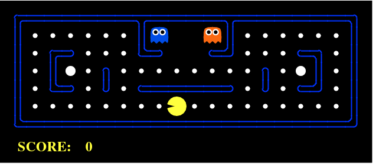

# ChatGPT

深入了解ChatGPT背后涉及到的几个重要技术点，ChatGPT用到了RLHF和PPO，所以本文的第一部分从强化学习概述到RLHF引入了人类反馈的经验，纳入到强化学习的范式里面，到从强化学习求解的方法PG讲到PPO算法，虽然只是想重点介绍下PPO！

1. BERT 模型与 GPT 模型系列
2. 强化学习加入人类反馈 RLHF 模式
3. 强化学习 PG 和 PPO 算法
4.  InstructGPT 原理深度剖析

## GPT模型系列


**微调到prompt学习的过渡**

基于文本预训练的GPT-1，GPT-2，GPT-3 三代模型都是采用的以Transformer为核心结构的模型，在网络模型层面不同的是模型的层数和词向量长度等超参。

| **模型** | **发布时间** | **层数** | **Head数** | **词向量长度** | **参数量** | **预训练数据量** |
| -------- | ------------ | -------- | --------------- | -------------- | ---------- | ---------------- |
| GPT-1    | 2018 年 6 月 | 12       | 12              | 768            | 1.17 亿    | ~ 5GB            |
| GPT-2    | 2019 年 2 月 | 48       | -               | 1600           | 15 亿      | ~ 40GB           |
| GPT-3    | 2020 年 5 月 | 96       | 96              | 12888          | 1,750 亿   | ~ 45TB           |

### GPT-1

**基于 Transformer Decoder 预训练 + 微调 Finetune**

Generative Pre-Training GPT，主要指 NLP 生成式的预训练模型。训练模式分为2阶段：

1. 第 1 阶段预训练：利用语言模型 LLM 进行预训练学习
2. 第 2 阶微调：通过微调 Fine tuning 解决下游任务 

**GPT 与 Bert 区别**

- GPT-1 预训练以语言模型作为目标任务，但是采用的是单向的语言模型
- Bert 网络结构类似于Transformer Encoder 部分，而 GPT 类似于 Transformer Decoder部分
- 单从模型组成部分结构上来看，其<u>最明显的在结构上的差异为 Multi-Head-Attention 和 Masked Multi-Head-Attention</u>

### GPT-2

**舍弃微调，直接利用 zero-short learning**

针对小样本/零样本的 N-shot Learning 应运而生，分为如下三种：

1. **Zero-shot Learning** (零样本学习)：没有任何训练样本进行微调训练的情况下，让预训练语言模型完成特定任务；
2. **One shot Learning** (单样本学习)：在一个训练样本进行微调训练的情况下，预训练语言模型完成特定任务；
3. **Few-shot Learning** (少样本或小样本学习)：在只有少量样本进行微调训练的情况下，预训练语言模型完成特定任务；

- GPT-1 通过无标签数据上学习一个通用语言模型，再根据特定任务进行微调来处理监督任务；
- GPT-2 在 GPT-1 已有网络结构设计上使用了更大网络和更大数据集，并且在训练和预测过程中一次预测一个单词，以此来训练一个能够 zero-short learning 的语言模型。

### **GPT3**

**开启 NLP 新范式 prompt，实现小样本学习**

Prompt-Tuning的动机旨在解决目前传统Fine-tuning的两个痛点问题：

1. <u>降低语义差异</u>（Bridge the gap between Pre-training and Fine-tuning）：预训练任务主要以Masked Language Modeling（MLM）为主，而下游任务则重新引入新的训练参数，因此两个阶段的目标通常有较大差异。因此需要解决如何缩小Pre-training和Fine-tuning两个阶段目标差距过大的问题；
2. <u>避免过拟合</u>（Overfitting of the head）：由于再Fine-tuning阶段需要新引入额外的参数以适配相应的任务需要，因此在样本数量有限的情况容易发生过拟合，降低了模型的泛化能力。因此需要面对预训练语言模型的过拟合问题。

example

**GPT系列总结**

- **Fine-tuning：**预训练语言模型通过微调适配到各种不同的下游任务。具体体现就是通过引入各种辅助任务 loss，将其添加到预训练模型中，然后继续 pre-training，以便让其更加适配下游任务。
- **Prompting：**各种下游任务能力上移到预训练语言模型。需要对不同任务进行重构，使得它达到适配预训练语言模型的效果。这个过程中，是下游任务做出了更多的牺牲，但是能够更好地统一语言模型范式。

### 提示学习 vs 指示学习

提示(Prompt Learning)学习 vs 指示学习(Instruct Learning)

**相同点**

- 指示学习和提示学习目的都是挖掘语言模型本身具备的知识。

**区别点**

- Prompt 是激发语言模型的**补全能力**，如根据上半句生成下半句，或是完形填空等。
- Instruct 是激发语言模型的**理解能力**，通过给出更明显的指令，让模型去做出正确的行动。

举个可爱栗子：

1. **提示学习：**补全这句话的内容 [ 给女朋友买了这个项链，她很喜欢，这个项链太____了 ]
2. **指示学习：**判断这句话的情感 [ 给女朋友买了这个项链，她很喜欢。A=好；B=一般；C=差 ]

## RLHF引入人类反馈

**RL + HF 模式**

强化学习（Reinforcement Learning, RL），是机器学习的范式和方法论之一，用于描述和解决智能体（Agent）在与环境（Environment）的交互过程中通过学习策略以达成回报最大化或实现特定目标的问题 。

强化学习中有两个可以进行交互的对象：

1. **智能体（Agent）：**感知环境状态（State），根据反馈奖励（Reward）选择合适动作（Action）最大化长期收益，在交互过程进行学习；
2. **环境（Environment）：**接收智能体执行的一系列动作，对这一系列动作进行评价并转换为一种可量化的信号，最终反馈给智能体。

**强化学习RL基本概念**

1. **策略(Policy)：**定义智能体在特定时间 t 选择的行为方式，策略是环境状态到动作的映射。
2. **奖励函数(Reward Function)**：在每一步中，环境向智能体发送一个奖励收益 Reward，而这个收益通过奖励函数计算得到。
3. **价值函数(Value Function)**：从长远的角度看什么是好的，一个状态的价值是一个智能体从这个状态开始，对将来累积的总收益的期望。
4. **环境模型(Environment Model)**：是一种对环境的反应模式的模拟，它允许对外部环境的行为进行推断。

**RLHF：从人类反馈中学习**

Native 强化学习里，有 Environment 和 Reward Model，但逆强化学习没有奖励函数，只有一些人类/专家的示范，怎么办呢？

通过人类标注数据训练得到 Reward Model（相当于有了人类标注数据，则相信它是不错的，然后反推人类因为什么样的奖励函数才会采取这些行为），有了奖励函数之后，就可以使用一般的强化学习的方法去找出最优策略/动作。

## 策略梯度 PG 和 PPO 算法

强化学习可以按照方法学习策略来划分成 Value-based 和 Policy-based 两种。在深度强化学习领域将深度学习与基于值 Q-Learning 算法相结合产生了 DQN 算法，通过经验回放池与目标网络成功的将深度学习算法引入了强化学习算法。其中最具代表性分别是 Q-Learning 与 Policy Gradient 算法。

**PG Policy Gradient策略梯度下降**

- **Value-based：**比较 a1, a2, a3 三个个动作的期待值（Q-value），选取Q最大的那个作为本次选择的动作。
- **Policy-based：**有一个计算此刻选择哪个动作的函数（actor），并得到概率p(s,a)，根据概率p(s,a)选取动作。

<u>相比于 Q-learning 和 DQN，策略梯度下降 PG 的神经网络不再输出 Q 值，而是直接输出采用动作的概率</u>，能够更好地处理连续的动作。

在实际实验中，会让 actor 和 environment 进行互动，产生一系列采样数据（Episode sample / Trajectory），即获得很多 (s,a)的 Pair（表示在状态s下采取动作a，得到当前奖励$R(\tau)$ ，然后将这些数据送入训练过程中计算，并更新模型的参数$\theta$。

**Proximal Policy Optimization PPO算法原理**

- 对于 PG 算法来说，最大的问题是在策略参数更新后，还要需要重新使用同环境互动收集数据再进行下一轮迭代。
- <u>PPO 算法是利用了重要性采样的思想，在不知道策略路径的概率 p 情况下，通过模拟一个近似的 q 分布</u>，只要 p 同 q 分布不差得太远，通过多轮迭代可以快速参数收敛。

PPO算法结合 Actor-Critic 方式， Agent 由两部分组成，Actor 负责与环境互动收集样本，等同于原来 PG 的情况，其更新即 PPO 梯度的更新，添加了 Critic，用于负责评判 Actor 的动作好坏。

## InstructGPT论文解读

**ChatGPT 前身 InstructGPT：基于 RLHF 微调 GPT-3**

InstructGPT 训练主要分为三个阶段。结合了监督学习和强化学习，<u>先是监督学习让 GPT3 有一个大致的微调方向，然后用强化学习 PPO 算法来更新微调过的GPT3的参数。</u>


**阶段1：**利用人类的标注数据（demonstration data）去对 GPT3 进行监督训练。

1. 先设计了一个prompt dataset，里面有大量提示样本，给出了各种各样的任务描述；
2. 其次，标注团队对 prompt dataset 进行标注(本质就是人工回答问题)；
3. 用标注后的数据集微调 GPT3（可允许过拟合），微调后模型称为 <u>SFT 模型</u>（Supervised fine-tuning，SFT），具备了最基本的文本生成能力。

**阶段2：**通过 RLHF 思路训练奖励模型 RM

1. 微调后的 SFT 模型去回答 prompt dataset 问题，通过收集 4 个不同 SFT 输出而获取 4 个回答；
2. 接着人工对 SFT 模型生成的 4 个回答的好坏进行标注且排序；
3. 排序结果用来<u>训练奖励模型RM</u> (Reward Model)，即学习排序结果从而理解人类的偏好。

**阶段3：**通过训练好的 RM 模型预测结果且通过 PPO 算法优化 SFT 模型的策略。

1. 让 SFT 模型去回答 prompt dataset 问题，得到策略的输出，即生成的回答；
2. 此时不再让人工评估好坏，而是让阶段 2 <u>RM 模型去给 SFT 模型的预测结果进行打分排序</u>；
3. <u>使用 PPO 算法对 SFT 模型进行反馈更新</u>，更新后的模型称为 PPO-ptx。

**训练RM模型**

RM 核心是由人类对 SFT 生成的多个输出进行排序，再用来训练 RM。为了让 RM 学到人类偏好（即排序），可以 4 个语句两两组合分别计算 loss 再相加取均值，即分别计算$C_4^2$个损失函数：

RM 逐渐学会了给 D 这类语句打高分，给 A/B/C 这类语句打低分，从而模仿人类偏好。所谓RLFH 人类反馈的强化学习，某种意义上来说，由人类打分来充当 Reward。

**PPO 优化策略模型**

强化学习训练的目标函数：

迭代式的更新奖励模型 RM 和策略模型 SFT，让奖励模型 RM 对 PPO 模型输出质量的刻画愈加精确，并使得输出文本变得越来越符合人的认知。

**思考**

- 大模型通过计算的方式模拟人类的思考，类似于ChatGPT的RLHF技术是否会给世界带来新的技术产业革命？
- ChatGPT 使用了 Ray 作为细粒度的并行计算和异构计算，管理分配 RL/DL 模型完成复杂训练任务，方便利用强化学习对环境和计算任务进行控制，这对AI框架的分布式能力边界带来哪些新的冲击？
- ChatGPT 非常重数据交互，存算一体技术会不会针对ChatGPT等应用出现专用芯片和新的架构？

