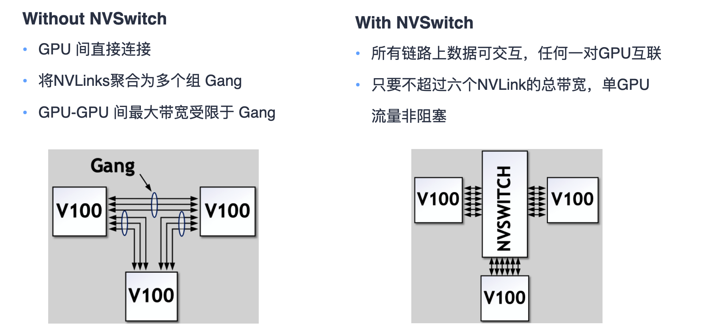

# AI编译器

## 传统编译器

**编译方式**

- 静态编译AOT：程序在执行前全部被编译为机器码，即“提前编译”；
  - 可以避免在运行时的编译性能消耗和内存消耗
- 动态解释 JIT：程序边编译边运行，即“即时编译”；
  - 可以根据当前硬件情况、程序的运行情况、内存情况实时编译生成最优机器指令
  - 编译需要占用运行时资源，会导致进程卡顿

**Pass**：对源程序的一次完整扫描或处理

**IR**：中间表示（数据结构或代码）

**编译器基本构成**

- Front-End：主要负责词法和语法分析，将源代码转化为抽象语法树；

- Optimizer：优化器则是在前端的基础上，对得到的中间代码进行优化，使代码更加高效；
- Back-end：后端则是将已经优化的中间代码转化为针对各自平台的机器代码；

**LLVM**

- 把编译器移植给新的语言只需要实现一个新的编译前端，已有的优化和后端都能实现复用
- LLVM 组件之间交互发生在高层次抽象，不同组件隔离为单独程序库，易于在整个编译流水线 中集成转换和优化 Pass。现在被作为实现各种静态和运行时编译语言的通用基础结构

基于LLVM的项目：XLA、JAX、TensorFlow、TVM、Julia等

## AI 编译器

传统的AI框架采用人工优化算子，然后建立运行时图解释器来解决内存分配调度等问题。AI编译器技术路线一般指在优化过程中采用了自动或者半自动的代码生成用以替代人工优化。

**Challenge**

- 越来越多新算子被提出，算子库的开发、维护、优化和测试工作量指数上升；
- 专用加速芯片爆发导致性能可移植性成为一种刚需

AI编译器往往会借鉴传统编译器的思路。且最后依赖传统编译器针进行机器码生成。

**特点**

1. Python 为主的动态解释器语言前端

2. 多层 IR 设计，包括图编译、算子编译、代码生成

3. 面向神经网络、深度学习的特定优化

4. DSA 芯片架构的支持

**AI 编译器架构发展**

- 朴素的AI编译器（TensorFlow 早期版本）：算子粒度和边界提前确定，无法充分发挥硬件的性能
- 专用的AI编译器（Pytorch、JAX、TVM、XLA...）：
  - 打开计算图和算子的边界，进行重新组合优化，发挥芯片的算力。计算图层下发子图中的算子打开成小算子，基于小算子组成的子图，进行编译优化，包括buffer fusion、水平融合等，关 键是大算子怎样打开、小算子如何重新融合等。
  - 计算图层和算子层仍然分开
- 通用AI编译器
  - 图算统一表达，实现融合优化
  - 算子实现上自动 Schedule、Tiling、Codegen，降低开发门槛
  - 更泛化优化能力，实现动静统一、动态 Shape、稀疏性、高阶微分、自动并行等
  - 包括编译器、运行时，异构计算、边缘到数据中心都模块化表示和组合，并专注于可用性

**AI 编译器架构**

AI编译器主要是分为前端优化、后端优化，部分还会有中间优化层。

- 前端优化：构造计算图后，前端将应用图级优化，前端优化与硬件无关。
  - 节点级优化，如 Zero-dim-tensor elimination、Nop Elimination
  - 块级优化，如代数简化、常量折叠、算子融合

  - 数据流级优化，如Common sub-expression elimination、DCE
- 后端优化
  - 针对特定硬件体系结构获取高性能代码。
  - 利用自动调整来确定最佳参数设置

**TVM：端到端深度学习编译器**

分为Relay和TVM两层，Relay关注图层，TVM关注算子层，拿到前端子图进行优化， Relay关注算子间融合、TVM关注新算子和kernel生成，算子实现方面采 用 Compute（设计计算逻辑）和 Schedule（指定调度优化逻辑）分离方案。

### 前端优化

**计算图基本构成**

1. 由基本数据结构张量 (Tensor) 和基本运算 单元算子 (Operator) 构成

2. 计算图中常用节点来表示算子，节点间的 有向线段来表示张量状态，同时也描述了计算间的依赖关系

**计算器对前端优化的作用：**

- 切分出三个解耦的优化层：
  - 计算图优化
  - 运行时调度优化
  - 算子/内核执行优化

- 新网络模型结构/新训练算法，扩展步骤：
  - 计算图层添加新算子
  - 针对不同硬件内核，实现计算优化
  - 注册算子和内核函数，运行时派发硬件执行

#### 计算图优化

**◦ 算子融合 - OP Fusion**

典型的如conv-bn-relu融合。

在编译器中，一般融合规则都是通过Pass来承载，不同的Pass处理不同的融合规则，而复杂融合规则主要是人工定义好；

**◦ 算子替换 - OP Replace（推理场景）**

**◦ 布局转换 - Layout Transform**

将内部数据布局转换为后端设备友好的形式，比如行主序和列主序，和其他复杂的布局。具体是把数据转换操作作为一种算子插入计算图中。

- NCHW适合需要对每个通道单独运算的操作，如 MaxPooling。 计算时需要的存储更多，适合GPU运算
- NHWC更适合那些需要对不同通道的同一数据 做某种运算的操作，比如“Conv1x1”,适合多核CPU运算。
- NC1HWC0：昇腾AI处理器中，为了提高通用矩阵乘法（GEMM）运算数据块的访问效率，所有张量数据统 一采用NC1HWC0的五维数据格式

**◦ 内存分配 - Memory Allocation**

主要是指针对计算图进行拓扑感知，明确内存分配策略，在真正后端backend执行的时候按照内存分配策略执行。在AI训练过程中主要分为动态内存和静态内存，针对不同内存有不同的优化方式。

- 静态内存：⽐如⼀些固定的算⼦在整个计算图中都会使⽤，此时需要再模型初始化时⼀次性申请完内存空 间，在实际推理时不需要频繁申请操作，提⾼性能
- 动态内存分配：对于中间临时的内存需求，可以进⾏临时申请和释放，节省内存使⽤，提⾼模型并发能⼒

**节省内存算法**

• 空间换内存：如卸载到CPU (CPU Offload )

• 计算换内存： 重计算 (Gradient Checkpointing)

• 模型压缩：如量化训练 Quantification， 剪枝等压缩算法

• 内存复⽤：利⽤AI编译器对计算图中的数据流进⾏分析，以允许重⽤内存

- 原地覆盖内存（Inplace operation）、内存共享（Memory sharing）

Inplace和co-share两者都可以极⼤的降低内存使⽤。将两者合起来可以在训练时减少2倍内存使⽤，在预 测时则可以减⼩4倍内存使⽤

#### 代码/计算层面的优化

**◦ 常量折叠 – Constant Fold**

常量折叠就是将常量表达式计算求值,并用求得的值来替换表达式,放入常量表。

AI 编译器是将计算图中可以预先可以确定输出值的节点替换成常量，并对计算图进行一些结构 简化的操作。

**◦ 公共子表达式消除 - CSE**

具有相同值的子表达式在两个以上地方出现时,称它为公共子表达式，可以将之删除至一次,将多次计算变为一次。

AI 编译器中通过在计算图中搜索相同结构的子图，简化计算图的结构，从而减少计算开销。

**◦ 死代码消除 - DCE**

死代码消除可以优化计算图的计算和存储效率，避免为死节点（无用节点）分配存储和进行计 算，同时简化了计算图的结构，方便进行后续的其他图优化Pass。死代码消除一般不是在定义神经网络模型结构时候引起的，而是其他图优化 Pass 造成的结果。

**◦ 代数简化 - ARM**

代数化简的目的是利用交换率、结合律等规律调整图中算子的执行顺序，或者删除不必要的算子，以提高图整体的计算效率。

◦ 算术化简

◦ 运行化简

◦ 广播化简

### 后端优化

算子或者Kernel进行优化，而优化之前需要把计算图转换称为调度树等IR格式，然后针对每一个算子/Kernel进行循环优化、指令优化和内存优化等技术。

1. 生成低级IR：用AI编译器底层的接口来定义算法，再由编译器来生成 内部的低级IR。
2. 后端优化：找到算子的最优实现方式，达到最优性能。同一算子不同形态如Conv1x1、 Conv3x3、 Conv7x7 都会有不同的循环优化方法。
3. 代码生成：对优化后的低级 IR 转化为机器指令执行，现阶段最广泛的借助成熟的编译工具来实现，如 LLVM、NVCC。

同一算子会有不同的实现方式（即不同的调度方式），速度为什么会有差别。究其原因，与硬件的设计是有巨大关系，例如并行性和局部性。

算子调度具体执行的所有可能的调度方式称为调度空间，AI 编译器优化的目的就是为算子提供 一种最优的调度，使得算子在硬件上运行时间最优。

#### 调度策略

算子调度程序主要由三种代码结构组成：内存分配、循环、计算。

Halide：

• Reorder(交换)、Split(拆分)、Fuse(融合)、Tile(平铺)、Vector(向量化)、展开(Unrolling)、并行(Paralle lizing)

TVM：

• Reorder(交换)、Split(拆分)、Fuse(融合)、Tile(平铺)、Vector(向量化)、展开(Unrolling)、绑定(binding)

- Reorder：为相同的功能切换循环节点
- Hoist / lower compute：更改计算中间结果的粒度
- Inline / deinline：将函数内联到调用者中（不要将它们的结果存储在中间存储中）或从调用者中 取消函数。

#### 算子调度优化

- 基于源码的修改

  - 循环交换：采用迭代次数较小的循环驱动内层迭代次数较大的循环能减少内存的消耗，可以加快处理矩阵和图像的代码的速度。  

  - 循环变量实例化：循环体中的实例化变量放在训练外，避免每次都进行对象实例化。

  - 表达式外放：循环体内重复计算的表达式放在训练体外面，避免每次都进行计算，以空间换时间。

  - 循环终止调用：消除循环终止时的方法调用

- 循环优化

  - 循环展开：对循环进行展开，以便每次迭代多次使用加载的值，使得一个时钟周期的流水线上尽可能满负 荷计算
  - 循环分块：由于内存空间有限，代码访问的数据量过大时，无法一次性将所需要的数据加载到设备内存， 循环分块能有效提高NPU cache 上的访存效率，改善数据局部性。目的是确保一个 Cache 在被用过以后，后面再用的时候其仍然在 cache 中。
  - 循环重排：内外层循环重排，改善空间局部性，并最大限度地利用引入缓存的数据。
  - 循环融合：循环融合将相邻或紧密间隔的循环融合在一起，减少的循环开销和增加的计算密度可改善软件 流水线，数据结构的缓存局部性增加。
  - 循环拆分：拆分主要 是将循环分成多个循环

- 指令优化

  - 向量化SIMD：一次处理多条数据
  - 张量化：主流CPU/GPU硬件厂商都提供了专门用于张量化计算的张量指令，如英伟达的张量核指令、 英特尔的VN。利用张量指令的一种方法是调用硬件厂商提供的算子库，如英伟达的cuBLAS和 cuDNN，以及英特尔的oneDNN等。

- 存储优化

  - 延迟隐藏（Latency Hiding）是指将内存操作与计算重叠，最大限度地提高内存和计算资源利用率的过程。
  - 内存分配：存储分配对于工程师是非常复杂的，需要交给AI编译器完成。

**auto-tuning**

确定算子或者kernel的调度策略的参数值的特定组合形成一种配置，确定这个参数组合使性能最优的过程就是tuning，将之自动化就是auto-tuning。很多的现有用于图像处理或深度学习的编译器都会使用auto-tuning技术来寻找张量计算的最优实现，如Halide或者TVM。

# AI芯片

## AI 计算体系

**深度学习计算模式**

- 网络模型结构支持：CNN、RNN、Transformer...
- 模型压缩：提供不同的 bit 位数、稀疏计算
- 轻量化网络模型：复杂卷积计算（小型卷积核，e.g. 1x1 Conv）、复用卷积核内存信息
- 大模型分布式并行 ：大内存容量、高速互联带宽；专用大模型DSA IP模块，提供低比特快速计算。

**AI 芯片关键指标**

- 精度 Accuracy
  - 能够处理各类型的无规则数据
  - 能够应对复杂网络模型结构

- 吞吐量 Throughput
  - 除了峰值算力，看 PE 的平均利用率（负载均衡）

- 时延 Latency
  - 通信时延对 MACs 的影响 >> 优化带宽
  - Batch Size 大小与内存大小 >> 多级缓存设计
- 能耗 Energy
  - 内存读写功耗
- 系统价格 System Cost
  - 片内多级缓存 Cache 大小 >> 内存设计
  - PE 数量、芯片大小、纳米制程 >> 电路设计
- 易用性 Flexibility
  - 对主流AI框架支持度 (PyTorch) >> 软件栈

AI 芯片不仅仅作为一款硬件，更是对客户、应用提供全栈的解决方案，包括 SDK、集群管理、AI框架、AI编译器、AI驱动和通信、硬件IC产品化，最后才是 AI芯片。而 AI 芯片中最重要的指标有：

1. 精度 Accuracy：决定是否能够解决具体的 AI 业务和深度学习模型；

2. 功耗 Energy：决定 AI 芯片对应产品形态具体部署在端侧、边侧还是云测；

3. 时延和吞吐 Latency & throughput：决定 AI 芯片主要性能，是否计算得足够快；

**矩阵运算计算体系**

软件 Software

◦ 减少没有必要的 MACs：使用其他代替算法

◦ 增加 PE 利用率：对kernel实现进行Loop优化和Memory优化

硬件 Hardware

◦ 减少每次 MAC 计算的时间

- 增加 PE 单元计算能力

◦ 增加 MACs 并行计算能力

- 增加片内 PE 数量

- 支持低bits数PE计算

◦ 增加 PE 利用率

- 增加片内 Cache

- 额外的内存带宽

**数据稀疏**

减少 MACs 计算

◦ 0 × 0 都为零，此类计算可以减少 MACs

◦ 减少不必要计算，从而降低功耗

减少数据搬运

◦ 如果发现一个数据为 0，可以避免对另外数据的搬运

◦ 只传输/搬运非 0 数据

 CPU/GPU/NPU 对随机稀疏计算并不友好，因此对稀疏矩阵计算需要专用硬件

## AI 芯片基础

#### CPU

无论CPU的具体实现怎么变、晶体管数量翻多少番，它的构成始终由运算器、控制器和寄存器这三大部分组成。

- **运算器**：也叫算术逻辑单元（ALU），负责算术运算和逻辑运算。
- **寄存器：**分为指令寄存器和数据寄存器，负责暂存指令、ALU所需操作数、ALU算出结果等。
- **控制器：**负责调度工作，包括对要执行的指令进行译码、从内存中调取数据给寄存器、向运算 器和寄存器发出具体操作指令等。

**CPU 工作流程**

主要分为4步：1）从内存提取指令；2）解码；3）执行；4）写回。

**并行处理架构**

- 单指令流单数流（SISD）系统
- 单指令流多数据流（SIMD）系统
- 多指令流单数据流（MISD）系统
- 多指令流多数据流（MIMD）系统

**ISA指令集架构**

通常用来区分 CPU 的标准是指令集架构。 ISA定义了： 指令集、数据类型、寄存器、寻址模式、内存管理、 I/O模型等。开发人员基于ISA使用不同的处理器硬件实现方案，来设计不同性能的处理器 。

- CISC 架构：除常用指令还包含许多不常用特殊指令。随着越来越多的特殊指令被添加到 CISC 架构中，常用程序运算指令仅占指令集 20%。
- RISC 架构：只包含处理器常用指令，对于不常用操作，执行多条常用指令的方式来达到同样 的效果。

**计算时延**

很多时候算力造成的时延不是主要的，内存、带宽才是。

#### GPU

GPU几乎主要由计算单元ALU组成，仅有少量的控制单元和存储单元。GPU采用了数量众多的 计算单元和超长的流水线，但只有非常简单的控制逻辑并省去了Cache。

**GPU 适合处理的程序**

1. 计算密集型程序：所谓计算密集型 (Compute-intensive) 程序，大部分运行时间消耗在寄存器 运算上，寄存器的速度和处理器的速度相当，从寄存器读写数据几乎没有延时。

2. 易于并行程序：GPU 虽然叫 SIMT，其实为特殊的 SIMD(Single Instruction Multiple Data) 架构 ， 拥有成百上千个核 CUDA Core，每一个核在同一时间能执行同样指令。

#### AI专用处理器

AI 芯片是用于运行 AI 算法的专用处理器，与传统芯片（如CPU）的区别在于专用性 或通用性的侧重上。

主要的技术路线有三种：GPU、FPGA、ASIC。

- FPGA可以采用OpenCL等更高效的编程语言，降低了硬件编程的难度。FPGA适用于多指令，单数据流的分析，与GPU相反，因此常用于推理阶段。在实现复杂算法方面有一定的难度，缺点是价格比较高。
- ASIC即专用集成电路，是一种为专用目的设计，面向特定用户需求的定制芯片，在大规模量产的情况下具备性能更强、体积更小、功耗更 低、成本更低、可靠性更髙等优点。如Google TPU。

**AI 芯片应用场景**

AI 计算中心、自动驾驶、安防应用、IOT AI应用...

## GPU原理

GPU的工作原理是什么？为什么GPU能够处理并行的数据和指令？GPU的多级缓存Cache和GPU的线程Thread是什么关系？

NVIDIA的GPU架构有SM、SP、CUDA Core、Wrap等各种硬件，其到底有什么作用？CUDA主要是提出了分层的现成Thread、块Block、网格Grid，这些跟GPU硬件架构如何对应？CUDA如何驱动硬件告诉并行计算？

### GPU 基础概念

GPC >TPC >SM > CORE

- GPC —— 图形处理簇，Graphics Processing Clusters 
- TPC —— 纹理处理簇，Texture Processing Clusters 
- SM —— 流多处理器，Stream Multiprocessors 
- HBM —— 高带宽存储器，High Bandwidth Memory

**SM （ Streaming Multiprocessor ）**

中文称流式多处理 器，核心组件包括CUDA Core、Tensor Core、共享内存、Warp Scheduler、寄存器等。SM包含许多为线程执行数学运算的 Core，是 NVIDA 的核心。

可以并发地执行数百个线程。一个 block 上线程是放在同一个 SM， 一个 SM 的有限 Cache 制约了每个 block 的线程数量。

**SP / CUDA Core**

流处理器 (Stream Processor)，最基本的处理单元，也 称为CUDA core，最后线程具体的指令和任务都是 在SP上处理的。GPU进行并行计算，也就是很多个SP同时做处理。

每个 CUDA Core 包 含了一个整数运算单元 ALU (Integer Arithme tic Logic Unit) 和一个浮点运算单元 FPU (Floa ting Point Unit) 。

到了 Volta 架构开始就没 有以前的 CUDA Core 了，而是变成了单独的 FP32 FPU 和 INT32 ALU。

**Warp, 线程束**

逻辑上，所有Thread是并行；但是， 从硬件的角度来说，并不是所有的 Thread能够在同一时 刻执行，这里就需要Warp的引入。

Warp 是 SM 基本执行单元，一个 Warp 包含32个并行 Thread。

### CUDA基本概念

通用并行计算平台和编程模型。基于 LLVM 构建，方便开发 者使用 C 进行开发。

CUDA在软件方面组成：一个CUDA库、一个应用程序编程接口（API）及其运行库(Runtime)、 两个较高级别的通用数学库，即 CUFFT 和 CUBLAS。

**CUDA线程层次结构**

• 将问题划分为独立线程块，并行解决的子问题

• 子问题划分为可以由块内线程并行协作解决

CUDA引入主机端（host）和设备（device）概念。CUDA 程序中既包含host程 序，又包含device程序。host与device之间可以进行通信，这样它们之间可 以进行数据拷贝。

在 CUDA 程序构架中，Host 代码部分在CPU上执行，是普通C代码；当遇到数据并行处理的部 分，CUDA 就会将程序编译成GPU能执行的程序，并传送到GPU，这个程序（.cu文件）在CUDA里称做核 （kernel）。

kernel 用` __global__ `符号声明，在调用时需要用 <<<grid, block>>> 来指定kernel要执行及结构。

- 网格 grid：一 个 kernel 所启动的所有线程 称为一个网格，同一个网格上的线程共享相 同的全局内存空间。
- 线程块 Block：Grid 分为多个线程块（block），一个 block 里面包含很 多线程。
  - Block 间并行执行，并且无法通信，也没有执行顺序。
  - 每个 block 包含共享内存（Shared Memory），可以里面的 Thread 共享。
- 线程 thread：CUDA 并行程序，实际上会被多个 threads 来执行；

**硬件： Wrap**

Warp 包含 32 个线程的集合，这个线程集合 被“编织在一起”并且“步调一致”的形式 执行。同一个 Warp 中的每个线程都将以不同数据 资源执行相同的指令，这就是所谓 SIMT 架构 。

Block 线程块只在一个 SM 上通过 Wrap 进行调度。

### Tensor Core

Tensor Core主要是用来计算矩阵乘，我们打开矩阵乘的具体计算来看看Tensor Core如何通过提供独立的硬件模块加速矩阵乘GEMM。既然有独立硬件那么会涉及到指令流水的编排和硬件的架构图。除了硬件以外，很重要的是软件如何对硬件进行编程？

在一个 Wrap 内的线程可 以通过 Tensor Core 来提供矩阵运算。

CUDA将 Tensor Core 在 Wrap level 的计算操作通过API 对外提供，这些 C++接口提供了专门的矩阵加载、矩阵乘法和累加以及矩阵存储操作。

**线程执行**

对于矩阵AxB，通过block、warp、thread分层，最终在多个Tensor Core（4x4x4）并行执行。

### NVLink

NCCL：集合通信库，能实现Collective通信和点对点通信；

NVLink：英伟达（NVIDIA）开发并推出的一种总线及其通信协议。NVLink采用点对点结构、 串列传输，用于中央处理器（CPU）与图形处理器（GPU）之间的连接，也可用于多个图形处 理器（GPU）之间的相互连接。

NVSwitch：是一种高速互连技术，同时作为一块独立的 NVLink 芯片，其提供了高达18路 NVLink 的接口，可以在多个 GPU 之间实现高速数据传输。

DGX：AI 超级计算平台，整合了 GPU、NVLink、InfiniBand 网络和NVIDIA AI 软件堆栈；

**Before NVLink：PCIe**

为了计算节点互联，多个 GPU 通过 PCIe Switch 直接与 CPU 相连。PCIe 3.0 x 16 ~32GB/s 双向带宽，但是当训练数据不停增长的时候，互联方案称为系统瓶颈。

**GPU 间互联：NVLink**

• NVLink 可以使得更多的GPU间进行互联；

• 实现单个 GPU 驱动进程可以控制所有 GPU的计算任务；

### NVSwitch

借助NVSwitch, NVLink 连接可在节点间扩展,以创建无缝、高带宽的多节点 GPU 集群,从而有效地形成数据中心大小的 GPU。

NVLink 2.0 技术使得单服务器中 8 个 GPU 无法达到全连接。为解决该问题，NVIDIA 在 2018 年发布了 NVSwitch，实现了 NVLink 的全连接。可支持单个服务器节点中 16 个全互联的 GPU，并可使全部 8 个 GPU 对分别达到 300GB/s 的速度同时进行通信。

## AI专用处理器 NPU

### 特斯拉 DOJO

每个 DOJO 节点都有一个内核，具有CPU专用内存和 I/O接口。每个内核拥有一个 1.25MB 的 SRAM 作为主存。

每354个Dojo核心组成一块D1芯片，而每25颗芯片组成一个训练模组。最后120个训练模组组成一组ExaPOD计算集群，共计3000颗D1芯片。

**DOJO 架构设计**

DOJO 采用存算一体架构（“存内计算”或者“近存计算”)，单个可扩展计算平面、全局寻址快速存储器和统一的高带宽+低延迟。

- **面积精简**：将大量计算内核集成到芯片中，最大限度提高AI计算的吞吐量，因此需要在保障算力的情况下使单个内核的面积尽可能小，更好的折衷超算系统中算力堆叠和延迟的矛盾。
- **延迟精简**：为了实现其区域计算效率最大化，内核以 2 GHz 运行，只使用基本的分支预测器和小指令缓存，只保留必要部件架构，其余面积留给向量计算和矩阵计算单元。
- **功能精简**：通过削减对运行内部不是必须处理器功能，来进一步减少功耗和面积使用。DOJO 核心不进行数据端缓存，不支持虚拟内存，也不支持精确异常。

可以把一个 DOJO Core 当做一台具有 CPU 专用内存和 I/O 接口的PC，每个 Core 都可以执行独立任务，不依赖于共享 Cache 或 Register File。

D1 作为超标量（Super Scalar）内核，这意味着它在内核支持指令级并行，使用更多线程来驱动更多指令。

**DOJO Core结构**

- 每个 DOJO 核心是带有向量计算/矩阵计算能力的处理器，具有完整的取指、译码、执行部件
- DOJO Core 由前端、执行引擎、SRAM 和 NoC 路由4部分组成，比CPU和GPU的控制部件都更少，具有类似CPU的AGU和类似GPU Tensor core 的矩阵计算单元。
- 每个DOJO Core 提供 1.024 TFLOPS 算力，几乎所有的算力都由矩阵计算单元提供。因而矩阵计算单元和 SRAM 共同决定了 D1 处理器的计算能效比。
- DOJO 上运行的代码不能直接访问系统内存。相反，应用程序预计主要在一小部分本地 SRAM 中工作。
- 本地 SRAM 由软件（编译器）进行管理，不能用作缓存。如果需要来自主存储器的数据，则必须使用 DMA 操作将其引入。

**DOJO指令集**

D1指令集支持 64 位标量指令和 64字节 SIMD 指令，包括网络传输与同步原语和机器学习/深度学习相关的专用原语（例如8x8矩阵计算）。并支持信号量（semaphore）和屏障约束（ barrier constraints），这是使内存操作符合指令不仅在 D1 内核中运行，而且在 D1 内核的集合中运行。

**数据格式**

D1 内核支持多种数据格式。标量单元支持 8、16、32 或 64 位的整数，而向量单元及其关联的矩阵单元支持多种数据格式，具有精度和数值范围的混合，其中不少是动态的可由 Dojo 编译器组合。

Tesla 不仅提出了用于较低精度和更高吞吐量矢量处理的 8 位 FP8 格式，而且还提出了一组可配置的 8 位和 16 位格式，DOJO 编译器可以在尾数的精度附近滑动指数位，以涵盖更广泛的范围和精度。