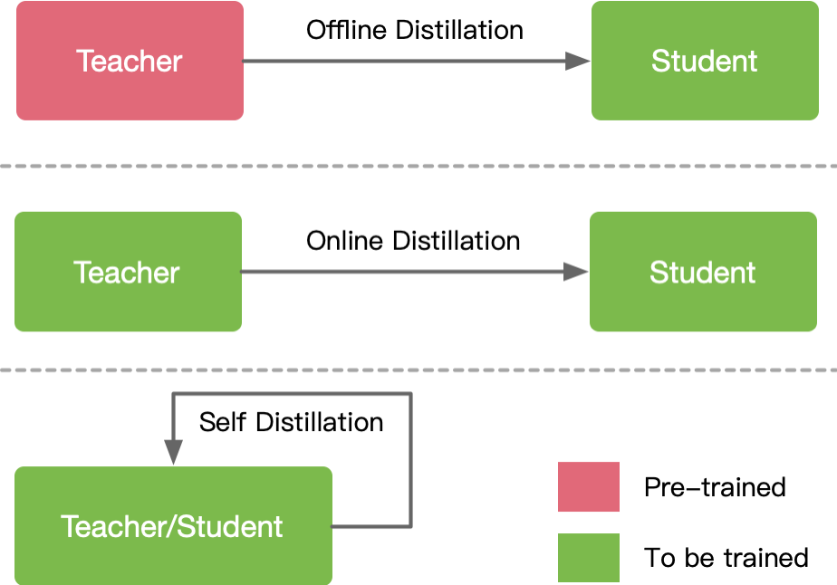
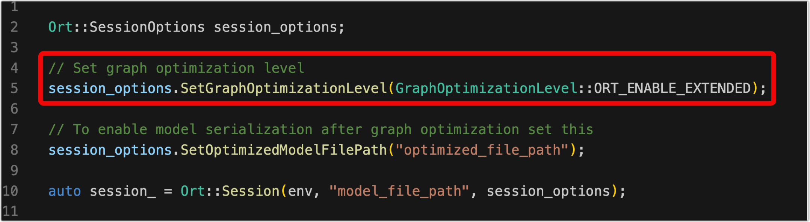

本笔记为ZOMI酱【推理引擎】系列课程的笔记

课程视频：https://space.bilibili.com/517221395/channel/series

github：https://github.com/chenzomi12/DeepLearningSystem

✿✿ヽ(°▽°)ノ✿✿✿ヽ(°▽°)ノ✿✿✿ヽ(°▽°)ノ✿✿✿ヽ(°▽°)ノ✿✿✿ヽ(°▽°)ノ✿✿✿ヽ(°▽°)ノ✿✿✿ヽ(°▽°)ノ✿

---

训练过程通过设定数据处理方式，并设计合适的网络模型结构以及损失函数和优化算法，在此基础上将数据集以小批量（mini-batch）反复进行前向计算并计算损失，然后反向计算梯度利用特定的优化函数来更新模型，来使得损失函数达到最优的结果。训练过程最重要的就是梯度的计算和反向传播。

而推理就是在训练好的模型结构和参数基础上，做一次前向传播得到模型输出的过程。相对于训练而言，推理不涉及梯度和损失优化。推理的最终目标是将训练好的模型部署生产环境中。真正让 AI 能够运用起来。推理引擎可以将深度学习模型部署到云（Cloud）端或者边缘（Edge）端，并服务用户的请求。模型训练过程好比是传统软件工程中的代码开发的过程，而开发完的代码势必要打包，部署给用户使用，那么推理系统就负责应对模型部署的生命周期中遇到的挑战和问题。

当推理系统将完成训练的模型进行部署，并在服务时还需要考虑设计和提供负载均衡，请求调度，加速优化，多副本和生命周期管理等支持。相比深度学习框架等为训练而设计的系统，推理系统不仅关注低延迟，高吞吐，可靠性等设计目标，同时受到资源，服务等级协议（Service-Level Agreement），功耗等约束。本章将围绕深度学习推理系统的设计，实现与优化内容展开，同时还会在最后介绍部署和 MLOps 等内容。

移动端的推理引擎应该挺多的了，google在2017年推出了TF-Lite，腾讯在2017年推出了ncnn，Apple在2017也推出了CoreML，阿里在2018年推出了MNN，华为2019年推出了MindSpsore-Lite。距今已经过去了快5年的时间，技术上也接近收敛。下面让我们一起打开推理引擎的技术吧！

## 课程简介

- 《推理系统》推理系统是本分享的重点概述，推理就是在训练好的模型结构和参数基础上，执行前向传播得到模型输出的过程。相对于训练而言，推理不涉及梯度和损失优化。推理的最终目标是将训练好的模型部署生产环境中，真正让 AI 能够运用起来。推理引擎可以将深度学习模型部署到云（Cloud）端或者边缘（Edge）端，并服务用户的请求。模型训练过程好比是传统软件工程中的代码开发的过程，而开发完的代码势必要打包，部署给用户使用，那么推理系统就负责应对模型部署的生命周期中遇到的挑战和问题。
- 《轻量网络》在端侧推理引擎中，主要是执行轻量的模型结构。主要思想是针对神经网络模型设计更高效的网络计算方式，从而使神经网络模型的参数量减少的同时，不损失网络精度，并进一步提高模型的执行效率。本节主要集中介绍模型小型化中需要注意的参数和指标，接着深入了解CNN经典的轻量化模型和Transformer结构的轻量化模型。
- 《模型压缩》模型压缩跟轻量化网络模型不同，压缩主要是对轻量化或者非轻量化模型执行剪枝、蒸馏、量化等压缩算法和手段，使得模型更加小、更加轻便、更加利于执行。
- 《模型转换&优化》在这一节当中分为模型转换和模型优化，在整体架构图中属于离线模型转换模块。一方面，推理引擎需要把不同 AI 框架训练得到的模型进行转换；另外一方面需要对转换后的模型进行图优化等技术。
- 《Kernel优化》在上层应用或者 AI 网络模型中，看到的是算子；但是在推理引擎实际执行的是具体的 Kernel，而推理引擎中 CNN 占据了主要是得执行时间，因此其 Kernel 优化尤为重要。

希望这个系列能够给大家、朋友们带来一些些帮助，也希望自己能够继续坚持完成所有内容哈！

## 课程目标

通过《推理引擎：核心原理》这个课程，以及这门课程后面的几门课程，你将获取并且掌握的技能：

|                |                                   |                                              |
| :------------: | :-------------------------------- | :------------------------------------------- |
| **编号** | **名称**                    | **具体内容**                           |
|       1       | [推理系统](#第一节：推理系统) | 推理系统整体介绍，推理引擎架构梳理           |
|       2       | [轻量网络](#第二节：模型小型化) | 轻量化主干网络，MobileNet等SOTA模型介绍      |
|       3       | [模型压缩](#第三节：模型压缩)     | 模型压缩4件套，量化、蒸馏、剪枝和二值化      |
|       4       | [模型转换&amp;优化](#第四节：模型转换与优化) | AI框架训练后模型进行转换，并对计算图优化     |
|       5       | [Kernel优化](#第五节：Kernel优化) | Kernel层、算子层优化，对算子、内存、调度优化 |

# 第一节：推理系统

推理就是在训练好的模型结构和参数基础上，执行前向传播得到模型输出的过程。相对于训练而言，推理不涉及梯度和损失优化。推理的最终目标是将训练好的模型部署生产环境中，真正让 AI 能够运用起来。推理引擎可以将深度学习模型部署到云（Cloud）端或者边缘（Edge）端，并服务用户的请求。模型训练过程好比是传统软件工程中的代码开发的过程，而开发完的代码势必要打包，部署给用户使用，那么推理系统就负责应对模型部署的生命周期中遇到的挑战和问题。

• 推理系统与推理引擎区别

• 推理工作流程

• 推理系统介绍

• 推理引擎介绍

## 1.1. 推理系统与推理引擎

推理系统跟推理引擎不同，其更加聚焦推理服务、模型加载、版本管理、数据管理、服务接口，并对用户的请求进行相应和访问，把推理引擎调起来去执行具体的计算。这里给大家汇报下什么是推理系统，推理系统应该注意的点有哪些，其与推理引擎的不同之处。

◦ Training and Inference – 训练和推理服务的区别

◦ What is inference system - 什么是推理系统

◦ Optimization objectives and constraints - 推理系统优化目标与约束

◦ Difference bet inference system and engine - 推理系统与推理引擎

**典型深度学习推理应用**

在这个过程中，推理系统需要考虑和提供以下的功能：

• 提供可以被用户调用的接口

• 能够完成一定的数据处理将输入数据转为向量

• 能够在指定低延迟要求下返回用户响应

• 能够利用多样的加速器进行一定的加速

• 能够随着用户的增长保持**高吞吐**的服务响应和动态进行扩容

• 能够可靠的提供服务，应对软硬件的失效

• 能够支持算法工程师不断更新迭代模型，应对不断变化的新框架

• 单纯复用原有的 Web 服务器或者移动端应用软件，只能解决其中一部分问题，在深度学习模 型推理的场景下，产生了新的系统设计需求与挑战。

• 从深度学习训练过程和推理过程对比两者的相同点和不同点，以及在生命周期所处的环节，进 而便于理解深度学习推理系统所侧重的目标。

### 1.1.1. 什么是推理系统

深度学习模型的生命周期

• 训练任务：数据中心中更像是传统的批处理任务，需要执行数小时，数天才能完成，其一般配 置较大的批尺寸追求较大的吞吐，将模型训练达到指定的准确度或错误率。

• 推理任务：执行 7 X 24 的服务，其常常受到响应延迟的约束，配置的批尺寸更小，模型已经稳 定一般不再被训练。

**推理相比训练的新特点与挑战**

1. 模型被部署为长期运行的服务
2. 推理有更苛刻的资源约束
3. 推理不需要反向传播梯度下降
4. 部署的设备型号更加多样

**推理系统**

模型训练后会保存在文件系统中，随着训练处的模型效果不断提升，可能会产生新版本的模型，并存储在文件系统中 并由一定的模型版本管理协议进行管理。之后模型会通过服务系统部署上线，推理系统首先会加载模型到内存，同时 会对模型进行一定的版本管理，支持新版本上线和旧版本回滚，对输入数据进行批尺寸（Batch Size）动态优化，并提 供服务接口（例如，HTTP，gRPC等），供客户端调用。用户不断向推理服务系统发起请求并接受响应。除了被用户直 接访问，推理系统也可以作为一个微服务，被数据中心中其他微服务所调用，完成整个请求处理中一个环节的功能与 职责。

• 推理系统中，以数据中心的服务端推理系统为主，兼顾边缘侧移动端推理的场景，但是这些策 略本身大部分是数据中心与边缘侧都适用。

Question?

• 深度学习推理系统设计需要考虑多目标和约束

• 推理系统相比传统服务系统有哪些新的挑战？

• 云和端的服务系统有何不同的侧重和挑战？

### 1.1.2. 推理系统优化目标与约束

除了应用场景的需求，推理系统也需要应对不同模型训练出的框架和多样性的推理硬件所产生 的部署环境多样性，部署优化和维护困难且容易出错的挑战.

<u>设计推理系统的优化目标</u>

• 低延迟(Latency)：满足服务等级协议的延迟

• 吞吐量(Throughputs)：暴增负载的吞吐量需求

• 高效率(Efficiency)：高效率，低功耗使用GPU, CPU

• 灵活性(Flexibility)：支持多种框架, 提供构建不同应用的灵活性

• 扩展性(Scalability)：扩展支持不断增长的用户或设备

#### 1.1.2.1. 灵活性

AI 服务的部署，优化和维护困难且容易出错

**框架多样：**

• 大多数框架都是为训练设计和优化

• 开发人员需要将必要的软件组件拼凑在一起

• 跨多个不断发展的框架集成和推理需求

**硬件多样：**

• 多种部署硬件的支持

**服务系统需要灵活性：**

• 支持加载不同 AI 框架的模型

• AI 框架推陈出新和版本不断迭代

• 与不同语言接口和不同逻辑的应用结合

**<u>解决方法：</u>**

• 深度学习模型开放协议：跨框架模型转换

• 接口抽象：提供不同框架的通用抽象

• 容器：运行时环境依赖与资源隔离

• RPC：跨语言，跨进程通信

#### 1.1.2.2. Latency 延迟

**推理延迟：**

• 延迟是用户给出查询后呈现推理结果消耗的时间

• 必须既快速同时满足有限的尾部延迟 Tail Latency

**需要低延迟：**

• 服务水平协议(SLA)：Sub-second 级别延迟

**低延迟挑战：**

• 交互式APP 低延迟需求与训练 AI 框架目标不一致

• 大模型更准确，但浮点运算量更大

• Sub-second 级别延迟约束制数据 Batch Size

• 模型融合容易引起长尾延迟 Long Tail Latency

#### 1.1.2.3. 吞吐量

**需要高吞吐的目的：**

• 突发的请求数量暴增

• 不断扩展的用户和设备

**<u>达到高吞吐的策略：</u>**

• 充分利用AI芯片能力1）批处理请求；2）指令级运算

• 支持动态 Shape 和自适应批尺寸 Batch Size

• 多模型装箱使用加速器

• 容器扩展副本部署

#### 1.1.2.4. 效率

**需要高效的原因：**

• 内存、ALU数量等资源约束

• 移动端有极高的功耗约束

• 云端有预算的约束

**<u>高效率策略：</u>**

• 模型压缩

• 高效使用 AI 推理芯片

• 装箱（bin-packing）使用加速器

#### 1.1.2.5. 扩展性

**扩展性原因：**

• 应对用户与请求的增长

• 提升推理系统吞吐量

随着请求负载增加自动部署更多的解决方案 ，进而才可以应对更大负载，提供更高的推理吞吐和让推理系统更加可靠。

<u>通过底层 Kubernetes 部署平台，用户可以通过配置方便地自动 部署多个推理服务的副本，并通过部署前端负载均衡服务，达到 高扩展性提升吞吐量。更多副本也使得推理服务有了更高的可靠 性。</u>

### 1.1.3. 推理系统 vs 推理引擎

推理系统

推理引擎

## 1.2. 推理系统的工作流程

推理分为云测利用云端中心服务器集群进行在线推理，端侧推理主要集中在利用IOT等端侧设备进行离线推理，其各自对应有自身的优势和特点。而端侧推理中因为联邦学习，分布式学习等不同的场景会跟云测进行交互，让我们一起来了解下推理的全流程，看看推理有哪几种方式吧！

◦ Difference on Deployment status – 部署态区别

◦ Cloud deployment workflow – 云测推理流程

◦ Edge Deployment mode – 边缘部署方式

### 1.2.1. 部署态区别

推理系统一般可以部署在云或者边缘。云端部署的推理系统更像传统 Web 服务，在边缘侧部 署的模型更像手机应用和IOT应用系统。

#### 1.2.1.1. 部署态： Cloud 云端

云端有更大的算力，内存，且电更加充足满足模型的功耗需求，同时与训练平台连接更加紧密 ，更容易使用最新版本模型，同时安全和隐私更容易保证。相比边缘侧可以达到更高的推理吞 吐量。但是用户的请求需要经过网络传输到数据中心并进行返回，同时使用的是服务提供商的 软硬件资源。

**Cloud 云端特点**

• 对功耗、温度、 Model Size 没有严格限制

• 有用于训练和推理的强大硬件支持

• 集中的数据管理有利于模型训练

• 模型更容易在云端得到保护

• 深度学习模型的执行平台和AI 框架统一

**Cloud 云端问题**

• 云上提供所有人工智能服务成本高昂

• 推理服务对网络依赖度高

• 数据隐私问题

• 数据传输成本

• 很难定制化模型

#### 1.2.1.2. 部署态： Edge 端侧

边缘侧设备资源更紧张（例如，手机和 IOT 设备），且功耗受电池约束，需要更加在意资源的 使用和执行的效率。用户的响应只需要在自身设备完成，且不需消耗服务提供商的资源。

**Edge 端侧挑战**

• 严格约束功耗、热量、模型尺寸小于设备内存

• 硬件算力对推理服务来说不足

• 数据分散且难以训练

• 模型在边缘更容易受到攻击

• DNN平台多样，无通用解决方案

**应用层算法优化：**

• 考虑到移动端部署的苛刻资源约束条件下，提供针对移动端部署的 AI 模型

**高效率模型设计：**

• 通过模型压缩的量化、剪枝、蒸馏、神经网络结构搜索（NAS）等技术，减少模型尺寸

**移动端框架——推理引擎：**

• TensorFlow Lite，MNN、TensorRT，ONNX Runtime、MindSpore Lite等推理引擎推出

**移动端芯片：**

• 提供高效低功耗芯片支持，如 Google Edge TPU，NVIDIA Jetson 、Huawei Ascend 310系列

**端侧部署技术难点分析**

• 部署维护成本高，难落地

• 模型适配、迁移难，重复开发

• 预测性能差，硬件成本高

• 高精度模型体积大，性能差

### 1.2.2. 云端部署和推理

**推理系统流程全景：请求与响应处理**

• 系统需要序列化与反序列化请求，并通 过后端高效执行，满足一定的响应延迟。

• 相比传统的 Web 服务，推理系统常常 需要接受图像，文本，音频等非结构化 数据，单请求或响应数据量一般更大， 这就需要对这类数据有高效的传输，序 列化，压缩与解压缩机制。

• 系统可以根据后端资源利用率，动态调 整批尺寸，模型的资源分配，进而提升 资源利用率，吞吐量。

• 如果是通过加速器进行的加速推理，还 要考虑主存与加速器内存之间的数据拷 贝，通过调度或预取等策略在计算的间 歇做好数据的准备。

**推理系统流程全景：推理引擎执行**

• 推理引擎将请求映射到模型作为输 入，并在运行时调度深度学习模型 的内核进行多阶段的处理。

• 如果是部署在异构硬件或多样化的 环境，还可以利用编译器进行代码 生成与内核算子优化，让模型自动 化转换为高效的特定平台的可执行 的机器码。

**推理系统流程全景：模型版本管理**

• 在云端算法工程师不断验证和开发新的 版本模型，需要有一定的协议保证版本 更新与回滚。

• 定期或满足一定条件的新模型不断上线 替换线上模型，以提升推理服务的效果 ，但是由于有些指标只能线上测试，有 可能线上测试效果较差还需要支持回滚 机制，让模型能回滚到稳定的旧版本模 型。

**推理系统流程全景：健康监控**

• 云端的服务系统应该是可观测的，才能 让服务端工程师监控，报警和修复服务 ，保证服务的稳定性和 SLA。

• 例如，一段时间内响应变慢，通过可观 测的日志，运维工程师能诊断是哪个环 节成为瓶颈，进而可以快速定位，应用 策略，防止整个服务突发性无法响应（ 例如，OOM 造成服务程序崩溃）。

**推理系统流程全景：推理硬件**

• 在边缘端等场景会面对更多样的硬件 ，驱动和开发库，需要通过编译器进 行一定代码生成让模型可以跨设备高 效运行，并通过编译器实现性能优化

### 1.2.3. 边缘部署和推理

**方式 1 ：边缘设备计算**

将模型部署在设备端，聚焦如何优化模型执行降低延迟：

1. 端侧模型结构设计
2. 通过模型量化、剪枝等压缩手段
3. 针对神经网络的专用芯片 ASIC 设计

**方式 2 ：安全计算 + 卸载到云端**

将模型部署于数据中心，边缘侧通过安全通信协议将请求发送到云端，云端推理返回结果，相当 于将计算卸载到云端：

1. 利用云端运行提升模型安全性
2. 适合部署端侧无法部署的大模型
3. 完全卸载到云端有可能违背实时性的需求

**方式 3 ：边缘设备 + 云端服务器**

利用 AI 模型结构特点，将一部分层切（或者其 Student 模型）分放置在设备端进行计算，其他放 置在云端。这种方式一定程度上能够比方式 2 降低延迟，由于其利用了边缘设备的算力，但是与 云端通信和计算还是会带来额外开销。

**方式 4 ：分布式计算**

从分布式系统角度抽象问题，AI 计算在多个辅助边缘设备上切片：

• 切片策略根据设备计算能力，内存约束

• 通过细粒度的切片策略，将模型切片部署其他边缘设备

• 运行对计算模型进行调度， 并通过输入数据通过负载均衡策略进行调度

**方式 5 ：跨设备 Offloading**

决策基于经验性的权衡功耗，准确度，延迟和输入尺寸等度量和参数，不同的模型可以从当前 流行的模型中选择，或者通过知识蒸馏，或者通过混合和匹配的方式从多个模型中组合层。如 较强的模型放在边缘服务器，较弱模型放置在设备。

## 1.3. 推理系统架构

要了解整体推理系统架构之前需要明确推理、部署、服务化之间的区别和差异，有了基础的概念后，我们会一起深入了解推理系统架构，而推理系统架构又以NVIDIA Trition作为经典架构例子，深入剖析其架构逻辑；最后AI推理系统中模型生命周期管理尤为重要，因此单独给大家进行汇报。

◦ Infer, Deploy, Serve – 推理、部署、服务化

◦ Architecture of Inference System – 推理系统的整体架构

◦ Life Time of Model – 模型生命周期管理

AI 应用部署需要考虑哪些方面？

> 长尾效应：少数类(头类)占用大部分数据，而大多数类(尾类)只有少量的数据

### 1.3.1. 推理、部署、服务化

1. 什么是模型推理？什么是推理服务化？
2. 有哪些常见的推理服务框架？Triton是什么？

**推理（Inference）**

• 对于训练（Training）而言的推理，即模型前向计算，也就是对于给出的输入数据计算得到模型 的输出结果；相对预测（Prediction）的推理，是统计学领域的范畴。

**部署（Deployment）**

• 训练得到的模型主要目的还是为了更有效地解决实际中的问题，因此部署是一个非常重要的阶 段。模型部署的课题也非常多，包括但不仅限于：移植、压缩、加速等。

**服务化（Serving）**

• 模型的部署方式是多样的：封装成一个SDK，集成到APP或者服务中；封装成一个web服务，对 外暴露接口（HTTP(S)，RPC等协议）。

**TF Serving**

• Google 早在 2016 年就针对 TensorFlow 推出了服务化 框架 TensorFlow Serving， 能够把 TensorFlow 模型以 web 服务的方式对外暴露 接口，通过网络请求方式 接受来自客户端（Client） 的请求数据，计算得到前 向推理结果并返回。

**常见的服务化框架**

| 服务框架           | 支持的模型           | 开源仓库地址                                      | 开源时间 |
| ------------------ | -------------------- | ------------------------------------------------- | -------- |
| TensorFlow Serving | TensorFlow           | https://github.com/tensorflow/serving             | 2016     |
| TorchServe         | PyTorch              | https://github.com/pytorch/serve                  | 2020     |
| <u>Triton</u>      | TensorFlow/PyTorch等 | https://github.com/triton-inference-server/server | 2018     |
| BentoML            | TensorFlow/PyTorch等 | https://github.com/bentoml/BentoML                | 2019     |
| <u>Kubeflow</u>    | TensorFlow/PyTorch等 | https://github.com/kubeflow/kfserving             | 2019     |
| Seldon Core        | TensorFlow/PyTorch等 | https://github.com/SeldonIO/seldon-core           | 2018     |

#### 1.3.1.1. Triton

Triton推理服务器 (NVIDIA Triton Inference Server) 是英伟达等公司推出的开源推理框架，<u>为用户提供部署在云和边缘推理上的解决方案。</u>

**Triton 接入层**

Triton 支持 HTTP/REST 和 GRPC 协议。其 实除此之外，Triton 还支持共享内存（ Shared Memory）的 IPC（Inter-Process Communication）通信机制。

**Triton 模型仓库**

模型仓库可以是本地的持久化存储介质（磁 盘），也可以接入 Google Cloud Platform 或者 AWS S3 模型仓库。Triton的模型仓库支持多模型、也支持模型编排。

**Triton 模型预编排**

Pre-Model Scheduler Queues，核心工作是模型编排：通过解析请求的URL，从模型仓库 查询到编排信息，执行模型编排。

**Triton 推理引擎**

Triton 支持 TensorFlow, TensorRT, PyTorch, ONNX Runtime 推理引擎，Triton统一称为 “Backend”。在 Triton 开始启动时，模型仓 库中的模型就已经被加载到内存或者显存上 了，然后服务调起推理引擎执行实际的计算。

**Triton 返回与监控**

• Inference Response 为结果返回，即把最终 结果返回给客户端。

• Status/Health Metrics Export 是 Triton 支持 接入 Prometheus 监控的接口。

**基于 Triton 集成推理引擎**

网络请求和模型编排等相关的功能，Triton服务已经集成好了，Backend只需要关心模型的加 载（Load）、前向推理计算（Forward）和卸载（Unload），以及配置文件校验。

> 模型推理服务化：如何基于Triton开发自己的推理引擎？ - 我是小北挖哈哈的文章 - 知乎 https://zhuanlan.zhihu.com/p/354058294

### 1.3.2. 模型生命周期管理

需要模型版本管理的原因

• 每隔一段时间训练出的新版本模型替换线上模型，但是可能存在缺陷

• 如果新版本模型发现缺陷需要回滚

**模型生命周期管理**

• 金丝雀(Canary)策略

• 回滚(Rollback)策略

**金丝雀策略**

• 当获得一个新模型版本，当前服务模型成为 second-newest，用户可以选择同时保持这两个版本

• 将所有推理请求流量发送到当前两个版本，比较它们的效果

• 一旦对最新版本达标，用户就可以切换到仅该版本

• 方法需要更多的高峰资源，避免将用户暴露于缺陷模型

**回滚策略**

• 如果在当前的主要服务版本上检测到缺陷，则用户可以请求切换到特定的较旧版本

• 卸载和装载的顺序应该是可配置的

• 当问题解决并且获取到新的安全版本模型时，从而结束回滚

模型生命周期管理工作流实例：TensorFlow Serving: Flexible, High-Performance ML Serving

## 1.4. 推理引擎介绍

推理引擎就是推理系统中用来完成实际推理功能的模块，也可以称作推理模块。业界比较成熟的工业级推理引擎有MNN、TensorRT、TensorFlow Lite、MindSpore Lite、MACE等，通过理解推理引擎架构，一起来深入了解推理引擎到底有哪些模块，这些模块有什么用。

• 推理引擎特点

• 技术挑战

• 整体架构

• 工作流程

### 1.4.1. 推理引擎特点

轻量、通用、<u>易用、高效</u>

**High performance高效**

1. 需要对 iOS / Android / PC 不同硬件架构和操作系统进行适配，单线程下运行深度学习模型达到设备算力峰值。
2. 针对主流加速芯片进行深度调优，如 OpenCL 侧重于推理性能极致优化，Vulkan 方案注重较 少初始化时间。
3. 编写SIMD代码或手写汇编以实现核心运算，充分发挥芯片算力，针对不同kernel算法提升性 能。
4. 支持不同精度计算以提升推理性能，并对 ARMv8.2 和 AVX512 架构的相关指令进行了适配。

**Lightness轻量**

1. 主体功能无任何依赖，代码精简，可以方便地部署到移动设备和各种嵌入式设备中。
2. 支持 Mini 编辑选项进一步降低包大小，大约能在原库体积基础上进一步降低体积。
3. 支持模型更新精度 FP16/Int8 压缩与量化，可减少模型50% - 75% 的体积。

**Versatility通用**

1. 支持 Tensorflow、PyTorch、MindSpore、ONNX 等主流模型文件格式。
2. 支持 CNN / RNN / GAN / Transformer 等主流网络结构。
3. 支持多输入多输出，任意维度输入输出，支持动态输入，支持带控制流的模型。
4. 支持 服务器 / 个人电脑 / 手机 及具有POSIX接口的嵌入式设备。
5. 支持 Windows / iOS 8.0+ / Android 4.3+ / Linux / ROS 等操作系统。

**Accessibility易用**

1. 支持使用算子进行常用数值计算，覆盖 numpy 常用功能
2. 提供 CV/NLP 等任务的常用模块
3. 支持各平台下的模型训练
4. 支持丰富的 API 接口

### 1.4.2. 技术挑战

**需求复杂 vs 程序大小**

• AI 模型本身包含众多算子，如 PyTorch有1200+ 算子、Tensorflow 接近 2000+ 算子，推理引擎 需要用有限算子去实现不同框架训练出来 AI 模型所需要的算子。

• AI 应用除去模型推理之外，也包含数据前后处理所需要的数值计算与图像处理，不能引入大量 的三方依赖库，因此需要进行有限支持。

**算力需求 vs 资源碎片化**

• AI 模型往往计算量很大，需要推理引擎对设备上的计算资源深入适配，持续进行性能优化，以 充分发挥设备的算力。

• 计算资源包括 CPU , GPU , DSP 和 NPU ，其各自编程方式是碎片化，需要逐个适配，开发成本 高，也会使程序体积膨胀。

**执行效率 vs 模型精度**

• 高效的执行效率需要网络模型变小，但是模型的精度希望尽可能的高；

• 云测训练的网络模型精度尽可能的高，转移到端侧期望模型变小但是保持相同的精度；

### 1.4.3. 整体架构

• 优化阶段

模型转换工具，由转换和图优化构成；

模型压缩工具、端侧学习和其他组件组 成。

• 运行阶段

即推理引擎，负责AI模型的加载与执行 ，可分为调度与执行两层。

### 1.4.4. 推理流程

**开发推理程序**

1. 配置推理选项 ::Config，包括设置模型路径、运行设备、开启/关闭计算图优化等
2. 创建推理引擎对象 ::Predictor(Config)，其中 Config 为配置推理选项
3. 准备输入数据

   - 将原始输入数据根据模型需要做相应的预处理（比如减均值等标准化操作）
   - 先通过 auto input_names = predictor->GetInputNames() 获取模型所有输入 Tensor 名称
   - 通过 auto tensor = predictor->GetInputTensor(input_names[i]) 获取输入 Tensor 的指针
   - 通过 tensor->copy(data)，将预处理之后的数据 data 拷贝/转换到 tensor 中
4. 执行推理，运行 predictor->Run() 完成推理执行
5. 获得推理结果并进行后处理

   - 通过 auto out_names = predictor->GetOutputNames() 获取模型所有输出 Tensor 名称
   - 通过 auto tensor = predictor->GetOutputTensor(out_names[i]) 获取输出 Tensor 指针
   - 通过 tensor->copy(data)，将 tensor 数据拷贝/转换到 data 指针上
   - 批量推理验证数据集并计算模型精度判断推理结果的正确性
   - 将模型推理输出数据进行后处理（根据检测框位置裁剪图像等）

# 第二节：模型小型化

轻量化模型，其实也是模型小型化的一种方式。主要思想是针对神经网络模型设计更高效的网络计算方式，从而使神经网络模型的参数量减少的同时，不损失网络精度，并进一步提高模型的执行效率。推理引擎之模型小型化，主要集中介绍模型小型化中需要注意的参数和指标，接着深入了解CNN经典的轻量化模型和Transformer结构的轻量化模型。

• 基础参数概念

• CNN小型化结构

• Transform小型化结构

## 2.1. 基础参数概念

在查看AI加速器和AI加速芯片的时候经常有很多硬件规格指标，这些指标告诉我们芯片在真正对于神经网络或者深度学习的时候理论的峰值计算性能和内存等性能，今天让我们一起以NVIDIA T4作为例子来了解下具体的参数背后的意义。了解完这些信息，更有助于我们去设计小型化模型，让模型保持参数量的前提下，更好地利用AI芯片计算资源。

1. FLOPs
   浮点运算次数（Floating-point Operation），理解为计算量，可以用来<u>衡量算法/模型时间的复杂度</u>。
2. FLOPS
   每秒所执行的浮点运算次数（Floating-point Operations Per Second ），理解为计算速度，是一个<u>衡量硬件 性能/模型速度的指标</u>，即一个芯片的算力。
3. MACCs
   乘-加操作次数（Multiply-accumulate Operations），MACCs 大约是 FLOPs 的一半，将 $𝑤 [0]\times x[0]$视为一个乘法累加或 1 个 MACC。
4. Params
   模型含有多少参数，直接决定模型的大小，也影响推断时对内存的占用量，单位通常为 M，通常参数用 float32 表示，所以模型大小是参数数量的 4 倍。
5. MAC
   内存访问代价（ Memory Access Cost ），指的是输入单个样本，模型/卷积层完成一次前向传播所发生的 内存交换总量，即模型的<u>空间复杂度</u>，单位是 Byte。
6. 内存带宽

   1. 内存带宽决定了它将数据从内存（vRAM） 移动到计算核心的速度，是<u>比计算速度更具代表性的指标</u>
   2. <u>内存带宽值取决于内存和计算核心之间数据传输速度，以及这两个部分之间总线中单独并行链路数量</u>

example

## 2.2. CNN小型化结构

轻量级网络的核心是在尽量保持精度的前提下，从体积和速度两方面对网络进行轻量化改。本视频内容主要是对CNN的模型小型化进行介绍，特别是 SqueezeNet/ShuffleNet/MobileNet/ESPnet/GhostNet系列进行详细展开。最后对轻量化网络模型的演进点进行总结。

1. SqueezeNet 系列（2016）
2. ShuffleNet 系列（2017）
3. MobileNet 系列（2017）
4. ESPnet 系列（2018）
5. FBNet系列（2018）
6. EfficientNet 系列（2019）
7. GhostNet 系列（2019）

> 以上小型网络的具体内容略，详见[视频](https://www.bilibili.com/video/BV1Y84y1b7xj/)和论文

**CNN 轻量化网络总结**

卷积核方面：

1. 大卷积核用多个小卷积核代替
2. 单一尺寸卷积核用多尺寸卷积核代替
3. 固定形状卷积核趋于使用可变形卷积核
4. 使用1×1卷积核 - bottleneck结构

卷积层通道方面：

1. 标准卷积用depthwise卷积代替
2. 使用分组卷积
3. 分组卷积前使用 channel shuffle
4. 通道加权计算

卷积层连接方面：

1. 使用skip connection，让模型更深
2. densely connection，融合其它层特征输出

## 2.3. Transformer小型化结构

本视频内容主要是对Transformer的模型小型化进行介绍，特别是MobileNet/EfficientNet + Transformer 的结构轻量化模型设计。

Vision Transformer

Reference

1. Q8BERT: Quantized 8Bit BERT – 2019.10
2. DistilBERT, a distilled version of BERT: smaller, faster, cheaper and lighter – 2019.10
3. TinyBERT: Distilling BERT for Natural Language Understanding – 2019.09
4. Training data-efficient image transformers & distillation through attention – 2021.3
5. MiniViT: Compressing Vision Transformers with Weight Multiplexing – 2022.04
6. TinyViT: Fast Pretraining Distillation for Small Vision Transformers – 2022.06
7. DynamicViT: Efficient Vision Transformers with Dynamic Token Sparsification - 2022.10
8. Compressing Visual-linguistic Model via Knowledge Distillation – 2021.03
9. MiniVLM: A Smaller and Faster Vision-Language Model – 2021.09

**轻量级模型**

1. MobileViT （2021）
2. Mobile-Former（2021）
3. EfficientFormer（2022）

**如何选择轻量化网络：**

1. <u>不同网络架构，即使 FLOPs 相同，但其 MAC 也可能差异巨大</u>
2. <u>FLOPs 低不等于 latency 低，结合具硬件架构具体分析</u>
3. <u>多数时候加速芯片算力的瓶颈在于访存带宽</u>
4. <u>不同硬件平台部署轻量级模型需要根据具体业务选择对应指标</u>

# 第三节：模型压缩

模型压缩跟轻量化网络模型不同，压缩主要是对轻量化或者非轻量化模型执行剪枝、蒸馏、量化等压缩算法和手段，使得模型更加小、更加轻便、更加利于执行。

• 低比特量化

• 二值化网络

• 模型剪枝

• 知识蒸馏

 

**参考**

- 全网最全-网络模型低比特量化 - ZOMI酱的文章 - 知乎 https://zhuanlan.zhihu.com/p/453992336
- 模型压缩明珠：二值化网络 - ZOMI酱的文章 - 知乎 https://zhuanlan.zhihu.com/p/457109669
- 模型压缩：剪枝算法 - ZOMI酱的文章 - 知乎 https://zhuanlan.zhihu.com/p/462026539
- 全网最全-混合精度训练原理 - ZOMI酱的文章 - 知乎 https://zhuanlan.zhihu.com/p/441591808

## 3.1. 模型量化

模型量化是一种将浮点计算转成低比特定点计算的技术，可以有效的降低模型计算强度、参数大小和内存消耗。尤其是在极低比特(<4bit)、二值网络(1bit)、甚至将梯度进行量化时，带来的精度挑战更大。这里一起去了解下低比特量化的计算公式和基本方法，深入量化的原理。

• Base Concept of Quantization - 量化基础

• Quantization principle - 量化原理

• Quantization Aware Training - 感知量化（QAT）

• Post-Training Quantization - 训练后量化（PTQ）

• Deployment of Quantization - 量化部署

Reference

- Learning Accurate Low-Bit Deep Neural Networks with Stochastic Quantization

- Differentiable Soft Quantization: Bridging Full-Precision and Low-Bit Neural Networks（ICCV 2019）
- IR-Net: Forward and Backward Information Retention for Highly Accurate Binary Neural Networks（CVPR 2020）
- Towards Unified INT8 Training for Convolutional Neural Network（CVPR 2020）
- Rotation Consistent Margin Loss for Efficient Low-bit Face Recognition（CVPR 2020）
- DMS: Differentiable diMension Search for Binary Neural Networks（ICLR 2020 Workshop）
- Nagel, Markus, et al. "A white paper on neural network quantization." *arXiv preprint arXiv:2106.08295* (2021).
- Krishnamoorthi, Raghuraman. "Quantizing deep convolutional networks for efficient inference: A whitepaper." arXiv preprint arXiv:1806.08342 (2018)
- 全网最全-网络模型低比特量化 https://zhuanlan.zhihu.com/p/453992336
- Quantization and Deployment of Deep Neural Networks on Microcontrollers

### 3.1.1. 量化基础

模型量化是一种将浮点计算转成低比特定点计算的技术，可以有效的降低模型计算强度、参数 大小和内存消耗，但往往带来巨大的精度损失。尤其是在极低比特(<4bit)、二值网络(1bit)、甚 至将梯度进行量化时，带来的精度挑战更大。

**模型量化优点**

• 保持精度：量化会损失精度，这相当于给网络引入了噪声，但是神经网络一般对噪声是不太敏 感的，只要控制好量化的程度，对高级任务精度影响可以做到很小。

• 加速计算：传统的卷积操作都是使用FP32浮点，低比特的位数减少少计算性能也更高，INT8 相 对比 FP32 的加速比可达到3倍甚至更高

• 节省内存：与 FP32 类型相比，FP16、INT8、INT4 低精度类型所占用空间更小，对应存储空间 和传输时间都可以大幅下降。

• 节能和减少芯片面积：每个数使用了更少的位数，做运算时需要搬运的数据量少了，减少了访 存开销（节能），同时所需的乘法器数目也减少（减少芯片面积）

**模型量化特点：**

1. 参数压缩；
2. 提升速度；
3. 降低内存；
4. 功耗降低；
5. 提升芯片面积；

量化技术落地的三大挑战

**精度挑战**

• 量化方法：线性量化对数据分布的描述不精确

• 低比特：从 16bits -> 4bits 比特数越低，精度损失越大

• 任务：分类、检测、识别中任务越复杂，精度损失越大

• 大小：模型越小，精度损失越大

**硬件支持程度**

<u>• 不同硬件支持的低比特指令不相同</u>

<u>• 不同硬件提供不同的低比特指令计算方式不同（PF16、HF32）</u>

<u>• 不同硬件体系结构Kernel优化方式不同</u>

**软件算法是否能加速**

• 混合比特量化需要进行量化和反向量，插入 Cast 算子影响 kernel 执行性能

• 降低运行时内存占用，与降低模型参数量的差异

• 模型参数量小，压缩比高，不代表执行内存占用少

Question?

1. 为什么模型量化技术能够对实际部署起到加速作用？
2. 为什么需要对网络模型进行量化压缩？
3. 为什么不直接训练低精度的模型？（大模型呢？）
4. 什么情况下不应该/应该使用模型量化？

### 3.1.2. 量化原理

• **量化训练** (Quant Aware Training, QAT)

量化训练让模型感知量化运算对模型精度带来的影响，通过 finetune 训练降低量化误差。

• **动态离线量化** (Post Training Quantization Dynamic, PTQ Dynamic)

动态离线量化仅将模型中特定算子的权重从FP32类型映射成 INT8/16 类型，bias和激活函数在推理过程中动态量化。但是对于不同的输入值来说，其缩放因子是动态计算的（“动态”的由来）。动态量化是几种量化方法中性能最差的。

• 静态离线量化 (Post Training Quantization Static, PTQ Static)

静态离线量化使用少量无标签校准数据，采用 KL 散度等方法计算量化比例因子。

**量化方法比较**

| **量化方法**               | **功能**                                 | **经典适用场景**                                   | **使用条件**     | **易用性** | **精度损失** | **预期收益**                   |
| -------------------------- | ---------------------------------------- | -------------------------------------------------- | ---------------- | ---------- | ------------ | ------------------------------ |
| 量化训练 (QAT)             | 通过 Finetune 训练将模型量化误差降到最小 | 对量化敏感的场景、模型，例如目标检测、分割、OCR 等 | 有大量带标签数据 | 好         | 极小         | 减少存续空间4X，降低计算内存   |
| 静态离线量化 (PTQ Static)  | 通过少量校准数据得到量化模型             | 对量化不敏感的场景，例如图像分类任务               | 有少量无标签数据 | 较好       | 较少         | 减少存续空间4X，降低计算内存   |
| 动态离线量化 (PTQ Dynamic) | 仅量化模型的可学习权重                   | 模型体积大、访存开销大的模型，例如 BERT 模型       | 无               | 一般       | 一般         | 减少存续空间2/4X，降低计算内存 |

**量化原理**

模型量化桥接了定点与浮点，建立了一种有效的<u>数据映射关系</u>，使得以较小的精度损失代价获得了较好的收益

• 线性量化可分为对称量化（零点固定为0）和非对称量化

浮点与定点数据的转换公式如下：

$$
Q = \frac{R}{S} + Z
$$

$$
R=(Q-Z)*S
$$

- R 表示输入的浮点数据
- Q 表示量化之后的定点数据
- Z 表示零点（Zero Point）的数值
- S 表示缩放因子（Scale）的数值

求解 S 和 Z 有很多种方法，这里列举中其中一种线性量化的求解方式（MinMax）如下：

$$
\Large S=\frac{R_{max}-R_{min}}{Q_{max}-Q_{min}}
$$

$$
\Large Z=Q_{max}-R_{max} \div S
$$

- Rmax 表示输入浮点数据中的最大值
- Rmin 表示输入浮点数据中的最小值
- Qmax 表示最大的定点值（127 / 255）
- Qmin 表示最小的定点值（-128 / 0）

### 3.1.3. 感知量化训练QAT

感知量化训练（Aware Quantization Training）模型中插入伪量化节点fake quant来模拟量 化引入的误差。端测推理的时候折叠fake quant节点中的属性到tensor中，在端测推理的过程 中直接使用tensor中带有的量化属性参数。

1. 找到输入数据的分布，即找到 min 和 max 值；
2. 模拟量化到低比特操作的时候的精度损失，把该损失作用到网络模型中，传递给损失函数， 让优化器去在训练过程中对该损失值进行优化。

**伪量化节点：正向传播 Forward**

• 正向传播的时候fake quant节点对数据进行了模拟量化的过程，如下图所示：

**伪量化节点：反向传播 Backward**

• 按照正向传播的公式，如果方向传播的时候对其求导数会导致权重为0，因此反向传播的时候插入一个[STE](https://zhuanlan.zhihu.com/p/570322025)，直接通过x_max和x_min计算导数：

**伪量化节点：更新 Min 和 Max**

FakeQuant伪量化节点主要是根据找到的min和max值进行伪量化操作，更新min和max分别为run ning和moving，跟batch normal中更新 beta 和 gamma 算子相同。

Question?

• 在什么地方插入 Fake Quant 伪量化节点？

• 一般会在密集计算算子、激活算子、网络输入输出等地方插入伪量化节点

Question?

1. 如何平滑计算伪量化阶段的Min和Max？
2. 我看论文中有 Batch Normal 矫正和 Bessel 校正，具体为什么要进行校正？
3. 如果要对 Batch Normal 进行折叠，那么计算公式或者 kernel 会变成什么样？

**AI framework Workflow**

图片来源：https://pytorch.org/blog/quantization-in-practice/

### 3.1.4. 训练后量化PTQ

训练后量化分为动态离线量化（Post Training Quantization Dynamic, PTQ Dynamic）和静态离线量化（Post Training Quantization Static, PTQ Static），不管是哪种量化方式，同样需要在端侧真正部署起来。

**动态离线量化（Post Training Quantization Dynamic, PTQ Dynamic）**

• 仅将模型中特定算子的权重从FP32类型映射成 INT8/16 类型

• 主要可以减小模型大小，对特定加载权重费时的模型可以起到一定加速效果

• 但是对于不同输入值，其缩放因子是动态计算，因此动态量化是几种量化方法中性能最差的

**静态离线量化（Post Training Quantization Static, PTQ Static）**

• 同时也称为校正量化或者数据集量化。使用少量无标签校准数据，核心是计算量化比例因子。 使用静态量化后的模型进行预测，在此过程中量化模型的缩放因子会根据输入数据的分布进行 调整。

• 静态离线量化的目标是求取量化比例因子，主要通过对称量化、非对称量化方式来求，而<u>找最大值或者阈值的方法又有MinMax、KLD、ADMM、EQ等方法</u>

PTQ Static 算法流程

**KL 散度校准法**

KL散度校准法也叫相对熵，其中p表示真实分布，q表示非真实分布或p的近似分布：

• 相对熵，用来衡量真实分布与非真实分布的差异大小。目的就是改变量化域，实则就是改变真 实的分布，并使得修改后得真实分布在量化后与量化前相对熵越小越好。

**KL 散度校准法：流程**

1. 选取validation数据集中一部分具有代表的数据作为校准数据集 Calibration
2. 对于校准数据进行FP32的推理，对于每一层

   1. 收集activation的分布直方图
   2. 使用不同的threshold来生成一定数量的量化好的分布
   3. 计算量化好的分布与FP32分布的KL divergence，并选取使KL最小的threshold作为saturation的阈值

通俗地理解，算法收集激活Act直方图，并生成一组具有不同阈值的8位表示法，选择具有最少kl 散度的表示；此时的 kl 散度在参考分布（FP32激活）和量化分布之间（即8位量化激活）之间。

• 需要准备小批量数据（500~1000张图片）校准用的数据集；

• 使用校准数据集在FP32精度的网络下推理，并收集激活值的直方图；

• 不断调整阈值，并计算相对熵，得到最优解

### 3.1.5. 端侧量化推理部署

端侧量化推理的结构方式主要由3种，分别是下图 (a) Fp32输入Fp32输出、(b) Fp32输入int8输出、(c) int8输入int8输出

INT8卷积示意图，里面混合里三种不同的模式，因为不同的卷积通过不同的方式进行拼接。使 用INT8进行inference时，由于数据是实时的，因此数据需要在线量化，量化的流程如图所示。 数据量化涉及Quantize，Dequantize和Requantize等3种操作：

**Quantize 量化**

将float32数据量化为int8。离线转换工具转换的过程之前，根据量化原理的计算出数据量化需要 的scale和offset：

scale = ( x_max − x_min ) / ( Q_max − Q_min )

offset = Q_min − round ( x_min /scale )

uint8 = round( float/scale) − offset

float = scale × (uint + offset)

**Dequantize 反量化**

• INT8相乘、加之后的结果用INT32格式存储，如果下一Operation需要float32格式数据作为输入， 则通过Dequantize反量化操作将INT32数据反量化为float32。Dequantize反量化推导过程如下：

**Requantize 重量化**

• INT8乘加之后的结果用INT32格式存储，如果下一层需要INT8格式数据作为输入，则通过Requa ntize重量化操作将INT32数据重量化为INT8。重量化推导过程如下：

因此重量化需要本Operation输入input和weight的scale，以及下一Operation的input输入数据的sca le和offset。

## 3.2. 模型剪枝

模型剪枝研究模型权重中的冗余， 并尝试删除/修剪冗余和非关键的权重。虽然模型剪枝的算法层出不穷，近年来也是越来越多的剪枝算法被工业界所真正应用，但究其分类主要分为Unstructured Pruning（非结构化剪枝）和 Structured Pruning（结构化剪枝）两种。

• Difference between pruning and quantification - 剪枝与量化的区别

• Classification of pruning methods - 剪枝算法分类

• Pruning process - 剪枝流程

• L1-norm based Channel Pruning - L1-norm剪枝算法

参考文献

- 模型压缩：剪枝算法 https://zhuanlan.zhihu.com/p/462026539

- To prune, or not to prune: exploring the efficacy of pruning for model compression The Lottery Ticket Hypothesis: Finding Sparse, Trainable Neural Networks Zhu M, Gupta S. To prune, or not to prune: exploring the efficacy of pruning for model compression[J]. arXiv: Machine Learning, 2017.

- Han S, Pool J, Tran J, et al. Learning both weights and connections for efficient neural network[C]. Advances in neural information processing systems.. LeCun Y, Denker J S, Solla S A. Optimal brain damage[C]//Advances in neural information processing systems. 1990: 598-605.

- Guo Y, Yao A, Chen Y. Dynamic network surgery for efficient dnns[C]//Advances In Neural Information Processing Systems. 2016: 1379-1387. 
- AutoCompress: An Automatic DNN Structured Pruning Framework for Ultra-High Compression Rates 
- A Systematic DNN Weight Pruning Framework using Alternating Direction Method of Multipliers 
- Network Trimming: A Data-Driven Neuron Pruning Approach towards Efficient Deep Architectures 
- Learning Efficient Convolutional Networks through Network Slimming Filter Pruning via Geometric 
- Median for Deep Convolutional Neural Networks Acceleration Pruning Filters for Efficient ConvNets.

• 模型量化是指通过减少权重表示或激活所需的比特数来压缩模型。

• 模型剪枝研究模型权重中的冗余， 并尝试删除/修剪冗余和非关键的权重。

1. 在内存占用相同情况下，大稀疏模型 比小密集模型实现了更高的精度。

2. 经过剪枝之后稀疏模型要优于，同体 积非稀疏模型。

3. 资源有限的情况下，剪枝是比较有效 的模型压缩策略。

4. 优化点还可以往硬件稀疏矩阵储存方 向发展。

### 3.2.1. 剪枝算法分类

| **Name**                                                     | **Brief Introduction of Algorithm**                          |
| ------------------------------------------------------------ | ------------------------------------------------------------ |
| [Level Pruner](https://nni.readthedocs.io/zh/stable/reference/compression/pruner.html#level-pruner) | Pruning the specified ratio on each weight element based on absolute value of weight element |
| [L1 Norm Pruner](https://nni.readthedocs.io/zh/stable/reference/compression/pruner.html#l1-norm-pruner) | Pruning output channels with the smallest L1 norm of weights (Pruning Filters for Efficient Convnets) [Reference Paper](https://arxiv.org/abs/1608.08710) |
| [L2 Norm Pruner](https://nni.readthedocs.io/zh/stable/reference/compression/pruner.html#l2-norm-pruner) | Pruning output channels with the smallest L2 norm of weights |
| [FPGM Pruner](https://nni.readthedocs.io/zh/stable/reference/compression/pruner.html#fpgm-pruner) | Filter Pruning via Geometric Median for Deep Convolutional Neural Networks Acceleration [Reference Paper](https://arxiv.org/abs/1811.00250) |
| [Slim Pruner](https://nni.readthedocs.io/zh/stable/reference/compression/pruner.html#slim-pruner) | Pruning output channels by pruning scaling factors in BN layers(Learning Efficient Convolutional Networks through Network Slimming) [Reference Paper](https://arxiv.org/abs/1708.06519) |
| [Activation APoZ Rank Pruner](https://nni.readthedocs.io/zh/stable/reference/compression/pruner.html#activation-apoz-rank-pruner) | Pruning output channels based on the metric APoZ (average percentage of zeros) which measures the percentage of zeros in activations of (convolutional) layers. [Reference Paper](https://arxiv.org/abs/1607.03250) |
| [Activation Mean Rank Pruner](https://nni.readthedocs.io/zh/stable/reference/compression/pruner.html#activation-mean-rank-pruner) | Pruning output channels based on the metric that calculates the smallest mean value of output activations |
| [Taylor FO Weight Pruner](https://nni.readthedocs.io/zh/stable/reference/compression/pruner.html#taylor-fo-weight-pruner) | Pruning filters based on the first order taylor expansion on weights(Importance Estimation for Neural Network Pruning) [Reference Paper](http://jankautz.com/publications/Importance4NNPruning_CVPR19.pdf) |
| [ADMM Pruner](https://nni.readthedocs.io/zh/stable/reference/compression/pruner.html#admm-pruner) | Pruning based on ADMM optimization technique [Reference Paper](https://arxiv.org/abs/1804.03294) |
| [Linear Pruner](https://nni.readthedocs.io/zh/stable/reference/compression/pruner.html#linear-pruner) | Sparsity ratio increases linearly during each pruning rounds, in each round, using a basic pruner to prune the model. |
| [AGP Pruner](https://nni.readthedocs.io/zh/stable/reference/compression/pruner.html#agp-pruner) | Automated gradual pruning (To prune, or not to prune: exploring the efficacy of pruning for model compression) [Reference Paper](https://arxiv.org/abs/1710.01878) |
| [Lottery Ticket Pruner](https://nni.readthedocs.io/zh/stable/reference/compression/pruner.html#lottery-ticket-pruner) | The pruning process used by "The Lottery Ticket Hypothesis: Finding Sparse, Trainable Neural Networks". It prunes a model iteratively. [Reference Paper](https://arxiv.org/abs/1803.03635) |
| [Simulated Annealing Pruner](https://nni.readthedocs.io/zh/stable/reference/compression/pruner.html#simulated-annealing-pruner) | Automatic pruning with a guided heuristic search method, Simulated Annealing algorithm [Reference Paper](https://arxiv.org/abs/1907.03141) |
| [Auto Compress Pruner](https://nni.readthedocs.io/zh/stable/reference/compression/pruner.html#auto-compress-pruner) | Automatic pruning by iteratively call SimulatedAnnealing Pruner and ADMM Pruner [Reference Paper](https://arxiv.org/abs/1907.03141) |
| [AMC Pruner](https://nni.readthedocs.io/zh/stable/reference/compression/pruner.html#amc-pruner) | AMC: AutoML for Model Compression and Acceleration on Mobile Devices [Reference Paper](https://arxiv.org/abs/1802.03494) |
| [Movement Pruner](https://nni.readthedocs.io/zh/stable/reference/compression/pruner.html#movement-pruner) | Movement Pruning: Adaptive Sparsity by Fine-Tuning [Reference Paper](https://arxiv.org/abs/2005.07683) |

- Unstructured Pruning（非结构化剪枝）：随机对独立的权重或者神经元链接进行剪枝
  Pros：剪枝算法简单，模型压缩比高 
  Cons：精度不可控，剪枝后权重矩阵稀疏，没有专用硬件难以实现压缩和加速的效果
- Structured Pruning（结构化剪枝）：对 filter / channel / layer 进行剪枝
  Pros：大部分算法在 channel 或者 layer 上进行剪枝，保留原始卷积结构，不需要专用硬件来实现
  Cons：剪枝算法相对复杂

Weight distribution of CNN layers for different pruning methods

### 3.2.2. 剪枝流程

对模型进行剪枝三种常见做法：

1. 训练一个模型 -> 对模型进行剪枝 -> 对剪枝后模型进行微调

2. 在模型训练过程中进行剪枝 -> 对剪枝后模型进行微调

3. 进行剪枝 -> 从头训练剪枝后模型

模型剪枝主要单元

• 训练 Training：训练过参数化模型，得到最佳网络性能，以此为基准；

• 剪枝 Pruning：根据算法对模型剪枝，调整网络结构中通道或层数，得到剪枝后的网络结构；

• 微调 Finetune：在原数据集上进行微调，用于重新弥补因为剪枝后的稀疏模型丢失的精度性能。

### 3.2.3. L1-norm剪枝算法

L1-norm based Channel Pruning

使用 L1-norm 标准来衡量卷积核的重要性，L1-norm 是一个很好的选择卷积核的方法，认为如 果一个filter的绝对值和比较小，说明该filter并不重要。论文指出对剪枝后的网络结构从头训练 要比对重新训练剪枝后的网络。

**算法步骤**

## 3.3. 知识蒸馏

Knowledge Distillation（KD）最初是 Hinton 在 “Distilling the Knowledge in a Neural Network”提出，与 Label smoothing 动机类似，但是 KD 生成 soft label 方式通过教师网络得到。

KD 可以视为将教师网络学到的知识压缩到学生网络中，另外一些工作 “Circumventing outlier of auto augment with knowledge distillation”则将 KD 视为数据增强方法的一种。

• Background of KD - 知识蒸馏的背景

• Knowledge Format - 蒸馏的知识形式

• Distillation Schemes – 具体方法

• Hinton 经典蒸馏算法解读

Reference

1. Knowledge Distillation: A Survey
2. Distilling the Knowledge in a Neural Network
3. Circumventing outlier of autoaugment with knowledge distillation
4. 模型压缩（上）—— 知识蒸馏(Distilling Knowledge) https://www.jianshu.com/p/a6d87b338bcf
5. DeiT：注意力也能蒸馏 https://www.cnblogs.com/ZOMI/p/16496326.html

**知识蒸馏主要思想**

Student Model 学生模型模仿 Teacher Model 教师模型，二者相互竞争，直到学生模型可以 与教师模型持平甚至卓越的表现

• 知识蒸馏的算法，主要由：<u>1）知识 Knowledge、2）蒸馏算法 Distillate、3）师生架构</u>三个 关键部分组成

### 3.3.1. 蒸馏知识的方式

**Response-Based Knowledge**

• 主要指Teacher Model 教师模型输出层的特征。主要思想是让 Student Model 学生模型直接学习 教师模式的预测结果（Knowledge）。

• 假设张量 $𝑧_t$ 为教师模型输出，张量 $𝑧_s $ 为学生模型输出，Response-based knowledge 蒸馏形式可 以被描述为：

**Feature-Based Knowledge**

深度神经网络善于学习到不同层级的表征，因此中间层和输出层的都可以被用作知识来训练学 生模型，中间层学习知识的 Feature-Based Knowledge 对于 Response-Based Knowledge是一个很 好的补充，其主要思想是将教师和学生的特征激活进行关联起来。Feature-Based Knowledge 知 识转移的蒸馏损失可表示为：

虽然基于特征的知识迁移为学生模型的学习提供了良好的信息，但如何有效地从教师模型中选 择提示层，从学生模型中选择引导层，仍有待进一步研究。由于提示层和引导层的大小存在显 著差异，如何正确匹配教师和学生的特征表示也需要探讨。

**Relation-Based Knowledge**

基于 Feature-Based Knowledge 和 Response-Based Knowledge 知识都使用了教师模型中特定层中特征的输出。基于关系的知识进一步探索了不同层或数据样本之间的关系。一般情况下，基于 特征图关系的关系知识的蒸馏损失可以表示为：

传统的知识转移方法往往涉及到个体知识的提炼。教师的个人软标签 Soft Label 被直接提炼到 学生中，实际上经过提炼的知识不仅包含了特征信息，还包含了数据样本之间的相互关系。

### 3.3.2. 知识蒸馏方法

知识蒸馏可以划分为1）offline distillation, 2）online distillation，3）self-distillation

#### 3.3.2.1 Offline Distillation

大多数蒸馏采用 Offline Distillation，蒸馏过程被分为两个阶段：1）蒸馏前教师模型预训练；2） 蒸馏算法迁移知识。因此 Offline Distillation 主要侧重于知识迁移部分。

• 通常采用单向知识转移和两阶段训练过程。在步骤1）中<u>需要教师模型参数量比较大，训练时 间比较长，这种方式对学生模型的蒸馏比较高效。</u>

• Cons：<u>这种训练模式下的学生模型往往过度依赖于教师模型</u>

#### 3.3.2.2. Online Distillation

• <u>Online Distillation 主要针对参数量大、精度性能好的教师模式不可获得的情况。教师模型和学 生模型同时更新，整个知识蒸馏算法是一种有效的端到端可训练方案。</u>

• Cons：现有的 Online Distillation 往往难以获得在线环境下参数量大、精度性能好的教师模型。

#### 3.3.2.3. Self-Distillation

• 教师模型和学生模型使用相同的网络结构，同样采样端到端可训练方案，属于 Online Distillation 的一种特例。

1. Offline Distillation 指知识渊博教师向传授学生知识；

2. Online Distillation 是指教师和学生共同学习；

3. Self-Distillation 是指学生自己学习知识。

### 3.3.3. Hinton 经典蒸馏算法解读

Distilling the Knowledge in a Neural Network

> 过程略，参见[视频](https://www.bilibili.com/video/BV1vA411d7MF?t=278.3&p=7)。

# 第四节：模型转换与优化

《模型转换&优化》在这一节当中分为模型转换和模型优化，在整体架构图中属于离线模型转换模块。一方面，推理引擎需要把不同 AI 框架训练得到的模型进行转换；另外一方面需要对转换后的模型进行图优化等技术。

• 架构与流程

• 模型格式转换

• 模型离线优化

## 4.1. 架构与流程

推理引擎的离线转换模块主要分为2个内容，一个是模型离线转换Converter，一个是计算图优化Optimizer，先把AI框架训练得到的网络模型转换成为推理引擎的IR，然后对改IR进行图优化等工作去除冗余。这里要介绍离线转换模块的架构与整体流程！推理引擎的离线转换模块原理！

### 4.1.1. 转换模块挑战与目标

**Converter Challenge 转换模块挑战**

1. AI 模型本身包含众多算子，推理引擎需要用有限算子实现不同框架 AI 模型所需要的算子。
2. 支持不同框架 Tensorflow、PyTorch、MindSpore、ONNX 等主流模型文件格式。
3. 支持 CNN / RNN / GAN / Transformer 等主流网络结构。
4. 支持多输入多输出，任意维度输入输出，支持动态输入，支持带控制流的模型。

**解决方案：**

1. 拥有自己的算子定义和格式，对接不同AI框架的算子层
2. 自定义计算图IR对接不同AI框架及其版本
3. 丰富Demo和Benchmark，提供主流模型性能和功能基准
4. 支持可扩展性和AI特性，对不同任务、大量集成测试验证

### 4.1.2. 优化模块挑战与目标

• **结构冗余**：深度学习网络模型结构中的无效计算节点、重复的计算子图、相同的结构模块，可 以在保留相同计算图语义情况下无损去除的冗余类型；

• **精度冗余**：推理引擎数据单元是张量，一般为FP32浮点数，FP32表示的特征范围在某些场景存 在冗余，可压缩到 FP16/INT8 甚至更低；数据中可能存大量0或者重复数据。

• **算法冗余**：算子或者Kernel层面的实现算法本身存在计算冗余，比如均值模糊的滑窗与拉普拉 斯的滑窗实现方式相同。

• **读写冗余**：在一些计算场景重复读写内存，或者内存访问不连续导致不能充分利用硬件缓存， 产生多余的内存传输。

**解决方案：**

1. <u>计算图优化，算子融合、算子替换、常量折叠</u>
2. <u>模型压缩，低比特量化、剪枝、蒸馏等</u>
3. <u>统一算子/计算图表达Kernel提升泛化性</u>
4. <u>数据排布优化，内存分配优化</u>

### 4.1.3. 转换模块架构和流程

Converter由Frontends和Graph Optimize构成。前者负责支持不同的AI 训练框架；后者通过算 子融合、算子替代、布局调整等方式优化计算图：

流程

## 4.2. 模型转换技术

工程理论

• Principle and architecture - 转换模块挑战与架构

• Model serialization - 模型序列化/反序列化

• protobuffer / flatbuffer 目标文件格式

技术细节

• IR define - 自定义计算图 IR/Schema

• Technical details -转换流程和技术细节

• ONNX Introduction - ONNX 转换介绍

### 4.2.1. 模型序列化

• 模型序列化：模型序列化是模型部署的第一步，如何把训练好的模型存储起来，以供后续的模 型预测使用，是模型部署的首先要考虑的问题。

• 模型反序列化：将硬盘当中的二进制数据反序列化的存储到内存中，得到网络模型对应的内存 对象。无论是序列化与反序列的目的是将数据、模型长久的保存。

跨平台跨语言通用序列化方法，主要优四种格式：XML，JSON，Protobuffer 和 flatbuffer。而使用最广泛为 Protobuffer，Protobuffer为一种是二进制格式。

• PyTorch 内部格式只存储已训练模型的状态，主要是对网络模型的权重等信息加载。

• PyTorch 内部格式类似于 Python 语言级通用序列化方法 pickle。

• （包括 weights、biases、Optimizer）

• ONNX：内部支持 torch.onnx.export：

### 4.2.2. protobuffer / flatbuffer

**Protobuffer**

• protocol buffers 是一种语言无关、平台无关、可扩展的序列化结构数据的方法，它可用于数据 通信协议、数据存储等。特点为：语言无关、平台无关； 比 XML 更小更快更为简单；扩展性 、兼容性好。

• protocol buffers 中可以定义数据的结构，然后使用特殊生成的源代码轻松的在各种数据流中使 用各种语言进行编写和读取结构数据。甚至可以更新数据结构，而不破坏由旧数据结构编译的 已部署程序。

**FlatBuffers**

• FlatBuffers 主要针对部署和对性能有要求的应用。相对于 Protocol Buffers，FlatBuffers 不需要解 析，只通过序列化后的二进制buffer即可完成数据访问。FlatBuffers 的主要特点有：

1. 数据访问不需要解析
2. 内存高效、速度快
3. 生成的代码量小
4. 可扩展性强
5. 强类型检测
6. 易于使用

|              | Proto Buffers                                                | Flatbuffers                                                  |
| ------------ | ------------------------------------------------------------ | ------------------------------------------------------------ |
| 支持语言     | C/C++, C#, Go, Java, Python, Ruby, Objective-C, Dart         | C/C++, C#, Go, Java, JavaScript, TypeScript, Lua, PHP, Python, Rust, Lobster |
| 版本         | 2.x/3.x，不相互兼容                                          | 1.x                                                          |
| 协议文件     | .proto，需指定协议文件版本                                   | .fbs                                                         |
| 代码生成工具 | 有（生成代码量较多）                                         | 有（生成代码量较少）                                         |
| 协议字段类型 | bool, bytes, int32, int64, uint32, uint64, sint32, sint64, fixed32, fixed64, sfixed32, sfixed64, float, double, string | bool, int8, uint8, int16, uint16, int32, uint32, int64, uint64, float, double, string, vector |

### 4.2.3. 自定义计算图 IR

计算图是用图论语言表示数学函数的一种方式。计算图被定义为有向图,其中节点对应于数学运算。节点由边连接,图中的一切要么是节点,要么是边。 推理引擎的离线转换模块需要进行优化，离不开计算图IR，一起来了解如何定义计算图IR？推理引擎自定义计算图IR来啦！深度剖析计算图IR吧！

> 参考：《AI框架核心技术之计算图》

**AI 框架计算图 vs 推理引擎计算图**

|            | AI框架计算图                                                                  | 推理引擎计算图                                    |
| ---------- | ----------------------------------------------------------------------------- | ------------------------------------------------- |
| 计算图组成 | 算子 + 张量 + 控制流                                                          | 算子 + 张量 + 控制流                              |
| 正反向     | Forward + Backward                                                            | Forward                                           |
| 动静态     | 动态图 + 静态图 部分 AI 框架实现动静统一可以互相转换                     | 以静态图为主                                      |
| 分布式并行 | 依托 AI 集群计算中心，计算图支持数据并行、 张量并行、流水线并行等并行切分策略 | 以单卡推理服务为主，很少考虑分布式推理            |
| 使用场景   | 训练场景，以支持科研创新，模型训练和微调， 提升算法精度                       | 推理场景，以支持模型工业级部署应用，对外提 供服务 |

**自定义计算图**

1. 构建计算图 IR：根据自身推理引擎的特殊性和竞争力点，构建自定义的计算图
2. 解析训练模型：通过解析 AI 框架导出的模 型文件，使用 Protobuffer / flatbuffer 提供的 API定义对接到自定义 IR 的对象
3. 生成自定义计算图：通过使用 Protobuffer / flatbuffer 的API导出自定义计算图

**Tensor 张量的表示**

**Operator 算子的表示**

**计算图的表示**

### 4.2.4. 转换流程和技术细节

**设计思路**

1. 直接转换：直接将网络模型从 AI 框架转换为适合目标框架使用的格式；
2. 规范式转换：设计一种开放式的文件规范，使得主流 AI 框架都能实现对该规范标准的支持；

**直接转换**

1. 内容读取：读取 A 框架生成的模型文件，并识别模型网络中的张量数据的类型/格式、算子的 类型和参数、计算图的结构和命名规范，以及它们之间的其他关联信息。
2. 格式转换：将 step1 识别得到的模型结构、模型参数信息，直接代码层面翻译成推理引擎支 持的格式。当然，算子较为复杂时，可在 Converter 中封装对应的算子转换函数来实现对推 理引擎的算子转换。
3. 模型保存：在推理引擎下保存模型，可得到推理引擎支持的模型文件，即对应的计算图的显 示表示。

**规范式转换 —— 以 ONNX 为代表**

• ONNX是一种针对机器学习所设计的开放式文件格式，用于存储训练好的网络模型。它使得不 同的 AI 框架 (如Pytorch, MindSpore) 可以采用相同格式存储模型数据并交互。

• ONNX 定义了一种可扩展的计算图模型、一系列内置的运算单元(OP)和标准数据类型。每一 个计算流图都定义为由节点组成的列表，并构建有向无环图。其中每一个节点都有一个或多个 输入与输出，每一个节点称之为一个 OP。

**模型转换通用流程**

1. AI框架生成计算图（以静态图表示），常用基于源码 AST 转换和基于 Trace 的方式；
2. 对接主流通用算子，并重点处理计算图中的自定义算子；
3. 目标格式转换，将模型转换到一种中间格式，即推理引擎的自定义 IR；
4. 根据推理引擎的中间格式 IR，导出并保存模型文件，用于后续真正推理执行使用。

## 4.3. 模型离线优化

推理引擎中的计算图优化，更多是基于一系列预先写好的模板，减少转换模块生成的计算图中的冗余计算，比如 算子融合、算子替换、算子前移、去除冗余节点等。

• Challenges and Architecture - 挑战与架构

• graph Optimization - 计算图优化

• Example - ONNX Runtime 图优化

• Optimize Details - 计算图优化详解

### 4.3.1. 计算图优化

> 参考《AI编译器原理介绍：前端优化》

<u>基于一系列预先写好的模板，减少转换模块生成的计算图中的冗余计算</u>，比如 Convolution 与 Batch Normal / Scale 的合并，Dropout 去除等。图优化能在特定场景下，带来相 当大的计算收益，但相当依赖根据先验知识编写的模板，相比于模型本身的复杂度而言注定是 稀疏的，无法完全去除结构冗余。

1. Basic: 基础优化涵盖了所有保留计算图语义的修改，如：O1常量折叠、O2冗余节点消除和O3有限数量的算子融合。
2. Extended: 扩展优化仅在运行特定后端，如 CPU、CUDA、NPU 后端执行提供程序时适用。其针对硬件进行特殊且复杂的 Kernel 融合策略和方法。
3. Layout & Memory: 布局转换优化，主要是不同 AI 框架，在不同的硬件后端训练又在不 同的硬件后端执行，数据的存储和排布格式不同。

### 4.3.2. ONNX Runtime 图优化

• ONNX Runtime defines the GraphOptimizationLevel enum to determine which of the aforementione d optimization levels will be enabled. Choosing a level enables the optimizations of that level, as well a s the optimizations of all preceding levels. For example, enabling Extended optimizations, also enables Basic optimizations. The mapping of these levels to the enum is as follows:

### 4.3.3. 计算图优化详解

> 参考《AI编译器原理介绍：第三节 前端优化》

Question?

• 为什么AI框架或者AI编译器的图优化采用基于规则树或者特殊IR树的方式进行优化融合，而推理引擎的图优化采用 Hard Code 或者模板匹配呢？

推理引擎大部分都是针对于一些常用的模型进行部署，而AI框架因为用来做创新的，所以更多的去考虑到长尾的问题。推理引擎图优化大部分都是离线的，进行一些模板匹配或Hardcore，更好的去覆盖我们主要的场景就可以了。

#### 4.3.3.1. 常量折叠

• Constant folding，常量折叠，编译器优化技术之一，通过对编译时常量或常量表达式进行计算 来简化代码。

• Statically computes parts of the graph that rely only on constant initializers. This eliminates the need to compute them during runtime. <u>常量折叠是将计算图中可以预先可以确定输出值的节点替换成 常量，并对计算图进行一些结构简化的操作。</u>

**Constant Folding Const 折叠**

• 常量折叠，如果一个 Op 所有输入都是常量 Const，可以先计算好结 果Const 代替该 Op，而不用每次都在推理阶段都计算一遍

**Fold Const To ExpandDims ExpandDims 折叠**

• ExpandDims Op 指定维度的输入是常量 Const，则把这个维度以参数 的形式折叠到 ExpandDims 算子中

**Fuse Const To Binary Binary 折叠**

• Binary Op 第二个输入是标量 Const ，把这个标量以参数的形式折叠 到 Binary Op 的属性中

#### 4.3.3.2. 冗余节点消除

Remove all redundant nodes without changing the graph structure. <u>在不改变图形结构的情况下删除所有冗余节点。</u>

1. Identity Elimination
2. Slice Elimination
3. Unsqueeze Elimination
4. Dropout Elimination

• **Op本身无意义**：有些 Op 本身不参与计算，在推理阶段可以直接去掉对结果没有影响。

- Seq2Out, Identity, NoOp, Print, Assert, StopGradient, Split等冗余算子
- Cast转换前后数据类型相等
- Concat只有一个输入Tensor
- 删除因为抑制过拟合引入的Dropout节点

• **Op 参数无意义**：有些 Op 本身是有意义，但是设置成某些参数后就变成了无意义了的 Op。
||操作|释义|
| ---------------------- | ------------- | ------------------------------------------------------------------------- |
| Tensor Cast            | Cast 消除     | Tensor 转换数据排布格式时当参数 Src 等于 Dst 时，该 Op 无意义可 删除      |
| Slice Elimination      | Slice场景消除 | Slice Op 的 index_start 等于0或者 index_end 等于 c-1 时，该Op无意义可删除 |
| Expand Elimination     | Expand消除    | Expand Op 输出 shape 等于输入 shape 时，该 Op 无意义可删除                |
| pooling1x1 Elimination | pooling消除   | Pooling Op 对滑窗 1x1 进行池化操作                                        |

• **Op 位置无意义：**一些 Op 在计算图中特殊位置会变得多余无意义；
||操作|释义|
| ---------------------------------------------- | -------------- | ------------------------------------------------------------------------------------------------------------------ |
| Remove Output Cast                             | 输出后消除     | 模型的输出不需要进行内存排布转换                                                                                   |
| Unsqueeze Elimination                          | Unsqueeze 消除 | 当 Unsqueeze Op 输入是 Const 时，可以将 Const 执行 Unsqueeze 操作后直接删除 Unsqueeze                              |
| Orphaned Eliminate                             | 孤儿节点消除   | 网络模型中存在一些数据节点，当没有其他 Op 将该 Const Op 作为输入时可认为其为孤儿 orphaned 节点删除                 |
| Reshape before binary Eliminate                | Reshape 消除   | 在 Binary Op 前面有 Reshape 算子，则将其删除                                                                       |
| Reshape/Flatten after global pooling Eliminate | Reshape 消除   | Reshape 为 flatten 时（即期望 Reshape 后 Tensor w=1,h=1,c=c)，而global pooling 输出 Tensor w=1,h=1,c=c，则将其删除 |
| Flatten after linear Eliminate                 | Flatten 消除   | linear 全连接层输出 tensor 为 w=1,h=1,c=c时，后续 Flatten Op 可删除                                                |
| Duplicate Reshape Eliminate                    | Reshape消除  | 连续 Reshape 只需要保留最后一个 Reshape                                                                            |
| Duplicated Cast Eliminate                      | Cast消除 | 连续的内存排布转换或者数据转换，只需要保留最后一个                                                                 |

**Op 前后反义**：前后两个相邻 Op 进行操作时，语义相反的两个 Op 都可以删除；
|操作|释义|
| ---------------------------- | ---------------------------------------------------------------------------------------------------------------------- |
| Squeeze ExpandDims Eliminate | Squeeze和ExpandDims这两个Op是反义的,一个压缩维度，一个是拓展维度，当连续的这两个Op指定的axis相等时即可同时删除这两个Op |
| Inverse Cast Eliminate       | 当连续的两个内存排布转换Op的参数前后反义，即src1等于dst2,可同时删除这两个 Op                                           |
| Quant Dequant Eliminate      | 连续进行量化和反量化，可同时删除这两个 Op                                                                              |
| Concat Slice Elimination     | 合并后又进行同样的拆分，可同时删除这两个Op                                                                             |

**公共子图：**最大公共子图问题是给定两个图，要求去掉一些点后，两个图都得到一个节点数至少为b的子图，且两个子图完全相同。

|操作|释义|
| :------------------------------- | :------------------- |
| Common Subexpression Elimination | 当模型当中出现了公共子图，如一个输出是另外两个同类型同参数的 Op的输入，则可进行删除其中一个Op。（同时这是一个经典的 Leetcode算法题目，寻找公共子树，有兴趣可自行搜索） |

#### 4.3.3.3. 算子融合

**Op线性融合：**相邻 Op 存在数学上线性可融合的关系；
|操作|释义|
| ------------------- | ------------------------------------------------------------------- |
| Conv + BN + Act     | Conv Op 后跟着的 Batch Normal 的算子可以把 BN 的参数融合到Conv里面  |
| Conv + Bias + Add   | Conv Op 后跟着的 Add 可以融合到 Conv 里的 Bias 参数里面             |
| Conv + Scale + Act  | Conv Op 后跟着的 Scale 可以融合到 Conv 里的 Weight 里面             |
| Conv + MatMul + Act | Conv Op 后跟着的 MatMul 可以融合到 Conv 里的 Weight 里面            |
| Matmul + Add        | 使用 GEMM 代替矩阵乘 Matmul + Add                                   |
| Matmul + Scale      | Matmul 前或者后接 Scale / Div 可以融合到 Matmul 的相乘系数 alpha 里 |
| Mean + Add          | 使用 Mean 后面跟着 Add，使用 Layer Norm 代替                        |
| Batch Norm + Scale  | scale 的 s 和 b 可以直接融合到 BN Op 里                             |
| Matmul + Batch Norm | 与 Conv + BN 相类似                                                 |
| Matmul + Add        | 全连接层后 Add 可以融合到全连接层的 bias 中                         |

**Op激活融合：**算子与后续的激活相融合；

|操作|释义|
| --------------------------------------------- | --------------------------------------------------------------------------------------------------------------------------------------------------------------------------------------------------------------------------------------------------------------------------------------------------------------------------------------- |
| Conv + ReLU Conv + ReLU6 Conv + Act | Act 激活操作和 Conv 操作虽然是连续但是计算过程是独立的，在推理的时候是先计算 Conv 层：访问 Conv 输出位置，再计算 ReLU 层（即第二次访存）。因此造成了<u>访问两遍输出output</u>，增加了访存时间降低了推理效率。 如果计算出 Conv 结果后立马进行 Act 激活计算，把最终结果输出，则只需要访存一次。计算量不变，减少访存次数，也能提高推理速度。 |

#### 4.3.3.4. 算子替换

Replace node with another node. 算子替换，即将模型中某些算子替换计算逻辑一致但对于在线部署更友好的算子。算子替换的原理是通过合并同类项、提取公因式等数学方法，将算子的计 算公式加以简化，并将简化后的计算公式映射到某类算子上。算子替换可以达到降低计算量、 降低模型大小的效果。

**One to One**：将某 Op 以另外 Op 代替，能减少推理引擎需要单独实现及支持的 OP
|操作|释义|
| ----------------------------------- | ------------------------------------------------------------------ |
| MatMul -> Conv2D                    | 将矩阵乘变成Conv，因为<u>一般框架对Conv是做了更多的优化</u>        |
| Linear -> Conv2D                    | 将全连接层转变成1x1 Conv，因为对Conv做了更多的优化                 |
| Batch Normal -> Scale               | <u>BN是等价于Scale Op的，转换成Scale计算量更少，速度更快</u>       |
| pReLU -> Leaky ReLU                 | 将 pReLU 转变成 Leaky ReLU，不影响性能和精度的前提下，聚焦有限算法 |
| Conv -> Linear After global pooling | 在 Global Pooling 之后 Conv 算子转换成为全连接层                   |

**一换多**：将某 Op 以其他 Op 组合形式代替，能减少推理引擎需要单独实现及支持 Op 数量

|操作|释义|
| ----------------------- | ----------------------------------------------------------------------------- |
| Shuffle Channel Replace | Shuffle Channel Op 大部分框架缺乏单独实现，可以通过组合 Reshape + Permute实现 |
| Pad Replace             | 将老版onnx的pad-2的pads从参数形式转成输入形式                                 |
| ShapeN Replace          | 将 ShapeN Op 通过组合多个 Shape 的方式实现                                    |
| Group Conv Replace      | <u>把Group 卷积通过组合 Slice、Conv 实现</u>                                  |

#### 4.3.3.5. **算子前移**

| 操作                     | 释义                                                         |
| ------------------------ | ------------------------------------------------------------ |
| Slice and Mul            | <u>Shuffle Channel Op 大部分框架缺乏单独实现，可以通过组合 Reshape + Permute实现</u> |
| Bit shift and Reduce Sum | <u>利用算术简化中的交换律，对计算的算子进行交换减少数据的传输和访存次数</u> |

### 4.3.4. 其他图优化

有些 Op 在一些框架上可能没有直接的实现，而是通过一些 Op 的组合，如果推理引擎实现了 该 Op，就可以把这些组合转成这个 Op，能够使得网络图更加简明清晰。
|操作|释义|
| ---------------------------------- | -------------------------------------------------------------------------------------------------------- |
| Fuse Layer Norm                    | 组合实现的 Norm Op 直接转换成一个Op|
| Fuse PReLU                         | 组合实现的 PReLU Op 直接转换成一个Op                                                                                                                                               |
| Fuse Matmul Transpose              | 有些框架的矩阵乘法Matmul层自身是不带转置操作的，当需要转置的矩阵乘法时需要前面加一个transpose层。如 Onnx 的 Matmul 自身有是否转置的参数，因此可以将前面的transpose层转换为参数即可 |
| Fuse Binary Eltwise                | x3 = x1 *b1+x2 *b2，把 BinaryOp Add 转换成 Eltwise Sum，而 Eltwise Sum是有参数 coeffs，可以完成上述乘法的效果，因此把两个 BinaryOp Mul 的系数融合到Eltwise Sum 的参数 coeffs       |
| Fuse Reduction with Global Pooling | 对一个三维 tensor 先后两次分别进行w维度的 reduction mean 和h维度的reducetion mean，最终只剩下c这个维度，就等于进行了一次global_mean_pooling                                        |

**Attention优化**：7x speedup

[FlashAttention: Fast and Memory-Efficient Exact Attention with IO-Awareness](https://arxiv.org/abs/2205.14135)

**数据转换节点**

> 参考《AI编译器原理介绍：3.3. 布局转换》

**内存优化**

- Inplace operation：如果一块内存不再需要，且下一个操作是element-wise，可以原地覆盖内存
- Memory sharing：两个数据使用内存大小相同，且有一个数据参与计算后不再需要，后一个数据可以覆盖前一个数据

> 参考《AI编译器原理介绍：3.4. 内存分配》

# 第五节：Kernel优化

在上层应用或者 AI 网络模型中，看到的是算子；但是在推理引擎实际执行的是具体的 Kernel，而推理引擎中 CNN 占据了主要是得执行时间，因此其 Kernel 优化尤为重要。

<u>Kernel层承载了针对NPU、CPU、GPU等不同IP后端硬件的算子，或者Kernel实现。而 Kernel 层的优化主要有算法优化、内存优化和汇编优化三种，结合三种优化方式在真正运行之前会有调度优化。</u>

- 算法优化 (Winograd / Strassen)
- 内存布局 (NC1HWC0 / NCHW4)
- 汇编优化 (指令与汇编)
- 调度优化

## 5.1. Conv Kernel 优化

推理引擎中的最最重要的一层，Kernel层承载了针对NPU、CPU、GPU等不同IP后端硬件的算子，或者Kernel实现。在Kernel优化中，最重要的就是对卷积操作进行优化，而卷积操作最重要的还是卷积的基础概念，有了基础概念后面就可以进行各种优化！

• What is Convolution - 卷积的概念

• Im2Col Optimizer - Im2Col 优化算法

• Spatial Pack Optimizer – 空间组合优化

• Winograd Optimizer – Winograd 优化算法

• Indirect Algorithm – QNNPACK 间接卷积优化

### 5.1.1. 卷积基础概念

• 卷积（Convolution, aka. Conv）：是神经网络的核心计算之一，它在 CV 领域方面的突破性进展 引领了深度学习的热潮。卷积的变种丰富，计算复杂，神经网络运行时大部分时间都耗费在计 算卷积，网络模型的发展在不断增加网络的深度，因此优化卷积计算就显得尤为重要。

• 随着技术的发展，研究人员提出了多种优化算法，包括 Im2col、Winograd 等等。

在泛函分析中，卷积、旋积或褶积 (Convolution) 是通过两个函数f和g生成第三个函数的一种数 学运算，其本质是一种特殊的积分变换，表征函数 f 与 g 经过翻转和平移的重叠部分函数值乘 积对重叠长度的积分。

可视化：https://github.com/vdumoulin/conv_arithmetic

### 5.1.2. Im2Col 优化算法

• 作为早期的深度学习框架，Caffe 中卷积的实现采用的是基于 im2col 的方法，至今仍是卷积重 要的优化方法之一。

• Im2col 是计算机视觉领域中将图片转换成矩阵的矩阵列（column）的计算过程。由于二维卷积 的计算比较复杂不易优化，因此在 AI 框架早期，Caffe 使用 Im2col 方法将三维张量转换为二维 矩阵，从而充分利用已经优化好的 GEMM 库来为各个平台加速卷积计算。最后，再将矩阵乘得 到的二维矩阵结果使用 Col2Im 将转换为三维矩阵输出。

**卷积通用过程**

卷积默认采用数据排布方式为NHWC，输入维度为4维（N,IH,IW,IC），卷积核维度为（ OC,KH,KW,IC），输出维度为（N,OH,OW,OC）。卷积的一般计算方式为：

**Img2col 算法过程**

卷积操作转换为矩阵相乘，对 Kernel 和 Input 进行重新排列。将输入数据按照卷积窗进行展开 并存储在矩阵的列中，多个输入通道的对应的窗展开之后将拼接成最终输出 Matrix 的一列：

• 对 Input 进行重排，得到的矩阵见右侧，行数对应输出 $OH*OW$ 个数；每个行向量里，先排列 计算一个输出点所需要输入上第一个通道的 $KH*KW$ 个数据，再按次序排列之后通道，直到通 道 IC。

• 对权重数据进行重排，即以卷积的 stride 为步长展开后续卷积窗并存在 Matrix 下一列。将 N 个卷积核展开为权重矩阵的一行，因此共有 N 行，每个行向量上先排列第一个输入通道上 KH*KW 数据，再依次排列后面的通道直到 IC。

• 通过数据重排，完成 Im2col 的操作之后会得到一个输入矩阵，卷积的 Weights 也可以转换为一 个矩阵，卷积的计算就可以转换为两个矩阵相乘的求解，得到最终的卷积计算结果。

Im2col 算法计算卷积的过程，具体过程如下（简单起见忽略 Padding 的情况，即认为 OH=IH, OW=IW）：

1. 将输入由 N×IH×IW×IC 根据卷积计算特性展开成 (OH×OW)×(N×KH×KW×IC) 形状二维矩 阵。显然，转换后使用的内存空间相比原始输入多约 KH ∗ KW−1 倍；
2. 权重形状一般为 OC×KH×KW×IC 四维张量，可以将其直接作为形状为 (OC)×(KH×KW×IC) 的二维矩阵处理；
3. 对于准备好的两个二维矩阵，将 (KH×KW×IC) 作为累加求和的维度，运行矩阵乘可以得到 输出矩阵 (OH×OW)×(OC)；
4. 将输出矩阵 (OH×OW)×(OC) 在内存布局视角即为预期的输出张量 N×OH×OW×OC，或者 使用 Col2Im 算法变为下一个算子输入 N×OH×OW×OC

**Img2col 总结**

• Im2col 计算卷积使用 GEMM 的代价是额外的内存开销。使用 Im2col 将三维张量展开成二维矩阵时，原本可以复用的数据平坦地分布到矩阵中，<u>将输入数据复制了 KH ∗ KW−1 份。</u>

• 转化成矩阵后，<u>可以在连续内存和缓存上操作</u>，而且有很多库提供了高效的实现方法（BLAS、 MKL），Numpy 内部基于 MKL 实现运算的加速。

**在实际实现时，离线转换模块实现的时候可以预先对权重数据执行 Im2col 操作，Input Data Im2col和GEMM的数据重排会同时进行，以节省运行时间。**

### 5.1.3. 空间组合优化

• Im2col 是一种比较朴素的卷积优化算法，在没有精心处理的情况下会带来较大的内存开销。空 间组合（Spatial pack）是一种类似矩阵乘中重组内存的优化算法。

• 空间组合优化算法：是一种基于分治法（Divide and Conquer）的方法，基于空间特性，将卷积 计算划分为若干份，分别处理。

• 如图所示在空间上将输出、输入划分为四份：

• 划分后，大卷积计算被拆分为若干个小卷积进行计算。划分过程中计算总量不变，但计算小矩 阵时访存局部性更好，可以借由计算机存储层次结构获得性能提升：

• 值得注意的是，上文的描述中忽略了 Padding 的问题。实际将输入张量划分为若干个小张量时 ，除了将划分的小块中原始数据拷贝外，还需要将相邻的小张量的边界数据拷贝：

这里的 2( 𝐾𝐻 − 1 ) 和 2 ( 𝐾𝑊 − 1 ) 遵循 Padding规则。规则为 VALID 时，可以忽略；规则为 SAME 时，位于 Input Tensor 边界一边 Padding 补 0，不在 Input Tensor 边界 Padding 使用邻居张量值。

**问题**

- 实际应用中可以拆为很多份。例如可以拆成小张量边长为 4 或者 8 ，从而方便编译器向量化计 算操作。<u>随着拆分出的张量越小，Padding 引起的额外内存消耗越大，其局部性也越高，负面作 用是消耗的额外内存也越多。</u>
- 对于不同规模的卷积，寻找合适的划分方法不是一件容易的事情。正如计算机领域的许多问题 一样，<u>该问题也是可以自动化的，例如通过使用 AI编译器 可以在这种情况下寻找较优的划分 方法。</u>

在kernel层，算子可能需要有多种实现。

### 5.1.4. Winograd 优化算法

前两节介绍的两种算法，Im2col 在将三维张量组织成矩阵后调用 GEMM 计算库，这些计算库很 大程度上使用一些基于<u>访存局部性</u>的优化；空间组合优化则本身就是利用局部性优化的方法。

Winograd 优化算法则是矩阵乘优化方法中 Coppersmith–Winograd 算法的一种应用，能够优化 卷积计算的乘法计算量，是基于<u>算法分析</u>的方法。

• Winograd 算法最早是 1980 年由 Shmuel Winograd 在 Arithmetic complexity of computations 上首 次提出，当时并没有引起太大的轰动。CVPR 2016 会议上，Andrew Lavin 等人提出了利用 Winograd 提出的算法对卷积运算进行加速，并发表了提出的 Fast Algorithms for Convolutional Neural Networks，于是 Winograd 加速卷积优化在算法圈迅速火起来。

• Winograd 算法已广泛应用于各种推理引擎中，Winograd 算法在卷积优化中的应用的基本方法 和矩阵乘中应用类似，通过技巧性的矩阵计算变换，减少计算过程所需的乘法数量。

卷积运算中输入信号转换得到的矩阵不是任意矩阵，其有规律的分布着大量的重复元素，卷积转换成的矩阵乘法比一般乘法的问题域更小，所以这就让优化存为了可能。在CNN的推理阶段，卷积核上的元素是固定的，所以相关的式子可以提前算好，在预测阶段只用计算一次。

**缺点**

1. Winograd 计算单个小局部二维卷积的方法，<u>这种算法不能将其直接应用在卷积网络的计算中，否则产生的辅助矩阵规模太大，会影响实际的效果；</u>

2. 不同规模的卷积需要不同规模的辅助矩阵，实时计算出这些辅助矩阵不现实，如果都存储起 来会导致规模膨胀。
3. <u>Winograd 算法通过减少乘法次数来实现提速，但是加法的数量会相应增加，同时需要额外的 转换计算以及存储转换矩阵，随着卷积核和分块的尺寸增大，就需要考虑加法、转换计算和 存储的代价，而且 tile 越大，转换矩阵越大，计算精度的损失会进一步增加，所以 Winograd 只适用于较小的卷积核和tile。</u>

**实现约束**

1. 在实践中，普遍应用的方法是将一切能固定下来的数据在网络运行前固定。例如，当设计好 一个基于 Winograd 算法时，对于特定网络结构的 G 是固定的，对于特定网络 g 也是固定的 ，那么$ 𝑈 = 𝐺𝑔 𝐺^T$ 可以在网络运行前固定。
2. 另一个自然的想法是，Winograd 算法可以和空间组织算法协同工作，即利用局部性也利用算 法分析的优化，将卷积计算用空间组合优化算法中的拆分方法，将输入 Input 拆分成若干个小 规模卷积。例如拆分成每个小卷积输出 4×4 个数据的卷积。

计算过程略，参见[PDF](https://github.com/chenzomi12/DeepLearningSystem/blob/main/Inference/05_Kernel/04.winograd.pdf)。

### 5.1.5. QNNPACK 间接卷积优化

QNNPACK (Quantized Neural Networks PACKage) 是 Marat Dukhan (Facebook) 开发的专门用于量化神经网络计算的加速库，其卓越的性能表现一经开源就击败了几乎全部已公开的加速算法 。

在计算 𝑀𝑅 × 𝑁𝑅 小块时，传统的方法是在 K 维度上拆分，在一次计算 Kernel 处理中，仅计 算 K 维的局部。那么在每次计算 Kernel 的处理中，都会发生对输出的加载和存储。

QNNPACK 做法将整个 K 维全部在计算 Kernel 中处理完，消除了输出部分和的访存。这里所 说的「将整个 K 维全部」并不是指 K 维不进行拆分，而是指拆分后不和其他维度交换，实际计 算中 K 维会以 $2^n$为基础进行拆分。

**QNNPACK 算法思想**

• Im2col 优化算法存在两个问题：1）占用大量的额外内存；2）需要对输入进行额外的数据拷贝。这两点如何才能解决呢？

<u>间接卷积算法给出的答案是间接缓冲区（Indirect Buffer），对内存重新组织（Repacking）可以 改进高速缓存命中率，从而提高性能。</u>

**工作流程**

Indirect 算法在输入缓冲区基础上构建间接缓冲区（Indirect Buffer），而间接缓冲区是间接卷积 算法的核心。

• 在网络运行时，每次计算 M×N 的输出，其中 M 为将 OH×OW 视作一维后的向 量化规模（一般 M×N 为 4×4 、8×8 或 4×8 ） 。

• 在计算 M×N 规模大小输出时，经由间接缓冲区取出对应输入缓冲区数据，并取 出权重，计算出结果，整体计算过程等价于计算 M×K 和 K×N 矩阵乘。

**在实现中，软件的执行过程分为两部分：**

1. 准备阶段：加载模型，配置输入缓冲区；重排权重，使其内存布局适用于后续计算；
2. 运行阶段：对于每个输入执行 ( 𝑂𝐻 ∗ 𝑂𝑊 / 𝑀 ) ∗ ( 𝑂𝐶 / 𝑁 ) 次循环，每次使用 GEMM 计算 𝑀 × 𝑁 大小输出。

**间接缓冲区布局**

间接缓冲区可以理解为一组卷积核大小的缓冲区，共有 𝑂𝐻 × 𝑂𝑊 个，每个缓冲区大小为 𝐾𝐻 × 𝐾𝑊 （每个缓冲区对应某个输出要使用的输入地址）。

• 每计算一个空间位置输出，使用 一个间接缓冲区；空间位置相同而通道不同的输出使用相同间接缓冲区，缓冲区中的每个指针 用于索引输入中 IC 个元素。

• 在计算时，随着输出的索引内存 地址移动，选用不同的间接缓冲区，即可得到相应的输入地址。无需再根据输出目标的坐标计 算要使用的输入的地址，这等同于预先计算地址。

卷积之所以可以使用 Im2col 优化算法，本质原因在于其拆解后忽略内存复用后的计算过程等价 于矩阵乘。而间接缓冲区使得可以通过指针模拟出对输入的访存。

**优点**

<u>间接卷积优化算法解决了卷积计算的三个问题，1）是空间向量化问题，2）地址计算复杂问题 ，3）内存拷贝问题。</u>

**缺点**

<u>通过间接卷积算法，建立的缓冲区和数据重新组织（Repacking）对内存造成大量的消耗。</u>

### 5.1.6. 卷积优化算法总结

本文讨论的优化方法都是通用卷积优化方法，随着神经网络处理器（如昇腾 NPU、寒武纪 MLU、Google TPU）的发展，以及其他通用计算处理器 GPGPU 的拓展（如点积相关的指令： Nvidia GPU DP4A、Intel AVX-512 VNNI、ARM SDOT/UDOT ），深度学习的优化还会继续不 断深化和挖掘。

## 5.2. 内存布局

在深度学习AI训练框架中主要有两种内存排布方式,NCHW 和 NHWC。而在推理引擎里面，或者底层Kernel层实际上为了更加适配到DSA或者ASIC专用芯片会使用NCHWX内存排布格式，让我们了解下不同排布格式的作用吧！

RAM 主内存是较大存储空间，但速度较慢。CPU/NPU Cache 缓存的速度要快得多，但其规模 较小，因此恰当地使用CPU/NPU Cache 缓存至关重要。 每一次从 RAM 主内存中获取数据时，CPU/NPU 会将该数据及其邻近的数据加载到 Cache 缓存 中，以便利用访问局部性（locality of reference）提升访问命中率。

Tensor 值存储在内存中

一个 Tensor 类的实例由一维连续的计算机内存段组成。结合Tensor 元素索引机制，可以将值 映射到内存块中对应元素的位置， 而索引可以变化的范围由 Tensor 的 Shape 属性指定。 每个 元素占用多少个字节以及如何解释这些字节由 Tensor 的 DataType 属性指定。

• 一段内存本质上是连续的，有许多不同的方案可以将 N 维 Tensor 数组的项排列在一维块中。 根据排列顺序的区别，又可以分为行主序和列主序两种风格

### 5.2.1. NCHW 和 NHWC

> 参考《AI编译器原理介绍：3.3. 布局转换》

**NCHW**

• NCHW 同一个通道的数据值连续排布，更适合需要对每个通道单独运算的操作，如 MaxPooling

• NCHW 计算时需要的存储更多，适合GPU运算，利用 GPU 内存带宽较大并且并行性强的特点 ，其访存与计算的控制逻辑相对简单：

**NHWC**

• NHWC 其不同通道中的同一位置元素顺序存储，因此更适合那些需要对不同通道的同一数据 做某种运算的操作，比如“Conv1x1”

• NHWC 更适合多核CPU运算，CPU 内存带宽相对较小，每个数据计算的时延较低，临时空间 也很小，有时计算机采取异步的方式边读边算来减小访存时间，因此计算控制灵活且复杂

### 5.2.2. NCHWX

NCHWX [Batch, Channels/X, Height, Width, X=4 ， 32 或 64]，又叫**NC1HWC0**。

• 由于典型的卷积神经网络随着层数的增加，其特征图在下采样后的长和宽逐渐减小，但是 channel 数随着卷积 filter 个数不断增大也越来越大，如 channel=128/256 等。为了充分利用有限 的矩阵计算单元，进行对 Channel 维度的拆分称为一种很好的利用空间的方案。

1. <u>NCHWX 的格式能够更好的适配SIMT，其中 NCHW4 可以针对 Arm int8 数据类型，利用 CUDA 的 dp4a 模块进行计算；</u>
2. <u>而 NCHW32 和 NCHW64 分别针对int8和int4数据类型，能够更好的利用 CUDA 的 Tensor core计算单元进行计算；</u>
3. <u>对 Cache 更友好，减少 Cache miss；Kernel 实现层面易进行 Padding，减少边界分支判断，代 码逻辑简单。</u>

### 5.2.3. NC4HW4

现在以内存排布方式 NC4HW4为例子，讲讲在ARM 上如何数据排布？这种排布对性能又有什么提升呢？

• 当一条指令处理一个数据时，卷积操作需要做循环乘累加。如图所示，与 kernel 对应的 feature map 中的数据不是连续分布的。如果 feature map 空间很大的话，这样不是按照通道 顺序取数据，指针会不断来回地在内存空间移动，还会造成 cache miss 严重影响运行性能。

• 当 kernel size 不为 4 的倍数时，想使用诸如 x86 结构 SSE 指令/arm 结构 neon 指令，以及端 侧 GPU 的 OpenGL 和 OpenCL 等，可以单指令处理 4 组数据的指令集时，使用NCHW 内存 排布同样不方便。

NC4HW4 准确的说是：N(C/4)H(W*4)，即沿着 Channel 方向取4个数按照 W 方向排列，如果c不是 4 的倍数，则全用 0 补上。

• 此时进行单指令处理4组数据（SIMD）操作，一次指令处理四个数据，实现卷积操作。

**NC4HW4 特点**

深度学习的CV算子往往具有如下计算特性，在C方向上计算可并行，但需要读取HW方向相邻 数据。为了充分利用 SIMD 加速能力，NC4HW4 布局可以兼顾 SIMD 使用和内存访问连续的 需求。

nc4hw4 是为了配合 Vector 操作，如对 Vector 的读写/乘累加，在arm上可以利用 neon指令。由 于在进行HW 维度上 GEMM 计算时，不同 Channel 维度之间是互不影响，正适合作为Vector 操作的不同元素。nc4hw4 排布配合 neon 指令加速 im2col+gemm 卷积推理的具体过程如下：

**对计算图的要求**

不同数据格式（NCHW、NHWC）在不同 Kernel 计算的时候是会带来效率提升，但是也有代 价：需要额外进行内存排布的转换，除非整个网络所有 Op 推理实现都是以相同数据排布。

**优点**

进行 NC4HW4 重排后，可以充分利用 ARM CPU 指令集的特性，实现对卷积等操作 进行加速；同时可以较少 cache miss，提高内存命中率。

**缺点**

对于较大的 feature 特征图，如果其 channel 不是 4 的倍数，则会导致补充 0 过多， 导致内存占用过高，同时也相应的增加计算量。

## 5.3. 汇编优化

为了降低读写冗余，很多推理引擎在 CPU 中会利用汇编代码来实现算子对应的 Kernel。而汇编 代码中最重要的是实现循环展开，并手排指令减少相依数据依赖，提升 Kernel 的执行性能。

> 关于循环优化的内容参见《AI编译器原理介绍：4.3. 算子调度优化》

## 5.4. 调度优化

MNN 的预推理模块可以较好地降低调度冗余，我们把算子的执行拆分为 onResize 和 onExecute 两个部分，在预推理过程中执行 onResize ，在推理过程中执行 onExecute ，视各类 GPU 的 API 设计不同，可以不同程度地降低调度冗余。

1. 对于 OpenCL，可以减少 Kernel 参数设定，将计算资源的申请转移到预推理过程中；
2. 对于 Vulkan，可进一步把命令缓冲的创建全部转移到预推理中，最小化调度冗余；
3. 对于 Metal，可进一步降低命令提交频率；
