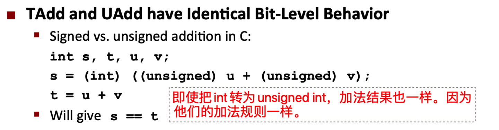
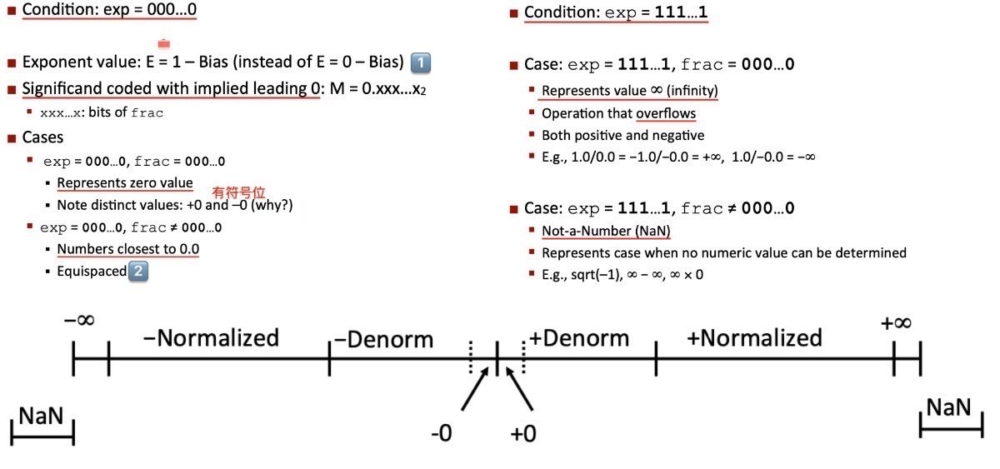
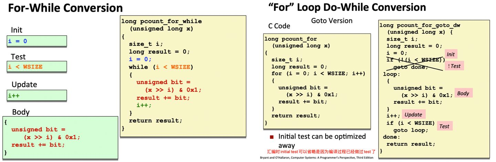
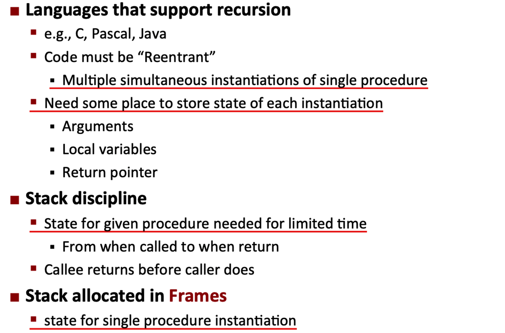
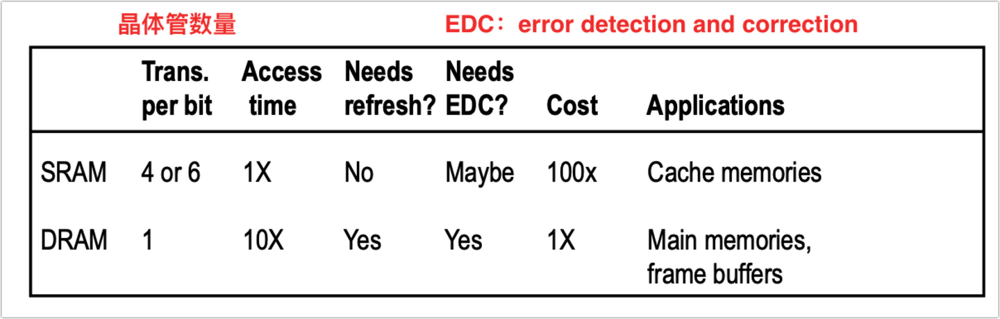
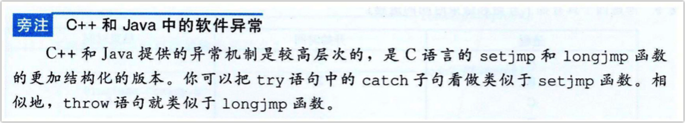
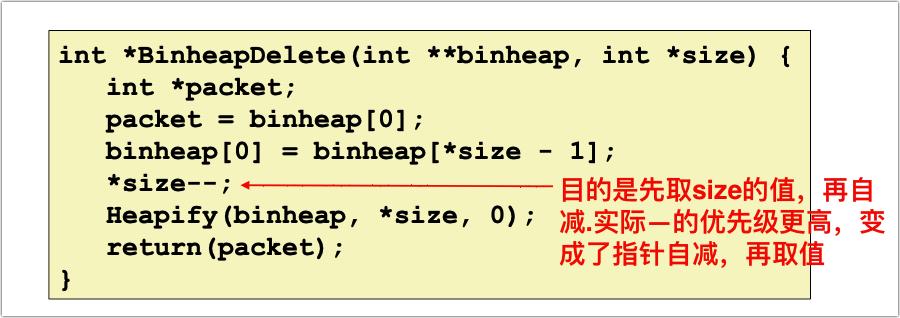
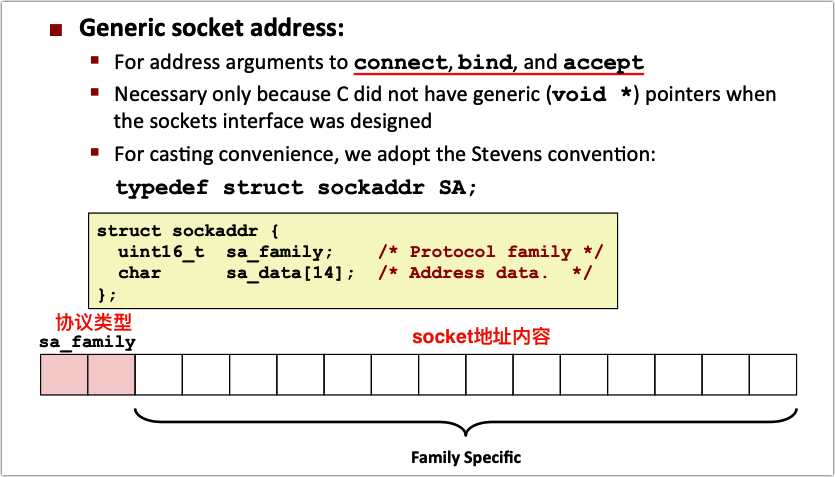
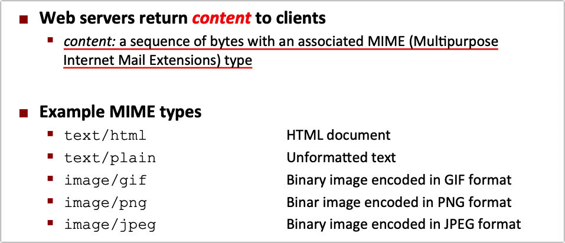

# 一：bit、int和float

## 01 Overview

抽象虽然很好，但了解程序的真实运行过程也很重要。可以让我们避免bug以及让程序运行更有效率。 课程主要内容：

1. 数字和数字的表示 
2. 编译器的过程和汇编 
3. 计算机的分层存储内存系统 
4. 从程序角度提升运行性能 
5. 其他（IO、网络等）

**Course Theme: Abstraction Is Good But Don’t Forget Reality**

**Great Reality #1: Ints are not Integers, Floats are not Reals**

首先讨论数字、数字的表示和属性

**Great Reality #2: You’ve Got to Know Assembly**

获取编译器的汇编代码，阅读并理解它

**Great Reality #3: Memory Matters Random Access Memory Is an Unphysical Abstraction**

现代计算机的内存系统是一个分层存储的系统，在高性能的表现的同时有较大的储存容量。如果你的程序运行比较糟，因为没有利用这个分层存储系统。

Memory Referencing Bug Example  C语言中常见的bug：内存引用错误。

 **Great Reality #4: There’s more to performance than asymptotic complexity**

从程序角度增加性能

Memory System Performance Example 

Great Reality #5:  Computers do more than execute programs 

**Course Perspective** 

程序员视角

## 02 Bits, Bytes, and Integers

bits，bytes，int和string。unsigned int和signed int的计算、表示和存储。

**Everything is bits** 

**General Boolean Algebras 布尔代数**

### Integers  

Encoding Integers 

**Numeric Ranges** 

**Mapping Between Signed & Unsigned signed和unsigned之间的转换**

Mappings between unsigned and two’s complement numbers: Keep bit representations and reinterpret 

**Casting Surprises in C** 

**Sign Extension 有符号数扩展位**

**Expanding, Truncating: Basic Rules** 

大部分系统都使用补码表示有符号数。

**Unsigned Addition** 

**Two’s Complement Addition** 

除了高位overflow以外，还有可能因符号位变化导致negative overflow和positive overflow

因为补码的作用，无符号数和有符合数相加使用相同的规则。

**Multiplication** 

**Unsigned Multiplication in C** 

signed 类似

**Power-of-2 Multiply with Shift 移位乘**

一次移位需要一个时钟周期，乘法需要十几个（现代计算机需要3个）。编译器可能在适合的时候将乘法替换为移位（编译后的机器级代码中看到）。

**Unsigned Power-of-2 Divide with Shift 移位除**

在现代计算机上，除法依然很慢（30个时钟周期），因此编译器极力使用移位和其他调整来实现。

有符号数除法类似，不过有符号数右移采用“算术右移”，即左边补符号位。

> Tmin的负数等于自身。

**Why Should I Use Unsigned?**  

### Representations in memory, pointers, strings 

在我们使用的64位系统中，地址用64位表示。但实际上机器上最大内存地址是47位。 对应2^47=128TB。一个程序是非常复杂的硬件和软件的组合，它只是一个巨大的字节数组的平铺空间。但实际上它在内存的不同区域之间移动。

> 计算机采用二进制编码方式表示数、字符、指令和其它控制信息。 计算机在存储、传送或操作时，作为一个单元的一组二进制码称为字，一个字中的二进制位的位数称为字长。计算机中大多数寄存器的大小是一个字长。计算机处理的典型数值也可能是以字长为单位。CPU和内存之间的数据传送单位也通常是一个字长。还有内存中用于指明一个存储位置的地址也经常是以字长为单位的。现代计算机的字长通常为16、32、64位。

程序使用的字长由机器和编译器共同决定，比如可以给GCC制定32位或64位。

即使在64位机器上，int也默认是32位。所以字长并不是一个非常有意义的术语。

**Word-Oriented Memory Organization** 

**Byte Ordering** 

**Examining Data Representations** 

**Representing Pointers** 

**Representing Strings** 

## 04 Floating Point 

浮点数的表示（IEEE）、性质、舍入规则、加法/乘法、double/float/int之间的转换

**Fractional Binary Numbers 二进制分数**

分数二进制的不足：

### Floating Point Representation 

IEEE Standard  

**Denormalized Values & Special Values 非规约值和特殊值**

> 1️⃣IEEE 754标准规定：**非规约形式的浮点数的指数偏移值比规约形式的浮点数的指数偏移值小1**。例如，最小的规约形式的单精度浮点数的指数部分编码值为1，指数的实际值为-126；而非规约的单精度浮点数的指数域编码值为0，对应的指数实际值也是-126而不是-127。 
>
> 2️⃣如果没有渐进式下溢出，那么0与绝对值最小的浮点数之间的距离（gap）将大于相邻的小浮点数之间的距离。 https://zh.wikipedia.org/wiki/IEEE_754 

**Tiny Floating Point Example** 

**Distribution of Values 值的分布**

### Floating Point Operations: Basic Idea 

**Rounding Mode ：Round-To-Even 舍入方法**

四舍六入五成双

> 四舍五入，舍入几率不均等。 尾数为0123456789，四舍五入，实际上真实舍去的4个(1234)，入得是5个(56789)。 所以就有了四舍六入，使舍入几率均等。接下来就是5，应该舍还是入。所以有了5配成偶数(也就是一半的几率进位)。另外也有5配奇数这样的规则。  

**FP Multiplication 浮点数乘法**

**Floating Point Addition 浮点数加法**

**Mathematical Properties of FP Add and Mult 浮点数加法、乘法的数学性质**

**Floating Point in C** 

在unsigned和signed int之间转换时，bit的representation没有变化，只是对它做了reinterpret。但是double、float和int之间的转换改变了bit本身。

# 二：机器级编程

## 05  Basics 

1. Intel处理器和x86架构的历史；
2. C代码如何与汇编代码相关联； 
3. 机器代码的基础知识：寄存器、运算、复制； 
4. 机器代码的算术和逻辑运算。

两种代码：在机器上实际运行的目标代码（一串字节）；汇编代码（编译器生成的代码，指令）。这两者一一对应，都可以称为机器代码。

**Intel x86 Processors** 

ARM：RISC指令集，功耗更低。

### C, assembly, machine code 

- Architecture 指令&指令集 编译器使用一系列指令告诉机器需要做什么。硬件工程师将指令抽象成“指令集”的架构，编译器使用指令集，而如何更好地实现指令是硬件工程师的工作。
- Microarchitecture: Implementation of the architecture. 微架构
- Machine Code & Assembly Code ：机器代码&汇编代码
- ISAs:  
- Intel: x86, IA32, Itanium, x86-64  
- ARM: Used in almost all mobile phones 

**Assembly/Machine Code View** 

**Turning C into Object Code 把C代码编译为机器代码**

**Machine Instruction Example** 

除了objdump外，也可以使用gdb做反汇编。gdb sum ；disassemble sumstore 

### Assembly Basics: Registers, operands, move 

**x86-64 Integer Registers** 

实际上大多数情况下需要明确指明这些寄存器的名称来存取。

**Moving Data ：movq Operand  复制数据movq指令**

**Simple Memory Addressing Modes 简单寻址方式**

**Example of Simple Addressing Modes** 

swap()函数，先把内存中的值拷贝到寄存器，再把寄存器中的值拷贝到内存。

swap过程：

**Complete Memory Addressing Modes 完整寻址方式**

比如根据索引查找数组元素

### Arithmetic & logical operations 

**Address Computation Instruction 地址计算指令**

以q（quadword）结尾的指令表示对64位数据进行操作

**Some Arithmetic Operations** 

**Arithmetic Expression Example** 

## 06 Control 

控制语句的汇编实现 

1. 条件语句：条件码、条件分支和条件移动 
2. while、do-while、for循环 
3. switch语句：jump table

### Condition codes 

**Processor State (x86-64, Partial)** 

%rsp：栈指针寄存器，保存当前栈顶的地址

%rip：指令地址寄存器，保存当前正在执行指令的地址。也叫做程序计数器（program counter）

**Condition Codes (Implicit Setting) 条件码（隐式设置）**

这四个条件码被置位是许多指令的一种常规行为；但leaq指令不会设置。

**Condition Codes (Explicit Setting:Compare and Test) 条件码（显式设置）**

有些指令的唯一作用就是给条件码置位。比如cmp对两个值做减法，但不对结果做任何操作。而sub（减法指令）会把结果赋值。

**SetX Instructions Set指令**

16个寄存器中的每一个，都可以直接将其最低位字节设置位0或者1。且不会影响到该寄存器的其他7个字节。

example：

### Conditional branches  

**Jumping**  

**Conditional Branch Example (Old Style)** 

-fno-if-conversion告诉gcc不要使用condition move指令，而是使用jump指令。

**Using Conditional Moves** 

条件移动：把then和else分支都执行得到两个结果，然后才选择用哪个结果。看似浪费时间，实际更有效率。

处理器在完成一个指令之前就开始执行下一个指令的一部分。这种技术叫流水线。实际上流水线能达到20条以上指令的深度，取决于提前获取的指令的条数。当遇到分支时，处理器会预测正确的分支。但是如果预测错误，它只能丢掉这条分支上所有执行的指令，并重新从正确的分支获取指令填充流水线。预测错误的后果是大约浪费19个时钟周期。而使用条件移动，处理器的时间都是大约8个周期。控制流不依赖数据，使得处理器更容易保持流水线是满的。

条件移动虽然效率高，但是在一些情况下会产生副作用，不能使用。

### Loops  

**“Do-While” Loop** 

**“While” Loop #1**

Used with -Og 

**“While” Loop #2**

- “Do-while” conversion 
- Used with –O1 

“For” Loop 

转为while loop或者do-while loop

### Switch Statements 

**Jump Table** 

**Switch Statement Example** 

Indirect jump 间接跳转:

## 07  Procedures 

函数调用过程使用栈（和栈帧）来 

1. 传递函数调用（call）、返回信息（ret） 
2. 传递参数和返回值 
3. 存储局部变量和寄存器数据 

以上3个通用行为可以实现函数间的相互调用，包括递归。

procedure，可以是函数、过程或者面向对象中的方法。

ABI 应用程序二进制接口：要求所有Linux程序、编译器、操作系统都要对如何管理机器上的资源有一些共同的理解。它是机器程序级别的接口。windows、macOS、FreeBSD都有自己的ABI。这些ABI有很多共同点，但是细节有些不同。 

**Mechanisms in Procedures** 

### Stack Structure  

栈：内存（字节数组）中的一个区域。程序用栈管理过程调用与返回的状态。程序传递调用信息和数据，并分配本地数据。使用栈是因为栈符合过程调用和返回的自然逻辑。

>1. 栈是内存中的结构，寄存器是CPU上的结构。一般从寄存器取值并push到栈中，或从栈中取值存到寄存器内。同时，寄存器还需要保存栈的地址。 
>1. 指令和数据都存放在内存中，区分在于取值时机。cpu在取指阶段将指令读出来放到指令寄存器，执行阶段取数据放入数据寄存器。

栈保存指令的地址。push、pop时存/取指令地址，并同步修改%rsp寄存器中的栈顶指针。

### **Passing control**  

调用过程：

rip : 指令地址寄存器，用来存储 CPU 即将要执行的指令地址。每次 CPU 执行完相应的汇编指令之后，rip 寄存器的值就会自行累加；rip 无法直接赋值，call, ret, jmp 等指令可以修改 rip。 

- call指令中有调用函数的起始地址。call指令同时push返回值（修改rsp）和赋值程序计数器rip，这样一边调用函数，一边保存函数返回地址。
- ret指令是call指令的逆过程，pop栈中的指令地址，并增加rsp栈指针。然后修改rip位pop出来的指令地址。

### **Passing data**  

一些特定的寄存器存放函数的前六个参数（整数和指针，浮点数用另外的寄存器），%rax寄存器用于存放函数的返回值。多余6个的参数存放在调用栈上。

这些规则是ABI的一部分，使得可以用不同编译器编译相同的代码。

Data Flow Examples 

### **Managing local data** 

**Stack-Based Languages** 

为了存储本地数据，需要使用stack frame（栈帧）的概念。栈帧也是一个特殊的内存，可以支持递归/嵌套调用。

- 过程需要的存储空间大于寄存器的大小时，就会在栈上分配栈帧。
- 一个过程的特定实例调用一个栈帧。在栈中为每个被调用且未返回的过程保留一个栈帧。
- 一个栈帧包含两个指针（有一个可选）
- 栈的顶部是最顶层函数的顶部栈帧，这个栈也是存放指令的那个栈

example

X86-64栈帧结构（栈用来传递参数、存储返回信息、保存寄存器、局部变量的存储）

 **Example: Calling incr** 

**Register Saving Conventions** 

寄存器对于局部变量的存储的约定也是ABI的一部分，被调用函数可能覆盖调用者函数在寄存器中的值。主要使用“Callee Saved”约定。

- “Caller Saved”：预期存储在寄存器中的值可能被修改
- “Callee Saved”：如果特定函数要修改寄存器，应该先把寄存器的值存储在栈中，在过程返回之前再把它恢复到以前的状态。

"Caller Saved" vs "Callee Saved"

Callee-Saved Example 

### Illustration of Recursion   

C编译器不需要专门考虑递归的情况，递归函数和普通函数别无二致，因为栈的原则确保了它的可行性。

**Recursive Function** 

递归的例子是一个融合了多个技巧的例子，而且，所有函数都使用了同一个通用约定。比如，参数在哪里传递，什么寄存器可以使用，如何使用寄存器，寄存器的值如何恢复等。 

**Observations About Recursion** 

## 08  Data 

一些数据的存储和读取： 

1. Array、Structure、Array和Structure的组合 
2. Structure的对齐 
3. 浮点数（XMM寄存器）

### Arrays 

内存中的连续存储区域 

**Array Loop Example** 

**Understanding Pointers & Arrays** 

**Element Access in Multi-Level Array** 

### Structures 

结构是一些数据类型的集合，编译器会为每个字段分配空间并计算好地址偏移量。取值的时候根据偏移量来取字段。

**Structure Representation** 

**Following Linked List** 

**Structures & Alignment** 

当structure中有一个k字节的字段，编译器通常更喜欢起始地址是k的倍数。所以引入了一个”对齐“的概念。在给structure分配空间时，编译器会插入一些空白的字节，来保持对齐。 

大多数硬件不是一次性取一个字节，而是大约64个字节。如果没有一个对齐的地址，一个特定的数据跨越了两块之间的边界。这会让硬件甚至操作系统采取一些额外的步骤来处理。对齐的数据可以让硬件处理起来更有效率。

**Satisfying Alignment with Structures** 

**Arrays of Structures** 

**Saving Space**  

把最大的字段放到最前面

### Floating Point 

标准：AVX FP 

存储浮点数用到的是16个16bytes XMM寄存器。

SIMD（single instruction multiple data，单指令多数据）：单个指令（如addps）同时对四个不同的数进行加法运算。

除了使用XMM寄存器和特殊的浮点指令，浮点数运算的机器代码和整数看起来很像。它的基本思想十分简单，但是它的一些其他指令比较复杂（详见书本)：

## 09 Advanced Topics 

1. x86-64 linux的内存布局：栈、堆、数据区、代码区 
2. 缓冲区溢出的原理以及利用该漏洞实现hack攻击 
3. union数据类型的表示

###  Memory Layout 

**x86-64 Linux Memory Layout 内存布局**

**x86-64 Example Addresses** 

可以使用GDB观察程序运行时各种地址。

### Buffer Overflow 

当访问超出缓存区大小的内存区域，就会发生缓冲区溢出。很多函数，比如系统函数gets()，从控制台获取string输入，由于一开始分配的缓冲区有限，而输入的string超出缓冲区范围时，就会发生溢出。

**Buffer Overflow Stack Example** 

**Stack Smashing Attacks 、Code Injection Attacks** 

利用缓冲区漏洞制造入侵和攻击：将函数返回地址替换为另一段代码的地址。

**What To Do About Buffer Overflow Attacks** 

- Avoid overflow vulnerabilities 
- fgets instead of gets  
- strncpy instead of strcpy  
- Don’t use scanf with %s conversion specification 
- Randomized stack offsets  aslr：地址空间布局随机化。每次运行时，栈的内存位置是随机的。
- Nonexecutable code segments  不同内存区域的权限不同，将栈标记为不可执行
- Stack Canaries  使用Stack Canaries 或其他机制检测潜在的溢出风险。 gcc中默认打开了Stack Canaries 功能：-fstack-protector   

**Return-Oriented Programming Attacks** 

### Unions 

**Union Allocation**  

**Using Union to Access Bit Patterns** 

union是一种切换类型并得到不同的位的表示形式的技术

当用联合将各种不同大小的数据类型结合到一起时，字节顺序问题就变得很重要了。比如在小端法机器上，有效位在最低的字节上。而在大端法机器上，刚好相反。

**Summary of Compound Types in C** 

# 三：优化程序性能

怎么让程序运行的更快？

- 比如，去掉程序中不必要的工作，这个优化不依赖于目标机器。
- 让代码能够被编译器优化（编译器友好代码）。  
- 针对特定的机器对程序进行优化（风险在于换一个处理器可能就效果较差，但也有一些通用性的做法）

要使程序运行高效，不一定要使用汇编编写（除非在一些资源特别小的机器上）。

1. 编译器的通用优化方法：Code Motion、 Reduction in Strength 、 Share Common Subexpressions  
2. 编译器优化的局限Procedure Calls 、Memory Aliasing 及解决办法（编译器友好代码） 
3. 指令级并行、流水线操作单元、SIMD向量操作：数十倍提高运行效率 
4. 条件分支：避免不可预测的分支

### Overview 

**Performance Realities** 

There’s more to performance than asymptotic complexity 

**Optimizing Compilers** 

gcc不是最好的编译器，但对于大部分人已经足够用。

**Limitations of Optimizing Compilers 编译器的局限**

- 编译器并不能真正理解你正在使用的数字。当你定义一个int，实际上它的取值范围是比int范围小很多的子集。编译器也很难理解内存引用模式和过程调用的影响。
- 大部分优化是基于静态分析。
- 编译器有一整套优化策略和方法。但是编译器只做确定的优化。如果发现编译器没有做预期中的优化，应该回去看代码。

### Generally Useful Optimizations  通用优化方法

**Code Motion**

一种编译器优化技术，通常在O1优化中使用。

**Reduction in Strength** 

将耗时的操作转化为简单的操作，比如移位、加法替代乘法

**Share Common Subexpressions** 

共享通用的表达式，在O1优化中使用。比如下面的例子中，计算一个像素矩阵上下左右的值之和。

### Optimization Blockers 编译器的局限

**#1 Procedure Calls** 

在过程间调用时，编译器经常无法自动实现一些优化。编译器将过程间调用视为一个黑盒。

补偿方法：

- 使用inline函数，gcc O1优化
- 手动code motion

比如一个将字符串改为小写的例子。错误写法中，将strlen（On复杂度）放到循环条件里。在汇编代码里，每一次循环，都会调用strlen。从而整体复杂度为O(n^2)。code motion优化之后的复杂度为O(n)。

性能对比：

为什么编译器不能自动优化的原因：在循环体中修改了字符串s。即使修改其中的字符并不会影响字符串的长度，但是strlen函数的实现在其他文件（或者系统库）中。编译器在链接之前，并不知道这个函数是怎么实现的。因此出于不确定原因，每次都会计算一次strlen。

**#2 Memory Aliasing** 

内存别名，即内存中的一个位置可能被程序中的不同部分引用。所以编译器在使用该位置的值时，必须每次都读取最新值，因为可能被别的引用所修改。

注：这里  alias加与不加的计算结果不同

### Exploiting Instruction-Level Parallelism 

乱序执行（Out Of Order）：处理器可以打乱指令的执行顺序。

超标量（super scalar）：同时执行多个指令，实现指令级并行（ILP）。可以同时执行多个指令的CPU称为超标量指令处理器。 

指令级并行（Instruction-Level Parallelism ）：可以认为程序是一个顺序执行的指令序列，CPU尽可能的读取多的指令序列。然后CPU把读入的指令拆开，发现有的指令之间不是相互依赖的，所以可以开始执行程序后面的代码。因为它们彼此独立。

几乎所有处理器都实现了这个特性，因此也是一种通用优化方法。

**Modern CPU Design** 

基本思想：把程序的操作拆分、重组，使这些基本单元尽可能繁忙、执行代码的不同片段。

**Pipelined Functional Units 流水线操作单元** 

以Haswell CPU 为例，流水线技术通常可以成倍缩小计算时间。（注意，除法无法被流水线拆分。因此在代码中避免使用除法）

**Cycles Per Element (CPE)** ：处理一个元素（OP）占用的时钟周期。这个指标可以很好地衡量程序运行的性能，和元素的数量无关。即下图中的Slope：

利用指令级并行的例子：

1️⃣没有指令集并行，因为每一次OP都需要前一次OP的计算结果。

2️⃣Loop Unrolling with Reassociation (2x1a) 一次循环执行2次操作，利用并行，将CPE缩小1/2。

注：浮点数运算不满足结合律。舍入可能会导致计算结果不同。但如果计算过程中不会发生舍入的情况，那么这种转换不会影响计算结果。即使发生舍入的情况比较少，也足够让大多数编译器不会造成结合性导致的差异。因为它们的浮点数计算的优化相当保守。

3️⃣Loop Unrolling with Separate Accumulators (2x2) 另一种方法，同样在一次循环执行2次操作，将CPE缩小1/2。

通过调整Unrolling & Accumulating 的参数组合，可以将int、float的CPE接近吞吐量界限。

**Programming with AVX2** 

怎么突破硬件限制（吞吐量界限）？增加寄存器的数量。YMM寄存器是提供给浮点数计算的额外的一组寄存器（之前是XMM寄存器），一共16个，每一个32字节（XMM是8字节）。通过与SIMD Operations 的结合，还可以实现向量化操作。

**SIMD Operations** 

其中一条矢量加法指令可以同时执行八次单精度浮点加法或者四次双精度浮点加法。如果这个硬件处于繁忙状态，可以大幅提高乘法性能。三个时钟周期，可以并行进行八次流水线的浮点数乘法。

Intel编译器会自动做一些这方面的优化，gcc也尝试去实现这种优化，但效果不好，可能gcc已经放弃这个优化了。因此只能手动实现向量化编程（参考：http://csapp.cs.cmu.edu/3e/waside/waside-simd.pdf）。

SIMD向量操作与标量操作的性能和吞吐量对比：

### Dealing with Conditionals 

**What About Branches?** 

Instruction Control Unit 指令控制单元必须在Execution Unit 执行单元之前产生足够多的操作（Fetch），以让Execution Unit 保持繁忙。当遇到条件分支时，不确定往哪条分支继续执行，需要等到Execution Unit执行到这里之后才知道。在等待的过程中，Execution Unit 的指令池变得很空。

**Branch Prediction** 

分支预测技术，猜测可能的分支走向并执行指令。如果猜错，则回退到预测点，重新执行。回退过程会消耗大量时钟周期，可能成为性能瓶颈。

**总结：Getng High Performance** 

# 四：存储器层次结构

Memory Hierarchy：怎么构建存储器层次结构 

- 存储器：RAM、Disk和SSD介绍 
- 局部性：程序重复访问一块内存区域的可能性很高 
- 为了充分利用局部性而建立起基于缓存的存储器层次结构

Cache Memories ：高速缓存的作用并利用其提高程序性能 

- 高速缓存存储的概念、结构和读写操作 
- 衡量缓存性能的指标并编写缓存友好代码 
- 重新排列循环以提高空间局部性 
- 利用分块提高时间局部性

## 11 Memory Hierarchy

之前我们将内存当做一个字节数组，实际上存储系统是一个非常复杂的设备层次结构。这个层次结构（Memory Hierarchy ）将内存抽象成了一个大的线性数组。本节课程探寻存储器层次结构是怎么构建的，体会到多种存储设备之间属性的美妙融合，以及程序的属性在其中起到的作用。

### Storage technologies and trends 

大多数人熟悉的内存是随机访问存储器（RAM），由很多个芯片组成。基本的存储单位是单元（cell），一个cell存储一个bit。RAM分为2种：

1. SRAM：静态RAM
2. DRAM：动态RAM

SRAM和DRAM的存储单元的实现方式不同，因此访问速度和适用场景也不同

**Nonvolatile Memories 非易失性存储器**

SRAM和DRAM都是易失性存储器

**Traditional Bus Structure Connecting CPU and Memory 主存和CPU之间的线路连接**

bus：主线，数据流通过主线在主存和CPU之间传输

**Disk 磁盘**

**Disk Capacity 磁盘容量**

**Disk Operation 磁盘操作（读写头）**

**Disk Access**  

**Disk Access Time 磁盘访问时间**

**Logical Disk Blocks** 

现代磁盘控制器将磁盘作为一系列逻辑块提供给CPU。每个块是扇区大小的整数倍。

**I/O Bus** 

**Reading a Disk Sector** 

机制：CPU将读取请求发送给磁盘控制器，然后继续执行其他工作。磁盘控制器完成数据传输后，以中断（interrupt）的方式通知CPU。

这么设计的原因是，从磁盘读取数据很慢。在10毫秒内，CPU可以执行数百万条指令。

**Solid State Disks (SSDs)** 

和磁盘有相同的接口、物理接口。但是没有磁盘的机械部件，而是完全由闪存和控制器构成。

**SSD Performance Characteristics SSD读写性能**

SSD相对机械磁盘的优缺点

- 访问更快、能耗低、更稳定
- 会磨损、价格贵

**The CPU-Memory Gap** 

由上图看到，即使CPU性能大幅提高，如果存储器的性能提高比较慢，程序就会受制于存取数据的速度。而弥合CPU和内存之间差距的关键，是程序的一个基本属性——局部性（locality）。

### Locality of reference 

locality：如果程序访问一个数据项，那么在不久之后的某个时间访问这个数据项或附近的数据项的可能性非常高。

**Locality Example** 

**Qualitative Estimates of Locality 局部性定性评估**

Claim: Being able to look at code and get a qualitative sense of its locality is a key skill for a professional programmer. 

**Memory Hierarchies 存储器层次结构**

这些硬件与软件的基本特性，为人们提供一种设计存储系统的建议——存储器层次结构（memory hierarchy ）。

### Caching in the memory hierarchy 

Example memory hierarchy

**Caches 缓存**

A smaller, faster storage device that acts as a staging area for a subset of the data in a larger, slower device. 

 **Types of Cache Misses 缓存不命中的类型**

**Examples of Caching in the Mem. Hierarchy** 

## 12 Cache Memories 

Cache Memories ：高速缓存存储器，它们会对程序性能产生巨大的影响。了解它们如何工作，就能够在程序中发挥它们的优势。 

### Cache memory organization and operation 

**Cache memory**

高速缓存存储器完全由硬件管理，关键是硬件如何确定缓存中是否包含块并查找。因此，必须以非常严格且简单的方式去组织高速缓存存储器。

**General Cache Organization & Cache Read 高速缓存组织和读取**

Cache Organization ：将高速缓存存储器组织成一个数组形式的set的集合。

Cache Read：从CPU请求的地址位中抽取出标记位、组索引位、块偏移位。根据组索引位找到set，根据有效位和标记位确定是否存在数据，再根据块偏移位找到数据。

**Example: Direct Mapped Cache (E = 1) 直接映射高速缓存**

E=1的高速缓存称为直接映射高速缓存。

当miss的时候，从内存中读取值，修改v为1，并覆盖tag的值

**E-way Set Associative Cache (Here: E = 2) E路组相连高速缓存**

E=1时，很容易出现miss的情况。E大于1叫做组相连高速缓存，或者叫E路组相连高速缓存。

**writes 高速缓存写入**

实际上，写操作比读操作更容易。

**Intel Core i7 Cache Hierarchy** 

多核处理器

**Cache Performance Metrics 缓存性能指标**

miss penalty需要大量时间，如果miss rate降低两个百分点，性能可能提高1倍。

**Writing Cache Friendly Code 编写缓存友好代码**

### Performance impact of caches 

缓存对代码的性能影响

### The memory mountain 

**Memory Mountain Test Function** 

### Rearranging loops to improve spacial locality

**Matrix Multiplication Example** 

**Matrix Multiplication** 

**Summary of Matrix Multiplication** 

### Using blocking to improve temporal locality

**Example: Matrix Multiplication** 

**Blocked Matrix Multiplication**

**Blocking Summary** 

# 五：链接

13 Linking 链接 

- 三种目标文件和目标文件的格式ELF 
- Linking的过程：符号解析和重定位 
- 程序的加载过程 
- 静态库和动态库的生成和链接过程 
- 库打桩技术：利用链接截获对库函数的调用

## 13 Linking

链接(linking)是将各种代码和数据片段收集并组合成为一个单一文件的过程,这个文件可被加载(复制)到内存并执行。在现代系统中,链接是由叫做链接器(linker)的程序自动执行的。

链接器在软件开发中扮演着一个关键的角色,因为它们使得分离编译(separate compilation)成为可能。我们不用将一个大型的应用程序组织为一个巨大的源文件,而是可以把它分解为更小、更好管理的模块,可以独立地修改和编译这些模块。

理解链接的原因：

- 理解链接器将帮助你构造大型程序。 构造大型程序的程序员经常会遇到由于缺少模块、缺少库或者不兼容的库版本引起的链接器错误。你需要理解链接器是如何解析引用、什么是库以及链接器是如何使用库来解析引用的。
- 理解链接器将帮助你避免一些危险的编程错误。  Linux链接器解析符号引用时所做的决定可以不动声色地影响你程序的正确性。
- 理解链接将帮助你理解语言的作用域规则是如何实现的。 例如,全局和局部变量之间的区别是什么?当你定义一个具有 static属性的变量或者函数时,实际到底意味着什么?
- 理解链接将帮助你理解其他重要的系统概念。 链接器产生的可执行目标文件在重要的系统功能中扮演着关键角色,比如加载和运行程序、虚拟内存、分页、内存映射。
- 理解链接将使你能够利用共享库。 许多软件产品在运行时使用共享库来升级压缩包装的(shrink-wrapped)二进制程序。还有,大多数Web服务器都依赖于共享库的动态链接来提供动态内容。

**Static Linking  example 静态链接示例**

gcc：编译器驱动程序（compiler driver）

cpp：c预处理器，将main.c翻译成一个ASCII码的中间文件main.i

cc1：c编译器，将main.i翻译成一个ASCII汇编语言文件main.s

as：汇编器，将main.s翻译成一个可重定位目标文件main.o

ld：链接器程序，将main.o和sum.o以及必要的系统目标文件组合起来，创建一个可执行目标文件prog

运行程序：

**一些关于链接的基本事实**

目标文件纯粹是字节块的集合。这些块中,有些包含程序代码,有些包含程序数据,而其他的则包含引导链接器和加载器的数据结构。链接器将这些块连接起来,确定被连接块的运行时位置,并且修改代码和数据块中的各种位置。链接器对目标机器了解甚少。产生目标文件的编译器和汇编器已经完成了大部分工作。

注1：链接器之所以需要是因为可重定位目标文件是一个个单独的文件，它们之间存在相互引用，却不了解各自的位置。

注2：链接器确定的运行时内存地址并不是实际的地址，而是一个占位符。在程序运行阶段时，可执行文件被加载到内存中，给栈、堆、代码和数据块分配实际的内存地址。

**Why Linkers?  为什么使用链接器？**

为什么要单独编译所有文件再链接到一起，而不是一个包含所有代码的大文件？ 

1. 代码模块化
2. 时间和空间效率

**What Do Linkers Do?  链接器是怎么链接的？**

1️⃣符号解析（symbol resolution）

将符号引用与输入的可重定位目标文件中的符号表中的一个确定的符号（全局变量、函数等）关联起来。

2️⃣重定位（relocation）

合并relocation输入模块，并为每个符号分配运行时地址。

### **Three Kinds of Object Files** 

object module：目标模块，一个字节序列

object file：目标文件，以文件形式存放在磁盘中的目标模块

### **Executable and Linkable Format (ELF)** 

.o, .out, .so都是使用这种（二进制）格式

**ELF Object File Format ELF格式信息**

### **Linker Symbols 符号**

注：C中使用static隐藏模块内部的变量和函数声明，Java和C++使用public和private。

**Local Symbols 局部符号**

定义为带有 static属性的本地过程变量是不在栈中管理的。相反,编译器在.data或.bss中为每个定义分配空间,并在符号表中创建一个有唯一名字的本地链接器符号。

### symbol resolution 符号解析

将符号引用与输入的可重定位目标文件中的符号表中的一个确定的符号关联起来。

如果解析失败，出现常见的“undefined reference to xxx”错误。

**How Linker Resolves Duplicate Symbol Definitions** 

对全局符号的符号解析很棘手,还因为多个目标文件可能会定义相同名字的全局符号。在这种情况中,链接器必须要么标志一个错误,要么以某种方法选出一个定义并抛弃其他定义。 Linux系统采纳的方法涉及编译器、汇编器和链接器之间的协作,这样也可能给不警觉的程序员带来一些麻烦。

**Linker’s Symbol Rules 解析规则**

为了避免因这些规则带来预期之外的结果，尽量不使用全局变量，或者：

### Relocation 重定位

1. 重定位节和定义 将所有相同类型的节合并为同一类型的新的聚合节，并把运行时内存地址赋给新的聚合节。这样，程序中的每一条指令和全局变量都有唯一的运行时内存地址了。
2. 重定位节中的符号引用 链接器修改代码节和数据节中对每个符号的引用，使得它们指向正确的运行时内存地址。

**聚合节**

**赋予运行时内存地址**

### Loading Executable Object Files 

链接器已经将多个目标文件合并成一个可执行文件，这个二进制文件包含加载程序到内存并运行它所需的所有信息。所以可执行文件可以直接加载到内存中，并加载代码和数据，无需进一步修改。

加载器将可执行目标文件中的代码和数据从磁盘复制到内存中,然后通过跳转到程序的第一条指令或入口点来运行该程序。

### Packaging Commonly Used Functions 

### **Old-fashioned Solution: Static Libraries 静态库**

创建一堆.o文件，然后使用archive（AR）打包在一个大文件（archive）中，并且包含每个.o文件的位置。链接器在链接的时候，把需要的.o链接进来。

**Creating Static Libraries 创建静态库**

**Commonly Used Libraries 常用库**

**Linking with Static Libraries Example**

**Using Static Libraries** 

### Modern Solution: Shared Libraries 动态库

静态库有个缺点是：每个程序都使用了printf，那么它们都有一份printf.o的副本。动态库的好处是，只有一个printf的共享库成员实例，其他所有程序都共享这一份副本。

**Shared Libraries (cont.)** 

使用动态链接器（ld-linux.so)

**Dynamic Linking at Load-time 加载时动态链接**

 **Dynamic Linking at Run-time 运行时动态链接**

 **Linking Summary** 

### Case study: Library interpositioning 

Linux链接器支持一个很强大的技术称为库打桩( library interpositioning),它允许你截获对共享库函数的调用,取而代之执行自己的代码。使用打桩机制,你可以追踪对某个特殊库函数的调用次数,验证和追踪它的输入和输出值,或者甚至把它替换成一个完全不同的实现。

基本思想:给定一个需要打桩的目标函数,创建一个包装函数,它的原型与目标函数完全一样。使用某种特殊的打桩机制,你就可以欺骗系统调用包装函数而不是目标函数了。包装函数通常会执行它自己的逻辑,然后调用目标函数,再将目标函数的返回值传递给调用者。

**Some Interpositioning Applications 打桩的应用场景**

**Example program** 

跟踪程序运行时对malloc和free的调用。

**Compile-time Interpositioning 编译时打桩**

在malloc.h中指示预处理器用包装函数替换目标函数的调用。

**Link-time Interpositioning 链接时打桩**

Linux静态链接器支持用---wrap f 标志进行链接时打桩。这个标志告诉链接器,把对符号f的引用解析成__wrap_f(前缀是两个下划线),还要把对符号__real_f(前缀是两个下划线)的引用解析为f。

**Load/Run-time Interpositioning 运行时打桩**

编译时打桩需要能够访问程序的源代码,链接时打桩需要能够访问程序的可重定位对象文件。不过,有一种机制能够在运行时打桩,它只需要能够访问可执行目标文件。这个很厉害的机制基于动态链接器的 LD_PRELOAD环境变量。

如果 LD_PRELOAD环境变量被设置为一个共享库路径名的列表(以空格或分号分隔),那么当你加载和执行一个程序,需要解析未定义的引用时,动态链接器(LD-LINUX.SO)会先搜索 LD_PRELOAD库,然后才搜索任何其他的库。有了这个机制,当你加载和执行任意可执行文件时,可以对任何共享库中的任何函数打桩,包括libc.so。

附：处理目标文件的工具

# 六：异常控制流和系统级I/O

14~15 Exceptional Control Flow：异常控制流 

- 控制流和异常控制流的概念 
- 底层异常控制流Exceptions：中断(interrupt)、陷阱(trap)、故障( fault)和终止(abort)。比如中断、调用系统服务、访问越界、非法指令等 
- 高层异常控制流1️⃣进程上下文切换：切换各进程（任务）之间的CPU和内存资源    
  - 子进程管理：创建(fork)、退出(exit)、回收(wait)以及运行新程序(execve)。 
- 高层异常控制流2️⃣信号：系统中发生的事件通知给进程并要求进程响应   
	- 发送信号：内核发送或进程请求内核发送    
	- 接收信号：忽略、终止或调用信号处理程序handler    
	- handler与主程序之间是并发执行且数据共享，必须编写异步安全的代码。如使用阻塞、同步、volatile、原子操作等技术。    
	- 信号处理程序还需要可移植。 
- 高层异常控制流3️⃣非本地跳转：C程序跳过调用/返回栈规则，直接从一个函数分支到另一个函数。通常用于处理软件异常。    
	- setjmp保存调用环境    
	- longjmp跳转至调用环境 
	

16 System-­Level  I/O：系统级I/O  
- Unix I/O：Unix 底层I/O接口，open, close, read, write, seek, stat..  
- RIO：封装Unix I/O且带有缓冲区和不足值处理的库  
- Unix中表示文件的方式：描述符表、文件表、v-node表以及如何在多进程之间共享  
- C标准I/O库：同样封装Unix I/O且带有缓冲区和不足值处理  
- 如何选择合适的I/O库

## 14 Exceptional Control Flow: Exceptions and Processes

指令序列之间的**控制转移（control transfer）**叫做**控制流（control flow）**。诸如跳转、调用和返回这样一些熟悉的程序指令。这样一些指令都是必要的机制,使得程序能够对由程序变量表示的内部程序状态中的变化做出反应。

但是系统也必须能够对系统状态的变化做出反应。比如,一个硬件定时器定期产生信号,这个事件必须得到处理。包到达网络适配器后,必须存放在内存中。程序向磁盘请求数据,然后休眠,直到被通知说数据已就绪。当子进程终止时,创造这些子进程的父进程必须得到通知。现代系统通过使控制流发生突变来对这些情况做出反应。一般而言,我们把这些突变称为**异常控制流(Exceptional Control Flow,ECF)。**

异常控制流发生在计算机系统的各个层次。比如,在硬件层,硬件检测到的事件会触发控制突然转移到异常处理程序。在操作系统层,内核通过**上下文切换**将控制从一个用户进程转移到另一个用户进程。在应用层,一个进程可以发送**信号**到另一个进程,而接收者会将控制突然转移到它的一个信号处理程序。一个程序可以通过回避通常的栈规则,并执行到其他函数中任意位置的**非本地跳转**来对错误做出反应。

### Exceptional Control Flow

**Control Flow  控制流**

**Altering the Control Flow 控制流的状态改变**

**Exceptional Control Flow 异常控制流**

低层次：

- Exceptions

高层次：

- 进程上下文切换
- 信号
- 非本地跳转

### Exceptions

异常是一种底层的控制转移，由硬件和操作系统一起完成。

异常是把控制转移交给OS kernel来处理一些事件（中断、调用系统服务、访问越界、非法指令等）。

**Exception Tables 异常表**

每一种异常都对应一个异常号，从异常表中查找到异常号对应的处理程序。

**异常的类别**

异常可以分为四类:中断(interrupt)、陷阱trap)、故障( fault)和终止(abort)。中断是异步异常，剩下的是同步异常。

**System Calls Example** 

**Fault Example**

### Processes  

进程上下文切换是一种高层次的异常控制流。

**Processes 进程**

一个处理器核心在一个时刻只能处理一个进程。而系统中通常有很多进程，因此需要使用多进程技术。多进程的方法是上下文切换。

**Multiprocessing: The (Traditional) Reality 单核心多进程**

多进程过程：

1. Save current registers in memory 
2. Schedule next process for execution 
3. Load saved registers and switch address space (context switch) 上下文切换

**Multiprocessing: The (Modern) Reality 多核心多进程**

**Concurrent Processes 并发进程**

**Context Switching 上下文切换**

### Process Control 

操作系统提供很多方法供应用程序调用来操作进程。

**System Call Error Handling** 

**Obtaining Process IDs 获取进程ID**

**进程的状态**

**Creating and Terminating Processes 创建和停止进程**

**fork Example** 

**Modeling fork with Process Graphs 进程图**

进程图可以帮助了解进程执行的偏序

**Reaping Child Processes 回收子进程**

当一个进程由于某种原因终止（Terminated）时,内核并不是立即把它从系统中清除。相反,进程被保持在一种已终止的状态中,直到被它的父进程回收(reaped)。一个终止了但还未被回收的进程称为僵死进程(zombie)。

如果父进程没有回收它的僵死子进程就终止了,那么内核会安排init进程去回收它们。不过,长时间运行的程序,比如 shell或者服务器,总是应该回收它们的僵死子进程。即使僵死子进程没有运行,它们仍然消耗系统的内存资源。

如果父进程终止，而子进程未结束。则子进程一直运行直到终止，然后被init进程回收。

**wait: Synchronizing with Children** 

wait()：同步等待并回收子进程

wait Example

Another wait Example 

**waitpid: Waiting for a Specific Process** 

等待并回收指定进程

调用wait(&status)等价于调用 waitpid(-1,&status,0)。

**execve: Loading and Running Programs** 

在当前进程的上下文中加载并运行一个新程序。execve没有创建新的进程，而是覆盖原有进程。

新程序开始时，用户栈的组织结构：

**利用fork和execve运行程序**

创建子进程，并在子进程中运行新程序。像Unix shell和Web服务器就大量使用了fork和execve函数。

## 15 Exceptional Control Flow: Signals and Nonlocal Jumps 

### Shells  

**Linux Process Hierarchy** 

**Shell Programs** 

Shell是以用户身份执行其他程序的应用程序。

Shell处理后台任务和前台任务的区别只是是否加waitpid。对于大量的后台任务，shell如果不及时回收，可能造成内存泄露。这时候就需要信号来处理。

### **Signals** 

信号就是一个小消息，告诉进程系统中发生了某个类型的事件。Linux支持30种信号。

**Signal Concepts: Sending a Signal 发送信号**

两种原因：

1. 内核检测到一个系统事件
2. 一个进程调用了kill函数，显示要求内核发送信号给目的进程

**Signal Concepts: Receiving a Signal 接受信号**

目的进程被内核强迫对信号的发送做出反应，叫做接受信号。进程可以忽略、终止或者处理这个信号。

**Signal Concepts: Pending and Blocked Signals 待处理信号和阻塞信号**

一个发出而没有被接收的信号叫做待处理信号(pending signal)。在任何时刻,一种类型至多只会有一个待处理信号。一个进

程可以有选择性地阻塞接收某种信号。当一种信号被阻塞时,它仍可以被发送,但是产生的待处理信号不会被接收,直到进程取消对这种信号的阻塞。

**Signal Concepts: Pending/Blocked Bits   Pending/Blocked位向量**

内核为每个进程在 pending位向量中维护着待处理信号的集合,而在 blocked位向量中维护着被阻塞的信号集合。只要传送了一个类型为k的信号,内核就会设置 pending中的第k位,而只要接收了一个类型为k的信号,内核就会清除 pending中的第k位。

**Sending Signals: Process Groups  进程组**

Every process belongs to exactly one process group 

意味着可以向一组进程发送信号。

### Sending Signals

 **Sending Signals with kill Function** 

### **Receiving Signals**  

当内核把进程p从内核模式切换到用户模式时(例如,从系统调用返回或是完成了一次上下文切换),它会检查进程p的未被阻塞的待处理信号的集合(pending&~blocked)。如果这个集合为空(通常情况下),那么内核将控制传递到p的逻辑控制流中的下一条指令。然而,如果集合是非空的,那么内核选择集合中的某个信号k(通常是最小的k),并且强制p接收信号k。收到这个信号会触发进程采取某种行为。一旦进程完成了这个行为,那么控制就传递回p的逻辑控制流中的下一条指令。

https://www.huaweicloud.com/articles/4fbb348482da12ca22c7963de5450625.html

每个信号类型都有一个预定义的默认行为,是下面中的一种:

1. 进程终止。
2. 进程终止并转储内存。
3. 进程停止(挂起)直到被 SIGCONT信号重启。
4. 进程忽略该信号。

Installing Signal Handlers 设置信号处理程序

signal函数可以通过下列三种方法之一来改变和信号 signum相关联的行为:

当一个进程捕获了一个类型为k的信号时,会调用为信号k设置的处理程序,一个整数参数被设置为k。这个参数允许同一个处理函数捕获不同类型的信号。

当处理程序执行它的 return语句时,控制(通常)传递回控制流中进程被信号接收中断位置处的指令。

Signal Handling Example 

**Signals Handlers as Concurrent Flows** 

signal handler与主程序之间是并发执行的，因为它们之间共享全局数据，可能导致不可预知的结果。

Another View of Signal Handlers 

**Nested Signal Handlers**  

Handlers can be interrupted by other handlers 

**Blocking and Unblocking Signals 阻塞和解除阻塞**

Linux提供阻塞信号的隐式和显式的机制:

- 隐式阻塞机制。内核默认阻塞任何当前处理程序正在处理信号类型的待处理的信号。
- 显式阻塞机制。应用程序可以使用 sigprocmask函数和它的辅助函数,明确地阻塞和解除阻塞选定的信号。

example

### **Safe Signal Handling** 

signal handler与主程序之间是并发执行的，而且它们之间共享全局数据。第23节课会讲并发编程的内容，这里提供一些保守的编写处理程序的原则，避免细微的并发错误的风险。

> 为防止和正常的返回值混淆，系统调用一般并不直接返回错误码，而是将错误码（是一个整数值，不同的值代表不同的含义）存入一个名为 errno 的全局变量中，errno 不同数值所代表的错误消息定义在 <errno.h> 文件中。如果一个系统调用或库函数调用失败，可以通过读出 errno 的值来确定问题所在，推测程序出错的原因，这也是调试程序的一个重要方法。 —— [http://c.biancheng.net/c/errno/](http://c.biancheng.net/c/errno) 

**Async-Signal-Safety 异步信号安全函数**

  Correct Signal Handling Example 

**Portable Signal Handling 可移植的信号处理程序**

Posix标准定义了sigaction函数解决移植问题。使用Signal函数封装了sigaction。（Signal和signal是两个函数）。

**Synchronizing Flows to Avoid Races 同步流以避免竞争**

如何编写读写相同存储位置的并发流程序的问题,困扰着数代计算机科学家。

例如,考虑下面的程序,它总结了一个典型的 Unix shell的结构。父进程在一个全局作业列表中记录着它的当前子进程,每个作业一个条目。 addjob和 deletejob函数分别向这个作业列表添加和从中删除作业。

这个程序可能发生的事件是：

这是一个称为竞争(race)的经典同步错误的示例。

消除竞争的方法：通过在调用fork之前,阻塞 SIGCHLD信号,然后在调用 addjob之后取消阻塞这些信号,我们保证了在子进程被添加到作业列表中之后回收该子进程。注意,子进程继承了它们父进程的被阻塞集合,所以我们必须在调用 execve之前,小心地解除子进程中阻塞的SIGCHLD信号。

**Explicitly Waiting for Signals 显式等待信号**

有时候主程序需要显式地等待某个信号处理程序运行。例如,当 Linux shell创建一个前台作业时,在接收下一条用户命令之前它必须等待作业终止,被SIGCHLD处理程序回收。

这个程序的问题是一直while很浪费CPU资源。如果替换为pause和sleep：

可以避免while循环浪费，但是有潜在的竞争问题：如果信号在while之后、pause之前接收，那么pause会一直运行下去，不会再解除了。类似的，如果是sleep，那么即使接收到信号，也必须等待1秒之后，才能继续执行后面的代码。

注：pause()会令目前的进程暂停(进入睡眠状态), 直到被信号(signal)所中断；sleep()会令目前的进程暂停, 直到达到参数seconds 所指定的时间, 或是被信号所中断。

对于sleep来说，设置较小的时间，就会浪费较多的CPU资源。设置较长的时间，就可能因竞争而等待较长的时间。合适的解决方法是使用sigsuspend函数。

sigsuspend函数等价于下述代码的原子的(不可中断的)版本:

在调用sigsuspend之前，必须先阻塞SIGCHLD。sigsuspend执行的时候：

1. 解除SIGCHLD阻塞，并同时睡眠

这时候等待SIGCHLD信号接收，

1. sigsuspend退出休眠，同时将SIGCHLD回到原始状态（阻塞）。
2. 循环结束。

在执行sigsuspend之前，SIGCHLD都是阻塞的，所以不存在while之后、sigsuspend之前接收信号的情况。又由于sigsuspend是原子操作，在第一行（sigprocmask）和第二行（pause）之间也不会接收到信号。因此sigsuspend即不浪费CPU，也避免了pause带来的竞争。

### Nonlocal jumps  

C语言提供了一种用户级异常控制流形式,称为非本地跳转(nonlocal jump),它将控制直接从一个函数转移到另一个当前正在执行的函数,而不需要经过正常的调用-返回序列。非本地跳转是通过 setjmp和 longjmp函数来提供的。

- setjmp函数在env缓冲区中保存当前调用环境,以供后面的 longjmp使用,并返回0。调用环境包括程序计数器、栈指针和通用目的寄存器。
- longjmp函数从env缓冲区中恢复调用环境,然后触发一个从最近一次初始化env的 setjmp调用的返回。然后 setjmp返回,并带有非零的返回值 retval。

非本地跳转的一个重要应用就是允许从一个深层嵌套的函数调用中立即返回,通常是由检测到某个错误情况引起的。如果在一个深层嵌套的函数调用中发现了一个错误情况,我们可以使用非本地跳转直接返回到一个普通的本地化的错误处理程序,而不是费力地解开调用栈。

**Limitations of Long Jumps long jump的局限**

longjmp允许它跳过所有中间调用的特性可能产生意外的后果。例如,如果中间函数调用中分配了某些数据结构,本来预期在函数结尾处释放它们,那么这些释放代码会被跳过,因而会产生内存泄漏。

longjmp还只能跳转到已经被调用但还未完成的函数中：

非本地跳转的另一个重要应用是使一个信号处理程序分支到一个特殊的代码位置,而不是返回到被信号到达中断了的指令的位置。

下图展示了一个简单的程序,说明了这种基本技术。当用户在键盘上键入Ctrl+C时,这个程序用信号和非本地跳转来实现软重启。sigsetjmp和 siglongjmp函数是 setjmp和longjmp的可以被信号处理程序使用的版本。在程序第一次启动时,对 sigsetjmp函数的初始调用保存调用环境和信号的上下文(包括待处理的和被阻塞的信号向量)。随后,主函数进入一个无限处理循环。

> 注： sigsetjmp和 siglongjmp函数不在异步信号安全的函数之列。原因是一般来说 siglongjmp可以跳到任意代码,所以我们必须小心,只在siglongjmp可达的代码中调用安全的函数。在本例中,我们调用安全的 sio_puts和 sleep函数。不安全的exit函数是不可达的。

**C++和Java中的软件异常**

**附：操作进程的工具**

Linux系统提供了大量的监控和操作进程的有用工具。

## 16 System-­Level  I/O

输入/输出(I/O)是在主存和外部设备(如磁盘驱动器、终端和网络)之间复制数据的过程。输入操作是从I/O设备复制数据到主存,而输出操作是从主存复制数据到IO设备。所有语言的运行时系统都提供执行I/O的较高级别的工具。在 Linux系统中,是通过使用由内核提供的系统级 Unix I/O函数来实现这些较高级别的I/O函数的。

### Unix  I/O

Unix系统的I/O更简单和一致，它设计上的一个优点是：用文件来描述很多抽象的事物。

**Unix I/O Overview** 

Unix 操作系统只是把文件当做字节序列，基本上不了解文件内部的详细结构。文件除了被表示位磁盘等设备上的东西，Unix也会把文件描述为其他不同的事物，如连接到某台机器上的I/O设备（TTY表示电传打字机）。另一个是网络连接中的套接字（sockets），网络通信是通过读写套接字传输的。

**文件属性**

**文件类型**

Regular Files 

Directories 

Directory Hierarchy  

**Opening Files 打开文件**

**Closing Files 关闭文件**

**Reading Files 读文件**

读取字节数在[1,sizeof(buf)]之间。

**Writing Files 写文件**

写入字节数在[1,sizeof(buf)]之间。其他和读取文件类似。

**On Short Counts 不足值**

### RIO (robust I/O) package 

RIO是一种高级软件包，但使用了低级I/O的操作。它会自动为你处理上文中所述的不足值。RIO提供了两类不同的函数:

- 无缓冲的输入输出函数。 这些函数直接在内存和文件之间传送数据,没有应用级缓冲。它们对将二进制数据读写到网络和从网络读写二进制数据尤其有用。
- 带缓冲的输入函数。 这些函数允许你高效地从文件中读取文本行和二进制数据,这些文件的内容缓存在应用级缓冲区内。带缓冲的RIO输入函数是线程安全的,它在同一个描述符上可以被交错地调用。

**Unbuffered RIO Input and Output** 

通过调用rio_readn和rio_writen函数,应用程序可以在内存和文件之间直接传送数据。

注意,如果 rio_readn和rio_writen函数被一个从应用信号处理程序的返回中断,那么每个函数都会手动地重启read或 write。为了尽可能有较好的可移植性,我们允许被中断的系统调用,且在必要时重启它们。

**Buffered RIO Input Functions** 

创建一个与文件关联的缓冲区，程序执行读操作时，从文件读取不超过缓冲区长度的字节到缓冲区。当程序提取字节时，直接从缓冲区读取，避免因少量读取而多次调用操作系统。

带缓冲区的输入函数为rio_readnb（读字节）和rio_readlineb （读文本）。

rio_readlineb和rio_readnb的调用可以任意交叉进行。然而,对这些带缓冲的函数的调用却不应和无缓冲的rio_readn函数交叉使用。

### Metadata, sharing, and redirection 

**File Metadata 元数据**

应用程序能够通过调用stat和 fstat函数,检索到关于文件的信息(有时也称为文件的元数据(metadata))。

Example of Accessing File Metadata 

**How the Unix Kernel Represents Open Files Unix内核怎么表示打开的文件？**

内核用三个数据结构表示打开的文件：描述符表、文件表、v-node表。

多个描述符也可以通过不同的文件表表项来引用同一个文件。例如,如果以同一个 filename调用open函数两次,就会发生这种情况。关键思想是每个描述符都有它自己的文件位置,所以对不同描述符的读操作可以从文件的不同位置获取数据。

**How Processes Share Files: fork** 

子进程有一个父进程描述符表的副本。父子进程共享相同的打开文件表集合,因此共享相同的文件位置。一个很重要的结果就是,在内核删除相应文件表表项之前,父子进程必须都关闭了它们的描述符。

**I/O Redirection 重定向**

### Standard I/O 

C标准库(libc.so)有一系列高级I/O函数，和RIO一样有缓冲区。

### Unix I/O vs. Standard I/O vs. RIO  

标准I/O是C标准库的一部分，RIO是专为本书开发的包装函数。标准I/O和RIO都是给予Unix I/O实现，Unix I/O是操作系统内核实现。

- Unix I/O 是异步信号安全函数，但是没有缓冲和不足值处理等功能
- 标准I/O 带有缓冲和不足值处理，不是异步信号安全，且网络读写sockets不好用
- RIO带有缓冲和不足值处理，适用于读写sockets

**Working with Binary Files** 

读写二进制文件避免使用的函数

# 七：虚拟内存和动态内存分配

17 Virtual Memory: Concepts  虚拟内存的基本概念

- 地址空间：虚拟内存地址和物理内存地址
- 虚拟内存作为缓存工具：缓存磁盘数据到主存中，缓存未命中触发缺页异常并自动拷贝数据
- 虚拟内存作为内存管理工具：每个虚拟页可以映射多个物理页，每个物理页可以由多个虚拟页映射。使得内存管理和数据共享非常便利，也因此简化了链接和加载过程。
- 虚拟内存作为内存保护工具：在页表条目中添加权限位（用户、读、写、执行）使得相应地内存不被轻易使用和修改
- 地址翻译：MMU查询页表将虚拟地址转为物理地址。使用TLB加速翻译、使用多级页表节省页表占用的内存空间。

18 Virtual Memory: Systems 虚拟内存在系统上的运作

- 一个简单的内存系统
- Core i7 内存系统：CPU、TLB、四级PTE、缓存和主存
- Linux虚拟内存组织方式：区域（Area）的集合。代码段、数据段、堆、共享库段,以及用户栈都是不同的区域。
- 内存映射（将VM区域与磁盘对象映射）与写时复制对象
  - fork过程：利用写时复制对象，高效拷贝地址空间
  - execve过程：重置Area和内存映射

19 Dynamic Memory Allocation: Basic Concepts 动态内存分配的基本概念

- 堆：应用程序在堆上构造(sbrk)、分配(malloc)以及释放(free)内存片（块）
  - 内存分配器：实现malloc和free，在高吞吐量和高峰值内存利用率之间取得平衡

- 低内存利用率的原因：碎片的产生
- 隐式列表：在每个块的header里记录块大小和分配状态（效率与块总数呈线性关系）
  - 分配：从空闲块中选择一块，First fit和Best fit的策略
  - 释放：释放后的空闲块与其前后的空闲块合并，增加footer（Boundary Tag）。

20 Dynamic Memory Allocation: Advanced Concepts  动态内存分配的高级内容

- 显式空闲列表：使用双向链表，在空闲块中增加prev、next指针（效率与空闲块数量呈线性关系）
  - 分配：修改链表前后块指针
  - 释放：与前后空闲块合并，并作为新的空闲块插入到链表头部（LIFO）或中间以保持链表有序。

- 分离空闲列表：将不同尺寸区间的空闲块构成的链表组合成列表，快速找到合适的空闲块，在吞吐量和内存利用率之间取得最佳效果
- 垃圾收集机制：除了手动释放之外，一些语言可以让系统自动释放。
  - 有向可达图：从根节点出发，遍历所有节点，不可达的节点即垃圾节点。
  - 标记-清理收集：标记所有可达块，将剩下的块释放。

- C语言中常见的内存相关的错误
  - 重新认识C指针
  - 指针类错误：误解指针运算、引用指针而不是它指向的对象
  - 堆内存未初始化、内存覆盖、内存泄露等
  - 一些内存排查工具

## 17 Virtual Memory: Concepts 

虚拟内存是计算机系统最重要的概念之一。“虚拟化”概念应用于计算机系统的很多领域。当你虚拟化一个资源时，你显示了该资源的不同类型的视图。可以通过介入对该资源的访问过程来实现。

比如，磁盘在物理上由柱面、磁道、扇区、盘面组成，你必须指定柱面、磁道、盘面来访问其中一个区域。但我们实际看到的磁盘控制器显示的视图是虚拟化的视图。磁盘控制器将磁盘抽象成一系列逻辑块提供给内核。它通过拦截内核的读写请求来呈现这个视图。将内核发送的逻辑块转换为物理地址。

使用虚拟寻址,CPU通过生成一个虚拟地址(Virtual Address,VA)来访问主存,这个虚拟地址在被送到内存之前先翻译成适当的物理地址。地址翻译需要CPU硬件和操作系统之间的紧密合作。CPU芯片上叫做内存管理单元(Memory Management Unit,MMU)的专用硬件,利用存放在主存中的查询表来动态翻译虚拟地址,该表的内容由操作系统管理。

虚拟内存是主存的抽象概念，它的意义在于：

1. 它将主存看成是一个存储在磁盘上的地址空间的高速缓存,在主存中只保存活动区域,并根据需要在磁盘和主存之间来回传送数据,通过这种方式,它高效地使用了主存。
2. 它为每个进程提供了一致的地址空间,从而简化了内存管理。
3. 它保护了每个进程的地址空间不被其他进程破坏。

### Address spaces 

地址空间

### VM as a tool for caching 

虚拟内存是一个很好的缓存工具。

虚拟内存是由存放在磁盘上的N个连续的字节大小组成的单元（虚拟页）的组合。虚拟内存（对应的磁盘内容）被缓存在主存。

**DRAM Cache Organization DRAM缓存结构**

DRAM组织结构的设计动机是：DRAM缓存未命中的代价非常高（磁盘访问是DRAM访问的1万倍），尽量减少未命中的可能。

**Page Table 页表**

页表由一系列页表条目（PTE）组成，一个页表条目是虚拟页和物理页的映射关系。如果虚拟页没有被缓存（有效位是0），则该条目指向磁盘上的地址。每一个进程都有一份页表，作为上下文的一部分。

**Page Fault 缺页**

当cpu想要读取字的时候，在页表中查询。如果有效位为1，表示缓存在内存中，然后使用PTE中的物理地址。这只一个页命中的情况。若页不命中，触发缺页异常。然后调用内核中的缺页异常处理程序。该程序选择一个牺牲页，从磁盘中拷贝数据到该页。（如果牺牲页有数据更新，会先写入磁盘）。异常处理程序返回时，重启读取指令，这时候就是已缓存的地址了。

**Allocating Pages  分配页**

调用需要分配一大块虚拟地址的malloc函数时，如果页表中一个页面尚未分配，那么内核或者malloc函数会调用sbrk的函数来分配该内存。sbrk在磁盘上创建空间并更新PTE（如PTE5），使它指向新创建的磁盘页面。

局部性原则保证了在任意时刻,程序将趋向于在一个较小的活动页面(active page)集合上工作,这个集合叫做工作集(working set)。如果工作集的大小小于物理内存的大小,虚拟内存系统就能工作得相当好。如果系统中有很多进程，总体工作集的大小超出了物理内存的大小,那么程序将产生一种不幸的状态,叫做抖动(thrashing),这时页面将不断地换进换出。

### VM as a tool for memory management 

每个进程都有自己专属的虚拟地址空间，因为内核为每一个进程提供独立的页表。这个页表可以看做是一个线性数组，数组中的条目可以指向物理地址的任意页。也就是实际的地址是很分散的。如果没有虚拟内存的管理的话，比如有50个进程，我们很难跟踪所有进程使用的数据的位置。

另外，同一个虚拟地址可以映射为多个物理地址。一个物理地址也可以被多个虚拟地址映射。前者提供内存数据替换的灵活性，后者可以非常简单的在多个进程之间共享数据和代码（比如共享库）。

**Simplifying Linking and Loading** 

- 简化链接 独立的地址空间允许每个进程的内存映像使用相同的基本格式,而不管代码和数据实际存放在物理内存的何处。链接器可以假设每个程序都加载到相同的位置，然后它可以重定位这些引用。
- 简化加载 execve查看ELF文件，它知道文件中的代码和数据段有多大。它从固定的地址为代码和数据分配虚拟内存。为它们创建PTE，并把每个PET都置位无效的。这是一个trick。当MMU实际访问代码和数据时，就会碰到缺页异常，然后才把数据和代码拷贝至内存中。这个trick是既简单又有效的（想想程序中有一个很大的数组，实际只有访问到的那部分会分配内存）。

### **VM as a tool for memory protection** 

x86机器支持64位，但实际虚拟内存是48位。也就是2^48大小。48位之后的高比特都是0或1，1是为内核程序和数据保留的。  0是为用户保留。 

通过向PET添加权限位这种简单的技术，实现虚拟地址空间的不同部分免受未经授权的访问的自动保护。MMU检查权限位并抛出异常。

### Address translation 

硬件是如何做地址翻译的：根据虚拟地址的虚拟页号找到PET，再找到PET中的物理页号，将物理页号替换虚拟页号与虚拟页偏移量结合起来，就得到物理地址。

 **Address Translation Step**

**Integrating VM and Cache** 

**Speeding up Translation with a TLB 使用TLB加速翻译**

页表在内存中，每次访问需要几十几百个周期。即使放在L1缓存，也要1~2个周期。在MMU中有一个关于PTE的小的缓存，称为翻译后备缓冲器（TLB）。它缓存了最近使用的PTE。访问TLB非常快。

用于组选择和行匹配的索引和标记字段是从虚拟地址的虚拟页号中提取出来的（TLBT、TLBI）。

TLB命中与未命中：

**Multi-Level Page Tables 多级页表**

实际上存储整个页表是非常巨大的（512G），因此使用层次结构的页表来压缩页表。

二级页表层次结构：使用4个页表就覆盖了整个进程的虚拟地址空间。

- 如果一个一级页表是空的，那么二级页表也不会存在。这是一个很大的节约，因为一个典型程序4G的虚拟地址空间的大部分都是未分配的。
- 只有一级页表才需要存放在主存/TLB，虚拟内存系统可以在需要时创建、调入或调出二级页表；且常用的二级页表才需要缓存在主存/TLB。

如果页表层级太多，则增加缓存未命中的概率。一般层级是4。

**Translating with a k-level Page Table** 

虚拟地址被划分为VPO和多个VPN组成的剩余部分。页表基址寄存器保存一级页表的地址，第k个VPN是第k级页表的偏移量。与之前一样，最终查询到的物理地址PPN与虚拟地址的VPO组合返回。

## 18 Virtual Memory: Systems 

虚拟内存系统是如何在真实的系统上工作的。

一些符号：

### Simple memory system example 

Address Translation Example #1 

假定CPU提供的虚拟地址为0x03D4，首先根据TLBI和TLBT查询TLB得到PPN 0x0D，然后与VPO组合得到物理地址。再根据物理地址偏移量PPO的CI、CO得到L1缓存中的条目，条目tag与PPN匹配，因此得到地址内容：0x36.

注：CT是从物理地址解析出来的高速缓存标记，这里只是解析规则恰好使它与PPN相等了。

翻译过程：

Address Translation Example #2 

假定CPU提供的虚拟地址为0x0020，首先根据TLBI和TLBT查询TLB发现未命中，然后只能去内存中的页表中查询得到PPN 0x28。再根据物理地址去缓存中查询又未命中，所以缓存不得不从内存中获取所需要的字节。

翻译过程：

### Case study: Core i7/Linux memory system 

4核，每一个核都是一个CPU，可以单独执行指令。

**End-to-end Core i7 Address Translation** 

**Core i7 Level 1-3 Page Table Entries 三级PTE**

**Core i7 Page Table Translation**  

**Cute Trick for Speeding Up L1 Access** 

CPU在向MMU发送虚拟地址请求翻译的时候，同时向L1缓存发送VPO。MMU将虚拟地址翻译为物理地址PPN，L1缓存根据PPO（和VPO一样）的CI和CO查询到地址内容和tag。一旦MMU获得PPN，马上就能与tag匹配，若成功，即返回地址内容。这个过程将地址翻译和根据地址从缓存读取内容合二为一，起到加速效果。

**Virtual Address Space of a Linux Process** 

虚拟内存系统的工作方式使得每个进程的虚拟地址空间都差不多，程序的代码，.text段，总是位于0x4000000这个虚拟地址上。然后是.data.bss等。

Intel处理器是64位，虚拟地址是48位。如果48位地址的最高位是0，那么剩下的16位也是0。如果48位地址的最高位是1，那么剩下的16位也是1。所以内核所在的虚拟地址空间的最高16位都是1。

**Linux Organizes VM as Collection of “Areas”** 

Linux将虚拟内存组织成一些区域(也叫做段)的集合。一个区域(area)就是已经存在着的(已分配的)虚拟内存的连续片( chunk),这些页是以某种方式相关联的。**例如,代码段、数据段、堆、共享库段,以及用户栈都是不同的区域。**每个存在的虚拟页面都保存在某个区域中,而不属于某个区域的虚拟页是不存在的,并且不能被进程引用。**区域的概念很重要,因为它允许虚拟地址空间有间隙。内核不用记录那些不存在的虚拟页,而这样的页也不占用内存、磁盘或者内核本身中的任何额外资源。**

- task_struct 进程维护一个单独的任务结构(源代码中的 task struct)。任务结构中的元素包含或者指向内核运行该进程所需要的所有信息(例如,PID、指向用户栈的指针、可执行目标文件的名字,以及程序计数器)。
- mm_struct 任务结构中的一个条目指向 mm struct,它描述了虚拟内存的当前状态。我们感兴趣的两个字段是pgd和mmap,其中pgd指向第一级页表(页全局目录)的基址,而mmap指向一个 vm area structs(区域结构)的链表,其中每 vm个 areastructs都描述了当前虚拟地址空间的一个区域。当内核运行这个进程时,就将pgd存放在CR3控制寄存器中。

vm_area_struct包含下面的字段：

- start:指向这个区域的起始处。
- vm end:指向这个区域的结束处。
- vm prot:描述这个区域内包含的所有页的读写许可权限。
- vm flags:描述这个区域内的页面是与其他进程共享的,还是这个进程私有的(还描述了其他一些信息)
- vm next:指向链表中下一个区域结构。

**Linux Page Fault Handling** 

缺页异常

1. 页表中没有创建分配该页，访问了一个不存在的页面，触发段错误segmentation fault。内核可以识别出来，因为它可以遍历area_struct链表，发现这个地址并不在area_stuct定义的区域之内。
2. 尝试对一个虚拟地址空间的只读页面进行写操作。Linux会报告段错误segmentation fault。
3. 普通缺页异常，页面是有效的，但是没有被调入。内核调入需求的页表，取出对应的数据。

### Memory mapping 

内存映射帮助我们理解执行fork和exec系统调用的时候，系统干了什么事。

内存映射：VM区域初始化的时候，和磁盘上的对象联系起来。比如代码区域映射到磁盘上的可执行文件。文件包括匿名文件。

匿名文件：内核创建，全是二进制0构成。匿名文件并不真实存在，只是一个trick。允许我们创建一个全是0的页。如果该页被修改了，它需要同步到文件中，只是这里是同步到内核维护的专门的交换文件。

**Sharing Revisited: Shared Objects** 

因为共享文件有一个唯一的文件名，内核可以检查其他进程映射到这个对象。每个独立虚拟地址空间的进程可以访问一些连续片（chunk），达到对同一个物理地址区域访问的目的。

**Sharing Revisited:  Private Copy-on-write (COW) Objects** 

Copy-on-write：私有写时复制对象。如果一个COW对象被多个进程共享，其中一个进程对其写操作时，不是直接写入文件，而是触发保护错误，复制一个（可读写的）页，并映射到一个没有使用的物理地址。

直到最后可能的时刻才复制副本，写时复制充分使用了稀有的物理内存。

**The fork Function Revisited** 

COW在高效共享方面使用非常广泛。如果你想fork一个进程，需要拷贝完整的地址空间、页表、用户数据结构和内存。需要拷贝所有的虚拟页并映射到新的物理地址。而写时复制技术提供了高效的方案。

当执行fork的时候，内核只拷贝所有的内核数据结构（mm_struct, area_struct, 页表）。然后内核把两个进程中的每个页面都标记为只读。然后把每一个area_struct都标记为私有写时复制。 只有在进程进行写操作时，才复制私有写时对象。而两个进程共享只读和没有修改的物理内存。

当fork在新进程中返回时,新进程现在的虚拟内存刚好和调用fork时存在的虚拟内存相同。当这两个进程中的任一个后来进行写操作时,写时复制机制就会创建新页面,因此,也就为每个进程保持了私有地址空间的抽象概念。

**The execve Function Revisited** 

execve函数在当前进程中加载、运行一个新函数。

**User-Level Memory Mapping** 

内核提供了一个mmap的函数，允许你像内核一样进行内存映射。注意，只是映射，只有实际访问时，才会将虚拟地址初始化为磁盘上文件的内容。

**Example: Using mmap to Copy Files**  

从标准输入拷贝一个文件到标准输出，并且不把数据拷贝到用户空间。通常的方法是从标准输入中读取文件，然后写入标准输出。用到read和write两个函数。实际上，仅使用mmap就可以做到。

## 19 Dynamic Memory Allocation: Basic Concepts 

内存分配、分配器的工作原理以及如何使用它们来管理系统中的虚拟内存。

### Basic concepts 

动态内存分配的基本思想是：应用程序使用它去操纵虚拟内存，构造、分配以及释放内存片。这块虚拟内存区域由动态内存分配器维护，称为“堆”。

**Dynamic Memory Allocation** 

**The malloc Package** 

下面展示如何实现malloc和free。

**Assumptions Made in This Lecture** 

**Constraints** 

分配器有很多约束，使得其设计比较复杂。

**Performance Goal: Throughput**  

最大化吞吐量和峰值内存利用率（使用堆的效率）。

块必须对齐，比如16字节对齐则至少为16个字节。因此malloc 2字节的请求会浪费很多字节，降低利用率。

**Fragmentation 碎片**

低利用率是大量碎片造成的，这些碎片分为内部碎片和外部碎片。

**Implementation Issues 实现细节**

**#1 Knowing How Much to Free** 

在分配时，在有效载荷前加一个字，存放这个块的长度信息。

**#2 Keeping Track of Free Blocks** 

### Implicit free lists 

每个块需要存储大小和分配状态。因为对齐的特性，每个块的size都是对齐位数的倍数。那么这些size的低3、4位都是0.比如8是1000，16是10000，24是11000等。那么可以利用这些低位存储分配状态，从而只用一个字就存储了大小和分配状态。

Detailed Implicit Free List Example 

**#4 Implicit List: Finding a Free Block** 

How do we pick a block to use for allocation -- many might fit? 

**#3 Implicit List: Allocating in Free Block** 

What do we do with the extra space when allocating a structure that is smaller than the free block it is placed in?  

**#5 Implicit List: Freeing a Block** 

How do we reinsert freed block? 

一种方法是直接free，但是会生成大量碎片。另一种是合并前后的空闲块，但是怎么找到前一个块是一个问题。

Bidirectional Coalescing

通过把block头部的size/allocated信息复制到尾部，实现双向合并。尾部也叫Boundary Tag。

合并Case：

**Disadvantages of Boundary Tags** 

Boundary Tags 会产生内部碎片，实际上已分配的块不需要设置tag，因为不会被合并。为了确定前一个块是已分配或空闲，可以在header里记录前一块的分配信息（header有3个bit是0，只用了一个bit，剩下2个可用）。

Summary

## 20 Dynamic Memory Allocation: Advanced Concepts 

### Explicit free lists 

 隐式空闲链表的块分配与堆块的总数呈线性关系。所以对于通用分配器，隐式空闲链表是不合适的。一种更好地方法是将空闲块组织成一种显式数据结构，比如双向空闲链表。

**Allocating From Explicit Free Lists** 

**Freeing With Explicit Free Lists** 

释放块比分配块麻烦一点，因为要考虑把释放完的空闲块加入到显式空闲链表中，还需要合并前后空闲块。

Freeing With a LIFO Policy 

**Explicit List Summary** 

使用双向链表而不是隐式空闲列表,使首次适配的分配时间从块总数的线性时间减少到了空闲块数量的线性时间。一般而言,显式链表的缺点是空闲块必须足够大,以包含所有需要的指针,以及头部和可能的脚部。这就导致了更大的最小块大小,也潜在地提高了内部碎片的程度。

### Segregated free lists 

分离空闲列表：每类尺寸的空闲块大小都有自己的空闲列表。空闲列表存储在堆的开头。

**Seglist Allocator** 

目前最佳的分配器，在不牺牲性能的情况下接近最佳匹配。

### Garbage collection 

程序分配空间，系统自动释放空间。

**Classical GC Algorithms** 

**Memory as a Graph** 

垃圾收集器将内存看做一张有向可达图。

像ML和Java这样的语言的垃圾收集器,对应用如何创建和使用指针有很严格的控制,能够维护可达图的一种精确的表示,因此也就能够回收所有垃圾。然而,诸如C和C++这样的语言的收集器通常不能维持可达图的精确表示。这样的收集器也叫做保守的垃圾收集器(conservative garbage collector)。每个可达块都被正确地标记为可达了,而一些不可达节点却可能被错误地标记为可达。

**Mark and Sweep Collecting** 

设计一个基于现有malloc和free函数上的简单垃圾收集器。

- 从root节点出发，标记每个可达块（深度优先遍历）
- 扫描所有块，把没有标记的块释放

**Conservative Mark & Sweep in C** 

在C中，上图的一些假设不一定满足。在C中不能区分指向空指针的指针，指针可以指向任何地方。最大的问题是，指针可以指向块的中间，如何找到块的开头？一个解决方法是将已分配块集合维护成一个平衡二叉树。这个方法保证会标记所有可达节点，但也可能标记实际上不可达的节点。所以可能不会释放某些垃圾，导致不必要的外部碎片。

根本原因是C语言不会用类型信息标记内存位置。因此，int或float这样的标量可以伪装成指针。例如,假设某个可达的已分配块在它的有效载荷中包含一个int,其值碰巧对应于某个其他已分配块b的有效载荷中的一个地址。对收集器而言,是没有办法推断出这个数据实际上是int而不是指针。因此,分配器必须保守地将块b标记为可达,尽管事实上它可能是不可达的。

### Memory-related perils and pitfalls 

与内存有关的错误是最糟糕的一种错误。比如写入错误的内存位置导致破坏了某些数据结构，当下不会引起任何错误。当你尝试引用该数据结构时才会发现。而造成错误的代码可能离当前代码很远，在逻辑上也毫无关联。

对指针的误解或者初始化不正确是另一种常见的错误，为了避免这种错误，有必要理解C语言中指针的具体含义。

**C operators** 

**C Pointer Declarations** 

从变量出发，根据符号的优先级。

**#1 Dereferencing Bad Pointers 解引用坏指针**

The classic scanf bug 

**#2 Reading Uninitialized Memory 读未初始化的内存**

虽然bss内存位置(诸如未初始化的全局C变量)总是被加载器初始化为零,但是对于堆内存却并不是这样的。一个常见的错误就是假设堆内存被初始化为零:

**#3 Overwriting Memory**  

Off-by-one error 

缓冲区溢出，比如Not checking the max string size 

误解指针运算Misunderstanding pointer arithmetic

引用指针而不是它指向的对象Referencing a pointer instead of the object it points to 

**#4 Referencing Nonexistent Variables 引用不存在变量**

**#5 Freeing Blocks Multiple Times 多次释放同一个块**

**#6 Referencing Freed Blocks 引用已释放的块**

**#7 Failing to Free Blocks (Memory Leaks)  内存泄漏**

**Dealing With Memory Bugs** 

# 八：网络编程和并发编程

21~22 Network Programming ：网络编程

- 网络应用基于客户端-服务器模型：客户端请求+服务器响应
- 客户端和服务器通过网络来通信
  - 以太网段、桥接以太网、互联网络
  - 使用物理设备兼容的TCP/IP协议，定义唯一的主机IP地址和数据包封装、传输。

- socket接口：一个网络连接由它两端的套接字地址（域名+端口）确定。客户端和服务器通过socket通信
  - socket数据结构sockaddr以及辅助函数getaddrinfo
  - 客户端与服务器调用socket接口来建立连接、传输数据、关闭连接：socket、bind、listen、connect、accept
  - socket接口的封装函数：open_clientfd和open_listenfd

- Web服务器：使用HTTP协议与客户端（如浏览器）通信
  - HTTP请求和响应的组成、URL解析
  - HTTP请求的两种方式：静态内容（获取文件）、动态内容（运行CGI程序获得结果）
  - 实现一个简单的Web服务器

## 21 Network Programming: Part I 

网络应用随处可见。任何时候浏览Web、发送 email信息或是玩在线游戏,你就正在使用网络应用程序。有趣的是,所有的网络应用都是基于相同的基本编程模型,有着相似的整体逻辑结构,并且依赖相同的编程接口。网络应用依赖于很多在系统研究中已经学习过的概念。例如,进程、信号、字节顺序、内存映射以及动态内存分配,都扮演着重要的角色。

### A Client-Server Transaction

大部分网络应用都是基于客户端-服务器模型。一个应用是由一个服务器进程和多个客户端进程组成。

 **Hardware Organization of a Network Host** 

客户端和服务器通过计算机网络的硬件和软件资源来通信。Unix将网络也视为一个文件（I/O设备），它经过I/O总线与内存交换数据，就像给一个虚拟文件读写操作。

**Computer Networks** 

物理上而言,网络是一个按照地理远近组成的层次系统。最低层是LAN(Local Area Network,局域网),在一个建筑或者校园范围内。迄今为止,最流行的局域网技术是以太网(Ethernet)。以太网技术被证明是适应力极强的,从3Mb/s演变到10Gb/s。

**Ethernet Segment 、Bridged Ethernet Segment** 

一个以太网段(Ethernet segment)包括一些电缆(通常是双绞线)和一个叫做集线器的小盒子。集线器不加分辨地将从一个端口上收到的每个位复制到其他所有的端口上。因此,每台主机都能看到每个位。

使用一些电缆和叫做网桥(bridge)的小盒子,多个以太网段可以连接成较大的局域网,称为桥接以太网(bridged Ethernet)。利用一种聪明的分配算法,它们随着时间自动学习哪个主机可以通过哪个端口可达,然后只在有必要时,有选择地将帧从一个端口复制到另一个端口。

**internets** 

在层次的更高级别中,多个不兼容的局域网可以通过叫做路由器(router)的特殊计算机连接起来,组成一个 internet(互联网络)。

**The Notion of an internet Protocol** 

互联网络至关重要的特性是,它能由采用完全不同和不兼容技术的各种局域网和广域网组成每台主机和其他每台主机都是物理相连的,但是如何能够让某台源主机跨过所有这些不兼容的网络发送数据位到另一台目的主机呢?

解决办法是一层运行在每台主机和路由器上的协议软件,它消除了不同网络之间的差异。这个软件实现一种协议,**这种协议控制主机和路由器如何协同工作来实现数据传输**。这种协议必须提供两种基本能力:

- **命名机制**。不同的局域网技术有不同和不兼容的方式来为主机分配地址。互联网络协议通过定义一种一致的主机地址格式消除了这些差异。每台主机会被分配至少一个这种互联网络地址(internet address),这个地址唯一地标识了这台主机。
- **传送机制**。在电缆上编码位和将这些位封装成帧方面,不同的联网技术有不同的和不兼容的方式。互联网络协议通过定义一种把数据位捆扎成不连续的片(称为包)的统一方式,从而消除了这些差异。**一个包是由包头和有效载荷组成的,其中包头包括包的大小以及源主机和目的主机的地址,有效载荷包括从源主机发出的数据位。**

**Transferring internet Data Via Encapsulation 将数据包装以传送**

LAN1帧的有效载荷是一个互联网络包,而互联网络包的有效载荷是实际的用户数据。这种封装是基本的网络互联方法之一。

**Global IP Internet** 

每台因特网主机都运行实现TCP/P协议( Transmission Control Protocol/Internet Protocol,传输控制协议/互联网络协议)的软件,几乎每个现代计算机系统都支持这个协议。因特网的客户端和服务器混合使用**套接字接口函数和 Unix I/O函数**来进行通信。通常将**套接字函数实现为系统调用**,这些系统调用会陷入内核,并调用各种内核模式的TCP/IP函数。

TCP/IP实际是一个协议族,其中每一个都提供不同的功能。

- IP协议提供基本的命名方法和递送机制,这种递送机制能够从一台因特网主机往其他主机发送包,也叫做数据报( datagram)。IP机制从某种意义上而言是**不可靠**的,如果数据报在网络中丢失或者重复,它并不会试图恢复。
- UDP(Unreliable Datagram Protocol,不可靠数据报协议)稍微扩展了IP协议,这样一来,包可以在进程间而不是在主机间传送。
- TCP是一个构建在IP之上的复杂协议,提供了**进程间可靠**的全双工(双向的)连接。

**(1) IP Addresses**  

一个IP地址就是一个32位无符号整数。不同的主机有不同的字节顺序，网络字节顺序是统一的：大端序。IP地址是用点分十进制来表示的。

**(2) Internet Domain Names** 

因特网定义了域名集合和IP地址集合之间的映射。这个映射是通过分布世界范围内的数据库(称为DNS(Domain Name System,域名系统))来维护的。

每台因特网主机都有本地定义的域名 localhost,这个域名总是映射为回送地址 (loopback address)127.0.0.1。我们可以使用 HOSTNAME来确定本地主机的实际域名。

多个域名可以映射为同一个IP地址，一个域名也可以映射到同一组的多个IP地址。

**(3) Internet Connections** 

因特网客户端和服务器通过在连接上发送和接收字节流来通信。

一个套接字是连接的一个端点。一个连接是由它两端的套接字地址唯一确定的。这对套接字地址叫做套接字对(socket pair),由下列元组来表示:(cliaddr: cliport, servaddr: servport)。

服务器接受到服务请求后，内核确定合适的请求处理程序。客户端同时可以与多个服务端提供的服务进行通信。

### **Sockets Interface** 

套接字接口(socket interface)是一组函数,它们和Unix I/O函数结合起来,用以创建网络应用。

socket是连接的一个端点，也可以当做一个文件描述符。

**Socket Address Structures** 

connect、bind和 accept函数要求一个指向与协议相关的套接字地址结构的指针。如何定义这些函数,使之能接受各种类型的套接字地址结构。今天我们可以使用通用的void*指针,但是那时在C中并不存在这种类型的指针。解决办法是定义套接字函数要求一个指向通用 sockaddr结构的指针,然后要求应用程序将与协议特定的结构的指针强制转换成这个通用结构。

比如因特网套接字地址类型：Internet-specific socket address

**Sockets Interface** 

- socket函数：客户端和服务器使用 socket函数来创建一个套接字描述符( socket descriptor)。最好的方法是用 getaddrinfo来为socket提供参数。
- bind函数：告诉内核将addr中的服务器套接字地址和套接字描述符 sockfd联系起来。 和listen函数一起创建一个监听socket。
- listen函数：将 sockfd从一个主动套接字（默认）转化为一个监听套接字(listening socket),该套接字可以接受来自客户端的连接请求。
- accept函数：等待来自客户端的连接请求到达侦听描述符 listenfd,然后在addr中填写客户端的套接字地址,并返回一个已连接描述符( connected descriptor),这个描述符可被用来利用 Unix/O函数与客户端通信。  
- connect函数：试图与套接字地址为addr的服务器建立一个因特网连接。 connect函数会阻塞,一直到连接成功建立或是发生错误。如果成功, clientfd描述符现在就准备好可以读写了。最好的方法是用 getaddrinfo来为connect提供参数。

accept 过程：

服务器与不同客户端的连接得到不同的文件描述符 。

**getaddrinfo** 

getaddrinfo is the modern way to convert string representations of hostnames, host addresses, ports, and service names to socket address structures. 

 getaddrinfo返回 result，一个指向 addrinfo结构的表,其中每个结构指向一个对应于host和 service的套接字地址结构(图11-15)。

在客户端调用了 getaddrinfo之后,会遍历这个列表,依次尝试每个套接字地址,直到调用 socket和 connect成功,建立起连接。类似地,服务器会尝试遍历列表中的每个套接字地址,直到调用 socket和bind成功,描述符会被绑定到一个合法的套接字地址。为了避免内存泄漏,应用程序必须在最后调用 freeaddrinfo,释放该链表。如果 getaddrinfo返回非零的错误代码,应用程序可以调用gai streeror,将该代码转换成消息字符串。

比如调用Twitter，它会返回一个有五个节点的链表，头节点是它的规范名，之后4个节点中的每个节点都包含一个IP地址。

**addrinfo Struct** 

**getnameinfo** 

getnameinfo函数和 getaddrinfo是相反的,将一个套接字地址结构转换成相应的主机和服务名字符串。

 Conversion Example  

## 22 Network Programming: Part II 

**Sockets Helper: open_clientfd 封装函数open_clientfd**

客户端调用 open_clientfd建立与服务器的连接。

open_clientfd实现了getaddrinfo、socket和connect函数，并把套接字描述符返回给客户端,客户端可以立即开始用 Unix I/O与服务器通信了。

**Sockets Helper: open_listenfd  封装函数open_listenfd**

调用 open_listenfd函数,服务器创建一个监听描述符,准备好接收连接请求。

open_listenfd调用了getaddrinfo、socket、bind和listen函数，返回一个监听描述符。

**Echo客户端和服务器示例**

一个echo客户端和服务器的示例代码。在和服务器建立连接之后,客户端进入一个循环,反复从标准输入读取文本行,发送文本行给服务器,从服务器读取回送的行,并输出结果到标准输出。

效果：

### Web Server Basics 

如何利用网络编程的基本概念,来创建你自己的虽小但功能齐全的Web服务器。

**HTTP**

web客户端和服务器之间的交互用的是一个基于文本的应用级协议,叫做HTTP( (Hypertext Transfer Protocol,超文本传输协议)。HTTP是一个简单的协议。一个Web客户端(即浏览器)打开一个到服务器的因特网连接,并且请求某些内容。服务器响应所请求的内容,然后关闭连接。浏览器读取这些内容,并把它显示在屏幕上。

**HTTP content：MIME**

**Static and Dynamic Content** 

Web服务器以两种不同的方式向客户端提供内容:

- 取一个磁盘文件,并将它的内容返回给客户端。磁盘文件称为静态内容(static content),而返回文件给客户端的过程称为服务静态内容(serving static content)
- 运行一个可执行文件,并将它的输出返回给客户端。运行时可执行文件产生的输出称为动态内容(dynamic content),而运行程序并返回它的输出到客户端的过程称为服务动态内容(serving dynamic content)

**URL**

**HTTP Requests & Response**

一个HTTP请求的组成是这样的:一个请求行(request line ),后面跟随零个或更多个请求报头(request header),再跟随一个空的文本行来终止报头列表。

一个HTTP响应的组成是这样的:一个响应行(response line),后面跟随着零个或更多的响应报头(response header),再跟随一个终止报头的空行,再跟随一个响应主体(response body)。

Example HTTP Transaction 

Serving Dynamic Content 

客户端如何将程序参数传递给服务器?服务器如何将这些参数传递给它所创建的子进程?服务器如何将子进程生成内容所需要的其他信息传递给子进程?子进程将它的输出发送到哪里?一个称为CGI(Common Gateway Interface,通用网关接口)的实际标准的出现解决了这些问题。

CGI：

\#1 客户端如何将程序参数传递给服务器?

参数被放在URI中。

\#2 服务器如何将这些参数传递给它所创建的子进程?

通过设置环境变量QUERY_STRING，然后在子进程中解析环境变量。

\#3 服务器如何将子进程生成内容所需要的其他信息传递给子进程?

CGI定义了大量的其他环境变量,一个CGI程序在它运行时可以设置这些环境变量。

 \#4 子进程将它的输出发送到哪里?

一个CG程序将它的动态内容发送到标准输出。在子进程加载并运行CGI程序之前,它使用 Linux dup2函数将标准输出重定向到和客户端相关联的已连接描述符。因此,任何CGI程序写到标准输出的东西都会直接到达客户端。

注意,因为父进程不知道子进程生成的内容的类型或大小,所以子进程就要负责生成 Content--type和 Content-length响应报头,以及终止报头的空行。

### **Tiny Web Server** 

实现一个小型Web服务器

 main函数和doit函数：

辅助函数clienterror、read_requesthdrs、parse_uri：

serve_static和serve_dynamic：

# 九：并发编程

23 Concurrent Programming ：并发编程

- 三种并发程序方式：进程、I/O多路复用和线程
- 线程的Posix接口pthread

24~25 Synchronization：同步

无论哪种并发机制，对共享数据的并发访问需要同步。

- 使用信号量实现对共享数据的互斥访问：P操作和V操作
- 使用信号量调度对共享资源的访问：生产者-消费者问题和读者-写者问题
- 综合案例：预线程化并发服务器
- 线程安全、竞争、死锁的概念以及建议

26 Thread-Level Parallelism ：线程级并行，利用CPU多核实现并行性

- 多核和超线程
- 衡量并行性能的指标：加速比、效率
- Amdahl’s Law和并行化快速排序算法的实现
- 内存一致性的实现：在高速缓存间的数据共享和排他

## 23 Concurrent Programming 

并发( concurrency),出现在计算机系统的许多不同层面上。硬件异常处理程序、进程和inux信号处理程序都是大家很熟悉的例子。到目前为止,我们主要将并发看做是一种操作系统内核用来运行多个应用程序的机制。但是,并发不仅仅局限于内核。它也可以在应用程序中扮演重要角色。

**Classical problem classes of concurrent programs 并发程序的典型问题**

**Iterative Servers 串行的服务器**

网络编程一章中用到的是串行的echo服务器的例子。当服务器在与一个客户端连接时，另一个客户端的连接请求处于排队状态。这时候，被阻塞的客户端可以发送连接和写入请求，这些请求被放入队列。但是读入操作是阻塞的，必须等待服务器响应。

### Approaches for Writing Concurrent Servers 

使用应用级并发的应用程序称为并发程序(concurrent program)。现代操作系统提供了三种基本的构造并发程序的方法:

- 进程。每个逻辑控制流都是一个进程,想要和其他流通信,控制流必须使用某种显式的进程间通信(interprocess communication,IPC)机制。
- I/O多路复用。应用程序在一个进程的上下文中显式地调度它们自己的逻辑流。逻辑流被模型化为状态机,数据到达文件描述符后,主程序显式地从一个状态转换到另一个状态。
- 线程。其他两种方式的混合体。像进程流一样由内核进行调度,而像I/O多路复用流一样共享同一个虚拟地址空间。

**Approach #1: Process-based Servers** 

Spawn separate process for each client 

Process-based Server Execution Model  

Issues with Process-based Servers 

Pros and Cons of Process-based Servers 

在本书中,你已经遇到好几个IPC的例子了。第8章中的 waitpid函数和信号是基本的IPC机制,它们允许进程发送小消息到同一主机上的其他进程。第11章的套接字接口是IPC的一种重要形式,它允许不同主机上的进程交换任意的字节流。然而,术语 Unix IPC通常指的是所有允许进程和同一台主机上其他进程进行通信的技术。其中包括管道、先进先出(FIFO)、系统V共享内存,以及系统信号量(semaphore)。

**Approach #2: Event-based Servers** 

假设一个echo服务器,它也能对用户从标准输入键入的交互命令做出响应。如果在accept中等待一个连接请求,我们就不能响应输入的命令。如果在read中等待一个输入命令,我们就不能响应任何连接请求。针对这种困境的一个解决办法就是I/O多路复用技术。基本的思路就是使用 select函数,**要求内核挂起进程,只有在一个或多个I/O事件发生后,才将控制返回给应用程序。**

I/O多路复用可以用做并发事件驱动( event-driven)程序的基础,在事件驱动程序中,某些事件会导致流向前推进。一般的思路是将逻辑流模型化为状态机。不严格地说,一个状态机(state machine)就是一组状态(state)、输入事件(input event)和转移(transition)。通常把状态机画成有向图,其中节点表示状态,有向弧表示转移,而弧上的标号表示输入事件。一个状态机从某种初始状态开始执行。每个输入事件都会引发一个从当前状态到下一状态的转移。

Pros and Cons of Event-based Servers 

**Approach #3: Thread-based Servers** 

Traditional View vs Alternate View of a Process  

线程( thread)就是运行在进程上下文中的逻辑流。线程由内核自动调度。每个线程都有它自己的线程上下文(thread context),包括一个唯一的整数线程ID(Thread ID,TID)、栈、栈指针、程序计数器、通用目的寄存器和条件码。所有的运行在一个进程里的线程共享该进程的整个虚拟地址空间。

相比进程之间的切换，线程之间的上下文切换不需要拷贝那么多东西，因此性能比较好。内核负责调度线程之间的切换。

Logical View of Threads  

如果核心数多于线程数，可以让线程在每个核心上运行，从而获得并行性。

Threads vs. Processes 

Posix Threads (Pthreads) Interface 

**创建线程**

pthread_create函数创建一个新的线程,当 pthread_create返回时,参数tid包含新创建线程的ID。新线程可以通过调用 pthread_self函数来获得它自己的线程ID。

**终止线程**

1. 线程例程返回时,线程会隐式地终止。
2. 通过调用pthread_exit函数,线程会显式地终止。如果主线程调用 pthread_exit,它会等待所有其他对等线程终止然后再终止主线程和整个进程.
3. 线程调用Linux的exit函数,该函数终止进程以及所有与该进程相关的线程。
4. 另一个线程通过以当前线程ID作为参数调用 pthread_cancel函数来终止当前线程。

**回收已终止线程资源**

线程通过调用 pthread_join函数等待其他线程终止。pthread_join函数会阻塞,直到线程tid终止,然后回收已终止线程占用的所有内存资源。

注意,和Linux的wait函数不同, pthread_join函数只能等待一个指定的线程终止。

**分离线程**

在任何一个时间点上,线程是可结合的(joinable)或者是分离的(detached)。一个可结合的线程能够被其他线程收回和杀死。在被其他线程回收之前,它的内存资源(例如栈)是不释放的。相反,一个分离的线程是不能被其他线程回收或杀死的。它的内存资源在它终止时由系统自动释放。默认情况下,线程被创建成可结合的。为了避免内存泄漏,每个可结合线程都应该要么被其他线程显式地收回,要么通过调用 pthread detach函数被分离。

pthread_detach函数分离可结合线程tid。线程能够通过以 pthread_self()为参数的 pthread_detach调用来分离它们自己。

**初始化线程**

pthread_once函数允许你初始化与线程例程相关的状态。无论何时,当你需要动态初始化多个线程共享的全局变量时, pthread_once函数是很有用的。

The Pthreads "hello, world" Program 

 Thread-Based Concurrent Echo Server 

**Issues With Thread-Based Servers** 

**Summary: Approaches to Concurrency** 

## 24 Synchronization: Basics 

线程的优点是可以共享所有全局变量，但这种共享可能产生意料之外的结果。我们需要一种机制控制线程交错的顺序。这个过程称为同步。使用线程同步的一些技术，写出正确的线程程序。

**Shared Variables in Threaded C Programs** 

一个变量是共享的,当且仅当多个线程引用这个变量的某个实例。为了理解C程序中的一个变量是否是共享的,有一些基本的问题要解答:

1. 线程的基础内存模型是什么? 
2. 根据这个模型,变量实例是如何映射到内存的? 
3. 最后,有多少线程引用这些实例?

### Threads Memory Model 

线程内存模型的理论和实际模型之间存在差异，这些差异是造成错误的原因。

Example Program to Illustrate Sharing 

子线程访问了主线程的栈。

### Mapping Variable Instances to Memory 

多线程的C程序中变量根据它们的存储类型被映射到虚拟内存

Example

局部静态变量可以被调用这个函数的线程共享，相当于作用范围为函数体内的全局变量。即使这个变量被每个线程都声明了一次，运行时也只有一个实例（第一次声明的）。下图中的cnt被用来统计调用thread的线程的总数。

**badcnt.c: Improper Synchronization** 

共享变量是十分方便,但是它们也引入了同步错误( synchronization error)的可能性。考虑程序 badcnt.c,它创建了两个线程,每个线程都对共享计数变量cnt加1。因为每个线程都对计数器增加了 niters次,我们预计它的最终值是2× niters。这看上去简单而直接。然而,当在 Linux系统上运行 badcnt.c时,我们不仅得到错误的答案,而且每次得到的答案都还不相同!

原因是计数器循环的汇编代码是（以无法预知的顺序）交错执行。交错的原因是定时器触发内核切换线程。

Progress Graphs 

进度图(progress graph)将n个并发线程的执行模型化为一条n维笛卡儿空间中的轨迹线。

操作共享变量cnt内容的指令(L,U,S)构成了一个关于共享变量cnt的临界区(critical section),这个临界区不应该和其他进程的临界区交替执行。两个临界区的交集形成的状态空间区域称为不安全区(unsafe region)。

> 注：进度图不能解释多处理器的工作方式。

**Enforcing Mutual Exclusion 强制互斥**

现在的问题是如何保证安全的轨迹？

Classic solution:

- Semaphores(Edsger Dijkstra)

 Other approaches (out of our scope)

-  Mutex and condition variables(Pthreads)
-  Monitors(Java)

**Semaphores 信号量**

Edsger Dijkstra提出了一种经典的解决同步不同执行线程问题的方法,这种方法是基于一种叫做信号量(semaphore)的特殊类型变量的。信号量s是具有**非负整数值的全局变量**,只能由两种特殊的操作来处理,这两种操作称为P和V:

- P(s):如果s是非零的,那么P将s减1,并且立即返回。如果s为零,那么就挂起这个线程,直到s变为非零,而一个V操作会重启这个线程。在重启之后,P操作将s减1,并将控制返回给调用者。
- V(s):V操作将s加1。如果有任何线程阻塞在P操作等待s变成非零,那么V操作会重启这些线程中的一个,然后该线程将s减1,完成它的P操作。

P中的测试和减1操作、V中的加1操作是原子操作。且V没有定义等待线程被重启动的顺序。因此,当有多个线程在等待同一个信号量时,你不能预测V操作要重启哪一个线程。

P和V的定义确保了一个正在运行的程序绝不可能进入这样一种状态,也就是一个正确初始化了的信号量有一个负值。这个属性称为**信号量不变性**( semaphore invariant),为控制并发程序的轨迹线提供了强有力的工具。

C Semaphore Operations 

**Using Semaphores for Mutual Exclusion** 

基本思想是将每个共享变量(或者一组相关的共享变量)与一个信号量s(初始为1)联系起来,然后用P(s)和V(s)操作将相应的临界区包围起来。

以这种方式来保护共享变量的信号量叫做**二元信号量**(binary semaphore),因为它的值总是0或者1。以提供互斥为目的的二元信号量常常也称为**互斥锁**(mutex)。在一个互斥锁上执行P操作称为对**互斥锁加锁**。类似地,执行V操作称为对**互斥锁解锁**。对一个互斥锁加了锁但是还没有解锁的线程称为**占用**这个互斥锁。一个被用作一组可用资源的计数器的信号量被称为**计数信号量**。

goodcnt.c: Proper Synchronization 

注：P、V操作是系统调用，有较大的系统开销。这个程序比错误的版本慢了两个数量级。

关键思想是这种P和V操作的结合创建了一组状态,叫做禁止区( forbidden region),其中s<0。禁止区完全包括了不安全区。

## 25 Synchronization: Advanced 

除了提供互斥之外,信号量的另一个重要作用是调度对共享资源的访问。在这种场景中,一个线程用信号量操作来通知另一个线程,程序状态中的某个条件已经为真了。两个经典而有用的例子是生产者-消费者和读者-写者问题。

### Producer-Consumer Problem 

 生产者和消费者线程共享一个有n个槽的有限缓冲区。生产者线程反复地生成新的项目(iem),并把它们插入到缓冲区中。消费者线程不断地从缓冲区中取出这些项目,然后消费(使用)它们。也可能有多个生产者和消费者的变种。

因为插入和取出项目都涉及更新共享变量,所以我们必须保证对缓冲区的访问是互斥的。但是只保证互斥访问是不够的,我们还需要调度对缓冲区的访问。如果缓冲区是满的(没有空的槽位),那么生产者必须等待直到有一个槽位变为可用。与相似,如果缓冲区是空的(没有可取用的项目),那么消费者必须等待直到有一个项目变为可用。

**Producer-Consumer on an n-element Buffer** 

开发一个简单的包sbuf，提供实现共享缓冲区所需的所有数据结构。

- mutex: enforces mutually exclusive access to thethe buffer
-  slots: counts the available slots in the buffer
-  items: counts the available items in the buffer

sbuf Package - Implementation 

### Readers-Writers Problem 

读者写者问题是互斥问题的一个概括。一组并发的线程要访问一个共享对象,例如一个主存中的数据结构,或者一个磁盘上的数据库。有些线程只读对象,而其他的线程只修改对象。修改对象的线程叫做**写者**。只读对象的线程叫做**读者**。写者必须拥有对对象的独占的访问,而读者可以和无限多个其他的读者共享对象。一般来说,有无限多个并发的读者和写者。

- 读者优先,要求不要让读者等待,除非已经把使用对象的权限赋予了一个写者。换句话说,读者不会因为有一个写者在等待而等待。
- 写者优先,要求一旦一个写者准备好可以写,它就会尽可能快地完成它的写操作。在一个写者后到达的读者必须等待,即使这个写者也是在等待。

Solution to First Readers-Writers Problem 

### Prethreaded Concurrent Server 

我们已经知道了如何使用信号量来访问共享变量和调度对共享资源的访问。让我们把它们应用到一个基于称为预线程化( prethreading)技术的并发服务器上。

在之前的并发服务器中，我们为每一个客户端创建一个进程/线程，进程/线程的创建和回收是不小的开销。预线程化的服务器提前创建许多工作线程放入线程池。主线程不断接受客户端的连接请求，将连接描述符放入缓冲区。工作线程通过生产者-消费者模型不断从缓冲区获取连接描述符，为客户端服务，然后等待下一个描述符。

实现如下：

### Crucial concept: Thread Safety 

一个函数被称为线程安全的(thread-safe),当且仅当被多个并发线程反复地调用时,它会一直产生正确的结果。有一些C函数都是线程不安全的（因为那时候没有线程的概念）。

Classes of thread-unsafe functions:  

- Class 1: Functions that do not protect shared variables  
  - Fix: Use P and V semaphore operations  
  - Issue: Synchronization operations will slow down code 

- Class 2: Functions that keep state across multiple invocations 
  - 比如伪随机数生成器rand函数，解决方法是重写它。

- Class 3: Functions that return a pointer to a static variable  
  - 比如ctime和gethostbyname,将计算结果放在一个static变量中,然后返回一个指向这个变量的指针。如果我们从并发线程中调用这些函数,那么将可能发生灾难,因为正在被一个线程使用的结果会被另一个线程悄悄地覆盖了。
  - 一种选择是重写函数；另外一种选择就是使用加锁-复制(lock-and-copy)技术。在每一个调用位置,对互斥锁加锁调用线程不安全函数,将函数返回的结果复制到一个私有的内存位置,然后对互斥锁解锁。

- Class 4: Functions that call thread-unsafe Functions 
  - Fix: 调用线程安全函数或者使用互斥锁保护调用位置和共享数据

**可重入函数**

可重入函数(reentrant function):当它们被多个线程调用时,不会引用任何共享数据。可重入函数通常要比不可重入的线程安全的函数高效一些,因为它们不需要同步操作。

**Thread-Safe Library Functions** 

### One worry: Races  

当一个程序的正确性依赖于一个线程要在另一个线程到达y点之前到达它的控制流中的x点时,就会发生竞争(race)。

Experimental Results 

为了消除竞争,我们可以动态地为每个整数ID分配一个独立的块,并且传递给线程例程一个指向这个块的指针。请注意线程例程必须释放这些块以避免内存泄漏。

### Another worry: Deadlock 

信号量引入了一种潜在的令人厌恶的运行时错误,叫做死锁( deadlock),它指的是一组线程被阻塞了,等待一个永远也不会为真的条件。比如程序员使用P和V操作顺序不当,以至于两个信号量的禁止区域重叠。

如果每个线程都是以一种顺序获得互斥锁并以相反的顺序释放,那么这个程序就是无死锁的。

## 26 Thread-Level Parallelism 

到目前为止,在对并发的研究中,我们都假设并发线程是在单处理器系统上执行的。然而,大多数现代机器具有多核处理器。并发程序通常在这样的机器上运行得更快,因为操作系统内核在多个核上并行地调度这些并发线程,而不是在单个核上顺序地调度。在像繁忙的Web服务器、数据库服务器和大型科学计算代码这样的应用中利用这样的并行性是至关重要的,而且在像Web浏览器、电子表格处理程序和文档处理程序这样的主流应用中,并行性也变得越来越有用。

**Multicore** 

Multiple separate processors on single chip

Linux调度策略会让线程利用所有核心，若线程数大于核心数，就以某种循环顺序调度它们。

**Hyperthreading 超线程**

超线程是一项允许一个CPU执行多个控制流的技术。它涉及CPU某些硬件有多个备份,比如程序计数器和寄存器文件,而其他的硬件部分只有一份,比如执行浮点算术运算的单元。常规的处理器需要大约20000个时钟周期做不同线程间的转换,而超线程的处理器可以在单个周期的基础上决定要执行哪一个线程。这使得CPU能够更好地利用它的处理资源。比如,假设一个线程必须等到某些数据被装载到高速缓存中,那CPU就可以继续去执行另一个线程。举例来说, Intel Core i7处理器可以让每个核执行两个线程,所以一个4核的系统实际上可以并行地执行8个线程。

超线程的设计原理是90%的程序没有充分利用到CPU的功能单元。

### **Example 1: Parallel Summation** 

**First attempt: psum-mutex  互斥锁方法**

Simplest approach: Threads sum into a global variable protected by a semaphore mutex. 

程序单线程顺序运行时非常慢,几乎比多线程并行运行时慢了一个数量级。不仅如此,使用的核数越多,性能越差。造成性能差的原因是相对于内存更新操作的开销,同步操作(P和V)代价太大。这突显了并行编程的一项重要教训:同步开销巨大,要尽可能避免。如果无可避免,必须要用尽可能多的有用计算弥补这个开销。

**Next Attempt: psum-array** 

一种避免同步的方法是让每个对等线程在一个私有变量中计算它自己的部分和,这个私有变量不与其他任何线程共享。主线程(图中未显示)定义一个全局数组psum,每个对等线程i把它的部分和累积在psum[i]中。因为小心地给了每个对等线程一个不同的内存位置来更新,所以不需要用互斥锁来保护这些更新。

**Next Attempt: psum-local**  

在第5章中,我们学习到了如何使用局部变量来消除不必要的内存引用。让每个对等线程把它的部分和累积在一个局部变量而不是全局变量中。

psum-local在超线程上没有获得优势，原因是单线程累加很好地利用了它使用的功能单元。拆分成2个线程没有什么帮助。

**Characterizing Parallel Program Performance 并行程序性能指标**

加速比、效率

**Amdahl’s Law** 

当我们对系统的某个部分加速时,其对系统整体性能的影响取决于该部分的重要性和加速程度。

这个定律告诉我们，除了提升加速比以外，还要提升系统中可以被加速的部分。

### A More Substantial Example: Sort 

快速排序是一种经典的排序算法，采用分治的策略。这种策略很容易想到用并行来加速。将数组拆分为N组分配给不同的线程来排序，拆分出来的数组的大小是可用于调整程序性能的参数。

并行快排是Amdahl’s Law的一个体现

还可以进一步把分区的操作也并行化（parallelize partitioning ），但是实际效果并不好，可能是因为分区并行化带来的大量数据拷贝的性能损失。

### Memory Consistency 

考虑下面一种情形，两个线程分别对两个变量做读写操作，可能产生的结果有哪些？

取决于内核对并发流的调度，会产生6种不同的结果。但是100，1和1，100这两种情况不会产生。因为print之前，至少做了一次赋值操作。这叫做顺序一致性。

但是在有缓存的场景下，顺序一致性也无法保证：两个线程有各自独立的寄存器，保存a，b的原始副本，但a，b各自的修改没有在线程间同步。

**Snoopy Caches**  

为了解决这个问题，使用一种叫Snoopy Caches 的技巧。当一个线程想要对某变量写操作，它需要获得一份独有的副本，并且加锁，阻止其他线程的读写。它们遵循一个协议，在缓存行上有个tag，标记状态为“共享”或“排他”。共享表示只读副本，排他表示仅这个线程可写。

线程想要读某个变量时，从其他缓存（而不是内存）获得元素，并把该元素状态设置为共享。写操作时， 获得排他权限，这样就会禁止其他缓存该副本的操作。

现代计算机在后台保证了内存一致性。但保持高速缓存之间一致性并非易事，这也是限制CPU核心数目的原因之一。
