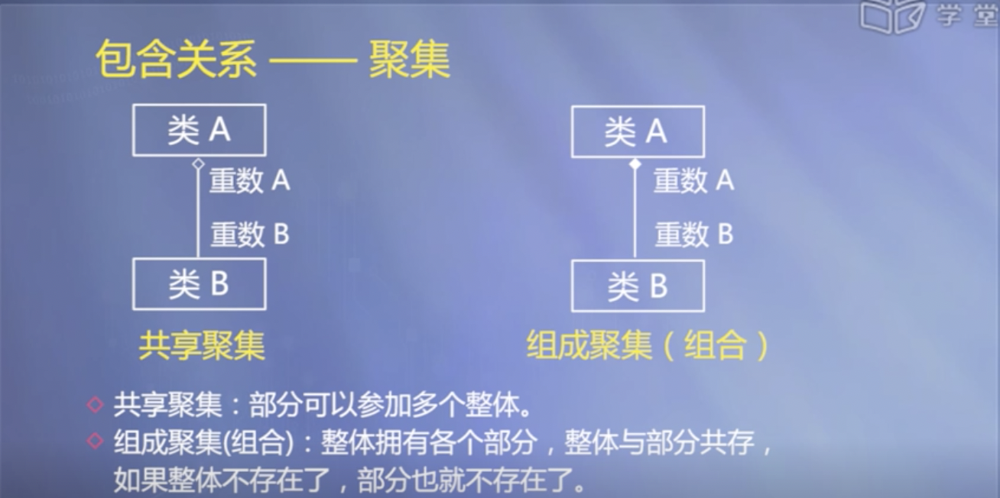
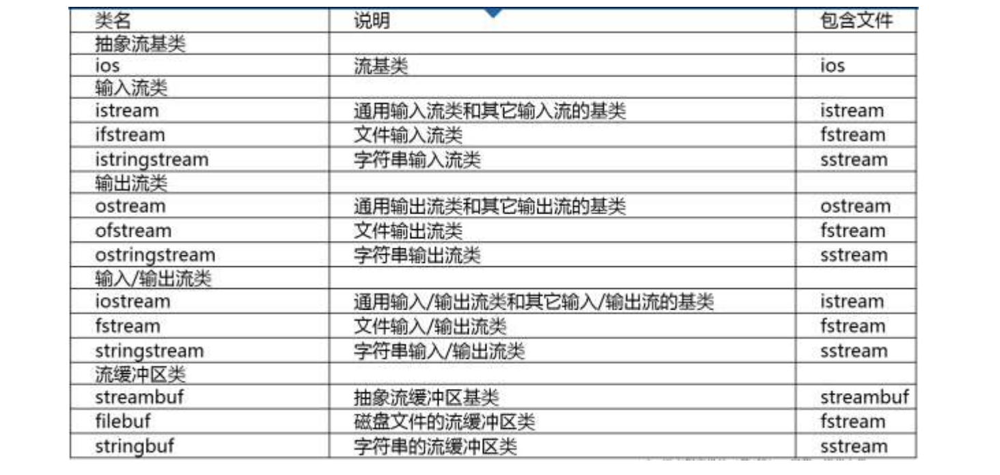

# Summary

C++是一门机器语言、汇编语言之上的高级语言，从C语言发展演变而来，支持面向过程、面向对象和泛型编程方式。
C++包括基本数据类型（字符、整型、浮点数、布尔）、常量、变量、运算符、表达式、自定义类型、复杂数据类型（数组、指针、字符串）；函数、类、泛型、IO库和STL库等。
C++有四种类型转换操作符：const_cast、static_cast、dynamic_cast、reinterpret_cast。
C++特殊函数：内联函数、constexpr函数等
C++11的智能指针：unique_ptr、shared_ptr、weak_ptr
C++面向对象

- 抽象：对同一类对象的共同属性（数据）和行为（函数）进行概括，形成类。
- 封装：将抽象出的数据、代码封装在一起，形成类。
  - 目的：增强安全性和简化编程，使用者不必了解具体的实现細节，而只需要通过外部接口。
- 继承：在已有类的基础上，进行扩展形成新的类。
- 多态：同一名称，不同的功能实现方式。——重载函数和虛函数

C++类
- 如何设计一个类？
  - 此类型的“合法值”是什么？
  - 此类型应该有什么样的函数和操作符？
  - 新类型的对象该如何被创建和销毁？
  - 如何进行对象的初始化和赋值？
  - 对象作为函数的参数如何以值传递？
  - 谁将使用此类型的对象成员？
- C++类主要包括：成员函数、数据成员、构造函数（包括委托构造、复制构造、移动构造等）、析构函数
- 特殊形态的类
  - 结构体：定义主要用来保存数据、而没有什么操作的类型
  - 联合体：与结构体差不多，主要目的是存储空间的共用。
  - 枚举类：C++枚举类型实际上是整数的一个子集，C++11提供的枚举类，是一种强类型枚举（强作用域、转换限制、可以指定底层类型）。
- 数据的共享与保护
  - 不同位置（函数体、类体）定义的变量和对象，其作用域、可见性、生存期都不同。
  - 在同一个类的所有对象之间共享数据：静态数据成员、静态成员函数
  - 访问类的私有成员：接口函数（开销比较大）、友元函数（有安全隐患）
  - 通过const关键字，限制对共享数据的修改
- 派生类
  - 构成：吸收基类成员、改造基类成员、添加新的成员
  - 继承方式：不同继承方式的影响主要体现在派生类成员对基类成员的访问权限，分别是public、proteced、private
  - 构造函数：默认不继承基类的构造函数（可用using语句继承）
  - 析构函数：析构函数不被继承，系统会自动隐式调用基类的析构函数；先执行派生类析构函数的函数体，再调用基类的析构函数。
  - 虚基类：解决多继承时可能发生的对同一基类继承多次而产生的二义性问题。提供唯一的基类成员，而不重复产生多次复制。`class B1:virtual public B`

C++多态
- 编译时的多态：函数重载
- 运行时的多态：虚函数和动态绑定，实现原理是在虚表（virtual table）中保存各个虚函数的入口地址
- 抽象类和纯虚函数：没有定义具体的操作内容，要求各派生类定义。为抽象和设计的目的而声明。

函数模板与类模版：通用模版，支持处理不同的的数据类型
STL：提供了一些非常常用的数据结构和算法，包括容器、迭代器、函数对象、算法。
- 顺序容器：vector、deque、list、array，以及容器适配器stack、queue、priority_queue
- 关联容器：根据键(key)高效地查找元素
  - 无序关联容器：unordered_set 、 unordered_map 、 unordered_multiset 、 unordered_multimap，实现为哈希表。
  - 有序关联容器：set/map/multiset/multimap，实现为红黑树
  - multiset、multimap允许重复value元素
- 函数对象：普通函数以及重载了“()”运算符的类的实例，主要有用于算术运算、关系运算、逻辑运算的函数对象。
- 函数适配器：绑定适配器、组合适配器、函数指针适配器、成员函数适配器
- 算法：不可变序列算法、可变序列算法、排序和搜索算法、数值算法

流类库
- 输入流：istream、ifstream、istringstream
- 输出流：ostream、ofstream、ostringstream
- 输出输出流：iostream、fstream、stringstream

异常处理机制：try-catch-throw

# 第一章 绪论

计算机语言的级别：

- 机器语言
- 汇编语言
- 高级语言

C++支持的程序设计方法

- 面向过程
- 面向对象
- 泛型

C++程序的开发过程

- 程序设计
- 源代码编写
- 编译
- 连接
- 运行调试

信息在计算机中的表示与存储

- 计算机中的数据用二进制表示；
- 逻辑数据、字符数据用二进制编码表示。

计算机指令系统

- 机器硬件能够识别的语言（机器语言）(0和1组成的指令）的集合
- 它是软件和硬件的主要界面

计算机程序

- 指令的序列；
- 描述解决问题的方法和数据。


面向过程的程序设计方法：

- 机器语言、汇编语言、高级语言都支持；
- 最初的目的：用于数学计算；
- 主要工作：设计求解问题的过程。
- 大型复杂的软件难以用面向过程的方式编写

面向对象的程序设计方法：

- 由面向对象的高级语言支持；
- 一个系统由对象构成；
-  对象之间通过消息进行通信。

## **面向对象的基本概念**

抽象、封装、继承、多态。

对象

-  一般意义上的对象：现实世界中实际存在的事物。
- 面向对象方法中的对象：程序中用来描述客观事物的实体。

抽象与分类

- 分类依据的原则——抽象；
- 抽象出同一类对象的共同属性和行为形成类；
- 类与对象是类型与实例的关系。

封装

- 隐蔽对象的内部细节；
- 对外形成一个边界；
- 只保留有限的对外接口；
- 使用方便、安全性好。

继承

- 意义在于软件复用；
- 改造、扩展已有类形成新的类。

多态

- 同样的消息作用在不同对象上，可以引起不同的行为。

## **程序的开发过程**

程序

- 源程序：用源语言写的，有待翻译的程序；
- 目标程序：源程序通过翻译程序加工以后生成的机器语言程序；
- 可执行程序：连接目标程序以及库中的某些文件，生成的一个可执行文件；例如：Windows系统平台上的.EXE文件。

三种不同类型的翻译程序

-  汇编程序： 将汇编语言源程序翻译成目标程序；
-  编译程序：将高级语言源程序翻译成目标程序；
-  解释程序：将高级语言源程序翻译成机器指令，边翻译边执行。

C++程序的开发过程

-  算法与数据结构设计；
-  源程序编辑；
-  编译；
-  连接；
-  测试；
-  调试。

## **计算机中的信息与存储单位**

计算机的基本功能

- 算术运算；
- 逻辑运算。

计算机中信息：

- 控制信息——指挥计算机操作；
- 数据信息——计算机程序加工的对象。


信息的存储单位

- 位(bit，b)：数据的最小单位，表示一位二进制信息；
- 字节(byte，B)：八位二进制数字组成(1 byte = 8 bit)；
- 千字节  1 KB = 1024 B；
- 兆字节  1 MB = 1024 K；
- 吉字节  1 GB = 1024 M。

**计算机的数字系统**

计算机电路可以稳定的表现2种状态，所以计算机的数字系统是二进制。

### **数据的编码表示**

**二进制数的编码表示**

负数：用补码

- 0的表示唯一；
- 符号位可作为数值参加运算；
- 补码运算的结果仍为补码。

**实数的浮点表示**

计算机中通常采用浮点方式表示小数；实数 N 用浮点形式可表示为： N=M×2^E

**字符在计算机中的表示**

字符在计算机中是通过编码表示的；例如：ASCII码是一种常用的西文字符编码：用7位二进制数表示一个字符，最多可以表示27=128个字符；《GB 18030-2005 信息技术 中文编码字符集》是中国国家标准。

# 第二章 C++简单程序设计

本章主要内容

- C++语言概述
  - 起源、基本概念和基本语法
- 算法的流程控制

## C++的产生和发展

- 从C语言发展演变而来，最初被称为 “带类的C”
- 1983年正式取名为C++
- 1998年11月被国际标准化组织(ISO）批准为国际标准
- 2003年10月15日发布第2版C++标准ISO/EC 14882:2003
- 2011年8月12日1SO公布了第三版C++标准C++11，包含核心语言的新机能、扩展C＋＋标准程序库
- 2014年8月18日1SO公布了C++14，C++14作为C++11的一个小扩展，主要提供漏洞修复和小的政进

C++能够处理的基本数据类型：整数类型；浮点数类型；字符类型；布尔类型。

## 基本数据类型、常量、变量

ISO C++标准并没有明确规定每种数据类型的字节数和取值范围，它只是规定它们之间的字节数大小顺序满足：

(signed/unsigned)signed char ≤(unsigned) short int ≤(unsigned) int ≤(unsigned) long int ≤ long long int

**字符类型**（char）：容纳单个字符的编码；<u>实质上存储的也是整数</u>。即ASCII code，比如数字 65 对应大写字母 A，66 对应大写字母 B

**字符串类型:**

1. 采用字符数组存储字符串（C风格的字符串）
2. 标准C++类库中的String类（C++风格的字符串）

**常量**：在程序运行的整个过程中其值始终不可改变的量；例如：12，3.5，'A'都是常量。

**变量**：在程序的运行过程中，其值可变的量

C++语言中提供了多种初始化方式；

``` c++
int a = 0;
int a(0);
int a = {0};
int a{0};
```

<u>其中使用大括号的初始化方式称为列表初始化，列表初始化时不允许信息的丢失。</u>例如用double值初始化int变量，就会造成数据丢失。

**符号常量** `const float PI = 3.1415926；`

## 运算与表达式

**逗号运算**：先求解表达式1，再求解表达式2。a = 3 * 5 , a * 4  最终结果为60

**关系运算与关系表达式**


**逻辑运算与逻辑表达式**


**条件运算符**优先级高于赋值运算符，低于逻辑运算符


**sizeof运算**:“类型名”所指定的类型，或“表达式”的结果类型所占的字节数。`sizeof(short)/sizeof(x)`

**位运算**:<u>高级语言一般以字节作为数据单位，机器语言以位来处理信息</u>。C语言比较接近机器语言，有位运算。C++也继承了这一特性。


**移位**：左移、右移


<u>移位并不是作为高效率的乘、除法使用，大多数的时候，是我们在变量里面存储了一些标记。有些运算的时候，需要把标记移一下位置。</u>

> 移位与乘除法 https://blog.csdn.net/newbird105/article/details/45332621

## 类型转换

一些二元运算符（算术运算符、关系运算符、逻辑运算符、位运算符和赋值运算符）要求两个操作数的类型一致。在算术运算和关系运算中如果参与运算的操作数类型不一致，编译系统会自动对数据进行转换（即隐含转换），<u>基本原则是将低类型数据转换为高类型数据。</u>


**显式转换**

语法形式

- 类型说明符(表达式)

-  (类型说明符)表达式

- 类型转换操作符<类型说明符>(表达式)

  类型转换操作符可以是：const_cast、static_cast、dynamic_cast、reinterpret_cast

> C++四种类型转换运算符：http://c.biancheng.net/cpp/biancheng/view/3297.html

例：`int(z), (int)z, static_cast<int>(z) `三种完全等价

## 数据的输入和输出

**I/O流**：在C++中，<u>将数据从一个对象到另一个对象的流动抽象为“流”</u>。<u>流在使用前要被建立，使用后要被删除</u>。数据的输入与输出是通过I/O流来实现的，cin和cout是预定义的流类对象。cin用来处理标准输入，即键盘输入。cout用来处理标准输出，即屏幕输出。从流中获取数据的操作称为提取操作，向流中添加数据的操作称为插入操作。

**预定义的插入符和提取符：**

- <<”是预定义的插入符，作用在流类对象cout上便可以实现项标准输出设备输出。

  cout << 表达式 << 表达式...

- 标准输入是将提取符作用在流类对象cin上。

  cin >> 表达式 >> 表达式...

- 提取符可以连续写多个，每个后面跟一个表达式，该表达式通常是用于存放输入值的变量。例如：

  cin >> a >> b;

**常用的I/O流类库操纵符**


## 自定义类型

**类型别名**

C：typedef

C++：using

- typedef 已有类型名 新类型名表
- using 新类型名 = 己有类型名

例：

`using Area = double`

`using Volume = double`

**枚举类型**：enum

- 不限定作用域的枚举类型
- 限定作用域枚举类型

**auto类型与decltype类型**

- auto：编译器通过初始值自动推断变量的类型
- decltype：定义一个变量与某一表达式的类型相同,但并不用该表达式初始化变量

例如：`decltype(i) j=2`表示j以2作为初始值，类型与i一致

# 第三章 函数

主要内容

- 函数的声明和调用、函数间的参数传递、内联函数、带默认参数值的函数、函数重载、C++系统函数

## 函数调用

调用函数需要先声明函数原型。

- <u>若函数定义在调用点之前，可以不另外声明；</u>

- <u>若函数定义在调用点之后，必须要在调用函数前声明函数原型：</u>

**函数原型**：类型标识符 被调用函数名（含类型说明的形参表）

**嵌套与递归**

嵌套调用能回到调用点是因为使用栈保存了返回地址。

## 函数的参数传递

- 在函数被调用时才分配形参的存储单元
- 实参可以是常量、变量或表达式
- 实参类型必须与形参相符
- 值传递是传递参数值 ，即单向传递
- 引用传递可以实现双向传递
- 常引用作参数可以保障实参数据的安全

传引用比传对象占据更小的内存和开销

**引用类型**

- 引用(＆)是标识符的别名
- 定义一个引用时，必须同时对它进行初始化，使它指向一个已存在的对象
- 一旦一个引用被初始化后，就不能改为指向其它对象
- 引用可以作为形参

引用作为形参时，只有调用函数时才对引用初始化，所以直接用对象作为实参即可。

## **含有可变参数的函数**

C++标准中提供了两种主要的方法

- 如果所有的实参类型相同，可以传递一个名为initializer_list的标准库类型

- 如果实参的类型不同，我们可以编写可变参数的模板（第9章）

**initializer_list**

initializer_list是一种标准库类型，用于表示某种特定类型的值的数组

该类型定义在同名的头文件中

## **内联函数**

- 声明时使用关键字 inline。
- 编译时在调用处用函数体进行替换，节省了参数传递、控制转移等开销。

注意：

- 内联函数体内不能有循环语句和switch语句；
- 内联函数的定义必须出现在内联函数第一次被调用之前；
- 对内联函数不能进行异常接口声明。

## **constexpr函数**

constexpr 函数是在使用需要它的代码时，可以在编译时计算其返回值的函数。当其参数为 constexpr 值并且在编译时使用代码需要返回值时（例如，初始化一个 constexpr 变量或提供一个非类型模板参数），它会生成编译时常量。

> C++11/14 constexpr 用法 https://www.jianshu.com/p/34a2a79ea947

## **函数重载**

C++允许功能相近的函数在相同的作用域内以相同函数名声明，从而形成重载。方便使用，便于记忆。

# 第四章 类与对象

主要内容

- 面向对象的基本概念
- 类和对象的声明
- 构造函数
- 析构函数
- 内联成员函数
- 复制构造函数
- 类的组合
- 结构体
- 联合体
- 枚举类
- UML

## 面向对象程序的基本特点

### 抽象

- 对同一类对象的共同属性和行为进行概括，形成类。
- 先注意问题的本质及描述，其次是实现过程或細节。
- 数据抽象：描述某类对象的属性或状态（对象相互区别的物理量）。
- 代码抽象：描述某类对象的共有的行为特征或具有的功能。
- 抽象的实现：类。

抽象实例—钟表

- 数据抽象：
   int hour, int minute,int second

- 代码抽象：
   setTime(),showTime()

```c++
class Clock {
public:
void setTime(int newH, int newM, int newS);
void showTime();
private:
int hour, minute, second;
};
```

### 封装

- 将抽象出的数据、代码封装在一起，形成类。
- 目的：增强安全性和简化编程，使用者不必了解具体的实现細节，而只需要通过外部接口。以特定的访问权限来使用类的成员。

- 实现封装：类声明中的{}

例：
 ``` c++
 class Clock {
  public: 
   void setTime(int newH, int newM, int newS);
  	void showTime();
  private: 
   int hour, minute, second;
 };
 ```


### 继承

- 在已有类的基础上，进行扩展形成新的类。
- 详见第7童

### 多态

- 多态：同一名称，不同的功能实现方式。
- 目的：达到行为标识统一，减少程序中标识符的个数。
- 实现：重载函数和虛函数——见第8章

## 类和对象

**类和对象的定义**

- 对象是现实中的对象在程序中的模拟。
- 类是同一类对象的抽象，对象是类的某一特定实体。
- 定义类的对象，才可以通过对象使用类中定义的功能。

<u>**设计类就是设计类型**</u>

- 此类型的“合法值”是什么？
- 此类型应该有什么样的函数和操作符？
- 新类型的对象该如何被创建和销毁？
- 如何进行对象的初始化和赋值？
- 对象作为函数的参数如何以值传递？
- 谁将使用此类型的对象成员？

**类定义的语法形式**

``` c++
class 类名称
{ 
  public:
  	公有成员（外部接口）
  private:
		私有成员
	protected:
		保护型成员
};
```

### 类内初始值

（注意：类内初始化是c++11的新特性，vs2012不支持该设定，请注意编译器版本）

- 可以为数据成员提供一个类内初始值
- 在创建对象时，类内初始值用于初始化数据成员
- 没有初始值的成员将被默认初始化。
- 类内初始值举例

``` c++
class Clock {
 public: 
  void setTime(int newH, int newM, int newS);
 	void showTime();
 private: 
  int hour = 0, minute = 0, second = 0;
};
```

### **类的成员函数**

- 在类中说明函数原型；
- 可以在类外给出函数体实现，并在函数名前使用类名加以限定；
- 也可以直接在类中给出函数体，形成内联成员函数;
- 允许声明重载函数和带默认参数值的函数。

### 内联成员函数

- 为了提高运行时的效率，对于较简单的函数可以声明为内联形式。
- 内联函数体中不要有复杂结构（如循环语句和switch语句）。
- 在类中声明内联成员函数的方式：
  - 将函数体放在类的声明中。
  - 使用inline关键字。


### 构造函数

构造函数的作用：在对象创建时使用特定的值构造对象，将对象初始化为一个特定的初始状态。

构造函数的形式

- 函数名与类名相同；
- 不能定义返回值类型，也不能有return语句;
- 可以有形式参数，也可以没有形式参数；
- 可以是内联函数；
- 可以重载：
- 可以带默认参数值。

> 构造函数、析构函数语法上可以声明为内联函数，但没有意义，因为编译器不会实际内联。
>
> 如果虚函数在编译器就能够决定将要调用哪个函数时，就能够内联。在运行期才确定，就不能内联。什么情况下编译器可以确定要调用哪个函数呢，答案是当用对象调用虚函数时，就内联展开。
>
> https://www.cnblogs.com/helloweworld/archive/2013/06/14/3136705.html

构造函数在对象创建时自动调用

**默认构造函数**

- 调用时可以不需要实参的构造函数
  - 参数表为空的构造函数
  - 全部参数都有默认值的构造函数
- 下面两个都是默认构造函数，如在类中同时出现，将产生编译错误：
   Clock();
   Clock(int newH=0, int newM=0,int newS=0);

**"=default"**

- 如果程序中已定义构造函数，默认情况下编译器就不再隐含生成默认构造函数。如果此时依然希望编译器隐含生成默认构造函数，可以使用 “= default”


### 委托构造函数

委托构造函数使用类的其他构造函数执行初始化过程

例如：

``` c++
Clock(int newH, int newM, int newS): hour(newH), minute(newM), second(newS){
}
Clock(): Clock(0, 0, 0) {}
```

### 复制构造函数

复制构造函数是一种特殊的构造函数，其形参为本类的对象引用。作用是用一个已存在的对象去初始化同类型的新对象。

> 如果拷贝构造函数中的参数不是一个引用，那么就相当于采用了传值的方式(pass-by-value)，而传值的方式会调用该类的拷贝构造函数，从而造成无穷递归地调用拷贝构造函数。

编译器会生成默认的复制构造函数


**复制构造函数被调用的三种情况**

- 定义一个对象时，以本类另一个对象作为初始值，发生复制构造
- 如果函数的形参是类的对象，调用函数时，将使用实参对象初始化形参对象，发生复制构造；
- 如果函数的返回值是类的对象，函数执行完成返回主调函数时，将使用return语句中的对象初始化一个临时无名对象，传递给主调函数，此时发生复制构造。
- 这种情况也可以通过移动构造避免不必要的复制（第6章介绍）

**隐含的复制构造函数**

- 如果程序员没有为类声明拷贝初始化构造函数，则编译器自己生成一个隐含的复制构造函数。
- 这个构造函数执行的功能是：用初始值对象的每个数据成员，初始化将要建立的对象的对应数据成员。

**"=delete"**

如果不希望对象被复制构造

- C++11做法：用"=delete〞指示编泽器不生成默认复制构造函数。


### 析构函数

- 完成对象被删除前的一些清理工作。
- <u>在对象的生存期结束的时刻系统自动调用它，然后再释放此对象所属的空间。</u>
- 如果程序中未声明析构函数，编译器将自动产生一个默认的析构函数，其函数体为空。
- 析构函数的原型 `~类名();`
- 析构函数没有参数，没有返回类型


## 类的组合

类中的成员是另一个类的对象。可以在已有抽象的基础上实现更复杂的抽象。

类组合的构造函数设计:<u>不仅要负责对本类中的基本类型成员数据初始化，也要对对象成员初始化。</u>


**构造组合类对象时的初始化次序**

- 首先对构造函数初始化列表中列出的成员（包括基本类型成员和对象成员）进行初始化，初始化次序是成员在类体中定义的次序。
  - 成员对象构造函数调用顺序：按对象成员的定义顺序，先声明者先构造。
  - 初始化列表中末出现的成员对象，调用默认构造函数（即无形参的）初始化
- 处理完初始化列表之后，再执行构造函数的函数体。

### **前向引用声明**

解决两个类互相引用的情况

- 类应该先声明，后使用
- 如果需要在某个类的声明之前，引1用该类，则应进行前向引用声明。
- 前向引用声明只为程序引入一个标识符，但具体声明在其他地方。

例：


**前向引用声明注意事项**

- 使用前向引用声明星然可以解决一些问题，但它并不是万能的。
- 在提供一个完整的类声明之前，不能声明该类的对象，也不能在内联成员函数中使用该类的对象。
- 当使用前向引用声明时，只能使用被声明的符号，而不能涉及类的任何细节。

例


## UML简介

- 事物（Things）
- 关系（Relationships）
- 图（Diagrams）





## 结构体与联合体

- 结构体是一种特殊形态的类

- 与类的唯一区别：类的缺省访问权限是private，结构体的缺省访问权限是public

- 结构体中可以有数据成员和函数成员

- <u>结构体存在的主要原因：与C语言保持兼容</u>

- 什么时候用结构体而不用类

	- 定义主要用来保存数据、而没有什么操作的类型
  - <u>人们习惯将结构体的数据成员设为公有，因此这时用结构体更方便</u>

``` c++
struct 结构体名称 {
     公有成员
   protected:
     保护型成员
   private:
     私有成员
};
```

**结构体的初始化**

如果一个结构体的全部数据成员都是公共成员，并且没有用户定义的构造函数，没有基类和虚函数（基类和虚函数将在后面的章节中介绍），这个结构体的变量可以用下面的语法形式赋初值

`类型名 变量名 = { 成员数据1初值, 成员数据2初值, …… };`

**联合体**与结构体差不多，<u>主要目的是存储空间的共用。</u>

``` c++
union 联合体名称 {
     公有成员
   protected:
     保护型成员
   private:
     私有成员
};
```

- 成员共用同一组内存单元
- 任何两个成员不会同时有效

联合体的内存分配


无名联合：

``` c++
union {
 int i;
 float f;
}
```

在程序中可以这样使用：

```  
i = 10;

f = 2.2;
```

**枚举类**

与第二章中的枚举类型的区别：<u>枚举类型可以隐含转换为整数类型，实际上是整数的一个子集</u>。C++11提供的枚举类，<u>是一种强类型枚举。</u>

``` c++
enum class 枚举类型名: 底层类型 {枚举值列表};

enum class Type { General, Light, Medium, Heavy}; // 未定义类型则为int类型

enum class Type: char { General, Light, Medium, Heavy}; // 指定为char类型

enum class Category { General=1, Pistol, MachineGun, Cannon}; // 指定默认值
```

<u>枚举类的优点：</u>

- 强作用域

  作用域限制在枚举类中，比如：Type::General。避免重名问题。

- 转换限制

  不可以隐含转换为整数类型

- 可以指定底层类型

# 第五章 数据的共享与保护

**问题1**：变量和对象可以定义在不同的位置：函数体内、类体内、函数原型参数表内、所有函数和类之外，使用的时候分别有什么不同、访问和共享有什么限制呢？

不同位置定义的变量和对象，其作用域、可见性、生存期都不同。如果要在不同的程序模块间共享数据，就需要了解变量和对象的作用域、可见性、生存期。

**问题2**：如何在同一个类的所有对象之间共享数据？比如需要记录一个类的对象总数。

- 定义属于整个类而不是对象的数据成员——静态数据成员
- 定义用于处理静态数据成员的函数——静态成员函数

**问题3**：类的私有成员在类外不能直接访问，这是为了保护数据的安全性和隐藏细节。但是<u>需要频繁访问私有数据时，调用接口函数的开销比较大。</u>

- 对一些类外的函数、其他的类，给预授权，使之可以访问类的私有成员
- <u>提高了效率，但是带来一些安全隐患，需要权衡、慎用</u>

**问题4**：共享数据的安全性如何保证

- 通过const关键字，限制对共享数据的修改，使共享的数据在被共享时，是只读的。
- 在编译之前，需要进行预处理，例如包含头文件，选择在不同情况下编译程序的不同部分

**问题5**：当程序的规模略大些的时候，就不能将所有代码放在一个文件里了

多文件结构


主要内容

- 标识符的作用域与可见性
- 对象的生存期
- 类的静态成员
- 类的友元
- 共享数据的保护
- 多文件结构和编译预处理命令

## 标识符的作用域与可见性

作用域是一个标识符在程序正文中有效的区域。

- 函数原型作用域

  函数原型中的参数，其作用域始于"("，结束于")"。如：double area(double radius);

- 局部作用域

  函数的形参、在块中声明的标识符；其作用域自声明处起，限于块中。

- 类作用域

  类的成员具有类作用域，其范围包括类体和非内联成员函数的函数体。

  如果在类作用域以外访问类的成员，要通过类名（访问静态成员），或者该类的对象名、对象引用、对象指针（访问非静态成员）。

- 文件作用域

  不在前述各个作用域中出现的声明，就具有文件作用域，这样声明的标识符其作用域开始于声明点，结束于文件尾。

- 命名空间作用域


可见性

- 如果某个标识符在外层中声明，且在内层中没有同一标识符的声明，则该标识符在内层可见。
- 对于两个嵌套的作用域，如果在内层作用域内声明了与外层作用域中同名的标识符，则外层作用域的标识符
   在内层不可见。

## 对象的生存期

对象产生开始，到结束的时期。在对象生存期内，对象一直保持它的值，直到被更新。

**静态生存期**

- 这种生存期与程序的运行期相同。
- 在文件作用域中声明的对象具有这种生存期。
- 在函数内部声明静态生存期对象，要冠以关键字static 。

**动态生存期**

- 块作用域中声明的，没有用static修饰的对象是动态生存期的对象（习惯称局部生存期对象）。
- 开始于程序执行到声明点时，结束于命名该标识符的作用域结束处。

## 类的静态成员

静态数据成员

- 用关键字static声明
- 为该类的所有数据共享，具有静态生存期
- <u>必须在类外定义和初始化</u>

静态函数成员

- 类外代码可以使用类名+作用域操作符(::)来调用
- <u>主要用于处理静态数据成员</u>，可以直接调用静态数据成员
- 如果访问非静态成员，需要通过对象来访问


## static关键字

static关键字可以用于修饰局部变量，函数，类的数据成员以及对象。

- 静态局部变量只初始化一次，然后在每次函数调用时都保持它的值。
- 静态成员函数可以直接用类来调用，不需要创建对象来调用。
- 静态对象

```c++
Test t;             // 栈上的对象
static Test t1;     // 静态对象
```

第一个表达式会在栈上分配一个对象，也被称为自动对象或局部对象。局部对象在每次声明它时就会创建。
而静态对象只初始化一次，并且在整个程序的生命周期中都存在。

静态对象保存在静态存储区。在程序结束时，它就会被销毁。C++既支持局部静态对象，也支持全局静态对象。

## 类的友元

友元是C++提供的一种破坏数据封装和数据隐藏的机制。通过将一个模块声明为另一个模块的友元，一个模块能够引用到另一个模块中本是被隐藏的信息。

可以使用友元函数和友元类。

为了确保数据的完整性，及数据封装与隐藏的原则，建议尽量不使用或少使用友元。

### 友元函数

友元函数是在类声明中由关键字friend修饰说明的非成员函数，<u>在它的函数体中能够通过对象名访问 private 和 protected成员</u>

作用：增加灵活性，使程序员可以在封装和快速性方面做合理选择。

访问对象中的成员必须通过对象名。

### 友元类

若一个类为另一个类的友元，<u>则此类的所有成员都能访问对方类的私有成员。</u>

如果声明B类是A类的友元，B类的成员函数就可以访问A类的私有和保护数据，但A类的成员函数却不能访问B类的私有、保护数据。

共享数据的保护

- 对于既需要共享、又需要防止改变的数据应该声明为常类型（用const进行修饰）。
- 对于不改变对象状态的成员函数应该声明为常函数。

### 常类型

1. 常对象：必须进行初始化,不能被更新。`const 类名 对象名`
2. 常成员，用const进行修饰的类成员：常数据成员和常函数成员
3. 常引用：被引用的对象不能被更新。
4. 常数组：数组元素不能被更新(详见第6章)。
5. 常指针：指向常量的指针(详见第6章)。

通过常对象只能调用它的常成员函数。

常成员函数不能修改对象的内容。const其实是修饰*this指针。

## 多文件结构和预编译命令

**C+＋程序的一般组织结构**

一个工程可以划分为多个源文件，例如：

- 类声明文件（.h文件）
- 类实现文件（.cpp文件）
- 类的使用文件（main()所在的.cpp文件）

利用工程来组合各个文件。


**外部变量**：除了在定义它的源文件中使用之外，还可以被其他文件使用；文件作用域中定义的变量，默认情况都是外部变量。<u>在其他文件中如果需要使用，需要用extern关键字修饰。</u>

**外部函数**可以不加extern，只要在调用之前进行引用性声明即可。

### 置名的命名空间

将变量和函数限制在当前的编译单元（编译单元指一个cpp文件）：

使用置名的命名空间：在置名命名空间中定义的变量和函数，都不会暴露给其它的编译单元。


### 标准C++库

标准C++类库是一个极为灵活并可扩展的可重用软件模块的集合。标准C＋＋类与组件在逻辑上分为6种类型：

- 输入/输出类
- 容器类与抽象数据类型
- 存储管理类
- 算法
- 错误处理
- 运行环境支持


### 编译预处理

- #include 包含指令：将一个源文件嵌入到当前源文件中该点处。
  - #include <文件名＞：按标准方式搜索，文件位于C++系统目录的include子目录下
  - #include"文件名”：首先在当前目录中搜索，若没有，再按标准方式搜索。

- #define 宏定义指令
  - 定义符号常量，很多情况下已被const定义语句取代。
  - 定义带参数宏，已被内联函数取代。

- #undef：删除由#define定义的宏，使之不再起作用。

条件编译指令#if 和 #endif


# 第六章 数组、指针与字符串

- 数组
- 指针
- 动态存储分配
- 指针与数组
- 指针与函数
- 对象的复制与移动
- 字符串


## 数组

数组是具有一定顺序关系的若干相同类型变量的集合体，组成数组的变量称为该数组的元素。


数组元素在内存中顺次存放，它们的地址是连续的。元素间物理地址上的相邻，对应着逻辑次序上的相邻。


**一维数组的初始化**


注意：

- 如果不作任何初始化，内部auto型数组中会存在垃圾数据，static数组中的数据默认初始化为0；
- 如果只对部分元素初始化，剩下的未显式初始化的元素，将自动被初始化为零；

**数组作为函数参数：**

- 数组元素作实参，与单个变量一样。
- 数组名作参数，形、实参数都应是数组名（实质上是地址，关于地址洋见6.2） ，类型要一样，传送的是数组首地址。对形参数组的改变会直接影响到实参数组。


**对象数组**

同类型的对象组成的数组。

初始化：

- 数组中每一个元素对象被创建时，系统都会调用类构造函数初始化该对象。
- 通过初始化列表赋值。例：`Point a[2]={Point(1,2),Point(3,4)};`
- 如果没有为数组元素指定显式初始值，数组元素便使用默认值初始化（调用默认构造函数）。


## 指针的概念、定义和指针运算

内存空间的访问方式

- 通过变量名访问
- 通过地址访问

变量名与内存空间绑定。

### 指针的概念

- 指针：内存地址，用于间接访问内存单元
- 指针变量：用于存放地址的变量


**指针的初始化**

`存储类型 数据类型 *指针名 = 初始地址；`

指针的数据类型决定你将指针的地址+1时前进几个字节。

`int *pa = &a;`

- 用变量地址作为初值时，该变量必须在指针初始化之前已声明过，且变量类型应与指针类型一致。
- 可以用一个已有合法值的指针去初始化另一个指针变量。
- 不要用一个内部非静态变量去初始化 static 指针。

**指针的赋值**

`指针名=地址`

- 向指针变量赋的值必须是地址常量或变量，不能是普通整数
- <u>例外：整数0可以赋给指针，表示空指针。</u>
- 允许定义或声明指向 void 类型的指针。该指针可以被赋予任何类型对象的地址。void *general;

**指针空值nullptr**

- 以往用0或者NULL去表达空指针的问题：C/C++的NULL宏是个被有很多潜在BUG的宏。因为有的库把其定义成整数0，有的定义成 (void*)0。在C的时代还好。但是在C++的时代，这就会引发很多问题。
- C++11使用nullptr关键字，是表达更准确，类型安全的空指针

**指向常量的指针**

不能通过指向常量的指针改变所指对象的值，但指针本身可以改变，可以指向另外的对象。


**指针类型的常量**

若声明指针常量，则指针本身的值不能被改变。

**指针的算术运算、关系运算**


**以指针作为函数参数**

为什么需要用指针做参数？

- 需要数据双向传递时（引用也可以达到此效果）
  用指针作为函数的参数，可以使被调函数通过形参指针存取主调函数中实参指针指向的数据，实现数据的双向传递
- 需要传递一组数据，只传首地址运行效率比较高
  实参是数组名时形参可以是指针


**指针类型的函数**

若函数的返回值是指针，该函数就是指针类型的函数。

- 不要将非静态局部地址用作函数的返回值
  错误的例子：在子函数中定义局部变量后将其地址返回给主函数，就是非法地址
- 返回的指针要确保在主调函数中是有效、合法的地址
  - 主函数中定义的数组，在子函数中对该数组元素进行某种操作后，返回其中一个元素的地址，这就是合法有效的地址
  - 在子函数中通过动态内存分配new操作取得的内存地址返回给主函数是合法有效的，但是内存分配和释放不在同一级别，要注意不能忘记释放，避免内存泄漏

**对象指针**

`类名 *对象指针名；`

**this指针**

- 指向当前对象自己
- 隐含于类的每一个非静态成员函数中。
- 指出成员函数所操作的对象。
当通过一个对象调用成员函数时，系统先将该对象的地址赋给this指针，然后调用成员函数，成员函数对对象的数据成员进行操作时，就隐含使用了this指针。

### 动态分配与释放内存

在程序运行时才分配内存。

动态申请内存操作符 **new**：在程序执行期间，<u>申请用于存放T类型对象的内存空间，并依初值列表赋以初值。</u>

`new 类型名T（初始化参数列表）`

结果值：成功：T类型的指针，指向新分配的内存；失败：抛出异常。

释放内存操作符**delete**：释放指针p所指向的内存。p必须是new操作的返回值。(不是删除指针对象）

`delete 指针p`

**分配和释放动态数组**

分配：`new 类型名T [ 数组长度 ] // 数组长度可以是任何表达式，在运行时计算`

释放：`delete[] 数组名p // 释放指针p所指向的数组。p必须是用new分配得到的数组首地址。如果不加[]则只释放首元素地址。`

**动态创建多维数组**

`new 类型名T[第1维长度][第2维长度]…；`

如果内存申请成功，new运算返回一个指向新分配内存首地址的指针。是指向数组的指针。


### 智能指针

显式管理内存在性能上有优势，但容易出错。C++11提供智能指针的数据类型，对垃圾回收技术提供了一些支持，实现一定程度的内存管理.

C++11的智能指针

- unique_ptr ：不允许多个指针共享资源，可以用标准库中的move函数转移指针。转移后原来的指针失效
- shared_ptr ：多个指针共享资源
- weak_ptr ：可复制shared_ptr，但其构造或者释放对资源不产生影响

> 参考智能指针：http://c.biancheng.net/view/7898.html

### vector对象

- 封装任何类型的动态数组，自动创建和删除。
- 数组下标越界检查。

`vector<int> arr(5)`

vector数组对象名不表示数组首地址

**对象复制与移动**

- 浅层复制：实现对象间数据元素的一一对应复制。
- 深层复制：当被复制的对象数据成员是指针类型时，不是复制该指针成员本身，而是将指针所指对象进行复制。

### 移动构造

C++11标准中提供了一种新的构造方法——移动构造。

C++11之前，如果要将源对象的状态转移到目标对象只能通过复制。在某些情况下，我们没有必要复制对象——只需要移动它们。

**移动语义**：源对象资源的控制权全部交给目标对象

当临时对象在被复制后，就不再被利用了。我们完全可以把临时对象的资源直接移动，这样就避免了多余的复

制操作。


<u>什么时候该触发移动构造？有可被利用的临时对象</u>

`class_name ( class_name && )`

众所周知，当类的对象作为函数返回值的时候，函数会调用类的复制构造函数或移动构造函数，来构造一个临时无名对象返回主函数中。<u>移动构造函数只是将临时对象(a)的资源做了浅拷贝，不需要对其进行深拷贝，从而避免了额外的拷贝，提高性能。</u>


函数在返回时，编译器调用的是复制构造函数还是移动构造函数？

```cpp
IntNum getNum(){
    IntNum a; //这里调用的是类的构造函数
    return a;
  /*这里编译器自动调用移动构造函数，为什么没有调用复制构造函数？
    是因为，当对象a将作为实参传进复制构造函数/移动构造函数时，编译器会对对象a做一个判断，如果对象a是一个临时对象(局部对象)，则编译器认为构造函数只需要对象a作为右值传入，不需要对象a作为左值传入构造函数，当作为右值传入函数时，移动构造函数只是将临时对象(a)的资源做了浅拷贝，不需要对其进行深拷贝，从而避免了额外的拷贝，提高性能。*/
}
```

> C++ 编译器调用“复制构造函数”或“移动构造函数”时的自动选择分析 https://www.jianshu.com/p/560bd52c5b14

## 字符串

### C风格字符串

用字符数组存储字符串


缺点：

- 执行连接、拷贝、比较等操作，都需要显式调用库函数，很麻烦
- 当字符串长度很不确定时，需要用new动态创建字符数组，最后要用delete释放，很繁琐
- 字符串实际长度大于为它分配的空间时，会产生数组下标越界的错误

### string类

string实际上是对字符数组操作的封装


> 得到指针指向的数组的长度
>
> - 普通数组：sizeof(数组名)/sizeof(元素类型)
> - 字符数组：strlen()
> - new/malloc：已知，不需要计算
>
>  https://blog.csdn.net/u013349653/article/details/51304454


# 第七章 继承与派生

- 继承与派生的基本概念
- 单继承与多继承
- 类成员的访问控制
- 派生类对象的构造和析构
- 派生类与基类对象的类型转换
- 类成员的标识与访问
- 虚继承

## 继承的基本概念和语法

继承与派生是同一过程从不同的角度看

- 保持已有类的特性而构造新类的过程称为继承
- 在已有类的基础上新增自己的特性而产生新类的过程称为派生。

**继承与派生的目的** 

- 继承的目的：实现设计与代码的重用。
- 派生的目的：当新的问题出现，原有程序无法解决（或不能完全解决）时，需要对 原有程序进行改造。

```c++
class 派生类名：继承方式 基类名 { 
   成员声明； 
}

class Derived: public Base { 
   public: 
    Derived (); 
    ~Derived (); 
};
```


**多继承**时派生类的定义

```c++
class 派生类名：继承方式1 基类名1，继承方式2 基类名2，... { 

   成员声明； 

} 
```

注意：每一个“继承方式”，只用于限制对紧随其后之基类的继承。

```c++
class Derived: public Base1, private Base2 {

   public: Derived (); ~Derived (); 

};
```

**派生类的构成**

1. 吸收基类成员
   1. 默认情况下派生类包含了全部基类中除构造和析构函数之外的所有成员。
   2. C++11规定可以用using语句继承基类构造函数。

2. 改造基类成员:如果派生类声明了一个和某基类成员同名的新成员，派生的新成员就隐藏或覆盖了外层同名成员
3. 添加新的成员:派生类增加新成员使派生类在功能上有所发展

## 继承方式简介及公有继承

不同继承方式的影响主要体现在：

- 派生类成员对基类成员的访问权限
- 通过派生类对象对基类成员的访问权限

三种继承方式

**公有继承(public)**

- 继承的访问控制
   - 基类的public和protected成员：访问属性在派生类中保持不变；
   - 基类的private成员 ：不可直接访问。
   
- 访问权限
   - 派生类中的成员函数：可以直接访问基类中的public和protected成员，但不能直接访问基类的private成员；
   - 通过派生类的对象：只能访问public成员


**私有继承(private）**

- 继承的访问控制
  - 基类的public和protected成员：都以private身份出现在派生类中；
  - 基类的private成员：不可直接访问。
- 访问权限
  - 派生类中的成员函数：可以直接访问基类中的public和protected成员，但不能直接访问基类的private成员；
  - 通过派生类的对象：不能直接访问从基类继承的任何成员。

**保护继承(protected)**

- 继承的访问控制
  - 基类的pulblic和protected成员：都以protected身份出现在派生类中；
  - 基类的private成员：不可直接访问。

- 访问权限
  - 派生类中的成员函数：可以直接访问基类中的public和protected成员，但不能直接访问基类的private成员；
  - 通过派生类的对象：不能直接访问从基类继承的任何成员。

**protected 成员的特点与作用**

- 对建立其所在类对象的模块来说，它与 private 成员的性质相同。
- 对于其派生类来说，它与 public 成员的性质相同。
- 既实现了数据隐藏，又方便继承，实现代码重用。

**类型转换**

公有派生类对象可以被当作基类的对象使用，反之则不可。

- 派生类的对象可以隐含转换为基类对象；
- 派生类的对象可以初始化基类的引用；
- 派生类的指针可以隐含转换为基类的指针。

通过基类对象名、指针只能使用从基类继承的成员。

### **派生类的构造函数**

默认情况

- 基类的构造函数不被继承
- 派生类需要定义自己的构造函数。

C++11 规定

- <u>可用using语句继承基类构造函数。</u>
- 但是只能初始化从基类继承的成员。派生类新增成员可以通过类内初始值进行初始化。
- 语法形式：using B::B；

<u>如果派生类有自己新增的成员，且需要通过构造函数初始化，则派生类要自定义构造函数。</u>

- 派生类新增成员：派生类定义构造函数初始化；
- 继承来的成员：自动调用基类构造函数进行初始化；
- 派生类的构造函数需要给基类的构造函数传递参数。

单继承时构造函数的定义语法

```c++
派生类名::派生类名(基类所需的形参，本类成员所需的形参): 基类名(参数表), 本类成员初始化列表 {

   //其他初始化； 

}；
```

多继承时构造函数的定义语法

```c++
派生类名::派生类名(基类所需的形参，本类成员所需的形参): 基类名1(基类1参数表), 基类名2(基类2参数表),…,本类成员初始化列表 {

   //其他初始化；

}；
```

多继承且有对象成员时派生的构造函数定义语法

```c++
派生类名::派生类名(基类所需的形参，本类成员所需的形参): 基类名1(基类1参数表), 基类名2(基类2参数表),…,本类成员（含对象成员）初始化列表 {

   //其他初始化；

}；
```

### 派生类复制构造函数

默认情况

- 编译器会在需要时生成一个隐含的复制构造函数；
- <u>先调用基类的复制构造函数；</u>
- 再为派生类新增的成员执行复制。

派生类定义了复制构造函数的情况

- <u>一般都要为基类的复制构造函数传递参数。</u>
- 复制构造函数只能接受一个参数，既用来初始化派生类定义的成员，也将被传递给基类的复制构造函数。
- 基类的复制构造函数形参类型是基类对象的引用，实参可以是派生类对象的引用

### 派生类的析构函数

- <u>析构函数不被继承，派生类如果需要，要自行声明析构函数。</u>
- 声明方法与无继承关系时类的析构函数相同。
- <u>不需要显式地调用基类的析构函数，系统会自动隐式调用。</u>
- <u>先执行派生类析构函数的函数体，再调用基类的析构函数。</u>

## 访问从基类继承的成员

当派生类与基类中有相同成员时：

- 若未特别限定，则通过派生类对象使用的是派生类中的同名成员。
- 如要通过派生类对象访问基类中被隐藏的同名成员，应使用基类名和作用域操作符（::）来限定。

**二义性问题**

- 如果从不同基类继承了同名成员，但是在派生类中没有定义同名成员，“派生类对象名或引用名.成员名”、“派生类指针->成员名”访问成员存在二义性问题
- 解决方式：用类名限定


## 虚基类

当派生类从多个基类派生，而这些基类又共同基类，则在访问此共同基类中的成员时，将产生冗余，并有可能因冗余带来不一致性

以virtual说明基类继承方式

`class B1:virtual public B`

- <u>主要用来解决多继承时可能发生的对同一基类继承多次而产生的二义性问题</u>
- 为最远的派生类提供唯一的基类成员，而不重复产生多次复制
- 在第一级继承时就要将共同基类设计为虚基类。


**虚基类及其派生类构造函数**

- 建立对象时所指定的类称为最远派生类。
- 虚基类的成员是由最远派生类的构造函数通过调用虚基类的构造函数进行初始化的。
- 在整个继承结构中，直接或间接继承虚基类的所有派生类，都必须在构造函数的成员初始化表中为虚基类的构造函数列出参数。如果未列出，则表示调用该虚基类的默认构造函数。
- 在建立对象时，只有最远派生类的构造函数调用虚基类的构造函数，其他类对虚基类构造函数的调用被忽略。

> C++虚继承和虚基类 http://c.biancheng.net/cpp/biancheng/view/238.html

# 第八章 多态性

**什么是多态性**

操作接口具有表现多种形态的能力

- 能根据操作环境的不同采用不同的处理方式。
- 一组具有相同基本语义的方法能在同一接口下为不同的对象服务。

**多态的实现**

- 绑定机制：<u>绑定是将一个标识符名和一个存储地址联系在一起的过程</u>
- <u>编译时的多态通过静态绑定实现</u>：绑定工作在编译连接阶段完成
- <u>运行时的多态通过动态绑定实现</u>：绑定工作在程序运行阶段完成

**运算符重载**

函数重载就体现了静态多态性。运算符也是同样的符号经过重载可以作用于不 同的数据类型。对基本类型已经重载了，是否也可以为类重载运算符呢？其实很多同 学关心，能不能在对象上用加减乘除运算符呢？能不能用cout和插入运算符输出整个 对象呢？

**虚函数**

第7章中那个没能实现的“通用显示”函数，一直让很多同学不解，基类指针 明明指向的是派生类对象，为什么运行时就不能自动找到派生类定义的函数呢？这就要用到虚函数和动态绑定，也就是C++的动态多态性。

## 运算符重载

**运算符重载的规则**


**运算符重载为成员函数**

```c++
函数类型 operator 运算符（形参） { 

   …… 

} 
```

参数个数=原操作数个数 - 1 （后置++、--除外）

- 如果要重载 B 为类成员函数，使之能够实现表达式 oprd1 B oprd2，其中 oprd1 为A 类对象，则 B 应被重载为 A 类的成员函数，形参类型应该是 oprd2 所属的类 型。
- 经重载后，表达式 oprd1 B oprd2 相当于 oprd1.operator B(oprd2)

例 8-1 复数类加减法运算重载为成员函数

```c++
//运算符+重载成员函数 
Complex operator + (const Complex &c2) const;
 //运算符-重载成员函数 
Complex operator - (const Complex &c2) const;
```

**前置单目运算符重载规则**

- 如果要重载 U 为类成员函数，使之能够实现表达式 U oprd，其中 oprd 为A类对 象，则 U 应被重载为 A 类的成员函数，无形参。
- 经重载后， 表达式 U oprd 相当于 oprd.operator U()

**后置单目运算符 ++和--重载规则**

- 如果要重载 ++或--为类成员函数，使之能够实现表达式 oprd++ 或 oprd-- ，其 中 oprd 为A类对象，则 ++或-- 应被重载为 A 类的成员函数，且具有一个 int 类 型形参。（这个int形参0只是为了与前置++或—运算符相区分，并不实际使用）
- 经重载后，表达式 oprd++ 相当于 oprd.operator ++(0)


**运算符重载为非成员函数**

有些运算符不能重载为成员函数，例如二元运算符的左操作数不是对象，或者是不 能由我们重载运算符的对象

运算符重载为非成员函数的规则


例 8-3 重载 Complex 的加减法和“<<”运算符为非成员函数

```c++
// 声明
friend Complex operator+(const Complex &c1, const Complex &c2); 
friend Complex operator-(const Complex &c1, const Complex &c2);
friend ostream & operator<<(ostream &out, const Complex &c);
// 定义（不需要加类名）
Complex operator+(const Complex &c1, const Complex &c2){ 
   return Complex(c1.real+c2.real, c1.imag+c2.imag); 
} 
Complex operator-(const Complex &c1, const Complex &c2){ 
   return Complex(c1.real-c2.real, c1.imag-c2.imag); 
} 
ostream & operator<<(ostream &out, const Complex &c){ 
   out << "(" << c.real << ", " << c.imag << ")"; return out; 
}
```

## **虚函数**

在编译阶段，编译器根据指针无法判断运行时指向什么类型的对象，因此指针是什么类型，就调用什么类型的函数。所以我们需要编译器推迟这一判断，在运行时再决定对象的类型。通过使用virtual关键字修饰的虚函数实现这一功能。

`virtual 函数类型 函数名（形参表）;`

- 用virtual关键字说明的函数
- 虚函数是实现运行时多态性基础
- C++中的虚函数是动态绑定的函数
- 虛函数必须是非静态的成员函数，虛函数经过派生之后，就可以实现运行过程中的多态。

- 一般成员函数可以是虚函数
- 构造函数不能是虛函数
- 析构函数可以是虛函数


- 虚函数声明只能出现在类定义中的函数原型声明中，而不能在成员函数实现的时候
- 在派生类中可以对基类中的成员函数进行覆盖。
- <u>虚函数一般不声明为内联函数，因为对虚函数的调用需要动态绑定，而对内联函数的处理是静态的。</u>

**virtual关键字**

- 派生类可以不显式地用virtual声明虚函数，这时系统就会用以下规则来判断派生类的一个函数成员是不是虚函数：
  - 该函数是否与基类的虚函数有相同的名称、参数个数及对应参数类型；
  - 该函数是否与基类的虚函数有相同的返回值或者满足类型兼容规则的指针、引用型的返回值；
- 如果从名称、参数及返回值三个方面检查之后，派生类的函数满足上述条件，就会自动确定为虛函数。这时，派生类的虛函数便覆盖了基类的虚函数。
- 派生类中的虚函数还会隐藏基类中同名函数的所有其它重载形式。
- 一般习惯于在派生类的函数中也使用virtual关键字，以增加程序的可读性

为什么需要虚析构函数？<u>可能通过基类指针删除派生类对象；</u>

> C++中基类采用virtual虚析构函数是为了防止内存泄漏。具体地说，如果派生类中申请了内存空间，并在其析构函数中对这些内存空间进行释放。假设基类中采用的是非虚析构函数，当删除基类指针指向的派生类对象时就不会触发动态绑定，因而只会调用基类的析构函数，而不会调用派生类的析构函数。那么在这种情况下，派生类中申请的空间就得不到释放从而产生内存泄漏。所以，为了防止这种情况的发生，C++中基类的析构函数应采用virtual虚析构函数。https://blog.csdn.net/iicy266/article/details/11906457

## 虚表与动态绑定

虚表

- <u>每个多态类有一个虚表（virtual table）</u>
- <u>虚表中有当前类的各个虚函数的入口地址</u>
- <u>每个对象有一个指向当前类的虚表的指针（虚指针vptr）</u>


<u>**动态绑定的实现**</u>

- 构造函数中为对象的虚指针赋值
- 通过多态类型的指针或引用调用成员函数时，通过虚指针找到虚表，进而找到所调用的虚函数的入口地址
- 通过该入口地址调用虚函数

思考：<u>基类指针是怎么找到派生类虚函数的？</u>

指针只是指向内存区域，派生类在构造的时候初始化了虚函数表。即使派生类对象转换成了基类指针，其指向的内存区域仍然是派生类的虚函数表地址。

> 为什么 C++ 中，基类指针可以指向派生类对象？ - 「已注销」的回答 - 知乎 https://www.zhihu.com/question/25572937/answer/34439248

根据指针判断类型：使用typeid。

## 抽象类

带有纯虚函数的类称为抽象类

**纯虚函数**是一个在基类中声明的虚函数，它在该基类中没有定义具体的操作内容，要求各派生类根据实际需要定义自己的版本，纯虚函数的声明格式为：

```
class 类名 {   

   virtual 类型 函数名(参数表)=0;  \

  //其他成员…… 

}
```

**抽象类作用**

- 抽象类为抽象和设计的目的而声明
- 将有关的数据和行为组织在一个继承层次结构中，保证派生类具有要求的行为。
- 对于暂时无法实现的函数，可以声明为纯虚函数，留给派生类去实现。

**C++11：override 与 final**

override：引入显式函数覆盖，在编译期而非运行期捕获此类错误。使用编译器对覆盖行为做校验，如果基类没有相同的函数签名（signature）（函数名 参数列表 const），则报错。

final：用来避免类被继承，或是基类的函数被改写


# 第九章 模板与群体数据

本章主要内容

- 函数模板与类模板
- 线性群体
- 群体数据的组织

## 函数模板

如果重载的函数，其解决问题的逻辑是一致的、函数体语句相同，只是处理的数据类型不同，那么写多个相同的函数体，是重复劳动，而且还可能因为代码的冗余造成不一致性。

例：求绝对值函数的模板


**函数模板定义语法**

```
template <模板参数表> 

函数定义
```

模板参数表的内容

- 类型参数：class（或typename） 标识符
- 常量参数：类型说明符 标识符
- 模板参数：template <参数表> class 标识符

注意：

1. 只有能够进行函数模板中运算的类型，可以作为类型实参
2. 自定义的类，需要重载模板中的运算符，才能作为类型实参

## 类模板

使用类模板使用户可以为类声明一种模式，使得类中的某些数据成员、某些成员函 数的参数、某些成员函数的返回值，能取任意类型（包括基本类型的和用户自定义类 型）。

类模板：

```
template <模板参数表> 

class 类名 

{类成员声明};
```

如果需要在类模板以外定义其成员函数，则要采用以下的形式：

```
template <模板参数表> 

类型名 类名<模板参数标识符列表>::函数名（参数表）
```

> C++中typename和class在声明模板时的区别：https://blog.csdn.net/gatieme/article/details/50946005


## 线性群体

群体是指由多个数据元素组成的集合体。<u>群体可以分为两个大类：线性群体和非线 性群体。</u>


### 数组类模板

静态数组是具有固定元素个数的群体，其中的元素可以通过下标直接访问。

动态数组由一系列位置连续的，任意数量相同类型的元素组成。

vector就是用类模板实现的动态数组。

例 9-3 动态数组类模板程序

```c++
#ifndef ARRAY_H
#define ARRAY_H
#include <cassert>
template <class T> //数组类模板定义
class Array {
private:
  T* list;    //用于存放动态分配的数组内存首地址
  int size;    //数组大小（元素个数）
public:
  Array(int sz = 50);   //构造函数
  Array(const Array<T> &a);  //复制构造函数
  ~Array();      //析构函数

  Array<T> & operator = (const Array<T> &rhs);  //重载"=“
  T & operator [] (int i); //重载"[]”
  const T & operator [] (int i) const;   //重载"[]”常函数
  operator T * ();    //重载到T*类型的转换
  operator const T * () const;

  int getSize() const;    //取数组的大小
  void resize(int sz);    //修改数组的大小

};

template <class T> Array<T>::Array(int sz) {//构造函数
  assert(sz >= 0);//sz为数组大小（元素个数），应当非负
  size = sz; // 将元素个数赋值给变量size
  list = new T [size];  //动态分配size个T类型的元素空间
}

template <class T> Array<T>::~Array() { //析构函数
  delete [] list;
}

template <class T>
Array<T>::Array(const Array<T> &a) {  //复制构造函数
  size = a.size;   //从对象x取得数组大小，并赋值给当前对象的成员
  list = new T[size]; // 动态分配n个T类型的元素空间
  for (int i = 0; i < size; i++)   //从对象X复制数组元素到本对象
    list[i] = a.list[i];
}

//续上，重载"="运算符，将对象rhs赋值给本对象。实现对象之间的整体赋值
template <class T>
Array<T> &Array<T>::operator = (const Array<T>& rhs) {
  if (&rhs != this) {
//如果本对象中数组大小与rhs不同，则删除数组原有内存，然后重新分配
    if (size != rhs.size) {
      delete [] list; //删除数组原有内存
      size = rhs.size;  //设置本对象的数组大小
      list = new T[size]; //重新分配size个元素的内存
    }
    //从对象X复制数组元素到本对象 
    for (int i = 0; i < size; i++)
      list[i] = rhs.list[i];
  }
  return *this;  //返回当前对象的引用
}
//重载下标运算符，实现与普通数组一样通过下标访问元素，具有越界检查功能
template <class T>
T &Array<T>::operator[] (int n) {
  assert(n >= 0 && n < size); //检查下标是否越界
  return list[n];    //返回下标为n的数组元素
}

template <class T>
const T &Array<T>::operator[] (int n) const {
  assert(n >= 0 && n < size); //检查下标是否越界
  return list[n];    //返回下标为n的数组元素
//重载指针转换运算符，将Array类的对象名转换为T类型的指针

template <class T>
Array<T>::operator T * () {
  return list;  //返回当前对象中私有数组的首地址
}

//取当前数组的大小
template <class T>
int Array<T>::getSize() const {
  return size;
}

// 将数组大小修改为sz
template <class T>
void Array<T>::resize(int sz) {
  assert(sz >= 0);  //检查sz是否非负
  if (sz == size) //如果指定的大小与原有大小一样，什么也不做
    return;
  T* newList = new T [sz];  //申请新的数组内存
  int n = (sz < size) ? sz : size;//将sz与size中较小的一个赋值给n
  //将原有数组中前n个元素复制到新数组中
  for (int i = 0; i < n; i++)
    newList[i] = list[i];
  delete[] list;   //删除原数组
  list = newList; // 使list指向新数组
  size = sz; //更新size
}
#endif //ARRAY_H
```
### 链表的概念与结点类模板

顺序访问的线性群体——链表类

- 链表是一种动态数据结构，可以用来表示顺序访问的线性群体。
- 链表是由系列结点组成的，结点可以在运行时动态生成。
- 每一个结点包括数据域和指向链表中下一个结点的指针（即下一个结点的地址）。

如果链表每个结点中只有一个指向后继结点的指针，则该链表称为单链表。


链表的基本操作

- 生成链表
- 插入结点
- 查找结点
- 删除结点
- 遍历链表
- 清空链表

### 栈类

栈是只能从一端访问的线性群体，可以访问的这一端称栈顶，另一端称栈底。栈是一种后 进先出的数据结构。

函数的调用和返回的过程是由栈实现的。


栈的基本状态

- 栈空
- 栈满
- 一般状态


栈的基本操作

- 初始化
- 入栈
- 出栈
- 清空栈
- 访问栈顶元素
- 检测栈的状态（满、空）


### 队列类模板

队列是只能向一端添加元素，从另一端删除元素的线性群体

队列的基本状态

- 队空
- 队满
- 一般状态


队列的元素出队以后，后继的元素都往前移动，往往有时间开销。为了提高效率，可以使用循环队列。

**循环队列**

在想象中将数组弯曲成环形，元素出队时，后继元素不移动，每当队尾达到数组最 后一个元素时，便再回到数组开头。


对头与队尾重合时，便是队空、队满状态。可以通过计数的方式判断是哪种状态。<u>用数组或链表都可以实现，用链表没有假溢出的问题。</u>


## 排序概述

排序是将一个数据元素的任意序列，重新排列成一个按关键字有序的序列。

- 数据元素：数据的基本单位。在计算机中通常作为一个整体进行考虑。一个数据元 素可由若干数据项组成。
- 关键字：数据元素中某个数据项的值，用它可以标识（识别）一个数据元素
- 在排序过程中需要完成两种基本操作：比较两个数的大小、调整元素在序列中的位置

内部排序与外部排序

- 内部排序：待排序的数据元素存放在计算机内存中进行的排序过程。
- 外部排序：待排序的数据元素数量很大，以致内存存中一次不能容纳全部数据，在排序过程中尚需对外存进行访问的排序过程。

几种简单的内部排序方法

- 插入排序
- 选择排序
- 交换排序（冒泡排序）

### 插入排序

每一步将一个待排序元素按其关键字值的大小插入到已排序序列的适当位置上，直 到待排序元素插入完为止。


### 选择排序

每次从待排序序列中选择一个关键字最小的元素，（当需要按关键字升序排列时），顺序排在已排序序列的最后，直至全部排完。


### 交换排序

两两比较待排序序列中的元素，并交换不满足顺序要求的各对元素，直到全部满足顺序要求为止。

最简单的交换排序方法——起泡排序


## 查找

### 顺序查找

从序列的首元素开始，逐个元素与待查找的关键字进行比较，直到找到相等的。若

### 折半查找（二分法查找）

对于已按关键字排序的序列，经过一次比较，可将序列分割成两部分，然后只在有 可能包含待查元素的一部分中继续查找，并根据试探结果继续分割，逐步缩小查找范 围，直至找到或找不到为止。


# 第十章 泛型程序设计与C++标准模板库

- 泛型程序设计的概念
- 与标准模板库有关的概念和术语
- 迭代器
- 容器
- 函数对象
- 算法

## 泛型程序设计的基本概念

- 编写不依赖于具体数据类型的程序
- 将算法从特定的数据结构中抽象出来，成为通用的
- C++的模板为泛型程序设计奠定了关键的基础

术语：**概念**

- 用来界定具备一定功能的数据类型。例如：

  - 将“可以比大小的 所有数据类型（有 比较运算符）”这一 概念记为 Comparable
  - 将“具有公有的复制构造函数并可以用‘=’赋值的数据类型”这一概念记 为Assignable
  - 将“可以比大小、具有公有的复制构造函数并可以用‘=’赋值的所有数据 类型”这个概念记作Sortable。
- 对于两个不同的概念A和B，如果概念A所需求的所有功能也是概念B所需求的功能， 那么就说概念B是概念A的子概念。例如：
  - Sortable既是Comparable的子概念，也是Assignable的子概念


术语：**模型**

模型（model）：<u>符合一个概念的数据类型称为该概念的模型</u>，例如：

- int型是Comparable概念的模型。
- 静态数组类型不是Assignable概念的模型（无法用“=”给整个静态数组赋 值）

**用概念做模板参数名**

很多STL的实现代码就是使用概念来命名模板参数的。为概念赋予一个名称，并使用该名称作为模板参数名。

例如表示insertionSort这样一个函数模板的原型：

```c++
template <class Sortable>

void insertionSort(Sortable a[], int n);
```

## STL 简介

标准模板库（Standard Template Library，简称 STL）提供了一些非常常用的数据结构和算法

- 标准模板库（Standard Template Library，简称STL）<u>定义了一套概念体系</u>，为 泛型程序设计提供了逻辑基础
- STL中的各个类模板、函数模板的参数都是用这个体系中的概念来规定的。
- 使用STL的模板时，类型参数既可以是C++标准库中已有的类型，也可以是自定义 的类型——只要这些类型是所要求概念的模型。

**STL 的基本组件**

- 容器（container）
- 迭代器（iterator）
- 函数对象（function object）
- 算法（algorithms）

**STL 的基本组件间的关系**

- Iterators（迭代器）是算法和容器的桥梁。将迭代器作为算法的参数、通过迭代器来访问容器而不是把容器直接作为算法的参数。
- 将函数对象作为算法的参数而不是将函数所执行的运算作为算法的一部分。
- 使用STL中提供的或自定义的迭代器和函数对象，配合STL的算法，可以组合出各种各样的功能。


### STL 的基本组件——容器（container）

容纳、包含一组元素的对象。

- 基本容器类模板
  - 顺序容器：array（数组）、vector（向量）、deque（双端队列）、forward list（单链表）、list（列表）
  - 有序关联容器：set （ 集合）、multiset（多重集合）、map（映射）、multimap（多重映射）
  - 无序关联容器：unordered_ set（无序集合）、unordered_multiset（ 无序多重集合）、unordered map（无序映射）、unorder_ multimap（ 无序多重映射）


- 容器适配器：stack（栈）、queue（队列）、priority_queue（优先队列）

使用容器，需要包含对应的头文件

>  C++ STL array容器和普通数组的比较 http://c.biancheng.net/view/6737.html

### STL 的基本组件——迭代器（iterator）

- 提供了顺序访问容器中每个元素的方法；
- 可以使用“++〞运算符来获得指向下一个元素的迭代器；
- 可以使用"*"运算符访问迭代器所指向的元素，如果元素类型是类或结构体，还可以使用“->〞运算符直接访问该元素的一个成员；
- 有些迭代器还支持通过 "--〞运算符获得指向上一个元素的迭代器；
- 迭代器是泛化的指针：指针也具有同样的特性，<u>因此指针本身就是一种迭代器</u>；
- 使用独立于STL容器的迭代器，需要包含头文件`<iterator>`。


### STL 的基本组件——函数对象（function object）

- 一个行为类似函数的对象，对它可以像调用函数一样调用。
- 函数对象是泛化的函数：任何普通的函数和任何重载了 “()”运算符的类的对象都可以作为函数对象使用
- 使用STL的函数对象 ，需要包含头文件`<functional>`


### STL 的基本组件——算法（algorithms）

- 可以广泛用于不同的对象和内置的数据类型。
- STL包括70多个算法
  - 例如：排序算法，消除算法，计数算法，比较算法，变换算法，置换算法和容器管理等
- 使用STL的算法，需要包含头文件`<algorithm>`


例 10-1：STL 程序实例

transform算法的一种实现：

```c++
template <class InputIterator, class OutputIterator, class UnaryFunction>

OutputIterator transform(InputIterator first, InputIterator last, OutputIterator result, UnaryFunction op) {

  for (;first != last; ++first, ++result)

    *result = op(*first);

  return result;

}
```

- transform算法顺序遍历first和last两个迭代器所指向的元素；
- 将每个元素的值作为函数对象op的参数；
- 将op的返回值通过迭代器result顺序输出；
- 遍历完成后result迭代器指向的是输出的最后一个元素的下一个位置，transform会将该迭代器返回

## 迭代器

- 迭代器是算法和容器的桥梁
  - 迭代器用作访问容器中的元素
  - 算法不直接操作容器中的数据，而是通过迭代器间接操作

- 算法和容器独立
  - 增加新的算法，无需影响容器的实现
  - 增加新的容器，原有的算法也能适用


### 输入流迭代器和输出流迭代器

- 输入流迭代器` istream_iterator<T>`
  - 以输入流（如cin）为参数构造
  - 可用*(p++)获得下一个输入的元素

- 输出流迭代器 `ostream_iterator<T>`
  - 构造时需要提供输出流（如cout）
  - 可用(*p++) = x将x输出到输出流

- 二者都属于适配器
  - 适配器是用来为已有对象提供新的接口的对象
  - 输入流适配器和输出流适配器为流对象提供了迭代器的接口


**迭代器的分类**


迭代器是泛化的指针，提供了类似指针的操作（诸如++、*、->运算符）

- 输入迭代器：可以用来从序列中读取数据，如输入流迭代器
- 输出迭代器：允许向序列中写入数据，如输出流迭代器
- 前向迭代器：既是输入迭代器又是输出迭代器，并且可以对序列进行单向的遍历
- 双向迭代器：与前向迭代器相似，但是在两个方向上都可以对数据遍历
- 随机访问迭代器：也是双向迭代器，但能够在序列中的任意两个位置之间进行跳转，如指针、使用vector的begin()、end()函数得到的迭代器

### 迭代器的区间

- 两个迭代器表示一个区间：[p1, p2)
- STL算法常以迭代器的区间作为输入，传递输入数据
- 合法的区间：p1经过n次(n > 0)自增(++)操作后满足p1 == p2
- <u>区间包含p1，但不包含p2</u>

例 10-3 综合运用几种迭代器的示例

```c++
//10_3.cpp
#include <algorithm>
#include <iterator>
#include <vector>
#include <iostream>
using namespace std;
//将来自输入迭代器的n个T类型的数值排序，将结果通过输出迭代器result输出
template <class T, class InputIterator, class OutputIterator>
void mySort(InputIterator first, InputIterator last, OutputIterator result) {
  //通过输入迭代器将输入数据存入向量容器s中
  vector<T> s;
  for (;first != last; ++first)
    s.push_back(*first);
  //对s进行排序，sort函数的参数必须是随机访问迭代器
  sort(s.begin(), s.end()); 
  copy(s.begin(), s.end(), result);  //将s序列通过输出迭代器输出
}
int main() {
  //将s数组的内容排序后输出
  double a[5] = { 1.2, 2.4, 0.8, 3.3, 3.2 };
  mySort<double>(a, a + 5, ostream_iterator<double>(cout, " "));
  cout << endl;
  //从标准输入读入若干个整数，将排序后的结果输出
  mySort<int>(istream_iterator<int>(cin), istream_iterator<int>(), ostream_iterator<int>(cout, " "));
  cout << endl;
  return 0;
}

/*
运行结果：
0.8 1.2 2.4 3.2 3.3
2 -4 5 8 -1 3 6 -5
-5 -4 -1 2 3 5 6 8
*/
```

**迭代器的辅助函数**

- advance(p, n)：对p执行n次自增操作
- distance(first, last)：计算两个迭代器first和last的距离，即对first执行多少次“++”操作后能够 使得first == last

## 容器的基本功能与分类

容器类是容纳、包含一组元素或元素集合的对象。

基于容器中元素的组织方式：顺序容器、关联容器

按照与容器所关联的迭代器类型划分：可逆容器与随机访问容器


**容器的通用功能**

- 用默认构造函数构造空容器
- 支持关系运算符：==、!=、<、<=、>、>=
- begin()、end()：获得容器首、尾迭代器
- clear()：将容器清空
- empty()：判断容器是否为空
- size()：得到容器元素个数
- s1.swap(s2)：将s1和s2两容器内容交换

相关数据类型（S表示容器类型）

- S::iterator：指向容器元素的迭代器类型
- S::const_iterator：常迭代器类型

**对可逆容器的访问**

STL为每个可逆容器都提供了逆向迭代器，逆向迭代器可以通过下面的成员函数得到：

- rbegin() ：指向容器尾的逆向迭代器
- rend()：指向容器首的逆向迭代器

逆向迭代器的类型名的表示方式如下：

- S::reverse_iterator：逆向迭代器类型
- S::const_reverse_iterator：逆向常迭代器类型

**随机访问容器**

随机访问容器支持对容器的元素进行随机访问，比如s[n]：获得容器s的第n个元素

### 顺序容器

顺序容器的基本功能


顺序容器的接口（不包含单向链表（forward_list）和数组（array））

- 构造函数
- 赋值函数 assign
- 插入函数 insert， push_front（只对list和deque）， push_back，emplace， emplace_front
- 删除函数 erase ， clear ， pop_front （只对 list 和 deque ） ， pop_back ， emplace_back
- 首尾元素的直接访问 front，back
- 改变大小 resize

*参考：*

- *为什么 std::vector 不支持 push_front？ - 陈硕的回答 - 知乎* https://www.zhihu.com/question/51555037/answer/126476086
- *Why use rbegin() instead of end() - 1?* https://stackoverflow.com/questions/32208657/why-use-rbegin-instead-of-end-1
- *emplace_back/push_back是在尾部添加元素，emplace/insert是在指定位置插入元素。emplace/emplace_back效率更高。*http://c.biancheng.net/view/6826.html

例10-4 顺序容器的基本操作

```c++
//10_4.cpp
#include <iostream>
#include <list>
#include <deque>
//输出指定的顺序容器的元素
template <class T>
void printContainer(const char* msg, const T& s) {
  cout << msg << ": ";
  copy(s.begin(), s.end(), ostream_iterator<int>(cout, " "));
  cout << endl;
}
int main() {
  //从标准输入读入10个整数，将它们分别从s的头部加入
  deque<int> s;
  for (int i = 0; i < 10; i++) {
    int x;
    cin >> x;
    s.push_front(x);
  }
  printContainer("deque at first", s);
  //用s容器的内容的逆序构造列表容器l
  list<int> l(s.rbegin(), s.rend());
  printContainer("list at first", l);
  //将列表容器l的每相邻两个元素顺序颠倒
  list<int>::iterator iter = l.begin();
  while (iter != l.end()) {
    int v = *iter; 
    iter = l.erase(iter);
    l.insert(++iter, v);
  }
  printContainer("list at last", l);
  //用列表容器l的内容给s赋值，将s输出
  s.assign(l.begin(), l.end());
  printContainer("deque at last", s);
  return 0;
}
/* 
运行结果如下：
0 9 8 6 4 3 2 1 5 4
deque at first: 4 5 1 2 3 4 6 8 9 0
list at first: 0 9 8 6 4 3 2 1 5 4
list at last: 9 0 6 8 3 4 1 2 4 5
deque at last: 9 0 6 8 3 4 1 2 4 5
/*
```


### 顺序容器的特性

顺序容器：向量、双端队列、列表、单向链表、数组

**向量（Vector）**

- 一个可以扩展的动态数组
- 随机访问、在尾部插入或删除元素快
- 在中间或头部插入或删除元素慢

向量的容量

- 容量(capacity)：实际分配空间的大小
- s.reserve(n)：若容量小于n，则对s进行扩展，使其容量至少为n

**双端队列（deque）**

- 在两端插入或删除元素快
- 在中间插入或删除元素慢
- 随机访问较快，但比向量容器慢

例 10-5 奇偶排序

先按照从大到小顺序输出奇数，再按照从小到大顺序输出偶数。

```c++
// 头部分省略
int main() {
  istream_iterator<int> i1(cin), i2; //建立一对输入流迭代器
  vector<int> s1(i1, i2); //通过输入流迭代器从标准输入流中输入数据
  sort(s1.begin(), s1.end()); //将输入的整数排序
  deque<int> s2;
  //以下循环遍历s1
  for (vector<int>::iterator iter = s1.begin(); iter != s1.end(); ++iter)
  {
     if (*iter % 2 == 0)  //偶数放到s2尾部
       s2.push_back(*iter);
     else    //奇数放到s2首部
       s2.push_front(*iter);
  }
  //将s2的结果输出
  copy(s2.begin(), s2.end(), ostream_iterator<int>(cout, " "));
  cout << endl;
  return 0;
}
```


**列表(list)**

- 在任意位置插入和删除元素都很快
- 不支持随机访问
- 接合(splice)操作 s1.splice(p, s2, q1, q2)：将s2中[q1, q2)移动到s1中p所指向元素之前

**单向链表（forward_list）**

- 单向链表每个结点只有指向下个结点的指针，没有简单的方法来获取一个结点的前 驱；
- 未定义insert、emplace和erase操作，而定义了insert_after、emplace_after和 erase_after操作，其参数与list的insert、emplace和erase相同，但并不是插入或 删除迭代器p1所指的元素，而是对p1所指元素之后的结点进行操作；
- 不支持size操作。

**数组（array）**

- array是对内置数组的封装，提供了更安全，更方便的使用数组的方式
- array的对象的大小是固定的，定义时除了需要指定元素类型，还需要指定容器大小。
- 不能动态地改变容器大小

STL所提供的顺序容器各有所长也各有所短，我们在编写程序时应当根据我们对容 器所需要执行的操作来决定选择哪一种容器。

### 顺序容器的插入迭代器与适配器

*C++ STL迭代器适配器是什么？* http://c.biancheng.net/view/7255.html

**顺序容器的插入迭代器**

- 用于向容器头部、尾部或中间指定位置插入元素的迭代器
- 包括前插迭代器（front_inserter）、后插迭代器（back_insrter）和任意位置插入 迭代器（inserter）

```c++
list<int> s;
back_inserter iter(s);
*(iter++) = 5; //通过iter把5插入s末尾
```

> C++ STL插入迭代器适配器（insert_iterator）http://c.biancheng.net/view/7279.html

**顺序容器的适配器**

以顺序容器为基础构建一些常用数据结构，是对顺序容器的封装

- 栈(stack)：最先压入的元素最后被弹出
- 队列(queue)：最先压入的元素最先被弹出
- 优先级队列(priority_queue)：最“大”的元素最先被弹出

<u>栈可以用任何一种顺序容器作为基础容器，而队列只允许用前插顺序容器（双端队列或列表）</u>

> C++ STL queue容器适配器详解 http://c.biancheng.net/view/6978.html

栈和队列共同支持的操作

- s1 op s2 op可以是==、!=、<、<=、>、>=之一，它会对两个容器适配器之间 的元素按字典序进行比较
- s.size() 返回s的元素个数
- s.empty() 返回s是否为空
- s.push(t) 将元素t压入到s中
- s.pop() 将一个元素从s中弹出，对于栈来说，每次弹出的是最后被压入的元素， 而对于队列，每次被弹出的是最先被压入的元素
- 不支持迭代器，因为它们不允许对任意元素进行访问

栈和队列不同的操作

- 栈的操作
  - s.top() 返回栈顶元素的引用

- 队列操作
  - s.front() 获得队头元素的引用
  - s.back() 获得队尾元素的引用


**优先级队列**

优先级队列也像栈和队列一样支持元素的压入和弹出，但元素弹出的顺序与元素的大小有关，每次弹出的总是容器中最“大”的一个元素。

` template <class T, class Sequence = vector<T> > class priority_queue;`

- 优先级队列的基础容器必须是支持随机访问的顺序容器。
- 支持栈和队列的size、empty、push、pop几个成员函数，用法与栈和队列相同。
- 优先级队列并不支持比较操作。
- 与栈类似，优先级队列提供一个top函数，可以获得下一个即将被弹出元素（即最“大”的元素）的引用。

## 关联容器分类和的基本功能

关联容器的特点

- 每个关联容器都有一个键(key)
- 可以根据键高效地查找元素

接口

- 插入：insert
- 删除：erase
- 查找：find
- 定界：lower_bound、upper_bound、equal_range
- 计数：count


### 无序关联容器

C++11新标准中定义了4个无序关联容器 unordered_set 、 unordered_map 、 unordered_multiset 、 unordered_multimap

- 不是使用比较运算符来组织元素的，而是通过一个哈希函数和键类型的==运算符。
- 提供了与有序容器相同的操作
- 可以直接定义关键字是内置类型的无序容器。
- 不能直接定义关键字类型为自定义类的无序容器，如果需要，必须提供我们自己的hash模板。

<u>*有序关联容器是红黑树实现，无序关联容器是哈希表。*</u>

### 集合（set）

集合用来存储一组无重复的元素。由于集合的元素本身是有序的，可以高效地查找指定元素，也可以方便地得到指定大小范围的元素在容器中所处的区间。

### 映射（map）

映射与集合同属于单重关联容器，它们的主要区别在于，集合的元素类型是键本身，而映射的元素类型是由键和附加数据所构成的二元组。在集合中按照键查找一个元素时，一般只是用来确定这个元素是否存在，而在映射中按照键查找一个元素时，除了能确定它的存在性外，还可以得到相应的附加数据。

例10-11 统计一句话中每个字母出现的次数

```c++
// 10_11.cpp
#include <iostream>
#include <map>
#include <cctype>
using namespace std;
int main() {
  map<char, int> s;  //用来存储字母出现次数的映射
  char c;   //存储输入字符
  do {
   cin >> c; //输入下一个字符
   if (isalpha(c)){ //判断是否是字母
     c = tolower(c); //将字母转换为小写
     s[c]++;   //将该字母的出现频率加1
   }
  } while (c != '.'); //碰到“.”则结束输入
  //输出每个字母出现次数
  for (map<char, int>::iterator iter = s.begin(); iter != s.end(); ++iter)
    cout << iter->first << " " << iter->second << " ";
  cout << endl;
  return 0;
}
```


### 多重集合（multiset）与多重映射 （multimap）

多重集合是允许有重复元素的集合，多重映射是允许一个键对应多个附加数据的映 射。多重集合与集合、多重映射与映射的用法差不多，只在几个成员函数上有细微差异， 其差异主要表现在去除了键必须唯一的限制。

## 函数对象

一个行为类似函数的对象,可以没有参数，也可以带有若干参数.其功能是获取一个值，或者改变操作的状态。

- 普通函数就是函数对象
- 重载了“()”运算符的类的实例是函数对象


例10-13 使用普通函数对数组中的元素累乘

```c++
#include <iostream>  
#include <numeric> //包含数值算法头文件
using namespace std;
//定义一个普通函数
int mult(int x, int y) { return x * y; };  
int main() {
  int a[] = { 1, 2, 3, 4, 5 };
  const int N = sizeof(a) / sizeof(int);
  cout << "The result by multipling all elements in a is "
    << accumulate(a, a + N, 1, mult)
    << endl;
  return 0;
}
```

例10-14 使用类的实例对数组中的元素累乘

```c++
//10_14.cpp
#include <iostream>
#include <numeric> //包含数值算法头文件
using namespace std;
class MultClass{ //定义MultClass类
public:
 //重载操作符operator()
  int operator() (int x, int y) const { return x * y; }  
};
int main() {
  int a[] = { 1, 2, 3, 4, 5 };
  const int N = sizeof(a) / sizeof(int);
  cout << "The result by multipling all elements in a is "
    << accumulate(a, a + N, 1, MultClass()) //将类multclass传递给通用算法
    << endl;
  return 0;
}
```


**STL 提供的函数对象**

- 用于算术运算的函数对象：
  - 一元函数对象(一个参数) ：negate
  - 二元函数对象(两个参数) ：plus、minus、multiplies、divides、modulus

- 用于关系运算、逻辑运算的函数对象(要求返回值为bool)
  - 一元谓词(一个参数)：logical_not
  - 二 元 谓 词 ( 两 个 参 数 ) ： equal_to 、 not_equal_to 、 greater 、 less 、 greater_equal、less_equal、logical_and、logical_or


例10-15 利用STL标准函数对象对数组中的元素累乘

```c++
//10_15.cpp
#include <iostream>  
#include <numeric>  //包含数值算法头文件
#include <functional> //包含标准函数对象头文件
using namespace std;  
int main() {
  int a[] = { 1, 2, 3, 4, 5 };
  const int N = sizeof(a) / sizeof(int);
  cout << "The result by multipling all elements in A is “
      << accumulate(a, a + N, 1, multiplies<int>())
     << endl; //将标准函数对象传递给通用算法
  return 0;
}
```

例10-16利用STL中的二元谓词函数对象对数组排序

```c++
// 10_16.cpp
#include <functional>
#include<iostream>
#include<vector>
#include<algorithm>
using namespace std;
int main() {
  int intArr[] = { 30, 90, 10, 40, 70, 50, 20, 80 };
  const int N = sizeof(intArr) / sizeof(int);
  vector<int> a(intArr, intArr + N);
  cout << "before sorting:" << endl;
  copy(a.begin(),a.end(),ostream_iterator<int>(cout,"\t"));
  cout << endl;
  sort(a.begin(), a.end(), greater<int>());
  cout << "after sorting:" << endl;
  copy(a.begin(),a.end(),ostream_iterator<int>(cout,"\t"));
  cout << endl;
  return 0;
}
```


### 函数适配器

- 绑定适配器：bind1st、bind2nd

  将n元函数对象的指定参数绑定为一个常数，得到n-1元函数对象

- 组合适配器：not1、not2

  将指定谓词的结果取反

- 函数指针适配器：ptr_fun

  - 将一般函数指针转换为函数对象，使之能够作为其它函数适配器的输入。
  - 在进行参数绑定或其他转换的时候，通常需要函数对象的类型信息，例如 bind1st和bind2nd要求函数对象必须继承于binary_function类型。但如果传 入的是函数指针形式的函数对象，则无法获得函数对象的类型信息。

- 成员函数适配器：ptr_fun、ptr_fun_ref

  - 对成员函数指针使用，把n元成员函数适配为n + 1元函数对象，该函数对 象的第一个参数为调用该成员函数时的目的对象
  - 也就是需要将“object->method()”转为“method(object)”形式。将 “object->method(arg1)”转为二元函数“method(object, arg1)”。


**绑定适配器**

- binder2nd的实例构造通常比较冗长，bind2nd函数用于辅助构造binder2nd，产生它的一个实例。
- binder1st和bind1st，将一个具体值绑定到二元函数的第一个参数。


**组合适配器**

- 对于一般的逻辑运算，有时可能还需要对结果求一次逻辑反。
- unary_negate和binary_negate实现了这一适配功能。STL还提供了not1和not2 辅助生成相应的函数对象实例，分别用于一元谓词和二元谓词的逻辑取反。

例 10-18 ptr_fun、not1 和 not2 产生函数适配器实例

```c++
// 10_18.cpp
#include <functional>
#include<iostream>
#include<vector>
#include<algorithm>
using namespace std;
bool g(int x, int y) {
  return x > y;
}
int main() {
  int intArr[] = { 30, 90, 10, 40, 70, 50, 20, 80 };
  const int N = sizeof(intArr) / sizeof(int);
  vector<int> a(intArr, intArr + N);
  vector<int>::iterator p;
  p = find_if(a.begin(), a.end(), bind2nd(ptr_fun(g), 40));
  if (p == a.end())
    cout << "no element greater than 40" << endl;
  else
    cout << "first element greater than 40 is: " << *p << endl;
  p = find_if(a.begin(), a.end(), not1(bind2nd(greater<int>(), 15)));
  if (p == a.end())
    cout << "no element is not greater than 15" << endl;
  else
    cout << "first element that is not greater than 15 is: " << *p << endl;
  p = find_if(a.begin(), a.end(), bind2nd(not2(greater<int>()), 15));
  if (p == a.end())
    cout << "no element is not greater than 15" << endl;
  else
    cout << "first element that is not greater than 15 is: " << *p << endl;
  return 0;
}
```

例 10-19 成员函数适配器实例

```c++
//10_19.cpp
#include <functional>
#include <iostream>
#include <vector>
#include <algorithm>
using namespace std;
struct Car {
  int id;
  Car(int id) { this->id = id; }
  void display() const { cout << "car " << id << endl; }
};
int main() {
  vector<Car *> pcars;
  vector<Car> cars;
  for (int i = 0; i < 5; i++)
    pcars.push_back(new Car(i));
  for (int i = 5; i < 10; i++)
    cars.push_back(Car(i));
  cout << "elements in pcars: " << endl;
  for_each(pcars.begin(), pcars.end(), std::mem_fun(&Car::display)); // 指针
  cout << endl;
  cout << "elements in cars: " << endl;
  for_each(cars.begin(), cars.end(), std::mem_fun_ref(&Car::display)); // 引用
  cout << endl;
  for (size_t i = 0; i < pcars.size(); ++i)
    delete pcars[i];
  return 0;
}
```


## 算法

<u>STL算法本身是一种函数模版</u>

- 通过迭代器获得输入数据
- 通过函数对象对数据进行处理
- 通过迭代器将结果输出

<u>STL算法是通用的，独立于具体的数据类型、容器类型</u>

### STL 算法分类

- 不可变序列算法

  不直接修改所操作的容器内容的算法；

  用于查找指定元素、比较两个序列是否相等、对元素进行计数等

例： 查找[first, last)区间内pred(x)为真的首个元素

```c++
template<class InputIterator, class UnaryPredicate>

InputIterator find_if(InputIterator first, InputIterator last, UnaryPredicate pred);
```

- 可变序列算法

  可以修改它们所操作的容器对象

  包括对序列进行复制、删除、替换、倒序、旋转、交换、分割、去重、填充、洗牌 的算法及生成一个序列的算法

例：将[first, last)区间内的元素全部改写为x。

```c++
template<class ForwardIterator, class T>

InputIterator find_if(ForwardIterator first, ForwardIterator last, const T& x);
```

- 排序和搜索算法
  - 对序列进行排序
  - 对两有序序列进行合并
  - 对有序序列进行搜索
  - 有序序列的集合操作
  - 堆算法


例： 以函数对象comp为“<”，对 [first, last)区间内的数据进行排序

```c++
template <class RandomAccessIterator , class UnaryPredicate>

void sort(RandomAccessIterator first, RandomAccessIterator last, UnaryPredicate comp);
```

- 数值算法

  求序列中元素的“和”、部分“和”、相邻元素的“差”或两序列的内积

  求“和”的“+”、求“差”的“-”以及求内积的“+”和“·”都可由函数对象 指定

例：对[first, last)内的元素求部分“和”（所谓部分“和”，是一个长度与输入序列相同的序列，其第n项为输入序列前n个元素的“和”），以函数对象op为“+”运算符，结果通过result输出，返回的迭代器指向输出序列最后一个元素的下一个元素

```c++
template<class InputIterator, class OutputIterator, class BinaryFunction>

OutputIterator partial_sum(InputIterator first, InputIterator last, OutputIterator result, BinaryFunction op);
```


# 第十一章 流类库与输入/输出

主要内容

- I/O流的概念
- 流类库结构
- 输出流
- 输入流
- 输入/输出流
- 读写文本文件的格式控制

达到的目标

- 能够将数据持久化。
- 能够处理文本文件和二进制文件。
- 能够利用字符串流进行字符串与其他类型之间的转换

## I/O 流的概念及流类库结构

程序与外界环境的信息交换：当程序与外界环境进行信息交换时，存在着两个对象：程序中的对象、文件对象。

流：一种抽象，负责在数据的生产者和数据的消费者之间建立联系，并管理数据的流动。

### 流对象与文件操作

- 程序建立一个流对象
- 指定这个流对象与某个文件对象建立连接
- 程序操作流对象
- 流对象通过文件系统对所连接的文件对象产生作用。

**提取与插入**

- 读操作在流数据抽象中被称为（从流中）提取
- 写操作被称为（向流中）插入。

**流类库结构**


**流类列表**



**输出流概述**

- ostream
- ofstream
- ostringstream

**预先定义的输出流对象**

- cout 标准输出
- cerr 标准错误输出，没有缓冲，发送给它的内容立即被输出。
- clog 类似于cerr，但是有缓冲，缓冲区满时被输出。

可以把各个输出流对象定向输出到不同的地方。

**标准输出换向**

```c++
ofstream fout("b.out");

streambuf* pOld =cout.rdbuf(fout.rdbuf()); 

//…

cout.rdbuf(pOld);
```

**构造输出流对象**

- ofstream类支持磁盘文件输出
- 如果在构造函数中指定一个文件名，当构造这个对象时该文件是自动打开的

`ofstream myFile("filename");`

- 可以在调用默认构造函数之后使用open成员函数打开文件

```c++
ofstream myFile; //声明一个静态文件输出流对象 

myFile.open("filename"); //打开文件，使流对象与文件建立联系
```

- 在构造对象或用open打开文件时可以指定模式

`ofstream myFile("filename", ios_base::out | ios_base::binary);`

**文件输出流成员函数的三种类型**

- 与操纵符等价的成员函数。
- 执行非格式化写操作的成员函数。
- 其它修改流状态且不同于操纵符或插入运算符的成员函数。

**文件输出流成员函数**

- open函数

  把流与一个特定的磁盘文件关联起来。 需要指定打开模式。

- put函数

  把一个字符写到输出流中。

- write函数

  把内存中的一块内容写到一个文件输出流中

- seekp和tellp函数

  操作文件流的内部指针

- close函数

  关闭与一个文件输出流关联的磁盘文件

- 错误处理函数

  在写到一个流时进行错误处理

### 向文本文件输出

标准输出设备显示器被系统看作文本文件，所以我们以向标准设备输出为例，介绍文本 文件输出格式控制

**插入(<<)运算符** ：为所有标准C++数据类型预先设计的，用于传送字节到一个输出流对象。

**操纵符**（manipulator）：插入运算符与操纵符一起工作，控制输出格式。

- 很多操纵符都定义在 ios_base类中（如hex()）、头文件（如setprecision()）。

- 控制输出宽度：在流中放入setw操纵符或调用width成员函数为每个项指定输出宽度。

  setw和width仅影响紧随其后的输出项，但其它流格式操纵符保持有效直到发生改 变。

- dec、oct和hex操纵符设置输入和输出的默认进制。

例11-1 使用width控制输出宽度

```c++
#include <iostream>
using namespace std;
int main() {
  double values[] = { 1.23, 35.36, 653.7, 4358.24 };
  for(int i = 0; i < 4; i++) {
    cout.width(10);
    cout << values[i] << endl;
  }
  return 0;
}
输出结果:
   1.23
   35.36
   653.7
  4358.24
```


例 11-3 设置对齐方式


- 这里需要用resetiosflags操纵符关闭左对齐标志。setiosflags不同于width和setw， 它的影响是持久的，直到用resetiosflags重新恢复默认值时为止 。
- setiosflags的参数是该流的格式标志值，可用按位或（|）运算符进行组合


**精度**

- 浮点数输出精度的默认值是6，例如：3466.98。
- 要改变精度：setprecision操纵符（定义在头文件iomanip中）。
- 如果不指定fixed或scientific，精度值表示有效数字位数。
- 如果设置了ios_base::fixed或ios_base::scientific精度值表示小数点之后的位数。

例 11-4 控制输出精度——指定 fixed


例 11-4 控制输出精度——指定 scientific


### 向二进制文件输出

<u>当我们将信息当做文本的格式输出时，在输出的过程中，内存中的存储形式到输出形式之间需要做格式转换，消耗时间和空间。如果以二进制格式直接存到磁盘中，效率比较高。读取效率也高。如果信息不是给人读的，那么可以直接以二进制格式输出。</u>

**二进制文件流**

- 使用ofstream构造函数中的模式参量指定二进制输出模式；
- 以通常方式构造一个流，然后使用setmode成员函数，在文件打开后改变模式；
- 通过二进制文件输出流对象完成输出。

例 11-5 向二进制文件输出

注：<u>C++不支持对象的序列化，因此本例以结构体说明，结构体可以整体写入磁盘</u>

```c++
//11_5.cpp
#include <fstream>
using namespace std;
struct Date {
  int mon, day, year; 
};
int main() {
  Date dt = { 6, 10, 92 };
  ofstream file("date.dat", ios_base::binary);
  file.write(reinterpret_cast<char *>(&dt),sizeof(dt));
  file.close();
  return 0;
}
```


### 向字符串输出

将字符串作为输出流的目标，可以实现将其他数据类型转换为字符串的功能

字符串输出流（ ostringstream ），用于构造字符串

- 支持ofstream类的除open、close外的所有操作
- str函数可以返回当前已构造的字符串
- 典型应用：将数值转换为字符串

```c++
// 11_6.cpp
#include <iostream>
#include <sstream>
#include <string>
using namespace std;
//函数模板toString可以将各种支持“<<“插入符的类型的对象转换为字符串。
template <class T>
inline string toString(const T &v) {
  ostringstream os;  //创建字符串输出流
  os << v;    //将变量v的值写入字符串流
  return os.str();  //返回输出流生成的字符串
}
int main() {
  string str1 = toString(5);
  cout << str1 << endl;
  string str2 = toString(1.2);
  cout << str2 << endl;
  return 0;
}
输出结果：
5
1.2
```


## 输入流概述

**重要的输入流类**

- istream类最适合用于顺序文本模式输入。cin是其实例。
- ifstream类支持磁盘文件输入。
- istringstream

**构造输入流对象**

- 如果在构造函数中指定一个文件名，在构造该对象时该文件便自动打开。

ifstream myFile("filename");

- 在调用默认构造函数之后使用open函数来打开文件。

ifstream myFile; //建立一个文件流对象 

myFile.open("filename"); //打开文件"filename”

- 打开文件时可以指定模式

ifstream myFile("filename", ios_base::in | ios_base::binary);

**使用提取运算符从文本文件输入**

- 提取运算符(>>)对于所有标准C++数据类型都是预先设计好的。
- 是从一个输入流对象获取字节最容易的方法。
- ios类中的很多操纵符都可以应用于输入流。但是只有少数几个对输入流对象具有 实际影响，其中最重要的是进制操纵符dec、oct和hex。

**输入流相关函数**

- open 把该流与一个特定磁盘文件相关联。
- get 功能与提取运算符（>>）很相像，主要的不同点是get函数在读入数据时包 括空白字符。
- getline 功能是从输入流中读取多个字符，并且允许指定输入终止字符，读取完成 后，从读取的内容中删除终止字符。
- read 从一个文件读字节到一个指定的内存区域，由长度参数确定要读的字节数。 当遇到文件结束或者在文本模式文件中遇到文件结束标记字符时结束读取。（和write函数配对）
- seekg 用来设置文件输入流中读取数据位置的指针。
- tellg 返回当前文件读指针的位置。
- close 关闭与一个文件输入流关联的磁盘文件。

例11-9 从文件读一个二进制记录到一个结构中

```c++
//11_9.cpp
#include <iostream>
#include <fstream>
#include <cstring>
using namespace std;
struct SalaryInfo {
  unsigned id;
  double salary;
};
int main() {
  SalaryInfo employee1 = { 600001, 8000 };
  ofstream os("payroll", ios_base::out | ios_base::binary);
  os.write(reinterpret_cast<char *>(&employee1), sizeof(employee1));
  os.close();
  ifstream is("payroll", ios_base::in | ios_base::binary);
  if (is) {
    SalaryInfo employee2;
    is.read(reinterpret_cast<char *>(&employee2), sizeof(employee2));
    cout << employee2.id << " " << employee2.salary << endl;
  } else {
    cout << "ERROR: Cannot open file 'payroll'." << endl;
  }
  is.close();
  return 0;
}
```


例11-10用seekg函数设置位置指针

```c++
//11_10.cpp, 头部分省略
int main() {
  int values[] = { 3, 7, 0, 5, 4 };
  ofstream os("integers", ios_base::out | ios_base::binary);
  os.write(reinterpret_cast<char *>(values), sizeof(values));
  os.close();
  ifstream is("integers", ios_base::in | ios_base::binary);
  if (is) {
    is.seekg(3 * sizeof(int));
    int v;
    is.read(reinterpret_cast<char *>(&v), sizeof(int));
    cout << "The 4th integer in the file 'integers' is " << v << endl;
  } else {
    cout << "ERROR: Cannot open file 'integers'." << endl;
  }
  return 0;
}
```


### 从字符串输入

将字符串作为文本输入流的源，可以将字符串转换为其他数据类型

字符串输入流（ istringstream）

- 用于从字符串读取数据
- 在构造函数中设置要读取的字符串
- 支持ifstream类的除open、close外的所有操作
- 典型应用：将字符串转换为数值

例11-12用istringstream将字符串转换为数值

```c++
//11_12.cpp, 头部分省略
template <class T>
inline T fromString(const string &str) {
  istringstream is(str); //创建字符串输入流
  T v;
  is >> v;  //从字符串输入流中读取变量v
  return v;  //返回变量v
}
int main() {
  int v1 = fromString<int>("5");
  cout << v1 << endl;
  double v2 = fromString<double>("1.2");
  cout << v2 << endl;
  return 0;
}
输出结果：
5
1.2
```


## 输入/输出流

**两个重要的输入/输出流**

- 一个iostream对象可以是数据的源或目的。
- 两个重要的I/O流类都是从iostream派生的，它们是fstream和stringstream。这 些类继承了前面描述的istream和ostream类的功能。

**fstream 类**

- fstream类支持磁盘文件输入和输出。
- 如果需要在同一个程序中从一个特定磁盘文件读并写到该磁盘文件，可以构造一个fstream对象。
- 一个fstream对象是有两个逻辑子流的单个流，两个子流一个用于输入，另一个用于输出。

**stringstream 类**

- stringstream类支持面向字符串的输入和输出
- 可以用于对同一个字符串的内容交替读写，同样是由两个逻辑子流构成。
# 第十二章 异常处理

本章主要内容

- 异常处理的基本思想与程序实现
- 异常处理中的构造与析构
- 标准程序库异常处理

达到的目标

- 简单了解C++的异常处理机制

## 异常处理的思想与程序实现

**异常处理的基本思想**


**异常处理的语法**


**异常接口声明**

- 一个函数显式声明可能抛出的异常，有利于函数的调用者为异常处理做好准备
- 可以在函数的声明中列出这个函数可能抛掷的所有异常类型。例如：void fun() throw(A，B，C，D);
- 若无异常接口声明，则此函数可以抛掷任何类型的异常。
- 建议不抛掷任何类型异常的函数声明如下：void fun() throw();

**异常处理中的构造与析构**

自动的析构：找到一个匹配的catch异常处理后

- 初始化异常参数。
- 将从对应的try块开始到异常被抛掷处之间构造（且尚未析构）的所有自动 对象进行析构。
- 从最后一个catch处理之后开始恢复执行。

## 标准程序库异常处理

标准异常类的继承关系


C++标准库各种异常类所代表的异常


**标准异常类的基础**

- exception：标准程序库异常类的公共基类
- logic_error表示可以在程序中被预先检测到的异常。如果小心地编写程序，这类异常能够避免
- runtime_error表示难以被预先检测的异常

例12-3 三角形面积计算

```c++
//12_3.cpp
#include <iostream>
#include <cmath>
#include <stdexcept>
using namespace std;
//给出三角形三边长，计算三角形面积
double area(double a, double b, double c) throw (invalid_argument)
{
  //判断三角形边长是否为正
  if (a <= 0 || b <= 0 || c <= 0)
    throw invalid_argument("the side length should be positive");
  //判断三边长是否满足三角不等式
  if (a + b <= c || b + c <= a || c + a <= b)
    throw invalid_argument("the side length should fit the triangle inequation");
  //由Heron公式计算三角形面积
  double s = (a + b + c) / 2;
  return sqrt(s * (s - a) * (s - b) * (s - c));
}
int main() {
  double a, b, c; //三角形三边长
  cout << "Please input the side lengths of a triangle: ";
  cin >> a >> b >> c;
  try {
    double s = area(a, b, c);  //尝试计算三角形面积
    cout << "Area: " << s << endl;
  } catch (exception &e) {
    cout << "Error: " << e.what() << endl;
  }
  return 0;
}
•  运行结果1：
Please input the side lengths of a triangle: 3 4 5
Area: 6
•  运行结果2：
Please input the side lengths of a triangle: 0 5 5
Error: the side length should be positive
•  运行结果2：
Please input the side lengths of a triangle: 1 2 4
Error: the side length should fit the triangle inequation
```

