# Summary

任何的c/c++程序，在main函数之前，有一个启动（Startup）函数，你的main函数必须由启动码函数调用起来。启动码也是最早执行的函数。

main()生前和死后的call stack :

1. 程序运行所需内存的初始化
2. 底层I/O初始化
3. 获取命令行参数
4. 获取环境变量
5. 设置命令行参数
6. 设置环境变量
7. C data初始化
8. main()
9. exit()

- heap_init()：程序运行需要的内存块：1.从何处来？2.大小几何？3.回收至何处？
- io_init()：在client space 中建立起stdin、stdout、stderr及其对应的FILEs，使程序进入main()之后立即可以使用printf()、scanf()等函数。
- c_init：略

参考：

- [C与C++程序的启动代码(startup) ](https://blog.csdn.net/qq920020796/article/details/50921028)

---

提问： 

- C++进入点是main()吗？
- 什么代码比main()更早被执行？
- 什么代码在main()结束后才被执行？
- 为什么上述代码可以如此行为？
- Heap的结构如何？
- I/O的结构如何？

# 前言：如何自定Startup code（CRT） 

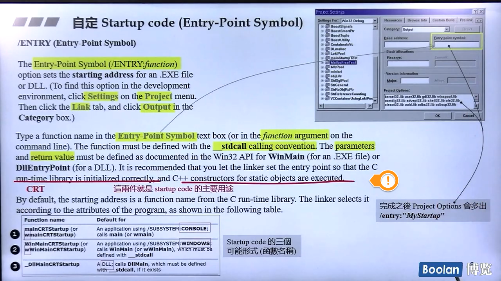

CRT是指Microsoft开发的C/C++ Runtime Library。CRT的其中一部分可以看作是Microsoft开发的一个C++标准库实现。Windows API（以及Windows的其他许多部分）使用的类库就是CRT，是在CRT的基础上开发的。

在windows环境下，使用VC6进行开发，我们写下以下代码（启动码函数）：

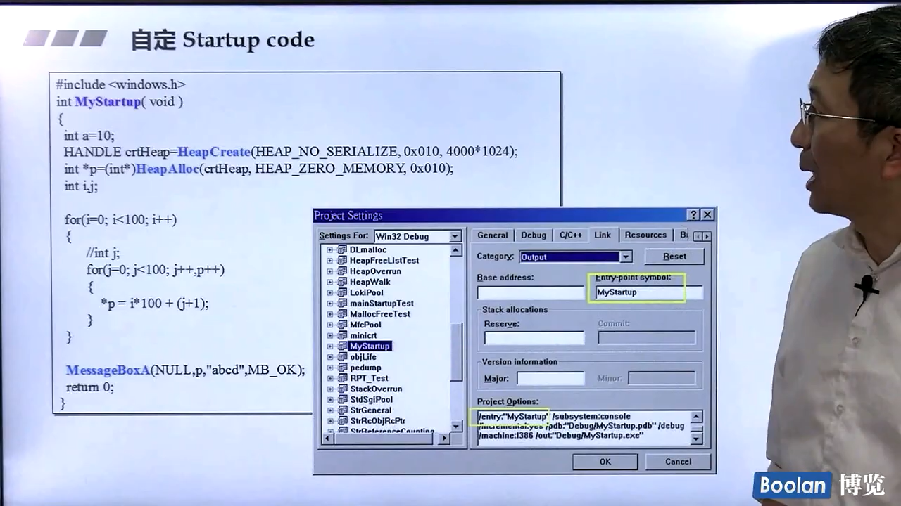

我们的程序将从MyStartup()函数启动，并且不会调用main函数（因为我们没写。。） 


在linux环境下，我们编写了两个函数，使用GCC进行编译：

```c++
$ cat entrypoint.c
 
int blabla(){ printf("Yes it works!\n"); exit(0); }
int main(){ printf("not called!\n");}
 
$ gcc entrypoint.c -e blala    //-e：告诉使用balala函数作为进入点
 
$ ./a.out
Yes it works!                 //main函数并没有执行
```


总结：

任何的c/c++程序，在main函数之前，有一个启动函数，你的main函数必须由启动码函数调用起来。启动码也是最早执行的函数。

# 默认的startup code在哪里，main()生前和死后的call stack 

我们以VC6（windows）为例，主要分为9个点来分析： 

1. 程序运行所需内存的初始化
2. 底层I/O初始化
3. 获取命令行参数
4. 获取环境变量
5. 设置命令行参数
6. 设置环境变量
7. C data初始化
8. main()
9. exit()

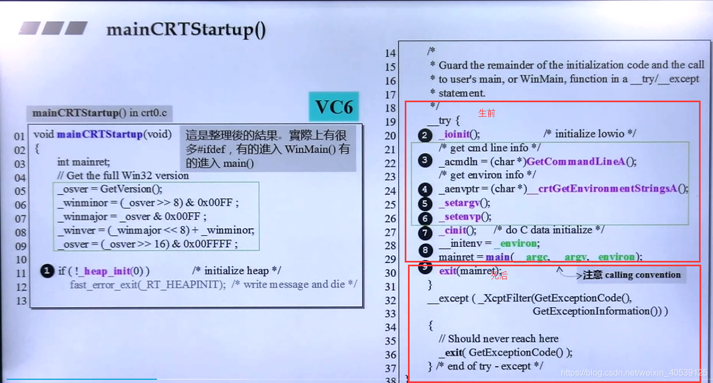

# heap_init()——Startup的首要管理工具 

程序运行需要的内存块：1.从何处来？2.大小几何？3.回收至何处？详见：[C++内存管理机制](侯捷-C++内存管理机制.md)

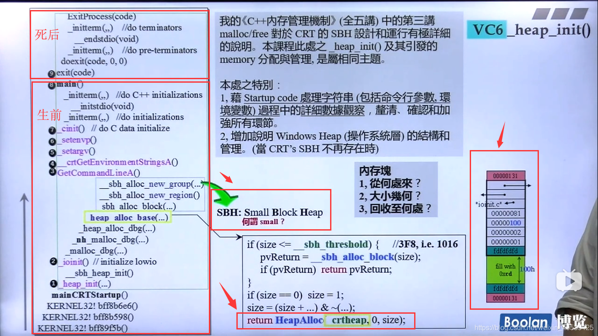

**SBH(Small Block Heap)**：应付CRT本身以及main进去之后的所有内存（size=1024=1k）。 

如果客户要的区块大小要小于sbh_threshold（size=1016，加上图中的上下的00000131(各占4个字节)，1016+8=1024，即1K），将从sbh内部去申请内存。反之，使用HeapAlloc(win提供的API函数)，让操作系统提供服务。 

**HeapAlloc**：HeapAlloc是Windows提供的API，在进程初始化的时候，系统会在进程的地址空间中创建1M大小的堆，称为默认堆（Default Heap），该大小为默认值，可以通过/HEAP连接器开关进行修改。用户也可以通过HeapCreate创建额外的堆，堆的使用可以更有效的进行内存管理，避免线程同步的开销以及快速的释放内存等。

## main 生前所有内存分配

在VC环境中，我们发现main()函数共有三个参数，其中包含一个独特的参数_environ。当然，不同的平台main的参数是不同的，我们需要注意的是calling convention。

mainret = main(__argc,__argv,__environ);

**_environ**：pointer to pointer tabale，table中的每个entry都是pointer to string which represents an environment variable。

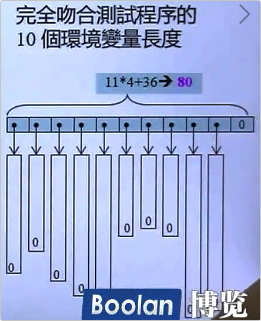

我们可以查找到 _environ的首地址，，并且根据其指向的是指向字符串的指针，而字符串总是由‘\0’结束，四个字节为一个指针，因此，下图共有十个指针，需要注意的是其所指向的字符串的长度。

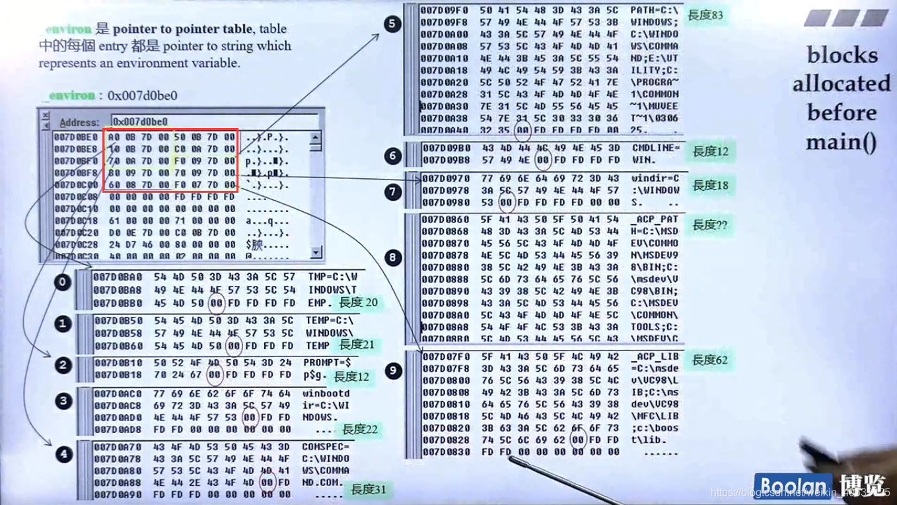

我们接下来验证以下上一节中分配的内存大小：

6️⃣：我们程序要一大块内存240h准备从操作系统手中把所有的环境变量拷贝过来，现在功成身退，它被切割为10个字符串了,它可以还给操作系统了。

进入main()之前，CRT已经做了很多工作，其中需要若干memory，因此当main()首次调用malloc()时，已有若干blocks挂在sbh所维持的free list上头。


VC10的内存分配在OS中，windows heap管理如下，过程和VC6 SBH一样，略。

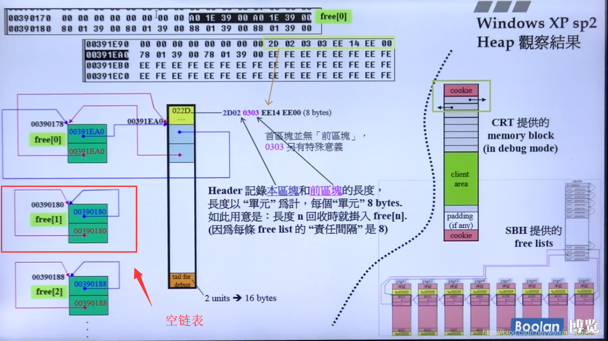

示例：使用heapAlloc分配1024单位内存。 

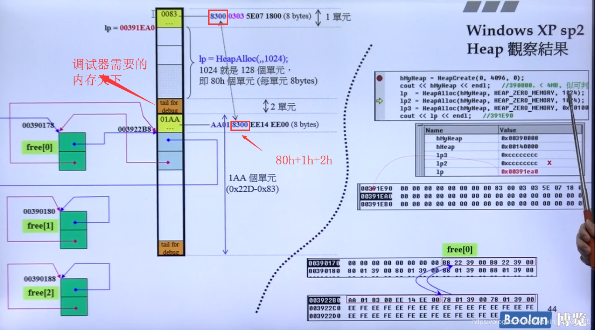

# io_init()——Startup的第二项大工程

I/O initialization就是要在client space 中建立起stdin、stdout、stderr及其对应的FILEs，使程序进入main()之后立即可以使用printf()、scanf()等函数。

- pointer to FILE：user mode
- fd、file handle：kernel mode

user mode看不到kernel mode的内容。

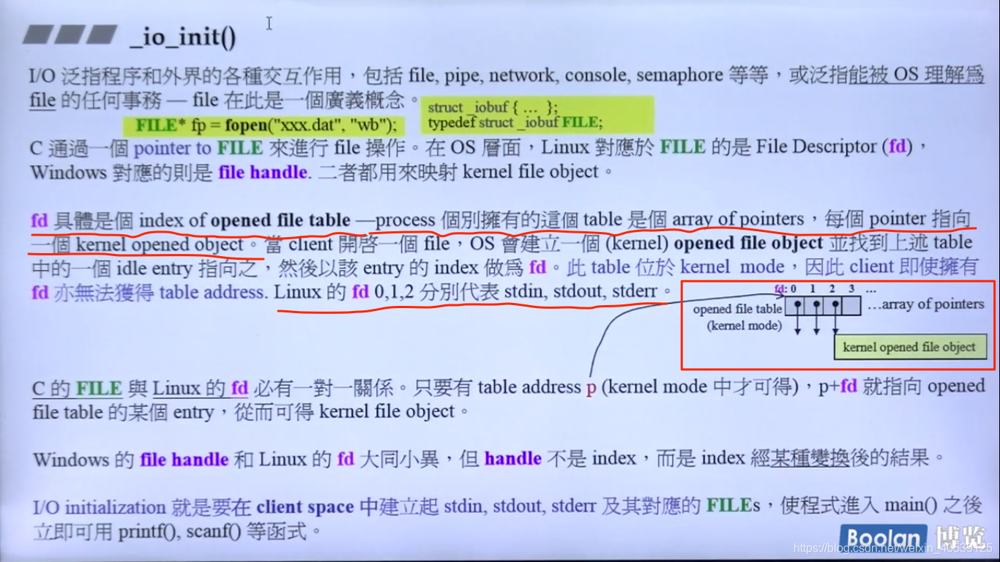

右边的文字值得一读。

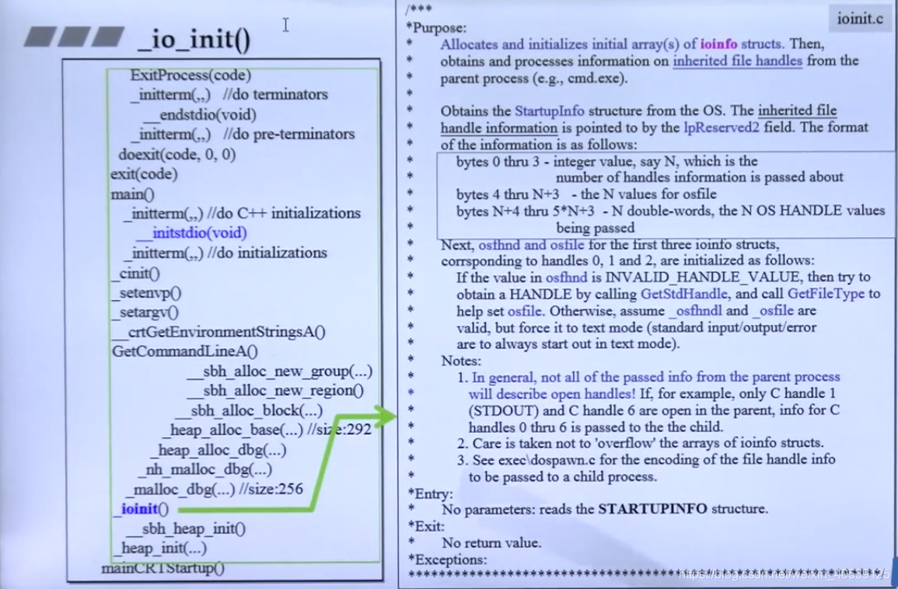

## _io_init&fopen()

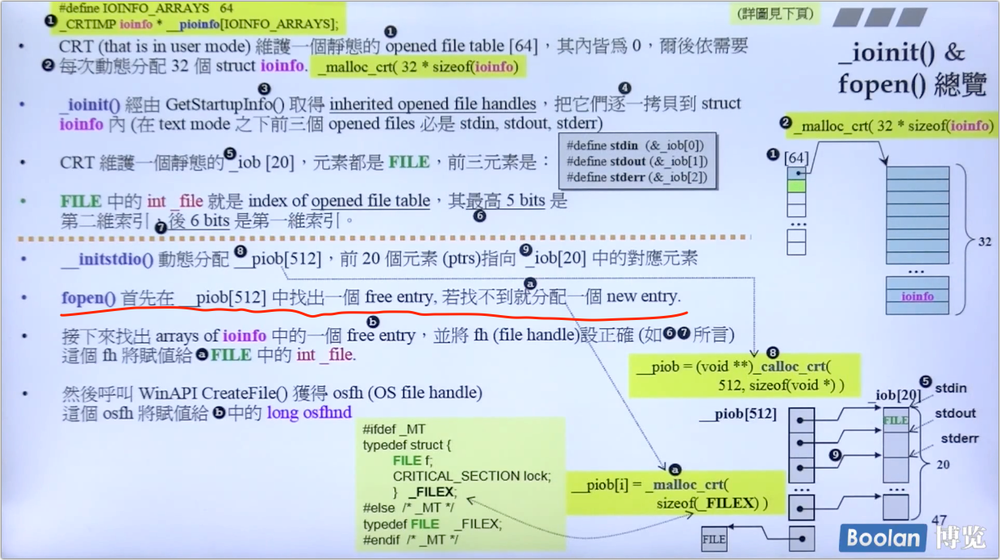

部分编号解释（上图的编号和下图的编号一致）

①：**ioinfo**是什么？其对应到C/C++程序对应的fopen得到的变量（FILE *fp=fopen("xxx.dat"，“wb”)中的FILE* 变量）。Linux对应于FILE的是File Desriptor(fd)，Windows对应的则是file handle。

每个进程至少有**三个file handle（stdin，stdout，stderr）**，接下来的动作就是把继承下来的这三个或更多的file handle抄录到struct ioinfo。所以，**一个进程最多可以开出64\*32=2048个FILE**，其中包括从父进程继承下来的部分。

③：操作系统怎么把继承而来的这三个或更多的file handle拷贝到struct ioinfo?

⑥：注意相同颜色部分。C语言开启一个FILE以后得到指针指向`_iobuf`这么一个结构。其中的_file（`2^11=2048`）怎么解释呢？其中的六个bit（`#5~#10`）表示第一维索引，共`2^6=64`。其他五个bit（`#0~#4`）表示第二维索引，共`2^5=32`个ioinfo。

**将kernel mode opened file table （stdin,stdout,stderr..) 复制到user mode。**

- 内核模式的ioinfo对应用户模式的FILE中，其中的int _file就是fd。

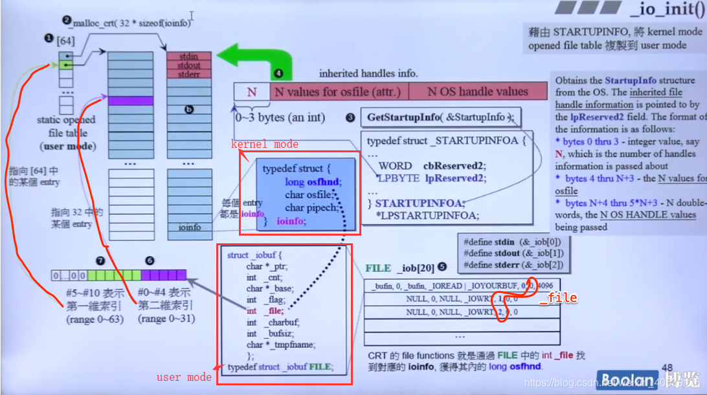

**GetStartupInfo**: lpReserved2 将指向 inherited handles info 。字节0~3表示一个N值，代表了继承了几个file handle（原则上一般至少有stdin、stdout、stderr 三个file handle）。 N value for OSfile 则是 ioinfo 结构体中的 char os file，N OS handle values 则是ioinfo结构体中的 long osfhnd。

借由调用GetstartupInfo函数，取得lpReserved2指针，指向inherited handles info，取出N，OSfile，osfhnd，copy填入到ioinfo的结构体中。借由这种方式去登记/记载父进程继承而来的file handle。


## 实验 

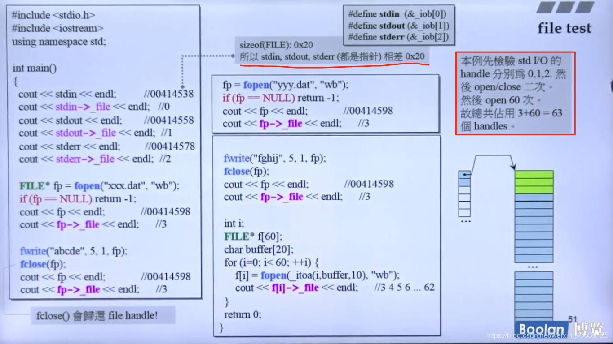

# c_init——Startup的第三项大工程

无视频..