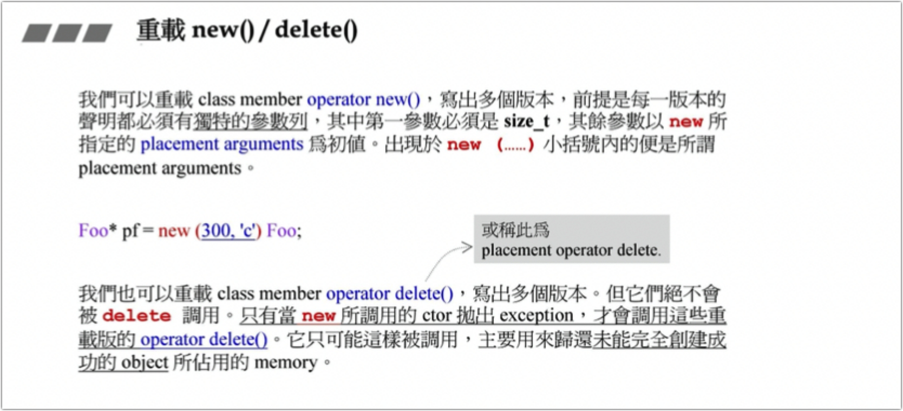
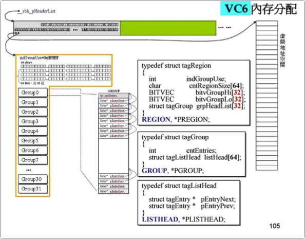

参考：

https://segmentfault.com/blog/tiansong_c 

https://blog.csdn.net/qq_42604176/category_10682286.html 

本课程分为六讲： 

第一讲：Primitives

C++语言中与内存相关的所有基础构件（constructs），包括malloc/free，new/delete， operator new/operator delete，placement new/placement delete，我将探讨它们的意 义、运用方式和重载方式。并以此开发一个极小型内存池（memory pool）。 

第二讲：std:：allocator 

标准库的兴起，意味我们可以摆脱内存管理的繁复琐屑，直接使用容器。但是容 器背后的分配器（allocator）攸关容器的速度性能和空间性能。我将比较Visual C++， Borland C++，GNU C++标准库中的allocator，并深入探索其中最精巧的GNU C++ allocator的设计。 

第三讲：malloc/free 

malloc/free是所有内存管理手段的最后一哩；通过它才和操作系统搭上线。当然 你也可以直接调用system API，但不建议。因此理解malloc/free的内部管理至为 重要。我将以Visual C++的CRT（C RunTime Library）所带的malloc/free源代码 为基础，深度探索这最基础最关键的内存分配与释放函数。 

第四讲：loki::allocator 

即使知名如GNU C++ pool allocator，也有其小缺陷。Loki（一套作风前沿的程序 库）的allocator设计精简功能完整几无缺点，很值得我们深究。 

第五讲：其他主题 

除了std:：allocator，GNU C++还带不少allocators，它们不是标准库的一部分， 可视为标准库的扩充。我将探讨这些扩充的allocator，特别是bitmap allocator。 

 我们谈的不只是应用，还深入设计原理与实现手法。在理解了这么多底层 （Windows Heap，CRT malloc/free，C++ new/delete，C++ allocators）之后，也许你终 于恍然大悟，再不需要自行管理内存了；或也许你终于有能力想像，该在何处以 何种方式加强内存管理。 

# 

# C++内存构件 

## 内存分配的每个层面

C++ memory primitives 

使用示例：

void *p1 = malloc(512); // 512 bytes free(p1)   complex<int>* p2 = new complex<int>;  // one object delete p2;  void *p3 = ::operatornew(512); // 512 bytes  ::operator delete(p3); 

以下使用 C++ 标准库提供的 allocators。其接口虽有标准规格，但实现厂商并未完全遵守；下面三种形式略异

\#ifdef _MSV_VER   // 以下两个函数都是 no-static, 要通过 object 调用。   // 分配 3 个 ints   int *p4 = allocator<int>().allocate(3, (int*)0);  // 对应标准库分配器的第二个参数   allocator<int>().deallocate(p4, 3); #endif #ifdef __BORLANDC__   // 以下两个函数都是 no-static, 要通过 object 调用。   // 分配 5 个 ints   int *p4 = allocator<int>().allocate(5); // 同样包含第二个参数，但声明处有默认值，因此调用处可不写   allocator<int>().deallocate(p4, 5); #endif #ifdef __GNUC__ // 早期版本的实现， 2.9   // 以下两个啊含糊都是 static, 可通过全名调用。   // 分配 512 bytes   void *p4 = alloc::allocate(512);   alloc::deallocate(p4, 512); #endif

现代版本的实现， 4.9

\#ifdef __GNUC__    // 以下两个函数都是 no-static，要通过 object 调用。   // 分配 7 个 ints   void *p4 = allocator<int>().allocate(7);   allocator<int>().deallocate((int*)p4, 7);      // 以下两个函数都是 no-static，要通过 object 调用。   // 分配 9 个 ints   void *p4 = __gnu_cxx::pool_alloc<int>().allocate(9);   __gnu_cxx::pool_alloc<int>.deallocate((int*)p4, 9); #endif

## new expression (new 背后的行为) 

- 申请内存可能会失败，因此引入 try...catch...

- new 做两个动作 

- - **申请内存**
  - **调用构造函数**

- 欲直接调用 ctor, 可调用 placement new, new(p)Complex(1, 2)

对于operator new函数：

- std::nothrow_t 结构用作 new 运算符的函数参数，指示该函数应返回空指针以报告分配失败，而不是引发异常(struct std::nothrow_t{})
- 当内存申请失败，_callnewh 调用 typedef void (*new_handler)(); new_handler set_new_handler(new_handler p) throw() 设置的函数，使得我们有机会释放掉我们认为可以释放的内存空间

## delete expression (delete 背后的行为) 

- **调用析构函数**

- **释放内存**

## Ctor& Dtor 直接调用 

- 语法上构造函数不可被直接调用；编译器发出错误
- 语法上析构函数可被直接调用；编译通过；但不可以这样使用，比如析构函数中需要释放系统资源时，析构函被多次调用，资源也将被释放多次，行为未定义
- 实际使用时，构造函数、析构函数都不应该直接调用

## array new & array delete

数组中元素的构造顺序与析构顺序相反

### array size, in memory block

### 

## placement new

placement new 允许我们将 object 构建于 allocated memory 中;

没有所谓 placement delete， 因为 **placement new 根本没分配 memory**;亦或称呼与 placement new 对应的 operator delete 为 placement delete。 

## 内存分配的途径 

**C++ 应用程序**

1. 可通过自定义内存池的方式提高使用效率，如更快的分配速度，更省的内存空间（省去 cookie） 
2. 全局的内存管理策略会被多处有意或无意的使用，代码会大范围的收到影响，可重载但少见 

**容器**

- 容器并未采用默认的内存管理方式，而采用内存分配器重新实现
- 内存分配与构造被重新封装彼此分离
- 内存释放与析构被重新封装彼此分离

## 全局重载 ::operator new / ::operator delete 

小心，影响无边无际！

void *myAlloc(size_t size) {   return malloc(size); } void myFree(void *ptr) {   return free(ptr); } void *operator new(size_t size) {   cout << "global new" << endl;   return myAlloc(size); } void *operator new[] (size_t size) {   cout << "global new[]" << endl;   return myAlloc(size); } void operator delete(void *ptr) noexcept {   cout << "global delete" << endl;   myFree(ptr); } void operator delete[] (void *ptr) noexcept {   cout << "global delete" << endl;   myFree(ptr); }

## 类内重载 operator new/operator delete 

以及operator new[]/operator delete[]

class Foo { public:   void *operator new;   void operator delete;   // ... }; // operator new[]/operator delete[] class Foo { public:   void *operator new;   void operator delete;   // ... };

重载 operator new, operator delete 、operator new[]/operator delete[] 的成员函数具有 static 属性（编译器加上）

## 重载 new() / delete() 

## basic_string 使用 new (extra) 扩充申请量 

basic_string重载new()为string扩充申请量 

## Per-class allocator第一版本

如果我们不针对对象做内存管理，那么我们每次进行Foo* p = new Foo(x);时总是会调用malloc函数。尽管malloc函数很快，但是我们仍然有自己管理内存的必要。

自定义内存分配器：

- 首先使用malloc函数申请一大段内存（内存池），然后切割成若干个小块，每次创建一个对象的时候就给一小块的内存。这样效率更高并且更容易管理。
- 提高内存空间利用率（每次 malloc 会携带 cookies）

这里重载了operator new()，事先malloc一大片内存，划分为一个个片（Screen对象大小），并用Screen的next指针连接起来，形成一个链表。这样，allocator的使用者申请内存的时候，就将其中的空闲片分配出去。使用者释放内存时，修改已分配片的指针即可，无需free。

测试结果：

没有cookie（左边）vs 有cookie（右）

## Per-class allocator第二版本

实际上，第一个版本的Screen对象中的next指针占用的空间可以被优化。因为next指针只有在allocator申请和回收内存的时候有用，Screen对象的空间是被allocator分配后才使用。这两个空间不会同时使用，所以可以把next指针占用的空间和Screen对象占用的空间合二为一。这里采用union结构。

## Common static allocator（第三版本）

刚刚我们都是针对一个class单独重载它的new和delete，这样会导致代码的重复性。我们将刚刚的动作抽象出来放到一个class里面。

每个allocator object 都是分配器，它体内维护一个freelist，不同的allocator objects维护者不同的freelists。

使用：

## Macro allocator（第四版本）

每次使用的话，直接在类内部调用两个宏就行了。

## GNU C++ allocator（第五版本）

标准库的版本，有16条链表，并且是global allocator。

## 关于new handler与default、delete关键字 

当operator new不能够分配出申请的内存时，会抛出bad_alloc 异常。有的编译器会返回0.

当定义成new(nothrow) Foo；就不会抛异常，而是返回0.

示例：

\#include <new> #include <iostream> #include <cassert> using namespace std; void noMoreMemory() { cerr << "out of memory"; abort(); } void main() { set_new_handler(noMoreMemory); 	int* p = new int[100000000000000000]; assert(p); }

# 第二讲：std::allocator 

## VC6 allocator

## BC5 allocator 

## GNU allocator 

G2.9和4.9版本的allocator和VC6、BC5一样。但是G2.9容器使用的是std:alloc，而不是std::allocator，去除了cookie。

G2.9的std::alloc在G4.9转变为__gnu_cxx::__pool_alloc，内容也做了一些修改。

## GNU allocator行为剖析

- free_list 数组总计包含 [0 - 15] 16个元素，其中每个元素分别对应一条子 **单** 链表(embedded pointers 组织管理)
- 每条子链表分别对应管理多个内存块（内存块大小从8字节到128字节）。如，其中free_list[0]管理8字节链表，之后子链表管理的空间大小依次增加 8 字节
- 当使用者申请内存空间不是8的整数倍时，大小会被调整为8的整数倍再用对应的子链表进行管理
- 当使用者申请内存大于128字节时，调用 malloc 进行管理内存分配（而非链表）

运行过程：

**第一次申请** 

- 客户申请30字节空间，std::alloc调整8字节对齐到32字节，对应 free_list[3] 子链表

- free_list[3] 为空，未指向可用内存块节点，调用 malloc 进行大的内存块申请

- - malloc 申请时得到的内存空间：20 x 32 字节内存块 + 20 x 32 字节**战备池 pool** 内存块（20数量内存块可能为经验值，由embedded pointers 组织成单链表）

- 将申请得到的第一个小内存块交给客户进行使用

**第二次申请** 

- 客户申请64字节空间，atd::alloc 在 free_list[3] 中找到前次申请的 20 x 32 字节战备池空间可用，此空间被重新64字节分割，将第一块传给客户使用

**第三次申请** 

- 客户申请96字节空间，std::alloc 检查 free_list 无战备池内存可用，于是为 free_list[11] 子链表调用 malloc 进行大的内存块申请【20 x 96 + 20 x 96（对应图中 memory pool）】，将第一块内存块传给客户使用

**内存回收** 

- 根据回收的内存大小，重新挂载到对应的子链表上(embedded pointers 组织管理)

当申请量超出内存限制时？

##  GNU allocator源码剖析

ROUND_UP : 将参数值“上调”整为 8 的倍数（计算内存申请追加量会使用） union obj *free_list_link : 嵌入式指针，连接可用内存块 volatile ： 多线程时使用，此处可暂忽略 free_list[_NFREELISTS] : 包含 16 个元素，每个元素都是指针，指向自由链表 FREELIST_INDEX : 根据所用内存大小计算对应自由链表下标值（“上调”到8的倍数对应的下标值） refill : 当自由链表为空时调用 start_free、end_free : 指向战备池 heap_size : 分配累计总量（关系到追加量）

略

## GNU allocator移植到C语言

# 第三讲：malloc/free 

C语言函数malloc/free。malloc中有它自己的内存管理系统，让它是一个非常高效的函数。

## VC6和VC10的malloc比较

malloc与free带来的内存管理是应付小区块的，即SBH(small block heap)，VC6下会做门槛检测。VC10下不会做门槛检测，它总是会调用系统提供的HeapAlloc。这是因为操作系统提供的函数也有类似的功能了。这讲介绍SBH的内容。

启动过程详见：[C++ Startup 揭密：C++ 程序的生前和死后](evernote:///view/15615241/s67/d9a961e4-1fa1-4f41-aeb5-a349a6a43df1/d9a961e4-1fa1-4f41-aeb5-a349a6a43df1/) 

注意： __heap_init 和 __ioinit 在 VC6 和 VC10 中都存在。

## SBH之始——_heap_init()和_sbh_heap_init()

CRT 会先为自己创建一个 _ctrheap "独特"内存（HeapCreate）, 然后从中配置 SBH 所需的 headers, regions(__sbh_heap_init).应用程序内存申请时如果 size > threshold 就以 HeapAlloc() 从 _crtheap 取.若size <= thread 就从 SBH 取（实际区块来自 VirtualAlloc）。

_heap_init()：向操作系统要一大块内存（如4096），称为_crtheap.

_sbh_heap_init()：使用HeapAlloc从_crtheap中获取16个HEADER大小的内存，并获取内存指针。

header 结构

1.  在 _sbh_heap_init() 中含有对 Header 的配置，包括对所属的 region 的配置
2.  pHeadData 指向实际所管理的可分配的内存区块
3.  pRegin 指向管理 Region 区块，其中存储了所管理内存的控制信息

_heap_init() 和 __sbh_heap_init() 调用完成之后就可以进行下一步 _ioinit(), 使用 SBH 对小区块的内存请求进行响应和分配了 

## SBH行为分析–内存块大小之计算

### _ioinit() 

_ioinit() 完成了应用程序启动后的“第一次”内存申请。

在debug模式下，调用malloc_dbg，分配得到32个8字节的内存（即100h，256字节）。

### **heap_alloc_dbg**

调整大小，扩充一个如下的结构：nDataSize记录真正大小。gap用户调试器检查保护nsize内存。注意gap一共上下两个，但是结构体里面只定义了上面的那个。

1️⃣SBH 对所分配的内存块的结构设计，可分为三部分：_CrtMemBlockHeader、data[nDateSize]、anotherGap[nNoMansLandSize]。我们将这整个内存的大小叫做blockSize；然后进行结构体与nSize的数据填充和值初始化。

1. pBlockHeaderNext, 指向链表后内存块
2. pBlockHeaderPre, 指向链表前内存块
3. szFileName, 记录申请使用该内存空间所在的文件
4. nLine,   记录申请使用该内存空间所在文件的行号
5. nDataSize, 实际数据区的空间大小(应用程序实际使用到的内存块)
6. nBlockUse, 表示当前内存块的类型, 如 _CRT_BLOCK、_NORMAL_BLOCK 等...
7. IRequest,  操作流水号
8. gap[nNoMansLandSize]， 上下两处“栏杆”，保护应用程序实际使用到的内存，到发生内存越界的情况，调试器可以检查到

 2️⃣通过调用_heap_alloc_base来获取每个blockSize内存的头指针。然后通过头尾指针将所有分配出来的block串接起来，变为一个链表：

### **_heap_alloc_base**

门槛检测

- 当申请量小于等于 1016Bytes 时调用 __sbh_alloc_block

- 当申请量大于 1016Bytes 时调用操作系统提供的API HeapAlloc() 从 __crtheap(全局变量) 中取内存

__sbh_threshold = 1016 = 1024 - (2 * 4). 其中 2 * 4Bytes 对应两个 cookies 的开销。

_ioinit()首次申请256字节。

### _sbh_alloc_block

对扩充完的区块再次进行扩充，加上8个字节(上下cookie)并且进行roundup操作(变为16的整数倍)。

最终得到的结果是0x130，但是在cookie中写入的却是131。这是因为由于是16的倍数，所以最后一位一定是0。最后一位0/1表示是在SBH手上还是已经分配出去了。

## SBH行为分析–数据结构 

### __sbh_alloc_new_region 

_ioinit()之前的步骤主要完成内存大小的计算，__sbh_alloc_new_region开始真正的内存分配和管理（可以看到真正的内存管理结构）。

之前在第一步heap初始化的时候分配了16个HEADER，每个HEADER现在申请并管理1MB的内存，还申请一块region对内存做管理。每个HEADER有两根指针：一根指向虚拟地址空间，一根指向管理中心。管理中心被称为new_region。

region设计如下：

- 1个整数
- 64个char
- 32个Hi和32个Lo并起来，构成32组，每组64个bit。（用来管理哪些区块有或者没有）

- 32个group，每个group由64根双向链表组成。

程序将用这一块region（大概16KB左右）来控制1MB的虚拟内存空间。然后调用__sbh_alloc_new_group对虚拟地址空间切片。

### __sbh_alloc_new_group 

已知拥有32个group，对应了1MB的虚拟内存空间，平均下来每个group管理32KB内存。

每32KB的内存还要再分割，分成8page（注意这里的内存都是连续的），每page4KB，然后用指针把8个page串起来。串起来之后将它们挂到group的最后一条链表。这便是SBH现在所作的事情。

- 0xfff…实际上就是-1，作用：将来回收内存的时候需要合并内存，合并的过程中需要用-1作为阻隔器，即只能合并-1与-1之间的内存。
- 上-1下面有3格，第一格记录的是两个-1之间的内存，一开始大小为4080，后两格作为指针将page从前到后串联起来。
- 每个page大小4096字节，去掉两个-1，剩下4088个字节。由于每个红色区块要保证大小是16倍数。所以需要将4088再分割出去8个字节（也就是保留）。

每个group中有64根双向链表，平均分配下来：

第一条链表管理16个字节的内存

第二条链表管理32个字节的内存

…

最后一条管理1024个字节的内存（实际上大于1k的内存全都归最后一条管理）,如果最后一条切割后小于1k，则通过指针跳到合适的链表。

## SBH行为分析–分配之详细图解

- _ioinit()申请130（100h+debugHeader+cookie+roundup），ff0（4080）-130还剩ec0。
- 切割完后，系统将红色的地址：007d0ed0，传出去。客户程序拿到该指针，便认为拥有了这一块内存。

由上可知，切割其实只是cookie的调整 + 指针的传送。

## SBH行为分析–分配+释放之连续动作图解

**第一次，分配** 

**第二次，分配** 

**第十五次，释放** 

归还240H

1.  当前操作仍为 Group[0]
2.  修改 cntEnteries 由 14 为 13
3.  240h / 16 - 1 = 576 / 16 - 1 = 35 => listHead[35], **归还的内存块挂接（嵌入式指针完成）到 35 号链表**
4.  修改 bitvGroup[0] [35] 为 1
5.  修改 cookie 最后一位为 0

**第十六次，分配** 

申请 b0h

1.  修改 cntEnteries 由 13 为 14

1.  b0h / 16 - 1 = 10 => bitvGroup[0][0] 为 0， 表示无可用区块

1.  查找临近可用区块， bitvGroup[0][35] 为 1， 在 listHead[35] 链表管理的内存块中进行切割

1.  240h - b0h = 190h， 190h / 16 - 1 = 24 **切割后的内存块重新调整挂在到 listHead[24]**

1.  修改 bitvGroup[0][35] 为 0，bitvGroup[0][24] 为 1

**第 n 次， 分配** 

申请 230h

1.  经过不断的内存分配，Group[0] 管理的 page[1-8] （32KB） 已无法满足 230h
2.  Group[indGroupUes] => indGroupUes[1] 开始新的故事

## 区块合并 

### free-list 内的合并 

为了尽量减少内存空间的碎片化以满足后期较大内存块的申请需求，将相邻空闲的区块进行合并时 SBH 进行碎片整理的思路。（分为向下合并、向上合并）

1. 应用程序归还上图蓝色箭头所指向内存地址[0x00000304]（修改上下 cookie 最后 1 bit 为 0）
2. 下 cookie 加 4 bytes, 定位到下块内存块的上 cookie，检查最后bit为0，表明此块内存空闲，两内存块进行合并【下内存块需要调整对应的 listHead 和 bitvGroup】
3. 上 cookie 减 4 bytes， 定位到上内存块的下 cookie, 检查最后bit为0， 表明此内存块空闲，接上步骤内存块进行合并【上内存块需要调整对应的 listHead 和 bitvGroup】
4. 0x300 + 0x300 + 0x300 = 0x900 大于 1 KB， 调整挂载到最后一条链表 list[63]，设置对应的 bitvGroup 位

### free(p) 索引定位 

**p 落在哪个 Header 内？**

1.  已知 Header 首地址、 Header 数量、Header 大小
2.  Header 内成员 pHeapData 指向 1MB 内存空间
3.  遍历所有 Header， 查看 p 落在哪个 Header 的 [pHeapData， pHeapData+1MB] 内

**p 落在哪个 Group 内？**

(p - pHeapData) / 32 - 1

**p 落在哪个 free-list 内？**

1.  上 cookie 地址 = p - 4
2.  从上 cookie 获得要释放的内存块大小 size
3.  index = (size / 16) - 1

## 内存分段管理的妙处 

SBH 做分段的管理：每次申请1MB虚拟空间 -> 每次申请32KB物理内存 -> 分为8Page -> 64条链表

分段管理之妙，利于归还 OS：当一个Group的cntEntries 为 0 时进行“全回收”该group，而不用等到所有虚拟空间都被释放

### 内存的延迟归还 

为了内存分配的高效性，对内存的回收使用了 Defering 机制

当归还完所有内存块， SBH 将恢复到初始状态。

**VC6 Heap State Reporting Functions**

## SBH检讨

C++标准库、CRT、OS API都有类似的内存管理。

**叠屋架床，层层封装是一种浪费吗？**

是，但有必要。因为每一个上层调用都无法保证下层是否有合适的内存管理。

（VC10的CRT就没有了内存管理，交给了OS API）

# 第四讲：Loki::allocator 

Loki是由 Andrei 编写的一个与《Modern C++ Design》（C++设计新思维）一书配套发行的C++代码库。其中有两个文件 SmallObj.h 、SmallObj.cpp 进行内存管理，可以单独进行使用 。[Loki 源码下载](https://link.segmentfault.com/?enc=Eevl3Ezhiy6%2BvpfcAJA5aA%3D%3D.Xlg0fXu00i%2BNKpQxDOb0XrLP4Zi33Y15XolmA%2BGz50fx1%2Bz9eoRax%2F0INMTFsmI%2F3t7HDRc1K46YBkHuu1fMLQ%3D%3D)

## 上中下三个classes分析

SmallObj 文件中有三个类：chunk, FixedAllocator 和 SmallObjAllocator。其中SmallObjAllocator 位于最顶层供应用程序调用

## class Chunk分析

Chunk 是类层次结构中最底层管理内存块的类，它负责向操作系统进行内存申请 

1.  Init(), 使用 operator new 申请一段内存 chunk, 并使用 pData_ 指向 chunk
2.  Reset(), 对 pData_ 指向的内存进行分割。[数组代替链表，索引代替指针][与嵌入式指针类似]每一块 block 的第一个字节存放的是下一个可用的 block 距离起始位置 pData_ 的偏移量(以 block 大小为单位)

1.  Relese(), 向操作系统归还内存

\--

1.  blockSize、blocksblock, block 大小及数量      
2.  firstAvailableBlock_,当前可用内存块的偏移量
3.  blocksAvailable,当前 chunk 中剩余的 block 数量

**Allocate** 

**Deallocate** 

先确定要释放的指针落在哪个chunk。

## class FixedAllocator分析

FixedAllocate 负责管理一个具有相同大小 block 的 chunk 集合。它负责根据应用程序需求，创建特定大小的 chunk， 并放置在 vcector 中进行管理。

- allocChunk_：标记最近一次满足分配动作的 chunk, 当下次再有分配需求时，优先检查此 chunk
- deallochunk_：另一标定，依靠数据的内聚性和区域性原则，当某一 chunk 发生内存回收时，下次回收也可能发生在此 chunk 上。以此尽量避免 `void Deallocate(void *p)`中 p 落在哪一个 chunks 的遍历查找动作（类比于上述代码 for ）
- deallocChunk_ = &chunks_.front()：chunks push_back可能导致vector扩容，因此需要重新记录deallochunk_

根据归还内存的地址，把这块内存回收到对应的 chunk 中

**VicinityFind** 

根据内存使用的区域性,采用临近查找法确定 p 所对应的 chunk 。

查找思想：VicinityFind采用临近分头查找的算法，从上一次dealloChunk_的位置出发进行上下两头查找(内存分配通常是个容器服务的,而容器元素连续创建时，通常就从同一个chunk获得连续的地址空间，归还的时候当然也是归还到同一块chunk。通过对上一次归还chunk的记录，尽量避免遍历搜索，提高了查找定位速度)

**DoDeallocate** 

完成实际的内存回收 

1. deallocChunk->Deallocate(p, blockSize_); 由 FixedAllocator::chunk::Deallocate(void *p, std::size_t blockSize) 完成底层的内存回收
2. 当 deallockChunk_->blocksAvailable_ = numBlocks_ 时表示当前内存可以归还给操作系统
3. 延迟归还机制，把空的 chunk 交换到 vector 尾部，只有出现两个空的 chunk 时，才会发生真正的内存归还动作

（表中标注①②③）

## Loki::allocator检讨

- 曾经有两个 bugs, 新版已修正
- 精简强悍；手段暴力（关于 for-loop）
- 使用「以 array 取代 list, 以 index 取代 pointer」 的特殊实现手法
- 能够以简单的方式判断 「chunk 全回收」 进而将 memory 归还给操作系统
- 有 Deferring (延迟归还)能力
- 这是个 allocator, 用来分配大量小块不带 cookie 的memory blocks, 它的最佳客户是容器（因为使用时要记录块大小），但它内部使用的 vector （std::allocator）

## 与 std::alloc 的比较 

| **std::allocator**                                           | **loki::allocator**                            |
| ------------------------------------------------------------ | ---------------------------------------------- |
| 不会向操作系统归还内存                                       | 延迟机制内存归还                               |
| 服务于 8-128（每次增加 8byte） 内存块，申请不满足时RoundUp调整 | 为不大于最大 block size 的所有 block size 服务 |

# 第五讲：Other Issues 

除了std:：allocator，GNU C++还带不少allocators，它们不是标准库的一部分， 可视为标准库的扩充。我将探讨这些扩充的allocator，特别是bitmap allocator。

## GNU C++对allocators的描述

当你将元素加入容器中，容器必须分配更多内存以保存这些元素，于是它们向其模板参数 Allocator 发出申请，该模板参数往往被另名为（aliased to）allocator_type。甚至你将 chars 添加到 string class 也是如此，因为 string 也算是一个正规 STL 容器。

每个元素类型为 T 的容器（container-of-T） 的 Allocator 模板参数默认为 allocator<T>。其接口只有大约 20 个 public 声明，包括嵌套的（nested） typedefs 和成员函数。最重要的两个函数是：

T *allocate(size_type n, const void *hint = 0); void deallocate(T *p, size_type n);

n 指的是客户申请的元素个数，不是指空间数量（字节数） 

这些空间都是通过调用 ::operator new 获得，但何时调用以及多么频繁调用，并无具体指定 

最容易满足需求的做法就是每当容器需要内存就调用 operator new, 每当容器释放内存就调用 operator delete。这种做法比起分配大块内存并缓存（caching）然后徐徐小块使用当然慢，优势则是可以在极大范围的硬件和操作系统上有效运作。

- __gnu_cxx::new_allocator:实现出简朴的 operator new 和 operator delete 语义 
- __gnu_cxx::malloc_allocator：和new_allocator类似，不过使用std::malloc和std::free。

另一种做法就是使用智能型 allocator, 将分配所得的内存加以缓存(cache、内存池)。这种额外机制可以数种形式呈现：

1. 可以是个 bitmap index, 用以索引至一个以 2 的指数倍成长的篮子（exponentially increasing power-of-two-sized buckets）
2. 也可以是个相较之下比较简易的 fixed-size pooling cache 

这里所说的 cache 被程序内的所有容器共享，而 operator new 和 operator delete 不经常被使用，这可带来速度上的优势（底层malloc也是一个复杂的内存池，速度优势并不明显，主要是减少了cookie的使用）。使用这类技巧的 allocators 包括：

- **__gnu_cxx::bitmap_allocator** 一个高效能 allocator，使用 bit-map 追踪被使用和未被使用（used and unused）的内存块
- __gnu_cxx::pool_allocator

- __gnu_cxx::__mt_alloc

Class allocator 只拥有 typedef, constructor 和 rebind 等成员。它继承子一个 high-speed extension allocators。也因此，所有分配和归还（allocation and deallocation） 都取决于该 base class, 而这个 base class 也许是终端用户无法触碰和操作的（user-configurable）。

很难挑选出某个分配策略说它能提供最大利益而不至于令某些行为过度劣势。事实上，就算要挑选何种典型动作以测量速度，都是一种困难。GNU C++ 提供三项综合测试（three synthetic benchmarks）用以完成 C++ allocators 之间的速度对比：

1. Insertion, 经过多次 insertions 后各种 STL 容器将拥有某些及大量。分别测试循序式（sequence）和关联式（assiciative）容器 
2. 多线程环境中的 insertion and erasure, 这个测试展示 allocator 归还内存的能力，以及测量线程之间对内存的竞争 
3. A threaded producer/consumer model, 分分别测试循序式（sequence）和关联式（assiciative）容器 

另两个智能型 allocator:

- __gnu_cxx::debug_allocator(用处极少)

  这是一个外覆器（wrapper）, 可包覆于任何 allocator 之上，它把客户的申请量添加一些，然后由 allocator 回应，并以那一小块额外内存放置 size 信息。一旦 deallocate() 收到一个 pointer， 就会检查 size 并以 assert() 保证吻合 

- __gnu_cxx::array::allocator

  允许分配一已知固定大小（known and fixed size）的内存块，内存来自 std::array objects（原生的静态数组）。用上这个 allocator, 大小固定的容器（包括 std::string） 就无需再调用 ::operator new 和 operator delete。 这就允许我们使用 STL abstractions 而无需再运行期 "添乱"、增加开销。甚至再 program startup 情况下也可使用（动态分配还没准备好的情况下） 

## VS2013标准分配器与new_allocator 

new_allocator 的 allocate 直接调用的 ::operator new ，deallocate 直接调用 ::operator delete

## G4.9 标准分配器与new_allocator 

new_allocator 的 allocate 直接调用的 ::operator new ，deallocate 直接调用 ::operator delete

## G4.9 malloc_allocator 

malloc_allocator 的 allocate 直接调用的 malloc，deallocate 直接调用 free。 

## G4.9 array_allocator 

tr1 (Technical Report 1) 不是正式的库只是一个草案，作为C++ 2003标准的附加库被大多数编译器厂商所支持，它是个过渡性质的库，其实现将会作为C++11标准的一部分。

到 C++2011 时，其部分内容被正式包含到标准库，在使用方式上仍然保留 std::tr1，例如 std::tr1::array 可用 std::array 替代。

array是静态的，不需要释放。

使用：

## G4.9 debug_allocator 

包裹另一个分配器，使用至少一个元素大小的空间，用于记录整个区块大小（子元素数量）（是不是相等于另一种 cookie? 但 allocator 的主要用途是减少 cookie，因此很少被使用）

## G4.9 _pool_alloc 

__pool_alloc 就是 G2.9 alloc的化身，详见第二讲。

## G4.9 bitmap_allocator 

### 关于 blocks，super-blocks, bitmap, mini-vector 

- block, 客户申请的一个节点，最小 8 字节，大小 8 的倍数增长（8, 16, 32 ...）
- super-blocks, 由 use-count + bitmap + blocks 组成**[一次申请一大块，减少 cookie 使用，每次 2 倍增长]**
- use-count, 已分配出的 blocks 数量（这里64）
- bitmap, unsigned int 为单位（32bit）, 反方向标记对应 blocks 是否空闲 （1 空闲， 0 已分配出去）。一个bit对应一个block的状态。（这里64bit）
- __mini_vector, 一个小的 vector（不是标准库vector） 实现, 管理使用中的 super-blocks （每次 2 倍增长），super-blocks增长一个时，__mini_vector也增长一个。

**示例：分配**

1. use-count + 1 = 0 + 1 = 1
2. bitmap 修改为 0xFFFFFFFF FFFFFFFE

**示例：分配完**

1. use-count + 1 = 62 + 1 = 63
2. bitmap 修改为 0x10000000 00000000

**示例：归还**

1. use-count - 1 = 63 - 1 = 62
2. bitmap 修改为 0x10100000 00000000

**示例：第一个super-block用挖，扩容第二个super-block**

**示例：第二个super-block用挖，扩容第三个super-block**

**示例：第一个super-block全回收**

- 问题1： 如果 1st super-block 回收 2 blocks, 而尚未全回收，接下来分配 2 blocks, bitmap_allocator 会从 #0 super-block 取出亦或从 #2 super-block 取出?（假设 #0， #1， #2 block-size 一样大） 

   **答：后者（其实都可以）**

- 问题2： 如果接下来把 #2 super-block 用光，然后分配 2 blocks, bitmap_allocator 会从 #0 super-block 取出亦或新建一个 #3 super-block 并从中取出（假设 #0， #1， #2 block-size 一样大）？ 

   **答：前者**

**示例：第二个super-block全回收**

**示例：第三个super-block全回收**

- 问题：接下来分配 1 block， 如何处理？ 

  此时 _S_mem_blocks 为空而 _S_free_list 有三个 super-blicks, 于是取一个放进 _S_mem_blocks， 然后遵循先前法则完成分配 

## G4.9 使用G4.9分配器 

pool_allocator 和 bitmap_allocator 是最精巧的分配器，不仅减少了 cookies 的使用，同时更有速度优势(bitmap_allocator 还可归还os内存)。

测试代码：

\#include <list> #include <stdexcept> #include <string> #include <cstdlib>   // abort #include <cstdio>   // snprintf() #include <algorithm>  // find #include <iostream> #include <ctime> #include <cstddef> #include <memory>   // 内含 std::allocator // 欲使用 std::allocator 以外的 allocator, 得自行 #include <ext\...> #include <ext\array_allocator.h> #include <ext\mt_allocator.h> #include <ext\debug_allocator.h> #include <ext\pool_allocator.h> #include <ext\bitmap_allocator.h> #include <ext\malloc_allocator.h> #include <ext\new_allocator.h> using namespace std; void test_list_with_special_allocator(int choice, long value) {   cout << "test_list_with_special_allocator() ......" << endl;   cout << "choice: " << choice << " value: " << value << endl;   list<string, allocator<string>> c1;   list<string, __gnu_cxx::malloc_allocator<string>> c2;   list<string, __gnu_cxx::new_allocator<string>> c3;   list<string, __gnu_cxx::__pool_alloc<string>> c4;   list<string, __gnu_cxx::__mt_alloc<string>> c5;   list<string, __gnu_cxx::bitmap_allocator<string>> c6;   char buf[10];   clock_t timeStart = clock();   for (int i=0; i<value; ++i)   {     try {       snprintf(buf, 10, "%d", i);       switch (choice)       {       case 1: c1.push_back(string(buf));             break;       case 2: c2.push_back(string(buf));           break;       case 3: c3.push_back(string(buf));           break;       case 4: c4.push_back(string(buf));           break;       case 5: c5.push_back(string(buf));           break;       case 6: c6.push_back(string(buf));           break;       default:         break;       }     }     catch (exception &p) {       cout << "i= " << i << " " << p.what() << endl;       abort();     }   }   cout << "a lot of push_back(), milli-seconds : " << (clock() - timeStart) << endl; } void test_all_allocator() {   int *p;   allocator<int> alloc1;   p = alloc1.allocate(1);   alloc1.deallocate(p, 1);   __gnu_cxx::malloc_allocator<int> alloc2;   p = alloc2.allocate(1);   alloc2.deallocate(p, 1);   __gnu_cxx::new_allocator<int> alloc3;   p = alloc3.allocate(1);   alloc3.deallocate(p, 1);   __gnu_cxx::__pool_alloc<int> alloc4;   p = alloc4.allocate(2);   alloc4.deallocate(p, 2);   __gnu_cxx::__mt_alloc<int> alloc5;  p = alloc5.allocate(1);  alloc5.deallocate(p, 1);   __gnu_cxx::bitmap_allocator<int> alloc6;  p = alloc6.allocate(3);  alloc6.deallocate(p, 3); } int main() {   test_list_with_special_allocator(1, 600000);   test_list_with_special_allocator(2, 600000);   test_list_with_special_allocator(3, 600000);   test_list_with_special_allocator(4, 600000);   test_list_with_special_allocator(5, 600000);   test_list_with_special_allocator(6, 600000);   return 0; }

结果:

test_list_with_special_allocator() ...... choice: 1 value: 600000 a lot of push_back(), milli-seconds : 105 test_list_with_special_allocator() ...... choice: 2 value: 600000 a lot of push_back(), milli-seconds : 101 test_list_with_special_allocator() ...... choice: 3 value: 600000 a lot of push_back(), milli-seconds : 107 test_list_with_special_allocator() ...... choice: 4 value: 600000 a lot of push_back(), milli-seconds : 80 test_list_with_special_allocator() ...... choice: 5 value: 600000 a lot of push_back(), milli-seconds : 85 test_list_with_special_allocator() ...... choice: 6 value: 600000 a lot of push_back(), milli-seconds : 76