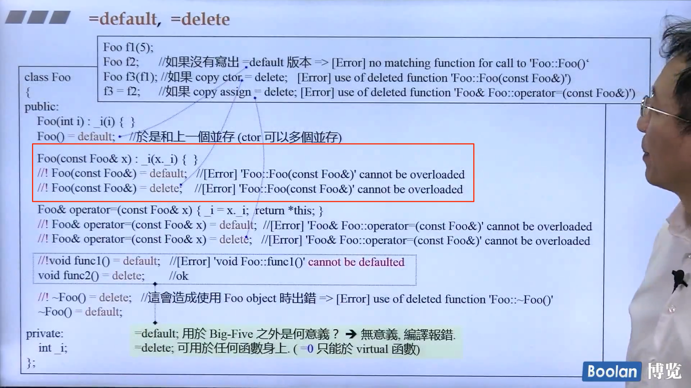
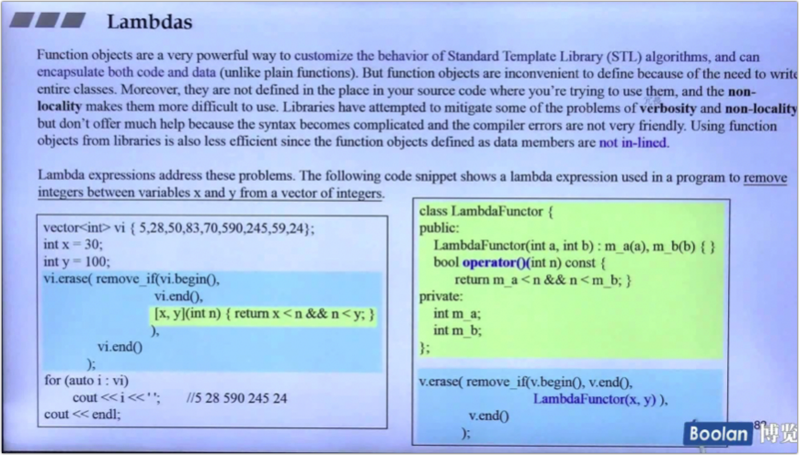
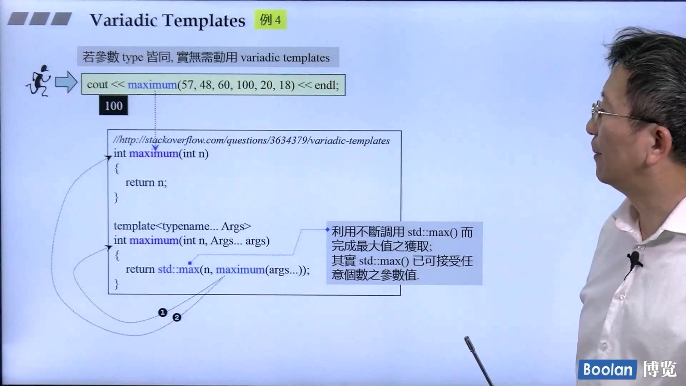
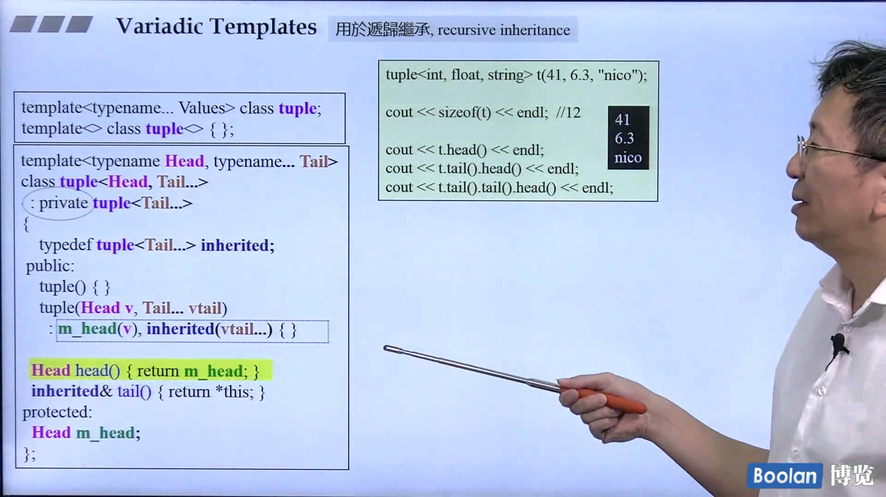

C++ Standard之演化

- C++98(1.0)
- C++ 03(TR1, Technical Report 1)
- C++11(20)
- C++14

Header files

重要网页

- [cplusplus.com](http://cplusplus.com)
- [cppreference.com](http://cppreference.com)
- [gcc.gnu.org](http://gcc.gnu.org)

怎样确定C++环境是否支持C++11呢？ 使用如下语句： 

cout << __cplusplus << endl; 

如果出现的头六位数是大于等于201103的，则支持C++11。 

# 第一讲 语言

## Variadic Templates 可变模板参数

很方便的完成递归调用

递归继承：tuple

## auto 关键字

## Uniform Initialization 

统一用大括号初始化，背后原理是通过initializer_list初始化

### initializer_list 

[std::initializer_list](https://en.cppreference.com/w/cpp/utility/initializer_list)

initializer_list 后面是array实现，但initializer_list只包含对这个array的迭代器（意味着拷贝initializer_list是浅拷贝）。这个临时array和生命周期和initializer_list 一样。 

标准库中所有容器都接受任意数量的值用于构建、赋值、insert()、assign()；一些算法max()、min()也接受任意数量值的参数。

## explicit关键字

2.0之前，explicit修饰的构造函数只能有一个参数。2.0支持多个。

例子：

## range-base for

使用单冒号来进行for循环遍历。

range-based for 里可以做隐式转换。

## =default， =delete 

=default要的是编译器给的default ctor，=delete是不要对应的ctor，Zoo(const Zoo&)=delete是说不要拷贝构造，Zoo(const Zoo&&)=default是说要编译器默认给我的那一个。

例子：

empty class的默认函数（默认的构造函数，拷贝构造，拷贝赋值以及析构函数，都是public并且是inline的）

NoCopy ：不允许外界去拷贝这个类的对象

PrivateCopy：把拷贝构造和拷贝赋值放入了private里面，这限制了访问这两个函数的使用者

## Alias Template 与 Template Template parameter 

Alias Template：先写template , 然后使用using命令设定别名模板，这样些可以自己设定类型以及容器的分配器。而使用define和typedef确不能达到效果。但别名模板有一个限制，不能进行偏特化

template template parameter

实现一个方法：传入容器和元素类型，并对容器内的元素做move和swap操作。

XCI接受两个参数，第一个是T，第二个是模板Container，然后就可以直接使用Container<T> c; 因为Container是一个模板，但再调用XCIs<Mystring, vector> c1;的时候，出现报错，原因是vector有两个模板参数，第二个模板参数（分配器）是默认的，但编译器不知道，这个时候就需要用到Alias Template了。

可以看到Alias Template不仅是少打几个字，还有减少模板参数个数以适配模板模板参数，非常有用处。

Type Alias是另一个typedef的写法，不过更加清晰，我们使用的string实则是basic_string的alias。

## using关键字

using的使用场景

## noexcept 关键字

noexcept是放在函数右括号后，宣称这个函数不会抛出异常，noexcept还可以接受条件。

 在使用vector和deque的移动构造的时候，如果移动构造没有加上noexcept，则容器扩容的时候不会调用移动构造，效率就会偏低（调用拷贝构造）

## override关键字

override用于虚函数，函数签名与父类相同即override。为了防止签名弄错导致实际没有override，可以在函数名称后加上override关键字，这样编译器会提示你没有override的对象。

## final关键字

用于表示类不可被继承或虚函数不可被override。

## decltype 

decltype与auto关键字一样，用于进行编译时类型推导。decltype的类型推导并不是像auto一样是从变量声明的初始化表达式获得变量的类型，而是总是**以一个普通表达式作为参数**，返回该表达式的类型,而且decltype并不会对表达式进行求值。

[C++11特性：decltype关键字](https://www.cnblogs.com/QG-whz/p/4952980.html)

**decltype的使用场景**

\#1 泛型编程中结合auto ，定义返回类型

\#2 与using/typedef合用，定义类型

\#3 推导表达式（如lambda）类型

## lambda表达式

利用 lambda 表达式可以编写内嵌的匿名函数，用以替换独立函数或者函数对象，并且使代码更可读。 

语法：

捕获列表和参数列表的区别：[Difference between capture and passing an argument in lambda functions](https://stackoverflow.com/questions/31038437/difference-between-capture-and-passing-an-argument-in-lambda-functions)

lambda类似于仿函数：

一些例子：

与auto、decltype的结合：

lambda典型用法：自定义STL库中的算法行为 。（与使用函数对象的对比）

## 再谈Variadic Template（可变模板参数） 

### 例子1：利用variadic template递归print

### 例子2：使用variadic template重写C语言的printf

### 例子3：用initializer_list实现max函数

参数个数不定，但类型相同，可以用initializer_list实现，不必用variadic template

###  例子4：variadic template递归实现maximum

###  例子5：以异于一般的方式处理first元素和last元素

### 例子6： 递归继承

不过上述的代码编译时不通过的，因为HEAD::type这个原因（比如int::type是没有的)。实际直接返回HEAD类型即可。

### 例子7：递归复合

与递归继承类似

## C++关键字列表

# 第二讲 标准库

## 右值引用

右值引用是C++引进的一种新的引用类型，用于减少不必要的拷贝。赋值语句的右边对象是一个右值时，左边的对象可以直接把右值“偷”过来，而不用单独开辟空间。 

左值和右值：[什么是 lvalue, rvalue, xvalue](https://cloud.tencent.com/developer/article/1493839)

C++ string + 号返回的是右值,为什么下面这段代码不报错? - htiga的回答 - 知乎 https://www.zhihu.com/question/42064282/answer/93429857

### **右值引用和std::move**

如图，Vtype(buf)产生一个临时对象，是右值，调用insert的右值方法，insert调用移动构造函数。移动构造函数中，不是对对象做拷贝，而是将右值对象的指针销毁，用新的指针指向该值。完成”偷“的过程。此后原右值对象不可再使用。如果左值也想调用insert的右值方法，用std::move将左值变成右值。std::move的目的是为了将它的参数通过通过引用传递出去，并且把它绑定看起来像一个右值。

### perfect forwarding 

参考：[Perfect Forwarding（完美转发）：解决方案 ](https://www.cnblogs.com/harrywong/p/perfect-forwarding-the-solution.html)

下图红圈中，传递的是右值，但是经过一个函数转发后，变成了左值。这叫做Unperfect forwarding。

实现perfect forwarding的方法：std::forward，将左值还是右值的信息传递出去。

### 写一个move aware class 

move aware 测试

结果如下，可以发现insert，调用copy constructor和move constructor，只对vector有较大影响。其他节点类结构都影响不大（因为节点类数据结构也是使用浅拷贝）。

而对于容器本身的copy和move copy对所有结构都有影响。原因是容器的copy实际会对每个元素都执行copy constructor，而move copy只会复制容器的三个指针。

## 容器

详见：[STL标准库和泛型编程](侯捷-STL标准库和泛型编程.md)

旧与新的比较

### Array

array是一种更安全、更容易使用的数组类型。与内置数组类似，array对象的大小是固定的。因此，array不支持添加和删除元素以及改变容器大小的操作。

### hashtable

当元素的个数大于buckets时，需要rehashing，将hash表的buckets进行增大，一般是两倍大左右的质数，然后重新分配。

hash函数

## tuple 

variadic template

