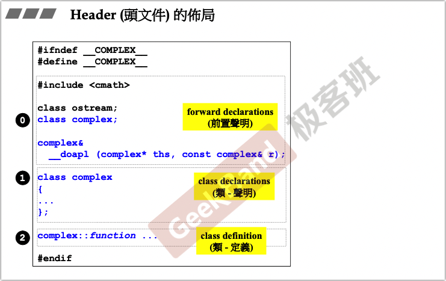
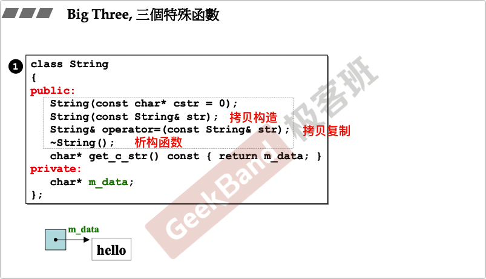
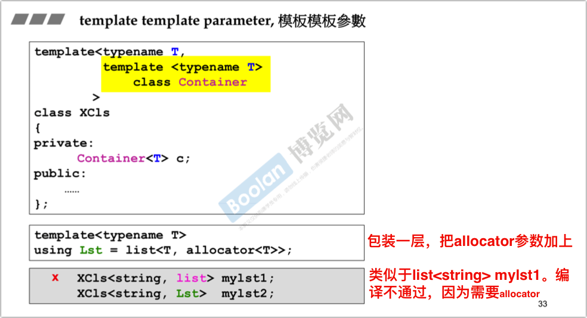
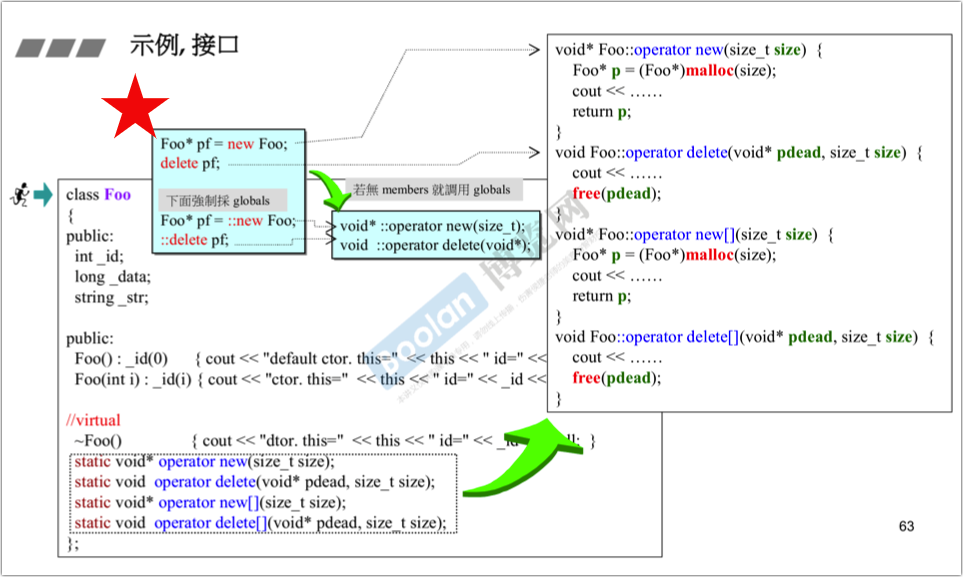

## Summary

上

- 例子1——不含指针的复数类：介绍C++头文件、类、构造函数、参数传递与操作符重载。
- 例子2——含指针的string类：介绍析构函数（释放动态内存）、拷贝构造/赋值（深拷贝）、new（先分配memory再调用ctor）/delete（先调用dtor再释放memory）；array new一定要搭配array delete。
- 类之间的关系：继承、复合、委托，其ctor和dtor的顺序关系，以及三种关系的组合。

下
- 类型转换与explicit使用
- 模板与STL、C++11新特性
# C++程序设计（上）

## 不含指针的例子：复数类

complex.h 、 complex-test.cpp

**Object Based(基于对象) vs Object Oriented(面向对象)** 

- Object Based:面向的是单一class的设计 

- Object Oriented:面对的是多重classes的设计，classes和classes之间的关系。 

### 头文件与类的声明

**C++ programs代码基本形式** 

**Header(头文件)中的防卫式声明** 

ifndef+define。（这样如果程序是第一次引用它，则定义，后续因为已经定义了，所以不会重复引用）。<u>你写的任何一个头文件都需要加这个防卫式声明。</u>

 **Header(头文件)的布局** 

- 前置声明
- 类声明
- 类定义

**class的声明(declaration)** 

**inline(内联)函数** 

### constructor(ctor,构造函数) 

**ctor (**構造函數**)** 可以有很多個 **– overloading (**重載**)** 

黄色标注的构造函数定义将出现问题，如果该函数与上面构造函数同时出现，在无参初始化该类对象时将产生冲突，因为第一个构造函数已经有参数默认初始化列表了，定义该类对象时可以不加入参数，这就产生了冲突。

**constructor (ctor,** 構造函數**)** 被放在 **private** 區 

单例模式。

1. 私有化它的构造函数，以防止外界创建单例类的对象；
2. 使用类的静态变量指向类的唯一实例；
3. 使用一个公有的静态成员函数获取该实例。

> 由于构造函数是私有的，class外部无法实例化对象。但class内部的静态成员函数可以，且静态函数可以被外部访问（通过类，不需要实例化对象）。

**const member functions (**常量 成員函數**)** 

在一个类中，如果成员函数中没有改变成员函数操作（例如get操作），那么建议在该方法声明处加入const关键字，如果不加入const关键字，那么c++编译器将认为该函数可能会修改类的成员变量。这样做有个好处，可以看到上图的"？！"一图，使用者利用了const关键字定义并通过构造函数初始化了一个complex类，这个类将不能被修改，只能读取属性。当使用者调用complex的real()或者imag()方法时，如果这两个方法在定义处没有加入const关键字，那么将报错。 

### 参数传递和返回值 

參數傳遞:**pass by value vs. pass by reference (to const)** 

建议使用传引用，可以加const防止引用被修改。

**返回值傳遞:return by value vs. return by reference (to const)** 

返回值尽量用引用。

**friend (**友元**)** 

类声明中用friend修饰的（非成员）函数，可以通过对象访问这个对象的私有成员。

 <u>相同 class 的各個 objects 互為 friends (友元)</u> 

### 操作符重载与临时对象

operator overloading (操作符重載-1, 成員函數) 

class body 之外的各種定義 (definitions) 

operator overloading (操作符重載-2, 非成員函數) 

临时对象

## 含指针的例子：string类

3个特殊函数

### 析构函数

<u>含指针的类，构造函数里多半要动态分配，必须在析构函数里手动释放。</u>

<u>只要含有指针的类，必须实现拷贝构造和拷贝赋值函数。因为默认拷贝的是指针，而不是指针的内容。——浅拷贝。</u>

### 拷贝构造

深拷贝 

### 拷贝赋值

### 所謂 stack (棧), 所謂 heap (堆) 

**new**:先分配 **memory,** 再調用 **ctor** 

面向对象的程序设计语言倾向于对象一定要经过初始化后，使用起来才比较安全。因此，引入了构造函数（constructor）的概念，用于对对象进行自动初始化。

> http://c.biancheng.net/view/149.html 
>
> C++ 析构函数问题？ - 邱昊宇的回答 - 知乎 https://www.zhihu.com/question/37762784/answer/73472884

**delete**:先調用 **dtor,** 再釋放 **memory** 

**array new** 一定要搭配 **array delete** 

進一步補充:**static** 

static 成员变量必须在类声明的外部初始化，初始化时才分配内存。

static 成员变量既可以通过对象来访问，也可以通过类来访问。

静态成员函数只能访问静态成员数据、其他静态成员函数和类外部的其他函数。

> —— http://c.biancheng.net/cpp/biancheng/view/209.html 
>
> ——C++ 类中的static成员的初始化和特点 https://blog.csdn.net/men_wen/article/details/64443040 

進一步補充: 把 ctors 放在 private 區 

進一步補充:**function template,** 函數模板 

進一步補充:**namespace** 

更多細節與深入 

## 面向对象

•Inheritance (繼承) 

•Composition (複合) 

•Delegation (委托)

### Composition (複合), 表示 has-a 

**Adapter** 

**Composition (**複合**)** 關係下的構造和析構 

### Delegation(委託). Composition by reference. 

pImpl：Handle-Body结构，可用于reference counting等。

### Inheritance (繼承), 表示 is-a 

**Inheritance (**繼承**)** 關係下的構造和析構 

base class 的 dtor 必須是 virtual， 否則會出現 undefined behavior 

**Inheritance (**繼承**) with virtual functions (**虛函數**)** 

<u>只有虚函数可以被覆盖</u>

**Inheritance+Composition** 關係下的構造和析構 

**Delegation (**委託**) + Inheritance (**繼承**)** 

subject-observer:每一个窗口都是一个observer，subject委托observer进行更新。

写一个文件/窗口系统，层级系统。该如何设计和关联class？

- Primitive ：文件
- Composite ：目录。

Composite 可以是Primitive的组合，也可以是自身的组合。为了实现这一点，为Composite和Primitive设计一个公共的父类Component。

Prototype

The Prototype design pattern solves problems like: 

- How can objects be created so that which objects to create can be specified at run-time?
- How can dynamically loaded classes be instantiated?

- 想要创建未来才会出现的子类（下面是派生的子类）。

- 子类中，安排一个静态对象（_LAST）,然后把它放到父类之前开辟出的一个空间中，这样父类就可以看到新创建的子类。
- 这个静态对象创建的时候，调用自己私有的构造函数，调用addPrototype，这样就把自己放到了父类中。
- 子类中，还需要准备一个clone函数。这样父类就可以通过调用clone方法来创建这种子类的副本。

Image代码：

LandSatImage代码：

# C++程序设计（下）

## **转换函数**

conversion function

**隐式转换**

同时存在conversion function和non-explicit-one-argument，编译器不知道取哪个（把分数转为double还是把double转为分数）

**显式转换**：构造函数加上explicit。这样在上面两条路径中强制使用double转分数。

explicit使用场景比较少，主要就是这种场景。

## pointer-like classes

<u>智能指针 ：完成比指针更多的工作。一般都是包着一层普通指针。</u>

**关于迭代器**

<u>迭代器这种智能指针还需要处理++，--等符号。</u>

*表示取data

## function-like classes 仿函数

设计一个class，行为像一个函数，即仿函数。 重载()操作符，使得class调用得像function一样。 

**标准库中，仿函数使用的奇特的base classes**

为什么要继承这个，在标准库课程中再介绍。

## 模板

类模板、函数模板之前说过了。

### 成员模板

常用于标准库中，类是一个模板，其中的某个成员也是一个模板。例子就是，可以使用<鲫鱼，麻雀>对象来构造一个<鱼类，鸟类>的pair。

智能指针也是一样的设计，为了让子类指针构造父类指针对象。

### specialization特化

<u>模板是泛化，指定特定类型即特化</u>。模板为什么要特化，因为编译器认为，对于特定的类型，如果你能对某一功能更好的实现，那么就该听你的。

**偏特化**

第一种，模板参数个数上的偏特化（特化模板参数中的一个或多个）。第二种，范围上的偏特化（特化模板参数的范围，如把模板参数特化为指针）。

### **模板模板参数**

模板中的一个模板参数也为模板。

智能指针的例子：

 

## 关于C++标准库

容器、迭代器、算法。

## C++11新特性

介绍3个内容，其他内容在C++ 11新课程中。[C++新标准C++11&14](侯捷-C++新标准C++11&14.md)

### variadic templates 可变模板参数

### auto关键字

语法糖，编译器自动匹配返回类型

### range-base for

使用单冒号来进行for循环遍历。

### reference引用

> 简谈 C++ 中指针与引用的底层实现 - 政子的文章 - 知乎 https://zhuanlan.zhihu.com/p/89175296 

引用通常用于参数类型和返回值类型，引用不是函数签名的一部分。

## 对象模型 Object Model

1. 语言中直接支持面向对象程序设计的部分
2. 对于各种支持的底层实现机制

> 参考：[C++对象模型 ](https://mikeblog.top/2019/02/15/C-对象模型/)

### vptr和vtbl

C++ 多态意味着调用成员函数时，会根据调用函数的对象的类型来执行不同的函数。

动态绑定：接口的实现由派生类完全覆盖。 就是说原本声明的类型是基类B,但是调用函数的时候执行的却是不同派生类(由初始化或者赋值的时候定义)D的函数。

比如，要定义一个不同子类的集合，由于集合中元素类型必须一样，因此只能转换为基类类型，但是调用这些元素的时候，是调用子类的函数。

动态绑定实现了多态，实现条件为

1. 通过基类的引用或指针调用
2. 调用的是虚函数

静态绑定和动态绑定的汇编实现

### 关于this pointer

通过子类对象调用函数时，实际是把自己的this指针传递给函数，如果该函数是虚函数，则会通过动态绑定找到子类对象的实现函数。

## 浅谈const

当const成员函数和non-const成员函数同时存在的时候，const object只能调用const成员函数，non-const object只能调用non-const成员函数。

## 重载new、delete

<u>new和delete表达式无法重载，但是new和delete表达式调用的操作符（operator new、operator delete等）是可以重载的。</u>

<u>重载全局operator new、operator delete比较危险，可以在成员函数中重载。</u>

**示例**

前面加上::表示强制使用全局函数（而不是成员函数）

运行结果：

 

**重载new(), delete()**

placement new 定位new

代码

标准库string重载placement new的例子：扩充申请量

