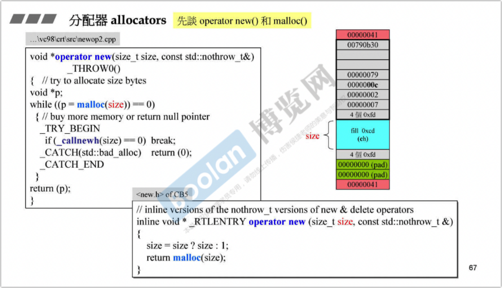
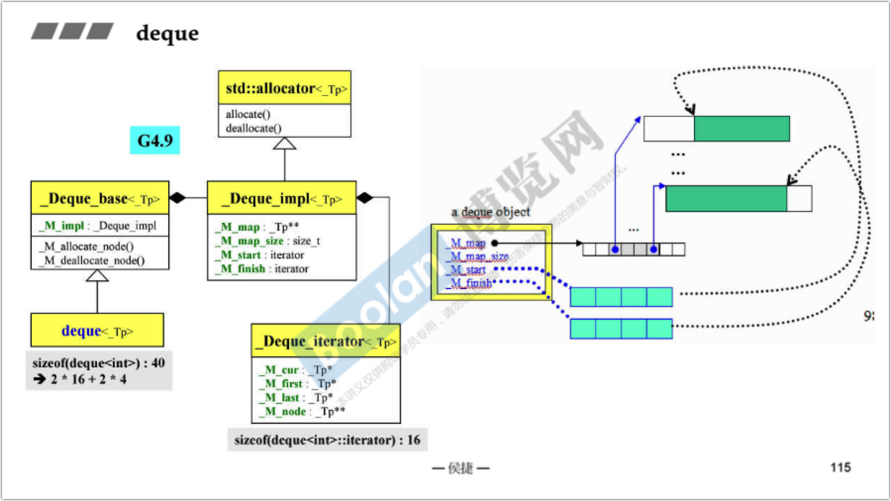
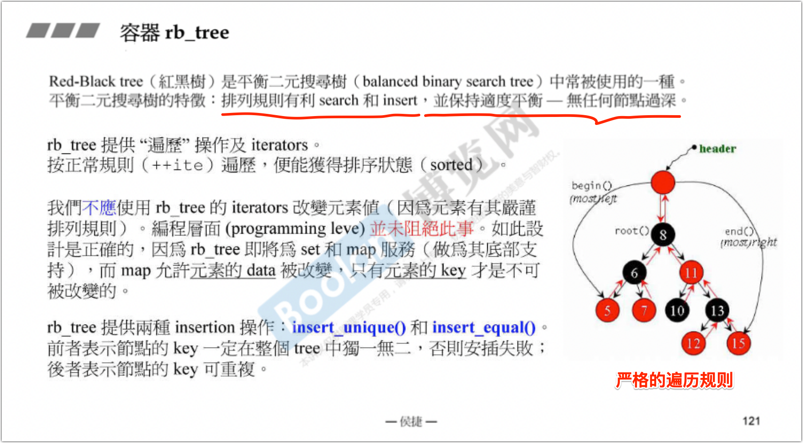
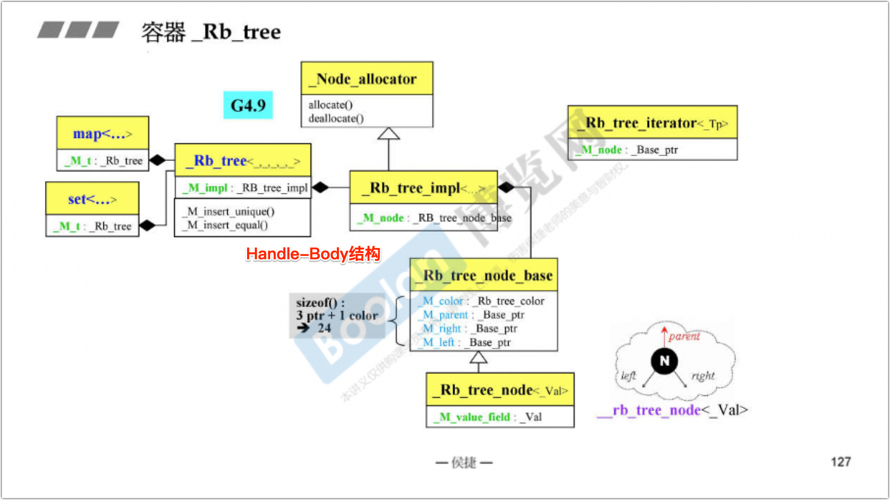
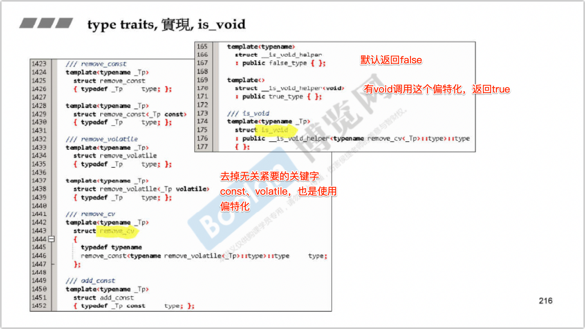

参考资料

- [侯捷C++课程笔记03: STL标准库与泛型编程 ](https://blog.csdn.net/ncepu_Chen/article/details/114947710)
- [C++STL 体系结构与内核分析(侯捷)——课程笔记 ](https://blog.csdn.net/onenyt/category_10056307.html)

C++标准库包括STL（六大部件）+ 其他小部件

# STL六大组件 

STL六大组件包括容器(container)、分配器(allocator)、算法(algorithm)、迭代器(iterator)、适配器(adapter)和仿函数(functor). 

容器container要放元素，元素需要分配内存（allocator）。对容器的一些标准操作（查找、排序等）就是算法algorithm。算法通过迭代器iterator来操作容器，迭代器是一种泛化的指针。仿函数functor为算法提供一些辅助功能，使其更通用。[适配器](https://www.cnblogs.com/Long-w/p/9830192.html)adapter用于将一种接口转换成另一种接口，从而是原本不兼容的接口能够很好地一起运作。

对容器元素的分配和操作不是放在同一个类中，说明STL不是面向对象编程模式，而是模板编程模式。

***\*前闭后开\****

STL中的区间遵循前闭后开的表示方式,迭代器begin指向的是第一个元素的起点,end指向的是最后一个元素的下一个元素.

## 容器 

STL中的容器大体分为***\*序列容器\****、***\*关联容器\****和***\*无序容器\****.

序列容器：

- Array(C++2.0)：固定的连续空间，具有数组的功能； 
- Vector：起点固定，后续空间会自动增长，内存由分配器处理，把元素放进vector会自动扩充空间（在当前空间大小不足时在G++4.9中两倍增长，在VC中1.5倍增长）。 
- Deque：在逻辑上前后空间均可扩充的一个容器，具体内存支持是基于一个由vector为容器的迭代器map实现的（将在第二章中介绍） 
- List：双向环状链表 
- Forward List(C++2.0)：单向链表 

关联容器（基于红黑树，方便查找，存在键值对的概念）：

- Set/Multiset：二叉树，Key与Value相同，即只有一个值。Set不允许相同元素插入，而Multiset允许重复元素。 
- Map/Multimap：二叉树，Key与 Value成对（pair）放入。Map不允许相同元素插入，而Multimap允许重复元素。 

无序容器（基于哈希表，碰撞处理采用拉链法，属于关联容器）：

- Unordered Set/Multiset：哈希表，Key与Value相同，即只有一个值。Set不允许相同元素插入，而Multiset允许重复元素。 
- Unordered Map/Multimap：哈希表，Key与 Value成对（pair）放入。Map不允许相同元素插入，而Multimap允许重复元素。 

stack和queue:

stack和queue底层是通过deque实现的，从设计模式上来说，这两种容器本质上是deque的适配器（container adapter）。stack是同一端进同一端出的线性表，具有先进后出的特点；queue是一端进一端出的线性表，具有先进先出的特点。本质上，stack和queue是操作受限的deque。 

这两个容器的元素进出是有严格顺序的，因此stack和queue不支持有关迭代器的操作；他们的插入和删除操作都是push()和pop()。 

multiset和multimap：

multiset和multimap底层是使用红黑树实现的。关联容器都具有放入速度稍慢，查找速度较快的特点。因为multimap支持重复的key，因此不能使用重载的[]运算符进行插入，而map因为不能装入同样元素，可以用[]来进行插入，具体说明见第二章。这两个容器的插入都使用的insert()操作，并且有容器内置的find()操作，查找速度较快。

unordered_multiset和unordered_multimap:

unordered_multiset和unordered_multimap底层是使用支持拉链法的hash表实现的。 

unordered_multiset和unordered_multimap的元素个数小于篮子数目，若元素数目达到篮子个数，则容器扩容，将篮子数组扩充约一倍。扩充时，里面的元素根据新空间的特性重新求hash值并打乱（详见第二章）。这俩也自带find()函数。 

既然无序容器和之前所学的关联式容器类似，那么在实际使用中应该选哪种容器呢？总的来说，实际场景中如果涉及大量遍历容器的操作，建议首选关联式容器；反之，如果更多的操作是通过键获取对应的值，则应首选无序容器。

## 初识分配器 

STL容器默认的分配器是std::allocator，除此之外gcc额外定义了几个分配器，其头文件均在目录ext下。gcc额外定义的分配器均位于__gnu_cxx命名空间下。容器中一般有默认的分配器，一般情况下无需单独使用分配器，而是和容器搭配使用。

# STL容器源码分析 

## OOP和GP 

OOP(Object-Oriented Programming)和GP(Generic Programming)是STL容器设计中使用的两种设计模式.

- **OOP的目的是将数据和方法绑定在一起**,例如对std::list容器进行排序要调用std::list::sort方法.
- **GP的目的是将数据和方法分离开来**,例如对std::vector容器进行排序要调用std::sort方法.

使用std::list::sort的理由是std::sort必须使用randomAccessIterator，而randomAccessIterator在list上效率很低。其他容器则不存在这个问题。

## 运算符重载、模板、特化 

运算符重载参考[C++文档相关部分](https://en.cppreference.com/w/cpp/language/operators)

list操作符重载示例

类模板、函数模板、成员模板

特化、偏特化

## 分配器allocator

operator new()调用了malloc()

VC6.0的默认分配器std::allocator只是对::operator new和::operator delete的简单封装，也就是调用了malloc和free。

BC5的分配器std::allocator与VC6.0的实现类似。

gcc2.9中的分配器std::allocator与VC6.0的实现类似,但std::allocator并非gcc2.9的默认分配器,观察容器源码,可以看到,gcc2.9的默认分配器为std::alloc.详见[C++内存管理机制](evernote:///view/15615241/s67/9b0fac40-7844-4e29-a565-bd984f0c1194/9b0fac40-7844-4e29-a565-bd984f0c1194/)

在gcc4.9以后,默认分配器变为std::allocator。gcc2.9中的std::alloc更名为__gnu_cxx::__pool_alloc.

## 容器 

STL容器的各实现类关系如下图所示,以缩排形式表示衍生关系(主要是***\*复合关系\****). 

## list

为实现前闭后开的特性,在环形链表末尾加入一个用以占位的空节点,并将迭代器list::end()指向该节点.

## 迭代器Iterator

《Design Patterns》中定义迭代器为：提供一种方法，使之能按序遍历某个容器的各个元素，又无需暴露该容器的内部表述方式。

**list's iterator ++ -- 操作**

**list's iterator \* -> 操作**

迭代器是一种 smart pointer，而指针中最常用的两个操作是 解引用（dereference）和成员访问（member access），所以迭代器需要重载 operator * 和 operator ->。

### trait 编程 

算法在使用迭代器时，可能会使用其关联类型（associated type），例如想声明一个 “迭代器所指对象的类型” 的临时变量。然而 C++ 只支持 sizeof()，不支持 typeof()。RTTI中的 typeid() 也不能拿来声明变量。这时候如何是好？

**Iterator需要遵循的原则**

Iterator必须提供iterator_category、value_type、difference_type、pointer和pointer5个关联类型(associated types),这些特征将被STL算法使用.

5个关联类型

***\*萃取器\****

如果iterator不是一个class，例如原生指针，就不能使用typedef来定义关联类型了，这个时候就在迭代器(指针)和算法之间加一个中间层萃取器(traits).

若traits接受的是class，那么使用typedef声明。如果是指针（如T*），则直接返回T。

**完整的iterator_traits**

traits 编程技巧大量运用于 STL 中，其利用内嵌类型和参数推导，增强了 C++ 对于类型认证方面的能力，弥补了 C++ 不为强类型语言的遗憾。

## vector

容器vector的迭代器start指向第一个元素,迭代器finish指向最后一个元素的下一个元素,这两个迭代器对应begin()和end()的返回值,维持了前闭后开的特性.

vector对使用者是连续的,因此重载了[]运算符.

vector的实现也是连续的,因此使用指针类型做迭代器(即迭代器vector<T>::iterator的实际类型是原生指针T*).

vector::push_back方法先判断内存空间是否满,若内存空间不满则直接插入;若内存空间满则调用insert_aux函数先扩容两倍再插入元素.

## array

将数组封装成容器array是为了使之与STL算法兼容,其内部实现只是简单封装了一下数组,甚至没有构造函数和析构函数.与vector一样使用原生指针做迭代器.

## forward_list

和list类似

## deque

容器deque内部是分段连续的,对使用者表现为连续的.deque::map的类型为二重指针T**,称为控制中心,其中每个元素是一个指针，指向一个buffer.

迭代器deque::iterator的核心字段是4个指针:cur指向当前元素、first和last分别指向当前buffer的开始和末尾、node指向控制中心.通过控制中心可以跳到下一个buffer。

- deque::insert方法先判断插入元素在容器的前半部分还是后半部分,再将数据往比较短的那一半推.
- 迭代器deque::iterator模拟空间的连续性.

## queue和stack

容器queue和stack作为deque的适配器(adapter),其内部均默认封装了一个deque作为底层容器,通过该deque执行具体操作.

- 容器queue和stack的元素进出是严格有序的,因此两个容器都不允许遍历,其内部没有定义iterator.
- 实际上queue和stack的底层容器也可以指定为list;stack的底层容器也可以指定为vector,这些底层容器均实现了queue和stack内部用到的方法.

## rbtree

容器rb_tree封装了红黑树,是有序容器,提供了迭代器iterator用以遍历,但不应使用iterator直接改变元素值，虽然编程层面并没有禁止这样做。

rb_tree提供两种插入操作:insert_unique和insert_equal,前者表示节点的key一定在整棵树中独一无二,否则插入失败;后者表示节点的key可重复.

对于rb_tree,定义一个概念:节点的value包括其key和data,这里的data表示一般说法中的value.

**五个模板参数**

Key就是Key，节点的大小关系是按Key排的；Value是整个node，而不是key对应的data，比如对于map来说，Value就是个pair；KeyOfValue代表如何从Value中提取出Key，也就是一个可调用对象的类型，传入一个Value，返回对应的Key；Compare就是比较Key的可调用对象的类型；分配器就不多说了。

***\*三个成员\****

node_count表示节点的个数，key_compare就是个可调用对象，重点说一下header。header就是一个指向rb_tree_node的指针，rb_tree_node表示红黑树的节点类型，里面包含一个value对象，以及指向parent，left和right的指针。而这个header指向的节点是一个额外节点，它的存在完全是为了方便程序实现，里面没有成员，它的parent指向红黑树真正的根节点(根节点的parent也指向它)，另外两个指针指向的是begin()和end()。整个红黑树的结构，以及一个node的结构，如下图所示：

调用示例：

class结构：

**桥接模式（Handle-Body模式）** 

解决这个问题的技术叫句柄类（ handle classes）。有关实现的任何东西都消失了，只剩一个单一的指针“m_pThis”。该指针指向一个结构，该结构的定义与其所有的成员函数的定义一样出现在实现文件中。这样，只要接口部分不改变，头文件就不需变动。而实现部分可以按需要任意更动，完成后只要对实现文件进行重新编译，然后再连接到项目中。 

—— https://blog.csdn.net/yockie/article/details/52628842 

## set和multiset

容器set和multiset以rb_tree为底层容器,因此其中元素是有序的,排序的依据是key.set和multiset元素的value和key是同一个.

set和multiset提供迭代器iterator用以顺序遍历容器,但无法使用iterator改变元素值,因为set和multiset使用的是内部rb_tree的const_iterator.

set元素的key必須独一无二,因此其insert()调用的是内部rb_tree的insert_unique()方法;multiset元素的key可以重复,因此其insert()调用的是内部rb_tree的insert_equal()方法.

## map和multimap 

容器map和multimap以rb_tree为底层容器,因此其中元素是有序的,排序的依据是key.

map和multimap提供迭代器iterator用以顺序遍历容器.无法使用iterator改变元素的key,但可以用它来改变元素的data,因为map和multimap内部自动将key的类型设为const.

map元素的key必須独一无二,因此其insert()调用的是内部rb_tree的insert_unique()方法;multimap元素的key可以重复,因此其insert()调用的是内部rb_tree的insert_equal()方法.

map容器重载的[]运算符返回对应data的引用，可以使用它获得指定key的value引用，或者修改、创建这个key对应的value。由于红黑树已经是排序了，[]运算通过二分查找value。

## hashtable

散列是一种算法（通过散列函数），将大型可变长度数据集映射为固定长度的较小整数数据集。在插入的时候就可能产生冲突，hashtable使用散列表解决元素冲突。

hashtable最开始只有53个桶,当元素个数大于桶的个数时,桶的数目扩大为最接近当前桶数两倍的质数,实际上,桶数目的增长顺序被写死在代码里。

示例：

### hash-function, hash code

对不同类型的元素，使用不同的hash function，这个通过偏特化区分。比如char *：

## unordered_set、unordered_multiset、unordered_map和unordered_multimap

C++11引入的容器unordered_set、unordered_multiset、unordered_map和unordered_multimap更名自gcc2.9的容器hash_set、hash_multiset、hash_map和hash_multimap,其底层封装了hashtable.用法与set、multiset、map和multimap类似.

# STL算法源码分析 

## 迭代器的类型 

一共有五种iterator_category，每种category都是一个class，并且它们之间还存在一些继承关系，如下图所示：

### **各种容器的iterator的iterator_category**

- 容器array、vector、deque对使用者来说是连续空间,是可以跳跃的,其迭代器是random_access_iterator类型.
- 容器list是双向链表,容器set、map、multiset、multimap本身是有序的,他们的迭代器都可以双向移动,因此是bidirectional_iterator类型.
- 容器forward_list是单向链表,容器unordered_set、unordered_map、unordered_multiset、unordered_map哈希表中的每个桶都是单向链表.因此其迭代器只能单向移动,因此是forward_iterator类型.
- 迭代器istream_iterator和ostream_iterator本质上是迭代器,后文会提到这两个类的源码.

### **iterator_category和type_traits对算法的影响** 

算法的效率和迭代器的类型有很大关系

**distance()函数**

用来求解两个迭代器之间的距离。所以当迭代器是随机访问迭代器时，距离可以直接相减得到，其他情况需要依次遍历。

**advance()函数**

将一个迭代器向前移动n步，如果是随机访问迭代器可以直接得到，如果是双向迭代器还要注意n的正负代表了移动的方向。

**copy(first, last, destination_start)函数**

(1) 先对copy()函数定义重载版本，如果传入的类型为某些特定类型(如图所示)，就调用较快的C的库函数。

(2) 对传入的迭代器也要进行一些判断，通过iterator traits分辨出作为class的迭代器和普通指针，如果是作为class的迭代器，通过iterator_category判断是否为随机访问迭代器，如果是的话就可以优化copy动作(用n决定循环次数)，如果不是，就要使用迭代器作为循环变量进行拷贝。

(3) 在(2)中如果iterator_traits分辨出的是普通指针，那么就要通过type traits判断指针指向的对象有没有non-trival的拷贝赋值运算符，如果没有说明对象是基本类型或者是由基本类型组成的简单class，就会调用C的库函数；如果有的话，就需要迭代进行拷贝赋值操作，当然可以用n作为循环变量，因为迭代器是普通指针。

***\*destroy()函数\****

***\*__unique_copy()对于output_iterator_tag的特殊处理\****

因为output_iterator_tag是只能写的，不能读取，所以要针对这个版本做特殊处理 

**算法源码中对iterator_category的暗示**

可能有某些函数只能接受某些类型的迭代器，就比如说sort()只接受随机访问迭代器，但是在语法上(函数模板的语法)不禁止传入其他类型的迭代器，但是在源码中会把模板参数的名字命名为相应的迭代器类型，起到提醒使用者的目的。

## 算法示例

一般来说，算法是个函数模板，具有类似以下的格式：

template<typename Iterator> Algorithm(Iterator itr1, Iterator itr2) {   // ... } template<typename Iterator, typename Cmp> Algorithm(Iterator itr1, Iterator itr2, Cmp comp) {   // ... }

### accumulate

算法accumulate的默认运算是+,但是重载版本允许自定义运算,支持所有容器

### for_each

对一个范围内的元素做某种操作。该函数会返回一个值，但这个返回值会被忽略。还要注意不能通过迭代器修改元素的值，因为输入的是InputIterator，只读不能写。

C++11中引入了新的range-based for语句实现类似的功能。

### replace、replace_if、replace_copy

- 算法replace将范围内所有等于old_value的元素都用new_value取代.
- 算法replace_if将范围内所有满足pred()为true的元素都用new_value取代.
- 算法replace_copy将范围内所有等于old_value的元素都以new_value放入新区间,不等于old_value的元素以原值放入新区间.

### count、count_if

- 算法count计算范围内等于value的元素个数.
- 算法count_if计算范围内所有满足pred()为true的元素个数.

它们支持所有容器,但关联型容器(set、map、multiset、multimap、unordered_set、unordered_map、unordered_multiset和unordered_map)含有更高效的count方法,不应使用STL中的count函数.

### find、find_if

- 算法find查找范围内第一个等于value的元素.
- 算法find_if查找范围内第一个满足pred()为true的元素.

它们支持所有容器,但关联型容器(set、map、multiset、multimap、unordered_set、unordered_map、unordered_multiset和unordered_map)含有更高效的find方法,不应使用STL中的find函数.

### sort

- 算法sort暗示参数为random_access_iterator_tag类型迭代器,因此该算法只支持容器array、vector和deque.
- 容器list和forward_list含有sort方法.
- 容器set、map、multiset、multimap本身是有序的,容器unordered_set、unordered_map、unordered_multiset和unordered_map本身是无序的,不需要排序.

上面程序中的rbegin和rend是迭代器适配器,生成一个逆向增长的迭代器,后文会提到这两个类的源码.

### binary_search

- 算法binary_search从排好序的区间内查找元素value,支持所有可排序的容器.
- 算法binary_search内部调用了算法lower_bound,使用二分查找方式查询元素.
- 算法lower_bound和upper_bound分别返回对应元素的第一个和最后一个可插入位置.
- 可能出现target不存在的情况，这时返回的要么是begin()要么是end()，然后再进行一下和头元素或尾元素的大小判断就能知道target是否存在了。

# STL仿函数源码分析 

仿函数是一类重载了()运算符的类,其对象可当作函数来使用,常被用做STL算法的参数. STL中有三类仿函数，算术类、逻辑类和相对关系类。比如判断大小仿函数、accumulate的累计算仿函数等。

STL的所有仿函数都必须继承自基类unary_function或binary_function,这两个基类定义了一系列关联类型,这些关联类型可**被STL适配器使用**.为了扩展性,我们自己写的仿函数也应当继承自这两个基类之一.

binary_function其实只是赋予了仿函数一堆typedef，当适配一个仿函数的时候，适配器会去“问”仿函数一些问题（参数类型和返回值类型），只有继承了这些typedef的仿函数能够回答这些问题，后面正式将适配器我们会看到这些例子。

还有一些GNU C++自带，但非标准库的仿函数，如identity、select1st、select2nd等。

# STL适配器源码分析 

把已存在的东西做一下改造，比如函数参数个数，改函数名称等。A对B做一下改造，但实际是调用B的功能，A是使用者和B之间的桥梁。

分为容器适配器、函数适配器、迭代器适配器、ostream和istream的适配器。

## 容器适配器 

之前提到过的stack，queue都是容器适配器，都是内含一个真正“做事”的容器

## 函数适配器 

### **bind2nd**

bind2nd就是一种仿函数适配器，功能是将仿函数的第二个参数绑定为特定值。比如less的参数(x,y)的y指定为40，得到一个x<40的新的仿函数。bind2nd是binder2nd的包装函数。

### not1

仿函数适配器unary_negate将仿函数的结果取反,生成新的仿函数

### bind

自C++11以来，bind1st，bind2nd，binder1st，binder2nd这些其实都已经被一个叫bind的函数所取代。

函数bind要和命名空间std::placeholders中的占位符_1、_2、_3…等占位符配合使用.bind函数可以绑定:

- 函数和函数对象.
- 成员函数(绑定成员函数时占位符_1必须是该类对象的地址).
- 成员变量(绑定成员变量时占位符_1必须是该类对象的地址).

## 迭代器适配器 

### 逆向迭代器reverse_iterator

容器的rbegin()和rend()方法返回逆向迭代器reverse_iterator,逆向迭代器的方向与原始迭代器相反.

逆向迭代器适配器reverse_iterator与正常迭代器的方向正好相反:逆向迭代器的尾(头)就是正向迭代器的头(尾);逆向迭代器的加(减)运算就是正向迭代器的减(加)运算.

### 

### 用于插入的迭代器 inserter

迭代器适配器insert_iterator生成用于原地插入运算的迭代器,使用insert_iterator迭代器插入元素时,就将原有位置的元素向后推.

inserter重载了operator=()，在不改变copy函数的代码的情况下，改变copy()中使用的运算的逻辑

### 输出流迭代器 ostream_iterator

ostream_iterator和istream_iterator不是指向容器的iterator，也不属于以上三种adapter。常用于封装std::cout和std::cin。

和inserter类似，ostream_iterator重载了*、=、++等操作符。在不改变copy函数的代码的情况下，改变copy()中使用的运算的逻辑。下面程序将容器中元素输出到std::cout中

### 输入流迭代器istream_iterator

输入流迭代器istream_iterator用于封装std::cin,下面程序从std::in中读取数据:

# 标准库其它话题 

## 一个万用的hash function 

标准库(是标准库还是GNU提供的我记不清了)提供了一个叫hash_val的函数，可以计算出由基本类型组成的class的hash值，原理是使用了可变模板参数，递归计算参数的hash值并combine到一起：

## 容器tuple

tuple（元组）是一个固定大小的不同类型值的集合，是泛化的std::pair。我们也可以把他当做一个通用的结构体来用，不需要创建结构体又获取结构体的特征，在某些情况下可以取代结构体使程序更简洁，直观。std::tuple理论上可以有无数个任意类型的成员变量，而std::pair只能是2个成员，因此在需要保存3个及以上的数据时就需要使用tuple元组了。

容器tuple的源码使用可变模板参数,递归调用不同模板参数的tuple构造函数,以处理任意多的元素类型.

调用head函数返回的是元素m_head的值.

调用tail函数返回父类成分的起点,通过强制转换将当前tuple转换为父类tuple,丢弃了元素m_head所占内存.

## type traits 

类型萃取机制(type traits)获取与类有关的信息,在C++11之前和C++11中分别由不同的实现方式.

在C++11之前,类型萃取机制是由__type_traits实现的.我们每创建一个类,就要以该类为模板参数特化一个__type_traits类.

template<class type> struct __type_traits {   typedef __false_type has_trivial_default_constructor;  // 默认构造函数是否可忽略   typedef __false_type has_trivial_copy_constructor;   // 拷贝构造函数是否可忽略   typedef __false_type has_trivial_assignment_operator;  // 赋值函数是否可忽略   typedef __false_type has_trivial_destructor;      // 析构函数是否可忽略   typedef __false_type is_POD_type;            // 是否是POD(plain old data)类型 }; template<> struct __type_traits<int> {   typedef __true_type has_trivial_default_constructor;   typedef __true_type has_trivial_copy_constructor;   typedef __true_type has_trivial_assignment_operator;   typedef __true_type has_trivial_destructor;   typedef __true_type is_POD_type; }; template<> struct __type_traits<double> {   typedef __true_type has_trivial_default_constructor;   typedef __true_type has_trivial_copy_constructor;   typedef __true_type has_trivial_assignment_operator;   typedef __true_type has_trivial_destructor;   typedef __true_type is_POD_type; }; struct __true_type { /*...*/ }; struct __false_type { /*...*/ };

这种实现方式比较麻烦,因此C++11以一种新的方式引入type traits机制. C++11在头文件type_traits中引入了一系列辅助类,这些辅助类能根据传入的模板参数自动进行获取该类的基本信息,实现类型萃取,并不需要我们为自己创建的类手动编写类型萃取信息.[官方网站](https://www.cplusplus.com/reference/type_traits)上列出了所有用于类型萃取的辅助函数。

一些简单的type traits，比如is_void，is_integral，实现的原理基本是对基本类型定义特化版本。但一些复杂一点的，比如说is_class，is_union等等，在源代码中找不到它们的实现方式，所以猜想大部分type traits不以源代码的形式实现，可能采用了更加底层的方式，毕竟上述问题的答案编译器一定是知道的。

以is_void为例：

## cout 

cout实现了对各种类型的操作符重载，所以可以接受任意类型作为输出参数。

## 