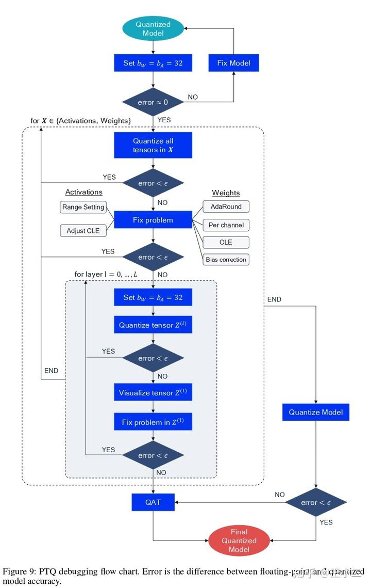

注：这里略去了Google论文中已经提到的量化基础内容，仅记录本论文（高通）提出的新技术和实践经验。

## 1、摘要和绪论

在这篇白皮书中我们介绍了最先进的神经网络量化技术。我们首先从硬件驱动出发介绍量化，然后考虑两种不同的量化方法：训练后量化(PTQ)和量化感知训练(QAT)。对于这两种方案，我们在现有文献和大量的实验基础上提出了一种标准的流程，在计算机视觉(CV)和自然语言处理(NLP)中都取得了最佳的性能。同时我们还提供了一个调试流程来解决量化过程中会碰到的一些常见问题。

## 2、量化的一些基础知识

### 2.2、均匀仿射量化(Uniform affine quantization)

量化范围的极限(qmin, qmax)，其中$qmin = -sz，qmax = s(2^b -1 -z)$。任何超过这个范围的输入x都将会被截断到这个范围内这个操作会导致一个<u>截断误差(clipping error)</u>。如果我们想减少截断误差，可以通过<u>增大比例因子s</u>从而扩大量化范围的方法来实现。然而增大比例因子s会导致<u>舍入误差(rounding error)</u>增加，因为舍入误差的范围是$[-½s, ½s]$。

#### 2.2.2、二次幂量化(Power-of-two quantizer)

二次幂量化是对称量化的一个特例，其中比例因子被限制为二次幂，$s = 2^{-k}$。<u>这种选择可以提升硬件的计算效率，因为s的缩放操作对应于简单的位移</u>。然而比例因子s的限制性表达可能会使截断误差和舍入误差之间的权衡变得复杂。

#### 2.2.3、量化粒度(Quantization granularity)

其它工作采用了比per channel更细粒度的量化方案，使用按组(per group)对权重或者激活进行量化。增加组的粒度通常可以提升量化的准确性，但是要额外付出一些计算开销。额外开销的多少和具体硬件对累加器的实现有关。目前大多数的定点累加器都不支持这类操作，因此本文中不会考虑这种量化方案。不过随着该领域的不断深入研究和发展，预计未来会有更多的硬件支持这类量化操作。

### 2.3、量化模拟(Quantization simulation)

为了测试神经网络在量化设备上的运行情况，我们经常在用于训练神经网络的通用硬件上模拟量化行为。这被称之为量化模拟(quantization simulation)。我们的目标是使用浮点硬件来近似定点操作。和在实际的硬件或者量化核上进行实验相比，这种模拟操作更容易实现。它允许用户更有效的测试各种量化选项，同时可以使用GPU加速量化感知训练。

#### 2.3.2、激活函数融合(Activation function fusing)

在2.1节介绍简单量化加速器的部分，我们看到重量化是在矩阵乘法或者卷积计算之后。然而在实际情况中，我们通常会有一个非线性操作（激活函数）紧跟在线性操作之后。将线性层的结果写回内存然后又加载到非线性层进行计算，这个操作是很浪费的。因此许多硬件方案都会在重量化之前就应用非线性操作。例如relu就很容易被重量化，因为你只需要将最小值设置为0即可。

其它更复杂的激活函数例如sigmoid或者swish则需要更多的专门的支持(一部分硬件对这类复杂的函数会采用泰勒展开，然后计算几次方以内的结果，还有的可能直接用查找表(LUT)来实现)，如果没有专门的支持那我们就需要在非线性操作之前和之后各自添加一个量化操作。这个操作可能会对模型的准确性产生比较大的影响，虽然像swish这类比较新颖的激活函数可能会提高一些浮点下的精度。但这部分提高可能会在量化后消失，或者是在定点硬件上部署时推理效率降低。

#### <u>2.3.3、其它层量化(Other layers and quantization)</u>

在神经网络中还有许多其他类型的层被使用。如何对这些层进行建模，在很大程度上取决于具体的硬件实现。有时模拟量化和目标性能之间的不匹配就是因为这些层没有被正确量化。在这里我们提供一些指导，说明如何为几个常用的层进行模拟量化。

**最大值池化(Max pooling)：**不需要激活量化，因为输入和输出的范围是一致的

**均值池化(Average pooling)：**整数的平均不一定是整数，因此需要在平均之后增加一个量化步骤。但是我们对输入和输出使用相同的量化器，因为求平均不会显著改变量化后值的范围。

**逐点相加(Element-wise addition)：**尽管计算行为很简单，但是这个操作确很难准确的进行模拟。在计算的时候两个输入的量化范围必须要完全匹配。如果输入的量化范围不匹配，就需要格外的注意才能确保计算能正确的执行。因此没有公认的解决方案。额外增加一个重量化可以粗略的模拟增加的误差或者噪声，另外一种方案是rescale多个输入从而实现一致的输入，这可以省去重量化步骤但是可能需要微调(fine-tuning)。

**连接(Concatenation)：**被连接的两个分支通常不共享量化参数，这意味着它们的量化范围不一定会重叠，因此重量化步骤可能是需要的。与逐点相加一样，你可以对网络进行优化(例如rescale)以使得多个连接分支使用相同的量化参数。

## 3、训练后量化(Post-training quantization)

PTQ过程中的一个基本步骤是为每个量化器找到良好的量化范围。我们在第2.2节简要讨论了量化范围的选择如何影响量化误差。在这一节中我们首先讨论了实践中用来寻找良好量化参数的各种常用方法。然后我们探讨在PTQ期间观察到的常见问题，并介绍克服这些问题最成功的技术。使用这些技术我们提出了一个标准的训练后量化(PTQ)流程，我们发现它在大多数常见情况下效果都是最好的，最后我们引入了一组调试步骤来提高量化模型的性能。

### <u>3.1、量化范围的设置(Quantization range setting)</u>

**Min-max** 最小-最大范围，为了覆盖张量的整个动态范围，我们可以定义量化参数如下：

其中 V 表示要量化的张量。这不会导致截断误差。但是这种方法对异常值很敏感，因为强异常值可能会导致过多的舍入误差(强异常值会使得量化步长偏大)。

**Mean squared error (MSE)** 均方误差(MSE)，缓解强离群值问题的一个方法是使用基于MSE的范围设置。在这种范围设置方法中，我们找到qmin和qmax，使原始张量和量化张量之间的MSE最小化。

其中$ \widehat{V}(qmin,qmax) $表示 V 的量化版本， $||.||_F$ 是 Frobenius 范数。优化问题通常使用网格搜索、黄金分割法或具有封闭形式解的解析近似来解决。文献中存在这种范围设定方法的几个变种，但它们在目标函数和优化方面都非常相似。

**Cross entropy** 交叉熵，对于某些层被量化的值可能并不同等重要。<u>其中一种情况是分类网络最后一层的logits量化，在这种情况下，必须保留量化后的相对大小顺序。这个时候MSE可能不是一个合适的衡量标准</u>，因为它对张量中的所有值进行了同等的权衡，而不管它们的顺序如何。对于大多数的类，我们通常会得到大量对预测准确性不那么重要的小对数或者是负对数，而有意义的大对数则会少很多。在这种情况下当MSE试图减少大量小对数误差的时，会对少量的大对数产生较大的量化误差。在这类特定情况下，最小化以下交叉熵损失函数是有益的。

其中 H(·,·) 表示交叉熵函数，ψ 是 softmax 函数，v 是 logits 向量。

**BN based range setting** 基于BN的范围设置，激活量化器的范围设置通常需要一些校准数据。如果一个层具有批量归一化操作，则激活的每通道均值和标准差分别等于学习的批量归一化偏移和缩放参数。这些值可以用来为激活量化器找到合适的参数，如下所示。

其中 β 和 γ 是每个通道学习的偏移和缩放参数的向量。并且α > 0，Nagel 等人(Data-free quantization through weight equalization and bias correction) 使用 α = 6，使得只有较大的异常值会被截断。

***Comparison*** 比较，在表1中，我们比较了权重量化的范围设置方法。对于高位宽，MSE和min-max方法基本持平。然而，<u>在较低的位宽下，MSE方法明显优于min-max</u>。在表2中，我们对激活量化进行了类似的比较。我们注意到，MSE与最后一层的交叉熵相结合，表示为MSE + Xent，优于其他方法，特别是在较低的位宽下。该表还清楚地表明了对最后一层使用交叉熵而不是MSE目标的好处。(权重bit用Wx表示，激活bit用Ax表示)

### 3.2、跨层均衡化(Cross-Layer Equalization)

weight equalization，顾名思义，就是对 weight 进行均衡化操作。为什么要有这个操作呢？因为高通研究人员在剖析 MobileNetV2 的时候发现，这个网络用 per-layer 量化精度下降极其严重，只有用上 per-channel 的时候才能挽救一下。具体实验数据出自 Google 的白皮书。我特意去翻了一下，发现还真是：

Mobilenet 类的网络在 per-layer 量化下，精度直接掉到 0.001 了，而同样作为小网络的 Nasnet 下降很小 (per-layer 精度一般是比 per-channel 低一些，但这么严重的精度下降，我怀疑是不是 Google 的程序员跑错代码了)。

为什么会有这种情况呢？原因在于 MobileNetV2 中用了大量的可分离卷积 (depthwise conv)，<u>这个卷积的特殊之处是每个 output channel 都只由一个 conv kernel 计算得到，换句话说，不同 channel 之间的数值是相互独立的。研究人员调查了某一层可分离卷积的 weight 数值，发现不同的卷积核，其数值分布相差非常大：</u>

纵坐标是数值分布，横坐标表示不同的卷积核。你会发现，有些 weight 的数值分布在 0 附近，有些数值范围就非常大。在这种情况下，<u>如果使用 per-layer 量化，那这些大范围的 weight 就会主导整体的数值分布，导致那些数值分布很小的 weight 在量化的时候直接压缩没了</u>。这也是为什么 per-channel 对可分离卷积效果更好的原因。

而 weight equalization 要做的事情，就是在使用 per-layer 量化的情况下，使用一些方法使得不同卷积核之间的数值分布能够均衡一些，让大家的数值分布都尽量接近，这样就可以用 per-layer 量化实现 per-channel 的精度 (毕竟 per-channel 实现上会比 per-layer 复杂一些)。

高通说他们实现这一步并不需要额外的数据，可以优雅地在 Data-Free 的情况下实现，这也是他们给论文起名 Data-Free 的缘由。

要实现 Weight Equalization，一个很直接的想法就是对卷积核的每个 kernel (或者是全连接层的每个权重通道) 都乘上一个缩放系数，对数值范围大的 kernel 进行缩小，范围小的则扩大。

>详见原文与参考资料

### 3.3、偏差校正(Bias correction)

除了 weight 的问题之外，研究人员发现，模型量化的时候总是会产生一种误差，这种误差对数值分布的形态影响不大，但却会使整个数值分布发生偏移 (biased)。这种偏差在每个输出通道只有几个元素(例如3x3卷积核，只有9个元素)的深度可分离卷积层中更加明显。导致这一误差的主要因素通常是截断误差，因为少数截断过大(离截断值太远的点)的异常值可能导致预期分布的改变。

用这个公式可以算出引入量化误差后的 feature map 上每个点和原先的相差了多少，统计一下这些误差，就得到下面这张图：

这里面蓝色的柱状图就统计了量化后的误差分布，看得出，有不少 feature 的误差已经超过了 1，而理想状态下，我们是希望量化后的误差能集中到 0 附近，越接近 0 越好，就像橙色直方图那样。

我自己画了幅简图描述这种现象：

研究人员发现，用上 weight equalization 后，这种 biased error 会更加地突出。而 Bias Correction 就是为了解决该问题提出的。

> 详见原文与参考资料

### 3.4、自适应取整(AdaRound)

神经网络的权重通常是通过将每个FP32值映射到最近的量化网格点来进行量化的。我们把这种量化策略称为 "四舍五入"。四舍五入策略的动机是，对于一个固定的量化网格，它在浮点权重和量化权重之间产生的MSE最小。然而Nagel发现<u>四舍五入在训练后量化权重时并不是最佳选择</u>。为了说明这一点，作者使用100个不同的随机舍入样本将ResNet18第一层的权重量化为4比特，并评估了每个舍入选择的网络性能。其中最好的舍入选择比四舍五入的表现要好10%以上。

我们发现一个这样的现象：四舍五入 (Nearest) 的效果要远远好于完全向上取整 (Ceil) 或者完全向下取整 (Floor)，但如果采用随机取整 (Stochastic，随机向上或向下取整)，效果虽然有大的波动，但确实存在超过四舍五入的情况，最好的实验结果甚至超过 10 个点还多。

作者提出了以下最终优化问题

其中ˆx是该层的输入，前面所有的层都被量化，fa是激活函数。(35)的目标可以使用随机梯度下降法进行有效和高效的优化。这种优化权重舍入的方法被称为AdaRound。

> 详见原文与参考资料

### 3.5、标准的PTQ流程(Standard PTQ pipeline)

在这一节中，我们根据相关文献和广泛的实验，提出了PTQ的最佳实践流程。我们在图8中说明了推荐的流程。这个流程为许多计算机视觉以及自然语言处理模型及任务实现了有竞争力的PTQ结果。根据不同的模型，有些步骤可能是不需要的，或者其他的选择可能会导致相同或更好的性能。

**Cross-layer equalization 跨层均衡** 首先我们应用跨层均衡化（CLE），这是一个对全精度模型的预处理步骤，使其对量化更加友好。<u>CLE对于具有深度可分离层的模型和按张量(per-tensor)量化特别重要，但它通常也显示出对其他层和量化选择的改进。</u>

**Add quantizers 添加量化器** 接下来，我们选择量化器并在我们的网络中添加量化操作，如 2.3 节所述。量化器的选择可能取决于特定的目标硬件；对于常见的 AI 加速器，<u>我们建议对**权重使用对称量化**，对**激活使用非对称量化**。如果硬件/软件堆栈支持，那么对**权重**使用按通道(per-channel)量化是有利的。</u>

**Weight range setting 权重范围设置** 为了设置所有权重张量的量化参数，<u>我们建议使用基于层(layer-wise)的MSE标准。在每个按道(per-channel)量化的特定情况下，使用min-max方法在某些情况下是有利的。</u>

**AdaRound 自适应舍入** <u>如果我们有一个小的校准数据集，接下来应用AdaRound，以优化权重的舍入。这一步对于在PTQ中实现低位权重量化（例如4位）至关重要。</u>

**Bias correction 偏差校正** <u>如果我们没有这样的校准数据集，而且网络使用了BN，我们可以使用分析性偏差校正来代替。</u>

**Activation range setting 激活范围设置** 作为最后一步，我们确定网络中所有数据相关张量的量化范围（即激活）。<u>我们对大多数层使用基于 MSE 的标准，这需要一个小的校准集来找到最小的 MSE 损失。或者我们可以使用基于 BN 的范围设置来拥有完全无数据依赖的流程(data-free pipeline)。</u>

### 3.6、实验(Experiments)

我们现在评估上述PTQ流程在常见的计算机视觉和自然语言理解应用上的性能。我们的结果总结在表6中。对于语义分割的任务，我们在Pascal VOC上评估了DeepLabV3（以MobileNetV2为骨干），对于物体检测，在COCO 2017上评估了EfficientDet。其余的计算机视觉模型是在ImageNet分类基准上评估的。对于自然语言理解，我们在GLUE基准上评估BERT-base。

在所有情况下，我们观察到权重和激活的8位量化（W8A8）与浮点相比所有模型的准确性都只有微小的损失（0.7%以内）。对于W8A8这种量化方式，我们也没有看到按通道(per-channel)有显著受益。然而当权重被量化为4比特（W4A8）时，情况发生了变化。对于ResNet18/50和InceptionV3来说，按张量(per-tensor)和按通道(per-channel)量化的准确率下降仍在1%以内。然而对于更高效的网络，例如 MobileNetV2 和 EfficientNet lite，按张量(per-tensor)量化的准确率下降分别增加到 2.5% 和 4.2%。这可能是由于深度可分离卷积的量化所致。在这种情况下按通道(per-channel)量化可以显示出显著的优势，例如在 EfficientNet lite 中，按通道(per-channel)量化与按张量(per-tensor)量化相比将准确度提高了 2.8%，使其量化精度在全精度准确度的 1.4% 以内。我们看到 EfficientDet-D1 和 DeeplabV3 (这里也许是想说EfficientNet lite)有类似的效果，它们都在其主干中使用了深度可分离卷积。

对于 BERT-base，我们观察到一些激活张量的动态范围存在极大差异。为了使 PTQ 仍然有效，我们使用第 3.7 节中概述的调试程序确定这些层，并将它们保持在 16 位。同时BERT-base 遵循与大多数其他模型类似的趋势，我们的PTQ流程允许在GLUE分数下降1.5%的情况下进行4位权重量化。

### 3.7、调试(Debugging)

我们展示了标准 PTQ 流程可以为各种模型和网络实现具有竞争力的结果。但如果按照我们的步骤执行后，模型的性能仍然不理想，我们建议采取一系列的诊断步骤来确定瓶颈并提高性能。虽然这不是严格意义上的算法，但这些调试步骤可以让人们了解量化模型表现不佳的原因，并帮助解决根本问题。这些步骤以流程图的形式显示在图9中，下面会有更详细的描述。

**FP32 sanity check** FP32合理性检查，一个重要的初始调试步骤是确保浮点模型和量化模型在前向传递中的行为相似，尤其是在使用自定义量化流程时。将权重和激活的量化模型位宽设置为 32 位，或者如果可能的话，绕过量化操作，并检查准确度是否与 FP32 模型的准确度匹配。

**Weights or activations quantization** 权重或激活量化，下一个调试步骤是确定激活或权重量化如何独立影响性能。如果所有权重都量化到更高的位宽，而激活保持在较低的位宽；或者相反，所有激活都使用高位宽而激活低位宽，性能是否会恢复？这一步可以显示激活和权重量化对整体性能下降的相对贡献，并为我们指明合适的解决方案。

**Fixing weight quantization** 固定权重量化，如果上一步显示权重量化确实导致精度下降，那么有几个解决方案可以尝试一下

- 如果尚未实施，请使用CLE，特别是对于具有深度可分离卷积的模型。
- 尝试按通道(per-channel)量化。这将解决每个通道权重分布不均匀的问题。
- 如果有校准数据，可应用偏差校正或AdaRound。

**Fixing activation quantization** 固定激活量化，为了减少激活量化的量化误差，我们可以尝试使用不同的范围设置方法或调整 CLE 以考虑激活量化范围，因为普通 CLE 会导致激活分布不均匀。

**Per-layer analysis** 按层分析，如果全局解决方案没有将精度恢复到可接受的水平，我们就单独考虑每个量化器。我们依次将每个量化器设置为目标位宽，同时将网络的其他部分保持在32位（见图9的内部for循环）。

**Visualizing layers** 可视化层，如果单个张量的量化导致精度大幅下降，我们建议在不同的粒度（如图5中的每通道 per-channel）和维度（如BERT中的标记per-token或嵌入per-embedding）上对张量分布进行可视化。

**Fixing individual quantizers** <u>固定个别量化器，可视化步骤可以揭示张量对量化敏感的来源。一些常见的解决方案包括为此量化器进行自定义范围设置或允许有问题的量化器设置更高的位宽</u>，例如表 6 中的 BERT-base。如果问题得到解决并且精度恢复，我们将继续进行下一个量化的工作。如果没有，我们可能不得不求助于其他方法，例如第 4 节中讨论的量化感知训练（QAT）。

完成上述步骤后，最后一步是将完整的模型量化到所需的位宽。如果精度可以接受，我们就有了最终的量化模型，可以使用。否则我们可以考虑更高的位宽和更小的颗粒度，或者恢复到更强大的量化方法，如量化感知训练(quantization-aware training QAT)。

## 4、量化感知训练Quantization-aware training

在本节中，我们将探讨反向传播如何在具有模拟量化的网络中工作，并为有效地使用 QAT 训练模型提供标准流程。我们还将讨论 QAT 中批量归一化折叠和按通道(per-channel)量化的影响，并提供广泛的任务和模型结果。

### 4.1 Simulating quantization for backward path 反向传播模拟

为了训练这样一个网络，我们需要通过模拟的量化器模块进行反向传播。这带来了一个问题，因为等式 (4) 中四舍五入运算的梯度处处为零或未定义，这使得基于梯度的训练无法正常进行。解决这个问题的一种方法是<u>使用直通估计器（straight-through estimator STE，Bengio et al. 2013）来近似梯度，它将舍入算子的梯度近似为 1。</u>

图 10 显示了用于量化感知训练的前向和后向传播的简单计算图。前向传播与图 4 相同，但在后向传播中，由于 STE 假设，我们有效地跳过了量化器模块。

在早期的 QAT 工作中，权重和激活值的量化范围在每次迭代时更新，最常用的是最小-最大(min-max)范围。<u>在最近的工作中，STE被用来计算量化参数z和s的梯度。</u>为了使用链式法则和STE，我们首先计算缩放系数s的梯度

在前面我们限制零点是一个整数。<u>为了使零点可学，我们将其转换为实数，并应用四舍五入运算</u>。修改后的量化函数被定义为

对Z的梯度是通过再次对四舍五入算子应用STE来计算的。

### 4.2 Batch normalization folding and QAT 批量归一化折叠和QAT

在第 2.3.1 节中，我们介绍了批量归一化折叠，它将缩放和偏移吸收到线性层中，以实现更有效的推理。在量化感知训练期间，我们希望尽可能模拟推理行为，这就是为什么我们必须在训练期间考虑到BN折叠的原因。请注意，在一些QAT文献中，BN折叠的影响被忽略了。虽然当我们采用按通道(per-channel)量化时（本节下面有更多内容）还不错，但为按张量(per-tensor)量化保持BN的展开将导致以下两种情况之一

1. BN层在推理过程中应用了按通道(per-channel)的重新缩放。
   在这种情况下，我们不如一开始就使用按通道(per-channel)量化。
2. 我们在部署期间将 BN 折叠到权重张量中，当我们训练网络以适应不同的量化噪声时，会导致潜在的显着精度下降。

在QAT中建立BN折叠模型的一个简单而有效的方法是将BN缩放和偏移量静态地折叠到线性层的权重和偏置中，正如我们在方程（11）和（12）中看到的那样。这相当于权重的重新参数化，并有效地从网络中完全删除了批量规范化操作。当从一个收敛的预训练模型开始时，静态折叠是非常有效的，我们可以从表7的结果看出。

Jacob等人的另一种方法既更新了QAT期间的运行统计，又使用了修正的BN折叠。这种方法更加繁琐并且计算成本也更高，因为它涉及到双重前向传递：一个是批量统计，一个是量化的线性操作。然而，根据我们的实验（见表7），尽管静态折叠法很简单，但它的表现与之相当或更好。

### 4.3 Initialization for QAT QAT的初始化

**Effect of CLE CLE的影响** 在表9中，我们比较了其他PTQ改进的效果，如CLE和偏差校正。虽然对于ResNet18来说，我们没有看到最终的QAT性能有明显的区别，<u>但对于MobileNetV2来说，我们观察到在没有CLE使就不能进行训练</u>。这可能是由于按张量(per-tensor)量化造成的灾难性性能下降，我们在第3.2节中讨论了这一点。总之，<u>对于那些使用普通PTQ有严重问题的模型，我们可能需要更先进的PTQ技术，如CLE来初始化QAT。但是在大多数其它情况下，改进的PTQ初始化只对最终QAT性能有着微小的改善。</u>

### 4.4 Standard QAT pipeline 标准的QAT流程

在本节中，我们基于相关文献和广泛的实验提出了 QAT 的最佳实践流程。我们在图 12 中说明了推荐的流程。该流程在各种计算机视觉和自然语言处理模型和任务中产生了良好的 QAT 结果，并且可以被视为实现低比特量化性能的首选工具。如前几节所述，我们总是从预先训练的模型开始，并遵循一些 PTQ 步骤，以实现更快的收敛和更高的准确度。

**Cross-layer equalization 跨层均衡化(CLE)** 与 PTQ 类似，我们首先将 CLE 应用于全精度模型。正如我们在表 9 中看到的，对于遇到不平衡权重分布的模型（例如 MobileNet 架构），此步骤是必要的。对于其他网络或在按通道(per-channel)量化的情况下，此步骤可以是可选的。

**Add quantizers 使用量化模块** 接下来，我们选择量化器并在网络中添加量化操作，如 2.3 节所述。量化器的选择可能取决于特定的目标硬件，对于常见的 AI 加速器，我们建议对权重使用对称量化器，对激活使用非对称量化器。如果硬件/软件堆栈支持，那么对权重使用按通道(per-channel)量化是有利的。在这个阶段，我们还将注意对批量标准化(BN)的模拟是否正确，如 4.2 节所述。

**Range estimation 范围设置** 在训练之前，我们必须初始化所有的量化参数。更好的初始化将有助于更快的训练，并可能提高最终的准确性，尽管这种提高往往是很小的（见表8）。一般来说，我们建议使用基于层的MSE标准来设置所有量化参数。在按通道(per-channel)量化的特定情况下，使用最小-最大设置有时可能是更有利的。

**Learnable Quantization Parameters 量化参数可学习** 我们建议让量化器参数变得可学习，正如第4.1节所讨论的。直接学习量化参数，而不是在每个epoch中更新它们，会带来更高的性能，特别是在处理低比特量化时。但是，在为任务设置优化器时，使用可学习的量化器需要特别小心。当使用 SGD 类型的优化器时，与其他网络参数相比，量化参数的学习率需要降低。如果我们使用具有自适应学习率的优化器（例如 Adam 或 RMSProp），则可以避免学习率调整。

## 5、总结

**量化误差的来源**

- 截断误差(clipping error)：超过量化范围的输入x都将会被截断

- 舍入误差(rounding error)：浮点数转换到整数会舍弃掉一部分精度

增大scale可以减少截断误差，但会导致舍入误差增加。

这些误差可以在PTQ和QAT流程中进行优化。

**PTQ：**

- 量化粒度设置：per-channel和per-layer，以及对称/非对称量化
- 量化范围设置（Range Setting）：使用MSE、交叉熵、BN based range setting等方法，不局限于min-max方法
- 跨层均衡化(Cross-Layer Equalization，CLE)：改变不同channel间数据分布差异太大的情况，使其分布更均衡。有效解决MobileNets等网络在不使用per-channel量化情况下的极大精度损失
- 偏差校正(Bias correction)：截断误差可能导致整个数值分布发生偏移 (biased)，用上 weight equalization（CLE） 后，这种 biased error 会更加地突出。Bias Correction 可以修正这些偏移。
- 自适应取整(AdaRound)：用AdaRound代替四舍五入的默认舍入方法。

根据以上技术建立PTQ的标准流程。

**QAT：**

- 使用直通估计器STE解决量化后梯度为0的问题
- LSQ (Learned Step Size Quantization) ：STE也可以用来计算量化参数z和s的梯度，使得z和s变为可学习变量，而不是根据epoch输入范围计算。
- 折叠BN
- 使用CLE初始化QAT，解决MobileNets等网络在per-tensor下无法训练的问题

根据以上技术建立QAT的标准流程。

**Debug流程：**

1. 仅对权重或仅对激活值量化，定位误差来源

   - 对权重误差，使用AdaRound、per-channel、CLE、Bias correction修正

   - 对激活值误差，使用Range Setting、Adjusted CLE

2. 逐层量化（其他层保持高精度），并可视化该层的数据分布，分析误差来源并解决（如自定义量化范围、设置更高位宽）

3. 使用QAT

参考资料

- 后训练量化——Data free quantization - Jermmy的文章 - 知乎 https://zhuanlan.zhihu.com/p/393556057
- Data-Free Quantization，聊聊上一篇文章中留下的坑 - Jermmy的文章 - 知乎 https://zhuanlan.zhihu.com/p/398464453
- AdaRound，一种全新的量化思路--问题篇 - Jermmy的文章 - 知乎 https://zhuanlan.zhihu.com/p/473815530
- 量化训练之可微量化参数—LSQ - Jermmy的文章 - 知乎 https://zhuanlan.zhihu.com/p/396001177
- 再读《神经网络量化白皮书》- 0x00 - 王小二的文章 - 知乎 https://zhuanlan.zhihu.com/p/462971462

