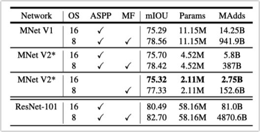

# MobileNets: Efficient Convolutional Neural Networks for Mobile Vision Applications

*本文提出了一种专门针对移动端和嵌入式设备的高效网络MobileNets，使用深度可分离卷积的流线型架构。并设置了两个参数width multipliers和resolution multipliers用于灵活调节模型大小，以适配不同计算力的要求。MobileNets在不同应用领域（分类、检测、人脸、地理定位等）都取得了优异的表现。*

MobileNets使用的深度可分离卷积（depthwise separable convolutions）最初是L. Sifre在博士论文中提出，后来在Inception网络中也使用过。在MobileNets之前，已经有一些轻量级网络的设计，比如基于分解卷积（factorized convolutions）的Flattened networks和Factorized Networks。以及Xception和Squeezenet等。

### Architecture

深度可分离卷积也是分解卷积的一种，把一个标准卷积分解为depthwise卷积和1x1的pointwise卷积。每个depthwise只对input的一个channel做特征filter，然后用1x1的pointwise把depthwise的输出组合起来。标准卷积把filter和组合一起做了，深度可分离卷积则分解成了两步。正是这个分解大幅减小了模型体积和计算量。

对于DF×DF×M的输入和DF×DF×N的输出，标准卷积（大小为DK × DK）的计算量为DK × DK × M x N x DF × DF。深度可分离卷积只需要DK × DK × M x DF × DF + M x N x DF × DF 。比值为

MobileNets使用3x3的卷积，比标准卷积减少8~9倍的计算量。

除了第一层使用全卷积之外，MobileNets其他层全部使用的深度可分离卷积。结构图如下（注意除了最后的FC层，其余每一层后面都跟了BN和ReLU）。把depthwise和pointwise算两层的话，MobileNets共28层。

深度可分离卷积的具体结构：

MobileNets架构设计不仅仅只减少了乘加数（Mult-Adds），还在于深度可分离卷积可以被高效实现。<u>通常非结构化的稀疏矩阵不会比稠密矩阵计算快，而深度可分离卷积的计算量大部分集中于1x1的稠密矩阵。因此可以被高度优化的通用矩阵乘计算库GEMM高效实现。不仅如此，标准卷积在用GEMM计算之前，都会先做一次内存重排（im2col，防止频繁的缓存miss），而1x1卷积不需要重排。</u>

==MobileNets 95%的计算量和75%的参数都集中在1x1卷积（剩下的大部分在FC），这就是MobileNets为什么运行效率这么高的原因。==

由于小型网络有更少的overfitting可能，训练MobileNets的时候不需要大模型那么多正则和数据增强技术。作者发现，<u>最好对depthwise用极少或者不用weight decay，毕竟depthwise本身参数很少。</u>

### Width Multiplier

虽然MobileNets已经很小，但还可以通过width multiplier α变得更小，以达到准确率和计算量之间的tradeoff。width multiplier 把每层均匀地缩小，也就是把channel数M变成αM。整体计算量变为：

α通常设为1, 0.75, 0.5 和 0.25。设为1的时候就是标准的MobileNets（baseline）。width multiplier把计算量和参数量大致缩小了α^2。

### Resolution Multiplier

Resolution Multiplier ρ用于缩小输入图片的尺寸，这样每层的表征图都同步缩小ρ。

常用的输入尺寸是224, 192, 160 和 128。Resolution Multiplier把计算量大致缩小了ρ^2。

标准卷积、深度可分离卷积、深度可分离卷积的缩小版之间的计算量和参数量对比：

### Experiments

**和标准卷积对比**：准确率降低1%，计算量和参数量减少非常多。

**把MobileNet变瘦（通过width multiplier）和变窄（去掉一些中间层）的对比**：变瘦比变窄好3%。

**不同width multiplier的对比**：α设为0.25时，准确率掉的很快

**不同resolution multipliers的对比**：准确率下降比较平滑

由α ∈ { 1, 0.75, 0.5, 0.25 }和resolutions { 224, 192, 160, 128 }构成的16个模型的对比：大致成对数线性，除了α=0.25的时候。

**与GoogleNet、VGG、Squeezenet、AlexNet的对比：**

此外，在细粒度图像分类、大规模地理信息定位（Large Scale Geolocalizaton）、人脸属性识别（Face Attributes，结合蒸馏技术）、物体检测、人脸识别（Face Embeddings）等领域都取得了很好的效果，具体数据就不放了。

# MobileNetV2: Inverted Residuals and Linear Bottlenecks

*本文提出了一种新的移动端模型MobileNetV2，刷新了移动端模型的SOTA。基于此提出了改进后的移动端物体检测模型SSDLite和移动端语义分割模型Mobile DeepLabv3。*

*作者发现删掉窄层后的非线性函数（比如ReLU）是很重要的，因为它会破坏表征能力。基于这一点，作者提出了MobileNetV2的主体结构：inverted residual structure（倒置残差结构），其中的feature不接非线性层。*

*同时，inverted residual structure的特殊结构使得它可以让它的input和output解耦出不同的功能，为后续网络的分析和改进提供了便利的框架。*

本文的主要贡献是提出了一个叫inverted residual with linear bottleneck的结构。输入是一个低维压缩后的表征图，先把它扩展到高维，用depthwise卷积做特征filter之后，再用一个线性卷积投影回低维表征。

inverted residual中的主要结构之一是MobileNetV1的深度可分离卷积，作用和MobileNetV1中一样。

### Linear Bottlenecks

Linear Bottlenecks是inverted residual中的另一个重要结构。其实就是在做完1x1卷积后不接非线性激活函数。所以叫Linear Bottlenecks。这里要说一下为什么不用非线性激活函数。

一张`h*w*d`的图片，可以视为`h*w`的像素的集合。每一层的activations（激活值）也可以视为一个『兴趣流形（manifold of interest）』。一直以来我们都假设『兴趣流形』是可以用一个低维子空间来表示的（比如一张图片的信息可以用FC层的一维向量来表示）。利用这一点，我们可以减少中间层的维度channel。MobileNetV1的width multiplier就是这么做的。理论上，我们可以一直压缩原空间，直到『兴趣流形』充满整个子空间。但是这里有个重大的问题是，非线性函数（比如ReLU）会破坏这个过程！

很容易看到，在ReLU转换时，只有经过它的非零区间的点才能得到线性转换。换句话说，经过ReLU后会丢失信息。但是，如果输入有很多维度，某一个channel的信息丢失也问题不大，因为可以在别的channel找回来。用下面的实验说明：

<u>当input维度较高（15~30）时，ReLU转换能保留较多信息。低维度下信息损失很严重，被互相折叠在一起。</u>

基于以上的分析，我们就得到了MobileNetV2的设计思路：<u>使用linear bottleneck将『兴趣流形』压缩（或者叫捕捉）到低维空间，为了避免信息损失，后面不接非线性层，如果要接ReLU的话，先经过expansion layer扩展到高维。</u>

关于移除非线性对提升神经网络表现的提升还可以参考论文《Deep pyramidal residual networks》。

### Inverted residuals

Inverted residuals把深度可分离卷积、expansion layer、linear bottleneck和shortcut组合在一起。

expansion用于升维，depthwise（包含 relu）提取filter，1x1卷积做投影。注意，1x1卷积后面没有ReLU，所以是linear bottleneck。最后阴影线的层就是『兴趣流形』所在的低维空间。低维空间之后又是expansion+relu，避免直接接 relu 破坏信息。

具体结构如下，t为扩展倍数expansion factor。

### Information flow interpretation 

Inverted residuals的一个特征是把输入域（bottleneck layer）和输出域（transformation layer）分离开来。前者代表每一层的容纳力（capacity），后者代表表征力（expressiveness）。传统卷积，包括可分离卷积的容纳力和表征力都是混合在一起的（都是output layer的depth的函数）。

这个分离可以让我们脱离容纳力，单独分析表征力。这些分析可以帮助我们更好的理解神经网络的属性。

### Architecture

第一层使用全卷积，后接19个Inverted residuals。使用ReLU6作为激活函数，因为它对于低精度下（比如8bit）计算有较好的鲁棒性。expansion factor设在5~10之间，每层的expansion factor相同。

MobileNetV1的width multiplier和resolution multiplier也用在MobileNetV2上，resolution在96 ~ 224之间，width在0.35 ~ 1.4之间。对于小于1的width multiplier，不应用于网络非常靠后的层，这样可以提升一些小模型的表现。

### Memory efficient inference

Inverted residuals提供了一个内存友好的实现，对于移动端应用很有意义。

标准的推理引擎框架，比如TensorFlow和Caffe，在构建有向无环计算图的时候，会从众多图中选择让所有tensor占用内存最少的图。满足：

简单来说，总内存就是所有算子的input和output的size之和。如果我们把bottleneck residual block当做一个算子，这个算子占用的内存由bottleneck的tensor决定，而不是block内部的其他tensor（size大很多）。

Inverted residuals的主体部分`ReLU6 ◦ dwise ◦ ReLU6`是一个per-channel变换。所以其中的tensor可以表示为t个tensor的串联，每次只需要n/t大小的size的tensor存在内存中。n=t的时候，即只提取一个channel的tensor在内存。这种方式叫『t-way split』。t最好在2~5之间，分割太多容易造成缓存未命中。

Inverted residuals的特殊结构使得这种内存优化trick成为可能，在其他卷积结构中难以使用。

### Experiments

**与MobileNetV1, ShuffleNet and NASNet-A对比**

**目标检测对比**：比YOLOv2快20倍，体积小10倍，且准确率更高

语义分割对比（作为DeepLabv3的backbone）：

### Ablation study

（a）非线性的重要性

（b）shortcut应该连接bottlenecks

# Searching for MobileNetV3

*MobileNetV3由硬件感知网络结构搜索（NAS）、NetAdapt搜索算法和手工设计网络架构共同完成。本文展示了如何用自动化搜索算法和手工设计两种互补的方式达到超越SOTA的模型。通过这种方式创建了MobileNetV3-Large and MobileNetV3-Small两个模型，适用于计算资源高/低的场景。MobileNetV3-Large比MobileNetV2提高3.2%的准确率的同时，降低20%的时延。MobileNetV3-Small在于MobileNetV2时延相同的情况下，准确率提高6.6%。*

强化学习最先被用来搜索高效的网络，达到较好的准确率。但一个完整的搜索空间非常巨大。早期的工作仅对cell级别的结构搜索，然后应用于整个网络。最近，Mnasnet有探索block级别搜索，并在不同layer之间搜索不同结构。<u>为了减少搜索时间，DARTS，Proxylessnas和Fbnet等都使用了基于梯度的优化算法。为了把现有网络适配到移动端平台，Netadapt等提出了自动化网络简化算法。</u>

MobileNetV3结合了MobileNetV1、MobileNetV2和MnasNet的结构来构造block，激活函数升级为hard-swish。MobileNetV3使用硬件感知NAS搜索网络，并用Netadapt算法优化filter数量。

### Platform-Aware NAS for Block-wise Search

使用和MnasNet一样的搜索配置，并直接把MnasNet-A1作为初始的Large模型，然后基于此修改。搜索过程中，发现对小模型不友好，作者把weight factor w 设为 −0.15。

### NetAdapt for Layer-wise Search

NetAdapt是platform-aware NAS的辅助方法，以一种迭代的方式对layer做微调。具体参考NetAdapt论文。过程简单表述：

1. 选择一个platform-aware NAS找到的初始网络

2. 对于每次迭代：

3. 1. 生成一系列proposal网络，每个proposal网络都在上个迭代的网络的基础上进行修改，以至少减少δ的时延
   2. 对这些proposal网络fine-tune训练T步，达到接近原始的准确率
   3. 根据某些标准从中选择最优的网络，并作为下个迭代的初始网络

4. 重复以上迭代，直到达到目标时延为止。

原始论文中选择与原始网络准确率差距最小的网络作为最优标准，本文将这个标准修改为时延变化值与准确率变化值之间的比值。

proposal网络有两种策略：

- 减少任何一个expansion layer的大小
- 减少bottleneck的大小（对于共享bottleneck大小的block批量修改，以保持残差结构）

实验发现T=10000和δ=0.01L（L是初始网络的时延）最好。

以上是NAS的部分，接下来是人工设计对网络结构的优化。包括对网络开头和末尾计算量大的层的修改（这些修改在搜索空间之外）以及新的激活函数h-swish的应用。

### Redesigning Expensive Layers

**对网络最后几层的修改：**

先把1280那一层放到pool层后面，然后发现不需要前面的1x1的投影层和3x3的filter层了。这个操作大约减少11%的运行时间，几乎没有准确率损失。

**对网络第一个filter层的修改：**

很多移动端模型都在网络第一层采用32个3x3 filter，这些filter很多时候产生镜像的特征。作者尝试了减少filter和使用其他激活函数的方法来减少重复。最终选择了16个filter和hard swish激活函数。

### Nonlinearities

Google在《Searching for Activation Functions》提出的swich激活函数替代ReLU，提升了神经网络的表现。定义为x与sigmoid(x)的积：

由于sigmoid函数在嵌入式设备上难以计算，作者将其改成了hard-swish的形式：

对比如图：

用ReLU6的好处不仅在各种软硬件上计算友好，而且也量化友好，还因为是piece-wise函数可以减少内存带宽（参考MobileNetV2）。

作者发现使用swish的收益大多在网络深处，所以只在网络后半段使用h-swish函数。

其他修改还有将squeeze-and-excite bottleneck的大小固定为expansion layer的channel数的1/4。

最终的Large和Small模型结构如下

### Experiments

浮点数模型的对比：

量化模型的对比：

Large、Small、V2的对比：

不同width/resolution multipliers的对比：

物体检测和语义分割的实验对比见原论文，这里不放了。

### Ablation study

**h-swish的作用**：比ReLU准确率高，比原始swish更快

**其他模块的影响**：

