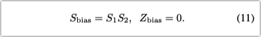

减少模型大小计算量，有两种方式

- 设计计算/内存友好的网络，如MobileNet , SqueezeNet , ShuffleNet , and DenseNet
- 将权重和（或）激活值从32位浮点数量化到低比特

在此之前，已经有TWN、BNN、XNOR-net等量化方法，但它们存在两个问题：

1. 没有使用让人信服的baseline。它们使用的AlexNet、VGG等本身就包含大量的冗余参数，因此很容易通过优化得到性能提升。使用MobileNet这种本身就很高效的模型会更有说服力。
2. 很多方法没有在真实硬件上测试。有些方法只量化权重，压缩了模型体积，但不关心推理速度。有些方法将权重和激活值都量化至1 bit，导致准确率下降很厉害。

==本文在准确率和性能之间取得了很好的tradeoff，主要贡献有：==

- <u>提出一个量化模式</u>（quantization scheme）：把权重和激活值都量化到8位整数，少数的bias量化到32位整数
- <u>提出一个纯整数量化推理框架</u>（quantized inference framework），以及在ARM NEON上的高效实现
- <u>提出一个量化训练框架</u>（quantized training framework），最小化量化损失

展示了MobileNets系列的量化模型在ARM CPU上分类、检测和其他任务上的显著提升效果

## 量化模式 Quantization scheme 

这个quantization scheme同时应用在量化推理（整数）和量化训练（浮点数），首先作一个数学上的严格定义。

r表示实数，q表示量化值。相当于一个仿射变换（affine mapping）：


S和Z是量化参数。<u>每一组权重array和激活值array都有其各自的量化参数。</u>

- S（scale）是一个浮点数。后面会介绍怎么把它转为整数表示。
- Z（zero-point零点 ）是整数。是实数0.0的精确映射。**将0精确映射是必要的**，比如经常会使用的zero-padding 。


QuantizedBuffer的数据结构：

```c
template<typename QType>  // e.g. QType=uint8
struct QuantizedBuffer {
	vector<QType> q;          // the quantized values
	float S;                  // the scale
	QType Z;                  // the zero-point
};
```


## 纯整数矩阵乘 Integer-arithmetic-only matrix multiplication 

通过量化模式（公式（1））可以得到实数转量化值的方法：$q=r/S + Z$，但是这里的S是浮点数，得到的q也是浮点数，如何进行量化推理呢？作者提出的解决方案如下。

假设使用两个N * N大小的浮点数矩阵r1，r2，计算其乘数r3，量化参数（已知）为$(S_α, Z_α)$, α = {1,2,3}。i行j列（1 <=i, j <=N）的实数元素为$r_α^{(i,j)}$，量化元素为$q_α^{(i,j)}$。计算矩阵乘 r3 = r1r2 过程如下。

1）根据公式（1），有：


2）根据矩阵乘法公式，有：


3）得到：


4）这里的M是：


5）这样就把浮点数S单独提取出来，并进一步用整数近似表达M：

式子（4）中，唯一的非整数M只和S有关，可以提前计算好。作者经验性地发现M总是处于(0,1)之间，可以把M规格化表示（normalized form）如下，其中$M_0$在[0.5,1)之间，n是一个非负整数。


> 这个规格化表示是由[frexp()函数](https://www.runoob.com/cprogramming/c-standard-library-setjmp-h.html)生成的。

$M_0$可以用int16或int32的定点整数（根据硬件能力而定）来表示，比如$M_0$的int32表示是最接近 $2^{31}*M_0$的整数 。因为$M_0$在[0.5,1)之间，所以它至少是 $2^{30}$ ，至少有30位的表示精度。这个精度误差在硬件可表达范围内已经非常小，通过这种方法用近似整数代替了浮点数M进行运算，举例如下。

比如$M_0$=0.51，其int32表示为$2^{31}*0.51 = 1095216660.48 \approx 1095216660$，这样 $M*x = 2^{-n}M_0*x$ 就可以表示为  $2^{-n}*(1095216660 * x) / 2^{31}=2^{-n-31}*(1095216660 * x)$。

$2^{-n-31}$可以用位移操作实现，见Appendix B。

## Efficient handling of zero-points

为了提高式子（4）的计算效率并避免把运算扩展到16位整数，把（4）写成：


$a_1, a_2$的时间复杂度为$O(N^2)$。实际上，除了下面的式子（9）为$O(N^3)$，其他所有项都是常数项很小的$O(N^2)$。


从而把问题规模下降到式子（9）的水平，和其他没有零点Z的量化方案一样。

## 矩阵乘加入偏置和激活Implementation of a typical fused layer

接下来把bias和activations加入到上面的矩阵乘计算中。把这些layer融合在一起不只是优化，因为融合算子的粒度，在推理和训练（fake quantization）中必须保持一致。

> Google在ARM和x86 CPU架构中使用gemmlowp库实现融合计算。

用uint8表示权重和激活值（int8也可以，需要修改一下零点），权重和激活值的乘积和需要一个int32的累加器（避免overflow）。


对bias的量化模式：

- 用int32表示数据，可以直接加到int32的累加器上
- 用0表示零点
- scale和累加器的scale相同，都是$S_{weights}*S_{activations}$



> 为什么是$S_1*S_2$？因为weights和activations的乘积的scale是 $S_1*S_2$，bias的scale和累加器保持一致，方便反量化。

虽然bias被量化为int32，但它们只占参数量的一小部分。而且每一个bias作用在全部激活值上，bias的量化误差会放大为整体误差（比如非零均值的误差项），因此用较高精度的int32表示可以避免这类问题。

int32的累加器计算完成后，把它的结果：

1. scale down（缩放）to 8bit 
2. （saturating）cast down (转换）to uint8
3. 应用激活函数产出8bit 激活值


我们关心的截断类激活函数（比如ReLU、ReLU6），把uint8 数据截断在[0,255]的子区间内。但是，量化训练过程倾向于学会利用[0,255]的整个区间，使得激活函数没有发挥作用。

## 量化训练 Training with simulated quantization

一种常用训练量化网络的方法是先训练浮点数模型再进行量化（有时候fine-tune一下），对于大模型有用，但对小模型有显著的准确率损失。可能的原因：

1. 不同channel之间weights的数值范围差异太大（超过100倍），因为同一layer的所有channel的量化参数相同，那些数值范围较小的channel就有较大的相对误差（因为scale是按照数值范围的最大最小值确定的）
2. 离群值的存在使得其他值在量化后都丢失一些精度

作者提出了一种在训练的前向计算过程中模拟推理时的量化效果的方法。但反向传播不变，weights和bias还是以浮点数存储，这样可以进行微量梯度更新。具体方法就是 *[纯整数矩阵乘](#纯整数矩阵乘 Integer-arithmetic-only matrix multiplication )* 中所描述的。

- 在weights和input计算前对它做量化。如果有batch normalization，把BN的参数融合进weights中一起量化
- 激活函数产出activations后对activations做量化
- 训练过程不对bias做量化，因为bias本身精度较高（int32），且量化参数来源于weights和activations。见*[矩阵乘加入偏置和激活](#矩阵乘加入偏置和激活Implementation of a typical fused layer)*

对每层Layer的参数，其量化参数取决于quantization levels和clamping range。确定量化参数后，再逐个对参数进行量化过程：


r是实数值，[a:b]是量化范围，n是quantization levels，比如8bit量化，n = $2^8$ = 256。


> 模拟量化训练的作用：如果量化精度损失较大，那么量化再还原后就会与原始值差异较大，通过训练过程中对weights和clamping range的调整使其精度损失最少。
>
> 比如0.22和0.44量化变成8，再还原后变成了0.30，和原始数据有差异。

### Learning quantization ranges

对于weights和activations，量化范围的选择是不同的。

- 对于weights：直接设a=min w；b=max w。对于int8表示，只取[-127,127]，舍弃-128，能取得较大的优化机会，见Appendix B。
- 对于activations：范围取决于输入数据的数值范围，在训练过程中对其做指数移动平均（EMA），获得范围值。刚开始训练的一段时间内不对EMA做更新，因为数值范围波动太大。这样可以获得更稳定的状态。

> 训练中量化有持续的输入数据获得activations的良好的range。训练后量化则可以事先跑小批量数据来获取range，这个过程叫校准（calibration）。

基于TensorFlow的量化训练完整流程如下：


> 插入伪量化节点、优化前向计算图和低比特推理代码参考：[Tensorflow quantized training support.](https://github.com/tensorflow/tensorflow/tree/master/tensorflow/contrib/quantize)

插入伪量化节点的计算图示例1：卷积层


示例2：bypass 连接


### BN折叠 Batch normalization folding

BN层在训练中作为单独的layer，但在推理中是和卷积或全连接层融合起来的（提升效率）。为了准确模拟推理过程，量化训练的时候需要模拟BN融合的过程，并对融合后的weights做量化。


γ是BN的scale，EMA是移动平均值，ε是一个保证数值稳定的小常量。简单来说，就是把EMA后的BN参数融合进卷积层中。融合（fold）过程可以[参考这里](https://zhuanlan.zhihu.com/p/110552861)。

计算图示例：


## 实验 Experiments

7位量化效果和8位量化差不多，使用ReLU6比ReLU精度更好。


weights比activations对位宽降低更敏感；当总体位宽相同时，让weights和activations保持一样的位宽更好。


## 总结

作者提出了一种量化模式，仅依赖整数运算即可近似浮点数计算的结果。通过加入模拟量化的训练使得模型准确率接近浮点数模型的水平，但减少4x的模型体积、计算量。计算效率可以通过ARM NEON进一步提升。常见CV模型在通用ARM CPU上的延迟和准确率之间达到了SOTA的平衡。这种量化模式+高效的计算体系架构的结合说明：纯整数算术推理是推动视觉识别技术进入实时识别和低性能手机市场的关键因素。


## 特殊层处理 Layer-specific details

- tanh、softmax等函数，其定点实现和浮点实现差不多，因此不必使用查询表。
- 一些网络有Addition层，把两个input简单相加。处理量化值的时候略微麻烦一些，因为两个input的scale参数不同，要把其中一个input 通过定点乘数$M=S_1/S_2$ rescale到另一个input的scale。然后Addition对这些整数简单相加即可。
- 关于concat layer：concat和Addition一样面临rescale问题。但concat不使用rescale这种有损运算，而是规定concat的所有input和所有output都保持相同的量化参数，避免这个问题。