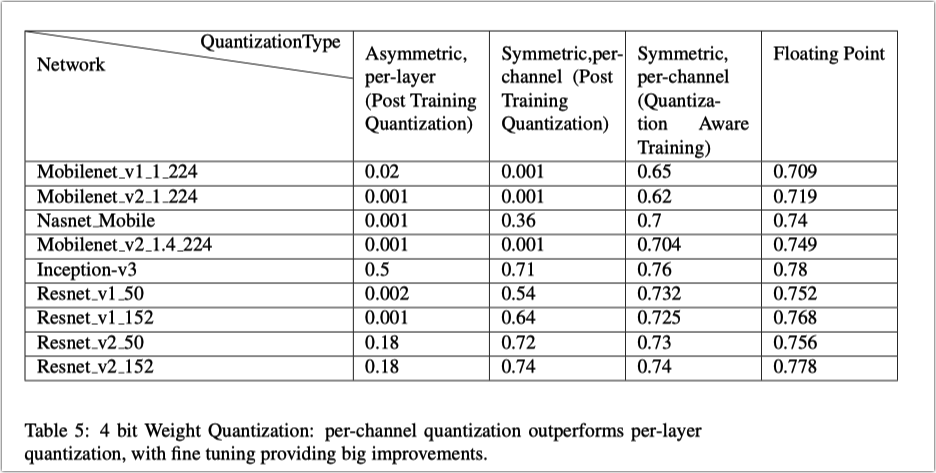

本文是CNN网络整数权重和激活值的量化技术综述：

1. 使用per-channel weights（权重）和per-layer activations（激活值）的量化方式，经过训练后量化为8bit之后，大部分分类网络的准确率损失在2%以内
2. 仅对weights做量化（8bit），就能将模型大小缩小为1/4。不需要8bit硬件计算能力支持。
3. 在通用CPU上，量化模型有2-3倍的加速，在一些支持SIMD定点计算硬件（比如高通QDSPs with HVX）上可以达到10倍。
4. 量化感知训练可以进一步把8bit准确率损失减少到1%。4bit的准确率损失在2%~10%。
5. 介绍TensorFlow和TensorFlowLite量化工具的使用
6. 量化感知训练的最佳实践
7. 推荐per-channel weights和per-layer activations量化模式，以便于硬件加速和内核优化。并建议硬件处理器支持4,8和16位运算。

## Introduction

减少模型体积、提高推理速度、减少功耗的方法：

1. 设计高效的网络架构，MobileNets等
2. 应用量化、剪枝和压缩等技术
3. 低精度推理内核优化，比如GEMMLOWP，Intel MKL-DNN, ARM CMSIS , Qualcomm SNPE , Nvidia TensorRT以及其他专用计算设备

其中最简单的方法之一就是降低模型数值精度，优点如下：

- 与网络结构无关，广泛应用与各种模型和场景。
- 无需其他条件，就可以大幅减少模型体积、内存和缓存占用、功率消耗
- 很多计算处理器对8bit量化数据计算速度非常快。

一般情况下，降低精度可以提高2-3x的推理速度、内存访问。在一些针对低精度计算优化的硬件加速器上可以得到进一步提升。

## 量化形式 Quantizer Design 

讨论均匀量化（uniform quantization）的几种实现形式：仿射量化，对称量化、随机量化

### 均匀仿射量化 Uniform Affine Quantizer 

也叫做非对称量化。把范围为(x min, x max)的浮点数量化到 (0, $N_{levels}− 1$) 的整数范围。对于8bit量化，$N_{levels}$ = 256。量化参数为Scale (∆) 和 Zero-point(z)。

> 详见《Quantization and Training of Neural Networks for Efficient Integer-Arithmetic-Only Inference》

对于单边分布：(x min, x max)需要包含0。比如(2.1,3.5)需要扩充到(0,3.5)。对于极端的单边分布，可能造成精度损失。

scale 和 zero-point确定后，量化过程如下：

反量化：

零点的存在会增加额外的计算开销，以2D卷积（x是激活值，w是权重）为例：

因为零点的存在，增加了红色框部分的计算，使得计算量是原来的3倍。但这部分是可以优化的，因为权重是常数（第二个框，可以预先计算），所有卷积核使用的同一个激活值的累加和（第一个框，避免重复计算）。详见：[Gemmlowp:building a quantization paradigm from first principles.”](https://github.com/google/gemmlowp/blob/master/doc/quantization.md#implementationof-quantized-matrix-multiplication.)

### 对称量化 symmetric quantizer 

对称量化是仿射量化的简单形式，零点固定为0：

为了SIMD快速实现，可以把weights的范围缩小：

> 详见《Quantization and Training of Neural Networks for Efficient Integer-Arithmetic-Only Inference》Appendix B。

反量化：

### 随机量化 Stochastic quantizer 

给量化器添加随机变量：

反量化和（3）相同。

由于大部分硬件不支持，这种方法不考虑。

### Modeling simulated quantization in the backward pass

量化感知训练中，插入伪量化节点（量化后接反量化）模拟量化效果：

由于伪均匀量化函数的导数为0的情况几乎到处都是，在反向传播过程中加入近似方法是必要的。如下：

> 详见论文《Binaryconnect: Training deep neural networks with binary weights during propagations》、[Straight-through estimator (STE) 解读](https://zhuanlan.zhihu.com/p/570322025)

如图：

### 确定量化参数 Determining Quantizer parameters 

确定量化参数有不同的方法，TensorRT使用最小化KL散度的方法。本文采用更简单的方式：对于weights，直接采取实数min-max来确定。对于activations，使用batch间的移动平均的min-max来确定。对于训练后量化，谨慎选择量化参数以提高准确率。

### 量化粒度 Granularity of quantization 

- per-layer量化：对整个tensor量化
- per-channel量化：为tensor的每个kernel单独量化

比如多个3维卷积核组成的4维tensor，per-channel量化为每一个卷积核计算单独的量化参数。

per-channel量化不适合用于activations，因为会让它们的内积计算变得复杂。如图所示：

注意$S_{acc} = S_{weights}*S_{activations}$。每个累加器和weights的一个channel是对应的，因此不需要累加器做额外调整。但累加器需要不断地调整$S_{acc}$（rescale）以适配不同的$S_{x1,x2,x3,x4}$。

## 训练后量化 Post Training Quantization 

比较不同的量化模式（仅量化权重/同时量化权重和激活值、对称/非对称量化、per-layer/per-channel量化）之间的效果差异。

实验结果表明per-channel + 非对称量化模式在大部分网络模型中接近于浮点数的准确率。

### 仅量化权重

不量化激活值，所以不需要校准数据输入。这种方法适合只需要减少模型体积，不关心推理速度的场景。

per-channel + 非对称量化，取得最佳效果：

### 同时量化权重和激活值

量化激活值需要校准数据来计算激活值的动态范围，需要大概100 个mini-batches的数据。

per-channel weights + per-layer activations + 非对称量化，取得最佳效果：

结论：

- per-channel 量化可以提供很好的准确率，可以成为训练后量化的baseline。配合非对称量化接近于浮点数的准确率。

- activations可以几乎无损量化到8bit。activations的动态范围很小的原因是：

- - 不带scale的Batch normalization：使得所有activations都处于zero mean and unit variance分布。
  - ReLU6：把activations限制在（0,6）的范围，剔除范围之外的数

- 参数量较大的网络如ResNets和Inceptions比参数量较小的网络如MobileNets对量化更鲁棒

- 如果对weights做per-layer量化，精度下降很多，尤其是MobileNet架构

- 几乎所有的量化精度损失都来自于weights量化

<u>对weights做per-layer量化造成的精度损失主要原因是batch normalization，使得同一layer的不同kernel之间的动态范围差异过大。per-channel量化可以规避这个问题。</u>详见Appendix A。但是activations仍然是per-layer量化。

weight正则化的方法也可以提高量化精度。详见论文《A quantizationfriendly separable convolution for mobilenets》

## 量化感知训练 Quantization Aware Training 

量化感知训练比训练后量化提供更高的准确率。即使采用per-layer量化也可以获得高准确率。在4bit上也获得显著的提升。

量化感知训练是在训练过程中添加伪量化节点。注意weights还是以浮点数形式保存和梯度更新以防止underflow。weights更新完后再被量化，参与下一轮计算。对于SGD：

训练过程如下（以TensorFlow为例）：

1. 从一个预训练模型Fine tune（推荐）或者从头训练模型
2. 修改Estimator添加量化节点
3. 模型训练完成后，获得所有量化参数信息（weights和activations的scale、零点）
4. 使用TOCO转为量化模型，包括被量化之后的weights以及用于activations量化的参数信息
5. 使用TFLite运行量化模型（NN-API或者CPU）

### **Operation Transformations for Quantization**

训练过程中谨慎处理量化相关的操作很重要，以保证一些容易被忽略的运算比如addition、concatenation运算正确。

> 见《Quantization and Training of Neural Networks for Efficient Integer-Arithmetic-Only Inference》Layer-specific details。

另外，确保训练期间对算子的融合操作是合理的。比如许多框架在推理时会把add和ReLU融合在一起，那么量化训练的时候就不要在它们之间插入量化节点。

### Batch Normalization

量化BN的一些策略。

Batch normalization是一种常用技术，归一化每层的activations输出，减少各层之间的依赖，提高模型稳定性和准确率。

BN定义（训练）：

推理：

µ B和σ B是batch的均值和方差，µ 和σ 是训练中EMA之后得到的常数值。

推理过程中，没有单独的BN层，而是把BN与weights融合在一起：

这样计算W*x+b的时候，把BN一起计算了。

计算图示例：

训练过程中，BN使用的batch的统计值，推理时使用的是long term（训练过程中EMA之后）的统计值。batch之间的差异可能带来weights量化的抖动并降低模型的准确率。一种简单的方法是在训练过程中也使用EMA，但这会削弱BN的作用，使训练过程不稳定。使用如下的方法可以消除BN在训练和推理之间的mismatch：

1 在量化之前，使用一个与long term统计量关联的修正系数对weights做scale。避免batch带来的抖动。

2 在训练的初始阶段，撤销对weights的scale操作，回到标准的BN

3 经过充分的训练后，使用移动平均的统计值（freeze_bn_delay）代替batch统计值。注意freeze_bn_delay这个值是不变的，以避免训练不稳定。

计算图如下：

### Experiments

感知训练消除了量化与浮点数模型之间的差距。即使是per-layer weights量化。

实验设定

- 使用同一个模型fine tune
- 使用SGD做fine tune，step为1e-5

实验结果

1. 使用对称量化和非对称量化没有差距
2. 可以使用更简单的量化模式（比如per-layer）来获得接近浮点数的准确率

量化感知训练和训练后量化的对比：

不同量化模式的感知训练之间的对比：

### Lower Precision Networks

在更低精度网络下，感知训练提供了更大的优势。

**Experiment : 4bit weights，8bit activations**

- per-channel量化比per-layer量化显著更好（第2,3列），8bit下则差异不明显
- fine-tune带来显著的提升，与8bit量化也只有5%的差距（第4列）

**Experiment : 8bit weights，4bit activations**

- 低精度的activations带来的损失比低精度weights更大（activations在不同图片间产生随机量化误差，而weights是确定性的）

## 训练最佳实践 Training best practices 

**随机性量化（Stochastic quantization）在训练和推理过程有较大的差异，表现不如确定性量化**

**从一个checkpoint fine tune比从头训练新模型有更高的准确率**

> 参考论文《Apprentice: Using knowledge distillation techniques to improve low-precision network accuracy》、《Distilling the Knowledge in a Neural Network》

**与推理过程match的Batch normalization（correction and freezing）减少了抖动且提高准确率**

**谨慎使用指数移动平均（EMA）**

浮点数模型训练经常使用weights的移动平均来提高准确率。量化感知训练过程中，weights收敛于量化的决策边界，weight很小的变化在EMA作用下也会变得很大并造成量化值的显著差别，从而降低准确率。（下图红色曲线）

## 模型结构建议 Model Architecture Recommendations

**不要限制激活函数的范围**

用ReLU替换ReLU6，让训练过程自己选择激活范围，可以取得准确率的小幅提升。

把mobilenet-v1的ReLU6替换为ReLU后的准确率变化：

**width和bit之间的tradeoff**

可以在MobileNet的depth multiplier和量化精度之间做tradeoff。在差不多准确率下，选择更大的depth multiplier以及更小的量化bit，能降低更多（25%）的模型大小。

0.5的depth是0.25的差不多6倍大小，但4bit量化是32位浮点数的1/8大小。

## 神经网络加速器建议 Neural network accelerator recommendations

为了充分发挥量化网络的效用，建议神经网络加速器考虑：

- 尽可能的算子融合：减少计算耗时、内存和资源占用
- 压缩内存访问：低精度存储weights，支持随时解压weights。
- 低精度计算：支持4,8,16位的计算。4,8位处理分类任务，高精度处理回归任务，比如超分辨率和HDR。
- 逐层选择位宽：许多网络层可以更低精度表示，提供逐层选择的灵活性可以进一步加速模型
- per-channel 量化：支持per-channel量化是很重要的

## 总结 Conclusions

Quantizing models

- 在训练后量化中使用非对称 + per-channel量化，如有准确率损失可以加入fine tune。
- 量化感知训练可以进一步缩小与浮点数模型的差距

Performance

- 在通用CPU上，量化模型有2-3倍的加速，在一些支持SIMD定点计算硬件（比如高通QDSPs with HVX）上可以达到10倍。
- 使用均匀量化可以无损减少4x模型体积，其他非均匀量化技术如K-means可以提供更高的压缩

Training Techniques

- 量化感知训练的前向计算过程要与量化推理过程匹配
- 对BN层进行特殊处理
- 随机量化表现不如确定性量化
- 训练过程中谨慎使用weights的EMA

Model architectures for quantization

- 更大的模型对量化误差更容忍
- 在一个简单的网络结构中，对featuremap和量化精度做tradeoff：选择更大的featuremap、更低的量化精度。
- 不对激活值范围做限制可以提高量化准确率，比如ReLU比ReLU6更好。

## further work

- 应用正则化技术控制weights和activations的动态范围，能提供进一步的提升
- 蒸馏训练进一步提高量化模型的准确率
- 让per-layer量化提供硬件上进一步的压缩和性能，强化学习已经成功应用在这一问题上。详见论文《ADC: automated deep compression and acceleration with reinforcement learning》